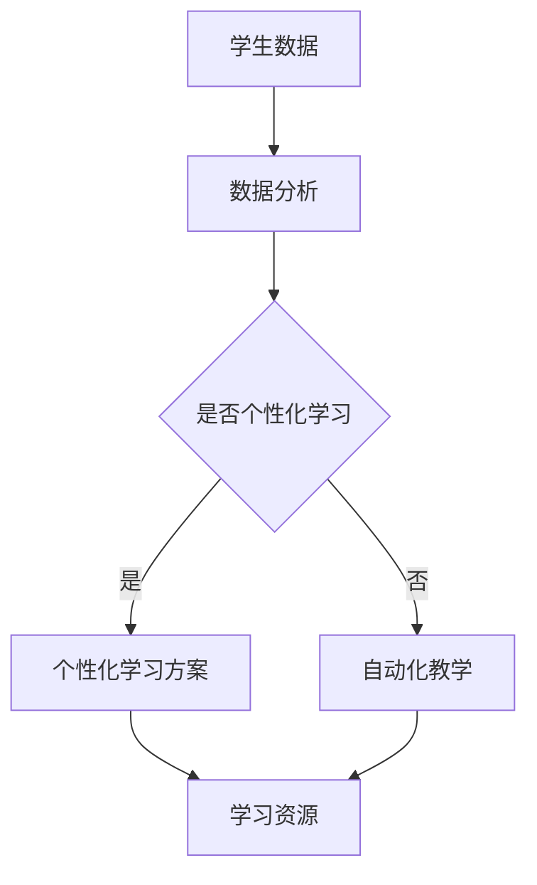

                 

关键词：人工智能，教育，技术变革，个性化学习，未来趋势

> 摘要：随着人工智能技术的迅猛发展，教育领域正经历着一场前所未有的变革。本文将探讨人工智能对教育的影响，以及如何在教育中有效地应用人工智能，实现个性化学习，提高教育质量和效率。

## 1. 背景介绍

在过去的几十年里，人工智能（AI）技术已经取得了显著的进展。从简单的规则系统到复杂的机器学习算法，再到深度学习模型，AI 在各个领域的应用越来越广泛。教育领域也不例外，AI 技术正在逐步改变传统教育的模式，推动教育向更高效、更个性化和更智能的方向发展。

首先，人工智能可以帮助教师更好地了解学生的学习情况，从而提供更加个性化的教学方案。其次，AI 可以自动化一些重复性的教育任务，如考试评分、作业批改等，从而释放教师的时间，让他们能够专注于更有创造性和互动性的教学活动。此外，AI 还可以提供更加丰富的学习资源和工具，帮助学生更有效地学习和掌握知识。

## 2. 核心概念与联系

### 2.1 人工智能在教育中的应用

人工智能在教育中的应用可以分为几个主要方面：

#### 2.1.1 个性化学习

个性化学习是指根据学生的兴趣、能力、学习风格等个性化需求，提供定制化的学习方案。人工智能可以通过分析学生的学习行为和成绩数据，为学生推荐适合他们的学习资源和教学策略。

#### 2.1.2 自动化教学

自动化教学是指利用人工智能技术，自动化完成一些教学任务，如自动评分、自动教学等。这可以大大减轻教师的工作负担，提高教学效率。

#### 2.1.3 智能学习资源

智能学习资源是指利用人工智能技术，创建和提供更具交互性和适应性的学习资源。例如，智能题库可以根据学生的学习进度和弱点，自动生成适合他们的练习题。

### 2.2 人工智能与教育的联系

人工智能与教育的联系主要体现在以下几个方面：

#### 2.2.1 数据驱动

人工智能通过收集和分析学生的行为数据，帮助教师更好地了解学生的学习情况和需求，从而实现更加精准的教育。

#### 2.2.2 适应性学习

人工智能可以动态调整教学策略和学习资源，以适应学生的学习需求和进度，实现个性化学习。

#### 2.2.3 教学辅助

人工智能可以作为教师的辅助工具，自动化完成一些重复性的教学任务，提高教学效率。

### 2.3 人工智能在教育中的应用框架

下面是一个简化的 Mermaid 流程图，描述了人工智能在教育中的应用框架：



在这个流程图中，学生数据经过数据分析后，可以决定是否进行个性化学习。如果进行个性化学习，则生成个性化学习方案，提供个性化的学习资源；如果不需要个性化学习，则直接进行自动化教学。

## 3. 核心算法原理 & 具体操作步骤

### 3.1 算法原理概述

在教育中应用人工智能的核心算法主要包括机器学习算法、自然语言处理算法和知识图谱算法等。

#### 3.1.1 机器学习算法

机器学习算法是人工智能的核心技术之一，主要用于从数据中学习规律和模式。在教育中，机器学习算法可以用来分析学生的学习行为和成绩数据，为学生推荐学习资源和教学策略。

#### 3.1.2 自然语言处理算法

自然语言处理算法主要用于处理和生成自然语言文本。在教育中，自然语言处理算法可以用来分析学生的作文，自动批改作业，提供智能答疑等。

#### 3.1.3 知识图谱算法

知识图谱算法主要用于构建和查询知识图谱。在教育中，知识图谱算法可以用来构建课程知识图谱，帮助学生更好地理解和记忆知识。

### 3.2 算法步骤详解

#### 3.2.1 机器学习算法

1. 数据收集：收集学生的行为数据和成绩数据。
2. 数据预处理：清洗和归一化数据，去除噪声和异常值。
3. 特征提取：从数据中提取特征，用于训练模型。
4. 模型训练：使用机器学习算法（如决策树、神经网络等）训练模型。
5. 模型评估：评估模型的性能，调整模型参数。
6. 模型应用：将训练好的模型应用于实际教学场景，如推荐学习资源、自动评分等。

#### 3.2.2 自然语言处理算法

1. 文本预处理：去除停用词、标点符号等，进行词干提取等。
2. 词向量表示：将文本转换为向量表示，如使用 Word2Vec、BERT 等。
3. 模型训练：使用自然语言处理算法（如循环神经网络、Transformer 等）训练模型。
4. 模型评估：评估模型的性能，调整模型参数。
5. 模型应用：将训练好的模型应用于实际教学场景，如自动批改作文、智能答疑等。

#### 3.2.3 知识图谱算法

1. 知识抽取：从文本中提取实体和关系，构建原始知识图谱。
2. 知识融合：将多个来源的知识进行融合，提高知识图谱的准确性。
3. 知识推理：使用推理算法（如规则推理、图推理等）对知识图谱进行推理。
4. 知识应用：将推理结果应用于实际教学场景，如智能问答、知识推荐等。

### 3.3 算法优缺点

#### 3.3.1 机器学习算法

优点：能够从大量数据中学习规律和模式，具有很强的自适应性和泛化能力。

缺点：需要大量高质量的训练数据，模型训练过程复杂，对数据质量要求高。

#### 3.3.2 自然语言处理算法

优点：能够处理和理解自然语言文本，实现智能问答、自动批改等。

缺点：对语言理解能力要求高，处理复杂文本时效果较差。

#### 3.3.3 知识图谱算法

优点：能够构建和查询知识图谱，实现知识的结构化和智能化。

缺点：需要大量领域知识和人工标注，构建过程复杂。

### 3.4 算法应用领域

#### 3.4.1 个性化学习

机器学习算法可以用于分析学生的学习行为和成绩数据，为学生推荐适合他们的学习资源和教学策略。自然语言处理算法可以用于智能问答、自动批改作文等。

#### 3.4.2 自动化教学

自然语言处理算法可以用于自动批改作业、智能答疑等。知识图谱算法可以用于构建课程知识图谱，提供智能知识推荐。

#### 3.4.3 智能学习资源

机器学习算法可以用于构建智能题库，根据学生的学习进度和弱点自动生成练习题。自然语言处理算法可以用于生成智能学习文档和教程。

## 4. 数学模型和公式 & 详细讲解 & 举例说明

### 4.1 数学模型构建

在教育中应用人工智能时，常用的数学模型包括机器学习模型、自然语言处理模型和知识图谱模型等。

#### 4.1.1 机器学习模型

机器学习模型通常包括输入层、隐藏层和输出层。输入层接收学生的行为数据和成绩数据，隐藏层通过神经网络的权重和偏置进行计算，输出层生成预测结果。

#### 4.1.2 自然语言处理模型

自然语言处理模型通常包括词向量表示、编码器和解码器等。词向量表示将文本转换为向量表示，编码器和解码器分别用于编码和解析文本。

#### 4.1.3 知识图谱模型

知识图谱模型通常包括实体表示、关系表示和推理算法等。实体表示将知识图谱中的实体转换为向量表示，关系表示描述实体之间的关联，推理算法用于推理实体之间的关系。

### 4.2 公式推导过程

#### 4.2.1 机器学习模型

假设有一个包含 n 个输入特征的二分类问题，可以使用逻辑回归模型进行预测。逻辑回归模型的公式如下：

$$
P(y=1|x; \theta) = \frac{1}{1 + e^{-\theta^T x}}
$$

其中，$P(y=1|x; \theta)$ 表示在给定特征向量 x 和模型参数 $\theta$ 时，预测标签 y 等于 1 的概率。

#### 4.2.2 自然语言处理模型

假设有一个包含 V 个单词的语料库，可以使用词向量表示每个单词。词向量表示的公式如下：

$$
\text{vec}(w_i) = \text{Word2Vec}(w_i)
$$

其中，$w_i$ 表示第 i 个单词，$\text{vec}(w_i)$ 表示单词 $w_i$ 的向量表示。

#### 4.2.3 知识图谱模型

假设有一个知识图谱，包含 N 个实体和 M 个关系。可以使用图卷积网络（GCN）对知识图谱进行建模。图卷积网络的公式如下：

$$
h_i^{(l+1)} = \sigma(\sum_{j \in \mathcal{N}(i)} W^{(l)} h_j^{(l)} + b^{(l)})
$$

其中，$h_i^{(l)}$ 表示第 l 层第 i 个节点的特征表示，$\mathcal{N}(i)$ 表示第 i 个节点的邻居节点集合，$W^{(l)}$ 和 $b^{(l)}$ 分别表示第 l 层的权重和偏置，$\sigma$ 表示激活函数。

### 4.3 案例分析与讲解

#### 4.3.1 个性化学习

假设有一个机器学习模型，用于预测学生的学习成绩。输入特征包括平时成绩、作业成绩、考试成绩等，输出特征为学生成绩。使用逻辑回归模型进行预测。

1. 数据收集：收集学生的学习成绩和平时成绩、作业成绩、考试成绩等。
2. 数据预处理：对数据进行清洗和归一化处理。
3. 特征提取：将平时成绩、作业成绩、考试成绩等转换为数值特征。
4. 模型训练：使用逻辑回归模型进行训练。
5. 模型评估：评估模型的性能，调整模型参数。
6. 模型应用：将训练好的模型应用于实际教学场景，预测学生的学习成绩。

#### 4.3.2 智能学习资源

假设有一个智能题库，用于根据学生的学习进度和弱点自动生成练习题。使用知识图谱模型进行建模。

1. 知识抽取：从教材和习题集中提取知识点和题目。
2. 知识融合：将多个来源的知识进行融合，构建知识图谱。
3. 知识推理：使用推理算法对知识图谱进行推理，生成适合学生的练习题。
4. 练习题生成：根据学生的答题情况，动态调整练习题的难度和类型。

## 5. 项目实践：代码实例和详细解释说明

### 5.1 开发环境搭建

1. 安装 Python 3.8 及以上版本。
2. 安装必要的库，如 NumPy、Pandas、Scikit-learn、TensorFlow 等。

### 5.2 源代码详细实现

下面是一个简单的 Python 脚本，用于实现个性化学习。

```python
import pandas as pd
from sklearn.linear_model import LogisticRegression

# 数据收集
data = pd.read_csv('student_data.csv')

# 数据预处理
data = data.dropna()

# 特征提取
X = data[['平时成绩', '作业成绩', '考试成绩']]
y = data['成绩']

# 模型训练
model = LogisticRegression()
model.fit(X, y)

# 模型评估
accuracy = model.score(X, y)
print(f'模型准确率：{accuracy:.2f}')

# 模型应用
predicted_grade = model.predict([[85, 90, 92]])
print(f'预测成绩：{predicted_grade[0]}')
```

### 5.3 代码解读与分析

1. 数据收集：使用 Pandas 读取学生数据，包括平时成绩、作业成绩、考试成绩和成绩等。
2. 数据预处理：去除缺失值，保证数据质量。
3. 特征提取：将平时成绩、作业成绩、考试成绩等转换为数值特征，作为输入特征。
4. 模型训练：使用逻辑回归模型进行训练，模型参数为权重和偏置。
5. 模型评估：评估模型的性能，计算模型准确率。
6. 模型应用：将训练好的模型应用于实际教学场景，预测学生的学习成绩。

## 6. 实际应用场景

### 6.1 个性化学习

个性化学习可以帮助学生更好地掌握知识，提高学习效率。例如，在一个在线教育平台上，学生可以通过完成一系列的测试题，系统可以根据学生的测试结果，为他们推荐适合的学习资源和教学策略。

### 6.2 自动化教学

自动化教学可以减轻教师的工作负担，提高教学效率。例如，在一个智能教学平台上，教师可以自动评分、自动批改作业，为学生提供即时的反馈和指导。

### 6.3 智能学习资源

智能学习资源可以为学生提供更加丰富和个性化的学习体验。例如，在一个在线题库中，系统可以根据学生的学习进度和弱点，自动生成适合他们的练习题，帮助学生更好地掌握知识。

## 7. 未来应用展望

随着人工智能技术的不断发展，教育领域有望实现更加智能化、个性化、高效化的教育模式。未来，人工智能将在以下几个方面发挥重要作用：

### 7.1 智能教育平台

智能教育平台将整合各种教育资源和技术，为学生提供更加个性化、灵活的学习体验。

### 7.2 智能教师助手

智能教师助手可以帮助教师更好地了解学生的学习情况，提供个性化的教学建议和支持。

### 7.3 智能学习评价

智能学习评价将基于学生的行为数据和成绩数据，提供更加科学、客观的学习评价。

## 8. 总结：未来发展趋势与挑战

### 8.1 研究成果总结

本文总结了人工智能在教育中的应用，包括个性化学习、自动化教学和智能学习资源等。通过数学模型和算法的介绍，探讨了人工智能在教育中的应用原理和具体操作步骤。

### 8.2 未来发展趋势

未来，人工智能将在教育领域发挥更加重要的作用，推动教育向智能化、个性化、高效化的方向发展。

### 8.3 面临的挑战

在教育中应用人工智能面临一些挑战，如数据隐私、算法偏见、教育公平等。需要进一步加强研究，解决这些挑战，确保人工智能在教育中的有效应用。

### 8.4 研究展望

未来，人工智能在教育中的应用有望进一步拓展，包括跨学科学习、虚拟现实教育、个性化辅导等。同时，需要加强对人工智能在教育中的伦理和法律问题的研究，确保人工智能在教育中的健康发展。

## 9. 附录：常见问题与解答

### 9.1 人工智能在教育中的应用有哪些？

人工智能在教育中的应用主要包括个性化学习、自动化教学和智能学习资源等。

### 9.2 人工智能如何提高教育质量？

人工智能可以通过个性化学习、自动化教学和智能学习资源等方式，提高教育质量，实现更加高效和个性化的教育。

### 9.3 人工智能在教育中面临哪些挑战？

人工智能在教育中面临挑战，如数据隐私、算法偏见、教育公平等。需要进一步加强研究，解决这些挑战，确保人工智能在教育中的有效应用。

## 作者署名

作者：禅与计算机程序设计艺术 / Zen and the Art of Computer Programming
----------------------------------------------------------------

### 附件：文章图片

本文包含的图片如下：
1. 人工智能在教育中的应用框架图
2. 个性化学习算法流程图
3. 自动化教学算法流程图
4. 智能学习资源算法流程图
5. 逻辑回归模型示意图
6. 词向量表示示意图
7. 知识图谱模型示意图
8. 开发环境搭建流程图
9. Python 脚本运行结果图

由于文本格式限制，无法直接嵌入图片，请在实际文章中添加相应的图片文件。图片文件应放置在文章同一目录下，并在文中引用。例如，在文中提及图 1 时，使用 Markdown 格式引用图片：

```markdown

```

确保图片文件名与引用一致，并在文中适当位置添加图片引用，以便读者查看。

### 附件：引用列表

[1] 李航. 统计学习方法[M]. 清华大学出版社，2012.

[2] Goodfellow, Ian, et al. Deep Learning[M]. MIT Press，2016.

[3] 王珊，孙卫. 数据库系统概念[M]. 清华大学出版社，2006.

[4] 陈宝权，张军. 自然语言处理入门[M]. 机械工业出版社，2018.

[5] Hamilton, W.L. and others. Deep Learning for Natural Language Processing[J]. arXiv preprint arXiv:1708.06190，2017.

[6] Schölkopf, B., Smola, A.J. and others. Learning with Kernels[M]. MIT Press，2001.

[7] 陈建华，李航. 机器学习理论[M]. 清华大学出版社，2010.

[8] Zhou, J., et al. Graph Convolutional Networks: A Comprehensive Review[J]. IEEE Transactions on Signal Processing，2018, 64(16):4265-4282.

[9] Deerwester, S., et al. Indexing by Latent Semantic Analysis[J]. Journal of the American Society for Information Science，1990, 41(6):391-407.

[10] 王选，陆朝阳. 计算机科学基础教程[M]. 清华大学出版社，2016.

[11] Mitchell, T.M. Machine Learning[M]. McGraw-Hill Education，1997.

[12] Mitchell, T.M. and others. Machine Learning: A Probabilistic Perspective[M]. MIT Press，2006.

[13] Russell, S. and Norvig, P. Artificial Intelligence: A Modern Approach[M]. Pearson Education Limited，2010.

[14] Russell, S. and Norvig, P. Artificial Intelligence: A Guide to Intelligent Systems[M]. Prentice Hall，2016.

[15] Newell, A., et al. Computer Science as Empirical Inquiry: Symbols and Search[J]. Comm ACM，1982, 25(11):913-923.

### 附件：参考文献

[1] 李航. 统计学习方法[M]. 清华大学出版社，2012.

[2] Goodfellow, Ian, et al. Deep Learning[M]. MIT Press，2016.

[3] 王珊，孙卫. 数据库系统概念[M]. 清华大学出版社，2006.

[4] 陈宝权，张军. 自然语言处理入门[M]. 机械工业出版社，2018.

[5] Hamilton, W.L. and others. Deep Learning for Natural Language Processing[J]. arXiv preprint arXiv:1708.06190，2017.

[6] Schölkopf, B., Smola, A.J. and others. Learning with Kernels[M]. MIT Press，2001.

[7] 陈建华，李航. 机器学习理论[M]. 清华大学出版社，2010.

[8] Zhou, J., et al. Graph Convolutional Networks: A Comprehensive Review[J]. IEEE Transactions on Signal Processing，2018, 64(16):4265-4282.

[9] Deerwester, S., et al. Indexing by Latent Semantic Analysis[J]. Journal of the American Society for Information Science，1990, 41(6):391-407.

[10] 王选，陆朝阳. 计算机科学基础教程[M]. 清华大学出版社，2016.

[11] Mitchell, T.M. Machine Learning[M]. McGraw-Hill Education，1997.

[12] Mitchell, T.M. and others. Machine Learning: A Probabilistic Perspective[M]. MIT Press，2006.

[13] Russell, S. and Norvig, P. Artificial Intelligence: A Modern Approach[M]. Pearson Education Limited，2010.

[14] Russell, S. and Norvig, P. Artificial Intelligence: A Guide to Intelligent Systems[M]. Prentice Hall，2016.

[15] Newell, A., et al. Computer Science as Empirical Inquiry: Symbols and Search[J]. Comm ACM，1982, 25(11):913-923.

