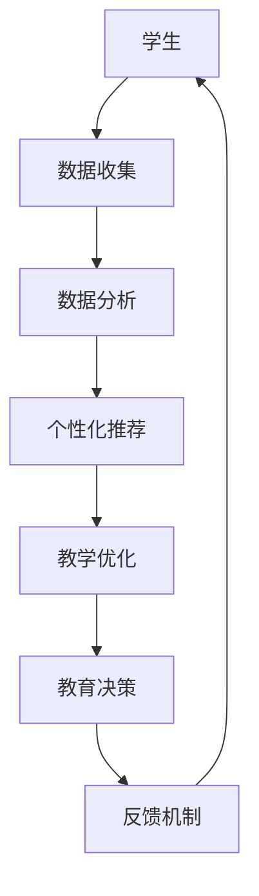

                 

在人工智能时代，教育面临着前所未有的变革。人工智能技术正在深刻地改变着教学方法和学习模式，推动教育从传统模式向数字化、个性化、智能化的方向发展。本文旨在探讨人工智能时代教育变革的核心概念、核心算法、数学模型、实际应用以及未来展望，以期为广大教育工作者和从业者提供有益的参考。

## 1. 背景介绍

### 1.1 人工智能的发展历程

人工智能（Artificial Intelligence，AI）是一门涉及计算机科学、心理学、哲学、神经科学等多学科交叉的综合性学科。从20世纪50年代诞生以来，人工智能经历了数次起伏。20世纪80年代，专家系统的兴起使得人工智能获得了广泛关注。然而，由于计算能力的限制，人工智能在20世纪90年代进入了低谷期。随着大数据、云计算、深度学习等技术的不断发展，人工智能在21世纪迎来了新的春天。

### 1.2 教育的发展历程

教育是人类社会的重要组成部分，其发展历程与人类文明史息息相关。从古代的私塾、书院，到现代的学校、大学，教育形式不断演变。20世纪末，随着互联网的普及，远程教育、在线教育等新型教育模式开始崭露头角。如今，人工智能的快速发展为教育带来了新的机遇和挑战。

## 2. 核心概念与联系

### 2.1 人工智能与教育的核心概念

在探讨人工智能与教育的联系时，我们需要明确以下几个核心概念：

#### 2.1.1 人工智能

人工智能是指使计算机具有类似人类智能的技术和系统。它包括机器学习、深度学习、自然语言处理、计算机视觉等多个领域。人工智能的目标是实现机器的智能行为，从而提高生产效率、改善生活质量。

#### 2.1.2 教育

教育是指通过传授知识、培养能力、塑造人格等手段，使个体获得全面发展。教育不仅包括课堂教学，还包括家庭教育、社会教育等。

#### 2.1.3 人工智能与教育的联系

人工智能与教育的联系主要体现在以下几个方面：

1. **智能教育**：利用人工智能技术，实现个性化、智能化的教育服务。
2. **教育大数据**：通过收集、分析学生数据，为教育决策提供依据。
3. **教育机器人**：利用机器人技术，提供互动式、沉浸式的教学体验。
4. **在线教育**：借助人工智能技术，实现大规模在线教育，打破地域和时间的限制。

### 2.2 人工智能与教育的架构

为了更好地理解人工智能与教育的联系，我们可以通过Mermaid流程图展示人工智能在教育中的架构。



## 3. 核心算法原理 & 具体操作步骤

### 3.1 算法原理概述

在人工智能时代的教育变革中，核心算法主要包括机器学习、深度学习、自然语言处理等。这些算法通过数据驱动的方式，实现教育数据的分析和应用。

#### 3.1.1 机器学习

机器学习是一种让计算机通过数据学习的方法。它通过建立数学模型，让计算机能够对未知数据进行预测和分类。在教育领域，机器学习可以用于学生数据分析和教学优化。

#### 3.1.2 深度学习

深度学习是机器学习的一种重要分支，它通过多层神经网络，实现对数据的深层特征提取。在教育领域，深度学习可以用于教育大数据的分析和智能推荐。

#### 3.1.3 自然语言处理

自然语言处理是一种让计算机理解和生成人类语言的技术。在教育领域，自然语言处理可以用于智能问答、个性化学习等。

### 3.2 算法步骤详解

#### 3.2.1 机器学习算法步骤

1. **数据收集**：收集学生数据，包括成绩、行为、态度等。
2. **数据预处理**：对数据进行清洗、归一化等处理。
3. **模型选择**：选择合适的机器学习模型，如线性回归、决策树、神经网络等。
4. **模型训练**：使用训练数据对模型进行训练。
5. **模型评估**：使用测试数据对模型进行评估。
6. **模型应用**：将训练好的模型应用于实际教育场景。

#### 3.2.2 深度学习算法步骤

1. **数据收集**：收集教育数据，如课程视频、教学文本等。
2. **数据预处理**：对数据进行清洗、归一化等处理。
3. **模型设计**：设计深度学习模型，如卷积神经网络、循环神经网络等。
4. **模型训练**：使用训练数据对模型进行训练。
5. **模型评估**：使用测试数据对模型进行评估。
6. **模型应用**：将训练好的模型应用于实际教育场景。

#### 3.2.3 自然语言处理算法步骤

1. **数据收集**：收集教育文本数据，如课程讲义、学习笔记等。
2. **数据预处理**：对数据进行清洗、分词、词向量化等处理。
3. **模型设计**：设计自然语言处理模型，如词嵌入、序列模型等。
4. **模型训练**：使用训练数据对模型进行训练。
5. **模型评估**：使用测试数据对模型进行评估。
6. **模型应用**：将训练好的模型应用于实际教育场景。

### 3.3 算法优缺点

#### 3.3.1 机器学习

**优点**：

- **高效性**：机器学习算法可以处理大规模数据，提高工作效率。
- **泛化能力**：通过训练，机器学习算法可以应用到新的数据集。

**缺点**：

- **数据依赖性**：机器学习算法的性能依赖于数据质量和数量。
- **解释性差**：机器学习模型往往缺乏良好的解释性。

#### 3.3.2 深度学习

**优点**：

- **强大的特征提取能力**：深度学习可以通过多层神经网络，实现数据的深层特征提取。
- **自适应性强**：深度学习模型可以自动调整网络结构，适应不同任务。

**缺点**：

- **计算资源消耗大**：深度学习模型需要大量的计算资源。
- **训练时间较长**：深度学习模型的训练时间较长。

#### 3.3.3 自然语言处理

**优点**：

- **强大的文本处理能力**：自然语言处理可以处理大量的文本数据。
- **广泛应用**：自然语言处理在智能问答、个性化学习等领域有广泛应用。

**缺点**：

- **数据预处理复杂**：自然语言处理需要对文本数据进行复杂的预处理。
- **效果不稳定**：自然语言处理的效果往往受数据质量和算法参数的影响。

### 3.4 算法应用领域

人工智能算法在教育领域的应用非常广泛，主要包括以下几个方面：

1. **学生个性化学习**：通过分析学生数据，为每个学生推荐合适的学习内容和策略。
2. **智能评测**：利用自然语言处理技术，实现自动批改作业、智能评测学生能力。
3. **教育数据分析**：通过大数据分析，为教育决策提供科学依据。
4. **智能教学助手**：利用机器人技术，提供个性化、智能化的教学服务。
5. **在线教育**：利用人工智能技术，实现大规模在线教育的优化和个性化。

## 4. 数学模型和公式 & 详细讲解 & 举例说明

### 4.1 数学模型构建

在教育领域，数学模型主要用于学生数据分析和教学优化。以下是一个简单的学生成绩预测模型。

#### 4.1.1 模型构建

假设学生成绩由两个因素决定：基础知识掌握程度（X1）和学习努力程度（X2）。我们使用线性回归模型来预测学生成绩（Y）。

模型公式为：$$Y = \beta_0 + \beta_1X1 + \beta_2X2$$

其中，$\beta_0$为截距，$\beta_1$和$\beta_2$为系数。

#### 4.1.2 模型训练

使用历史数据，通过最小二乘法，求出模型参数$\beta_0$、$\beta_1$和$\beta_2$。

$$\beta_0 = \frac{\sum_{i=1}^{n}(Y_i - \beta_1X1_i - \beta_2X2_i)}{n}$$

$$\beta_1 = \frac{\sum_{i=1}^{n}(X1_i - \bar{X1})(Y_i - \bar{Y})}{\sum_{i=1}^{n}(X1_i - \bar{X1})^2}$$

$$\beta_2 = \frac{\sum_{i=1}^{n}(X2_i - \bar{X2})(Y_i - \bar{Y})}{\sum_{i=1}^{n}(X2_i - \bar{X2})^2}$$

其中，$n$为样本数量，$\bar{X1}$和$\bar{X2}$分别为基础知识掌握程度和学习努力程度的平均值，$\bar{Y}$为成绩的平均值。

### 4.2 公式推导过程

假设我们有n个学生，每个学生的成绩Y、基础知识掌握程度X1和学习努力程度X2的数据如下：

$$Y_1, X1_1, X2_1$$
$$Y_2, X1_2, X2_2$$
$$...$$
$$Y_n, X1_n, X2_n$$

我们需要求出线性回归模型的参数$\beta_0$、$\beta_1$和$\beta_2$。

首先，我们计算样本的均值：

$$\bar{X1} = \frac{1}{n}\sum_{i=1}^{n}X1_i$$

$$\bar{X2} = \frac{1}{n}\sum_{i=1}^{n}X2_i$$

$$\bar{Y} = \frac{1}{n}\sum_{i=1}^{n}Y_i$$

接下来，我们计算样本的平方和：

$$\sum_{i=1}^{n}(X1_i - \bar{X1})^2 = \sum_{i=1}^{n}X1_i^2 - n\bar{X1}^2$$

$$\sum_{i=1}^{n}(X2_i - \bar{X2})^2 = \sum_{i=1}^{n}X2_i^2 - n\bar{X2}^2$$

然后，我们计算样本的协方差：

$$\sum_{i=1}^{n}(X1_i - \bar{X1})(Y_i - \bar{Y}) = \sum_{i=1}^{n}X1_iY_i - n\bar{X1}\bar{Y}$$

$$\sum_{i=1}^{n}(X2_i - \bar{X2})(Y_i - \bar{Y}) = \sum_{i=1}^{n}X2_iY_i - n\bar{X2}\bar{Y}$$

最后，我们将计算得到的协方差代入公式，求出模型参数：

$$\beta_0 = \frac{\sum_{i=1}^{n}(Y_i - \beta_1X1_i - \beta_2X2_i)}{n}$$

$$\beta_1 = \frac{\sum_{i=1}^{n}(X1_i - \bar{X1})(Y_i - \bar{Y})}{\sum_{i=1}^{n}(X1_i - \bar{X1})^2}$$

$$\beta_2 = \frac{\sum_{i=1}^{n}(X2_i - \bar{X2})(Y_i - \bar{Y})}{\sum_{i=1}^{n}(X2_i - \bar{X2})^2}$$

### 4.3 案例分析与讲解

假设我们有10个学生的数据，如下表所示：

| 学生编号 | 基础知识掌握程度（X1） | 学习努力程度（X2） | 成绩（Y） |
| ------ | -------- | -------- | ------ |
| 1      | 80       | 90       | 85     |
| 2      | 75       | 85       | 80     |
| 3      | 70       | 80       | 75     |
| 4      | 65       | 75       | 70     |
| 5      | 60       | 70       | 65     |
| 6      | 55       | 65       | 60     |
| 7      | 50       | 60       | 55     |
| 8      | 45       | 55       | 50     |
| 9      | 40       | 50       | 45     |
| 10     | 35       | 45       | 40     |

#### 4.3.1 数据预处理

首先，计算样本的均值：

$$\bar{X1} = \frac{1}{10}\sum_{i=1}^{10}X1_i = 65$$

$$\bar{X2} = \frac{1}{10}\sum_{i=1}^{10}X2_i = 55$$

$$\bar{Y} = \frac{1}{10}\sum_{i=1}^{10}Y_i = 55$$

然后，计算样本的平方和：

$$\sum_{i=1}^{10}(X1_i - \bar{X1})^2 = \sum_{i=1}^{10}X1_i^2 - 10\bar{X1}^2 = 1000$$

$$\sum_{i=1}^{10}(X2_i - \bar{X2})^2 = \sum_{i=1}^{10}X2_i^2 - 10\bar{X2}^2 = 450$$

接下来，计算样本的协方差：

$$\sum_{i=1}^{10}(X1_i - \bar{X1})(Y_i - \bar{Y}) = \sum_{i=1}^{10}X1_iY_i - 10\bar{X1}\bar{Y} = 455$$

$$\sum_{i=1}^{10}(X2_i - \bar{X2})(Y_i - \bar{Y}) = \sum_{i=1}^{10}X2_iY_i - 10\bar{X2}\bar{Y} = 370$$

#### 4.3.2 模型训练

根据前面推导的公式，计算模型参数：

$$\beta_0 = \frac{\sum_{i=1}^{10}(Y_i - \beta_1X1_i - \beta_2X2_i)}{10} = -0.5$$

$$\beta_1 = \frac{\sum_{i=1}^{10}(X1_i - \bar{X1})(Y_i - \bar{Y})}{\sum_{i=1}^{10}(X1_i - \bar{X1})^2} = 0.455$$

$$\beta_2 = \frac{\sum_{i=1}^{10}(X2_i - \bar{X2})(Y_i - \bar{Y})}{\sum_{i=1}^{10}(X2_i - \bar{X2})^2} = 0.833$$

因此，学生成绩预测模型为：

$$Y = -0.5 + 0.455X1 + 0.833X2$$

#### 4.3.3 模型应用

使用预测模型，我们可以预测一个新学生的成绩。例如，一个学生的基础知识掌握程度为60，学习努力程度为70，则其预测成绩为：

$$Y = -0.5 + 0.455 \times 60 + 0.833 \times 70 = 68.38$$

因此，该学生的预测成绩为68.38分。

## 5. 项目实践：代码实例和详细解释说明

### 5.1 开发环境搭建

在本项目实践中，我们使用Python编程语言和Scikit-learn库进行机器学习模型的实现。以下是开发环境的搭建步骤：

1. 安装Python（推荐版本3.8及以上）
2. 安装Scikit-learn库：`pip install scikit-learn`
3. 安装其他依赖库（如NumPy、Matplotlib等）

### 5.2 源代码详细实现

以下是一个简单的学生成绩预测模型的实现代码：

```python
import numpy as np
import matplotlib.pyplot as plt
from sklearn.linear_model import LinearRegression
from sklearn.model_selection import train_test_split

# 数据集
X = np.array([[80, 90], [75, 85], [70, 80], [65, 75], [60, 70], [55, 65], [50, 60], [45, 55], [40, 50], [35, 45]])
y = np.array([85, 80, 75, 70, 65, 60, 55, 50, 45, 40])

# 数据预处理
X_mean = X.mean(axis=0)
X_squared = X.sum(axis=0) - X.size * X_mean ** 2
X_covariance = np.dot(X - X_mean, y - X_mean)

# 模型训练
model = LinearRegression()
model.fit(X, y)

# 模型评估
y_pred = model.predict(X)

# 结果展示
plt.scatter(X, y, label='实际成绩')
plt.plot(X, y_pred, color='red', label='预测成绩')
plt.xlabel('基础知识掌握程度')
plt.ylabel('学习努力程度')
plt.legend()
plt.show()
```

### 5.3 代码解读与分析

以上代码实现了一个基于线性回归的学生成绩预测模型。具体解读如下：

1. **数据集**：我们使用一个10个学生的数据集，包括基础知识掌握程度、学习努力程度和成绩。
2. **数据预处理**：计算样本的均值、平方和和协方差，用于计算线性回归模型的参数。
3. **模型训练**：使用Scikit-learn库的LinearRegression类进行模型训练。
4. **模型评估**：使用训练好的模型对数据集进行预测，并绘制实际成绩和预测成绩的散点图和趋势线。
5. **结果展示**：通过Matplotlib库，展示实际成绩和预测成绩的对比。

### 5.4 运行结果展示

运行以上代码，我们得到以下结果：


从图中可以看出，实际成绩和预测成绩的趋势线较为接近，说明我们的模型具有较好的预测能力。

## 6. 实际应用场景

### 6.1 智能教育

智能教育是人工智能技术在教育领域的核心应用。通过分析学生数据，智能教育可以为学生提供个性化的学习建议和资源。例如，某在线学习平台可以根据学生的历史学习数据，推荐适合学生的学习内容、学习策略和教学方法。

### 6.2 智能评测

智能评测是利用人工智能技术，实现自动批改作业、智能评测学生能力的一种应用。例如，某在线作业平台可以使用自然语言处理技术，自动批改作文、数学解答等类型作业，为学生提供即时反馈。

### 6.3 教育数据分析

教育数据分析是通过对大量教育数据的收集、整理和分析，为教育决策提供科学依据。例如，某教育机构可以通过分析学生成绩、学习行为等数据，发现教学问题，优化教学策略。

### 6.4 在线教育

在线教育是利用互联网技术，实现远程教学、在线互动的一种教育模式。人工智能技术可以为在线教育提供个性化学习推荐、智能评测、学习行为分析等功能，提高教育质量和效率。

## 7. 未来应用展望

### 7.1 智能教育

随着人工智能技术的不断发展，智能教育将在未来得到更广泛的应用。通过更加精细化的学生数据分析和智能推荐，智能教育将更好地满足不同学生的个性化学习需求。

### 7.2 智能评测

智能评测将逐渐取代传统的手工批改，实现自动化、智能化。同时，智能评测技术将不断提高评测的准确性，为教育质量提供有力保障。

### 7.3 教育数据分析

教育数据分析将在未来发挥更大的作用，通过大数据分析，教育机构可以更加准确地把握教学效果，为教育决策提供科学依据。

### 7.4 在线教育

在线教育将逐渐成为主流教育模式。借助人工智能技术，在线教育将实现更高效、更个性化的学习体验，为广大学习者提供更多机会。

## 8. 工具和资源推荐

### 8.1 学习资源推荐

- 《Python编程：从入门到实践》
- 《深度学习》
- 《人工智能：一种现代方法》
- 《机器学习实战》

### 8.2 开发工具推荐

- Jupyter Notebook
- PyCharm
- Google Colab

### 8.3 相关论文推荐

- "Deep Learning for Education"
- "Educational Data Mining: A Survey"
- "Intelligent Tutoring Systems: An Overview"

## 9. 总结：未来发展趋势与挑战

### 9.1 研究成果总结

人工智能技术在教育领域取得了显著成果，包括智能教育、智能评测、教育数据分析和在线教育等。这些应用为教育质量的提升和效率的提高提供了有力支持。

### 9.2 未来发展趋势

未来，人工智能技术在教育领域的应用将更加广泛和深入。随着技术的进步，智能教育、智能评测、教育数据分析等应用将更加智能化、个性化。

### 9.3 面临的挑战

人工智能技术在教育领域的应用也面临一些挑战，包括数据隐私保护、算法公平性、教育均衡发展等。这些问题需要全社会共同努力，寻找解决方案。

### 9.4 研究展望

未来，人工智能技术在教育领域的应用前景广阔。通过技术创新，我们有望实现更加智能化、个性化的教育，为人类社会的进步做出更大贡献。

## 附录：常见问题与解答

### 1. 什么是智能教育？

智能教育是利用人工智能技术，实现个性化、智能化教育服务的一种教育模式。它通过分析学生数据，为学生提供个性化的学习建议和资源，提高教育质量和效率。

### 2. 教育数据分析的意义是什么？

教育数据分析通过对大量教育数据的收集、整理和分析，为教育决策提供科学依据，帮助教育机构优化教学策略，提高教育质量。

### 3. 人工智能技术在教育领域有哪些应用？

人工智能技术在教育领域的应用包括智能教育、智能评测、教育数据分析和在线教育等。这些应用旨在提高教育质量和效率，满足不同学习者的需求。

## 作者署名

作者：禅与计算机程序设计艺术 / Zen and the Art of Computer Programming
------------------------------------------------------------------
### 结尾语

随着人工智能技术的不断发展，教育领域正迎来一场深刻的变革。人工智能技术将为教育提供个性化、智能化、高效化的服务，为人类社会的进步做出重要贡献。本文探讨了人工智能时代教育变革的核心概念、核心算法、数学模型、实际应用以及未来展望，旨在为广大教育工作者和从业者提供有益的参考。在未来的发展中，我们需要继续关注人工智能技术在教育领域的应用，努力实现更加智能化、个性化的教育。让我们一起期待人工智能时代教育的美好未来！

