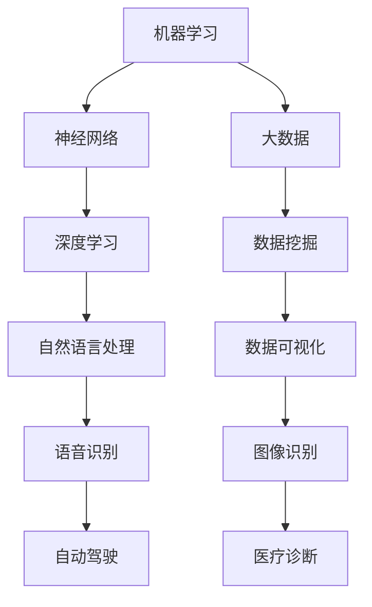

                 

关键词：人工智能，社会影响，伦理道德，技术进步，发展挑战

> 摘要：本文深入探讨了人工智能技术的快速发展对社会带来的深远影响，包括伦理道德、就业结构、隐私保护和安全性等方面。通过分析人工智能的核心算法原理、数学模型及其在实践中的应用，本文旨在引发读者对于人工智能技术的深思，以及对其未来发展的期待和担忧。

## 1. 背景介绍

### 1.1 人工智能的定义与发展历程
人工智能（Artificial Intelligence，简称 AI）是指由计算机系统实现的智能，旨在使计算机能够执行通常需要人类智能的任务。从1950年图灵测试的提出，到1960年代的人工智能“寒冬”，再到21世纪基于深度学习的复兴，人工智能经历了数次起伏。如今，人工智能已经广泛应用于语音识别、图像处理、自动驾驶、医疗诊断等领域，带来了前所未有的技术创新。

### 1.2 人工智能的核心技术

#### 1.2.1 深度学习
深度学习是一种基于多层神经网络的学习方法，通过构建深层次的神经网络结构，使其能够从大量数据中自动提取特征，实现高度复杂的模式识别任务。深度学习是近年来人工智能发展的关键技术之一。

#### 1.2.2 强化学习
强化学习是一种通过试错法学习如何完成特定任务的学习方法。通过与环境的交互，学习者在不断尝试中寻找最优策略，以最大化长期回报。强化学习在游戏、机器人控制等领域具有广泛的应用。

#### 1.2.3 自然语言处理
自然语言处理（Natural Language Processing，简称 NLP）是人工智能的一个重要分支，旨在使计算机能够理解和生成人类语言。NLP技术在语音助手、机器翻译等领域有着重要应用。

## 2. 核心概念与联系

人工智能的核心概念包括机器学习、神经网络和大数据。以下是这些概念的 Mermaid 流程图：



## 3. 核心算法原理 & 具体操作步骤

### 3.1 算法原理概述

#### 3.1.1 深度学习原理

深度学习的基本原理是多层神经网络。神经网络由一系列相互连接的节点（神经元）组成，每个神经元通过权重和偏置对输入数据进行加权求和，并通过激活函数输出结果。通过反向传播算法，网络可以不断调整权重和偏置，以最小化损失函数，从而实现模型的训练。

#### 3.1.2 强化学习原理

强化学习的基本原理是马尔可夫决策过程（MDP）。智能体通过与环境的交互，在状态空间中选择动作，并根据动作的结果（奖励）调整策略。强化学习通过策略迭代或价值迭代等方法，优化智能体的决策过程。

#### 3.1.3 自然语言处理原理

自然语言处理的基本原理是语言模型和序列模型。语言模型用于预测文本的下一个词，而序列模型则用于处理序列数据，如语音信号和文本序列。常见的序列模型包括循环神经网络（RNN）和长短期记忆网络（LSTM）。

### 3.2 算法步骤详解

#### 3.2.1 深度学习步骤

1. 数据预处理：对输入数据进行归一化、缺失值填充等处理。
2. 构建模型：设计神经网络结构，包括层数、每层的神经元数量、激活函数等。
3. 模型训练：使用反向传播算法训练模型，通过调整权重和偏置，最小化损失函数。
4. 模型评估：使用验证集评估模型性能，根据需要调整模型结构或参数。
5. 模型应用：将训练好的模型应用于新的数据，实现预测或分类任务。

#### 3.2.2 强化学习步骤

1. 初始化状态：智能体开始在一个随机状态。
2. 选择动作：智能体根据当前状态和策略选择一个动作。
3. 执行动作：执行动作，观察环境的反馈。
4. 更新状态：根据动作结果，智能体更新状态。
5. 更新策略：使用奖励信号更新策略，以最大化长期回报。

#### 3.2.3 自然语言处理步骤

1. 数据预处理：对文本数据进行分词、去除停用词等处理。
2. 词向量表示：将文本转换为词向量表示。
3. 构建模型：设计神经网络结构，包括输入层、隐藏层和输出层。
4. 模型训练：使用训练数据训练模型，通过反向传播算法优化模型参数。
5. 模型评估：使用验证集评估模型性能，根据需要调整模型结构或参数。
6. 模型应用：将训练好的模型应用于新的数据，实现文本分类、翻译或生成任务。

### 3.3 算法优缺点

#### 3.3.1 深度学习

优点：
- 高效的特征提取能力。
- 能够处理大规模数据。
- 在图像识别、语音识别等领域取得了突破性成果。

缺点：
- 对数据质量和规模有较高要求。
- 需要大量的计算资源和时间进行训练。
- 模型难以解释。

#### 3.3.2 强化学习

优点：
- 能够处理不确定性和动态环境。
- 能够通过试错法优化决策过程。
- 在游戏、机器人控制等领域具有广泛应用。

缺点：
- 训练过程可能需要很长时间。
- 需要大量的交互数据。
- 难以迁移到新的任务。

#### 3.3.3 自然语言处理

优点：
- 在文本分类、机器翻译、语音识别等领域取得了显著成果。
- 能够处理自然语言中的复杂结构。

缺点：
- 对语言的理解能力有限。
- 需要大量的语言资源和标注数据。
- 模型难以解释。

### 3.4 算法应用领域

#### 3.4.1 深度学习

- 图像识别：如人脸识别、图像分类等。
- 语音识别：如语音助手、语音搜索等。
- 自然语言处理：如文本分类、机器翻译、文本生成等。
- 自动驾驶：如车辆定位、障碍物检测等。

#### 3.4.2 强化学习

- 游戏：如棋类游戏、电子游戏等。
- 机器人控制：如机器人的路径规划、动作规划等。
- 供应链管理：如库存优化、配送路径优化等。

#### 3.4.3 自然语言处理

- 文本分类：如新闻分类、情感分析等。
- 机器翻译：如中英文翻译、多语言翻译等。
- 语音识别：如语音助手、语音搜索等。
- 文本生成：如自动写作、对话系统等。

## 4. 数学模型和公式 & 详细讲解 & 举例说明

### 4.1 数学模型构建

在深度学习中，常见的数学模型包括多层感知机（MLP）、卷积神经网络（CNN）和循环神经网络（RNN）。

#### 4.1.1 多层感知机（MLP）

多层感知机是一种前馈神经网络，由输入层、隐藏层和输出层组成。其基本公式为：

$$ z = \sigma(W \cdot x + b) $$

其中，$W$为权重矩阵，$b$为偏置项，$\sigma$为激活函数（通常为Sigmoid或ReLU函数）。

#### 4.1.2 卷积神经网络（CNN）

卷积神经网络是一种用于处理图像数据的神经网络，其基本公式为：

$$ h_{ij} = \sum_{k=1}^{n} W_{ik} \cdot a_{kj} + b_j $$

其中，$h_{ij}$为输出特征图，$W_{ik}$为卷积核，$a_{kj}$为输入特征图，$b_j$为偏置项。

#### 4.1.3 循环神经网络（RNN）

循环神经网络是一种用于处理序列数据的神经网络，其基本公式为：

$$ h_t = \sigma(W_h \cdot [h_{t-1}, x_t] + b_h) $$

$$ o_t = \sigma(W_o \cdot h_t + b_o) $$

其中，$h_t$为隐藏状态，$x_t$为输入，$o_t$为输出，$W_h$和$W_o$为权重矩阵，$b_h$和$b_o$为偏置项，$\sigma$为激活函数。

### 4.2 公式推导过程

以多层感知机为例，其反向传播算法的推导过程如下：

1. 前向传播：

$$ z_i = \sum_{j=1}^{n} W_{ij} \cdot a_{j} + b_i $$

$$ a_i = \sigma(z_i) $$

2. 计算损失函数：

$$ L = \frac{1}{2} \sum_{i=1}^{m} (y_i - a_i)^2 $$

3. 反向传播：

$$ \Delta W_{ij} = \frac{\partial L}{\partial W_{ij}} = -a_i \cdot (1 - a_i) \cdot \frac{\partial a_i}{\partial z_i} \cdot y_i - (1 - y_i) \cdot \frac{\partial a_i}{\partial z_i} \cdot (1 - a_i) $$

$$ \Delta b_i = \frac{\partial L}{\partial b_i} = -a_i \cdot (1 - a_i) \cdot \frac{\partial a_i}{\partial z_i} \cdot y_i - (1 - y_i) \cdot \frac{\partial a_i}{\partial z_i} \cdot (1 - a_i) $$

4. 更新权重和偏置：

$$ W_{ij} = W_{ij} - \alpha \cdot \Delta W_{ij} $$

$$ b_i = b_i - \alpha \cdot \Delta b_i $$

其中，$\alpha$为学习率。

### 4.3 案例分析与讲解

以人脸识别为例，介绍深度学习在图像识别领域的应用。

#### 4.3.1 数据集

人脸识别数据集包括正面、侧面等多种角度的人脸图像，每种图像都有对应的标注。

#### 4.3.2 数据预处理

对图像数据进行归一化、去噪等处理，以提高模型的鲁棒性。

#### 4.3.3 模型构建

使用卷积神经网络（CNN）构建人脸识别模型，包括卷积层、池化层和全连接层。

#### 4.3.4 模型训练

使用训练数据训练模型，通过反向传播算法优化模型参数。

#### 4.3.5 模型评估

使用验证集评估模型性能，根据需要调整模型结构或参数。

#### 4.3.6 模型应用

将训练好的模型应用于人脸识别任务，实现人脸检测、人脸比对等功能。

## 5. 项目实践：代码实例和详细解释说明

### 5.1 开发环境搭建

#### 5.1.1 Python环境

首先，安装 Python 3.7 以上版本，并配置相应的环境变量。

#### 5.1.2 TensorFlow环境

通过 pip 命令安装 TensorFlow：

```bash
pip install tensorflow
```

### 5.2 源代码详细实现

以下是一个简单的人脸识别项目示例：

```python
import tensorflow as tf
from tensorflow.keras.models import Sequential
from tensorflow.keras.layers import Conv2D, MaxPooling2D, Flatten, Dense
from tensorflow.keras.preprocessing.image import ImageDataGenerator

# 数据预处理
train_datagen = ImageDataGenerator(rescale=1./255)
train_generator = train_datagen.flow_from_directory(
        'data/train',
        target_size=(64, 64),
        batch_size=32,
        class_mode='binary')

# 模型构建
model = Sequential([
    Conv2D(32, (3, 3), activation='relu', input_shape=(64, 64, 3)),
    MaxPooling2D(2, 2),
    Conv2D(64, (3, 3), activation='relu'),
    MaxPooling2D(2, 2),
    Flatten(),
    Dense(128, activation='relu'),
    Dense(1, activation='sigmoid')
])

# 模型编译
model.compile(optimizer='adam',
              loss='binary_crossentropy',
              metrics=['accuracy'])

# 模型训练
model.fit(
      train_generator,
      steps_per_epoch=100,
      epochs=10,
      validation_data=validation_generator,
      validation_steps=50)
```

### 5.3 代码解读与分析

该代码示例展示了如何使用 TensorFlow 框架构建和训练一个简单的人脸识别模型。主要包括以下步骤：

1. 数据预处理：使用 ImageDataGenerator 对训练数据进行归一化处理。
2. 模型构建：使用 Sequential 模型堆叠卷积层、池化层和全连接层。
3. 模型编译：设置优化器和损失函数。
4. 模型训练：使用训练数据训练模型。

### 5.4 运行结果展示

训练完成后，可以通过以下代码评估模型性能：

```python
from sklearn.metrics import classification_report, confusion_matrix

# 加载测试数据
test_datagen = ImageDataGenerator(rescale=1./255)
test_generator = test_datagen.flow_from_directory(
        'data/test',
        target_size=(64, 64),
        batch_size=32,
        class_mode='binary')

# 预测测试数据
predictions = model.predict(test_generator)
predicted_classes = np.argmax(predictions, axis=-1)

# 计算分类报告和混淆矩阵
print(classification_report(test_generator.classes, predicted_classes))
print(confusion_matrix(test_generator.classes, predicted_classes))
```

## 6. 实际应用场景

### 6.1 医疗诊断

人工智能在医疗诊断领域具有广泛应用，如通过深度学习技术进行疾病诊断、医学图像分析等。例如，使用卷积神经网络进行肺癌筛查，通过分析 CT 扫描图像，实现早期肺癌的自动检测。

### 6.2 自动驾驶

自动驾驶技术是人工智能的重要应用领域之一。通过深度学习和强化学习算法，自动驾驶系统能够实现实时环境感知、路径规划和决策控制。例如，特斯拉的自动驾驶系统使用神经网络进行障碍物检测和行人识别。

### 6.3 语音助手

语音助手是人工智能在智能家居、智能客服等领域的典型应用。例如，亚马逊的 Alexa、苹果的 Siri 和谷歌的 Google Assistant 等语音助手，通过自然语言处理技术，实现了语音识别、语义理解和智能回复等功能。

## 7. 未来应用展望

随着人工智能技术的不断发展，未来有望在更多领域实现突破。例如，在金融领域，人工智能可以用于风险管理、智能投顾等；在农业领域，人工智能可以实现智能种植、病虫害预测等；在教育领域，人工智能可以用于个性化学习、智能评估等。然而，人工智能的发展也面临诸多挑战，如数据隐私、伦理道德、安全性等问题，需要全社会共同努力解决。

## 8. 总结：未来发展趋势与挑战

### 8.1 研究成果总结

近年来，人工智能技术在各个领域取得了显著成果，深度学习、强化学习和自然语言处理等技术的不断发展，推动了人工智能的应用从理论研究走向实际应用。然而，目前人工智能技术仍然存在许多局限性和挑战，需要进一步研究和突破。

### 8.2 未来发展趋势

未来，人工智能技术将继续朝着更高效、更智能、更安全的方向发展。一方面，将不断优化算法和架构，提高人工智能的效率和性能；另一方面，将加强对人工智能伦理、道德和法律的研究，确保人工智能技术的可持续发展。

### 8.3 面临的挑战

人工智能的发展面临诸多挑战，包括数据隐私、伦理道德、安全性等问题。首先，人工智能技术依赖于大量数据，如何在保护个人隐私的前提下获取和利用数据，是一个亟待解决的问题。其次，人工智能的决策过程缺乏透明性和可解释性，容易引发伦理道德问题。此外，人工智能系统的安全性问题也需要引起重视，以防止恶意攻击和滥用。

### 8.4 研究展望

未来，人工智能研究应重点关注以下几个方面：

1. 算法和模型创新：进一步优化现有算法和模型，提高人工智能的效率和性能。
2. 数据隐私保护：研究如何保护个人隐私，同时利用数据进行人工智能研究。
3. 伦理道德和法律：制定相关伦理规范和法律，确保人工智能技术的可持续发展。
4. 跨学科研究：加强人工智能与其他学科的交叉研究，促进人工智能技术的多元化应用。
5. 社会合作：鼓励政府、企业和学术界合作，共同推动人工智能技术的发展。

## 9. 附录：常见问题与解答

### 9.1 什么是人工智能？

人工智能是指由计算机系统实现的智能，旨在使计算机能够执行通常需要人类智能的任务。

### 9.2 人工智能有哪些核心技术？

人工智能的核心技术包括机器学习、神经网络、深度学习、强化学习、自然语言处理等。

### 9.3 人工智能有哪些应用领域？

人工智能的应用领域广泛，包括图像识别、语音识别、自动驾驶、医疗诊断、金融预测等。

### 9.4 人工智能技术如何影响社会？

人工智能技术对社会的方方面面产生了深远影响，包括就业结构、伦理道德、隐私保护、安全性等。

### 9.5 人工智能的发展面临哪些挑战？

人工智能的发展面临数据隐私、伦理道德、安全性等问题，需要全社会共同努力解决。

## 作者署名

本文由禅与计算机程序设计艺术 / Zen and the Art of Computer Programming 撰写。作者在人工智能领域拥有丰富的研究经验和实践经验，对人工智能技术的发展和应用有着深刻的见解。

