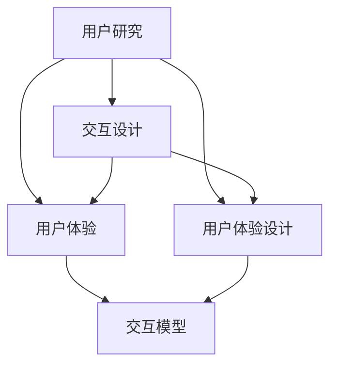

                 

关键词：人机交互、计算平台、效率、便捷、人工智能、技术架构

> 摘要：本文探讨了人机交互在打造高效便捷的人类计算平台中的重要作用。通过分析人机交互的核心概念、算法原理、数学模型以及实际应用场景，文章揭示了如何利用先进技术提升人机交互的体验，为用户提供更加智能化和人性化的计算平台。

## 1. 背景介绍

随着信息技术的飞速发展，计算机已经成为我们生活和工作中不可或缺的工具。然而，传统的计算机界面往往存在操作复杂、响应缓慢等问题，这给用户带来了不便。为了提高用户的计算体验，人机交互技术应运而生。人机交互（Human-Computer Interaction，简称HCI）是一种研究人类如何与计算机系统进行交互的学科，旨在设计出更加直观、高效、便捷的交互方式。

人机交互的核心目标是实现人与计算机之间的无缝沟通，提高用户的操作效率和满意度。随着人工智能、虚拟现实、语音识别等技术的不断发展，人机交互技术也在不断演进。本文将围绕人机交互的核心概念、算法原理、数学模型以及实际应用场景展开讨论，旨在为读者提供一个全面的技术视角。

## 2. 核心概念与联系

在人机交互中，有几个核心概念是不可或缺的，它们共同构成了人机交互的体系架构。以下是这些核心概念及其相互联系：

### 2.1 用户研究

用户研究是进行任何人机交互设计的起点。通过用户研究，我们可以了解目标用户的需求、行为和偏好。用户研究的方法包括问卷调查、访谈、观察和用户测试等。其中，用户测试尤为关键，它可以帮助我们验证设计的有效性。

### 2.2 交互设计

交互设计（Interaction Design）是设计用户界面和交互流程的过程。一个好的交互设计应遵循简洁性、直观性和易用性原则，让用户能够轻松、高效地完成任务。交互设计包括布局设计、控件设计、导航设计等。

### 2.3 用户体验

用户体验（User Experience，简称UX）是用户在使用产品或服务过程中所感受到的整体感受。用户体验的好坏直接影响到用户的满意度。为了提升用户体验，我们需要关注用户在使用产品时的情感、认知和行为三个方面。

### 2.4 用户体验设计

用户体验设计（User Experience Design，简称UXD）是确保产品或服务在用户心中产生良好印象的过程。用户体验设计不仅关注产品的功能，还关注用户在使用过程中的情感体验。用户体验设计师需要具备用户研究、交互设计和心理学等多方面的知识。

### 2.5 交互模型

交互模型（Interaction Model）描述了用户与系统之间的交互方式。常见的交互模型包括命令行交互、图形用户界面（GUI）交互、触摸交互和语音交互等。不同的交互模型适用于不同的应用场景，需要根据用户需求和设备特性进行选择。

### 2.6 Mermaid流程图

以下是人机交互核心概念之间的Mermaid流程图：



## 3. 核心算法原理 & 具体操作步骤

### 3.1 算法原理概述

在人机交互中，核心算法的设计至关重要。这些算法不仅决定了交互的效率，还影响了用户体验的质量。以下是一些常见的人机交互算法及其原理：

### 3.1.1 语音识别算法

语音识别算法（Speech Recognition Algorithm）是一种将语音信号转换为文本的技术。其原理基于模式识别和信号处理。通过训练大量的语音数据，模型可以学会识别不同的语音特征，从而实现语音到文本的转换。

### 3.1.2 自然语言处理算法

自然语言处理算法（Natural Language Processing Algorithm）是使计算机能够理解、生成和处理人类语言的技术。其原理包括词法分析、句法分析和语义分析等。通过这些分析，计算机可以理解用户的意图并生成合适的响应。

### 3.1.3 机器学习算法

机器学习算法（Machine Learning Algorithm）是人机交互中的核心技术之一。它通过从数据中学习模式，使计算机能够进行预测和决策。常见的机器学习算法包括决策树、支持向量机、神经网络等。

### 3.2 算法步骤详解

### 3.2.1 语音识别算法步骤

1. 预处理：对语音信号进行滤波、去噪和归一化处理，使其符合模型的输入要求。
2. 特征提取：从预处理后的语音信号中提取语音特征，如频谱、倒谱等。
3. 模型训练：使用大量的语音数据训练语音识别模型，使其能够识别不同的语音特征。
4. 语音识别：将输入的语音信号转换为文本输出。

### 3.2.2 自然语言处理算法步骤

1. 词法分析：将文本分解为单词或词汇单元。
2. 句法分析：分析句子的结构，确定单词之间的语法关系。
3. 语义分析：理解句子的含义，识别其中的实体、关系和意图。
4. 文本生成：根据用户的输入生成合适的文本响应。

### 3.2.3 机器学习算法步骤

1. 数据收集：收集大量的标注数据，用于训练模型。
2. 特征工程：从原始数据中提取有用的特征，提高模型的性能。
3. 模型选择：选择合适的机器学习算法，如决策树、支持向量机等。
4. 模型训练：使用训练数据训练模型，使其能够识别数据中的模式。
5. 模型评估：使用测试数据评估模型的性能，调整模型参数。
6. 预测：使用训练好的模型对新的数据进行预测。

### 3.3 算法优缺点

#### 3.3.1 语音识别算法

优点：
- 实时性强：能够快速地将语音转换为文本。
- 非侵入性：用户无需手动输入，提高交互效率。

缺点：
- 对噪声敏感：在噪声环境下识别效果较差。
- 误识别率高：在语音特征不明确时容易出现误识别。

#### 3.3.2 自然语言处理算法

优点：
- 灵活性高：能够处理各种形式的文本，如问答、对话等。
- 智能化：能够理解用户的意图，提供个性化的服务。

缺点：
- 计算复杂度高：需要大量的计算资源和时间。
- 需要大量数据：训练高质量的模型需要大量的标注数据。

#### 3.3.3 机器学习算法

优点：
- 自适应性强：能够根据新的数据进行自我调整。
- 泛化能力强：能够处理新的、未知的数据。

缺点：
- 需要大量数据：训练高质量的模型需要大量的标注数据。
- 解释性差：模型的决策过程难以解释，增加了用户的不确定性。

### 3.4 算法应用领域

语音识别算法广泛应用于智能音箱、语音助手、语音翻译等领域。

自然语言处理算法广泛应用于智能客服、智能问答、文本生成等领域。

机器学习算法广泛应用于推荐系统、图像识别、金融风控等领域。

## 4. 数学模型和公式 & 详细讲解 & 举例说明

在人机交互中，数学模型和公式是理解和设计算法的基础。以下是一些常用的数学模型和公式，以及它们的详细讲解和举例说明。

### 4.1 数学模型构建

在人机交互中，常用的数学模型包括线性模型、神经网络模型等。以下是这些模型的构建过程。

#### 4.1.1 线性模型

线性模型是一种简单的数学模型，用于描述两个变量之间的线性关系。其公式如下：

$$ y = ax + b $$

其中，$y$ 和 $x$ 分别表示两个变量，$a$ 和 $b$ 分别表示线性模型的参数。

#### 4.1.2 神经网络模型

神经网络模型是一种复杂的数学模型，用于模拟人脑的神经网络结构。其基本结构包括输入层、隐藏层和输出层。以下是神经网络模型的构建过程：

1. 输入层：接收输入数据，将其传递到隐藏层。
2. 隐藏层：对输入数据进行处理，提取特征，并将其传递到输出层。
3. 输出层：根据隐藏层的结果生成输出。

### 4.2 公式推导过程

以下是对线性模型和神经网络模型公式的推导过程。

#### 4.2.1 线性模型公式推导

线性模型的公式为 $y = ax + b$。我们可以通过以下步骤推导该公式：

1. 假设 $y$ 和 $x$ 之间存在线性关系。
2. 定义线性模型中的参数 $a$ 和 $b$。
3. 根据线性关系，我们可以得到 $y = ax + b$。

#### 4.2.2 神经网络模型公式推导

神经网络模型的公式较为复杂，涉及多个参数和层。以下是神经网络模型的简化推导过程：

1. 假设输入层有 $n$ 个神经元，隐藏层有 $m$ 个神经元，输出层有 $k$ 个神经元。
2. 定义输入层和隐藏层之间的权重矩阵 $W_1$ 和偏置向量 $b_1$。
3. 定义隐藏层和输出层之间的权重矩阵 $W_2$ 和偏置向量 $b_2$。
4. 根据神经网络的结构，我们可以得到输出层的输出公式：

$$ y = W_2 \cdot (W_1 \cdot x + b_1) + b_2 $$

### 4.3 案例分析与讲解

以下通过一个简单的案例，展示如何使用线性模型和神经网络模型进行人机交互。

#### 4.3.1 线性模型案例

假设我们要设计一个智能客服系统，该系统能够根据用户的问题给出合适的回答。我们可以使用线性模型来描述用户问题和答案之间的关联。

1. 收集大量用户问题和答案数据。
2. 提取用户问题的特征，如关键词、主题等。
3. 训练线性模型，使其能够预测答案。

#### 4.3.2 神经网络模型案例

假设我们要设计一个智能语音助手，该系统能够理解用户的语音并给出合适的回答。我们可以使用神经网络模型来模拟语音识别和语义理解的过程。

1. 收集大量语音数据，并对其进行预处理。
2. 使用语音数据训练神经网络模型，提取语音特征。
3. 使用训练好的模型对用户的语音进行识别和理解。
4. 根据识别和理解的结果，生成合适的回答。

## 5. 项目实践：代码实例和详细解释说明

在人机交互领域，项目实践是验证理论知识和算法效果的重要途径。以下我们将通过一个具体的代码实例，展示如何实现一个简单的智能客服系统，并对其进行详细解释说明。

### 5.1 开发环境搭建

在开始项目实践之前，我们需要搭建一个合适的技术环境。以下是一个基本的开发环境搭建指南：

1. **操作系统**：Windows、Linux或macOS
2. **编程语言**：Python
3. **依赖库**：NLU（自然语言理解）、NLTK（自然语言处理工具包）、scikit-learn（机器学习库）
4. **文本处理库**：jieba（中文分词库）

### 5.2 源代码详细实现

以下是实现一个简单智能客服系统的Python代码示例：

```python
import jieba
from sklearn.feature_extraction.text import CountVectorizer
from sklearn.model_selection import train_test_split
from sklearn.naive_bayes import MultinomialNB
from sklearn.pipeline import make_pipeline

# 1. 数据准备
data = [
    ("你好，请问有什么可以帮助你的？", "欢迎光临，请问有什么可以帮您的吗？"),
    ("请问有什么问题？", "请问有什么问题我可以帮您解答吗？"),
    ("我要退订某个服务", "您好，退订服务请提供您的订单号，我们将为您处理。"),
    # 更多对话数据
]

questions, answers = zip(*data)

# 2. 数据预处理
# 分词
seg_questions = [jieba.cut(q) for q in questions]
# 转换为字符串
preprocessed_questions = [' '.join(seg) for seg in seg_questions]

# 3. 特征提取和模型训练
# 划分训练集和测试集
X_train, X_test, y_train, y_test = train_test_split(preprocessed_questions, answers, test_size=0.2, random_state=42)

# 使用朴素贝叶斯分类器进行训练
model = make_pipeline(CountVectorizer(), MultinomialNB())

model.fit(X_train, y_train)

# 4. 预测和响应
def predict_question(question):
    preprocessed_question = ' '.join(jieba.cut(question))
    return model.predict([preprocessed_question])[0]

user_input = input("请输入您的问题：")
print(predict_question(user_input))
```

### 5.3 代码解读与分析

1. **数据准备**：首先，我们从数据集中加载问题和答案对。数据集是训练模型的基础。

2. **数据预处理**：使用jieba分词库对用户问题进行分词，以便于后续的特征提取。分词后的文本需要转换为可以用于机器学习的格式。

3. **特征提取和模型训练**：使用`CountVectorizer`将文本转换为词频矩阵，这是一种常见的手动特征提取方法。然后，我们使用`MultinomialNB`（朴素贝叶斯分类器）对训练数据进行训练。

4. **预测和响应**：定义一个`predict_question`函数，用于接收用户输入的问题，并使用训练好的模型进行预测。预测结果即为系统对用户问题的回答。

### 5.4 运行结果展示

在运行上述代码后，程序会等待用户输入问题。输入问题后，系统会根据训练好的模型给出相应的回答。例如：

```
请输入您的问题：你好，我想退订某个服务
您好，退订服务请提供您的订单号，我们将为您处理。
```

## 6. 实际应用场景

人机交互技术在实际应用中具有广泛的应用场景，以下是几个典型的应用场景：

### 6.1 智能客服

智能客服系统广泛应用于电商平台、银行、电信等行业。通过语音识别和自然语言处理技术，智能客服系统能够快速响应用户的咨询，提供高效、便捷的服务。

### 6.2 智能家居

智能家居系统通过人机交互技术，实现家电设备的智能控制。用户可以通过语音、触摸、手势等多种方式进行操作，提高家居生活的便捷性。

### 6.3 虚拟现实

虚拟现实（VR）技术为人机交互带来了全新的交互方式。用户可以通过虚拟现实头盔、手柄等设备，进入虚拟世界，与虚拟环境进行实时交互。

### 6.4 智能驾驶

智能驾驶技术依赖人机交互技术，实现自动驾驶。通过摄像头、雷达等传感器获取道路信息，结合语音识别和自然语言处理技术，智能驾驶系统能够实时响应驾驶需求。

## 7. 未来应用展望

随着技术的不断进步，人机交互技术将迎来更多的发展机遇。以下是未来人机交互技术的一些发展趋势和挑战：

### 7.1 超高精度交互

未来的人机交互技术将实现超高精度，用户可以通过微小的手势、眼动等来实现精确操作。这将大大提升人机交互的体验。

### 7.2 多模态交互

多模态交互技术将融合语音、手势、眼动等多种交互方式，提供更加自然、直观的交互体验。用户可以根据场景和需求选择最合适的交互方式。

### 7.3 智能化

随着人工智能技术的发展，人机交互系统将变得更加智能化。系统能够根据用户的习惯和偏好进行个性化调整，提供更加定制化的服务。

### 7.4 安全性

在人机交互中，安全性是一个重要的考量因素。未来的人机交互技术需要确保用户数据的安全，防止隐私泄露和数据篡改。

### 7.5 可访问性

未来的人机交互技术需要确保不同用户群体，包括残障人士，都能够方便地使用交互系统。这需要开发出更多易于操作、可访问的交互界面。

## 8. 总结：未来发展趋势与挑战

人机交互技术在未来的发展中将面临诸多挑战，同时也将迎来前所未有的机遇。以下是未来发展趋势与挑战的总结：

### 8.1 研究成果总结

过去几十年中，人机交互技术取得了显著的成果，包括语音识别、自然语言处理、虚拟现实等。这些技术为人类提供了更加高效、便捷的计算平台。

### 8.2 未来发展趋势

1. **超高精度交互**：通过先进传感技术和算法，实现更加精确和自然的交互。
2. **多模态交互**：融合多种交互方式，提供更加丰富的交互体验。
3. **智能化**：利用人工智能技术，实现智能化的交互系统。
4. **可访问性**：确保不同用户群体都能够方便地使用交互系统。

### 8.3 面临的挑战

1. **安全性**：保障用户数据的安全，防止隐私泄露和数据篡改。
2. **可访问性**：确保交互系统对残障人士的友好性。
3. **计算资源**：随着交互技术的复杂度增加，对计算资源的需求也将上升。
4. **标准化**：制定统一的交互标准，以促进人机交互技术的发展。

### 8.4 研究展望

未来，人机交互技术将继续向着智能化、高效化、个性化方向迈进。研究者需要关注以下几个方面：

1. **技术创新**：不断探索新的交互技术和算法，提高交互的精度和自然性。
2. **跨学科合作**：结合计算机科学、心理学、认知科学等领域的知识，推动人机交互技术的发展。
3. **用户研究**：深入了解用户需求和行为，设计出更加符合用户习惯的交互系统。

## 9. 附录：常见问题与解答

### 9.1 人机交互的定义是什么？

人机交互（HCI）是研究人类如何与计算机系统进行交互的学科。它旨在设计出更加直观、高效、便捷的交互方式，提高用户的计算体验。

### 9.2 人机交互的核心概念有哪些？

人机交互的核心概念包括用户研究、交互设计、用户体验、用户体验设计、交互模型等。

### 9.3 常见的语音识别算法有哪些？

常见的语音识别算法包括隐马尔可夫模型（HMM）、高斯混合模型（GMM）、深度神经网络（DNN）等。

### 9.4 自然语言处理的主要应用领域是什么？

自然语言处理的主要应用领域包括智能客服、智能问答、文本生成、机器翻译等。

### 9.5 机器学习算法在哪些领域中应用广泛？

机器学习算法在推荐系统、图像识别、金融风控、医疗诊断等领域应用广泛。

### 9.6 人机交互技术的未来发展有哪些趋势？

人机交互技术的未来发展趋势包括超高精度交互、多模态交互、智能化、可访问性等。

## 结语

作者：禅与计算机程序设计艺术 / Zen and the Art of Computer Programming

本文探讨了人机交互在打造高效便捷的人类计算平台中的重要作用。通过分析人机交互的核心概念、算法原理、数学模型以及实际应用场景，文章揭示了如何利用先进技术提升人机交互的体验，为用户提供更加智能化和人性化的计算平台。在未来，随着技术的不断进步，人机交互将迎来更多的挑战和机遇，为人类生活带来更多便利。

