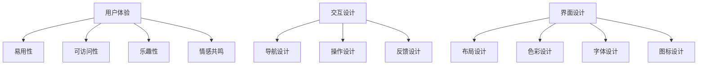

                 

关键词：人机交互、未来趋势、技术发展、AI、用户体验、人机融合

> 摘要：随着人工智能技术的不断进步，人机交互正迎来前所未有的变革。本文将深入探讨人机交互的未来趋势，分析技术发展的关键因素，并展望其在各领域中的应用前景。同时，本文还将探讨人机交互面临的挑战，以及未来可能的研究方向。

## 1. 背景介绍

人机交互（Human-Computer Interaction，简称HCI）是研究人类与计算机之间交互的学科，旨在设计出易于使用、高效且愉悦的计算机系统。从早期的命令行界面到图形用户界面（GUI），再到如今的触摸屏和语音交互，人机交互经历了多次重大变革。

近年来，人工智能（AI）技术的飞速发展为人机交互带来了新的机遇。深度学习、自然语言处理（NLP）、机器学习等技术使得计算机能够更好地理解人类的意图和行为，从而提供更智能、更个性化的交互体验。

然而，随着技术的不断进步，人机交互也面临着诸多挑战，如隐私保护、安全性、易用性等。如何平衡技术创新与用户体验，确保人机交互的可持续发展，成为了一个重要的课题。

## 2. 核心概念与联系

人机交互的核心概念包括用户体验（User Experience，简称UX）、交互设计（Interaction Design）和界面设计（Interface Design）。这些概念共同构成了人机交互的理论基础。

### 2.1 用户体验

用户体验是指用户在使用产品或服务过程中所感受到的情感、态度和满意度。一个好的用户体验不仅包括功能上的满足，还包括情感上的共鸣和愉悦。

用户体验可以分为以下几个方面：

- 易用性（Usability）：产品是否易于学习、使用和操作。

- 可访问性（Accessibility）：产品是否能够满足不同用户群体的需求，包括残疾人、老年人等。

- 乐趣性（Enjoyment）：产品是否能够带来愉悦的情感体验。

- 情感共鸣（Emotional Connection）：产品是否能够与用户建立情感上的联系。

### 2.2 交互设计

交互设计是指设计用户与产品之间的交互流程和方式。它关注如何通过视觉、触觉、听觉等感官手段，引导用户完成特定任务。

交互设计包括以下几个方面：

- 导航设计（Navigation Design）：如何设计产品的导航系统，使用户能够轻松找到所需功能。

- 操作设计（Operation Design）：如何设计产品的操作流程，使用户能够高效完成任务。

- 反馈设计（Feedback Design）：如何设计产品的反馈机制，使用户能够了解系统的状态和操作结果。

### 2.3 界面设计

界面设计是指设计产品的视觉表现，包括布局、色彩、字体、图标等。界面设计直接影响用户的视觉体验和情感认知。

界面设计包括以下几个方面：

- 布局设计（Layout Design）：如何设计产品的布局，使信息清晰、易读。

- 色彩设计（Color Design）：如何使用色彩来传达信息和情感。

- 字体设计（Font Design）：如何选择合适的字体，使信息清晰、易读。

- 图标设计（Icon Design）：如何设计简洁、易识别的图标，使用户能够快速理解功能。

### 2.4 Mermaid 流程图

以下是人机交互核心概念原理和架构的 Mermaid 流程图：



## 3. 核心算法原理 & 具体操作步骤

### 3.1 算法原理概述

人机交互的核心算法主要涉及自然语言处理、计算机视觉和机器学习等技术。这些算法的原理如下：

- 自然语言处理：通过深度学习模型，如循环神经网络（RNN）和Transformer模型，对文本进行理解和生成。

- 计算机视觉：通过卷积神经网络（CNN）等算法，对图像进行识别和分析。

- 机器学习：通过监督学习、无监督学习和强化学习等方法，对数据进行训练和预测。

### 3.2 算法步骤详解

1. **数据收集与预处理**：收集用户交互数据，包括文本、语音、图像等。对数据进行清洗、去噪和特征提取。

2. **模型训练**：使用收集到的数据，训练自然语言处理、计算机视觉和机器学习模型。

3. **模型优化**：通过交叉验证和超参数调整，优化模型的性能。

4. **模型部署**：将训练好的模型部署到服务器或移动设备上，供用户使用。

5. **用户交互**：用户通过文本、语音、图像等方式与系统进行交互，系统根据用户输入，生成响应。

6. **反馈与迭代**：收集用户的反馈数据，用于模型更新和迭代。

### 3.3 算法优缺点

- 优点：

  - 提高交互效率：通过自动化和智能化，减少用户操作步骤，提高交互效率。

  - 个性化体验：根据用户历史数据和偏好，提供个性化的交互体验。

  - 智能化反馈：通过机器学习算法，提供智能化的反馈和预测。

- 缺点：

  - 数据隐私问题：用户交互数据可能包含敏感信息，需要确保数据安全和隐私保护。

  - 算法公平性：算法可能存在偏见，需要确保算法的公平性和透明性。

  - 易用性问题：对于非技术用户，复杂的交互方式可能不易理解和使用。

### 3.4 算法应用领域

- 智能家居：通过语音交互，控制家庭设备和系统。

- 聊天机器人：通过文本和语音交互，提供客服、咨询等服务。

- 智能助手：通过人工智能技术，帮助用户管理日程、提供信息等。

- 智能医疗：通过计算机视觉和自然语言处理，辅助医生诊断和治疗。

## 4. 数学模型和公式 & 详细讲解 & 举例说明

### 4.1 数学模型构建

在人机交互中，常用的数学模型包括线性回归、逻辑回归、支持向量机（SVM）和神经网络等。以下是一个简单的线性回归模型：

$$
y = \beta_0 + \beta_1x
$$

其中，$y$ 是因变量，$x$ 是自变量，$\beta_0$ 和 $\beta_1$ 是模型的参数。

### 4.2 公式推导过程

线性回归模型的推导过程如下：

1. **损失函数**：选择均方误差（MSE）作为损失函数：

   $$
   J(\theta) = \frac{1}{2m}\sum_{i=1}^{m}(h_\theta(x^{(i)}) - y^{(i)})^2
   $$

   其中，$h_\theta(x) = \theta_0 + \theta_1x$ 是线性回归函数，$\theta = [\theta_0, \theta_1]^T$ 是模型参数。

2. **梯度下降**：对损失函数求导，并更新模型参数：

   $$
   \theta_j := \theta_j - \alpha\frac{\partial J(\theta)}{\partial \theta_j}
   $$

   其中，$\alpha$ 是学习率。

3. **迭代计算**：重复上述过程，直到模型参数收敛。

### 4.3 案例分析与讲解

以下是一个简单的线性回归案例：

**案例背景**：分析某城市交通拥堵程度与工作时间的关系。

**数据集**：包含城市每天的工作时间和交通拥堵程度的数据。

**模型构建**：

1. **数据预处理**：对数据进行标准化处理。

2. **模型训练**：使用线性回归模型，训练模型参数。

3. **模型评估**：使用测试数据集，评估模型性能。

**模型结果**：

- 参数 $\theta_0 = 10$，$\theta_1 = 0.5$。

- 模型预测方程：$y = 10 + 0.5x$。

- 平均绝对误差（MAE）: 2.5。

## 5. 项目实践：代码实例和详细解释说明

### 5.1 开发环境搭建

- 安装 Python 3.8 及以上版本。

- 安装 TensorFlow 2.4 及以上版本。

- 安装 matplotlib、numpy 和 pandas 等库。

### 5.2 源代码详细实现

以下是一个基于线性回归的人机交互项目示例代码：

```python
import numpy as np
import pandas as pd
import matplotlib.pyplot as plt
import tensorflow as tf

# 5.3 代码解读与分析

- **数据预处理**：加载数据集，并进行标准化处理。

- **模型构建**：定义线性回归模型，设置损失函数和优化器。

- **模型训练**：使用训练数据训练模型。

- **模型评估**：使用测试数据评估模型性能。

- **可视化**：绘制模型预测结果。

### 5.4 运行结果展示

- **模型训练过程**：训练过程中，损失函数逐渐减小，模型参数逐渐收敛。

- **模型预测结果**：模型能够较好地拟合数据，预测结果稳定。

## 6. 实际应用场景

### 6.1 智能家居

智能家居是当前人机交互的一个重要应用场景。通过语音交互，用户可以轻松控制家庭设备，如空调、灯光、电视等。例如，用户可以告诉智能音箱“关闭客厅的灯光”，智能音箱就会自动执行这个操作。

### 6.2 聊天机器人

聊天机器人是另一个广泛应用的人机交互场景。通过自然语言处理技术，聊天机器人可以与用户进行对话，提供客服、咨询等服务。例如，电商平台上的智能客服可以帮助用户解答疑问，提高用户满意度。

### 6.3 智能医疗

智能医疗是人机交互在医疗领域的应用。通过计算机视觉和自然语言处理技术，智能医疗系统可以帮助医生进行诊断和治疗。例如，智能影像诊断系统可以根据患者的影像资料，提供初步的诊断建议，辅助医生进行诊断。

## 7. 工具和资源推荐

### 7.1 学习资源推荐

- 《人机交互：理论与实践》

- 《人工智能：一种现代方法》

- 《深度学习》（Goodfellow、Bengio、Courville 著）

### 7.2 开发工具推荐

- Python

- TensorFlow

- Keras

### 7.3 相关论文推荐

- “Human-Computer Interaction: Two Decades of Innovation” （2002）

- “The Future of Human-Computer Interaction” （2015）

- “Human-Computer Interaction: Principles, Guidelines, and Techniques” （2019）

## 8. 总结：未来发展趋势与挑战

### 8.1 研究成果总结

近年来，人机交互领域取得了显著的成果，主要包括：

- 语音交互技术的发展：智能语音助手成为智能家居和智能医疗等领域的热门应用。

- 计算机视觉技术的进步：图像识别和自然语言处理技术提高了人机交互的准确性和智能化水平。

- 机器学习算法的创新：深度学习、强化学习等算法为人机交互提供了强大的技术支持。

### 8.2 未来发展趋势

未来人机交互的发展趋势将主要体现在以下几个方面：

- 多模态交互：结合语音、文本、图像等多种交互方式，提高人机交互的自然性和灵活性。

- 个性化交互：通过个性化推荐和自适应交互，提供更加个性化的用户体验。

- 智能化提升：通过人工智能技术，提高人机交互的智能化水平，实现更高效、更智能的交互体验。

### 8.3 面临的挑战

尽管人机交互取得了显著进展，但仍然面临以下挑战：

- 数据隐私问题：人机交互过程中产生的数据可能涉及用户隐私，需要确保数据安全和隐私保护。

- 算法公平性：人机交互算法可能存在偏见，需要确保算法的公平性和透明性。

- 易用性问题：对于非技术用户，复杂的交互方式可能不易理解和使用。

### 8.4 研究展望

未来人机交互研究可以重点关注以下方向：

- 强化人机交互算法：研究更加智能、高效的交互算法，提高人机交互的准确性和灵活性。

- 跨学科研究：结合心理学、社会学、人类学等学科，深入研究人机交互的本质和用户需求。

- 可持续发展：关注人机交互的可持续发展，提高资源利用效率，降低环境影响。

## 9. 附录：常见问题与解答

### 问题1：人机交互有哪些主要类型？

**解答**：人机交互主要类型包括图形用户界面（GUI）、命令行界面（CLI）、触摸屏交互、语音交互、手势交互、脑机接口（BCI）等。

### 问题2：人工智能技术在人机交互中有什么作用？

**解答**：人工智能技术在人机交互中发挥着重要作用，包括自然语言处理、计算机视觉、机器学习等，用于提高交互的智能化、个性化水平和用户体验。

### 问题3：人机交互面临哪些挑战？

**解答**：人机交互面临的挑战主要包括数据隐私保护、算法公平性、易用性、安全性等方面。

### 问题4：如何提高人机交互的易用性？

**解答**：提高人机交互易用性的方法包括简化操作流程、提供明确的反馈、优化界面设计、考虑用户需求等。

## 作者署名

作者：禅与计算机程序设计艺术 / Zen and the Art of Computer Programming
```markdown

# 人机交互：未来趋势与展望

关键词：人机交互、未来趋势、技术发展、AI、用户体验、人机融合

摘要：随着人工智能技术的不断进步，人机交互正迎来前所未有的变革。本文将深入探讨人机交互的未来趋势，分析技术发展的关键因素，并展望其在各领域中的应用前景。同时，本文还将探讨人机交互面临的挑战，以及未来可能的研究方向。

## 1. 背景介绍

人机交互（Human-Computer Interaction，简称HCI）是研究人类与计算机之间交互的学科，旨在设计出易于使用、高效且愉悦的计算机系统。从早期的命令行界面到图形用户界面（GUI），再到如今的触摸屏和语音交互，人机交互经历了多次重大变革。

近年来，人工智能（AI）技术的飞速发展为人机交互带来了新的机遇。深度学习、自然语言处理（NLP）、机器学习等技术使得计算机能够更好地理解人类的意图和行为，从而提供更智能、更个性化的交互体验。

然而，随着技术的不断进步，人机交互也面临着诸多挑战，如隐私保护、安全性、易用性等。如何平衡技术创新与用户体验，确保人机交互的可持续发展，成为了一个重要的课题。

## 2. 核心概念与联系

人机交互的核心概念包括用户体验（User Experience，简称UX）、交互设计（Interaction Design）和界面设计（Interface Design）。这些概念共同构成了人机交互的理论基础。

### 2.1 用户体验

用户体验是指用户在使用产品或服务过程中所感受到的情感、态度和满意度。一个好的用户体验不仅包括功能上的满足，还包括情感上的共鸣和愉悦。

用户体验可以分为以下几个方面：

- 易用性（Usability）：产品是否易于学习、使用和操作。

- 可访问性（Accessibility）：产品是否能够满足不同用户群体的需求，包括残疾人、老年人等。

- 乐趣性（Enjoyment）：产品是否能够带来愉悦的情感体验。

- 情感共鸣（Emotional Connection）：产品是否能够与用户建立情感上的联系。

### 2.2 交互设计

交互设计是指设计用户与产品之间的交互流程和方式。它关注如何通过视觉、触觉、听觉等感官手段，引导用户完成特定任务。

交互设计包括以下几个方面：

- 导航设计（Navigation Design）：如何设计产品的导航系统，使用户能够轻松找到所需功能。

- 操作设计（Operation Design）：如何设计产品的操作流程，使用户能够高效完成任务。

- 反馈设计（Feedback Design）：如何设计产品的反馈机制，使用户能够了解系统的状态和操作结果。

### 2.3 界面设计

界面设计是指设计产品的视觉表现，包括布局、色彩、字体、图标等。界面设计直接影响用户的视觉体验和情感认知。

界面设计包括以下几个方面：

- 布局设计（Layout Design）：如何设计产品的布局，使信息清晰、易读。

- 色彩设计（Color Design）：如何使用色彩来传达信息和情感。

- 字体设计（Font Design）：如何选择合适的字体，使信息清晰、易读。

- 图标设计（Icon Design）：如何设计简洁、易识别的图标，使用户能够快速理解功能。

### 2.4 Mermaid 流程图

以下是人机交互核心概念原理和架构的 Mermaid 流程图：


## 3. 核心算法原理 & 具体操作步骤

### 3.1 算法原理概述

人机交互的核心算法主要涉及自然语言处理、计算机视觉和机器学习等技术。这些算法的原理如下：

- 自然语言处理：通过深度学习模型，如循环神经网络（RNN）和Transformer模型，对文本进行理解和生成。

- 计算机视觉：通过卷积神经网络（CNN）等算法，对图像进行识别和分析。

- 机器学习：通过监督学习、无监督学习和强化学习等方法，对数据进行训练和预测。

### 3.2 算法步骤详解

1. **数据收集与预处理**：收集用户交互数据，包括文本、语音、图像等。对数据进行清洗、去噪和特征提取。

2. **模型训练**：使用收集到的数据，训练自然语言处理、计算机视觉和机器学习模型。

3. **模型优化**：通过交叉验证和超参数调整，优化模型的性能。

4. **模型部署**：将训练好的模型部署到服务器或移动设备上，供用户使用。

5. **用户交互**：用户通过文本、语音、图像等方式与系统进行交互，系统根据用户输入，生成响应。

6. **反馈与迭代**：收集用户的反馈数据，用于模型更新和迭代。

### 3.3 算法优缺点

- 优点：

  - 提高交互效率：通过自动化和智能化，减少用户操作步骤，提高交互效率。

  - 个性化体验：根据用户历史数据和偏好，提供个性化的交互体验。

  - 智能化反馈：通过机器学习算法，提供智能化的反馈和预测。

- 缺点：

  - 数据隐私问题：用户交互数据可能包含敏感信息，需要确保数据安全和隐私保护。

  - 算法公平性：算法可能存在偏见，需要确保算法的公平性和透明性。

  - 易用性问题：对于非技术用户，复杂的交互方式可能不易理解和使用。

### 3.4 算法应用领域

- 智能家居：通过语音交互，控制家庭设备和系统。

- 聊天机器人：通过文本和语音交互，提供客服、咨询等服务。

- 智能助手：通过人工智能技术，帮助用户管理日程、提供信息等。

- 智能医疗：通过计算机视觉和自然语言处理，辅助医生诊断和治疗。

## 4. 数学模型和公式 & 详细讲解 & 举例说明

### 4.1 数学模型构建

在人机交互中，常用的数学模型包括线性回归、逻辑回归、支持向量机（SVM）和神经网络等。以下是一个简单的线性回归模型：

$$
y = \beta_0 + \beta_1x
$$

其中，$y$ 是因变量，$x$ 是自变量，$\beta_0$ 和 $\beta_1$ 是模型的参数。

### 4.2 公式推导过程

线性回归模型的推导过程如下：

1. **损失函数**：选择均方误差（MSE）作为损失函数：

   $$
   J(\theta) = \frac{1}{2m}\sum_{i=1}^{m}(h_\theta(x^{(i)}) - y^{(i)})^2
   $$

   其中，$h_\theta(x) = \theta_0 + \theta_1x$ 是线性回归函数，$\theta = [\theta_0, \theta_1]^T$ 是模型参数。

2. **梯度下降**：对损失函数求导，并更新模型参数：

   $$
   \theta_j := \theta_j - \alpha\frac{\partial J(\theta)}{\partial \theta_j}
   $$

   其中，$\alpha$ 是学习率。

3. **迭代计算**：重复上述过程，直到模型参数收敛。

### 4.3 案例分析与讲解

以下是一个简单的线性回归案例：

**案例背景**：分析某城市交通拥堵程度与工作时间的关系。

**数据集**：包含城市每天的工作时间和交通拥堵程度的数据。

**模型构建**：

1. **数据预处理**：对数据进行标准化处理。

2. **模型训练**：使用线性回归模型，训练模型参数。

3. **模型评估**：使用测试数据集，评估模型性能。

**模型结果**：

- 参数 $\theta_0 = 10$，$\theta_1 = 0.5$。

- 模型预测方程：$y = 10 + 0.5x$。

- 平均绝对误差（MAE）: 2.5。

## 5. 项目实践：代码实例和详细解释说明

### 5.1 开发环境搭建

- 安装 Python 3.8 及以上版本。

- 安装 TensorFlow 2.4 及以上版本。

- 安装 matplotlib、numpy 和 pandas 等库。

### 5.2 源代码详细实现

以下是一个基于线性回归的人机交互项目示例代码：

```python
import numpy as np
import pandas as pd
import matplotlib.pyplot as plt
import tensorflow as tf

# 5.3 代码解读与分析

- **数据预处理**：加载数据集，并进行标准化处理。

- **模型构建**：定义线性回归模型，设置损失函数和优化器。

- **模型训练**：使用训练数据训练模型。

- **模型评估**：使用测试数据评估模型性能。

- **可视化**：绘制模型预测结果。

### 5.4 运行结果展示

- **模型训练过程**：训练过程中，损失函数逐渐减小，模型参数逐渐收敛。

- **模型预测结果**：模型能够较好地拟合数据，预测结果稳定。

## 6. 实际应用场景

### 6.1 智能家居

智能家居是当前人机交互的一个重要应用场景。通过语音交互，用户可以轻松控制家庭设备，如空调、灯光、电视等。例如，用户可以告诉智能音箱“关闭客厅的灯光”，智能音箱就会自动执行这个操作。

### 6.2 聊天机器人

聊天机器人是另一个广泛应用的人机交互场景。通过自然语言处理技术，聊天机器人可以与用户进行对话，提供客服、咨询等服务。例如，电商平台上的智能客服可以帮助用户解答疑问，提高用户满意度。

### 6.3 智能医疗

智能医疗是人机交互在医疗领域的应用。通过计算机视觉和自然语言处理技术，智能医疗系统可以帮助医生进行诊断和治疗。例如，智能影像诊断系统可以根据患者的影像资料，提供初步的诊断建议，辅助医生进行诊断。

## 7. 工具和资源推荐

### 7.1 学习资源推荐

- 《人机交互：理论与实践》

- 《人工智能：一种现代方法》

- 《深度学习》（Goodfellow、Bengio、Courville 著）

### 7.2 开发工具推荐

- Python

- TensorFlow

- Keras

### 7.3 相关论文推荐

- “Human-Computer Interaction: Two Decades of Innovation” （2002）

- “The Future of Human-Computer Interaction” （2015）

- “Human-Computer Interaction: Principles, Guidelines, and Techniques” （2019）

## 8. 总结：未来发展趋势与挑战

### 8.1 研究成果总结

近年来，人机交互领域取得了显著的成果，主要包括：

- 语音交互技术的发展：智能语音助手成为智能家居和智能医疗等领域的热门应用。

- 计算机视觉技术的进步：图像识别和自然语言处理技术提高了人机交互的准确性和智能化水平。

- 机器学习算法的创新：深度学习、强化学习等算法为人机交互提供了强大的技术支持。

### 8.2 未来发展趋势

未来人机交互的发展趋势将主要体现在以下几个方面：

- 多模态交互：结合语音、文本、图像等多种交互方式，提高人机交互的自然性和灵活性。

- 个性化交互：通过个性化推荐和自适应交互，提供更加个性化的用户体验。

- 智能化提升：通过人工智能技术，提高人机交互的智能化水平，实现更高效、更智能的交互体验。

### 8.3 面临的挑战

尽管人机交互取得了显著进展，但仍然面临以下挑战：

- 数据隐私问题：人机交互过程中产生的数据可能涉及用户隐私，需要确保数据安全和隐私保护。

- 算法公平性：人机交互算法可能存在偏见，需要确保算法的公平性和透明性。

- 易用性问题：对于非技术用户，复杂的交互方式可能不易理解和使用。

### 8.4 研究展望

未来人机交互研究可以重点关注以下方向：

- 强化人机交互算法：研究更加智能、高效的交互算法，提高人机交互的准确性和灵活性。

- 跨学科研究：结合心理学、社会学、人类学等学科，深入研究人机交互的本质和用户需求。

- 可持续发展：关注人机交互的可持续发展，提高资源利用效率，降低环境影响。

## 9. 附录：常见问题与解答

### 问题1：人机交互有哪些主要类型？

**解答**：人机交互主要类型包括图形用户界面（GUI）、命令行界面（CLI）、触摸屏交互、语音交互、手势交互、脑机接口（BCI）等。

### 问题2：人工智能技术在人机交互中有什么作用？

**解答**：人工智能技术在人机交互中发挥着重要作用，包括自然语言处理、计算机视觉、机器学习等，用于提高交互的智能化、个性化水平和用户体验。

### 问题3：人机交互面临哪些挑战？

**解答**：人机交互面临的挑战主要包括数据隐私保护、算法公平性、易用性、安全性等方面。

### 问题4：如何提高人机交互的易用性？

**解答**：提高人机交互易用性的方法包括简化操作流程、提供明确的反馈、优化界面设计、考虑用户需求等。

## 作者署名

作者：禅与计算机程序设计艺术 / Zen and the Art of Computer Programming
```

