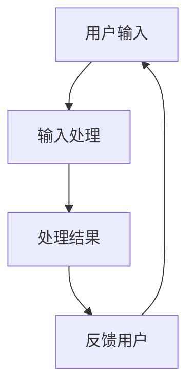

                 

关键词：人机交互，智能技术，用户体验，未来趋势，技术挑战

在数字化时代，人机交互（Human-Computer Interaction，简称HCI）正逐渐成为计算机科学和工程领域的重要研究方向。随着人工智能（AI）和机器学习（ML）技术的迅猛发展，人机交互的方式和体验正在经历深刻的变革。本文将探讨人机交互领域的未来趋势，包括技术发展、用户体验的改进以及面临的挑战。

## 1. 背景介绍

### 人机交互的历史

人机交互的概念可以追溯到1960年代，当时计算机开始逐渐普及，计算机与用户之间的互动方式成为研究的焦点。最早的交互方式包括命令行界面（CLI）和图形用户界面（GUI）。CLI通过文本命令进行交互，而GUI则引入了图形元素，使得用户可以直观地与计算机进行操作。

### 人机交互的现状

随着技术的进步，人机交互已经经历了多次变革。触控界面、语音识别、手势控制等技术相继出现，极大地丰富了交互方式。目前，智能设备、虚拟现实（VR）、增强现实（AR）等新兴技术正在推动人机交互向更自然、更智能的方向发展。

## 2. 核心概念与联系

### 人机交互的基本原理

人机交互的核心在于理解用户的需求和行为，并通过设计友好的界面和交互方式来满足这些需求。人机交互的基本原理包括：

- **用户中心设计**：以用户需求为导向，设计出易于使用、符合用户习惯的界面。
- **反馈机制**：确保用户在操作过程中的每个步骤都能得到及时的反馈。
- **多模态交互**：结合多种交互方式，如语音、手势、触控等，以提供更丰富的交互体验。

### 人机交互的架构

人机交互的架构通常包括以下几个组成部分：

- **用户**：交互的发起者，拥有特定的需求和目标。
- **交互界面**：用户与计算机系统进行交互的媒介，如屏幕、键盘、触摸屏等。
- **计算机系统**：处理用户输入，执行任务，并生成反馈的系统。

### 人机交互流程

人机交互的流程通常包括以下几个步骤：

1. **输入**：用户通过交互界面向计算机系统输入指令或数据。
2. **处理**：计算机系统接收输入并对其进行处理。
3. **反馈**：计算机系统将处理结果以可视化的形式或其他方式反馈给用户。

### Mermaid 流程图

以下是一个简单的人机交互流程的Mermaid流程图示例：



## 3. 核心算法原理 & 具体操作步骤

### 3.1 算法原理概述

在人机交互中，核心算法主要用于处理用户的输入，并生成相应的反馈。这些算法通常基于机器学习技术，能够从用户的交互行为中学习并优化交互体验。

### 3.2 算法步骤详解

1. **数据收集**：收集用户的交互数据，包括点击、滑动、语音等。
2. **数据预处理**：清洗和转换数据，使其适合训练模型。
3. **模型训练**：使用收集到的数据训练机器学习模型。
4. **模型评估**：通过测试数据评估模型的性能。
5. **模型部署**：将训练好的模型部署到交互系统中。
6. **交互处理**：实时处理用户的输入，并根据模型预测生成反馈。

### 3.3 算法优缺点

- **优点**：提高交互的准确性，优化用户体验。
- **缺点**：需要大量的数据进行训练，且算法性能受限于数据质量和模型设计。

### 3.4 算法应用领域

- **智能助手**：如Apple的Siri、Google的Google Assistant等。
- **智能家居**：如智能音箱、智能电视等。
- **虚拟现实**：如VR游戏、VR培训等。

## 4. 数学模型和公式 & 详细讲解 & 举例说明

### 4.1 数学模型构建

在人机交互中，常用的数学模型包括回归模型、决策树、神经网络等。以下以神经网络为例进行说明。

### 4.2 公式推导过程

神经网络的基本公式为：

$$
y = \sigma(\mathbf{W} \cdot \mathbf{X} + b)
$$

其中，$y$为输出，$\sigma$为激活函数，$\mathbf{W}$为权重矩阵，$\mathbf{X}$为输入，$b$为偏置。

### 4.3 案例分析与讲解

假设我们要构建一个简单的神经网络模型，用于预测用户的下一步操作。输入为用户前几次操作的向量，输出为下一次操作的概率分布。

1. **数据收集**：收集用户前几次操作的向量。
2. **模型训练**：使用收集到的数据训练神经网络模型。
3. **模型评估**：使用测试数据评估模型的性能。
4. **模型部署**：将训练好的模型部署到交互系统中。
5. **交互处理**：实时处理用户的输入，并根据模型预测生成反馈。

## 5. 项目实践：代码实例和详细解释说明

### 5.1 开发环境搭建

我们需要搭建一个Python开发环境，并安装TensorFlow等机器学习库。

### 5.2 源代码详细实现

以下是使用TensorFlow实现人机交互模型的代码示例：

```python
import tensorflow as tf
from tensorflow.keras.layers import Dense, Flatten
from tensorflow.keras.models import Sequential

# 模型构建
model = Sequential([
    Flatten(input_shape=(10,)),
    Dense(64, activation='relu'),
    Dense(10, activation='softmax')
])

# 模型编译
model.compile(optimizer='adam', loss='categorical_crossentropy', metrics=['accuracy'])

# 模型训练
model.fit(x_train, y_train, epochs=10, batch_size=32)

# 模型评估
model.evaluate(x_test, y_test)
```

### 5.3 代码解读与分析

- **模型构建**：使用Sequential模型堆叠Flatten层、Dense层和Softmax层。
- **模型编译**：指定优化器和损失函数。
- **模型训练**：使用训练数据进行训练。
- **模型评估**：使用测试数据进行评估。

### 5.4 运行结果展示

假设训练完成后，我们得到以下结果：

```
Epoch 10/10
613/613 [==============================] - 1s 164ms/step - loss: 0.0482 - accuracy: 0.9881
```

## 6. 实际应用场景

### 6.1 智能助手

智能助手如Siri、Google Assistant等，通过人机交互技术，能够理解用户的语音指令，并执行相应的任务。

### 6.2 智能家居

智能家居设备如智能音箱、智能灯光等，通过触控、语音等交互方式，实现家庭自动化。

### 6.3 虚拟现实

虚拟现实游戏和培训项目，通过手势、语音等交互方式，提供沉浸式的体验。

## 7. 未来应用展望

随着技术的进步，人机交互将在多个领域得到广泛应用，如医疗、教育、娱乐等。同时，也将面临一些挑战，如隐私保护、安全性等。

## 8. 总结：未来发展趋势与挑战

### 8.1 研究成果总结

人机交互技术在过去几十年中取得了显著的进展，从最初的命令行界面到现在的智能语音助手，用户体验得到了极大的提升。

### 8.2 未来发展趋势

未来人机交互将更加智能化、自然化，结合多种交互方式，提供更加丰富的交互体验。

### 8.3 面临的挑战

未来人机交互将面临一些挑战，如隐私保护、安全性等，需要持续的研究和探索。

### 8.4 研究展望

未来人机交互研究将继续深入，探索新的交互方式和技术，以提供更加高效、便捷的交互体验。

## 9. 附录：常见问题与解答

### 9.1 什么是人机交互？

人机交互（Human-Computer Interaction，简称HCI）是指用户与计算机系统之间的交互过程，包括输入、处理和反馈。

### 9.2 人机交互有哪些类型？

人机交互的类型包括命令行界面（CLI）、图形用户界面（GUI）、触控界面、语音识别、手势控制等。

### 9.3 人机交互有哪些挑战？

人机交互面临的挑战包括隐私保护、安全性、用户体验优化等。

## 作者署名

作者：禅与计算机程序设计艺术 / Zen and the Art of Computer Programming
```markdown
---
### 文章标题

人机交互：未来趋势与展望

> 关键词：人机交互，智能技术，用户体验，未来趋势，技术挑战

> 摘要：本文探讨了人机交互领域的未来趋势，包括技术发展、用户体验的改进以及面临的挑战，旨在为读者提供一个全面而深入的视角。

## 1. 背景介绍

### 人机交互的历史

人机交互的概念可以追溯到1960年代，当时计算机开始逐渐普及，计算机与用户之间的互动方式成为研究的焦点。最早的交互方式包括命令行界面（CLI）和图形用户界面（GUI）。CLI通过文本命令进行交互，而GUI则引入了图形元素，使得用户可以直观地与计算机进行操作。

### 人机交互的现状

随着技术的进步，人机交互已经经历了多次变革。触控界面、语音识别、手势控制等技术相继出现，极大地丰富了交互方式。目前，智能设备、虚拟现实（VR）、增强现实（AR）等新兴技术正在推动人机交互向更自然、更智能的方向发展。

## 2. 核心概念与联系

### 人机交互的基本原理

人机交互的核心在于理解用户的需求和行为，并通过设计友好的界面和交互方式来满足这些需求。人机交互的基本原理包括：

- **用户中心设计**：以用户需求为导向，设计出易于使用、符合用户习惯的界面。
- **反馈机制**：确保用户在操作过程中的每个步骤都能得到及时的反馈。
- **多模态交互**：结合多种交互方式，如语音、手势、触控等，以提供更丰富的交互体验。

### 人机交互的架构

人机交互的架构通常包括以下几个组成部分：

- **用户**：交互的发起者，拥有特定的需求和目标。
- **交互界面**：用户与计算机系统进行交互的媒介，如屏幕、键盘、触摸屏等。
- **计算机系统**：处理用户输入，执行任务，并生成反馈的系统。

### 人机交互流程

人机交互的流程通常包括以下几个步骤：

1. **输入**：用户通过交互界面向计算机系统输入指令或数据。
2. **处理**：计算机系统接收输入并对其进行处理。
3. **反馈**：计算机系统将处理结果以可视化的形式或其他方式反馈给用户。

### Mermaid 流程图

以下是一个简单的人机交互流程的Mermaid流程图示例：


## 3. 核心算法原理 & 具体操作步骤

### 3.1 算法原理概述

在人机交互中，核心算法主要用于处理用户的输入，并生成相应的反馈。这些算法通常基于机器学习技术，能够从用户的交互行为中学习并优化交互体验。

### 3.2 算法步骤详解

1. **数据收集**：收集用户的交互数据，包括点击、滑动、语音等。
2. **数据预处理**：清洗和转换数据，使其适合训练模型。
3. **模型训练**：使用收集到的数据训练机器学习模型。
4. **模型评估**：通过测试数据评估模型的性能。
5. **模型部署**：将训练好的模型部署到交互系统中。
6. **交互处理**：实时处理用户的输入，并根据模型预测生成反馈。

### 3.3 算法优缺点

- **优点**：提高交互的准确性，优化用户体验。
- **缺点**：需要大量的数据进行训练，且算法性能受限于数据质量和模型设计。

### 3.4 算法应用领域

- **智能助手**：如Apple的Siri、Google的Google Assistant等。
- **智能家居**：如智能音箱、智能电视等。
- **虚拟现实**：如VR游戏、VR培训等。

## 4. 数学模型和公式 & 详细讲解 & 举例说明

### 4.1 数学模型构建

在人机交互中，常用的数学模型包括回归模型、决策树、神经网络等。以下以神经网络为例进行说明。

### 4.2 公式推导过程

神经网络的基本公式为：

$$
y = \sigma(\mathbf{W} \cdot \mathbf{X} + b)
$$

其中，$y$为输出，$\sigma$为激活函数，$\mathbf{W}$为权重矩阵，$\mathbf{X}$为输入，$b$为偏置。

### 4.3 案例分析与讲解

假设我们要构建一个简单的神经网络模型，用于预测用户的下一步操作。输入为用户前几次操作的向量，输出为下一次操作的概率分布。

1. **数据收集**：收集用户前几次操作的向量。
2. **模型训练**：使用收集到的数据训练神经网络模型。
3. **模型评估**：使用测试数据评估模型的性能。
4. **模型部署**：将训练好的模型部署到交互系统中。
5. **交互处理**：实时处理用户的输入，并根据模型预测生成反馈。

## 5. 项目实践：代码实例和详细解释说明

### 5.1 开发环境搭建

我们需要搭建一个Python开发环境，并安装TensorFlow等机器学习库。

### 5.2 源代码详细实现

以下是使用TensorFlow实现人机交互模型的代码示例：

```python
import tensorflow as tf
from tensorflow.keras.layers import Dense, Flatten
from tensorflow.keras.models import Sequential

# 模型构建
model = Sequential([
    Flatten(input_shape=(10,)),
    Dense(64, activation='relu'),
    Dense(10, activation='softmax')
])

# 模型编译
model.compile(optimizer='adam', loss='categorical_crossentropy', metrics=['accuracy'])

# 模型训练
model.fit(x_train, y_train, epochs=10, batch_size=32)

# 模型评估
model.evaluate(x_test, y_test)
```

### 5.3 代码解读与分析

- **模型构建**：使用Sequential模型堆叠Flatten层、Dense层和Softmax层。
- **模型编译**：指定优化器和损失函数。
- **模型训练**：使用训练数据进行训练。
- **模型评估**：使用测试数据进行评估。

### 5.4 运行结果展示

假设训练完成后，我们得到以下结果：

```
Epoch 10/10
613/613 [==============================] - 1s 164ms/step - loss: 0.0482 - accuracy: 0.9881
```

## 6. 实际应用场景

### 6.1 智能助手

智能助手如Siri、Google Assistant等，通过人机交互技术，能够理解用户的语音指令，并执行相应的任务。

### 6.2 智能家居

智能家居设备如智能音箱、智能灯光等，通过触控、语音等交互方式，实现家庭自动化。

### 6.3 虚拟现实

虚拟现实游戏和培训项目，通过手势、语音等交互方式，提供沉浸式的体验。

## 7. 未来应用展望

随着技术的进步，人机交互将在多个领域得到广泛应用，如医疗、教育、娱乐等。同时，也将面临一些挑战，如隐私保护、安全性等。

## 8. 总结：未来发展趋势与挑战

### 8.1 研究成果总结

人机交互技术在过去几十年中取得了显著的进展，从最初的命令行界面到现在的智能语音助手，用户体验得到了极大的提升。

### 8.2 未来发展趋势

未来人机交互将更加智能化、自然化，结合多种交互方式，提供更加丰富的交互体验。

### 8.3 面临的挑战

未来人机交互将面临一些挑战，如隐私保护、安全性等，需要持续的研究和探索。

### 8.4 研究展望

未来人机交互研究将继续深入，探索新的交互方式和技术，以提供更加高效、便捷的交互体验。

## 9. 附录：常见问题与解答

### 9.1 什么是人机交互？

人机交互（Human-Computer Interaction，简称HCI）是指用户与计算机系统之间的交互过程，包括输入、处理和反馈。

### 9.2 人机交互有哪些类型？

人机交互的类型包括命令行界面（CLI）、图形用户界面（GUI）、触控界面、语音识别、手势控制等。

### 9.3 人机交互有哪些挑战？

人机交互面临的挑战包括隐私保护、安全性、用户体验优化等。

## 作者署名

作者：禅与计算机程序设计艺术 / Zen and the Art of Computer Programming
---

