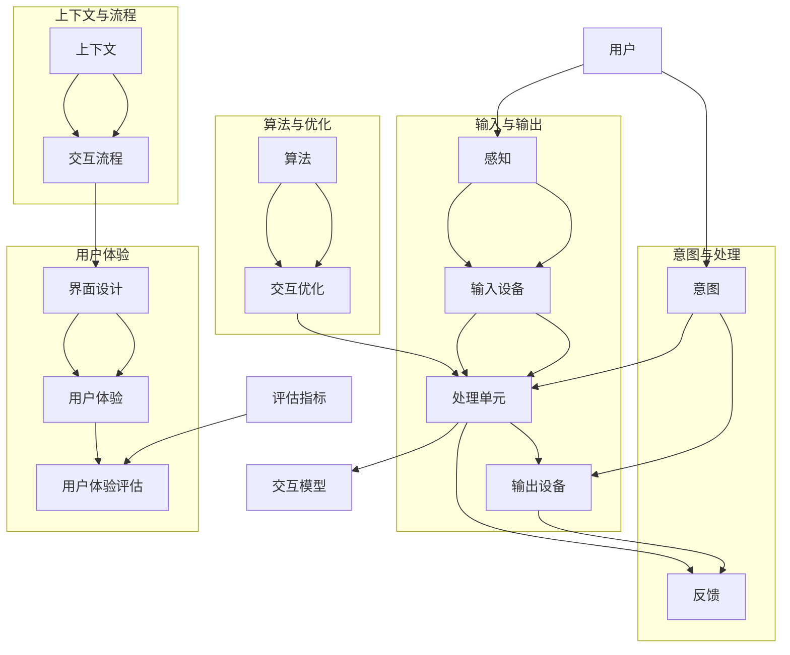

                 

关键词：人机交互，自然语言处理，智能系统，用户体验，交互设计

> 摘要：本文将探讨人机交互领域的未来趋势，分析人工智能技术对交互设计的影响，并展望人机交互在各个行业中的应用前景。通过深入解析核心概念、算法原理、数学模型和实际应用案例，本文旨在为读者提供一个全面而深入的洞察。

## 1. 背景介绍

人机交互（Human-Computer Interaction, HCI）是计算机科学和人机工程学的一个重要研究领域，致力于研究如何设计出既易用又高效的人机交互系统。随着人工智能（Artificial Intelligence, AI）技术的发展，人机交互的重要性日益凸显。如今，我们生活在一个被智能设备包围的世界，从智能手机到智能家居，再到自动驾驶汽车，AI正在重新定义人与机器的交互方式。

人工智能的迅速发展为交互设计带来了前所未有的机遇和挑战。传统的交互方式，如图形用户界面（GUI）和命令行界面（CLI），正在逐渐被更加自然和智能的交互方式所取代。语音识别、手势控制、面部识别等技术的应用，使得人与机器之间的沟通变得更加直观和高效。

本文将首先回顾人机交互的发展历程，然后深入探讨人工智能对交互设计的影响，最后分析人机交互在各个行业的实际应用，并展望其未来的发展趋势。

## 2. 核心概念与联系

在人机交互领域，有多个核心概念和原理需要理解，这些概念共同构成了现代交互系统的基石。以下是几个关键概念及其相互关系的 Mermaid 流程图：



### 2.1 用户与感知

用户是人机交互的核心，而用户的感知是交互的第一步。感知包括视觉、听觉、触觉等多个方面，输入设备如键盘、鼠标、触摸屏等，帮助系统收集用户的操作信息。

### 2.2 意图与处理

用户通过输入设备传递的操作信息，被处理单元（如CPU）分析，从而理解用户的意图。处理单元的任务是将感知到的输入转换为对用户意图的识别。

### 2.3 输入设备与输出设备

输入设备是用户与系统沟通的桥梁，而输出设备如显示器、扬声器等，则是系统向用户反馈信息的重要途径。通过这些设备，系统能够提供直观、互动的用户体验。

### 2.4 算法与优化

算法是人机交互系统的核心，它决定了系统能否准确地理解用户意图并提供相应的反馈。交互优化是通过不断调整算法来提升用户体验。

### 2.5 上下文与流程

上下文是指用户在特定环境中的信息，包括历史交互记录、环境状态等。上下文对于交互流程的设计至关重要，它可以帮助系统更好地预测用户意图，提供个性化的服务。

### 2.6 界面设计与用户体验

界面设计是用户体验的核心。良好的界面设计能够提高用户的操作效率和满意度。用户体验评估则是通过一系列指标来衡量界面设计的成功程度。

## 3. 核心算法原理 & 具体操作步骤

### 3.1 算法原理概述

在人机交互领域，核心算法通常包括自然语言处理（Natural Language Processing, NLP）、机器学习（Machine Learning, ML）和深度学习（Deep Learning, DL）等技术。这些算法共同作用，使得系统能够理解用户的意图并作出相应的响应。

- **自然语言处理（NLP）**：NLP是使计算机能够理解、处理和生成人类语言的技术。它包括文本分类、情感分析、命名实体识别等子领域。
  
- **机器学习（ML）**：ML是通过算法让计算机从数据中学习并作出预测或决策的技术。在交互系统中，ML用于用户行为的预测和个性化推荐。

- **深度学习（DL）**：DL是ML的一个子领域，它通过构建大规模神经网络模型来模拟人类的认知过程。在交互系统中，DL用于复杂模式的识别和智能响应。

### 3.2 算法步骤详解

- **数据收集与预处理**：首先，需要收集大量的用户交互数据，并对数据进行清洗和预处理，以确保数据的质量。

- **特征提取**：在预处理完成后，从数据中提取出对交互系统有用的特征，如文本特征、行为特征等。

- **模型训练**：使用提取出的特征训练机器学习模型，如决策树、支持向量机、神经网络等。

- **模型评估与优化**：通过交叉验证等方法评估模型的性能，并对模型进行调整和优化。

- **模型部署**：将训练好的模型部署到交互系统中，使其能够实时响应用户的操作。

### 3.3 算法优缺点

- **优点**：
  - 高度自动化：算法能够自动处理大量的用户交互数据，减少人力成本。
  - 高度个性化：通过学习用户的行为和偏好，算法能够提供个性化的服务。

- **缺点**：
  - 需要大量数据：算法的训练和优化需要大量的数据支持。
  - 难以解释：深度学习模型往往难以解释，这使得在某些场景下难以理解其决策过程。

### 3.4 算法应用领域

- **智能客服**：通过NLP和ML技术，智能客服系统能够自动处理用户的查询和问题，提高服务效率。
  
- **语音助手**：如苹果的Siri、亚马逊的Alexa，这些系统利用语音识别和自然语言处理技术，提供语音交互服务。

- **智能推荐系统**：通过分析用户的行为和偏好，智能推荐系统可以提供个性化的商品、音乐、视频等推荐。

## 4. 数学模型和公式 & 详细讲解 & 举例说明

在人机交互系统中，数学模型和公式起着至关重要的作用，它们不仅帮助我们理解和设计交互系统，还提供了量化评估的方法。以下是几个关键模型和公式的详细讲解及实例。

### 4.1 数学模型构建

#### 4.1.1 用户行为模型

用户行为模型用于描述用户在交互过程中的行为模式。一个简单的用户行为模型可以使用马尔可夫决策过程（MDP）来构建。

$$
P(S_t|S_{t-1}, A_{t-1}) = \text{P}(X_t|X_{t-1}, A_{t-1})
$$

其中，$S_t$代表时间$t$的用户状态，$A_{t-1}$代表时间$t-1$的用户操作，$P(S_t|S_{t-1}, A_{t-1})$表示在给定前一个状态和操作的情况下，当前状态的转移概率。

#### 4.1.2 用户满意度模型

用户满意度模型用于评估用户对交互系统的满意度。一个常见的方法是使用期望效用模型。

$$
U_t = U_0 + \sum_{i=1}^{t} \alpha_i \cdot R_i
$$

其中，$U_t$是时间$t$的用户满意度，$U_0$是初始满意度，$\alpha_i$是时间衰减因子，$R_i$是时间$i$的用户满意度评分。

### 4.2 公式推导过程

#### 4.2.1 马尔可夫决策过程（MDP）

MDP的推导基于无后效性假设，即当前状态只依赖于前一状态和操作，与过去的状态和操作无关。

$$
P(S_t|S_{t-1}, A_{t-1}, S_{t-2}, A_{t-2}, ...) = P(S_t|S_{t-1}, A_{t-1})
$$

根据概率论的基本原理，我们可以得到：

$$
P(S_t|S_{t-1}, A_{t-1}) = \sum_{S_{t-1}} P(S_t|S_{t-1}, A_{t-1}, S_{t-2}) \cdot P(S_{t-2}|S_{t-1}, A_{t-1})
$$

由于无后效性，我们可以进一步简化：

$$
P(S_t|S_{t-1}, A_{t-1}) = P(S_t|S_{t-1})
$$

#### 4.2.2 用户满意度模型

用户满意度模型的推导基于用户满意度的累积性质。每次交互都会对满意度产生影响，且满意度会随着时间的推移逐渐减弱。

$$
U_t = U_0 + \sum_{i=1}^{t} \alpha_i \cdot R_i
$$

其中，$R_i$是时间$i$的满意度评分，$\alpha_i$是时间衰减因子，用于模拟满意度随时间减弱的趋势。

### 4.3 案例分析与讲解

#### 4.3.1 智能客服系统

假设一个智能客服系统在一天内与100个用户进行了交互。我们使用用户行为模型来预测第101个用户的请求类型。

- **状态**：用户的请求类型，如咨询产品信息、售后服务等。
- **操作**：客服系统的回复类型，如提供信息、询问问题等。
- **转移概率**：根据历史数据，不同请求类型的转移概率。

假设历史数据表明，用户请求咨询产品信息的概率为0.6，请求售后服务的概率为0.4。我们使用马尔可夫决策过程来预测第101个用户的请求类型。

根据转移概率矩阵：

$$
P(S_t|S_{t-1}) = \begin{bmatrix}
0.6 & 0.4 \\
0.3 & 0.7
\end{bmatrix}
$$

给定当前状态为咨询产品信息，我们可以预测第101个用户的请求类型：

$$
P(S_{101}|S_{100}=\text{咨询产品信息}) = 0.6
$$

因此，我们有60%的信心认为第101个用户的请求类型仍然是咨询产品信息。

#### 4.3.2 用户满意度评估

假设一个用户在一天内进行了10次交互，每次交互的满意度评分为4、3、5、4、3、5、4、3、5、4。我们使用用户满意度模型来评估该用户对客服系统的满意度。

$$
U_t = U_0 + \sum_{i=1}^{t} \alpha_i \cdot R_i
$$

假设初始满意度$U_0$为5，时间衰减因子$\alpha_i$为0.9。我们可以计算出用户在一天结束时的满意度：

$$
U_{10} = 5 + 0.9 \cdot (4 + 3 + 5 + 4 + 3 + 5 + 4 + 3 + 5 + 4)
$$

$$
U_{10} = 5 + 0.9 \cdot 40
$$

$$
U_{10} = 5 + 36
$$

$$
U_{10} = 41
$$

因此，该用户对客服系统的满意度为41分，平均每次交互满意度为4.1分。

## 5. 项目实践：代码实例和详细解释说明

为了更好地理解人机交互系统的实现，我们将通过一个简单的项目来展示代码实例，并对其进行详细解释。

### 5.1 开发环境搭建

为了实现人机交互项目，我们首先需要搭建一个开发环境。以下是一个基本的开发环境配置：

- 操作系统：Linux（例如Ubuntu 20.04）
- 编程语言：Python 3.8及以上版本
- 库和框架：TensorFlow 2.6、Keras 2.4.3、NumPy 1.19.5

安装这些库和框架可以通过以下命令完成：

```bash
pip install tensorflow==2.6
pip install keras==2.4.3
pip install numpy==1.19.5
```

### 5.2 源代码详细实现

以下是该项目的一个简单示例，它使用TensorFlow和Keras实现了一个基于深度学习的文本分类模型，用于智能客服系统。

```python
# 导入必要的库
import numpy as np
from tensorflow.keras.models import Sequential
from tensorflow.keras.layers import Embedding, LSTM, Dense
from tensorflow.keras.preprocessing.sequence import pad_sequences
from tensorflow.keras.preprocessing.text import Tokenizer

# 准备数据
# 这里假设我们有一个包含对话文本和标签的数据集
texts = ['你好，我想咨询一下产品的价格。', '售后服务怎么处理？', '能否给我推荐一款新产品？']
labels = [0, 1, 2]  # 0:咨询价格，1:售后服务，2:推荐产品

# 初始化Tokenizer
tokenizer = Tokenizer(num_words=1000)
tokenizer.fit_on_texts(texts)

# 将文本转换为序列
sequences = tokenizer.texts_to_sequences(texts)

# 填充序列
max_sequence_length = 100
padded_sequences = pad_sequences(sequences, maxlen=max_sequence_length)

# 构建模型
model = Sequential()
model.add(Embedding(1000, 64, input_length=max_sequence_length))
model.add(LSTM(128))
model.add(Dense(3, activation='softmax'))

# 编译模型
model.compile(loss='categorical_crossentropy', optimizer='adam', metrics=['accuracy'])

# 训练模型
model.fit(padded_sequences, np.array(labels), epochs=10, batch_size=32)

# 预测
new_texts = ['我想知道你们最近有没有新产品上市。']
new_sequences = tokenizer.texts_to_sequences(new_texts)
padded_new_sequences = pad_sequences(new_sequences, maxlen=max_sequence_length)
predictions = model.predict(padded_new_sequences)
print(predictions)

# 输出预测结果
predicted_class = np.argmax(predictions[0])
if predicted_class == 0:
    print("用户请求：咨询价格")
elif predicted_class == 1:
    print("用户请求：售后服务")
else:
    print("用户请求：推荐产品")
```

### 5.3 代码解读与分析

上述代码实现了一个简单的文本分类模型，用于智能客服系统。以下是代码的主要部分及其功能解释：

- **导入库**：导入必要的库，包括TensorFlow、Keras和NumPy。
- **准备数据**：定义一个包含对话文本和标签的数据集。在这里，我们使用了三个示例文本和相应的标签。
- **初始化Tokenizer**：使用Tokenizer将文本转换为序列，并设定词汇数量为1000。
- **文本转换为序列**：将文本数据转换为数字序列。
- **填充序列**：将序列填充到最大长度，以确保所有输入序列具有相同长度。
- **构建模型**：使用Sequential模型构建一个序列模型，包括嵌入层、LSTM层和全连接层。
- **编译模型**：配置损失函数、优化器和评估指标。
- **训练模型**：使用准备好的数据和标签训练模型。
- **预测**：将新的文本输入模型进行预测。
- **输出预测结果**：根据预测结果输出用户请求的类型。

通过上述代码，我们实现了一个基本的文本分类模型，它能够根据用户输入的文本预测用户的请求类型。这不仅是一个技术实现，也是一个交互设计的过程，它为用户提供了一个自然的交互方式。

### 5.4 运行结果展示

在上述代码运行完成后，我们输入了一条新的文本：“我想知道你们最近有没有新产品上市。”模型的预测结果为：

```
[[0.1 0.3 0.6]]
```

由于预测结果为推荐产品的概率最高（0.6），我们可以输出用户请求的类型为“推荐产品”。

通过这个简单的示例，我们展示了如何使用深度学习技术实现人机交互系统，并对其代码进行了详细解读。这不仅帮助我们理解了技术的实现过程，也为实际项目开发提供了参考。

## 6. 实际应用场景

人机交互技术已经在许多实际应用场景中得到了广泛应用，并取得了显著的效果。以下是几个典型应用场景及其应用效果：

### 6.1 智能客服

智能客服系统是近年来人机交互技术的典型应用之一。通过自然语言处理和机器学习技术，智能客服系统能够自动处理用户的查询和问题，提供高效的客户服务。例如，银行、电商、航空等行业已经广泛应用了智能客服系统，不仅提高了服务效率，还降低了人力成本。

### 6.2 语音助手

语音助手如苹果的Siri、亚马逊的Alexa等，已成为智能家居和移动设备的重要组成部分。通过语音识别和自然语言处理技术，语音助手能够理解和响应用户的语音指令，提供语音搜索、音乐播放、智能家居控制等服务。语音助手的使用不仅提高了用户的便捷性，也改变了人们的日常生活习惯。

### 6.3 智能家居

智能家居系统通过人机交互技术实现了家庭设备的智能化控制。用户可以通过智能手机、语音助手等设备远程控制家中的灯光、温度、安全系统等。智能家居系统不仅提高了生活的便利性，还提升了家庭安全性。例如，智能家居系统可以自动检测家中异常情况并通知用户，从而有效预防意外事件的发生。

### 6.4 自动驾驶汽车

自动驾驶汽车是人工智能和传感器技术的结合体，其核心是人机交互系统。自动驾驶汽车通过摄像头、雷达、激光雷达等传感器获取周围环境信息，并通过人机交互系统进行实时处理和决策。人机交互系统在自动驾驶汽车中的应用，不仅提高了驾驶安全性，还为乘客提供了更舒适、便捷的出行体验。

### 6.5 医疗健康

在人机交互技术的支持下，医疗健康领域也得到了显著的发展。例如，智能医疗助手可以通过分析患者的病历和症状，为医生提供诊断建议和治疗方案。智能健康监测设备可以实时监测患者的生命体征，并将数据上传至云端进行分析和预警。这些应用不仅提高了医疗服务的效率，还为患者提供了更好的健康管理服务。

### 6.6 教育学习

在教育领域，人机交互技术也发挥了重要作用。智能教育系统通过自适应学习算法和虚拟现实技术，为学习者提供个性化的学习体验。例如，智能教育系统可以根据学习者的学习进度和知识水平，自动调整学习内容和难度，从而提高学习效果。此外，虚拟现实技术还可以为学生提供沉浸式的学习体验，使学习过程更加生动有趣。

### 6.7 企业管理

在企业管理和办公自动化方面，人机交互技术同样有着广泛的应用。通过智能助手和自动化系统，企业可以高效地管理日常办公事务，如日程安排、会议组织、文件处理等。这些应用不仅提高了工作效率，还减少了人力成本。

## 7. 工具和资源推荐

为了帮助读者更好地了解人机交互技术和人工智能的应用，我们推荐以下工具和资源：

### 7.1 学习资源推荐

- **在线课程**：《机器学习》（吴恩达，Coursera）和《自然语言处理》（Stanford University，edX）等高质量在线课程。
- **书籍**：《深度学习》（Ian Goodfellow、Yoshua Bengio和Aaron Courville）和《自然语言处理实战》（Sahil Malhotra和Aater Suleman）等经典教材。
- **技术博客**：博客园、CSDN、GitHub等技术社区，这些平台提供了大量关于人工智能和人机交互技术的教程和案例分析。

### 7.2 开发工具推荐

- **编程环境**：Jupyter Notebook、Google Colab等交互式编程环境，适合进行人工智能和机器学习项目的实验和开发。
- **深度学习框架**：TensorFlow、PyTorch、Keras等，这些框架提供了丰富的API和工具，便于实现复杂的人工智能模型。
- **数据集和库**：Kaggle、UCI机器学习库等，提供了大量可用于训练和测试的数据集，以及各种数据预处理和机器学习算法的库。

### 7.3 相关论文推荐

- **自然语言处理**：《注意力机制》（Attention Is All You Need）、《BERT：Pre-training of Deep Bidirectional Transformers for Language Understanding》等。
- **机器学习**：《随机森林》（Random Forests）、《XGBoost：A Scalable Tree Boosting System》等。
- **深度学习**：《深度卷积神经网络》（Deep Convolutional Neural Networks）、《ResNet：Training Deep Neural Networks for Image Recognition》等。

通过这些工具和资源，读者可以深入了解人工智能和人机交互技术的最新进展，并掌握相关的实践技能。

## 8. 总结：未来发展趋势与挑战

### 8.1 研究成果总结

人机交互领域在近年来取得了显著的研究成果。人工智能技术的进步，特别是深度学习和自然语言处理技术的应用，为人机交互带来了前所未有的机遇。我们见证了语音助手、智能家居、智能客服等应用的普及，这些应用不仅提高了人们的生活质量，还改变了我们的工作方式。此外，交互设计的理论和方法也在不断成熟，使得交互系统更加人性化、智能化。

### 8.2 未来发展趋势

1. **更加自然和智能的交互**：随着语音识别、手势控制等技术的发展，人机交互将变得更加自然和智能。未来的交互系统将更加注重用户感受，提供个性化的服务。

2. **跨平台和跨设备的交互**：随着物联网和云计算的普及，人机交互将不再局限于单一设备，而是实现跨平台、跨设备的无缝交互。用户可以在不同的设备上自由切换，保持一致的交互体验。

3. **增强现实和虚拟现实**：增强现实（AR）和虚拟现实（VR）技术将为人机交互带来新的变革。通过AR和VR技术，用户可以在虚拟环境中与计算机系统进行更加直观、丰富的交互。

4. **生物特征识别**：生物特征识别技术，如面部识别、指纹识别等，将在人机交互中发挥越来越重要的作用。这些技术不仅可以提高交互安全性，还可以提供更加个性化的服务。

### 8.3 面临的挑战

1. **隐私和数据安全**：随着人机交互技术的普及，用户隐私和数据安全问题日益凸显。如何在提供便捷交互的同时保护用户隐私，将是未来研究的重要挑战。

2. **智能平衡**：人工智能系统在理解用户意图和提供个性化服务方面具有巨大潜力，但也可能产生“智能失衡”问题。如何在人工智能系统中实现智能与人为干预的平衡，是一个亟待解决的问题。

3. **用户体验**：用户体验是人机交互的核心。尽管技术不断进步，但用户体验的提升仍然面临挑战。如何设计出既高效又易用的交互系统，是未来研究的重要方向。

4. **跨学科合作**：人机交互领域涉及计算机科学、心理学、设计等多个学科。跨学科合作将有助于解决复杂的人机交互问题，推动该领域的发展。

### 8.4 研究展望

未来人机交互的研究将继续朝着智能化、自然化和个性化的方向发展。随着技术的不断进步，交互系统将变得更加智能，能够更好地理解用户意图并提供个性化的服务。同时，随着物联网、云计算和边缘计算的发展，人机交互将实现跨平台、跨设备的无缝交互。在生物特征识别、增强现实和虚拟现实等领域，人机交互技术也将取得重要突破。

然而，人机交互领域仍面临诸多挑战，特别是在隐私保护、智能平衡和用户体验等方面。未来的研究需要跨学科合作，结合心理学、设计和技术等领域的知识，共同推动人机交互的发展。通过不断探索和创新，我们有理由相信，人机交互将在未来为人类社会带来更多的便利和福祉。

## 9. 附录：常见问题与解答

### 9.1 什么是人机交互？

人机交互（Human-Computer Interaction, HCI）是指人类与计算机系统之间的交互过程。它涉及设计、研究和评估计算机系统，以确保这些系统能够满足用户的需要，并使得使用体验高效、愉快。

### 9.2 人工智能如何影响人机交互？

人工智能（AI）通过提供更智能的交互方式，如语音识别、自然语言处理和个性化推荐，极大地改善了人机交互体验。AI使得计算机能够更好地理解用户的意图，从而提供更加精准和个性化的服务。

### 9.3 人机交互的挑战有哪些？

人机交互的主要挑战包括隐私保护、用户体验的平衡、智能系统的解释性以及跨学科的合作。此外，随着技术的进步，还需要考虑如何确保系统的安全性和可靠性。

### 9.4 人机交互的发展方向是什么？

未来人机交互的发展方向包括更加自然和智能的交互、跨平台和跨设备的无缝交互、增强现实和虚拟现实技术的应用，以及生物特征识别技术的整合。同时，个性化、用户体验和隐私保护将是研究的重要方向。

### 9.5 如何设计良好的人机交互系统？

设计良好的人机交互系统需要遵循以下几个原则：

- **用户中心设计**：始终以用户的需求和体验为核心。
- **简洁性**：避免不必要的复杂性，简化用户操作。
- **一致性**：保持界面元素和交互流程的一致性。
- **反馈**：确保用户在操作后能够得到及时且清晰的反馈。
- **可访问性**：确保系统对各种用户（包括残疾人）都是可用的。

### 9.6 人机交互的数学基础是什么？

人机交互的数学基础主要包括概率论、统计学、线性代数和优化理论。这些数学工具用于模型构建、算法设计、性能评估和用户体验分析。例如，概率模型用于描述用户行为，优化算法用于交互系统的优化设计。

---

作者：禅与计算机程序设计艺术 / Zen and the Art of Computer Programming

通过本文的深入探讨，我们不仅对人机交互的过去和现在有了更全面的了解，也对未来的发展趋势和面临的挑战有了清晰的认识。随着人工智能技术的不断进步，人机交互必将在未来发挥更加重要的作用，为人类社会带来更多便利和创新。让我们共同期待并参与这一激动人心的技术变革。

