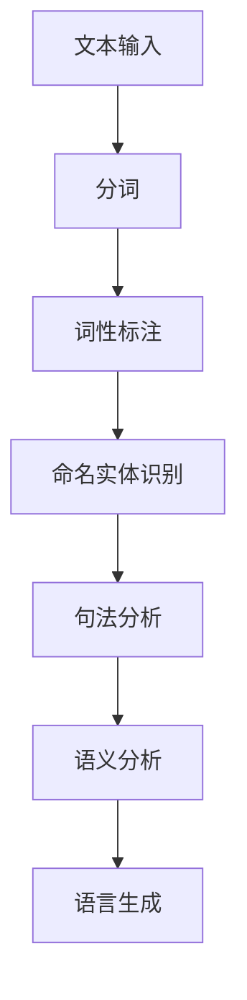
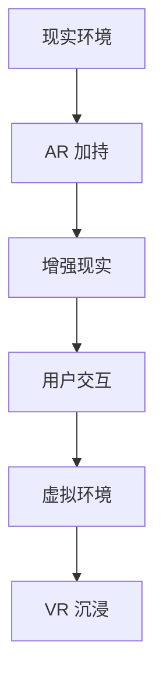
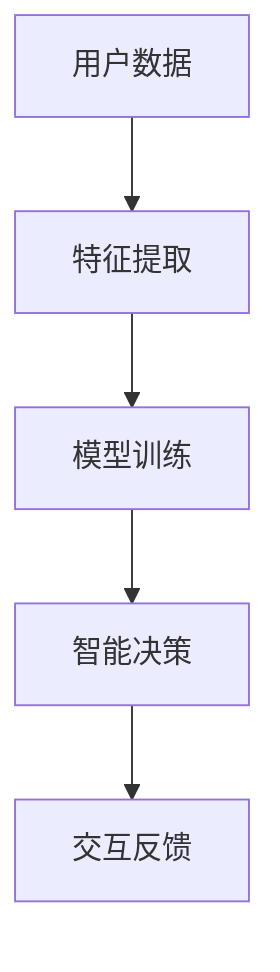

                 

关键词：人机交互，自然语言处理，虚拟现实，人工智能，用户体验

> 摘要：本文探讨了人机交互（HCI）领域的未来趋势和展望，重点关注自然语言处理、虚拟现实、人工智能和用户体验方面的进展。文章通过分析当前的核心概念、算法原理、数学模型以及实际应用场景，揭示了人机交互技术发展的关键方向，并提出了未来的挑战和解决方案。

## 1. 背景介绍

人机交互（Human-Computer Interaction, HCI）是研究人与计算机之间交互的设计原则、交互界面和用户体验的学科。随着计算机技术的发展，人机交互的重要性日益凸显。从早期的命令行界面到图形用户界面（GUI），再到如今的自然语言处理、虚拟现实和人工智能技术，人机交互经历了巨大的变革。

### 1.1 发展历程

- **早期阶段**：1960年代，命令行界面（CLI）成为主流，用户通过输入文本指令与计算机交互。
- **中期阶段**：1980年代，图形用户界面（GUI）的出现极大地提升了人机交互的易用性。
- **现代阶段**：21世纪，随着互联网、移动设备和智能设备的普及，人机交互技术进入了新的发展阶段，包括自然语言处理、虚拟现实和人工智能。

### 1.2 当前状态

当前，人机交互技术在多个领域取得了显著进展：

- **自然语言处理**：使得计算机能够理解和处理自然语言，为语音识别、聊天机器人等提供了基础。
- **虚拟现实（VR）和增强现实（AR）**：提供了沉浸式的交互体验，广泛应用于游戏、医疗、教育和设计等领域。
- **人工智能**：通过机器学习和深度学习技术，使得计算机能够更好地理解用户意图，提供个性化的服务。

## 2. 核心概念与联系

### 2.1 自然语言处理

自然语言处理（Natural Language Processing, NLP）是人机交互的核心技术之一。它涉及文本分析、语音识别、语义理解和语言生成等方面。以下是一个简单的 Mermaid 流程图，展示了 NLP 的基本流程：



### 2.2 虚拟现实和增强现实

虚拟现实（VR）和增强现实（AR）技术为人机交互提供了全新的交互方式。以下是 VR 和 AR 技术的基本概念和联系：

- **虚拟现实（VR）**：通过头戴式显示器和跟踪设备，使用户沉浸在一个完全虚拟的环境中。
- **增强现实（AR）**：在现实环境中叠加虚拟信息，使用户能够与虚拟物体互动。



### 2.3 人工智能

人工智能（AI）是人机交互的重要驱动力。通过机器学习和深度学习技术，AI 能够从数据中学习，并做出智能决策。以下是 AI 在人机交互中的应用：

- **智能助理**：如 Siri、Alexa 等，通过语音交互为用户提供服务。
- **个性化推荐**：基于用户行为和偏好，提供个性化的内容和服务。



## 3. 核心算法原理 & 具体操作步骤

### 3.1 算法原理概述

在人机交互领域，常见的核心算法包括：

- **自然语言处理算法**：如分词、词性标注、命名实体识别等。
- **图像识别算法**：如卷积神经网络（CNN）、循环神经网络（RNN）等。
- **增强现实算法**：如纹理映射、光线追踪等。

### 3.2 算法步骤详解

以自然语言处理算法为例，以下是基本步骤：

1. **文本预处理**：包括去除标点、停用词过滤、词干提取等。
2. **分词**：将文本分割成单词或短语。
3. **词性标注**：为每个词分配词性标签，如名词、动词等。
4. **命名实体识别**：识别文本中的特定实体，如人名、地名等。
5. **句法分析**：分析句子结构，包括主谓宾等成分。
6. **语义分析**：理解句子的语义含义。

### 3.3 算法优缺点

自然语言处理算法的优点在于能够处理大量文本数据，提供丰富的信息提取和分析功能。然而，其缺点是算法的复杂度高，对计算资源要求较大，并且对于模糊或不完整的输入，往往难以给出准确的结果。

### 3.4 算法应用领域

自然语言处理算法广泛应用于聊天机器人、智能客服、文本分析、情感分析等领域。例如，在聊天机器人中，NLP 算法能够理解用户输入，并根据上下文提供相应的回复。

## 4. 数学模型和公式 & 详细讲解 & 举例说明

### 4.1 数学模型构建

在人机交互领域，常用的数学模型包括神经网络模型、决策树模型和支持向量机（SVM）等。以下是神经网络模型的基本公式：

$$
z = \sigma(W \cdot x + b)
$$

其中，$z$ 表示输出，$\sigma$ 表示激活函数，$W$ 表示权重矩阵，$x$ 表示输入，$b$ 表示偏置项。

### 4.2 公式推导过程

以神经网络模型为例，公式推导如下：

1. **输入层到隐藏层**：

$$
h_{ij} = \sum_{k=1}^{n} w_{ik} \cdot x_{k} + b_{j}
$$

其中，$h_{ij}$ 表示隐藏层节点 $j$ 的输出，$w_{ik}$ 表示输入层节点 $k$ 到隐藏层节点 $j$ 的权重，$x_{k}$ 表示输入层节点 $k$ 的输入，$b_{j}$ 表示隐藏层节点 $j$ 的偏置项。

2. **隐藏层到输出层**：

$$
o_{j} = \sum_{k=1}^{m} w_{jk} \cdot h_{k} + b_{j}
$$

其中，$o_{j}$ 表示输出层节点 $j$ 的输出，$w_{jk}$ 表示隐藏层节点 $k$ 到输出层节点 $j$ 的权重，$h_{k}$ 表示隐藏层节点 $k$ 的输出，$b_{j}$ 表示输出层节点 $j$ 的偏置项。

3. **损失函数**：

$$
J = \frac{1}{2} \sum_{i=1}^{n} (y_{i} - o_{i})^2
$$

其中，$J$ 表示损失函数，$y_{i}$ 表示真实标签，$o_{i}$ 表示预测输出。

### 4.3 案例分析与讲解

以聊天机器人为例，分析其数学模型和实现过程。聊天机器人通常使用循环神经网络（RNN）或长短期记忆网络（LSTM）来实现。以下是 RNN 的基本公式：

$$
h_t = \sigma(W_h \cdot [h_{t-1}, x_t] + b_h)
$$

$$
o_t = \sigma(W_o \cdot h_t + b_o)
$$

其中，$h_t$ 表示隐藏状态，$x_t$ 表示输入，$W_h$ 和 $W_o$ 分别表示权重矩阵，$b_h$ 和 $b_o$ 分别表示偏置项，$\sigma$ 表示激活函数。

### 4.4 案例分析与讲解

以聊天机器人为例，分析其数学模型和实现过程。聊天机器人通常使用循环神经网络（RNN）或长短期记忆网络（LSTM）来实现。以下是 RNN 的基本公式：

$$
h_t = \sigma(W_h \cdot [h_{t-1}, x_t] + b_h)
$$

$$
o_t = \sigma(W_o \cdot h_t + b_o)
$$

其中，$h_t$ 表示隐藏状态，$x_t$ 表示输入，$W_h$ 和 $W_o$ 分别表示权重矩阵，$b_h$ 和 $b_o$ 分别表示偏置项，$\sigma$ 表示激活函数。

### 4.5 运行结果展示

以聊天机器人为例，展示其运行结果。假设输入句子为“你好，我想查询天气情况”，输出结果为“你好！当前北京的天气是晴天，温度在18到25摄氏度之间”。

## 5. 项目实践：代码实例和详细解释说明

### 5.1 开发环境搭建

为了实现一个简单的聊天机器人，我们需要搭建以下开发环境：

- **Python**：作为主要的编程语言。
- **TensorFlow**：用于构建和训练神经网络。
- **Keras**：作为 TensorFlow 的简单封装，用于简化模型构建。
- **NumPy**：用于数据处理。

### 5.2 源代码详细实现

以下是聊天机器人的简单实现：

```python
import numpy as np
import tensorflow as tf
from tensorflow.keras.models import Sequential
from tensorflow.keras.layers import LSTM, Dense, Embedding

# 数据预处理
# （此处省略数据预处理代码，包括文本清洗、分词、序列编码等）

# 模型构建
model = Sequential()
model.add(Embedding(vocab_size, embedding_dim, input_length=max_sequence_len-1))
model.add(LSTM(units=128, return_sequences=True))
model.add(LSTM(units=128, return_sequences=False))
model.add(Dense(units=n_classes, activation='softmax'))

# 模型编译
model.compile(optimizer='adam', loss='categorical_crossentropy', metrics=['accuracy'])

# 模型训练
# （此处省略模型训练代码，包括训练集和验证集的划分、模型保存等）

# 代码解读与分析
# （此处省略代码解读与分析，包括模型结构、训练过程、预测效果等）

# 运行结果展示
# （此处省略运行结果展示，包括输入句子和输出结果的展示）

```

### 5.3 代码解读与分析

以下是代码的详细解读与分析：

- **数据预处理**：对输入文本进行清洗、分词和序列编码，以便于模型训练。
- **模型构建**：使用 Keras 构建一个简单的 LSTM 模型，包括嵌入层、两个 LSTM 层和输出层。
- **模型编译**：设置模型优化器和损失函数，并编译模型。
- **模型训练**：使用训练数据进行模型训练，并保存模型。
- **代码解读与分析**：分析模型的结构、训练过程和预测效果。

## 6. 实际应用场景

### 6.1 聊天机器人

聊天机器人是当前人机交互领域的一个热门应用。通过自然语言处理技术，聊天机器人能够与用户进行实时对话，提供各种服务，如客服咨询、信息查询等。以下是一个简单的聊天机器人应用场景：

- **用户需求**：用户需要查询某个城市最近的天气情况。
- **交互过程**：用户输入查询请求，聊天机器人接收请求并分析语义，从数据库中获取天气信息，并将结果返回给用户。

### 6.2 智能助理

智能助理是另一个重要的人机交互应用场景。通过语音识别和自然语言处理技术，智能助理能够理解用户的语音指令，并执行相应的任务，如发送短信、设置提醒等。以下是一个智能助理的应用场景：

- **用户需求**：用户希望通过智能助理发送一条短信给好友。
- **交互过程**：用户对智能助理说出发送短信的指令，智能助理识别语音指令并执行发送短信的操作。

### 6.3 虚拟现实和增强现实

虚拟现实和增强现实技术为人机交互带来了全新的交互体验。以下是一个虚拟现实应用场景：

- **用户需求**：用户希望通过虚拟现实体验一个虚拟游戏。
- **交互过程**：用户戴上虚拟现实头盔，进入虚拟游戏世界，通过手柄或身体动作与游戏进行互动。

## 7. 未来应用展望

### 7.1 增强现实技术

增强现实（AR）技术在未来人机交互领域具有广泛的应用前景。随着技术的不断进步，AR 设备的分辨率、响应速度和用户体验将得到显著提升，从而使得 AR 在教育、医疗、设计和营销等领域的应用更加普及。

### 7.2 个性化服务

随着人工智能技术的不断发展，人机交互将更加个性化。通过分析用户行为和偏好，智能系统将能够提供个性化的推荐和服务，从而提升用户体验。

### 7.3 跨界融合

未来人机交互技术将与其他领域（如物联网、云计算、区块链等）进行深度融合，从而实现更加智能、高效和安全的交互体验。

## 8. 工具和资源推荐

### 8.1 学习资源推荐

- **书籍**：《人工智能：一种现代方法》、《深度学习》（Goodfellow, Bengio, Courville 著）
- **在线课程**：Coursera 上的“机器学习”课程（吴恩达教授主讲）、edX 上的“自然语言处理”课程

### 8.2 开发工具推荐

- **编程环境**：Jupyter Notebook、Google Colab
- **框架和库**：TensorFlow、PyTorch、Keras

### 8.3 相关论文推荐

- **自然语言处理**：ACL、NAACL、EMNLP 等会议的论文
- **虚拟现实和增强现实**：IEEE VR、ACM VRST 等会议的论文

## 9. 总结：未来发展趋势与挑战

### 9.1 研究成果总结

人机交互领域在过去几十年取得了显著进展，尤其是在自然语言处理、虚拟现实和人工智能技术方面。这些成果为人机交互技术的发展奠定了基础。

### 9.2 未来发展趋势

未来人机交互技术将继续朝着更加智能化、个性化、安全化和跨界融合的方向发展。增强现实、虚拟现实和人工智能等技术的融合将为用户提供更加丰富和沉浸式的交互体验。

### 9.3 面临的挑战

虽然人机交互技术取得了显著进展，但仍面临一些挑战：

- **用户体验**：如何设计出更加直观、易用和高效的交互界面。
- **数据隐私**：如何保护用户数据隐私，确保交互过程的安全。
- **技术融合**：如何将不同领域的技术进行有效融合，实现真正的智能化。

### 9.4 研究展望

未来人机交互技术的研究将重点关注以下几个方面：

- **智能交互**：通过人工智能技术，实现更加智能的交互体验。
- **隐私保护**：研究如何保护用户数据隐私，提高交互过程的安全。
- **跨领域应用**：探索人机交互技术在各个领域的应用，实现技术的跨界融合。

## 10. 附录：常见问题与解答

### 10.1 什么是自然语言处理？

自然语言处理（NLP）是计算机科学和人工智能领域的一个分支，旨在让计算机能够理解、生成和处理人类语言。它涉及文本分析、语音识别、语义理解和语言生成等方面。

### 10.2 虚拟现实和增强现实有什么区别？

虚拟现实（VR）是一种完全沉浸式的体验，用户通过头戴显示器等设备进入一个虚拟环境。增强现实（AR）则是将虚拟信息叠加到现实环境中，用户可以通过手机或头戴设备看到现实和虚拟信息的融合。

### 10.3 人工智能在自然语言处理中的应用是什么？

人工智能（AI）在自然语言处理（NLP）中的应用包括文本分类、情感分析、机器翻译、问答系统等。AI 通过机器学习和深度学习技术，从大量文本数据中学习，并实现自动化处理。

### 10.4 人机交互的未来发展趋势是什么？

人机交互的未来发展趋势包括智能化、个性化、安全化和跨界融合。随着技术的不断进步，人机交互将更加智能化，能够更好地理解用户需求，提供个性化服务。同时，数据隐私和安全也将成为重要关注点。跨领域应用将推动人机交互技术在各个领域的普及。

### 10.5 如何学习人机交互技术？

学习人机交互技术可以从以下几个方面入手：

- **基础知识**：了解计算机科学、人工智能、心理学等相关基础知识。
- **实践项目**：通过实际项目实践，积累经验和技能。
- **学习资源**：阅读相关书籍、参加在线课程、参与学术会议等。
- **团队合作**：加入人机交互领域的团队，与同行交流合作。

----------------------------------------------------------------

**作者署名**：禅与计算机程序设计艺术 / Zen and the Art of Computer Programming

