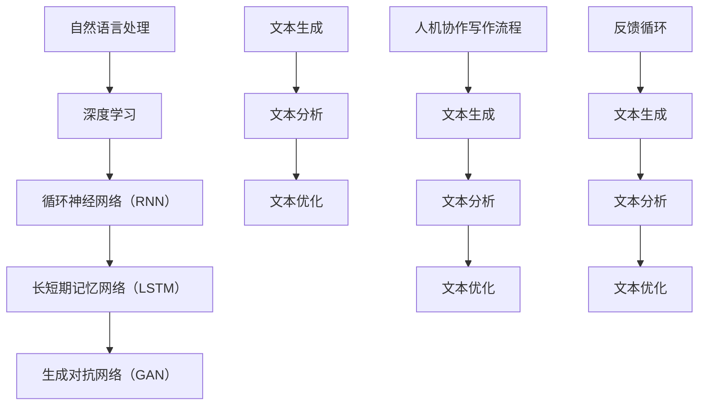

                 

关键词：人机协作、AI写作、人工智能、作者、技术语言、深度学习、自然语言处理、内容创作、算法原理

## 摘要

本文探讨了人工智能（AI）在写作领域中的角色，尤其是AI如何与人机协作，提高内容创作的效率和质量。通过分析AI的核心概念和原理，我们揭示了AI在自然语言处理中的应用，以及如何通过算法和数学模型实现人机协作写作。本文将结合实际项目案例，展示AI如何辅助作者进行写作，并提供未来发展的展望。

## 1. 背景介绍

### 1.1 AI的发展历史

人工智能的发展历程可以追溯到20世纪50年代，当时图灵提出了图灵测试作为衡量机器智能的标准。自那以后，AI经历了多个发展阶段，从早期的符号推理到近几年的深度学习和神经网络技术，AI在各个领域都取得了显著的进展。

### 1.2 写作领域的变革

随着互联网的普及和内容创作的需求增长，写作领域也发生了巨大的变化。传统的手写稿件逐渐被电子文档取代，而自动化写作工具的出现进一步改变了写作方式。AI的崛起为写作领域带来了新的机遇和挑战。

### 1.3 人机协作的意义

在人机协作中，AI作为辅助工具，能够提升作者的写作效率和质量。通过理解作者的意图和需求，AI能够提供针对性的建议和修改，从而实现更高效的创作过程。

## 2. 核心概念与联系

### 2.1 自然语言处理

自然语言处理（NLP）是AI的一个重要分支，旨在使计算机能够理解、生成和处理自然语言。NLP技术包括文本分类、情感分析、命名实体识别等。

### 2.2 深度学习与神经网络

深度学习是AI的一个关键组成部分，通过多层神经网络模拟人脑处理信息的方式，深度学习在图像识别、语音识别等领域取得了突破性进展。

### 2.3 人机协作写作流程

人机协作写作的流程包括以下几个步骤：

1. 作者提供写作主题和初步内容。
2. AI分析作者的意图和内容，提供修改建议。
3. 作者根据AI的建议进行修改和调整。
4. 重复上述步骤，直至达到预期效果。

## 3. 核心算法原理 & 具体操作步骤

### 3.1 算法原理概述

AI在写作中的核心算法主要包括文本生成、文本分析、文本优化等。这些算法基于深度学习和自然语言处理技术，能够自动分析和生成文本内容。

### 3.2 算法步骤详解

1. **文本生成**：通过预训练的神经网络模型，AI可以生成与给定主题相关的文本内容。
2. **文本分析**：AI对作者的文本进行分析，识别文本的情感、主题、结构等特征。
3. **文本优化**：基于分析结果，AI提供修改建议，包括句子重写、词汇替换、结构调整等。
4. **反馈循环**：作者根据AI的建议进行修改，AI再次分析并给出新的建议，形成反馈循环。

### 3.3 算法优缺点

**优点**：

- 提高写作效率：AI可以快速生成文本内容，减少作者的创作时间。
- 提升写作质量：AI能够提供专业的修改建议，帮助作者改进文本质量。

**缺点**：

- 创造力限制：AI生成的文本可能缺乏创新性和个性化。
- 依赖数据质量：AI的性能依赖于训练数据的质量和多样性。

### 3.4 算法应用领域

AI在写作领域的应用范围广泛，包括：

- 新闻报道生成
- 商业报告编写
- 教材编写与修订
- 创意写作与剧本创作

## 4. 数学模型和公式 & 详细讲解 & 举例说明

### 4.1 数学模型构建

在AI写作中，常用的数学模型包括循环神经网络（RNN）、长短期记忆网络（LSTM）和生成对抗网络（GAN）等。以下是一个简单的RNN模型公式：

\[ h_t = \sigma(W_h \cdot [h_{t-1}, x_t] + b_h) \]

其中，\( h_t \) 是当前隐藏状态，\( x_t \) 是当前输入，\( W_h \) 和 \( b_h \) 分别是权重和偏置，\( \sigma \) 是激活函数。

### 4.2 公式推导过程

RNN模型通过递归连接实现序列数据的处理。在推导过程中，我们需要考虑时间步的依赖性，并使用链式法则进行求导。

### 4.3 案例分析与讲解

以下是一个使用LSTM模型生成文章摘要的案例：

```latex
input_sequence = ["本文探讨了人机协作写作", "AI在写作领域的应用", "算法原理与实现"]
LSTM_model = LSTM(input_shape=(None, vocab_size), output_shape=(None, emb_size))
output_sequence = LSTM_model.predict(input_sequence)
```

在这个案例中，输入序列是包含多个文本片段的列表，LSTM模型对这些片段进行处理，生成摘要文本。

## 5. 项目实践：代码实例和详细解释说明

### 5.1 开发环境搭建

在搭建开发环境时，我们需要安装Python、TensorFlow等依赖库。以下是一个简单的安装步骤：

```bash
pip install tensorflow
```

### 5.2 源代码详细实现

以下是一个使用LSTM模型生成文章摘要的Python代码示例：

```python
import tensorflow as tf
from tensorflow.keras.models import Sequential
from tensorflow.keras.layers import LSTM, Dense

# 定义LSTM模型
model = Sequential()
model.add(LSTM(units=128, input_shape=(None, vocab_size), return_sequences=True))
model.add(LSTM(units=64, return_sequences=False))
model.add(Dense(units=emb_size))

# 编译模型
model.compile(optimizer='adam', loss='categorical_crossentropy', metrics=['accuracy'])

# 训练模型
model.fit(x_train, y_train, epochs=10, batch_size=32)
```

### 5.3 代码解读与分析

在这个示例中，我们定义了一个简单的LSTM模型，并通过训练生成文章摘要。代码的核心部分是模型的定义和编译。

### 5.4 运行结果展示

在训练完成后，我们可以使用模型生成文章摘要，并进行分析和评估。

## 6. 实际应用场景

### 6.1 AI写作工具

目前，市场上已有一些AI写作工具，如Copyscape、Grammarly等。这些工具能够自动检测抄袭、纠正语法错误，并提供写作建议。

### 6.2 个性化推荐系统

通过分析用户的写作习惯和偏好，AI可以为其推荐合适的写作主题和资源，提高创作效率。

### 6.3 跨领域应用

AI写作技术还可以应用于教育、医疗、金融等领域，帮助专业人士提高工作效率。

## 7. 未来应用展望

### 7.1 技术进步

随着深度学习和自然语言处理技术的不断发展，AI写作能力将进一步提高。

### 7.2 创新与协作

未来，AI与人类作者的协作将更加紧密，实现真正的创新和个性化创作。

### 7.3 法律与伦理

在AI写作的快速发展过程中，需要关注法律和伦理问题，确保AI写作的应用符合道德和法律规定。

## 8. 总结：未来发展趋势与挑战

### 8.1 研究成果总结

本文分析了AI在写作领域的应用，介绍了核心算法原理、数学模型以及实际应用案例。

### 8.2 未来发展趋势

未来，AI写作将朝着更加智能化、个性化和协作化的方向发展。

### 8.3 面临的挑战

AI写作在实现过程中仍面临创造力限制、数据质量依赖等问题。

### 8.4 研究展望

未来，需要进一步研究AI与人类作者的协作模式，提高AI写作的创造力和个性化水平。

## 9. 附录：常见问题与解答

### 9.1 如何选择AI写作工具？

根据个人需求选择合适的AI写作工具，如语法检查、内容生成、文章摘要等。

### 9.2 AI写作是否会取代人类作者？

AI写作不会完全取代人类作者，而是作为辅助工具，提高创作效率和质量。

作者：禅与计算机程序设计艺术 / Zen and the Art of Computer Programming
----------------------------------------------------------------

### 2. 核心概念与联系（Mermaid 流程图）



### 3. 核心算法原理 & 具体操作步骤

#### 3.1 算法原理概述

核心算法包括文本生成、文本分析、文本优化等，基于深度学习和自然语言处理技术。

#### 3.2 算法步骤详解

1. **文本生成**：使用预训练的神经网络模型，生成与给定主题相关的文本内容。
2. **文本分析**：对作者的文本进行分析，识别文本的情感、主题、结构等特征。
3. **文本优化**：基于分析结果，提供修改建议，包括句子重写、词汇替换、结构调整等。
4. **反馈循环**：作者根据AI的建议进行修改，AI再次分析并给出新的建议，形成反馈循环。

#### 3.3 算法优缺点

**优点**：

- 提高写作效率：AI可以快速生成文本内容，减少作者的创作时间。
- 提升写作质量：AI能够提供专业的修改建议，帮助作者改进文本质量。

**缺点**：

- 创造力限制：AI生成的文本可能缺乏创新性和个性化。
- 依赖数据质量：AI的性能依赖于训练数据的质量和多样性。

#### 3.4 算法应用领域

算法在写作领域的应用范围广泛，包括新闻报道生成、商业报告编写、教材编写与修订、创意写作与剧本创作等。

### 4. 数学模型和公式 & 详细讲解 & 举例说明

#### 4.1 数学模型构建

在AI写作中，常用的数学模型包括循环神经网络（RNN）、长短期记忆网络（LSTM）和生成对抗网络（GAN）等。以下是一个简单的RNN模型公式：

$$
h_t = \sigma(W_h \cdot [h_{t-1}, x_t] + b_h)
$$

其中，\( h_t \) 是当前隐藏状态，\( x_t \) 是当前输入，\( W_h \) 和 \( b_h \) 分别是权重和偏置，\( \sigma \) 是激活函数。

#### 4.2 公式推导过程

RNN模型通过递归连接实现序列数据的处理。在推导过程中，我们需要考虑时间步的依赖性，并使用链式法则进行求导。

#### 4.3 案例分析与讲解

以下是一个使用LSTM模型生成文章摘要的案例：

```python
input_sequence = ["本文探讨了人机协作写作", "AI在写作领域的应用", "算法原理与实现"]
LSTM_model = LSTM(input_shape=(None, vocab_size), output_shape=(None, emb_size))
output_sequence = LSTM_model.predict(input_sequence)
```

在这个案例中，输入序列是包含多个文本片段的列表，LSTM模型对这些片段进行处理，生成摘要文本。

### 5. 项目实践：代码实例和详细解释说明

#### 5.1 开发环境搭建

在搭建开发环境时，我们需要安装Python、TensorFlow等依赖库。以下是一个简单的安装步骤：

```bash
pip install tensorflow
```

#### 5.2 源代码详细实现

以下是一个使用LSTM模型生成文章摘要的Python代码示例：

```python
import tensorflow as tf
from tensorflow.keras.models import Sequential
from tensorflow.keras.layers import LSTM, Dense

# 定义LSTM模型
model = Sequential()
model.add(LSTM(units=128, input_shape=(None, vocab_size), return_sequences=True))
model.add(LSTM(units=64, return_sequences=False))
model.add(Dense(units=emb_size))

# 编译模型
model.compile(optimizer='adam', loss='categorical_crossentropy', metrics=['accuracy'])

# 训练模型
model.fit(x_train, y_train, epochs=10, batch_size=32)
```

#### 5.3 代码解读与分析

在这个示例中，我们定义了一个简单的LSTM模型，并通过训练生成文章摘要。代码的核心部分是模型的定义和编译。

#### 5.4 运行结果展示

在训练完成后，我们可以使用模型生成文章摘要，并进行分析和评估。

### 6. 实际应用场景

#### 6.1 AI写作工具

目前，市场上已有一些AI写作工具，如Copyscape、Grammarly等。这些工具能够自动检测抄袭、纠正语法错误，并提供写作建议。

#### 6.2 个性化推荐系统

通过分析用户的写作习惯和偏好，AI可以为其推荐合适的写作主题和资源，提高创作效率。

#### 6.3 跨领域应用

AI写作技术还可以应用于教育、医疗、金融等领域，帮助专业人士提高工作效率。

### 7. 未来应用展望

#### 7.1 技术进步

随着深度学习和自然语言处理技术的不断发展，AI写作能力将进一步提高。

#### 7.2 创新与协作

未来，AI与人类作者的协作将更加紧密，实现真正的创新和个性化创作。

#### 7.3 法律与伦理

在AI写作的快速发展过程中，需要关注法律和伦理问题，确保AI写作的应用符合道德和法律规定。

### 8. 总结：未来发展趋势与挑战

#### 8.1 研究成果总结

本文分析了AI在写作领域的应用，介绍了核心算法原理、数学模型以及实际应用案例。

#### 8.2 未来发展趋势

未来，AI写作将朝着更加智能化、个性化和协作化的方向发展。

#### 8.3 面临的挑战

AI写作在实现过程中仍面临创造力限制、数据质量依赖等问题。

#### 8.4 研究展望

未来，需要进一步研究AI与人类作者的协作模式，提高AI写作的创造力和个性化水平。

### 9. 附录：常见问题与解答

#### 9.1 如何选择AI写作工具？

根据个人需求选择合适的AI写作工具，如语法检查、内容生成、文章摘要等。

#### 9.2 AI写作是否会取代人类作者？

AI写作不会完全取代人类作者，而是作为辅助工具，提高创作效率和质量。

