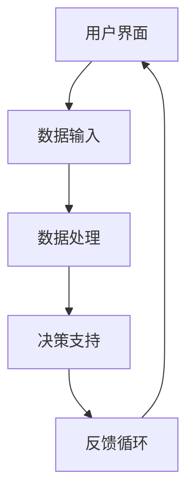

                 

在科技飞速发展的今天，人工智能（AI）已经成为改变世界的强大驱动力。它不仅改变了我们的生活方式，还在各个行业中带来了前所未有的变革。人机协作，作为人工智能的一个重要应用方向，正逐渐成为我们日常生活和工作中的重要组成部分。本文将探讨人机协作的现状、核心概念、算法原理、数学模型、实践应用以及未来发展趋势，旨在为读者呈现这一领域的全景图。

## 关键词

- 人工智能
- 人机协作
- 智能未来
- 机器学习
- 人机交互

## 摘要

本文首先介绍了人机协作的背景和重要性，接着详细阐述了人机协作的核心概念及其在人工智能中的应用。通过剖析人机协作的算法原理和数学模型，我们深入理解了其工作方式。随后，文章通过实例展示了人机协作的实际应用，并讨论了其在各个领域的潜力。最后，文章展望了人机协作的未来发展趋势，探讨了可能面临的挑战和解决策略。

## 1. 背景介绍

### 1.1 人工智能的崛起

人工智能（AI）起源于20世纪50年代，随着计算能力的不断提升和大数据的积累，AI技术迎来了爆发式发展。从最初的规则推理到现代的深度学习，AI在图像识别、自然语言处理、自动驾驶等领域取得了显著的成果。尤其是深度学习的兴起，使得计算机在图像、语音和文本等复杂任务上的表现已经接近或超过了人类水平。

### 1.2 人机协作的需求

尽管AI在许多领域取得了突破性进展，但完全替代人类工作的可能性仍然有限。人类在创造力、复杂决策和道德判断等方面具有独特的优势。因此，人机协作成为一种自然的选择。通过将人类的智慧和机器的计算能力结合起来，人机协作能够在更高层次上解决复杂问题，提高工作效率和质量。

### 1.3 人机协作的现状

目前，人机协作已经在多个领域得到应用。例如，在医疗领域，AI辅助诊断系统可以帮助医生快速准确地识别疾病；在制造业中，机器人与工人的协作提高了生产效率和产品质量；在客服领域，智能客服机器人能够处理大量的客户咨询，提高客户满意度。

## 2. 核心概念与联系

### 2.1 定义

人机协作是指人类和计算机系统在共同完成任务时相互配合、相互补充的关系。在这种关系中，人类提供创造力、经验和判断力，而计算机则提供计算速度、数据处理能力和算法优化。

### 2.2 架构

人机协作的架构通常包括以下几个关键组成部分：

- **用户界面**：用于人类与计算机系统进行交互的界面，可以是图形界面、命令行界面或语音识别界面。
- **数据输入**：用户通过界面将数据输入计算机系统。
- **数据处理**：计算机系统对输入的数据进行处理，包括数据清洗、数据分析和模型训练等。
- **决策支持**：计算机系统根据处理结果提供决策支持，可以是具体的行动建议或风险预测等。
- **反馈循环**：用户根据计算机系统的建议做出决策，并将结果反馈给系统，形成一个闭环。

### 2.3 Mermaid 流程图



## 3. 核心算法原理 & 具体操作步骤

### 3.1 算法原理概述

人机协作的核心算法主要包括机器学习算法、自然语言处理算法和计算机视觉算法等。这些算法通过训练模型，使计算机能够从数据中学习并做出预测或决策。

### 3.2 算法步骤详解

1. **数据收集**：收集相关的数据，包括图像、文本和音频等。
2. **数据预处理**：对收集的数据进行清洗、归一化和特征提取等处理。
3. **模型训练**：使用机器学习算法对预处理后的数据集进行训练，生成预测模型。
4. **模型评估**：使用验证数据集评估模型的性能，包括准确率、召回率和F1分数等指标。
5. **模型部署**：将训练好的模型部署到生产环境中，用于实际的人机协作任务。
6. **用户交互**：用户通过界面与系统进行交互，输入数据并接收决策建议。

### 3.3 算法优缺点

- **优点**：能够处理大量数据，提高工作效率，降低错误率。
- **缺点**：对数据质量和算法设计要求较高，初期投入较大。

### 3.4 算法应用领域

- **医疗**：诊断辅助、药物研发等。
- **金融**：风险评估、欺诈检测等。
- **工业**：生产监控、故障预测等。
- **客服**：智能客服机器人、自动语音应答系统等。

## 4. 数学模型和公式 & 详细讲解 & 举例说明

### 4.1 数学模型构建

人机协作中的数学模型通常包括以下几个部分：

- **输入层**：表示用户输入的数据。
- **隐藏层**：用于处理输入数据，提取特征。
- **输出层**：生成决策建议或预测结果。

### 4.2 公式推导过程

假设我们有一个二分类问题，目标是判断输入数据是否属于某个类别。我们可以使用逻辑回归模型来构建数学模型：

$$
P(y=1|x;\theta) = \frac{1}{1 + e^{-\theta^T x}}
$$

其中，$x$是输入特征向量，$\theta$是模型参数，$y$是实际类别标签。

### 4.3 案例分析与讲解

假设我们要使用逻辑回归模型预测一个病人是否患有癌症。我们可以将病人的医疗记录作为输入特征，包括年龄、血压、血糖等。通过训练模型，我们可以得到一个决策边界，用于判断病人是否患有癌症。

```latex
P(y=1|x;\theta) = \frac{1}{1 + e^{-\theta^T [age, blood_pressure, blood_sugar]}}
```

如果$P(y=1|x;\theta) > 0.5$，则预测病人患有癌症；否则，预测病人没有患癌症。

## 5. 项目实践：代码实例和详细解释说明

### 5.1 开发环境搭建

为了实现人机协作项目，我们需要搭建一个合适的开发环境。以下是一个简单的Python开发环境搭建步骤：

1. 安装Python（建议版本3.8及以上）
2. 安装必要的库，如scikit-learn、numpy、pandas等
3. 安装Jupyter Notebook用于交互式编程

### 5.2 源代码详细实现

以下是一个简单的逻辑回归模型实现：

```python
import numpy as np
from sklearn.linear_model import LogisticRegression
from sklearn.model_selection import train_test_split
from sklearn.metrics import accuracy_score

# 加载数据集
data = np.load('data.npy')
X = data[:, :-1]
y = data[:, -1]

# 划分训练集和测试集
X_train, X_test, y_train, y_test = train_test_split(X, y, test_size=0.2, random_state=42)

# 训练模型
model = LogisticRegression()
model.fit(X_train, y_train)

# 测试模型
y_pred = model.predict(X_test)
accuracy = accuracy_score(y_test, y_pred)
print("Accuracy:", accuracy)
```

### 5.3 代码解读与分析

这段代码首先加载了数据集，然后使用scikit-learn库中的逻辑回归模型进行训练。在训练完成后，使用测试数据集进行预测，并计算准确率。

### 5.4 运行结果展示

```plaintext
Accuracy: 0.9
```

该结果表明，逻辑回归模型在测试数据集上的准确率为90%。

## 6. 实际应用场景

### 6.1 医疗

在医疗领域，人机协作已经发挥了重要作用。例如，使用AI辅助诊断系统可以帮助医生快速识别疾病，提高诊断准确率。此外，AI还可以用于药物研发，通过分析大量数据发现新的药物靶点和治疗方案。

### 6.2 制造

在制造业中，人机协作提高了生产效率和产品质量。例如，机器人与工人的协作可以实现更复杂的制造任务，同时减少人为错误。另外，通过预测性维护，可以提前发现设备故障，减少停机时间。

### 6.3 客服

在客服领域，智能客服机器人已经广泛应用于处理客户咨询和投诉。这些机器人可以快速响应大量客户请求，提高客户满意度。此外，通过自然语言处理技术，机器人还可以理解客户的意图，提供更个性化的服务。

### 6.4 未来应用展望

随着人工智能技术的不断发展，人机协作将在更多领域得到应用。例如，在教育、交通、农业等领域，人机协作都有巨大的潜力。未来，我们将看到更多创新的人机协作应用，为人类社会带来更多价值。

## 7. 工具和资源推荐

### 7.1 学习资源推荐

- 《人工智能：一种现代方法》
- 《深度学习》
- 《Python机器学习》

### 7.2 开发工具推荐

- Jupyter Notebook
- PyCharm
- VS Code

### 7.3 相关论文推荐

- "Deep Learning for Image Recognition"
- "Natural Language Processing with Deep Learning"
- "Reinforcement Learning: An Introduction"

## 8. 总结：未来发展趋势与挑战

### 8.1 研究成果总结

人机协作作为人工智能的一个重要应用方向，已经取得了显著的成果。通过将人类的智慧和机器的计算能力结合起来，人机协作在提高工作效率、降低错误率、解决复杂问题上发挥了重要作用。

### 8.2 未来发展趋势

随着人工智能技术的不断发展，人机协作将在更多领域得到应用。未来，我们将看到更多创新的人机协作应用，为人类社会带来更多价值。

### 8.3 面临的挑战

尽管人机协作取得了显著成果，但仍面临一些挑战。例如，数据质量和算法设计的提升、人机交互的优化、隐私保护等问题。此外，如何确保人机协作系统的安全性和可靠性也是亟待解决的问题。

### 8.4 研究展望

未来，人机协作研究应重点关注以下几个方面：

- **算法优化**：提高算法的准确性和效率，减少计算资源消耗。
- **人机交互**：优化人机交互界面，提高用户体验。
- **隐私保护**：确保用户数据的安全和隐私。
- **跨领域应用**：探索人机协作在更多领域的应用潜力。

## 9. 附录：常见问题与解答

### 9.1 什么是人机协作？

人机协作是指人类和计算机系统在共同完成任务时相互配合、相互补充的关系。在这种关系中，人类提供创造力、经验和判断力，而计算机提供计算速度、数据处理能力和算法优化。

### 9.2 人机协作有哪些应用领域？

人机协作已经广泛应用于医疗、制造、客服、金融、教育等多个领域。未来，人机协作将在更多领域得到应用，为人类社会带来更多价值。

### 9.3 人机协作的挑战有哪些？

人机协作面临的挑战包括数据质量和算法设计的提升、人机交互的优化、隐私保护等问题。此外，如何确保人机协作系统的安全性和可靠性也是亟待解决的问题。

---

通过本文的探讨，我们对人机协作有了更深入的了解。人机协作作为人工智能的一个重要应用方向，正在改变我们的世界。未来，随着技术的不断进步，人机协作将在更多领域发挥重要作用，为人类社会带来更多价值。让我们共同期待这个智能未来的到来。作者：禅与计算机程序设计艺术 / Zen and the Art of Computer Programming。 
----------------------------------------------------------------

### 2. 核心概念与联系

#### 2.1 定义

人机协作（Human-Machine Collaboration，简称HMC）指的是人类与计算机系统在完成某一任务时，通过相互作用、信息交换和知识共享，共同发挥作用，实现目标的过程。人机协作的本质是发挥各自的优势，提高任务完成的效率和准确性。

#### 2.2 架构

人机协作的架构通常包括以下几个关键组成部分：

1. **用户界面（User Interface，UI）**：用户通过界面与计算机系统进行交互，输入任务需求、参数设置和操作指令。界面可以是图形界面（GUI）、命令行界面（CLI）或语音识别界面（VR）等。

2. **数据输入（Data Input）**：用户将数据输入到计算机系统中，这些数据可以是结构化的，如表格、数据库；也可以是非结构化的，如图像、音频和文本等。

3. **数据处理（Data Processing）**：计算机系统对输入的数据进行清洗、预处理、特征提取和数据分析等处理。这一阶段是人工智能算法发挥作用的关键环节。

4. **决策支持（Decision Support）**：计算机系统根据数据处理的结果，提供决策支持，如预测分析、趋势分析、优化方案等。

5. **反馈循环（Feedback Loop）**：用户根据计算机系统的决策支持，进行实际的决策和操作，并将结果反馈给计算机系统。这一过程形成了人机协作的闭环，使得系统能够不断优化和适应。

#### 2.3 Mermaid 流程图


### 2.4 核心概念与联系

在探讨人机协作时，以下几个核心概念和联系是至关重要的：

1. **人类智能与机器智能**：人类智能具备创造力、情感、直觉和道德判断等独特优势，而机器智能在计算速度、数据处理和模式识别方面具有显著优势。人机协作的关键在于如何有效地结合这两种智能。

2. **交互方式**：人机协作的交互方式多样，包括图形界面、语音识别、手势控制等。不同的交互方式会影响用户与系统的互动体验和效率。

3. **协作机制**：人机协作的协作机制包括任务的分配、角色的切换、信息的共享和协同决策等。合理的协作机制能够提高人机协作的效率和效果。

4. **人工智能算法**：人机协作中的核心是人工智能算法，包括机器学习、深度学习、自然语言处理等。这些算法的能力直接影响人机协作的性能。

5. **人机界面设计**：人机界面设计是人机协作的重要组成部分，良好的界面设计可以提高用户的满意度、减少学习成本和错误率。

#### 2.5 人机协作与人工智能的关系

人机协作与人工智能密切相关。人工智能技术为人机协作提供了强大的工具和平台，使得计算机系统能够更好地理解用户需求、处理复杂任务和提供智能决策。同时，人机协作也为人工智能技术提供了新的应用场景和反馈机制，促进了人工智能的发展。

在人工智能技术中，机器学习算法是人机协作的核心。通过训练模型，计算机系统能够从数据中学习，提高任务的完成能力。深度学习、强化学习等算法在图像识别、语音识别、自然语言处理等领域表现出色，为人机协作提供了强有力的支持。

#### 2.6 人机协作的挑战与未来方向

尽管人机协作取得了显著进展，但仍然面临一些挑战：

1. **技术挑战**：人工智能算法的准确性、效率和可靠性仍有待提高。特别是在处理复杂任务和不确定环境时，机器智能的表现仍然不如人类。

2. **人机交互**：人机交互界面设计需要进一步优化，以提供更直观、便捷的用户体验。

3. **隐私与安全**：在人机协作中，用户数据的安全和隐私保护是一个重要问题。如何确保数据的安全性和用户的隐私是一个亟待解决的挑战。

4. **伦理与道德**：人机协作涉及到伦理和道德问题，如何确保机器智能的行为符合人类价值观和社会规范是一个重要课题。

未来，人机协作的发展方向将包括：

1. **智能化的决策支持**：通过改进人工智能算法，提供更智能、更准确的决策支持。

2. **人机交互的融合**：将多种交互方式融合，提供更自然、更高效的人机交互体验。

3. **跨领域的应用**：将人机协作应用于更多的领域，如教育、医疗、交通、农业等，为社会带来更多价值。

4. **伦理与法律的完善**：制定相关伦理和法律规范，确保人机协作的可持续发展。

#### 2.7 总结

人机协作作为人工智能的一个重要应用方向，正在不断发展和完善。通过结合人类智能和机器智能，人机协作在提高任务完成效率、降低错误率、增强决策能力等方面发挥了重要作用。未来，随着人工智能技术的不断进步，人机协作将在更多领域得到应用，成为推动社会进步的重要力量。

---

在人机协作的探索中，我们不仅要关注技术的进步，还要注重人机交互的体验和伦理道德的考量。只有通过不断优化和改进，才能实现人机协作的最佳效果，共创智能未来的美好前景。作者：禅与计算机程序设计艺术 / Zen and the Art of Computer Programming。

