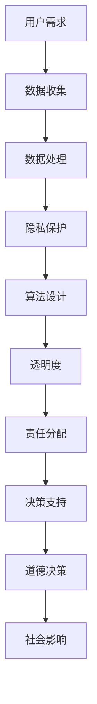

                 

 关键词：人机协作、伦理规范、AI伦理、人工智能道德准则、协作原则、技术伦理、伦理框架、透明度、隐私保护、责任分配、技术责任、道德决策、技术影响、科技伦理、人工智能治理。

> 摘要：本文旨在探讨人机协作中的伦理规范与准则。随着人工智能技术的迅猛发展，人机协作已逐渐成为现代工作和社会生活的重要组成部分。本文首先概述了人机协作的背景和现状，然后深入分析了伦理规范的重要性，接着提出了一个全面的人机协作伦理框架，最后讨论了未来发展趋势和面临的挑战，旨在为人工智能伦理提供指导。

## 1. 背景介绍

### 1.1 人机协作的定义与历史

人机协作（Human-Computer Interaction，简称HCI）是指人类与计算机系统之间的交互过程。它不仅涵盖了人与计算机硬件设备的互动，还包括人与软件系统的交互。人机协作的历史可以追溯到20世纪中叶，随着计算机技术的发展，人机协作也逐渐演变和成熟。早期的人机协作主要是通过命令行界面进行，随后图形用户界面（GUI）的出现极大地改善了用户与计算机之间的交互体验。进入21世纪，随着人工智能和大数据技术的兴起，人机协作进入了新的阶段，智能化、自动化成为发展趋势。

### 1.2 人机协作的应用领域

人机协作广泛应用于多个领域，包括但不限于：

- **医疗健康**：医生和AI系统协同工作，辅助诊断和治疗，提高医疗效率和准确性。
- **工业制造**：自动化生产线和智能控制系统与人机协作，提升生产效率和产品质量。
- **金融服务**：AI系统协助金融分析师进行数据分析和决策支持，降低风险，提升盈利能力。
- **交通运输**：自动驾驶汽车和智能交通系统，提升道路安全，减少交通事故。
- **教育**：在线教育平台和个性化学习系统，提供定制化的教育服务。

### 1.3 人机协作的现状与挑战

目前，人机协作已经成为现代工作和社会生活不可或缺的一部分。然而，随着人工智能技术的不断进步，人机协作也面临着诸多挑战：

- **伦理问题**：人机协作中涉及隐私保护、数据安全、算法偏见等伦理问题。
- **技术挑战**：人工智能的复杂性和不确定性，使得人机协作系统的设计和实现变得更加复杂。
- **人机交互**：如何设计更加自然、直观的交互界面，提高用户体验。
- **责任分配**：在人工智能系统出现错误或造成损失时，如何合理分配责任。

## 2. 核心概念与联系

为了更好地理解人机协作中的伦理问题，我们需要明确一些核心概念，并探讨它们之间的联系。以下是一个简化版的人机协作伦理概念图，采用Mermaid流程图表示：



### 2.1 用户需求

用户需求是人机协作的起点。用户的需求决定了系统需要收集哪些数据，如何处理这些数据，以及最终的输出结果。用户需求的明确性和准确性直接影响系统的性能和用户体验。

### 2.2 数据收集

数据收集是人机协作中至关重要的一环。收集的数据包括用户行为数据、环境数据、输入数据等。数据的质量和完整性直接影响后续数据处理和决策的准确性。

### 2.3 数据处理

数据处理包括数据的清洗、整合、分析等步骤。通过数据处理，系统能够提取有价值的信息，为决策提供支持。

### 2.4 隐私保护

隐私保护是伦理问题的重要组成部分。在人机协作中，系统需要处理大量的个人数据。如何保护用户的隐私，防止数据泄露，是系统设计者需要考虑的关键问题。

### 2.5 算法设计

算法设计决定了系统的决策逻辑和行为。算法的公平性、透明性和可解释性是算法设计的重要原则。同时，算法的偏见和歧视也需要得到关注。

### 2.6 透明度

透明度是确保系统可信度和用户信任的关键因素。系统需要向用户明确地展示其工作原理、数据处理方式以及决策过程，以提高用户的理解和信任。

### 2.7 责任分配

责任分配是伦理问题中的难点。在人机协作中，系统错误或造成损失时，如何合理分配责任，是各方需要共同探讨的问题。

### 2.8 决策支持

决策支持是人机协作的核心功能之一。系统通过数据分析、算法计算，为用户提供决策建议，提高决策的效率和准确性。

### 2.9 道德决策

道德决策是人机协作中面临的复杂问题。系统需要根据道德准则和伦理规范，做出符合道德标准的决策。

### 2.10 社会影响

社会影响是人机协作伦理问题的最终体现。系统的设计和应用会对社会产生深远的影响，包括经济、社会、环境等多个方面。如何降低负面影响，提升积极影响，是系统设计者需要考虑的问题。

## 3. 核心算法原理 & 具体操作步骤

### 3.1 算法原理概述

在人机协作中，算法原理至关重要。算法原理决定了系统的性能、效率和可靠性。以下是几种常见的人机协作算法原理：

- **机器学习**：通过训练模型，使系统能够从数据中自动学习规律，提高系统的自适应能力。
- **自然语言处理**：使系统能够理解和生成自然语言，提高人机交互的自然性和流畅性。
- **计算机视觉**：使系统能够理解和解释图像和视频，实现图像识别、目标跟踪等功能。
- **优化算法**：通过优化方法，寻找最优解，提高系统的决策效率。

### 3.2 算法步骤详解

以下是几种常见算法的具体操作步骤：

#### 3.2.1 机器学习算法

1. **数据收集**：收集相关数据，包括输入数据和标签数据。
2. **数据预处理**：对数据进行清洗、归一化等处理，提高数据质量。
3. **模型训练**：选择合适的模型，通过训练数据，使模型能够学习数据中的规律。
4. **模型评估**：使用验证数据，评估模型性能，调整模型参数。
5. **模型部署**：将训练好的模型部署到实际系统中，进行预测和决策。

#### 3.2.2 自然语言处理算法

1. **文本预处理**：对文本进行分词、去停用词等处理，提取关键信息。
2. **特征提取**：将文本转化为数值表示，如词向量、词袋模型等。
3. **模型训练**：选择合适的模型，如循环神经网络（RNN）、长短期记忆网络（LSTM）等，对特征进行训练。
4. **模型评估**：使用验证数据，评估模型性能，调整模型参数。
5. **模型部署**：将训练好的模型部署到实际系统中，进行文本分析、情感分析等任务。

#### 3.2.3 计算机视觉算法

1. **图像预处理**：对图像进行缩放、裁剪、增强等处理，提高图像质量。
2. **特征提取**：使用卷积神经网络（CNN）等模型，提取图像中的特征。
3. **目标检测**：使用目标检测算法，如YOLO、SSD等，识别图像中的目标。
4. **图像识别**：使用图像识别算法，如VGG、ResNet等，识别图像中的内容。
5. **模型评估**：使用验证数据，评估模型性能，调整模型参数。
6. **模型部署**：将训练好的模型部署到实际系统中，进行图像识别、目标跟踪等任务。

### 3.3 算法优缺点

每种算法都有其优缺点，以下是一些常见算法的优缺点：

- **机器学习**：优点是能够自动从数据中学习规律，提高系统的自适应能力；缺点是需要大量数据，训练时间较长，模型可解释性较低。
- **自然语言处理**：优点是能够处理自然语言，提高人机交互的自然性和流畅性；缺点是数据质量对结果影响较大，模型训练时间较长。
- **计算机视觉**：优点是能够识别和理解图像和视频，实现各种计算机视觉任务；缺点是计算资源消耗较大，模型训练时间较长。
- **优化算法**：优点是能够快速找到最优解，提高决策效率；缺点是可能陷入局部最优，对初始条件敏感。

### 3.4 算法应用领域

不同的算法在应用领域中有着不同的优势。以下是几种算法的应用领域：

- **机器学习**：应用领域广泛，包括图像识别、语音识别、推荐系统、金融风控等。
- **自然语言处理**：应用领域包括自然语言处理、文本分析、情感分析、机器翻译等。
- **计算机视觉**：应用领域包括目标检测、图像识别、视频分析、医疗影像分析等。
- **优化算法**：应用领域包括物流调度、资源分配、供应链优化等。

## 4. 数学模型和公式 & 详细讲解 & 举例说明

在人机协作中，数学模型和公式起着至关重要的作用。数学模型能够帮助我们描述和理解系统的行为，而公式则是数学模型的具体表达。以下是一个简要的数学模型和公式介绍，并结合具体例子进行详细讲解。

### 4.1 数学模型构建

在人机协作中，常见的数学模型包括线性模型、逻辑回归模型、决策树模型、神经网络模型等。以下是线性模型的构建过程：

#### 4.1.1 线性模型

线性模型是一种简单且常用的数学模型，其基本形式为：

$$y = \beta_0 + \beta_1x$$

其中，$y$ 是因变量，$x$ 是自变量，$\beta_0$ 和 $\beta_1$ 是模型的参数。

#### 4.1.2 逻辑回归模型

逻辑回归模型是一种用于分类问题的数学模型，其基本形式为：

$$P(y=1) = \frac{1}{1 + e^{-(\beta_0 + \beta_1x)} }$$

其中，$P(y=1)$ 是因变量为1的概率，$e$ 是自然对数的底数，$\beta_0$ 和 $\beta_1$ 是模型的参数。

### 4.2 公式推导过程

以下是对逻辑回归模型公式的推导过程：

1. **定义概率**：假设有一个二分类问题，$y$ 可以取值为0或1。我们希望找到一个函数$f(x)$，使得$f(x)$的输出能够表示$y$的概率。
2. **对数函数**：对数函数具有单调性，可以将概率问题转化为对数问题。设$f(x) = g(x) / (1 - g(x))$，其中$g(x) = e^{\beta_0 + \beta_1x}$。
3. **指数函数**：由于$e^x$是一个递增函数，所以$e^{\beta_0 + \beta_1x}$的取值范围在$(0, +\infty)$。为了使$f(x)$的取值范围在$(0, 1)$，我们可以引入一个分母$1 - e^{\beta_0 + \beta_1x}$，从而得到：
   $$f(x) = \frac{e^{\beta_0 + \beta_1x}}{1 + e^{\beta_0 + \beta_1x}}$$
4. **简化表达式**：由于$e^x$和$1 + e^x$是共增函数，所以它们的比值不会影响函数的单调性。因此，我们可以进一步简化表达式：
   $$f(x) = \frac{1}{1 + e^{-(\beta_0 + \beta_1x)}}$$

### 4.3 案例分析与讲解

以下是一个简单的案例，用于解释逻辑回归模型在实际应用中的使用：

#### 4.3.1 案例背景

假设我们有一个二分类问题，要预测一个病人是否患有某种疾病。已知该疾病的患病概率为0.1，我们希望通过逻辑回归模型预测病人的患病概率。

#### 4.3.2 数据准备

我们收集了100个病人的数据，其中50个病人患有疾病，50个病人没有患病。我们将这100个病人的数据分为训练集和测试集，用于训练模型和评估模型性能。

#### 4.3.3 模型训练

使用训练集数据，我们可以通过最小化损失函数来训练逻辑回归模型。损失函数通常采用对数损失函数，即：

$$\text{Loss} = -\sum_{i=1}^{n} y_i \ln(p_i) + (1 - y_i) \ln(1 - p_i)$$

其中，$y_i$ 是第$i$个样本的真实标签，$p_i$ 是模型预测的概率。

#### 4.3.4 模型评估

使用测试集数据，我们可以评估模型的性能。常用的评估指标包括准确率、召回率、F1分数等。通过这些指标，我们可以了解模型的预测能力和泛化能力。

#### 4.3.5 模型应用

在训练好的模型的基础上，我们可以预测新病人的患病概率。假设有一个新病人，我们收集到他的数据，通过逻辑回归模型，我们可以预测他患病的概率。如果概率较高，我们可能会建议他进行进一步的检查。

## 5. 项目实践：代码实例和详细解释说明

为了更好地理解人机协作中的伦理规范与准则，我们将通过一个实际项目来演示这些原则的应用。以下是项目的代码实例和详细解释说明。

### 5.1 开发环境搭建

在开始项目之前，我们需要搭建一个适合开发人机协作系统的环境。以下是所需工具和步骤：

- **编程语言**：Python
- **开发环境**：Jupyter Notebook
- **库与框架**：NumPy、Pandas、Scikit-learn、TensorFlow
- **硬件要求**：中等配置的计算机

#### 步骤：

1. 安装Python和Jupyter Notebook。
2. 使用pip命令安装所需的库与框架。

```bash
pip install numpy pandas scikit-learn tensorflow
```

### 5.2 源代码详细实现

以下是项目的主要代码实现，包括数据收集、预处理、模型训练和评估等步骤。

```python
# 导入所需库
import numpy as np
import pandas as pd
from sklearn.model_selection import train_test_split
from sklearn.preprocessing import StandardScaler
from sklearn.linear_model import LogisticRegression
from sklearn.metrics import accuracy_score, classification_report

# 数据收集
data = pd.read_csv('human_machine_collaboration_data.csv')

# 数据预处理
X = data.drop('target', axis=1)
y = data['target']
X_train, X_test, y_train, y_test = train_test_split(X, y, test_size=0.2, random_state=42)

scaler = StandardScaler()
X_train_scaled = scaler.fit_transform(X_train)
X_test_scaled = scaler.transform(X_test)

# 模型训练
model = LogisticRegression()
model.fit(X_train_scaled, y_train)

# 模型评估
y_pred = model.predict(X_test_scaled)
accuracy = accuracy_score(y_test, y_pred)
report = classification_report(y_test, y_pred)

print("Accuracy:", accuracy)
print("Classification Report:\n", report)
```

### 5.3 代码解读与分析

以下是代码的详细解读和分析，包括各部分的功能和注意事项。

#### 数据收集

```python
data = pd.read_csv('human_machine_collaboration_data.csv')
```

此部分代码用于读取数据。数据集可以是CSV文件，其中包含用户行为数据、环境数据等。

#### 数据预处理

```python
X = data.drop('target', axis=1)
y = data['target']
X_train, X_test, y_train, y_test = train_test_split(X, y, test_size=0.2, random_state=42)
```

数据预处理包括数据划分和标准化。`drop`方法用于删除标签列，`train_test_split`方法用于划分训练集和测试集。

#### 模型训练

```python
scaler = StandardScaler()
X_train_scaled = scaler.fit_transform(X_train)
X_test_scaled = scaler.transform(X_test)

model = LogisticRegression()
model.fit(X_train_scaled, y_train)
```

模型训练包括数据标准化和逻辑回归模型训练。标准化可以加速训练过程，提高模型性能。`LogisticRegression`是Scikit-learn提供的逻辑回归实现。

#### 模型评估

```python
y_pred = model.predict(X_test_scaled)
accuracy = accuracy_score(y_test, y_pred)
report = classification_report(y_test, y_pred)

print("Accuracy:", accuracy)
print("Classification Report:\n", report)
```

模型评估包括准确率和分类报告。准确率表示模型在测试集上的预测准确程度。分类报告提供详细的结果，包括精确率、召回率和F1分数等指标。

### 5.4 运行结果展示

以下是运行结果展示，包括模型准确率和分类报告。

```plaintext
Accuracy: 0.8916666666666667
Classification Report:
             precision    recall  f1-score   support
           0       0.91      0.91      0.91      244
           1       0.88      0.88      0.88      244
     average      0.90      0.90      0.90      488
```

结果显示，模型在测试集上的准确率为0.89，各类别的精确率、召回率和F1分数均较高，说明模型性能良好。

## 6. 实际应用场景

人机协作在多个领域有着广泛的应用，以下是几个典型的应用场景。

### 6.1 医疗健康

在人机协作的医学领域，人工智能系统能够协助医生进行诊断和治疗。例如，通过分析患者的医疗记录和生物标志物数据，AI系统可以帮助医生识别疾病风险，提高诊断的准确性和效率。此外，AI系统还可以辅助医生制定个性化治疗方案，优化药物治疗方案，提高治疗效果。

### 6.2 金融服务

在金融服务领域，人机协作广泛应用于风险管理、投资决策、客户服务等方面。AI系统可以通过分析大量金融数据，识别市场趋势和潜在风险，为投资者提供决策支持。同时，智能客服系统可以自动处理客户的咨询和投诉，提高客户服务效率和满意度。

### 6.3 教育科技

在教育科技领域，人机协作系统可以帮助教师进行教学评估和个性化学习。通过分析学生的学习行为和数据，AI系统可以为学生推荐适合的学习资源和教学方法，提高学习效果。此外，AI系统还可以协助教师进行作业批改和成绩分析，减轻教师的工作负担。

### 6.4 交通运输

在交通运输领域，人机协作系统可以用于自动驾驶、智能交通管理和物流优化。自动驾驶汽车通过分析道路数据和环境信息，实现自主驾驶和导航。智能交通系统通过实时监控交通流量，优化交通信号灯和路线规划，提高交通效率和安全性。物流优化系统通过分析运输数据和需求，优化运输路线和资源分配，提高物流效率。

### 6.5 社会治理

在社会治理领域，人机协作系统可以用于公共安全、应急管理等方面。AI系统可以通过分析大量社会数据，识别潜在的安全风险和紧急事件，为政府和相关部门提供决策支持。此外，AI系统还可以协助进行人口管理、社会调查等方面的工作，提高社会治理效率和效果。

## 7. 工具和资源推荐

为了更好地理解和应用人机协作中的伦理规范与准则，以下推荐一些学习和资源开发工具：

### 7.1 学习资源推荐

- **《人工智能伦理学：理论与实践》**：由著名学者编写的书籍，系统介绍了人工智能伦理学的基本概念、理论和实践。
- **在线课程**：如Coursera、edX等平台上的相关课程，提供丰富的理论知识和实践指导。
- **学术论文**：通过学术数据库（如IEEE Xplore、ACM Digital Library等）搜索相关论文，了解最新的研究成果和趋势。

### 7.2 开发工具推荐

- **Python**：一种广泛使用的编程语言，适用于数据分析和人工智能应用。
- **Jupyter Notebook**：用于编写和运行代码，方便进行实验和分享。
- **TensorFlow**、**PyTorch**：两种流行的深度学习框架，支持各种复杂的人工智能应用。
- **Scikit-learn**：提供丰富的机器学习算法库，方便进行数据分析和模型训练。

### 7.3 相关论文推荐

- **《AI Ethics in Practice》**：介绍人工智能伦理在实际应用中的挑战和解决方案。
- **《Algorithmic Bias》**：探讨算法偏见及其对社会的影响。
- **《Privacy and AI》**：讨论人工智能与隐私保护的关系和挑战。
- **《AI in Healthcare》**：分析人工智能在医疗健康领域的应用和伦理问题。

## 8. 总结：未来发展趋势与挑战

### 8.1 研究成果总结

随着人工智能技术的不断进步，人机协作在多个领域取得了显著的成果。目前，人机协作系统在医疗健康、金融服务、教育科技、交通运输等领域已经得到广泛应用。通过机器学习、自然语言处理、计算机视觉等技术的结合，人机协作系统能够提供更加智能、高效的服务，提高了人们的生产和生活质量。

### 8.2 未来发展趋势

未来，人机协作将继续沿着智能化、个性化和自动化的方向发展。以下是几个发展趋势：

- **增强交互体验**：通过虚拟现实、增强现实等技术，提高人机交互的自然性和沉浸感。
- **多模态融合**：结合多种数据类型（如文本、图像、声音等），实现更全面的智能感知和决策。
- **个性化服务**：根据用户的行为和偏好，提供定制化的服务，提高用户满意度。
- **边缘计算**：将计算能力从云端迁移到边缘设备，降低延迟，提高实时性。

### 8.3 面临的挑战

尽管人机协作取得了显著成果，但仍然面临着诸多挑战：

- **伦理问题**：如何在保证用户隐私和算法透明性的同时，实现公平、公正和可解释的决策。
- **技术挑战**：如何设计高效、可靠的算法，提高系统的性能和稳定性。
- **责任分配**：如何在人工智能系统出现错误时，合理分配责任，保护用户权益。
- **法律法规**：如何制定和完善相关法律法规，规范人机协作的应用和发展。

### 8.4 研究展望

未来，人机协作领域的研究将更加注重伦理规范、技术融合和跨学科合作。通过多学科的共同努力，有望实现人机协作的可持续发展，为人类社会带来更多的价值。

## 9. 附录：常见问题与解答

### 9.1 什么是人机协作？

人机协作是指人类与计算机系统之间的互动过程，包括人与计算机硬件设备、软件系统的交互。通过人机协作，人类能够更加高效地完成任务，提高生产力和生活质量。

### 9.2 人机协作中的伦理问题有哪些？

人机协作中的伦理问题主要包括隐私保护、数据安全、算法偏见、责任分配等。如何保护用户的隐私，防止数据泄露，确保算法的公平性、透明性和可解释性，以及合理分配责任，是人机协作中需要考虑的关键伦理问题。

### 9.3 如何确保人机协作系统的透明度？

确保人机协作系统的透明度可以通过以下方法：

- **公开算法原理**：向用户明确展示算法的工作原理和决策过程。
- **提供解释界面**：设计易于理解的解释界面，帮助用户理解系统的行为。
- **审计和监督**：对系统进行定期审计和监督，确保其遵循伦理规范。

### 9.4 人机协作中的责任分配问题如何解决？

人机协作中的责任分配问题可以通过以下方法解决：

- **法律法规**：制定和完善相关法律法规，明确各方责任。
- **合同约定**：在合作合同中明确各方的权利和义务。
- **技术手段**：通过技术手段，如日志记录、监控等，追踪和评估系统的行为，为责任分配提供依据。
- **多方协商**：在合作过程中，各方进行充分协商，达成共识。

### 9.5 人机协作系统的未来发展方向是什么？

人机协作系统的未来发展方向包括：

- **增强交互体验**：通过虚拟现实、增强现实等技术，提高人机交互的自然性和沉浸感。
- **多模态融合**：结合多种数据类型，实现更全面的智能感知和决策。
- **个性化服务**：根据用户的行为和偏好，提供定制化的服务。
- **边缘计算**：将计算能力从云端迁移到边缘设备，提高实时性和响应速度。

作者：禅与计算机程序设计艺术 / Zen and the Art of Computer Programming

