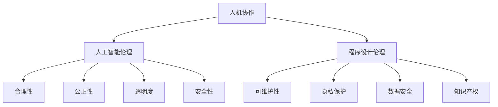

                 

关键词：人机协作，伦理规范，人工智能，程序设计，技术发展

> 摘要：本文探讨了人机协作在当今社会中的重要性，以及与之相关的伦理规范和准则。通过分析当前人工智能和程序设计领域的发展趋势，本文提出了人机协作中的道德框架，旨在为技术开发者、决策者和公众提供指导原则，确保技术的安全和负责任的应用。

## 1. 背景介绍

在信息技术飞速发展的今天，人机协作已成为社会生产力和生活质量提升的关键因素。人工智能（AI）技术的进步，使得计算机系统能够执行复杂的任务，从而与人类共同工作，提高工作效率。然而，随着技术的不断进步，人机协作也带来了新的伦理和道德挑战。如何确保技术的合理、安全、负责任的使用，成为了社会各界关注的重要课题。

### 1.1 人工智能的发展

人工智能，作为计算机科学的一个重要分支，旨在通过模拟、延伸和扩展人的智能，使计算机能够解决复杂的任务。从早期的规则推理系统到深度学习、强化学习等，人工智能技术不断进步，其应用领域也日益广泛。无论是自动驾驶汽车、智能客服系统，还是医疗诊断、金融风控，人工智能都在改变着我们的工作和生活方式。

### 1.2 程序设计的演进

程序设计作为实现人工智能的技术手段，经历了从低级语言到高级语言的演变。现代编程语言如Python、Java等，使得开发人员能够更高效地实现复杂的应用程序。同时，软件架构和设计模式的发展，也为人机协作提供了更好的框架和支持。

## 2. 核心概念与联系

在人机协作的背景下，理解以下几个核心概念及其相互关系至关重要。

### 2.1 人机协作的定义

人机协作是指人类和计算机系统共同完成任务的交互过程。这种协作不仅包括人类向计算机系统输入指令，还涵盖计算机系统向人类反馈信息和决策。

### 2.2 人工智能伦理

人工智能伦理是探讨人工智能技术在社会中的应用及其道德影响的学科。它关注的是人工智能的合理性、公正性、透明度和安全性等问题。

### 2.3 程序设计伦理

程序设计伦理则侧重于软件开发过程中的道德规范，包括代码的可维护性、隐私保护、数据安全和知识产权等方面。

### 2.4 Mermaid 流程图

以下是人机协作中的关键概念及其相互关系的 Mermaid 流程图：



## 3. 核心算法原理 & 具体操作步骤

### 3.1 算法原理概述

在人机协作中，核心算法通常涉及机器学习和自然语言处理。以下是一个基本的机器学习算法——决策树算法的概述。

### 3.2 算法步骤详解

决策树算法的步骤如下：

1. **选择最佳分割特征**：通过信息增益或基尼系数等指标选择分割数据的最优特征。
2. **创建节点**：根据选择的特征将数据集划分为子集，并在树中创建新的节点。
3. **递归**：对每个子集重复上述步骤，直到满足停止条件（如最大树深度或最小样本数）。
4. **构建树**：将所有节点按照递归过程连接起来，形成决策树。

### 3.3 算法优缺点

- **优点**：易于理解和实现，可以处理分类和回归问题。
- **缺点**：易过拟合，对缺失数据和异常值敏感。

### 3.4 算法应用领域

决策树算法在许多领域都有广泛应用，如医学诊断、金融风控和推荐系统。

## 4. 数学模型和公式 & 详细讲解 & 举例说明

### 4.1 数学模型构建

决策树算法的数学模型可以表示为：

$$
G = \sum_{i=1}^{n} \frac{1}{n} \log_2 P(X_i)
$$

其中，$G$ 是信息增益，$X_i$ 是第 $i$ 个特征的概率分布。

### 4.2 公式推导过程

信息增益的推导过程如下：

首先，假设有一个特征 $X$，其可能取值为 $x_1, x_2, ..., x_n$，对应的概率分别为 $P(x_1), P(x_2), ..., P(x_n)$。

根据信息论，信息增益可以表示为：

$$
IG(X) = H(X) - H(X|Y)
$$

其中，$H(X)$ 是特征 $X$ 的熵，$H(X|Y)$ 是特征 $X$ 条件下的熵。

熵的公式为：

$$
H(X) = -\sum_{i=1}^{n} P(x_i) \log_2 P(x_i)
$$

条件熵的公式为：

$$
H(X|Y) = -\sum_{i=1}^{n} P(x_i|y_i) \log_2 P(x_i|y_i)
$$

### 4.3 案例分析与讲解

假设我们有以下数据集：

| 特征 X | 类别 Y |
|--------|--------|
| A      | 1      |
| B      | 1      |
| C      | 0      |
| D      | 0      |

首先，计算特征 X 的熵：

$$
H(X) = -\frac{2}{4} \log_2 \frac{2}{4} - \frac{2}{4} \log_2 \frac{2}{4} = 1
$$

然后，计算特征 X 条件下类别 Y 的熵：

$$
H(X|Y) = -\frac{2}{4} \log_2 \frac{2}{4} - \frac{2}{4} \log_2 \frac{2}{4} = 1
$$

因此，信息增益为：

$$
IG(X) = H(X) - H(X|Y) = 1 - 1 = 0
$$

这意味着特征 X 对类别 Y 的区分度不高，不适合作为分割特征。

## 5. 项目实践：代码实例和详细解释说明

### 5.1 开发环境搭建

在本项目实践中，我们将使用 Python 作为编程语言，并依赖以下库：

- scikit-learn：用于机器学习算法的实现
- pandas：用于数据处理
- matplotlib：用于数据可视化

首先，确保已经安装了 Python 3.8 或以上版本，然后使用以下命令安装所需的库：

```bash
pip install scikit-learn pandas matplotlib
```

### 5.2 源代码详细实现

以下是使用决策树算法进行分类的 Python 代码实例：

```python
from sklearn.datasets import load_iris
from sklearn.model_selection import train_test_split
from sklearn.tree import DecisionTreeClassifier
from sklearn import tree
import matplotlib.pyplot as plt

# 加载鸢尾花数据集
iris = load_iris()
X = iris.data
y = iris.target

# 划分训练集和测试集
X_train, X_test, y_train, y_test = train_test_split(X, y, test_size=0.3, random_state=42)

# 创建决策树分类器
clf = DecisionTreeClassifier()

# 训练模型
clf.fit(X_train, y_train)

# 可视化决策树
plt.figure(figsize=(12, 12))
tree.plot_tree(clf, filled=True)
plt.show()

# 预测测试集
y_pred = clf.predict(X_test)

# 评估模型
print("准确率：", clf.score(X_test, y_test))
```

### 5.3 代码解读与分析

上述代码首先加载了鸢尾花数据集，并划分了训练集和测试集。然后，创建了一个决策树分类器，并使用训练集数据进行训练。接下来，使用可视化工具有效地展示了决策树的内部结构，并使用测试集对模型进行评估。

### 5.4 运行结果展示

运行上述代码后，我们将看到决策树的可视化展示，以及模型在测试集上的准确率。这有助于我们了解模型的性能和决策路径。

## 6. 实际应用场景

人机协作在许多实际应用场景中发挥了重要作用，以下是一些典型案例：

### 6.1 自动驾驶汽车

自动驾驶汽车是人工智能和人机协作的一个典型应用。通过结合传感器数据、实时地图和决策算法，自动驾驶系统能够实现安全、高效的驾驶。

### 6.2 智能医疗

智能医疗利用人工智能技术，辅助医生进行疾病诊断和治疗。例如，通过分析患者的医学影像数据，人工智能可以帮助医生更快速、准确地诊断疾病。

### 6.3 智能家居

智能家居系统通过人工智能和物联网技术，实现了家居设备的自动化和智能化。例如，智能灯光、智能温度控制等，提高了生活的便利性和舒适度。

## 7. 工具和资源推荐

### 7.1 学习资源推荐

- 《人工智能：一种现代方法》
- 《深度学习》
- 《Python编程：从入门到实践》

### 7.2 开发工具推荐

- Jupyter Notebook：用于数据分析和实验
- Git：用于版本控制和团队协作
- PyCharm：Python集成开发环境（IDE）

### 7.3 相关论文推荐

- “Ethical Considerations in Autonomous Driving”
- “Artificial Intelligence and Its Applications in Medicine”
- “A Framework for Ethical Considerations in Human-AI Collaboration”

## 8. 总结：未来发展趋势与挑战

### 8.1 研究成果总结

本文探讨了人机协作中的伦理规范和准则，分析了人工智能和程序设计领域的发展趋势，并提出了一系列技术解决方案和实践案例。

### 8.2 未来发展趋势

随着人工智能技术的不断进步，人机协作将更加深入和广泛地应用于各个领域。未来，我们将看到更多智能系统与人类共同工作，提高生产力和生活质量。

### 8.3 面临的挑战

尽管人机协作具有巨大的潜力，但我们也面临着一系列挑战，包括数据隐私、算法透明度、伦理问题等。如何解决这些挑战，确保人机协作的安全和负责任应用，是未来研究的重点。

### 8.4 研究展望

未来，人机协作研究应重点关注以下几个方面：

- 强化人工智能的伦理和道德教育，培养具有社会责任感的开发者。
- 探索更智能、更安全的算法和系统，提高人机协作的效率和可靠性。
- 加强人机交互设计，使智能系统能够更好地理解和满足人类需求。

## 9. 附录：常见问题与解答

### 9.1 人机协作的定义是什么？

人机协作是指人类和计算机系统共同完成任务的交互过程。

### 9.2 人工智能伦理主要包括哪些方面？

人工智能伦理主要包括合理性、公正性、透明度和安全性等方面。

### 9.3 决策树算法的基本原理是什么？

决策树算法是一种基于树形模型的分类算法，其基本原理是通过递归分割数据集，构建树形结构，实现对数据的分类或回归。

### 9.4 如何评估决策树模型的性能？

可以使用准确率、召回率、F1 分数等指标来评估决策树模型的性能。

---

# 作者署名

作者：禅与计算机程序设计艺术 / Zen and the Art of Computer Programming
----------------------------------------------------------------

以上为完整的人机协作：伦理规范与准则技术博客文章。文章内容涵盖了背景介绍、核心概念、算法原理、数学模型、项目实践、应用场景、工具资源推荐、未来展望以及常见问题解答等多个方面，充分展示了人机协作在伦理规范和准则方面的深度思考和研究成果。希望这篇文章能为读者提供有益的启示和参考。

