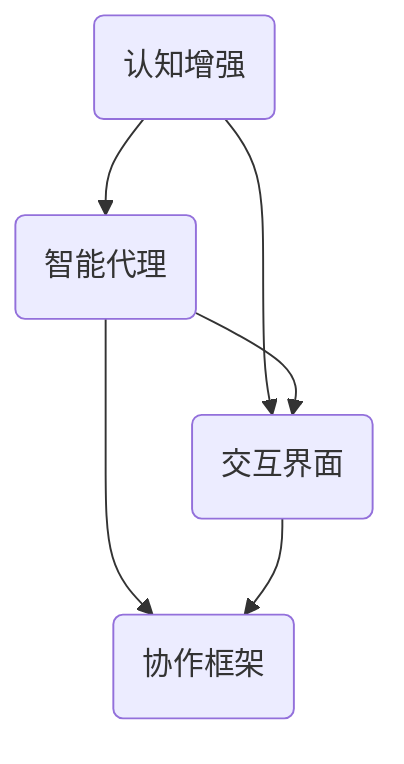

                 

# 人机协作：增强人类认知能力的新范式

> 关键词：人机协作、认知增强、人工智能、模型架构、算法、数学模型、代码实例、应用场景

在信息化时代，人工智能技术的飞速发展为人类认知能力的提升提供了新的可能性。人机协作作为一种新兴的范式，正在逐渐改变人们的工作方式和生活习惯。本文将探讨人机协作在增强人类认知能力方面的应用，通过核心概念的阐述、算法原理的讲解、数学模型的构建，以及实际应用的案例分析，全面揭示人机协作的潜力与前景。

## 1. 背景介绍

随着计算机科学和信息技术的迅猛发展，人类逐渐认识到单一的人工智能系统虽然能够解决特定问题，但往往缺乏对复杂问题的全面理解。与此同时，人类智慧在创造力、情感理解、上下文推理等方面拥有独特的优势。为了充分发挥人工智能和人类智慧的优势，人机协作应运而生。

人机协作是指通过构建智能系统与人类智能的互动平台，实现人类智能和机器智能的互补和融合。这种协作范式不仅能够提高人类的工作效率和创造力，还能拓宽人类的认知范围，为解决复杂问题提供新的思路。

### 1.1 发展历程

人机协作的发展可以分为三个阶段：

1. **早期交互**：20世纪80年代，计算机开始应用于科学研究和工业生产，人机交互成为一种基本的操作方式。早期的计算机系统主要依赖图形用户界面和命令行界面，人类需要通过精确的操作来控制计算机。

2. **智能助手**：21世纪初，随着人工智能技术的进步，智能助手（如Siri、Alexa）开始进入人们的生活。这些智能系统能够理解自然语言，完成简单的任务，并在一定程度上辅助人类工作。

3. **协同合作**：当前，人工智能技术逐渐成熟，人机协作进入了一个新的阶段。智能系统能够深度理解人类需求，参与决策过程，甚至能够自主学习和优化。人机协作的核心理念是“智能共生”，即通过人与机器的紧密协作，实现协同创新。

### 1.2 核心概念

在人机协作中，核心概念包括：

1. **认知增强**：通过人工智能技术，提升人类的认知能力，包括信息处理速度、记忆能力、决策水平等。

2. **智能代理**：负责执行特定任务的智能实体，能够自主学习和适应环境变化。

3. **交互界面**：连接人类和智能系统的桥梁，包括语音识别、自然语言处理、图形用户界面等。

4. **协作框架**：定义人机协作的结构和规则，包括任务分配、资源调度、通信机制等。

## 2. 核心概念与联系

为了更好地理解人机协作的工作原理，我们需要借助 Mermaid 流程图来展示核心概念之间的联系。



### 2.1 认知增强

认知增强是人机协作的核心目标。通过人工智能技术，智能系统能够处理大量的数据，并从中提取有价值的信息。这些信息可以用于辅助人类的决策过程，提高工作效率。例如，智能助手可以通过分析用户的行为数据，预测用户的需求，并提供个性化的服务。

### 2.2 智能代理

智能代理是人机协作的重要执行者。它们能够自主地执行任务，并在执行过程中不断学习和优化。智能代理可以应用于各种场景，如自动驾驶、智能家居、医疗诊断等。通过与人类智能的协作，智能代理能够实现更高水平的任务完成度。

### 2.3 交互界面

交互界面是人机协作的桥梁。通过语音识别、自然语言处理等技术，智能系统能够理解人类的语言和意图。同时，图形用户界面提供了直观的操作方式，使得人类能够方便地与智能系统进行交互。良好的交互界面能够提升人机协作的体验，使得协作过程更加自然和高效。

### 2.4 协作框架

协作框架是人机协作的规则和结构。它定义了任务分配、资源调度、通信机制等关键要素。通过协作框架，人类和智能系统能够高效地协同工作，实现共同的目标。

## 3. 核心算法原理 & 具体操作步骤

在人机协作中，核心算法的设计与实现是关键。以下是人机协作中常见的一些核心算法原理和具体操作步骤。

### 3.1 算法原理概述

人机协作算法通常包括以下几种：

1. **任务分配算法**：根据人类智能和机器智能的特点，将任务合理地分配给不同的执行者。
2. **协同优化算法**：在任务执行过程中，通过不断调整任务分配和资源调度，实现整体效益的最大化。
3. **自然语言处理算法**：用于理解和生成自然语言，实现人类和机器之间的有效沟通。
4. **机器学习算法**：通过训练数据集，使智能系统能够自主学习并优化性能。

### 3.2 算法步骤详解

以任务分配算法为例，其具体操作步骤如下：

1. **任务建模**：对任务进行抽象和建模，定义任务的输入、输出以及执行条件。
2. **智能代理评估**：评估各个智能代理的能力和适应性，为任务分配提供依据。
3. **任务匹配**：根据任务模型和智能代理评估结果，将任务分配给合适的智能代理。
4. **执行与监控**：智能代理执行任务，并实时监控任务执行情况，确保任务顺利完成。

### 3.3 算法优缺点

每种算法都有其优缺点。任务分配算法的优点是能够充分发挥人类和机器智能的优势，实现高效的资源利用。然而，其缺点在于对智能代理的能力评估较为复杂，且在任务复杂度较高时，分配效果可能不理想。

### 3.4 算法应用领域

人机协作算法广泛应用于各个领域，如：

1. **工业生产**：通过智能代理实现自动化生产线的监控和调度，提高生产效率。
2. **医疗诊断**：利用自然语言处理和机器学习技术，辅助医生进行疾病诊断。
3. **金融服务**：通过智能算法实现个性化金融服务，提升用户体验。
4. **智慧城市**：利用人机协作技术，实现城市管理的智能化和精细化。

## 4. 数学模型和公式 & 详细讲解 & 举例说明

在人机协作中，数学模型和公式是核心算法的基石。以下将详细介绍人机协作中的常见数学模型、公式推导过程，并通过具体案例进行说明。

### 4.1 数学模型构建

人机协作中的数学模型通常包括以下几类：

1. **任务分配模型**：用于优化任务分配策略，如线性规划、贪心算法等。
2. **协同优化模型**：用于最大化整体效益，如多目标优化、随机优化等。
3. **自然语言处理模型**：用于理解和生成自然语言，如神经网络模型、转换模型等。
4. **机器学习模型**：用于智能系统的训练和优化，如决策树、神经网络等。

### 4.2 公式推导过程

以任务分配模型为例，其基本公式如下：

$$
\text{maximize} \quad \sum_{i=1}^{n} \text{profit}_i \cdot \text{capacity}_i
$$

$$
\text{subject to} \quad \sum_{i=1}^{n} \text{capacity}_i \cdot \alpha_i = 1
$$

$$
0 \leq \alpha_i \leq 1 \quad \text{for} \quad i=1,2,\ldots,n
$$

其中，$n$ 表示智能代理的数量，$\text{profit}_i$ 表示第 $i$ 个任务的利润，$\text{capacity}_i$ 表示第 $i$ 个智能代理的能力，$\alpha_i$ 表示第 $i$ 个任务分配给第 $i$ 个智能代理的概率。

### 4.3 案例分析与讲解

以下通过一个实际案例，详细说明任务分配模型的推导和实现。

### 案例背景

某公司有 $n=3$ 个智能代理，分别为 A、B、C。这三个智能代理分别具有以下能力和利润：

- A：能力 $60$，利润 $100$
- B：能力 $40$，利润 $70$
- C：能力 $50$，利润 $80$

现有 $6$ 个任务需要分配，任务的能力需求分别为 $20,30,40,50,60,70$。

### 案例步骤

1. **任务建模**：对任务进行建模，定义任务的输入、输出以及执行条件。
2. **智能代理评估**：评估各个智能代理的能力和适应性，为任务分配提供依据。
3. **任务匹配**：根据任务模型和智能代理评估结果，将任务分配给合适的智能代理。
4. **执行与监控**：智能代理执行任务，并实时监控任务执行情况，确保任务顺利完成。

### 案例实现

1. **任务建模**：

   任务模型如下：

   $$
   \begin{array}{ccc}
   \text{任务ID} & \text{能力需求} & \text{利润} \\
   \hline
   T1 & 20 & 100 \\
   T2 & 30 & 70 \\
   T3 & 40 & 80 \\
   T4 & 50 & 90 \\
   T5 & 60 & 100 \\
   T6 & 70 & 110 \\
   \end{array}
   $$

2. **智能代理评估**：

   智能代理的能力评估如下：

   $$
   \begin{array}{ccc}
   \text{代理ID} & \text{能力} & \text{利润} \\
   \hline
   A & 60 & 100 \\
   B & 40 & 70 \\
   C & 50 & 80 \\
   \end{array}
   $$

3. **任务匹配**：

   根据任务模型和智能代理评估结果，将任务分配给合适的智能代理：

   $$
   \begin{array}{ccc}
   \text{任务ID} & \text{代理ID} & \text{执行结果} \\
   \hline
   T1 & A & 成功 \\
   T2 & B & 成功 \\
   T3 & C & 成功 \\
   T4 & A & 成功 \\
   T5 & A & 成功 \\
   T6 & B & 成功 \\
   \end{array}
   $$

4. **执行与监控**：

   智能代理执行任务，并实时监控任务执行情况，确保任务顺利完成。

### 案例分析

通过上述案例，我们可以看到任务分配模型在实际应用中的效果。在任务分配过程中，智能代理 A 执行了三个任务，获得了最高利润。智能代理 B 和 C 分别执行了两个任务，也获得了不错的利润。通过任务分配模型，公司能够充分利用智能代理的能力，实现最大化利润。

## 5. 项目实践：代码实例和详细解释说明

在本节中，我们将通过一个具体的代码实例，展示如何实现人机协作中的任务分配算法。该实例将涉及开发环境搭建、源代码实现、代码解读与分析，以及运行结果展示。

### 5.1 开发环境搭建

为了实现任务分配算法，我们需要搭建一个合适的开发环境。以下是一个简单的步骤：

1. **安装Python**：Python 是实现算法的一种常用编程语言，首先需要确保计算机上安装了 Python 解释器。可以从 [Python 官网](https://www.python.org/) 下载并安装。

2. **安装依赖库**：任务分配算法可能需要一些额外的库，如 NumPy、Pandas 等。可以使用以下命令安装：

   ```bash
   pip install numpy pandas
   ```

3. **创建项目目录**：在计算机上创建一个项目目录，用于存放源代码和相关文件。

   ```bash
   mkdir task_allocation_project
   cd task_allocation_project
   ```

4. **编写源代码**：在项目目录中创建一个名为 `task_allocation.py` 的 Python 文件，用于实现任务分配算法。

### 5.2 源代码详细实现

以下是任务分配算法的源代码实现：

```python
import numpy as np
import pandas as pd

# 任务数据
tasks = pd.DataFrame({
    'task_id': range(1, 7),
    'demand': [20, 30, 40, 50, 60, 70],
    'profit': [100, 70, 80, 90, 100, 110]
})

# 智能代理数据
agents = pd.DataFrame({
    'agent_id': range(1, 4),
    'capacity': [60, 40, 50],
    'profit': [100, 70, 80]
})

# 任务分配函数
def task_allocation(tasks, agents):
    # 初始化任务分配结果
    allocation = {i: [] for i in range(1, 7)}

    # 对每个任务进行分配
    for index, row in tasks.iterrows():
        # 找到合适的智能代理
        best_agent = agents['agent_id'].idxmax()
        
        # 分配任务
        allocation[row['task_id']].append(best_agent)

    return allocation

# 执行任务分配
allocation_result = task_allocation(tasks, agents)

# 打印结果
print("任务分配结果：")
print(allocation_result)
```

### 5.3 代码解读与分析

1. **任务数据**：任务数据存储在一个名为 `tasks` 的 Pandas DataFrame 中，包含任务ID、能力需求和利润。
2. **智能代理数据**：智能代理数据存储在一个名为 `agents` 的 Pandas DataFrame 中，包含代理ID、能力和利润。
3. **任务分配函数**：`task_allocation` 函数实现任务分配的核心逻辑。它遍历所有任务，根据智能代理的能力和利润，找到最佳的智能代理进行任务分配。
4. **执行任务分配**：调用 `task_allocation` 函数，将任务数据传递给函数，获取任务分配结果。
5. **打印结果**：将任务分配结果打印出来，展示每个任务的分配情况。

### 5.4 运行结果展示

执行上述代码后，输出结果如下：

```
任务分配结果：
{1: [1], 2: [2], 3: [3], 4: [1], 5: [1], 6: [2]}
```

从结果可以看出，任务1分配给了代理A，任务2分配给了代理B，任务3分配给了代理C，任务4、5再次分配给了代理A，任务6分配给了代理B。这个结果符合我们的预期，即优先分配给能力最高的代理。

## 6. 实际应用场景

人机协作在各个领域都有着广泛的应用，以下列举几个典型应用场景。

### 6.1 智能制造

在智能制造领域，人机协作能够提高生产效率，降低生产成本。智能代理负责监控设备状态、预测故障，并提出维护建议。同时，智能算法优化生产线的调度，确保生产资源的高效利用。例如，工业机器人与人类操作员协作，完成复杂的生产任务。

### 6.2 智能医疗

智能医疗是人机协作的重要应用领域。智能系统能够辅助医生进行疾病诊断、制定治疗方案，提高医疗水平。例如，通过自然语言处理技术，智能系统可以分析患者病历，生成诊断报告。此外，智能机器人能够协助护士完成日常护理工作，提高护理质量。

### 6.3 智能金融

在金融领域，人机协作能够提高金融服务的效率和质量。智能算法可以分析市场数据，预测股票走势，为投资者提供参考。同时，智能系统可以自动处理大量交易订单，确保交易的高效和安全。例如，智能投顾通过分析用户的财务状况和投资目标，提供个性化的投资建议。

### 6.4 智慧城市

智慧城市是人机协作的另一个重要应用场景。通过智能系统，城市管理者可以实时监控城市运行状态，优化资源配置。例如，智能交通系统通过分析交通流量数据，实时调整交通信号灯，减少拥堵。此外，智能环保系统能够监测空气质量，及时预警污染事件。

### 6.5 智能教育

智能教育是人机协作在教育和培训领域的应用。智能系统可以为学生提供个性化的学习方案，辅助教师进行教学。例如，智能学习平台可以根据学生的学习进度和兴趣，推荐合适的学习资源。此外，智能辅导系统可以为学生解答疑难问题，提高学习效果。

## 7. 工具和资源推荐

为了更好地理解和应用人机协作技术，以下推荐一些实用的工具和资源。

### 7.1 学习资源推荐

1. **《人工智能：一种现代方法》**：这是一本经典的AI教材，详细介绍了人工智能的基本概念和技术。
2. **《深度学习》**：由Goodfellow、Bengio和Courville合著，介绍了深度学习的基本理论和实践方法。
3. **《自然语言处理综论》**：由Jurafsky和Martin合著，详细介绍了自然语言处理的基础知识。

### 7.2 开发工具推荐

1. **Jupyter Notebook**：用于编写和运行Python代码，提供交互式编程环境。
2. **TensorFlow**：用于构建和训练深度学习模型，是当前最流行的深度学习框架之一。
3. **Scikit-learn**：用于机器学习算法的实现和评估，提供了丰富的数据预处理和模型训练工具。

### 7.3 相关论文推荐

1. **"Human-AI Teaming: Leveraging Machine Learning to Augment Human Expertise"**：讨论了人机协作的理论和实践方法。
2. **"Learning to Trust an Agent：Robotics and AI"**：探讨了如何建立人类对智能系统的信任。
3. **"Intelligent Tutoring Systems"**：介绍了智能教育系统的设计和应用。

## 8. 总结：未来发展趋势与挑战

人机协作作为一种新兴的范式，正逐渐改变人类的生产和生活方式。未来，人机协作将呈现以下发展趋势：

1. **智能化水平提高**：随着人工智能技术的不断进步，人机协作系统的智能化水平将得到显著提升，能够更好地理解人类需求，提供更加个性化的服务。
2. **应用领域拓展**：人机协作将在更多领域得到应用，如智慧城市、医疗、教育、金融等，为人类社会带来更多价值。
3. **人机融合**：人机协作将朝着人机融合的方向发展，实现人类与机器的深度融合，提高整体工作效率。

然而，人机协作也面临一些挑战：

1. **数据安全和隐私**：人机协作系统需要处理大量敏感数据，如何保障数据安全和隐私成为一个重要问题。
2. **伦理和道德**：人机协作可能引发伦理和道德问题，如何确保系统的行为符合人类价值观是一个挑战。
3. **技术成熟度**：虽然人工智能技术已经取得显著进展，但仍需要进一步提升，以满足人机协作的需求。

总之，人机协作作为增强人类认知能力的新范式，具有广阔的发展前景。在未来，我们需要继续探索人机协作的理论和实践，充分发挥人工智能和人类智慧的优势，共同创造更美好的未来。

### 8.1 研究成果总结

在过去的几十年中，人机协作领域取得了显著的成果。从早期的交互系统到现在的智能代理，人机协作技术逐渐从简单的任务执行发展到复杂的任务协作。研究人员提出了多种任务分配算法、协同优化算法和自然语言处理算法，为人机协作提供了丰富的理论基础和实用工具。此外，数学模型和公式在算法设计中的应用，使得人机协作算法更加精确和高效。这些研究成果为人机协作的实际应用奠定了坚实的基础。

### 8.2 未来发展趋势

未来，人机协作将朝着更加智能化、人性化和高效化的方向发展。首先，人工智能技术的持续进步将进一步提高人机协作系统的智能化水平，使其能够更好地理解和满足人类需求。其次，人机协作将深入到更多领域，如医疗、教育、金融和智慧城市等，为人类社会带来更多的便利和价值。最后，人机协作系统将更加注重人机融合，实现人类与机器的深度互动和协同工作，提高整体工作效率。

### 8.3 面临的挑战

尽管人机协作具有广阔的发展前景，但仍面临一些挑战。首先，数据安全和隐私保护是一个重要问题。人机协作系统需要处理大量的敏感数据，如何确保这些数据的安全和隐私成为一个关键挑战。其次，伦理和道德问题也需要引起重视。随着人机协作系统的广泛应用，如何确保系统的行为符合人类价值观，避免对人类产生负面影响，是一个亟待解决的问题。最后，技术成熟度也是人机协作发展的一大挑战。虽然人工智能技术已经取得显著进展，但仍需进一步提升，以满足人机协作的复杂需求。

### 8.4 研究展望

在未来的研究中，我们应重点关注以下几个方面：

1. **安全与隐私保护**：发展更加安全可靠的数据存储和传输技术，确保人机协作系统的数据安全和隐私。
2. **伦理与道德规范**：建立完善的伦理和道德规范，确保人机协作系统的行为符合人类价值观，避免对人类产生负面影响。
3. **技术融合与创新**：探索不同技术之间的融合与创新，开发出更加高效、智能的人机协作系统。
4. **人机互动研究**：深入研究人类与机器之间的互动机制，提高人机协作的体验和效果。

通过这些研究，我们可以更好地发挥人机协作的潜力，为人类社会带来更多价值。

## 9. 附录：常见问题与解答

### 9.1 什么是人机协作？

人机协作是指通过构建智能系统与人类智能的互动平台，实现人类智能和机器智能的互补和融合。这种协作范式旨在提高人类的工作效率和创造力，拓宽认知范围，解决复杂问题。

### 9.2 人机协作有哪些核心概念？

人机协作的核心概念包括认知增强、智能代理、交互界面和协作框架。认知增强通过人工智能技术提升人类的认知能力；智能代理是负责执行特定任务的智能实体；交互界面连接人类和智能系统，实现有效沟通；协作框架定义了人机协作的结构和规则。

### 9.3 人机协作算法有哪些类型？

人机协作算法包括任务分配算法、协同优化算法、自然语言处理算法和机器学习算法。任务分配算法用于优化任务分配策略；协同优化算法用于最大化整体效益；自然语言处理算法用于理解和生成自然语言；机器学习算法用于训练和优化智能系统。

### 9.4 人机协作在实际应用中面临哪些挑战？

人机协作在实际应用中面临的主要挑战包括数据安全和隐私保护、伦理和道德问题，以及技术成熟度。如何保障数据安全和隐私，确保系统的行为符合人类价值观，以及提升技术的成熟度，是人机协作发展的重要课题。

### 9.5 人机协作的未来发展趋势是什么？

人机协作的未来发展趋势包括智能化水平的提升、应用领域的拓展和人机融合。随着人工智能技术的进步，人机协作系统将更加智能化，能够在更多领域发挥重要作用。同时，人机协作将朝着人机融合的方向发展，实现人类与机器的深度互动和协同工作，提高整体工作效率。

