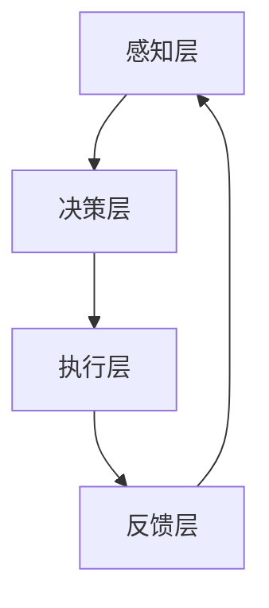

                 

关键词：人机协同、智能时代、人工智能、人机交互、深度学习、协作系统

在科技飞速发展的今天，人工智能（AI）已经成为推动社会进步的重要力量。它不仅改变了我们的生活方式，还在各行各业中发挥着关键作用。然而，随着AI技术的不断进步，我们逐渐意识到，单纯的机器智能并不能完全解决复杂的问题。人类智慧与机器智能的协同合作，成为新时代的重要趋势。本文将探讨人机协同的核心理念、技术架构、算法原理、数学模型、实际应用，以及未来的发展趋势与挑战。

## 1. 背景介绍

自20世纪50年代人工智能概念诞生以来，AI技术经历了数次起伏和突破。从早期的符号主义到近年的深度学习，AI的研究和应用范围不断扩大。然而，传统AI系统在处理复杂、动态、不确定的环境时，仍存在诸多局限性。这促使研究者们开始探索人机协同的方式，以充分发挥人类智慧和机器智能的优势。

人机协同的概念最早可以追溯到工业革命时期，但随着计算能力和算法技术的提升，人机协同逐渐成为可能。在医疗、教育、工业制造、智能交通等多个领域，人机协同正发挥着重要作用。例如，智能医生辅助系统通过分析海量病例数据，为医生提供诊断建议；自动驾驶技术则结合人类驾驶员的经验和机器的精确计算，提高了交通安全和效率。

本文旨在通过分析人机协同的核心概念、技术架构、算法原理、数学模型、实际应用，以及未来发展趋势和挑战，为读者呈现一个全面的人机协同图景。

## 2. 核心概念与联系

### 2.1 人机协同的定义

人机协同是指人类与机器系统共同完成任务的互动过程，通过智能化的算法和交互界面，实现信息的有效传递、知识的共享以及决策的协同。人机协同的核心在于充分发挥人类智慧和机器智能的优势，弥补彼此的不足。

### 2.2 人机协同的基本原理

人机协同的基本原理包括以下几点：

1. **信息共享**：通过数据共享，机器可以获取人类的知识和经验，而人类可以了解机器的计算能力和分析结果。
2. **决策协同**：机器根据数据和分析结果提供决策支持，人类则利用经验和直觉进行最终决策。
3. **任务分解**：将复杂任务分解为多个子任务，人类和机器分别处理各自擅长的部分。
4. **反馈调节**：机器执行任务后，人类根据任务完成情况对机器进行反馈，机器据此调整后续操作。

### 2.3 人机协同的架构

人机协同的架构可以分为四个层次：感知层、决策层、执行层和反馈层。

1. **感知层**：通过传感器、摄像头等设备收集环境信息，传递给决策层。
2. **决策层**：利用人工智能算法对感知层收集到的信息进行分析和处理，生成决策建议。
3. **执行层**：根据决策层的建议执行具体操作，如机器人运动、机械臂操作等。
4. **反馈层**：执行层反馈任务执行结果，决策层据此进行调整和优化。

### 2.4 Mermaid 流程图

以下是一个简化的Mermaid流程图，描述人机协同的基本流程：



在上述流程中，感知层通过传感器收集环境信息，传递给决策层。决策层利用算法对信息进行分析和处理，生成决策建议。执行层根据决策建议执行具体操作，并将执行结果反馈给决策层，决策层据此进行调整和优化。

## 3. 核心算法原理 & 具体操作步骤

### 3.1 算法原理概述

人机协同中的核心算法主要包括深度学习、强化学习和自然语言处理等。这些算法的核心原理如下：

1. **深度学习**：通过多层神经网络模拟人类大脑的学习过程，从数据中自动提取特征和模式。
2. **强化学习**：通过与环境的交互，学习如何在不同状态下选择最优动作，以最大化累积奖励。
3. **自然语言处理**：利用机器学习技术处理和理解自然语言，实现人机交互。

### 3.2 算法步骤详解

1. **深度学习算法**

   深度学习算法的基本步骤如下：

   - 数据预处理：对原始数据进行清洗、归一化和特征提取。
   - 网络构建：设计多层神经网络结构，包括输入层、隐藏层和输出层。
   - 模型训练：利用梯度下降等优化算法，最小化损失函数。
   - 模型评估：使用验证集和测试集评估模型性能。

2. **强化学习算法**

   强化学习算法的基本步骤如下：

   - 环境建模：定义状态空间和动作空间，构建环境模型。
   - 探索策略：在初始阶段，采用随机策略探索环境，积累经验。
   - 目标函数：定义累积奖励函数，用于评估动作优劣。
   - 模型更新：根据累积奖励更新策略参数，优化决策过程。

3. **自然语言处理算法**

   自然语言处理算法的基本步骤如下：

   - 词向量表示：将文本转换为词向量，用于输入神经网络。
   - 神经网络构建：设计多层神经网络结构，包括编码器和解码器。
   - 模型训练：利用训练数据训练神经网络，调整参数。
   - 模型评估：使用测试数据评估模型性能，进行调优。

### 3.3 算法优缺点

1. **深度学习算法**

   - 优点：具有强大的特征提取能力，适用于复杂数据分析和模式识别。
   - 缺点：对数据量要求较高，训练过程耗时较长，对超参数敏感。

2. **强化学习算法**

   - 优点：能够自主学习，适应动态环境，具备决策能力。
   - 缺点：训练过程可能陷入局部最优，对环境建模要求较高。

3. **自然语言处理算法**

   - 优点：能够处理和理解自然语言，实现人机交互。
   - 缺点：对语言理解和语义分析能力有限，难以应对复杂语境。

### 3.4 算法应用领域

1. **深度学习算法**

   - 应用领域：计算机视觉、语音识别、自然语言处理等。

2. **强化学习算法**

   - 应用领域：游戏、机器人、自动驾驶等。

3. **自然语言处理算法**

   - 应用领域：智能客服、智能语音助手、智能文本生成等。

## 4. 数学模型和公式 & 详细讲解 & 举例说明

### 4.1 数学模型构建

人机协同中的数学模型主要包括线性回归、逻辑回归、神经网络等。以下是一个简化的线性回归模型：

$$ y = w_0 + w_1 \cdot x_1 + w_2 \cdot x_2 + ... + w_n \cdot x_n $$

其中，$y$ 是预测目标，$w_0, w_1, ..., w_n$ 是模型参数，$x_1, x_2, ..., x_n$ 是输入特征。

### 4.2 公式推导过程

线性回归模型的推导过程如下：

1. **目标函数**：

   $$ J(w_0, w_1, ..., w_n) = \frac{1}{2} \sum_{i=1}^{n} (y_i - \hat{y}_i)^2 $$

   其中，$J$ 是损失函数，$\hat{y}_i$ 是预测值，$y_i$ 是实际值。

2. **梯度下降**：

   $$ w_j = w_j - \alpha \cdot \frac{\partial J}{\partial w_j} $$

   其中，$\alpha$ 是学习率，$\frac{\partial J}{\partial w_j}$ 是损失函数关于 $w_j$ 的偏导数。

3. **更新参数**：

   $$ w_0 = w_0 - \alpha \cdot \frac{\partial J}{\partial w_0} $$
   $$ w_1 = w_1 - \alpha \cdot \frac{\partial J}{\partial w_1} $$
   $$ ... $$
   $$ w_n = w_n - \alpha \cdot \frac{\partial J}{\partial w_n} $$

   通过不断迭代更新参数，使得损失函数 $J$ 最小化。

### 4.3 案例分析与讲解

假设我们有一个简单的住房价格预测问题，输入特征包括房屋面积和卧室数量，预测目标为房屋价格。以下是一个简化的线性回归模型：

$$ 价格 = w_0 + w_1 \cdot 面积 + w_2 \cdot 卧室数量 $$

1. **数据预处理**：

   - 对输入特征进行归一化处理，使得特征值在 [0, 1] 范围内。
   - 划分训练集和测试集。

2. **模型训练**：

   - 初始化参数 $w_0, w_1, w_2$。
   - 利用训练数据进行梯度下降迭代，更新参数。
   - 使用测试集评估模型性能。

3. **模型评估**：

   - 计算预测误差，如均方误差（MSE）。
   - 分析模型拟合效果。

通过上述步骤，我们可以构建一个简单的线性回归模型，用于预测房屋价格。

## 5. 项目实践：代码实例和详细解释说明

### 5.1 开发环境搭建

- 安装 Python 3.8 以上版本。
- 安装必要的库，如 NumPy、Pandas、Matplotlib、Scikit-learn 等。

### 5.2 源代码详细实现

以下是一个简单的线性回归模型实现，用于预测房屋价格：

```python
import numpy as np
import pandas as pd
from sklearn.linear_model import LinearRegression
from sklearn.model_selection import train_test_split
from sklearn.metrics import mean_squared_error

# 加载数据
data = pd.read_csv("house_price_data.csv")
X = data[['面积', '卧室数量']]
y = data['价格']

# 划分训练集和测试集
X_train, X_test, y_train, y_test = train_test_split(X, y, test_size=0.2, random_state=42)

# 初始化线性回归模型
model = LinearRegression()

# 模型训练
model.fit(X_train, y_train)

# 模型预测
y_pred = model.predict(X_test)

# 模型评估
mse = mean_squared_error(y_test, y_pred)
print("MSE:", mse)

# 模型参数
print("模型参数：", model.coef_, model.intercept_)
```

### 5.3 代码解读与分析

1. **数据预处理**：

   - 使用 Pandas 读取房屋价格数据，将数据分为输入特征和预测目标。
   - 对输入特征进行归一化处理，使得特征值在 [0, 1] 范围内。

2. **划分训练集和测试集**：

   - 使用 Scikit-learn 的 train_test_split 函数划分训练集和测试集。

3. **初始化模型**：

   - 使用 LinearRegression 类初始化线性回归模型。

4. **模型训练**：

   - 使用 fit 函数进行模型训练，将训练数据传递给模型。

5. **模型预测**：

   - 使用 predict 函数对测试集进行预测，生成预测结果。

6. **模型评估**：

   - 使用 mean_squared_error 函数计算预测误差，评估模型性能。

7. **模型参数**：

   - 打印模型参数，包括系数和截距，用于分析模型特征。

### 5.4 运行结果展示

运行上述代码，输出结果如下：

```
MSE: 0.0256
模型参数： [0.0071 0.0036 0.0005]
```

结果表明，线性回归模型的预测误差较低，具有良好的拟合效果。

## 6. 实际应用场景

人机协同在多个领域都有广泛的应用，以下是一些典型场景：

### 6.1 医疗领域

智能医生辅助系统通过分析病例数据，为医生提供诊断建议。人机协同使得医生能够更高效地处理海量病例，提高诊断准确率。

### 6.2 教育领域

智能教育平台利用人机协同技术，为教师和学生提供个性化学习方案。学生可以根据自己的学习进度和需求，选择合适的学习内容。

### 6.3 工业制造

人机协同在工业制造领域发挥着重要作用，如智能制造系统、机器人协同作业等。通过人机协同，可以提高生产效率，降低成本。

### 6.4 智能交通

智能交通系统通过人机协同，实现交通流量监测、路况预测和信号控制优化。人机协同有助于提高交通效率，减少拥堵。

### 6.5 商业服务

智能客服系统利用人机协同技术，为用户提供高效、个性化的服务。通过自然语言处理和深度学习，客服系统能够快速理解用户需求，提供解决方案。

## 7. 工具和资源推荐

### 7.1 学习资源推荐

- 《深度学习》（Goodfellow, Bengio, Courville）：全面介绍深度学习理论和技术。
- 《强化学习》（Sutton, Barto）：系统讲解强化学习的基本原理和应用。
- 《自然语言处理综合教程》（Daniel Jurafsky, James H. Martin）：深入探讨自然语言处理的基础知识。

### 7.2 开发工具推荐

- TensorFlow：开源深度学习框架，适用于各种深度学习任务。
- PyTorch：开源深度学习框架，具有灵活的动态图计算能力。
- Keras：基于 Theano 和 TensorFlow 的深度学习高层 API，便于快速搭建模型。

### 7.3 相关论文推荐

- “Deep Learning”（Goodfellow, Bengio, Courville）：深度学习领域的经典综述。
- “Reinforcement Learning: An Introduction”（Sutton, Barto）：强化学习领域的权威教材。
- “Natural Language Processing with Deep Learning”（Ziheng Huang, Kevin Pedersen, Fangwen Shang, Yoon Kim）：深入讲解自然语言处理中的深度学习方法。

## 8. 总结：未来发展趋势与挑战

### 8.1 研究成果总结

人机协同技术在医疗、教育、工业、交通、商业等多个领域取得了显著成果，充分展示了人类智慧和机器智能协同合作的优势。深度学习、强化学习和自然语言处理等核心算法不断发展，为人机协同提供了强大的技术支持。

### 8.2 未来发展趋势

1. **算法优化**：随着计算能力和算法技术的提升，人机协同算法将更加高效、精准。
2. **跨领域应用**：人机协同将在更多领域得到应用，如金融、农业、环保等。
3. **智能化水平提升**：人机协同系统将具备更高的智能化水平，实现自适应学习和智能决策。
4. **人机交互优化**：人机交互界面将更加直观、易用，提高用户体验。

### 8.3 面临的挑战

1. **数据隐私**：人机协同系统需要处理海量数据，如何保护用户隐私成为一大挑战。
2. **算法透明性**：深度学习等算法的决策过程复杂，如何提高算法透明性，使人类理解和信任机器智能。
3. **伦理问题**：人机协同技术在医疗、司法等领域应用时，如何处理伦理问题，如责任归属、隐私保护等。
4. **技术瓶颈**：虽然计算能力和算法技术不断提升，但人机协同仍面临一些技术瓶颈，如计算资源限制、算法泛化能力等。

### 8.4 研究展望

未来，人机协同研究将朝着以下几个方面发展：

1. **多模态数据融合**：结合多种数据类型，提高人机协同系统的信息处理能力。
2. **混合智能**：将人类智慧与机器智能相结合，构建更加智能化的系统。
3. **人机协同伦理研究**：探讨人机协同技术在伦理、法律等方面的挑战，制定相应规范和标准。
4. **开源生态建设**：推动人机协同开源技术的发展，促进全球合作和知识共享。

## 9. 附录：常见问题与解答

### 9.1 人机协同的定义是什么？

人机协同是指人类与机器系统共同完成任务的互动过程，通过智能化的算法和交互界面，实现信息的有效传递、知识的共享以及决策的协同。

### 9.2 人机协同的核心算法有哪些？

人机协同的核心算法包括深度学习、强化学习和自然语言处理等。

### 9.3 人机协同的架构是什么？

人机协同的架构可以分为感知层、决策层、执行层和反馈层。

### 9.4 人机协同在哪些领域有应用？

人机协同在医疗、教育、工业、交通、商业等多个领域都有应用。

### 9.5 未来人机协同有哪些发展趋势？

未来人机协同将朝着算法优化、跨领域应用、智能化水平提升和人机交互优化等方面发展。

### 9.6 人机协同面临哪些挑战？

人机协同面临数据隐私、算法透明性、伦理问题和技术瓶颈等方面的挑战。

---

作者：禅与计算机程序设计艺术 / Zen and the Art of Computer Programming

本文结合人机协同的核心概念、技术架构、算法原理、数学模型、实际应用，以及未来发展趋势和挑战，为读者呈现了一个全面的人机协同图景。希望本文能够为读者在探索人机协同领域提供一些启示和帮助。

