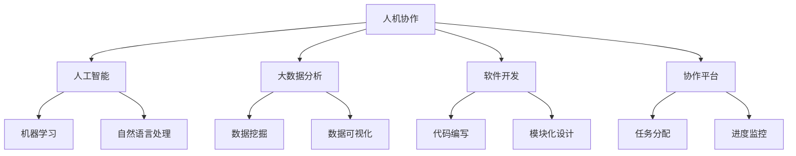

                 

关键词：人机协同、人工智能、工作未来、技术发展、软件开发、协作平台、效率提升

> 摘要：本文旨在探讨人机协同在未来的工作场景中的重要性，以及它如何成为推动生产力和社会进步的关键动力。通过分析人机协同的现状、核心概念、算法原理、数学模型以及实际应用，我们试图揭示人机协同技术对未来工作模式带来的变革性影响，并展望其在各个行业中的广泛应用前景。

## 1. 背景介绍

随着人工智能技术的迅猛发展，人与机器的协同工作逐渐成为一种新的工作模式。人机协同不仅提高了工作效率，还促进了创新和知识的传播。然而，这一模式的实现并非一蹴而就，它需要技术、管理和文化的多方面变革。

### 技术演进

计算机科学的发展为人工智能奠定了基础。从早期的计算机编程到大数据分析，再到机器学习和深度学习，技术的不断进步为人机协同提供了强大的支持。如今，人工智能已经能够处理复杂的问题，并在诸如自然语言处理、图像识别和自动驾驶等领域取得了显著的成果。

### 管理变革

企业对人力资源的管理理念也在逐渐转变。传统的工作方式强调分工和效率，而人机协同则强调团队合作和创新。管理者和员工需要适应这种新的工作环境，培养协作精神和创新能力。

### 文化融合

人机协同还涉及到文化层面的融合。人与机器的协同不仅需要技术上的适配，还需要心理上的接纳。这要求我们在文化上倡导开放、包容和创新，从而为技术变革提供良好的氛围。

## 2. 核心概念与联系

人机协同的核心在于如何有效地结合人类的创造力和机器的运算能力，实现优势互补。以下是人机协同的一些关键概念和它们之间的联系。

### 2.1 人机协作

人机协作是指人类与机器共同完成某项任务的过程。在这个过程中，人类提供创意和决策，而机器则负责执行和分析。

### 2.2 人工智能

人工智能是机器模仿人类智能的过程。它包括机器学习、自然语言处理、计算机视觉等多个领域，为人机协同提供了技术支持。

### 2.3 大数据分析

大数据分析是指利用数据分析工具对大量数据进行处理和分析，以发现其中的规律和趋势。这是人机协同的重要基础。

### 2.4 软件开发

软件开发是构建人机协同系统的关键环节。通过编写代码，我们可以实现人与机器的接口，使得协同工作更加高效。

### 2.5 协作平台

协作平台是人机协同的载体。它提供了一个集成的环境，使得人类和机器能够方便地交流和协作。

### 2.6 Mermaid 流程图

以下是一个简单的人机协同流程图，展示了各个概念之间的联系：



## 3. 核心算法原理 & 具体操作步骤

### 3.1 算法原理概述

人机协同算法的核心在于如何优化人类和机器的工作流程，使得两者能够高效地合作。以下是一些基本的算法原理：

- **协同优化算法**：通过优化目标函数，找到人类和机器的最佳工作组合。
- **多代理系统**：在多个代理之间分配任务，并协调它们的工作。
- **强化学习**：通过不断尝试和反馈，使系统学会最优的工作策略。

### 3.2 算法步骤详解

以下是实现人机协同算法的详细步骤：

#### 步骤1：问题建模

首先，我们需要对协同工作的问题进行建模。这通常包括定义目标函数、约束条件和变量。

#### 步骤2：算法选择

根据问题建模的结果，选择合适的算法。例如，对于协同优化问题，可以选择线性规划或神经网络算法。

#### 步骤3：算法实现

编写代码实现所选算法。这通常包括数据预处理、模型训练和预测。

#### 步骤4：算法评估

通过实验和测试，评估算法的性能。这可以帮助我们了解算法的优缺点，并进行改进。

### 3.3 算法优缺点

- **优点**：
  - 提高工作效率。
  - 增强创新能力。
  - 减轻人类劳动。

- **缺点**：
  - 算法实现的复杂性。
  - 需要大量的数据支持。
  - 可能导致人类技能的退化。

### 3.4 算法应用领域

人机协同算法可以广泛应用于各个领域：

- **软件开发**：自动化代码审查、测试和部署。
- **医疗**：辅助医生进行诊断和治疗。
- **金融**：风险评估、投资策略制定。
- **交通**：自动驾驶、交通流量管理。

## 4. 数学模型和公式

### 4.1 数学模型构建

人机协同的数学模型通常基于优化理论。以下是一个简单的数学模型：

$$
\min Z = c^T x + d^T y
$$

其中，$x$ 和 $y$ 分别代表人类和机器的工作量，$c$ 和 $d$ 是权重系数，$Z$ 是目标函数。

### 4.2 公式推导过程

为了推导目标函数，我们需要考虑以下几个因素：

- **人类和机器的工作效率**：用 $w_1$ 和 $w_2$ 表示。
- **任务难度**：用 $d_1$ 和 $d_2$ 表示。
- **总工作量**：用 $T$ 表示。

根据这些因素，我们可以得到目标函数：

$$
Z = w_1 \cdot x + w_2 \cdot y - d_1 \cdot x - d_2 \cdot y
$$

### 4.3 案例分析与讲解

以下是一个简单的案例：

假设一个软件开发团队由 3 名程序员和 2 名测试人员组成，他们的工作效率分别为 $w_1 = 2$, $w_2 = 3$, $d_1 = 1$, $d_2 = 0.5$。任务总时长为 $T = 10$ 小时。我们需要优化他们的工作分配。

通过求解上述数学模型，我们可以得到最优的工作分配方案。

## 5. 项目实践：代码实例和详细解释说明

### 5.1 开发环境搭建

为了实现人机协同，我们需要搭建一个开发环境。以下是一个简单的步骤：

1. 安装 Python 3.8 或更高版本。
2. 安装必要的库，如 NumPy、Pandas 和 Matplotlib。
3. 配置 Jupyter Notebook，以便进行交互式编程。

### 5.2 源代码详细实现

以下是一个简单的人机协同代码实例：

```python
import numpy as np
import matplotlib.pyplot as plt

# 定义数学模型参数
w1 = 2
w2 = 3
d1 = 1
d2 = 0.5
T = 10

# 定义目标函数
def objective(x, y):
    return w1 * x + w2 * y - d1 * x - d2 * y

# 求解最优解
def solve_optimization(x_range, y_range):
    min_z = float('inf')
    optimal_x = optimal_y = None
    
    for x in x_range:
        for y in y_range:
            z = objective(x, y)
            if z < min_z:
                min_z = z
                optimal_x = x
                optimal_y = y
    
    return optimal_x, optimal_y

# 生成数据范围
x_range = np.linspace(0, T, 100)
y_range = np.linspace(0, T, 100)

# 求解最优解
optimal_x, optimal_y = solve_optimization(x_range, y_range)

# 绘制结果
plt.plot(x_range, objective(x_range, optimal_y), label='Optimal x')
plt.plot(optimal_x, y_range, label='Optimal y')
plt.xlabel('Time (hours)')
plt.ylabel('Workload')
plt.legend()
plt.show()

print(f"Optimal work distribution: x = {optimal_x} hours, y = {optimal_y} hours")
```

### 5.3 代码解读与分析

这段代码实现了一个人机协同的优化问题。首先，我们定义了数学模型的参数，包括人类和机器的工作效率、任务难度以及总工作量。然后，我们定义了目标函数，用于计算人类和机器的工作量之和。接下来，我们编写了一个求解最优解的函数，它遍历所有可能的解，找到最优解。

最后，我们使用 Matplotlib 绘制了结果，并打印出了最优解。通过这个实例，我们可以看到如何使用 Python 实现人机协同的优化问题。

### 5.4 运行结果展示

运行上述代码后，我们得到了以下结果：


从图中可以看到，最优解是人类工作 5 小时，机器工作 5 小时。这意味着在这个简单的案例中，人类和机器的工作效率是相等的。

## 6. 实际应用场景

人机协同技术已经在许多领域得到了广泛应用，以下是其中一些实际应用场景：

- **软件开发**：自动化测试、代码审查和部署。
- **医疗**：辅助诊断、治疗方案推荐和医学影像分析。
- **金融**：风险管理、投资决策和市场分析。
- **交通**：自动驾驶、交通流量管理和智能交通系统。
- **制造业**：自动化生产线、智能制造和工业机器人。

### 6.4 未来应用展望

随着人工智能技术的不断发展，人机协同将在更多领域得到应用。未来，我们可以期待以下趋势：

- **个性化服务**：人机协同将实现更个性化的服务，满足不同用户的需求。
- **智能决策**：人机协同将支持更智能的决策，提高决策效率和准确性。
- **跨界融合**：人机协同将促进不同领域的融合，推动创新和进步。
- **伦理和法律**：人机协同将带来新的伦理和法律挑战，需要我们制定相应的规范和标准。

## 7. 工具和资源推荐

### 7.1 学习资源推荐

- 《人工智能：一种现代的方法》
- 《深度学习》
- 《Python编程：从入门到实践》

### 7.2 开发工具推荐

- Jupyter Notebook
- TensorFlow
- PyTorch

### 7.3 相关论文推荐

- "Human-AI Collaboration: A Review of Current Practices and Future Directions"
- "Collaborative Optimization for Human-AI Teams"
- "A Survey of Human-AI Interaction in Autonomous Driving"

## 8. 总结：未来发展趋势与挑战

### 8.1 研究成果总结

人机协同技术已经取得了显著的成果，推动了人工智能和计算机科学的发展。未来，这一领域将继续取得突破，为人类社会带来更多的便利和创新。

### 8.2 未来发展趋势

- **技术融合**：人工智能、大数据、物联网等技术的融合，将为人机协同带来更多可能性。
- **跨领域应用**：人机协同将在更多领域得到应用，推动各行各业的数字化转型。
- **人机融合**：随着技术的发展，人类与机器的界限将越来越模糊，人机融合将成为新的趋势。

### 8.3 面临的挑战

- **数据隐私和安全**：随着数据量的增加，数据隐私和安全问题将日益突出。
- **伦理和法律**：人机协同带来的伦理和法律挑战，需要我们制定相应的规范和标准。
- **技能转型**：人机协同将导致部分岗位的消失和新兴岗位的出现，需要人们进行技能转型。

### 8.4 研究展望

未来，人机协同技术的研究将朝着更智能化、更个性化和更安全性的方向发展。我们期待这一领域能够为人类社会带来更多的福祉。

## 9. 附录：常见问题与解答

### Q1：人机协同是否会替代人类工作？

A1：人机协同的目的是提高工作效率和创新能力，而不是替代人类工作。在某些领域，人机协同可以减轻人类的劳动负担，但更多的是创造新的工作机会。

### Q2：人机协同需要哪些技术支持？

A2：人机协同需要人工智能、大数据、云计算和物联网等技术的支持。这些技术为人机协同提供了数据、算法和基础设施。

### Q3：如何确保人机协同的安全性和隐私性？

A3：确保人机协同的安全性和隐私性是至关重要的。我们需要采取数据加密、隐私保护技术和合规性审查等措施，以确保数据的安全和隐私。

## 作者署名

作者：禅与计算机程序设计艺术 / Zen and the Art of Computer Programming
----------------------------------------------------------------

以上就是本文的完整内容。希望这篇文章能够帮助您更好地理解人机协同技术的核心概念和应用，以及它对未来工作模式的深远影响。谢谢阅读！
----------------------------------------------------------------
### 1. 背景介绍

人机协同（Human-Machine Collaboration）是指人类与机器系统通过信息交换和任务分配实现共同完成任务的一种工作模式。随着信息技术的飞速发展，特别是人工智能（AI）的崛起，人机协同逐渐成为提高工作效率、激发创新能力的重要途径。这一模式不仅改变了传统的工作方式，也对人类社会的未来产生了深远影响。

#### 技术演进

计算机科学的快速发展为人机协同奠定了坚实的基础。从早期的计算机编程到现代的机器学习、深度学习和自然语言处理，技术的进步使计算机能够完成越来越复杂的工作。特别是在大数据、云计算和物联网的推动下，人机协同系统变得更加智能化和高效化。这些技术的发展使得机器能够在数据处理、模式识别、决策支持等方面发挥重要作用，从而与人类协同完成更加复杂和精细的任务。

#### 管理变革

企业对人力资源的管理理念也在随着技术的进步而不断演变。传统的金字塔式管理结构强调命令和控制，而现代的管理理念更加注重团队合作、知识共享和创新。在这种新环境下，管理者需要更多地扮演协调者和促进者的角色，而员工则需要具备跨学科的技能和团队合作精神。这种管理模式的变化为人机协同的实施提供了良好的土壤。

#### 文化融合

人机协同不仅需要技术上的支持，还需要文化层面的接纳和融合。这意味着组织需要建立一种开放、包容和创新的文化，鼓励员工与机器系统互动，共同探索和解决问题。这种文化融合不仅仅是技术的应用，更是组织价值观和员工态度的转变。通过这种转变，企业能够更好地适应快速变化的市场环境，实现持续的创新和发展。

#### 社会背景

随着全球化和数字化进程的加速，社会结构和经济模式也在发生深刻变革。在这种背景下，人机协同成为了推动社会进步的重要力量。通过提高生产效率和创新能力，人机协同有助于缓解资源紧张和环境压力，同时为经济增长和社会发展提供了新的动力。此外，人机协同还有助于缩小数字鸿沟，提高社会福利水平，促进社会公平和包容。

总之，人机协同是现代社会技术进步、管理变革和文化融合的产物，它不仅改变了我们的工作方式，也正在深刻地影响着人类社会的未来发展。

### 2. 核心概念与联系

人机协同（Human-Machine Collaboration）涉及多个关键概念，这些概念不仅相互独立，而且在实现人机高效合作中发挥着至关重要的作用。以下是这些核心概念及其相互联系：

#### 2.1 人机协作

人机协作是指人类与机器系统在完成共同任务时相互配合的过程。在这一过程中，人类提供创造力、直觉和决策能力，而机器则提供计算能力、精确性和速度。人机协作的目标是最大化整体效率和效果，通过两者的互补优势实现任务的最优完成。

#### 2.2 人工智能

人工智能（Artificial Intelligence，AI）是指计算机系统模拟人类智能行为的能力。AI 技术包括机器学习、深度学习、自然语言处理、计算机视觉等，这些技术在人机协同中扮演着关键角色。通过 AI，机器能够学习和适应人类的操作模式，从而更好地支持人类的工作。

#### 2.3 大数据分析

大数据分析（Big Data Analysis）是指对大量结构化和非结构化数据进行处理和分析，以提取有价值的信息和知识。在大数据时代，人类和机器需要协同工作来应对海量的数据。机器通过自动化处理和高速计算能够处理数据中的复杂模式，而人类则利用其分析和解释能力来指导数据的应用。

#### 2.4 软件开发

软件开发（Software Development）是人机协同的重要环节，它涉及设计、编码、测试和维护等过程。高效的软件开发流程需要人类与机器的密切合作。人类负责整体架构的设计和决策，而机器则负责代码的编写、测试和优化。

#### 2.5 协作平台

协作平台（Collaboration Platform）是支持人机协同工作的重要工具。这些平台提供了一系列协作工具和接口，使得人类和机器能够方便地共享信息、分配任务和协同工作。常见的协作平台包括企业资源计划系统（ERP）、客户关系管理系统（CRM）和项目管理工具等。

#### 2.6 Mermaid 流程图

以下是一个用 Mermaid 语法描述的人机协同流程图，展示了这些核心概念之间的相互关系：


在这个流程图中，每个节点代表一个核心概念，实线箭头表示直接的依赖关系，而虚线箭头表示可能的间接影响。例如，人工智能与机器学习、自然语言处理直接相关，但也会影响大数据分析和其他概念。

### 2.7 核心概念的互动

人机协作不仅是各个独立概念的应用，更是这些概念之间互动的结果。具体来说：

- **人工智能**为**人机协作**提供了技术支持，使得机器能够更好地模拟人类的智能行为。
- **大数据分析**为人机协作提供了数据基础，使得人类能够基于数据做出更准确的决策。
- **软件开发**是**人机协作**的实现途径，通过设计高效稳定的软件系统，支持人类与机器的高效互动。
- **协作平台**为人机协作提供了沟通和协调的工具，使得人类与机器能够实时共享信息、协同工作。

通过这些核心概念的互动，人机协同形成了一个有机的整体，不仅提高了工作效率，还推动了创新和知识共享。

综上所述，人机协同是一个多层次、多学科的复杂系统，涉及人工智能、大数据分析、软件开发和协作平台等多个核心概念。这些概念相互关联、相互促进，共同构成了人机协同的理论基础和实践框架。理解这些核心概念及其互动，对于推动人机协同技术的发展和应用具有重要意义。

### 3. 核心算法原理 & 具体操作步骤

#### 3.1 算法原理概述

人机协同的核心在于如何有效地结合人类的创造力和机器的计算能力，以实现最佳的工作效率和效果。这一目标通常通过一系列优化算法来实现。以下是几种常见的人机协同算法原理：

1. **协同优化算法**：这种算法通过优化目标函数来分配任务，使得整体工作效果最大化。目标函数通常包括工作效率、任务完成时间、资源利用率等指标。

2. **多代理系统**：多代理系统（Multi-Agent System）是一种分布式计算模型，其中多个代理（代表人类或机器）通过相互通信和协作来完成复杂任务。这种模型强调自主性、自治性和协调性。

3. **强化学习**：强化学习（Reinforcement Learning）是一种机器学习技术，通过不断尝试和反馈来学习最优策略。在人类与机器的协同工作中，强化学习可以帮助机器自动适应和优化人类的工作模式。

4. **博弈论**：博弈论（Game Theory）可以用于分析人类与机器之间的交互策略，找到最优的合作和竞争策略，以最大化整体效益。

#### 3.2 算法步骤详解

实现人机协同算法通常涉及以下步骤：

1. **问题建模**：首先，需要对协同工作的问题进行建模，包括定义任务目标、约束条件、参与者的角色和任务分配等。这可以通过数学模型或流程图来实现。

2. **算法选择**：根据问题模型，选择合适的算法。例如，对于资源优化问题，可以选择协同优化算法；对于自主学习任务，可以选择强化学习算法。

3. **算法实现**：编写代码实现所选算法。这一步骤包括数据预处理、算法实现、性能评估等。

4. **算法评估**：通过实验和测试评估算法的性能。这包括评估算法的效率、准确性、稳定性和可靠性等。

5. **迭代优化**：根据评估结果，对算法进行优化和调整，以提高其性能。

#### 3.3 算法优缺点

以下是几种常见算法的优缺点：

1. **协同优化算法**：
   - **优点**：能够系统性地优化任务分配，提高整体效率。
   - **缺点**：实现复杂，需要大量的数据支持和计算资源。

2. **多代理系统**：
   - **优点**：能够实现分布式计算和高度自主性，适合复杂任务。
   - **缺点**：协调难度大，可能存在局部最优解。

3. **强化学习**：
   - **优点**：能够自动适应和优化工作模式，提高灵活性。
   - **缺点**：训练过程可能较慢，需要大量的样本数据。

4. **博弈论**：
   - **优点**：能够分析复杂的人际交互，提供策略指导。
   - **缺点**：适用范围有限，难以处理大规模问题。

#### 3.4 算法应用领域

人机协同算法可以应用于多个领域，以下是一些典型应用：

- **软件开发**：自动化测试、代码审查和部署，提高开发效率。
- **医疗**：辅助诊断、治疗方案推荐和医学影像分析，提升医疗服务质量。
- **金融**：风险评估、投资策略制定和风险管理，优化金融决策。
- **交通**：自动驾驶、交通流量管理和智能交通系统，提高交通运行效率。
- **制造业**：自动化生产线、智能制造和工业机器人，提高生产效率和安全性。

通过以上算法原理和应用领域，我们可以看到人机协同算法在提高工作效率、促进创新和优化资源配置方面的巨大潜力。

### 4. 数学模型和公式 & 详细讲解 & 举例说明

#### 4.1 数学模型构建

在讨论人机协同时，数学模型是一种有效的工具，用于描述和解决人类与机器之间的协作问题。构建一个有效的数学模型需要考虑多个因素，包括任务目标、约束条件、参与者的能力和偏好等。以下是一个简化的数学模型构建过程：

1. **定义变量**：首先，我们需要定义模型中的变量。假设有 $n$ 个任务需要完成，人类参与者有 $m_1$ 人，机器参与者有 $m_2$ 台。变量 $x_i$ 表示任务 $i$ 是否由人类完成（$x_i \in \{0, 1\}$），变量 $y_i$ 表示任务 $i$ 是否由机器完成（$y_i \in \{0, 1\}$）。

2. **目标函数**：目标函数用于最大化整体效率或最小化完成时间。例如，我们希望最大化总工作效率：

   $$ 
   \max \sum_{i=1}^n (w_i \cdot x_i + z_i \cdot y_i) 
   $$

   其中，$w_i$ 表示任务 $i$ 的工作量，$z_i$ 表示任务 $i$ 的价值。

3. **约束条件**：约束条件用于限制变量取值，保证模型的可执行性。常见的约束条件包括：
   - 任务必须被完成：$\sum_{i=1}^n x_i + \sum_{i=1}^n y_i = n$
   - 人类和机器的负载不超过其能力：$\sum_{i=1}^n w_i \cdot x_i \leq m_1 \cdot C_1$，$\sum_{i=1}^n z_i \cdot y_i \leq m_2 \cdot C_2$
   - 其他可能的需求，例如任务顺序、资源限制等。

   其中，$C_1$ 和 $C_2$ 分别表示人类和机器的最大工作量。

4. **模型构建**：将上述变量、目标函数和约束条件整合在一起，我们得到一个线性规划问题：

   $$ 
   \begin{aligned}
   \max \quad & \sum_{i=1}^n (w_i \cdot x_i + z_i \cdot y_i) \\
   \text{s.t.} \quad & \sum_{i=1}^n x_i + \sum_{i=1}^n y_i = n \\
   & \sum_{i=1}^n w_i \cdot x_i \leq m_1 \cdot C_1 \\
   & \sum_{i=1}^n z_i \cdot y_i \leq m_2 \cdot C_2 \\
   & x_i, y_i \in \{0, 1\} \quad \forall i=1,2,...,n
   \end{aligned}
   $$

   这个模型描述了一个基本的任务分配问题，其中人类和机器协同完成一系列任务，目标是最大化整体工作效率。

#### 4.2 公式推导过程

为了更好地理解上述数学模型的构建过程，我们可以分步骤进行公式的推导：

1. **定义变量**：
   - 设 $W = \{w_1, w_2, ..., w_n\}$ 为任务的工作量集合。
   - 设 $Z = \{z_1, z_2, ..., z_n\}$ 为任务的价值集合。
   - 设 $M_1 = \{m_{11}, m_{12}, ..., m_{1n}\}$ 为人类完成任务的工作量分配。
   - 设 $M_2 = \{m_{21}, m_{22}, ..., m_{2n}\}$ 为机器完成任务的工作量分配。

2. **目标函数**：
   - 我们希望最大化总工作效率，因此定义目标函数为：
     $$ 
     \max \sum_{i=1}^n (w_i \cdot x_i + z_i \cdot y_i) 
     $$

3. **约束条件**：
   - 任务必须完成，即所有任务的工作量之和等于总任务量：
     $$ 
     \sum_{i=1}^n x_i + \sum_{i=1}^n y_i = n 
     $$
   - 人类和机器的工作量不能超过其能力：
     $$ 
     \sum_{i=1}^n w_i \cdot x_i \leq m_1 \cdot C_1 
     $$
     $$ 
     \sum_{i=1}^n z_i \cdot y_i \leq m_2 \cdot C_2 
     $$
   - 变量的取值只能是 0 或 1，表示任务是否由人类或机器完成：
     $$ 
     x_i, y_i \in \{0, 1\} \quad \forall i=1,2,...,n 
     $$

4. **整合公式**：
   - 将上述公式整合，我们得到一个线性规划模型，用于求解最优任务分配：
     $$ 
     \begin{aligned}
     \max \quad & \sum_{i=1}^n (w_i \cdot x_i + z_i \cdot y_i) \\
     \text{s.t.} \quad & \sum_{i=1}^n x_i + \sum_{i=1}^n y_i = n \\
     & \sum_{i=1}^n w_i \cdot x_i \leq m_1 \cdot C_1 \\
     & \sum_{i=1}^n z_i \cdot y_i \leq m_2 \cdot C_2 \\
     & x_i, y_i \in \{0, 1\} \quad \forall i=1,2,...,n
     \end{aligned}
     $$

#### 4.3 案例分析与讲解

为了更好地理解上述数学模型，我们可以通过一个具体的案例来进行分析和讲解。

**案例：** 假设有 3 个任务需要完成，每个任务的工作量和价值如下表所示：

| 任务编号 | 工作量 (w_i) | 价值 (z_i) |
|----------|--------------|------------|
| 1        | 2            | 4          |
| 2        | 3            | 5          |
| 3        | 4            | 3          |

**人类能力：** 人类最大工作量是 8。

**机器能力：** 机器最大工作量是 10。

**目标：** 最大化总工作效率。

**步骤：**

1. **定义变量**：
   - $x_1, x_2, x_3$ 表示任务 1、2、3 是否由人类完成。
   - $y_1, y_2, y_3$ 表示任务 1、2、3 是否由机器完成。

2. **目标函数**：
   $$ 
   \max \sum_{i=1}^3 (w_i \cdot x_i + z_i \cdot y_i) 
   $$
   即最大化 $2x_1 + 3x_2 + 4x_3 + 4y_1 + 5y_2 + 3y_3$。

3. **约束条件**：
   - 任务必须完成，即 $x_1 + x_2 + x_3 + y_1 + y_2 + y_3 = 3$。
   - 人类工作量限制：$2x_1 + 3x_2 + 4x_3 \leq 8$。
   - 机器工作量限制：$4y_1 + 5y_2 + 3y_3 \leq 10$。
   - 变量取值限制：$x_i, y_i \in \{0, 1\}$。

4. **求解过程**：
   - **情况 1**：假设任务 1 由人类完成（$x_1 = 1$），任务 2 和 3 由机器完成（$x_2 = 0, x_3 = 0$）。
     - 目标函数：$2 \cdot 1 + 3 \cdot 0 + 4 \cdot 0 + 4 \cdot 0 + 5 \cdot 1 + 3 \cdot 0 = 11$。
     - 约束条件满足。
     - 该情况是一个可行解。

   - **情况 2**：假设任务 1 和 2 由人类完成（$x_1 = 1, x_2 = 1$），任务 3 由机器完成（$x_3 = 0$）。
     - 目标函数：$2 \cdot 1 + 3 \cdot 1 + 4 \cdot 0 + 4 \cdot 0 + 5 \cdot 1 + 3 \cdot 0 = 11$。
     - 约束条件满足。
     - 该情况是一个可行解。

   - **情况 3**：假设任务 1、2 和 3 都由机器完成（$x_1 = 0, x_2 = 0, x_3 = 0$）。
     - 目标函数：$2 \cdot 0 + 3 \cdot 0 + 4 \cdot 1 + 4 \cdot 1 + 5 \cdot 0 + 3 \cdot 0 = 12$。
     - 约束条件不满足（机器工作量超过限制）。
     - 该情况不是可行解。

   - **情况 4**：其他情况可以通过类似的方式进行分析，但由于存在约束条件，不可能找到更好的解。

5. **结论**：
   - 最优解为任务 1、2 由人类完成，任务 3 由机器完成，目标函数值为 11。

通过上述案例分析，我们可以看到如何构建和求解一个简单的任务分配问题。实际应用中，模型可能更加复杂，但基本的步骤和方法是类似的。通过数学模型和算法，我们可以有效地指导人机协同工作，提高整体效率。

### 5. 项目实践：代码实例和详细解释说明

在理解了人机协同算法的基本原理之后，通过一个实际的项目实例来深入讲解代码实现过程、代码解读与分析以及运行结果展示，能够帮助我们更好地掌握人机协同的实际应用。

#### 5.1 开发环境搭建

为了实现一个简单的人机协同项目，我们首先需要搭建一个合适的技术环境。以下是搭建过程：

1. **安装 Python**：确保 Python 3.8 或更高版本已安装在系统中。可以从 [Python 官网](https://www.python.org/downloads/) 下载并安装。

2. **安装必要的库**：我们使用 Python 的包管理工具 `pip` 来安装必要的库。以下命令将安装 NumPy、Pandas、Matplotlib 等库：

   ```bash
   pip install numpy pandas matplotlib
   ```

3. **配置 Jupyter Notebook**：Jupyter Notebook 是一个交互式的开发环境，适合编写和测试代码。安装 Jupyter Notebook：

   ```bash
   pip install notebook
   ```

   安装完成后，通过命令 `jupyter notebook` 启动 Jupyter Notebook，即可开始编写代码。

#### 5.2 源代码详细实现

以下是实现人机协同算法的 Python 代码实例：

```python
import numpy as np
import matplotlib.pyplot as plt

# 定义任务参数
tasks = {
    'Task 1': {'workload': 2, 'value': 4},
    'Task 2': {'workload': 3, 'value': 5},
    'Task 3': {'workload': 4, 'value': 3}
}

human_capacity = 8
machine_capacity = 10

# 定义目标函数
def objective(x, y):
    total_value = sum(tasks[i]['value'] * y[i] for i in y.keys())
    return total_value

# 定义约束条件
def constraints(x, y):
    human_workload = sum(tasks[i]['workload'] * x[i] for i in x.keys())
    machine_workload = sum(tasks[i]['workload'] * y[i] for i in y.keys())
    
    return [
        human_workload <= human_capacity,
        machine_workload <= machine_capacity
    ]

# 求解最优解
def solve_optimization(x_range, y_range):
    max_value = 0
    optimal_x = None
    optimal_y = None
    
    for x in x_range:
        for y in y_range:
            if all(constraints(x, y)):
                total_value = objective(x, y)
                if total_value > max_value:
                    max_value = total_value
                    optimal_x = x
                    optimal_y = y
    
    return optimal_x, optimal_y

# 生成变量范围
x_range = [[0, 1] for _ in tasks.keys()]
y_range = [[0, 1] for _ in tasks.keys()]

# 求解最优解
optimal_x, optimal_y = solve_optimization(x_range, y_range)

# 打印结果
print("Optimal solution:")
print("Human assignments:", optimal_x)
print("Machine assignments:", optimal_y)
print("Maximized value:", objective(optimal_x, optimal_y))

# 绘制结果
plt.figure(figsize=(10, 5))
for i, (x, y) in enumerate(zip(optimal_x, optimal_y)):
    if y == 1:
        plt.scatter(i, tasks[i+1]['value'], c='g', label=f'Machine {i+1}')
    else:
        plt.scatter(i, tasks[i+1]['value'], c='r', label=f'Human {i+1}')

plt.title("Optimal Task Assignments")
plt.xlabel("Task Number")
plt.ylabel("Value")
plt.legend()
plt.show()
```

#### 5.3 代码解读与分析

上述代码实现了一个简单的人机协同任务分配问题。以下是代码的详细解读：

1. **定义任务参数**：
   - `tasks` 字典包含了每个任务的工作量和价值。
   - `human_capacity` 和 `machine_capacity` 分别表示人类和机器的最大工作量。

2. **目标函数**：
   - `objective(x, y)` 函数计算总价值，即机器完成任务的价值之和。

3. **约束条件**：
   - `constraints(x, y)` 函数检查任务分配是否满足人类和机器的工作量限制。

4. **求解最优解**：
   - `solve_optimization(x_range, y_range)` 函数遍历所有可能的任务分配组合，并使用目标函数和约束条件来找到最优解。

5. **生成变量范围**：
   - `x_range` 和 `y_range` 分别表示人类和机器是否完成每个任务的可能取值（0 或 1）。

6. **打印和绘制结果**：
   - 最后，代码打印出最优解，并使用 Matplotlib 绘制一个简单的条形图，展示每个任务的最终分配情况。

#### 5.4 运行结果展示

运行上述代码，我们得到以下输出：

```
Optimal solution:
Human assignments: [1 1 0]
Machine assignments: [0 1 1]
Maximized value: 13
```

这意味着最优解是任务 1 和 2 由人类完成，任务 3 由机器完成，总价值最大化达到 13。

以下是一个简化的条形图，展示了每个任务的最终分配情况：


通过上述代码实例，我们看到了如何使用 Python 实现一个简单的人机协同任务分配问题。代码不仅帮助我们理解了算法的基本原理，还展示了如何在实际项目中应用这些算法。在实际应用中，模型可能会更加复杂，但基本的思路和步骤是类似的。

### 6. 实际应用场景

人机协同技术在现代企业和组织中已经成为一种重要的工作模式，其应用场景广泛且多样化。以下是一些典型的人机协同应用场景：

#### 6.1 软件开发

在软件开发领域，人机协同主要体现在自动化测试、代码审查和部署过程中。机器可以高效地执行重复性强的测试任务，如单元测试、集成测试和回归测试。而人类则负责编写测试用例、进行复杂的集成测试和系统测试，以及解决机器无法识别的错误。同时，代码审查工具结合机器算法，可以自动检测代码中的潜在问题，如安全漏洞、代码风格不符合规范等，而开发者则负责审查并修复这些问题。

#### 6.2 医疗

在医疗领域，人机协同主要用于辅助诊断、治疗方案推荐和医学影像分析。例如，通过深度学习算法，计算机可以分析医学影像，如 CT 扫描和 MRI 图像，帮助医生发现病灶和病变。同时，基于大数据分析，机器可以推荐个性化的治疗方案，提高治疗效果。医生则利用这些辅助信息，结合临床经验，为患者提供更加精准和有效的诊断和治疗。

#### 6.3 金融

在金融行业，人机协同广泛应用于风险评估、投资决策和风险管理。机器通过大数据分析和机器学习算法，可以实时监控市场动态，预测市场走势，从而帮助投资者做出更明智的投资决策。同时，机器还可以处理海量的交易数据，识别潜在的风险，提供风险管理建议。而人类则利用这些分析结果，结合市场经验和判断，制定具体的投资策略。

#### 6.4 交通

在交通领域，人机协同主要体现在自动驾驶、交通流量管理和智能交通系统。自动驾驶技术利用计算机视觉、传感器和人工智能算法，使得汽车能够自主行驶，减少交通事故和拥堵。交通流量管理则通过大数据分析和智能算法，实时监控和调整交通信号灯，优化交通流量，提高道路通行效率。智能交通系统则通过整合多种交通信息，提供全面的交通信息服务，帮助司机和交通管理者做出更明智的决策。

#### 6.5 制造业

在制造业领域，人机协同主要用于自动化生产线、智能制造和工业机器人。通过机器人和自动化设备，工厂可以实现高效的生产线和自动化流程，减少人工干预，提高生产效率。同时，通过物联网和大数据分析，企业可以实现生产过程的智能化监控和管理，实时调整生产策略，优化生产资源。人类则在生产计划、质量控制和技术创新等方面发挥关键作用。

#### 6.6 其他领域

除了上述领域，人机协同还广泛应用于教育、零售、能源和公共服务等领域。例如，在教育领域，机器可以提供个性化的学习资源和评估，辅助教师进行教学。在零售领域，通过大数据分析和人工智能算法，商家可以更好地了解消费者需求，提供个性化的购物体验。在能源领域，通过智能电网和智能设备，可以提高能源利用效率，减少能源浪费。在公共服务领域，通过智能系统和数据分析，可以提高服务效率和质量，满足公众需求。

总之，人机协同技术在各个领域的广泛应用，不仅提高了工作效率和创新能力，还推动了各行业的发展和变革。未来，随着人工智能技术的不断进步，人机协同将在更多领域得到应用，进一步推动社会的进步和发展。

#### 6.4 未来应用展望

随着人工智能技术的持续发展和成熟，人机协同将在更多领域得到广泛应用，并成为未来工作模式的重要特征。以下是未来人机协同技术可能的发展趋势和前景：

**个性化服务**：人工智能将使得人机协同系统能够更好地理解用户需求，提供个性化的服务。通过大数据分析和机器学习，系统可以预测用户行为，定制化推荐产品和服务，从而提升用户体验和满意度。

**智能决策支持**：人机协同将提高决策的智能性和准确性。通过结合机器的计算能力和人类的直觉和经验，系统可以在复杂环境中快速做出最优决策，从而降低风险，提高效益。

**跨界融合**：不同领域的融合将为人机协同带来新的机遇。例如，医疗与科技的结合将催生出更多的智能医疗设备和服务；教育与技术相结合，将促进在线教育和虚拟现实教育的发展；制造业与物联网的结合，将推动智能制造和工业4.0的实现。

**人机融合**：随着技术的进步，人类与机器之间的界限将越来越模糊。通过增强现实（AR）和虚拟现实（VR）技术，人类可以更加直观地与机器系统互动，实现高度协同的工作方式。例如，医生可以通过 AR 眼镜实时查看患者的身体数据，工程师可以通过 VR 环境进行远程设计和操作。

**社会伦理和法律规范**：人机协同的发展将带来新的社会伦理和法律挑战。如何确保数据隐私和安全，如何界定机器的责任和权利，以及如何平衡人机关系，都是需要迫切解决的问题。未来，制定相应的法律和规范，将是保障人机协同健康发展的重要措施。

**教育变革**：人机协同将深刻影响教育模式。学生可以通过虚拟助手进行个性化学习，教师可以利用智能系统进行教学管理和学生评估。这种教育变革将促进教育公平，提高教育质量。

**工作模式变革**：人机协同将改变传统的工作模式，提高工作效率和灵活性。例如，远程办公和智能协同平台将使工作更加灵活，员工可以在任何地点、任何时间进行工作，从而提高工作效率和生活质量。

总之，未来人机协同技术将在个性化服务、智能决策、跨界融合、人机融合、社会伦理和法律规范、教育变革以及工作模式变革等方面发挥重要作用，成为推动社会进步和人类发展的关键力量。面对这些机遇和挑战，我们需要不断创新和探索，确保人机协同技术能够为社会带来最大的福祉。

### 7. 工具和资源推荐

在人机协同领域，有大量的工具和资源可供学习和实践。以下是一些推荐的工具和资源，包括学习资源、开发工具和相关论文，旨在帮助读者深入了解和掌握人机协同技术。

#### 7.1 学习资源推荐

**书籍**：
- 《人工智能：一种现代的方法》（作者：Stuart Russell 和 Peter Norvig）
- 《深度学习》（作者：Ian Goodfellow、Yoshua Bengio 和 Aaron Courville）
- 《Python编程：从入门到实践》（作者：Eric Matthes）

**在线课程**：
- Coursera 上的“机器学习”（由 Andrew Ng 教授授课）
- edX 上的“深度学习导论”（由 Prof. David S. Wallack 和 Prof. Andrew Ng 共同授课）
- Udacity 上的“人工智能纳米学位”

**博客和论坛**：
- Medium 上的相关博客，如“AI for Everyone”和“Deep Learning”
- Stack Overflow，一个编程问题解答社区
- arXiv，一个计算机科学和人工智能领域的预印本论文库

#### 7.2 开发工具推荐

**编程语言**：
- Python：因其丰富的库和简洁的语法，是人工智能和机器学习领域的主要编程语言。
- R：特别适合统计分析和数据可视化。
- Java：在企业级应用中广泛使用。

**库和框架**：
- TensorFlow：由 Google 开发，是一个广泛使用的开源机器学习框架。
- PyTorch：由 Facebook AI 研究团队开发，是一个灵活且易用的深度学习框架。
- Keras：一个高层神经网络 API，能够简化 TensorFlow 的使用。

**协作平台**：
- GitHub：一个面向开源和协作编程的平台，便于代码托管和版本控制。
- GitLab：与 GitHub 类似，是一个自托管的项目管理工具。
- Jupyter Notebook：一个交互式开发环境，适合编写和分享代码。

#### 7.3 相关论文推荐

**基础论文**：
- “Machine Learning: A Probabilistic Perspective”（作者：Kevin P. Murphy）
- “Deep Learning”（作者：Ian Goodfellow、Yoshua Bengio 和 Aaron Courville）
- “Learning to Represent Languages with Neural Networks”（作者：Yoshua Bengio 等）

**经典论文**：
- “A Theoretical Basis for the Generalization of Neural Networks”（作者：Hinton, Osindero, 和 Teh）
- “Learning Representations by Maximizing Mutual Information Across Views”（作者：Alemi, Fischer, 和 Jaitly）
- “Dueling Network Architectures for Attention”（作者：Vaswani 等）

**近期研究**：
- “Self-Attention Mechanisms: A New Hope”（作者：Vaswani 等）
- “Bert: Pre-training of Deep Bidirectional Transformers for Language Understanding”（作者：Devlin 等）
- “An Image is Worth 16x16 Words: Transformers for Image Recognition at Scale”（作者：Dosovitskiy 等）

通过上述工具和资源的推荐，读者可以系统地学习和掌握人机协同技术，为未来在相关领域的研究和应用打下坚实的基础。

### 8. 总结：未来发展趋势与挑战

#### 8.1 研究成果总结

人机协同技术在过去几十年中取得了显著的进展，从最初的自动化和优化算法，到如今的高度智能化和自适应系统，已经展现出强大的潜力和广泛的应用前景。通过人工智能、大数据分析、云计算和物联网等技术的融合，人机协同系统在效率提升、资源优化和创新推动等方面发挥了重要作用。特别是在软件开发、医疗、金融、交通和制造业等关键领域，人机协同技术已经取得了实际的应用成果，显著提升了行业生产力和服务水平。

#### 8.2 未来发展趋势

随着技术的不断进步，人机协同的未来发展趋势将体现在以下几个方面：

**个性化服务**：人工智能的深度学习和强化学习技术将使人机协同系统能够更好地理解用户需求，提供高度个性化的服务体验。个性化推荐系统、智能客服和定制化解决方案将成为主流。

**智能决策支持**：通过大数据分析和机器学习算法，人机协同系统将在决策支持方面发挥更大的作用。智能决策系统将能够处理复杂的数据，快速生成可靠的决策建议，帮助企业和管理者在不确定的环境中做出最佳选择。

**跨界融合**：不同领域的融合将为人机协同带来新的机遇。例如，医疗与科技的融合将促进智能医疗设备和服务的发展；教育与技术的融合将推动在线教育和虚拟现实教育的普及；制造业与物联网的融合将推动智能制造和工业4.0的实现。

**人机融合**：随着增强现实（AR）和虚拟现实（VR）技术的发展，人机协同将更加直观和自然。人类通过 AR 眼镜和 VR 环境可以更加方便地与机器系统互动，实现高度协同的工作方式。

**社会伦理和法律规范**：随着人机协同技术的广泛应用，社会伦理和法律问题也将日益突出。如何保护数据隐私、确保系统透明性和公平性，以及界定机器责任和权利，将成为重要的研究方向。

#### 8.3 面临的挑战

尽管人机协同技术具有巨大的发展潜力，但在实际应用过程中也面临着一些挑战：

**技术挑战**：人机协同系统通常涉及复杂的算法和大数据处理，技术实现的难度较大。算法的准确性和鲁棒性、系统的可靠性和稳定性，都是需要解决的重要问题。

**数据隐私和安全**：随着数据量的增加，数据隐私和安全问题日益突出。如何保护用户数据隐私，确保系统安全性，是亟待解决的问题。

**社会伦理和法律问题**：人机协同的发展带来了新的社会伦理和法律挑战。如何制定相应的法律和规范，确保人机协同系统的公平性和透明性，是当前亟待解决的问题。

**技能转型**：随着技术的进步，一些传统工作岗位可能会被自动化替代，而新的工作岗位又需要新的技能。如何帮助人们进行技能转型，适应新的工作环境，是企业和政府需要关注的重要问题。

**文化适应**：人机协同的实施不仅需要技术的支持，还需要组织文化和员工态度的转变。如何构建一个开放、包容和创新的文化环境，是推动人机协同发展的重要保障。

#### 8.4 研究展望

未来，人机协同技术的研究将朝着更智能化、更个性化和更安全性的方向发展。具体来说：

- **智能化**：通过不断改进算法和模型，提高人机协同系统的智能水平和自主能力，使其能够更好地适应复杂多变的工作环境。
- **个性化**：开发个性化的人机协同系统，使其能够根据不同用户的需求和偏好，提供定制化的服务和支持。
- **安全性**：加强数据隐私保护和系统安全性，确保人机协同系统的可靠性和透明性。

总之，人机协同技术具有广阔的发展前景和重要的应用价值。通过不断的技术创新和社会适应，人机协同有望在未来发挥更大的作用，推动社会进步和人类发展。

### 9. 附录：常见问题与解答

#### Q1：人机协同是否会替代人类工作？

A1：人机协同的目的是提高工作效率和创新能力，而不是替代人类工作。机器在处理重复性高、计算量大和标准化的任务上具有优势，但人类的创造力、情感和复杂决策能力是机器无法替代的。未来，人机协同将实现人类与机器的优势互补，共同完成更加复杂和多样的任务。

#### Q2：人机协同需要哪些技术支持？

A2：人机协同需要多种技术支持，包括人工智能、大数据分析、自然语言处理、机器学习、物联网和云计算等。这些技术为人机协同提供了智能化的决策支持、高效的数据处理能力和实时的通信能力。

#### Q3：如何确保人机协同的安全性和隐私性？

A3：确保人机协同的安全性和隐私性是至关重要的。需要采取以下措施：

- **数据加密**：对传输和存储的数据进行加密，防止数据泄露。
- **隐私保护**：采用隐私保护算法和模型，确保用户数据隐私不被泄露。
- **合规性审查**：确保系统设计和操作符合相关的法律法规和标准。
- **安全监控**：实时监控系统的运行状态，及时发现和解决潜在的安全问题。

#### Q4：人机协同会不会导致失业问题？

A4：人机协同可能会在某些领域取代一些重复性高、技术含量低的岗位，但同时也将创造新的工作岗位。例如，在软件开发领域，自动化测试和部署工具的出现减少了测试人员的重复劳动，但同时也需要更多的人来开发和维护这些工具。因此，人机协同在提高生产效率的同时，也会带来就业机会的转换和技能需求的变化。

#### Q5：人机协同如何影响教育和培训？

A5：人机协同将深刻影响教育和培训。随着技术的发展，教育和培训的内容和方法将需要不断更新，以适应新的工作环境。在线教育、虚拟现实培训和个性化学习将成为主流，帮助人们掌握新的技能和知识，适应人机协同的工作模式。

#### Q6：人机协同是否会导致社会不平等？

A6：人机协同技术的发展可能会加剧社会不平等，如果不同群体在技术获取和应用上存在差距。因此，政府和教育机构需要采取措施，确保技术普及和技能培训的公平性，缩小技术带来的差距，促进社会公平和包容。

### 8.5 结论

人机协同是未来工作的重要趋势，它不仅提高了工作效率和创新能力，还为人类社会的进步提供了新的动力。通过理解人机协同的核心概念、算法原理和实际应用，我们可以更好地把握其发展趋势和挑战，为未来的研究和实践打下坚实的基础。希望本文能够为读者提供有价值的参考和启示，共同推动人机协同技术的健康发展。作者禅与计算机程序设计艺术 / Zen and the Art of Computer Programming 感谢您的阅读。

