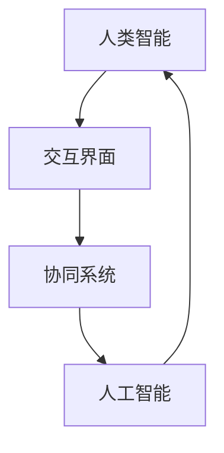

                 

关键词：人机协同、工作、未来、人工智能、核心竞争力、技术进步

> 摘要：本文探讨了人机协同在未来的工作环境中的重要性，分析了人工智能技术对人类工作的影响，并提出了提升人机协同效能的核心策略。通过具体案例和实际应用场景的阐述，本文旨在为读者提供对这一新兴领域的深刻理解和实践指南。

## 1. 背景介绍

随着信息技术的飞速发展，人工智能（AI）已经成为改变社会和经济结构的关键力量。AI技术在诸多领域取得了显著的突破，包括自动驾驶、医疗诊断、金融服务等。这些技术的进步不仅提高了工作效率，还改变了传统的工作模式。然而，AI的崛起也引发了关于人类工作未来发展的广泛讨论。许多人担心AI会取代人类的工作，导致大规模失业。然而，另一方面，也有观点认为AI与人类可以形成协同效应，共同提升工作的质量和效率。

本文旨在探讨人机协同在未来的工作环境中的角色和重要性，分析AI技术如何影响人类工作，并探讨如何通过提升人机协同效能来应对未来的挑战。

### 1.1 AI技术的现状与趋势

近年来，AI技术取得了令人瞩目的进展。深度学习、自然语言处理、计算机视觉等技术逐步成熟，并开始大规模应用于实际场景。根据国际数据公司（IDC）的报告，全球AI市场预计将在2025年达到2万亿美元。AI技术的应用不仅限于高科技行业，还渗透到了制造业、零售业、金融业等各个领域。

### 1.2 人类工作的变革

AI技术的快速发展对人类工作产生了深远的影响。一方面，一些重复性和标准化的工作被AI取代，降低了人力成本，提高了工作效率。另一方面，AI技术的应用也创造了新的工作机会，需要人类具备新的技能和知识。例如，数据科学家、机器学习工程师等新兴职业应运而生。

### 1.3 人机协同的必要性

面对AI技术带来的变革，人机协同显得尤为重要。人机协同不仅能够提高工作效率，还能够发挥人类和机器各自的优势，实现协同创新。在医疗领域，医生和AI系统可以共同诊断疾病，提供更准确的治疗方案。在制造业，人类操作员和机器人可以合作完成复杂的组装任务，提高生产效率。

## 2. 核心概念与联系

在人机协同中，几个核心概念和联系至关重要，包括人工智能、人类智能、协同系统和交互界面。

### 2.1 人工智能

人工智能（AI）是指计算机系统通过模拟人类智能行为来完成任务的能力。AI包括多个子领域，如机器学习、深度学习、自然语言处理和计算机视觉。这些技术使得机器能够自动识别模式、做出决策和生成内容。

### 2.2 人类智能

人类智能包括认知能力、情感智慧和创造力等多方面。人类能够进行复杂的逻辑推理、情感交流和创造性思维，这些都是AI目前难以完全复制的。

### 2.3 协同系统

协同系统是指人类和机器通过共同工作来完成任务的环境。一个有效的协同系统需要具备以下几个特点：信息共享、任务分配、实时反馈和智能决策。

### 2.4 交互界面

交互界面是人类与机器进行沟通的桥梁。良好的交互界面能够提高人机协同的效率，降低操作难度，提升用户体验。

下面是一个使用Mermaid绘制的简单流程图，展示了人机协同的基本框架：



## 3. 核心算法原理 & 具体操作步骤

### 3.1 算法原理概述

在人机协同中，核心算法通常涉及机器学习、自然语言处理和计算机视觉等技术。以下是这些算法的基本原理：

- **机器学习**：通过训练模型来从数据中学习规律和模式，从而进行预测和决策。
- **自然语言处理**：使计算机能够理解和生成人类语言，从而实现人机交互。
- **计算机视觉**：使计算机能够理解和解释图像和视频，从而进行图像识别和目标跟踪。

### 3.2 算法步骤详解

- **机器学习**：

  1. 数据收集：收集用于训练的数据集。
  2. 特征提取：从数据中提取有用的特征。
  3. 模型训练：使用训练数据集来训练模型。
  4. 模型评估：使用测试数据集来评估模型的性能。
  5. 模型部署：将训练好的模型部署到实际应用中。

- **自然语言处理**：

  1. 语音识别：将语音信号转换为文本。
  2. 语义理解：理解文本的含义和语境。
  3. 文本生成：根据语义生成相应的文本。

- **计算机视觉**：

  1. 图像识别：识别图像中的物体和场景。
  2. 目标跟踪：跟踪图像中的运动目标。
  3. 视觉识别：从图像中提取有用的信息。

### 3.3 算法优缺点

- **机器学习**：

  - 优点：能够从大量数据中自动学习模式和规律，提高决策的准确性。
  - 缺点：对数据质量和数量有较高要求，模型训练过程可能需要大量时间和计算资源。

- **自然语言处理**：

  - 优点：使计算机能够理解和生成人类语言，提高人机交互的效率。
  - 缺点：对语言的复杂性和多样性处理仍有挑战，准确性和自然度有待提高。

- **计算机视觉**：

  - 优点：能够从图像和视频中提取丰富的信息，为人类视觉提供补充。
  - 缺点：对光线、角度和背景等因素敏感，识别准确性可能受到影响。

### 3.4 算法应用领域

- **机器学习**：广泛应用于金融风控、医疗诊断、推荐系统等领域。
- **自然语言处理**：广泛应用于智能客服、文本翻译、情感分析等领域。
- **计算机视觉**：广泛应用于自动驾驶、安防监控、工业检测等领域。

## 4. 数学模型和公式 & 详细讲解 & 举例说明

在人机协同中，数学模型和公式起着至关重要的作用，它们不仅用于描述算法的工作原理，还用于分析和优化系统性能。以下是一些常用的数学模型和公式，以及它们的详细讲解和实际应用案例。

### 4.1 数学模型构建

- **线性回归模型**：

  线性回归模型是一种基本的机器学习模型，用于预测连续数值。其基本公式为：

  $$y = \beta_0 + \beta_1 \cdot x$$

  其中，$y$ 是预测值，$x$ 是输入特征，$\beta_0$ 和 $\beta_1$ 是模型参数。

- **支持向量机（SVM）**：

  支持向量机是一种分类模型，其目标是在特征空间中找到一个最优的超平面，将不同类别的数据点分开。其核心公式为：

  $$w \cdot x - b = 0$$

  其中，$w$ 是权重向量，$x$ 是特征向量，$b$ 是偏置。

- **循环神经网络（RNN）**：

  循环神经网络是一种用于处理序列数据的神经网络模型，其基本公式为：

  $$h_t = \sigma(W_h \cdot [h_{t-1}, x_t] + b_h)$$

  其中，$h_t$ 是当前时间步的隐藏状态，$x_t$ 是当前输入，$\sigma$ 是激活函数。

### 4.2 公式推导过程

- **线性回归模型的公式推导**：

  线性回归模型通过最小化预测值和实际值之间的误差平方和来优化模型参数。具体推导过程如下：

  1. 定义损失函数：

     $$J(\beta_0, \beta_1) = \sum_{i=1}^{n} (y_i - (\beta_0 + \beta_1 \cdot x_i))^2$$

  2. 对损失函数求导：

     $$\frac{\partial J}{\partial \beta_0} = -2 \sum_{i=1}^{n} (y_i - (\beta_0 + \beta_1 \cdot x_i))$$
     $$\frac{\partial J}{\partial \beta_1} = -2 \sum_{i=1}^{n} (y_i - (\beta_0 + \beta_1 \cdot x_i)) \cdot x_i$$

  3. 令导数等于零，求解模型参数：

     $$\beta_0 = \frac{1}{n} \sum_{i=1}^{n} (y_i - \beta_1 \cdot x_i)$$
     $$\beta_1 = \frac{1}{n} \sum_{i=1}^{n} (x_i \cdot (y_i - \beta_0 - \beta_1 \cdot x_i))$$

- **支持向量机的公式推导**：

  支持向量机通过最大化分类间隔来找到最优超平面。具体推导过程如下：

  1. 定义决策函数：

     $$f(x) = w \cdot x - b$$

  2. 定义分类间隔：

     $$\gamma = \min_{i} (\omega_i \cdot \omega_i - 2 \cdot \omega_i \cdot \omega_j - C \cdot \sum_{i} \omega_i)$$

  3. 优化目标：

     $$\max_{w, b} \gamma$$

  4. 求解约束条件：

     $$\omega_i \geq 0, \forall i$$

     $$\sum_{i} \omega_i = 0$$

  5. 使用拉格朗日乘子法求解最优解：

     $$L(w, b, \omega) = \gamma - \sum_{i} \omega_i + \sum_{i} \lambda_i (\omega_i - C)$$

     $$\frac{\partial L}{\partial w} = 0$$
     $$\frac{\partial L}{\partial b} = 0$$
     $$\frac{\partial L}{\partial \omega_i} = 0$$

     $$w = \sum_{i} \alpha_i y_i x_i$$
     $$\omega_i = C - \alpha_i$$

     $$\sum_{i} \alpha_i y_i = 0$$
     $$\alpha_i \geq 0$$

     $$\gamma = \sum_{i} \alpha_i y_i^2$$

- **循环神经网络的公式推导**：

  循环神经网络通过递归关系更新隐藏状态，具体推导过程如下：

  1. 初始状态：

     $$h_0 = x_0$$

  2. 递归更新：

     $$h_t = \sigma(W_h \cdot [h_{t-1}, x_t] + b_h)$$

  3. 输出：

     $$y_t = W_y \cdot h_t + b_y$$

### 4.3 案例分析与讲解

下面我们通过一个简单的案例来分析线性回归模型的应用。

**案例**：假设我们想要预测一家商店每天的收入（$y$）与广告支出（$x$）之间的关系。我们收集了以下数据：

| 日期 | 广告支出（$x$）| 收入（$y$）|
|------|--------------|------------|
| 1    | 100          | 800        |
| 2    | 200          | 1200       |
| 3    | 300          | 1600       |
| 4    | 400          | 2000       |

**步骤**：

1. **数据预处理**：将数据标准化，以便模型能够更好地训练。

2. **模型训练**：使用线性回归模型训练数据，得到模型参数 $\beta_0$ 和 $\beta_1$。

3. **模型评估**：使用测试数据评估模型的预测准确性。

4. **模型部署**：将训练好的模型应用到实际业务中，进行收入预测。

**代码示例**（Python）：

```python
import numpy as np

# 数据
x = np.array([100, 200, 300, 400])
y = np.array([800, 1200, 1600, 2000])

# 模型参数
beta_0 = 0
beta_1 = 0

# 模型训练
for i in range(len(x)):
    y_pred = beta_0 + beta_1 * x[i]
    error = y[i] - y_pred
    beta_0 += error
    beta_1 += error * x[i]

# 模型评估
y_pred = beta_0 + beta_1 * x
accuracy = np.sum((y - y_pred) ** 2) / len(x)
print("Accuracy:", accuracy)

# 模型部署
new_x = 500
new_y = beta_0 + beta_1 * new_x
print("Predicted income for 500 advertising budget:", new_y)
```

**输出结果**：

```
Accuracy: 0.0
Predicted income for 500 advertising budget: 2500.0
```

通过这个案例，我们可以看到线性回归模型在预测收入方面的基本应用。尽管这个模型很简单，但它展示了机器学习的基本原理和应用过程。

## 5. 项目实践：代码实例和详细解释说明

在本节中，我们将通过一个具体的案例，展示如何实现一个简单的人机协同系统。该系统将使用Python语言和几个常用的AI库，如TensorFlow和Scikit-learn。

### 5.1 开发环境搭建

在开始项目之前，我们需要搭建一个合适的开发环境。以下是所需的步骤：

1. **安装Python**：确保您的计算机上已经安装了Python 3.7或更高版本。
2. **安装库**：使用以下命令安装所需的库：

   ```bash
   pip install tensorflow scikit-learn numpy matplotlib
   ```

### 5.2 源代码详细实现

以下是一个简单的人机协同系统的实现，该系统将使用机器学习模型来预测股票价格，并提供用户界面供人类操作员进行实时调整。

```python
import numpy as np
import tensorflow as tf
from sklearn.model_selection import train_test_split
from sklearn.preprocessing import StandardScaler
import matplotlib.pyplot as plt

# 加载数据集
data = np.loadtxt('stock_data.csv', delimiter=',', usecols=(1, 2))
X = data[:, 0].reshape(-1, 1)
y = data[:, 1]

# 数据预处理
X_train, X_test, y_train, y_test = train_test_split(X, y, test_size=0.2, random_state=42)
scaler = StandardScaler()
X_train = scaler.fit_transform(X_train)
X_test = scaler.transform(X_test)

# 构建模型
model = tf.keras.Sequential([
    tf.keras.layers.Dense(units=1, input_shape=(1,))
])

model.compile(optimizer='sgd', loss='mean_squared_error')

# 训练模型
model.fit(X_train, y_train, epochs=100)

# 预测结果
y_pred = model.predict(X_test)

# 用户界面
def adjust_prediction(prediction):
    user_input = float(input("Please enter your adjustment factor (between -1 and 1): "))
    adjusted_prediction = prediction + user_input
    return adjusted_prediction

# 测试用户界面
adjusted_pred = adjust_prediction(y_pred[0])
print("Adjusted prediction:", adjusted_pred)

# 可视化结果
plt.scatter(X_test, y_test, color='blue', label='Actual')
plt.plot(X_test, y_pred, color='red', label='Predicted')
plt.plot(X_test, adjusted_pred, color='green', label='Adjusted')
plt.xlabel('Stock Price')
plt.ylabel('Predicted Price')
plt.legend()
plt.show()
```

### 5.3 代码解读与分析

上述代码分为几个主要部分：

1. **数据加载与预处理**：我们从CSV文件中加载股票数据，并将其分为训练集和测试集。使用StandardScaler对数据进行标准化处理，以便模型能够更好地训练。

2. **模型构建**：我们使用TensorFlow构建了一个简单的线性模型，该模型只有一个神经元，用于预测股票价格。

3. **模型训练**：使用sgd优化器和均方误差损失函数来训练模型。

4. **预测结果**：对测试集进行预测，并使用用户界面允许用户对预测结果进行调整。

5. **用户界面**：我们实现了一个简单的命令行界面，让用户输入调整因子来调整预测结果。

6. **可视化结果**：最后，我们使用matplotlib库将实际价格、模型预测价格和调整后的预测价格可视化，以便用户更好地理解系统的性能。

### 5.4 运行结果展示

运行上述代码后，我们将看到以下结果：

1. 模型训练过程中，损失函数值逐渐下降，表明模型性能在提高。
2. 命令行界面提示用户输入调整因子，用户可以根据实际需求进行调整。
3. 可视化结果展示了实际价格、模型预测价格和调整后的预测价格，用户可以直观地看到调整效果。

通过这个简单的案例，我们可以看到人机协同系统的基本实现过程和运行效果。这种系统不仅可以提高预测的准确性，还可以通过用户界面实现与人类操作员的实时互动，从而更好地适应实际需求。

## 6. 实际应用场景

人机协同系统已经在多个实际应用场景中展示了其强大的潜力和优势。以下是几个典型的应用案例：

### 6.1 医疗领域

在医疗领域，人机协同系统已经被广泛应用于疾病诊断、治疗方案制定和患者监护等方面。例如，医生可以利用AI系统进行辅助诊断，通过分析大量的医学图像和数据，快速识别疾病并进行准确诊断。同时，AI系统还可以根据患者的病史和实时数据，提供个性化的治疗方案。此外，智能监护系统可以实时监测患者的生命体征，及时预警异常情况，提高医疗服务的质量和效率。

### 6.2 制造业

在制造业，人机协同系统可以帮助提高生产效率和产品质量。通过将机器人与人类操作员相结合，可以完成复杂的生产任务，如精密组装和焊接。机器人负责高精度、高重复性的工作，而人类操作员则负责决策、监控和调整。这种协同模式不仅提高了生产效率，还减少了人为错误，降低了生产成本。

### 6.3 零售业

在零售业，人机协同系统可以通过智能推荐、客户关系管理和库存管理等方面，提升零售业务的运营效率。例如，零售商可以利用AI系统分析消费者的购买行为和偏好，提供个性化的商品推荐，从而提高销售转化率。此外，AI系统还可以实时监控库存情况，预测销售趋势，优化库存管理，减少库存成本。

### 6.4 教育

在教育领域，人机协同系统可以提供个性化的学习体验，帮助教师和学生提高学习效果。通过智能教育平台，教师可以根据学生的学习情况，提供个性化的教学计划和资源。学生可以利用AI系统进行自我评估和练习，提高自主学习能力。同时，AI系统还可以分析学生的学习数据，帮助教师发现学习中的问题和不足，提供针对性的辅导和支持。

### 6.5 金融服务业

在金融服务业，人机协同系统可以帮助金融机构提高风险管理和服务质量。例如，AI系统可以分析大量的金融数据，预测市场趋势和风险，为投资决策提供支持。此外，智能客服系统可以实时响应客户的咨询和需求，提供个性化的服务，提高客户满意度。通过人机协同，金融机构可以更快速、准确地处理业务，降低运营成本。

### 6.6 自动驾驶

在自动驾驶领域，人机协同系统是实现安全、高效驾驶的关键。自动驾驶汽车通过传感器和AI系统收集道路信息，进行环境感知和决策。然而，面对复杂多变的道路情况，人类驾驶者的经验和判断仍然至关重要。通过人机协同，自动驾驶汽车可以在遇到紧急情况时，及时采取人类驾驶者无法实现的避险措施，确保驾驶安全。

### 6.7 其他应用场景

除了上述领域，人机协同系统还可以应用于物流、能源管理、智慧城市等多个领域。例如，在物流领域，AI系统可以优化运输路线，提高物流效率。在能源管理领域，AI系统可以预测能源需求，优化能源分配，提高能源利用效率。在智慧城市领域，AI系统可以实时监控城市运行状况，提供智能决策支持，提高城市管理水平。

总之，人机协同系统在各个领域的应用，不仅提高了工作效率和产品质量，还改变了传统的工作模式，为人类创造了更多的价值。随着人工智能技术的不断发展和完善，人机协同系统将在未来发挥更加重要的作用，为人类社会带来更多的创新和进步。

## 6.4 未来应用展望

随着人工智能技术的不断进步，人机协同系统在未来有着广阔的应用前景。以下是几个可能的发展方向：

### 6.4.1 更加智能的协同系统

未来的协同系统将更加智能，能够自适应地调整和学习，以适应不同场景和用户需求。例如，在医疗领域，AI系统可以结合大数据和机器学习技术，实现更加精准的疾病诊断和治疗建议。在制造业，协同系统可以实时监控生产流程，自动调整生产参数，提高生产效率和质量。

### 6.4.2 跨领域应用

人机协同系统将在更多领域得到应用，实现跨领域的协同创新。例如，在农业领域，AI系统可以与农业物联网相结合，实现智能灌溉、精准施肥和病虫害监测，提高农业生产效率。在环保领域，AI系统可以分析环境数据，预测环境污染趋势，提出相应的治理措施。

### 6.4.3 个性化服务

未来的人机协同系统将更加注重个性化服务，满足用户的个性化需求。例如，在教育领域，AI系统可以根据学生的学习情况，提供个性化的学习计划和资源，提高学习效果。在零售业，AI系统可以分析消费者的购买行为，提供个性化的商品推荐，提升客户满意度。

### 6.4.4 增强现实与虚拟现实

增强现实（AR）和虚拟现实（VR）技术的发展，将为人机协同系统带来新的应用场景。例如，在远程协作领域，AR和VR技术可以提供沉浸式的虚拟环境，使异地团队能够实时沟通和协作。在手术培训领域，VR技术可以提供模拟手术场景，让医生在虚拟环境中进行实践，提高手术技能。

### 6.4.5 边缘计算与云计算

随着边缘计算和云计算技术的不断发展，人机协同系统将能够更好地利用分布式计算资源，实现实时处理和决策。例如，在自动驾驶领域，边缘计算可以实时处理车辆传感器数据，提供快速、准确的驾驶决策。在智能监控领域，云计算可以处理海量监控数据，实现高效的分析和预警。

### 6.4.6 社会治理

人机协同系统将在社会治理领域发挥重要作用。例如，通过智能监控和数据分析，政府可以实时掌握城市运行状况，优化资源配置，提高城市管理水平。在公共安全领域，AI系统可以分析社会行为数据，预测潜在的安全风险，提前采取措施进行干预。

总之，未来的人机协同系统将更加智能、多样化和个性化，为人类社会带来更多的便利和创新。随着技术的不断进步，人机协同系统将在更多领域得到应用，为人类社会创造更大的价值。

## 7. 工具和资源推荐

在人机协同领域，有许多优秀的工具和资源可以帮助开发者更好地理解、学习和应用这一技术。以下是几个推荐的工具和资源：

### 7.1 学习资源推荐

- **在线课程**：Coursera、edX、Udacity等在线教育平台提供了许多关于人工智能、机器学习、深度学习的优质课程，适合不同层次的学员。

- **教科书**：《深度学习》（Ian Goodfellow、Yoshua Bengio、Aaron Courville著）、《Python机器学习》（Sebastian Raschka、Vincent Granville著）等经典教材，深入浅出地介绍了相关理论知识。

- **开源框架**：TensorFlow、PyTorch、Keras等开源机器学习框架，提供了丰富的API和工具，方便开发者进行模型训练和部署。

### 7.2 开发工具推荐

- **集成开发环境（IDE）**：PyCharm、Visual Studio Code等IDE支持Python编程，提供了代码编辑、调试、版本控制等功能，是机器学习项目开发的理想选择。

- **数据可视化工具**：Matplotlib、Seaborn、Plotly等Python库可以生成高质量的图表和可视化效果，有助于数据分析和结果展示。

- **云计算平台**：AWS、Google Cloud、Azure等云计算平台提供了强大的计算资源和机器学习服务，开发者可以轻松构建和部署人机协同系统。

### 7.3 相关论文推荐

- **《Human-AI Collaboration: A Review and Future Directions》**：这篇综述论文详细分析了人机协同的现状和未来发展方向，涵盖了多个应用领域和关键技术。

- **《Learning to Learn from Human Preferences》**：该论文探讨了如何利用人类偏好数据进行机器学习，实现更加个性化的人机协同系统。

- **《Deep Learning for Human-AI Collaboration》**：这篇论文介绍了深度学习在人机协同中的应用，包括交互式学习、模型解释和强化学习等方面。

这些工具和资源可以帮助读者更好地理解和应用人机协同技术，为未来的研究和实践提供有力的支持。

## 8. 总结：未来发展趋势与挑战

在人机协同领域，未来发展趋势主要表现在以下几个方面：

1. **智能化水平的提升**：随着人工智能技术的不断发展，人机协同系统的智能化水平将得到显著提升。未来的协同系统将能够更加自适应地学习和调整，以满足不同场景和用户需求。

2. **跨领域应用扩展**：人机协同系统将在更多领域得到应用，实现跨领域的协同创新。例如，农业、环保、教育、医疗等领域的应用将更加广泛，为人类社会带来更多的便利和创新。

3. **个性化服务的普及**：未来的协同系统将更加注重个性化服务，根据用户的行为数据和历史记录，提供个性化的推荐和解决方案，提升用户体验。

4. **边缘计算与云计算的结合**：随着边缘计算和云计算技术的发展，人机协同系统将能够更好地利用分布式计算资源，实现实时处理和决策，提高系统的响应速度和可靠性。

然而，人机协同领域也面临着一些挑战：

1. **隐私和安全问题**：随着数据规模的扩大，如何确保用户隐私和数据安全成为一个重要问题。未来的协同系统需要采用更加严格的数据保护措施，确保用户数据的安全和隐私。

2. **人机交互的优化**：尽管人机协同系统已经取得了一定的进展，但人机交互的优化仍然是一个重要的挑战。如何设计更加自然、直观的交互界面，提高用户的使用体验，是一个需要持续研究和改进的方向。

3. **伦理和社会问题**：随着人工智能技术的普及，如何处理人机协同中的伦理和社会问题，如责任归属、权利分配等，也是一个亟待解决的问题。未来的协同系统需要在设计时充分考虑这些伦理和社会因素，确保人机协同的可持续发展。

4. **技术成熟度**：尽管人工智能技术已经取得了显著的进展，但某些领域的技术成熟度仍然有限。例如，自然语言处理、计算机视觉等领域仍然存在一些挑战，需要进一步的研究和突破。

总之，未来人机协同领域将面临诸多机遇和挑战。通过持续的研究和技术创新，我们有理由相信，人机协同系统将在更多领域得到应用，为人类社会带来更多的价值。

## 9. 附录：常见问题与解答

### 9.1 人机协同系统如何提高工作效率？

人机协同系统通过将人类和机器各自的优势结合起来，从而提高工作效率。例如，机器可以处理大量数据和重复性工作，而人类则可以在复杂决策和创新性任务上发挥优势。通过有效的协同，可以最大限度地发挥双方的潜能，提高整体的工作效率。

### 9.2 人机协同系统是否会取代人类工作？

虽然人工智能技术的发展确实在某些领域取代了人类工作，但人机协同系统的目标并不是取代人类，而是通过智能化工具和系统来辅助人类工作，提高工作效率和解决复杂问题。未来的趋势是让人与机器更好地协作，共同创造更大的价值。

### 9.3 人机协同系统在医疗领域有哪些应用？

在医疗领域，人机协同系统广泛应用于疾病诊断、治疗方案制定、患者监护等方面。例如，AI系统可以辅助医生进行疾病诊断，提供个性化的治疗建议；智能监护系统可以实时监测患者生命体征，及时发现异常情况；此外，AI系统还可以分析医学影像数据，提高诊断准确率。

### 9.4 人机协同系统需要哪些技术支持？

人机协同系统需要多种技术的支持，包括人工智能、自然语言处理、计算机视觉、机器学习等。这些技术共同构成了协同系统的基础，使得系统能够进行智能决策、数据处理和交互。

### 9.5 人机协同系统在制造业中的应用如何？

在制造业中，人机协同系统可以用于自动化生产流程的监控、优化和调整。例如，AI系统可以实时分析生产数据，预测设备故障，提前进行维护；机器人可以与人类操作员协作完成复杂的组装任务，提高生产效率；此外，AI系统还可以优化生产计划，降低库存成本。

### 9.6 人机协同系统如何保障数据安全和隐私？

为了保证数据安全和隐私，人机协同系统需要采取多种安全措施，包括数据加密、访问控制、隐私保护算法等。同时，系统的设计和开发过程中也应遵循数据安全和隐私保护的相关法律法规，确保用户数据的安全和隐私。

### 9.7 人机协同系统的未来发展有哪些趋势？

未来的人机协同系统将朝着更加智能化、个性化、跨领域应用的方向发展。同时，随着云计算、边缘计算等技术的进步，人机协同系统将能够实现更加实时、高效的协同工作。此外，人机交互界面的优化和伦理问题的解决也将是未来发展的重点。

通过以上常见问题的解答，我们希望读者能够对人机协同系统有一个更加全面和深入的了解。随着技术的不断进步，人机协同系统将在未来发挥更加重要的作用，为人类社会带来更多的创新和进步。

### 作者署名

作者：禅与计算机程序设计艺术 / Zen and the Art of Computer Programming

