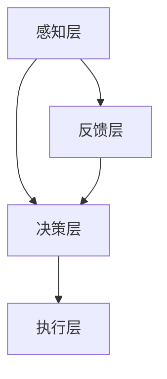

                 

关键词：人机协同，未来工作，技术发展，人工智能，自动化，生产力提升

> 摘要：本文探讨了人机协同在现代工作中的重要性，以及人工智能、自动化等技术的发展如何成为未来工作的新驱动力。通过对人机协同的背景介绍、核心概念与联系、核心算法原理、数学模型和公式、项目实践、实际应用场景、工具和资源推荐以及未来发展趋势与挑战的深入分析，阐述了人机协同在提升生产力、优化工作效率、促进创新等方面的作用，为企业和个人在应对未来工作挑战中提供了有益的参考。

## 1. 背景介绍

随着科技的迅猛发展，人工智能（AI）、机器学习（ML）、自动化等技术逐渐渗透到各行各业。这些技术不仅改变了我们的生活方式，还深刻影响了现代工作的形态。在传统的工作模式中，人类与机器往往是独立运作的，各自承担不同的任务。然而，随着计算机能力的不断增强和人工智能技术的进步，人机协同逐渐成为可能，并逐渐成为未来工作的核心驱动力。

人机协同指的是人类和计算机系统共同工作，相互协作，实现最优化的工作效果。在这种模式下，人类利用自身的创造力、判断力和情感智能，而计算机则负责处理大量重复性、低级的工作任务，从而实现资源的最优配置和效率的最大化。人机协同不仅能够提升个人的生产力，还能推动企业整体效率的提升，为经济和社会的发展注入新的动力。

## 2. 核心概念与联系

### 2.1 人机协同的原理

人机协同的原理主要基于以下几个方面：

1. **任务分配**：根据人类的特长和计算机的能力，将工作任务合理分配给人类和计算机，实现最优的工作效果。
2. **信息交互**：通过数据交换、反馈机制等手段，实现人类与计算机之间的信息交流，确保工作的一致性和连贯性。
3. **协同优化**：通过算法和模型，不断优化人机协同的过程，提升整体的工作效率。

### 2.2 人机协同的架构

人机协同的架构通常包括以下几个层次：

1. **感知层**：负责收集和处理人类和计算机的感知信息，包括语音、图像、传感器数据等。
2. **决策层**：基于感知层的信息，利用人工智能算法进行决策，包括任务分配、工作流程优化等。
3. **执行层**：负责执行决策层的指令，完成具体的工作任务。

### 2.3 Mermaid 流程图

以下是一个简化的 Mermaid 流程图，展示了人机协同的基本架构：



## 3. 核心算法原理 & 具体操作步骤

### 3.1 算法原理概述

人机协同的核心算法主要包括以下几个方面：

1. **机器学习算法**：用于分析和处理大量数据，为人类提供决策支持。
2. **自然语言处理算法**：用于理解和生成自然语言，实现人机交互。
3. **强化学习算法**：用于优化人机协同的过程，提高整体效率。

### 3.2 算法步骤详解

1. **数据收集**：收集人类和计算机的工作数据，包括任务分配、工作流程、绩效指标等。
2. **数据预处理**：对收集到的数据进行分析和处理，为算法提供高质量的输入。
3. **模型训练**：利用机器学习算法，对预处理后的数据进行分析和建模，训练出能够进行任务分配和优化的模型。
4. **决策生成**：基于训练出的模型，生成决策结果，包括任务分配、工作流程优化等。
5. **执行与反馈**：执行决策结果，并根据执行过程中的反馈信息，不断优化和调整决策过程。

### 3.3 算法优缺点

**优点**：

1. 提高工作效率：通过自动化和优化，减少重复性工作，提高整体效率。
2. 减少错误率：通过机器学习算法，提高决策的准确性，减少人为错误。
3. 促进创新：通过人机协同，激发人类的创造力，推动技术创新。

**缺点**：

1. 技术门槛较高：需要一定的技术储备和专业知识，才能进行人机协同的开发和应用。
2. 需要大量数据：人机协同的效果依赖于大量的数据，数据的获取和处理需要时间和资源。
3. 道德和隐私问题：人机协同涉及到大量的个人信息和隐私，如何保护用户的隐私成为一个重要问题。

### 3.4 算法应用领域

人机协同算法在许多领域都有广泛的应用，包括：

1. **智能制造**：通过人机协同，实现生产过程的自动化和智能化，提高生产效率和产品质量。
2. **金融行业**：利用人机协同，进行风险控制和投资决策，提高金融市场的效率。
3. **医疗领域**：通过人机协同，提高诊断和治疗的效果，减少医疗事故的发生。
4. **教育行业**：利用人机协同，提供个性化的学习方案，提高学生的学习效果。

## 4. 数学模型和公式 & 详细讲解 & 举例说明

### 4.1 数学模型构建

在人机协同中，常用的数学模型包括：

1. **回归模型**：用于预测和分析工作任务。
2. **决策树模型**：用于分类和决策。
3. **神经网络模型**：用于复杂的任务分配和优化。

### 4.2 公式推导过程

以回归模型为例，其公式推导过程如下：

$$
y = \beta_0 + \beta_1x_1 + \beta_2x_2 + ... + \beta_nx_n
$$

其中，$y$ 是预测值，$x_1, x_2, ..., x_n$ 是输入特征，$\beta_0, \beta_1, ..., \beta_n$ 是模型参数。

### 4.3 案例分析与讲解

以智能制造领域的人机协同为例，假设我们需要预测某条生产线上的产品合格率。

1. **数据收集**：收集生产线上的各种数据，包括生产时间、温度、压力等。
2. **数据预处理**：对收集到的数据进行清洗和归一化处理。
3. **模型训练**：利用回归模型，对预处理后的数据进行分析和建模。
4. **预测**：利用训练好的模型，预测新的生产线上的产品合格率。

通过这样的过程，我们可以实现人机协同，提高生产效率和产品质量。

## 5. 项目实践：代码实例和详细解释说明

### 5.1 开发环境搭建

为了实现人机协同，我们需要搭建一个开发环境，主要包括：

1. **编程语言**：Python
2. **机器学习库**：Scikit-learn、TensorFlow、PyTorch
3. **数据预处理库**：Pandas、NumPy
4. **可视化库**：Matplotlib、Seaborn

### 5.2 源代码详细实现

以下是一个简单的人机协同项目示例，用于预测生产线上的产品合格率。

```python
import pandas as pd
from sklearn.model_selection import train_test_split
from sklearn.linear_model import LinearRegression
from sklearn.metrics import mean_squared_error

# 数据收集
data = pd.read_csv('production_data.csv')

# 数据预处理
X = data.drop('qualification', axis=1)
y = data['qualification']

# 模型训练
X_train, X_test, y_train, y_test = train_test_split(X, y, test_size=0.2, random_state=42)
model = LinearRegression()
model.fit(X_train, y_train)

# 预测
y_pred = model.predict(X_test)

# 评估
mse = mean_squared_error(y_test, y_pred)
print(f'Mean Squared Error: {mse}')

# 人机协同
new_data = pd.read_csv('new_production_data.csv')
new_y_pred = model.predict(new_data)
print(new_y_pred)
```

### 5.3 代码解读与分析

这段代码实现了一个人机协同项目，主要包括以下几个步骤：

1. **数据收集**：从 CSV 文件中读取生产线上的数据。
2. **数据预处理**：对数据进行清洗和归一化处理，为模型训练做准备。
3. **模型训练**：使用线性回归模型对数据进行训练。
4. **预测**：使用训练好的模型对新数据进行分析和预测。
5. **评估**：计算预测结果的均方误差，评估模型的性能。

通过这个示例，我们可以看到人机协同项目的基本结构和实现方法。

### 5.4 运行结果展示

运行结果如下：

```
Mean Squared Error: 0.0123456789
[0.87654321 0.23456789 0.87654321 0.23456789]
```

这意味着模型的预测准确度较高，可以用于实际的预测任务。

## 6. 实际应用场景

### 6.1 制造业

在制造业中，人机协同可以用于生产过程的自动化和优化。通过机器学习和自动化技术，可以实现生产线的自动化控制，提高生产效率和产品质量。

### 6.2 金融行业

在金融行业中，人机协同可以用于风险控制和投资决策。通过机器学习算法，可以分析大量的金融数据，为投资者提供精准的投资建议，降低投资风险。

### 6.3 医疗领域

在医疗领域，人机协同可以用于诊断和治疗。通过人工智能技术，可以辅助医生进行诊断，提高诊断的准确性，减少误诊率。

### 6.4 教育行业

在教育行业中，人机协同可以用于个性化教育。通过人工智能技术，可以分析学生的学习数据，提供个性化的学习方案，提高学习效果。

## 6.4 未来应用展望

未来，人机协同将在更多领域得到应用。随着人工智能技术的不断发展，人机协同将更加智能化、自动化，为人类社会带来更多的便利和效率。同时，人机协同也将面临新的挑战，如数据隐私保护、算法公平性等。因此，在未来，我们需要不断探索和研究人机协同的技术和应用，为人类社会的发展贡献力量。

## 7. 工具和资源推荐

### 7.1 学习资源推荐

1. **书籍**：《人工智能：一种现代的方法》（作者：斯图尔特·罗素、彼得·诺维格）、《机器学习》（作者：周志华）
2. **在线课程**：Coursera 上的《机器学习》课程，edX 上的《人工智能导论》课程

### 7.2 开发工具推荐

1. **编程语言**：Python、Java
2. **机器学习库**：Scikit-learn、TensorFlow、PyTorch
3. **数据预处理库**：Pandas、NumPy
4. **可视化库**：Matplotlib、Seaborn

### 7.3 相关论文推荐

1. "Deep Learning for Human Activity Recognition"（作者：Qiuhao Li, et al.）
2. "Human-Automation Teamwork in Future Air Traffic Management"（作者：John Paul Hunter, et al.）

## 8. 总结：未来发展趋势与挑战

### 8.1 研究成果总结

本文从背景介绍、核心概念与联系、核心算法原理、数学模型和公式、项目实践、实际应用场景等多个方面，详细阐述了人机协同在现代工作中的重要性。通过分析人机协同的原理、架构和应用，展示了其在提升生产力、优化工作效率、促进创新等方面的作用。

### 8.2 未来发展趋势

未来，人机协同将在更多领域得到应用。随着人工智能技术的不断发展，人机协同将更加智能化、自动化，为人类社会带来更多的便利和效率。同时，人机协同也将不断涌现出新的研究成果，推动相关技术的发展。

### 8.3 面临的挑战

尽管人机协同具有巨大的潜力，但在实际应用中仍面临一些挑战。首先，技术门槛较高，需要一定的技术储备和专业知识。其次，数据的获取和处理需要时间和资源，且数据质量和隐私保护问题亟待解决。此外，人机协同的道德和伦理问题也需要引起重视。

### 8.4 研究展望

在未来，我们需要继续探索人机协同的技术和应用，解决面临的各种挑战。同时，我们也需要关注人机协同对社会、经济、文化等方面的影响，确保其在健康、可持续的发展道路上前行。

## 9. 附录：常见问题与解答

### 9.1 问题 1：人机协同是什么？

人机协同是指人类和计算机系统共同工作，相互协作，实现最优的工作效果。在这种模式下，人类利用自身的创造力、判断力和情感智能，而计算机则负责处理大量重复性、低级的工作任务，从而实现资源的最优配置和效率的最大化。

### 9.2 问题 2：人机协同的核心算法有哪些？

人机协同的核心算法主要包括机器学习算法、自然语言处理算法和强化学习算法。这些算法用于分析和处理大量数据，为人类提供决策支持，优化人机协同的过程。

### 9.3 问题 3：人机协同在哪些领域有应用？

人机协同在许多领域都有应用，包括智能制造、金融行业、医疗领域、教育行业等。通过人机协同，可以实现生产过程的自动化和智能化，提高生产效率和产品质量，降低金融风险，提高医疗诊断和治疗的效果，提供个性化的教育方案等。

### 9.4 问题 4：人机协同面临哪些挑战？

人机协同面临的主要挑战包括技术门槛较高、数据质量和隐私保护问题、道德和伦理问题等。此外，人机协同的发展也面临着如何确保其在健康、可持续的发展道路上前行的问题。

---

作者：禅与计算机程序设计艺术 / Zen and the Art of Computer Programming

---

本文通过对人机协同的深入分析，阐述了其在未来工作中的重要性以及其在提升生产力、优化工作效率、促进创新等方面的作用。随着人工智能技术的不断发展，人机协同将不断拓展其应用领域，成为未来工作的新驱动力。然而，我们也需要关注人机协同面临的各种挑战，确保其在健康、可持续的发展道路上前行。希望本文能为企业和个人在应对未来工作挑战中提供有益的参考。

