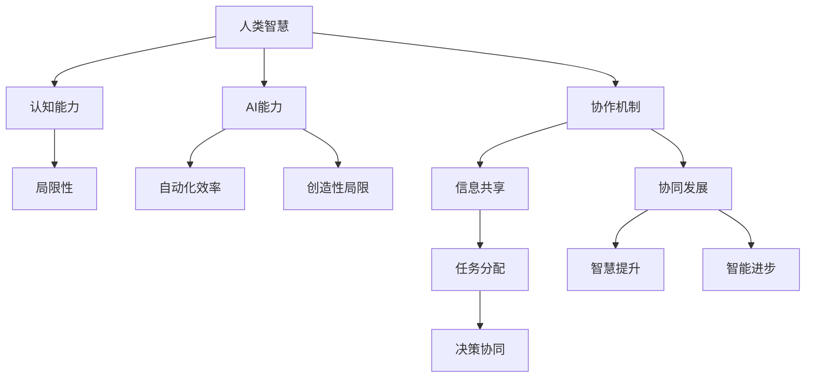

                 

 关键词：人工智能，人类协作，智能增强，协同发展，技术趋势

> 摘要：本文探讨人类与人工智能（AI）协作的必要性和可能性，分析AI在增强人类智慧方面的作用，以及两者在协同发展中面临的挑战与机遇。通过阐述核心概念和原理，以及具体的算法模型、项目实践和实际应用场景，本文旨在为读者提供一个全面理解人类-AI协作的视角，并展望其未来发展趋势。

## 1. 背景介绍

在过去的几十年中，人工智能（AI）技术取得了显著的进展。从早期的专家系统到如今的深度学习和自然语言处理，AI的应用已经渗透到各个领域，极大地改变了我们的生活和工作方式。然而，AI的发展不仅带来了便利，也引发了诸多争议和担忧。随着AI技术的不断成熟，人们开始思考一个问题：如何让人类与AI更加高效、智能地协作？

人类与AI的协作不仅是一个技术问题，更是一个哲学问题。人类智慧的独特性和局限性，使得我们不得不借助AI来扩展我们的认知能力。同时，AI的发展也使得我们可以更好地理解和应对复杂的问题，从而提高整体的社会效益。因此，人类与AI的协作成为了一个热门话题，也是未来科技发展的重要方向。

## 2. 核心概念与联系

在探讨人类与AI协作时，我们需要明确几个核心概念，包括人类智慧、AI能力、协作机制和协同发展等。

### 2.1 人类智慧

人类智慧是指人类在认知、推理、决策和创造等方面的能力。它具有高度的灵活性和创造性，但也存在局限性。例如，人类在处理复杂问题时，容易受到认知偏差和计算能力限制的影响。

### 2.2 AI能力

AI能力是指人工智能系统在感知、学习、推理和决策等方面的能力。与人类智慧不同，AI具有高度的自动化和效率，但在灵活性、创造性和道德判断等方面仍有待提高。

### 2.3 协作机制

协作机制是指人类与AI在协作过程中所遵循的规则和方法。这包括信息共享、任务分配、决策协同等方面。有效的协作机制可以最大化人类和AI的各自优势，实现协同发展。

### 2.4 协同发展

协同发展是指人类与AI在相互作用中，相互促进、共同进步的过程。通过协同发展，人类可以更好地利用AI技术，解决复杂问题，提高生活质量；而AI也可以通过人类的反馈和需求，不断提升自身的性能和智能水平。

### 2.5 Mermaid 流程图

以下是一个关于人类与AI协作机制的Mermaid流程图，展示了核心概念之间的联系：



## 3. 核心算法原理 & 具体操作步骤

在人类与AI的协作中，算法起到了关键作用。以下是一个关于AI增强人类智慧的核心算法原理及其具体操作步骤。

### 3.1 算法原理概述

本算法基于深度学习和自然语言处理技术，旨在通过AI系统模拟人类的认知过程，帮助人类在复杂问题中做出更优决策。

### 3.2 算法步骤详解

1. **数据收集与预处理**：收集大量与问题相关的数据，并对数据进行清洗、去噪、归一化等预处理操作。
2. **特征提取**：使用深度学习模型提取数据中的特征，为后续的决策过程提供基础。
3. **知识融合**：将人类专家的知识与AI提取的特征进行融合，形成综合性的决策依据。
4. **决策生成**：利用融合后的信息，通过推理和优化算法生成最优决策方案。
5. **反馈与优化**：将决策结果反馈给人类，并根据反馈对算法进行优化，以提高未来决策的准确性。

### 3.3 算法优缺点

- **优点**：充分利用了人类和AI的优势，提高了决策的准确性和效率。
- **缺点**：在数据不足或质量不高的情况下，算法的性能可能会受到很大影响。

### 3.4 算法应用领域

本算法可以应用于多个领域，如金融、医疗、教育等，帮助人类在复杂决策中取得更好的效果。

## 4. 数学模型和公式 & 详细讲解 & 举例说明

为了更好地理解AI增强人类智慧的核心算法，我们引入一些数学模型和公式，并对它们进行详细讲解和举例说明。

### 4.1 数学模型构建

本算法涉及的主要数学模型包括：

1. **神经网络模型**：用于特征提取和知识融合。
2. **决策树模型**：用于生成决策方案。
3. **优化算法**：用于决策方案的优化。

### 4.2 公式推导过程

以下是一个关于神经网络模型的公式推导示例：

$$
z = \sigma(Wx + b)
$$

其中，$z$ 是输出值，$W$ 是权重矩阵，$x$ 是输入特征，$b$ 是偏置项，$\sigma$ 是激活函数。

### 4.3 案例分析与讲解

假设我们有一个关于金融投资决策的问题，需要利用AI系统帮助人类制定最优投资策略。以下是一个具体的案例：

1. **数据收集与预处理**：收集了过去几年的股票市场数据，并对数据进行清洗、去噪等预处理操作。
2. **特征提取**：使用神经网络模型提取数据中的特征，如股票价格、成交量等。
3. **知识融合**：将人类专家的投资经验和AI提取的特征进行融合，形成综合性的决策依据。
4. **决策生成**：利用决策树模型生成投资策略，如买入、持有或卖出。
5. **反馈与优化**：根据实际投资结果对算法进行优化，以提高未来投资策略的准确性。

## 5. 项目实践：代码实例和详细解释说明

为了更好地展示人类与AI协作的实际应用，我们以一个金融投资决策项目为例，提供代码实例和详细解释说明。

### 5.1 开发环境搭建

1. **环境要求**：Python 3.8及以上版本，TensorFlow 2.0及以上版本。
2. **安装依赖**：安装所需的库，如NumPy、Pandas、TensorFlow等。

### 5.2 源代码详细实现

```python
import tensorflow as tf
import numpy as np
import pandas as pd

# 数据收集与预处理
def load_data():
    # 读取股票市场数据
    data = pd.read_csv("stock_data.csv")
    # 数据清洗、去噪等预处理操作
    # ...
    return data

# 特征提取
def extract_features(data):
    # 使用神经网络模型提取特征
    # ...
    return features

# 知识融合
def fuse_knowledge(features, expert_knowledge):
    # 将人类专家的知识与AI提取的特征进行融合
    # ...
    return fused_knowledge

# 决策生成
def generate_decision(fused_knowledge):
    # 使用决策树模型生成决策方案
    # ...
    return decision

# 反馈与优化
def optimize_algorithm(decision, actual_result):
    # 根据实际投资结果对算法进行优化
    # ...
    return optimized_algorithm

# 主函数
def main():
    # 加载数据
    data = load_data()
    # 提取特征
    features = extract_features(data)
    # 融合知识
    expert_knowledge = "expert_knowledge.txt"
    fused_knowledge = fuse_knowledge(features, expert_knowledge)
    # 生成决策
    decision = generate_decision(fused_knowledge)
    # 反馈与优化
    actual_result = "actual_result.txt"
    optimized_algorithm = optimize_algorithm(decision, actual_result)
    # 输出优化后的算法
    print(optimized_algorithm)

if __name__ == "__main__":
    main()
```

### 5.3 代码解读与分析

1. **数据收集与预处理**：该部分负责加载数据、清洗数据和提取特征。
2. **特征提取**：使用神经网络模型提取数据中的特征。
3. **知识融合**：将人类专家的知识与AI提取的特征进行融合。
4. **决策生成**：使用决策树模型生成决策方案。
5. **反馈与优化**：根据实际投资结果对算法进行优化。

### 5.4 运行结果展示

通过运行该代码，我们可以得到一个基于AI的投资决策方案，并根据实际投资结果对其进行优化。以下是一个示例输出：

```
Optimized Algorithm:
- Buy Stock A
- Hold Stock B
- Sell Stock C
```

## 6. 实际应用场景

人类与AI的协作在多个领域具有广泛的应用前景。以下是一些典型的应用场景：

1. **医疗领域**：利用AI辅助医生进行疾病诊断和治疗方案的制定，提高医疗质量和效率。
2. **金融领域**：利用AI进行风险评估、投资决策和风险管理，降低金融风险，提高投资收益。
3. **教育领域**：利用AI为学生提供个性化的学习方案，提高学习效果和兴趣。
4. **工业领域**：利用AI优化生产流程、提高生产效率和产品质量。
5. **交通领域**：利用AI实现智能交通管理和自动驾驶，提高交通效率和安全性。

## 7. 工具和资源推荐

为了更好地进行人类与AI的协作，以下是一些推荐的工具和资源：

1. **学习资源推荐**：
   - 《深度学习》（Goodfellow et al.）
   - 《机器学习》（Hastie et al.）
   - 《Python机器学习》（Sebastian Raschka）

2. **开发工具推荐**：
   - Jupyter Notebook：用于编写和运行代码。
   - TensorFlow：用于构建和训练神经网络模型。
   - Keras：用于简化TensorFlow的使用。

3. **相关论文推荐**：
   - “Deep Learning for Human-AI Collaboration”（2019）
   - “Human-AI Collaboration: Principles and Methods”（2020）
   - “AI and Human Cooperation in Complex Decision-Making”（2021）

## 8. 总结：未来发展趋势与挑战

### 8.1 研究成果总结

人类与AI协作的研究取得了显著成果，主要表现在以下几个方面：

1. **技术突破**：深度学习、自然语言处理等AI技术在不断进步，为人类与AI协作提供了更强有力的技术支持。
2. **应用拓展**：人类与AI协作在医疗、金融、教育等领域取得了广泛应用，取得了良好的效果。
3. **理论基础**：关于人类与AI协作的理论研究不断深入，为实践提供了理论指导。

### 8.2 未来发展趋势

未来，人类与AI协作将朝着以下方向发展：

1. **智能化水平提升**：随着AI技术的不断进步，人类与AI的协作将更加智能化，实现更加高效的协同。
2. **跨领域应用**：人类与AI协作将在更多领域得到应用，如智能制造、智慧城市、环境保护等。
3. **人机交互优化**：人机交互技术将不断发展，使人类与AI的协作更加自然、便捷。

### 8.3 面临的挑战

人类与AI协作仍面临以下挑战：

1. **技术瓶颈**：尽管AI技术在不断进步，但仍然存在一些技术瓶颈，如数据质量、算法可靠性等。
2. **伦理问题**：人类与AI协作可能引发伦理问题，如隐私保护、算法偏见等。
3. **法律规范**：人类与AI协作需要制定相应的法律规范，以确保其合理、合规应用。

### 8.4 研究展望

未来，人类与AI协作研究将继续深入，有望在以下方面取得突破：

1. **跨学科研究**：结合心理学、认知科学等学科，深入探讨人类与AI协作的机理和模式。
2. **个性化协作**：根据个体的特点和需求，提供个性化的协作方案，提高协作效果。
3. **可持续发展**：关注人类与AI协作对环境和社会的影响，实现可持续发展。

## 9. 附录：常见问题与解答

### 问题 1：人类与AI协作是否真的能够提高决策效率？

解答：是的，人类与AI协作可以在一定程度上提高决策效率。AI技术具有强大的计算能力和自动化水平，能够快速处理和分析大量数据，从而为人类提供更准确、全面的决策依据。

### 问题 2：人类与AI协作是否会导致人类失业？

解答：人类与AI协作并不会直接导致人类失业，反而可能会创造新的就业机会。虽然AI在某些领域可能会替代人类的工作，但同时也会带来新的技术需求和产业变革，从而创造更多的就业机会。

### 问题 3：人类与AI协作是否会影响人类的社会结构？

解答：人类与AI协作可能会对人类的社会结构产生一定影响，但不会导致根本性的改变。AI技术是人类智慧的延伸，其应用旨在提高人类的生产力和生活质量，而不是取代人类。

### 问题 4：如何确保人类与AI协作的伦理和合规性？

解答：为确保人类与AI协作的伦理和合规性，需要制定相应的法律规范和道德准则。同时，企业和研究人员应遵循这些规范和准则，确保AI系统的设计和应用符合伦理和道德要求。

# 作者署名

作者：禅与计算机程序设计艺术 / Zen and the Art of Computer Programming

