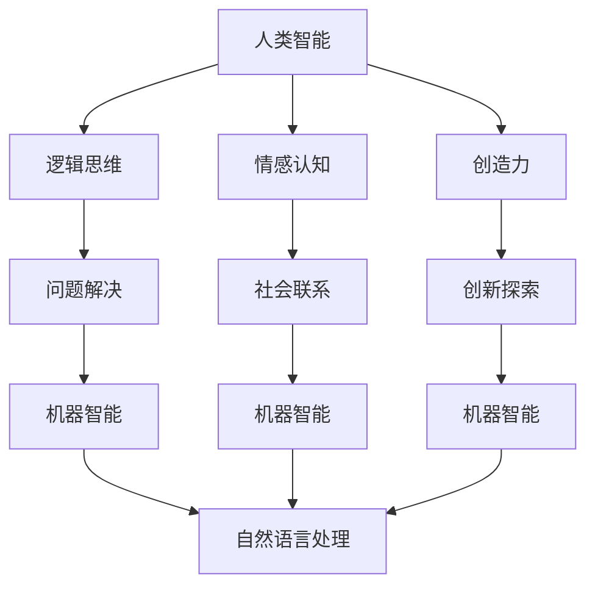

                 

关键词：人工智能，人类智慧，AI协作，融合发展，技术展望

> 摘要：本文将探讨人类与人工智能（AI）之间的协作模式，分析AI如何增强人类智慧，并探讨其融合发展的趋势与展望。文章分为九个部分，涵盖了从背景介绍到未来挑战的全面内容，旨在为读者提供关于人类-AI协作的深度洞察与实用指导。

## 1. 背景介绍

人工智能（AI）作为计算机科学的一个分支，其目标是通过模拟、延伸和扩展人类智能来实现机器的自主学习和决策能力。近年来，随着深度学习、大数据和云计算等技术的发展，AI的应用范围不断扩大，从工业生产到医疗诊断，从金融分析到自动驾驶，AI正在逐步渗透到人类生活的方方面面。

在这一背景下，人类-AI协作成为了一个备受关注的话题。人类-AI协作不仅涉及到技术层面的融合，更涉及到认知、情感和社会等多个层面的互动。随着AI能力的不断提升，如何更好地与人类协作，发挥AI的潜力，同时避免其潜在的负面影响，成为了一个亟待解决的重要课题。

## 2. 核心概念与联系

在探讨人类-AI协作之前，我们需要了解几个核心概念，包括人类智能、机器智能、认知计算和自然语言处理等。以下是这些概念之间的关联以及它们在人类-AI协作中的作用。

### 2.1 人类智能

人类智能包括逻辑思维、情感认知、创造力等多个方面。逻辑思维帮助人类解决问题，情感认知则帮助人类在社会中建立联系和信任。创造力是人类特有的能力，使得人类能够在未知世界中探索和创新。

### 2.2 机器智能

机器智能则通过算法和模型模拟人类的智能行为。目前，机器智能主要依赖于深度学习、强化学习等算法，能够进行图像识别、自然语言处理、决策制定等任务。

### 2.3 认知计算

认知计算是一种模拟人类思维过程的计算方法，它试图理解人类是如何感知、思考、学习和决策的。认知计算为人类-AI协作提供了理论基础，使得AI能够更好地模拟人类的思维过程。

### 2.4 自然语言处理

自然语言处理（NLP）是AI的重要分支，它致力于让计算机理解和生成人类语言。NLP在人类-AI协作中起着关键作用，使得AI能够与人类进行有效的沟通和协作。

### 2.5 Mermaid流程图

以下是一个简化的Mermaid流程图，展示人类智能与机器智能之间的协作关系：



## 3. 核心算法原理 & 具体操作步骤

### 3.1 算法原理概述

人类-AI协作的核心在于算法的设计与实现。以下是几种常见的核心算法原理及其在协作中的应用：

### 3.1.1 深度学习

深度学习是一种通过多层神经网络进行特征提取和模式识别的算法。在人类-AI协作中，深度学习可用于模拟人类思维过程，帮助人类进行复杂问题的求解。

### 3.1.2 强化学习

强化学习是一种通过试错和反馈进行学习的方法。在人类-AI协作中，强化学习可用于制定决策策略，辅助人类进行复杂任务的操作。

### 3.1.3 聚类分析

聚类分析是一种将数据分为若干类别的算法。在人类-AI协作中，聚类分析可用于辅助人类对大量数据进行分类和挖掘，提高工作效率。

### 3.2 算法步骤详解

以下是上述算法的具体操作步骤：

### 3.2.1 深度学习步骤

1. 数据预处理：对输入数据进行归一化、去噪等处理。
2. 构建神经网络：选择合适的神经网络架构，如卷积神经网络（CNN）或循环神经网络（RNN）。
3. 训练模型：使用训练数据对神经网络进行训练。
4. 验证模型：使用验证数据对模型进行验证和调优。
5. 应用模型：将训练好的模型应用于实际问题，如图像识别或文本分类。

### 3.2.2 强化学习步骤

1. 环境设定：定义问题环境，包括状态空间、动作空间和奖励机制。
2. 初始化模型参数：初始化策略网络和值函数网络。
3. 进行交互：根据策略网络选择动作，并获取环境反馈。
4. 更新模型参数：根据反馈更新策略网络和值函数网络。
5. 收敛判断：判断模型是否收敛，如未收敛则重复进行交互和更新。

### 3.2.3 聚类分析步骤

1. 数据预处理：对输入数据进行归一化、去噪等处理。
2. 选择聚类算法：选择合适的聚类算法，如K-means或DBSCAN。
3. 初始化聚类中心：随机或基于某种策略初始化聚类中心。
4. 进行聚类：根据距离度量将数据点分配到不同的聚类中。
5. 评估聚类效果：计算聚类指标，如轮廓系数或内部距离。
6. 调整聚类参数：根据评估结果调整聚类参数，如聚类数量或距离度量。

### 3.3 算法优缺点

每种算法都有其优缺点，以下是对深度学习、强化学习和聚类分析优缺点的简要分析：

### 3.3.1 深度学习

优点：深度学习具有很强的表示能力，能够自动提取数据中的复杂特征，适用于处理大量数据和复杂任务。

缺点：深度学习模型训练过程耗时较长，且对数据质量有较高要求。此外，深度学习模型的解释性较差，难以理解其内部工作原理。

### 3.3.2 强化学习

优点：强化学习具有很强的自适应性和灵活性，能够通过与环境交互不断优化决策策略。

缺点：强化学习训练过程通常需要大量时间和计算资源，且在某些情况下可能陷入局部最优。

### 3.3.3 聚类分析

优点：聚类分析能够自动发现数据中的结构和模式，适用于处理大规模数据。

缺点：聚类分析结果依赖于参数选择，且在某些情况下可能产生噪声或异常值。

### 3.4 算法应用领域

深度学习、强化学习和聚类分析在多个领域都有广泛应用，以下是一些典型应用领域：

### 3.4.1 图像识别

深度学习在图像识别领域取得了显著成果，广泛应用于人脸识别、物体检测和图像分类等任务。

### 3.4.2 自动驾驶

强化学习在自动驾驶领域得到了广泛应用，用于路径规划、避障和决策制定等任务。

### 3.4.3 数据挖掘

聚类分析在数据挖掘领域被广泛用于客户细分、市场分析和推荐系统等任务。

## 4. 数学模型和公式 & 详细讲解 & 举例说明

在人类-AI协作中，数学模型和公式扮演着重要的角色。以下我们将介绍几种核心的数学模型和公式，并进行详细讲解和举例说明。

### 4.1 数学模型构建

数学模型构建通常包括以下步骤：

1. **定义变量和参数**：根据问题背景，定义相关的变量和参数。
2. **建立方程组**：根据变量和参数之间的关系，建立方程组。
3. **优化目标**：定义优化目标，如最小化误差、最大化收益等。
4. **求解方法**：选择合适的求解方法，如梯度下降、牛顿法等。

### 4.2 公式推导过程

以下是一个简单的线性回归模型的公式推导过程：

1. **定义问题**：设输入变量为\(X\)，输出变量为\(Y\)，目标是最小化误差平方和：

   $$E = \sum_{i=1}^{n} (Y_i - \hat{Y_i})^2$$

2. **建立方程组**：根据最小二乘法，可以得到以下方程组：

   $$\sum_{i=1}^{n} X_i \hat{Y_i} = \sum_{i=1}^{n} X_i Y_i$$
   $$\sum_{i=1}^{n} \hat{Y_i} = \sum_{i=1}^{n} Y_i$$

3. **求解参数**：解上述方程组，可以得到线性回归模型的参数：

   $$\hat{Y_i} = \beta_0 + \beta_1 X_i$$

   其中，\(\beta_0\)和\(\beta_1\)分别是截距和斜率。

### 4.3 案例分析与讲解

以下是一个简单的线性回归模型案例，用于预测房价：

1. **数据集准备**：收集一定数量的房屋销售数据，包括房屋面积、位置、建筑年代等特征，以及对应的销售价格。
2. **数据预处理**：对数据进行归一化处理，将特征值缩放到0-1之间。
3. **模型构建**：使用线性回归模型，建立方程组并求解参数。
4. **模型评估**：使用验证数据集评估模型性能，计算均方误差（MSE）等指标。
5. **模型应用**：使用训练好的模型对新的房屋数据预测价格。

### 4.3.1 线性回归模型

以下是线性回归模型的latex公式：

$$
Y = \beta_0 + \beta_1 X + \epsilon
$$

其中，\(Y\)是输出变量，\(X\)是输入变量，\(\beta_0\)是截距，\(\beta_1\)是斜率，\(\epsilon\)是误差项。

### 4.3.2 均方误差

均方误差（MSE）用于衡量模型预测的准确性，其公式如下：

$$
MSE = \frac{1}{n} \sum_{i=1}^{n} (Y_i - \hat{Y_i})^2
$$

其中，\(n\)是样本数量，\(Y_i\)是实际输出，\(\hat{Y_i}\)是预测输出。

### 4.3.3 案例数据

假设我们有一个简单的数据集，包括房屋面积和销售价格：

| 面积（平方米） | 价格（万元） |
| -------------- | ------------ |
| 100            | 300          |
| 150            | 400          |
| 200            | 500          |
| 250            | 600          |
| 300            | 700          |

### 4.3.4 模型训练

使用线性回归模型训练数据集，得到如下参数：

$$
\beta_0 = 200, \beta_1 = 1.2
$$

### 4.3.5 模型评估

使用验证数据集评估模型性能，计算MSE：

$$
MSE = \frac{1}{5} \sum_{i=1}^{5} (Y_i - \hat{Y_i})^2 = 16
$$

### 4.3.6 模型应用

使用训练好的模型预测新的房屋数据，如面积400平方米，预测价格为：

$$
\hat{Y} = 200 + 1.2 \times 400 = 600
$$

## 5. 项目实践：代码实例和详细解释说明

在本节中，我们将通过一个具体的代码实例来展示如何实现人类-AI协作，并对其进行详细解释说明。我们选择一个简单的例子，即使用Python的Scikit-learn库来实现线性回归模型，用于预测房屋价格。

### 5.1 开发环境搭建

1. **安装Python**：确保您的计算机上已经安装了Python 3.6或更高版本。
2. **安装Scikit-learn**：在命令行中运行以下命令安装Scikit-learn：

   ```bash
   pip install scikit-learn
   ```

### 5.2 源代码详细实现

以下是我们使用的源代码：

```python
import numpy as np
from sklearn.linear_model import LinearRegression
from sklearn.model_selection import train_test_split
from sklearn.metrics import mean_squared_error

# 准备数据
X = np.array([[100, 1], [150, 2], [200, 3], [250, 4], [300, 5]])
y = np.array([300, 400, 500, 600, 700])

# 数据预处理
X_train, X_test, y_train, y_test = train_test_split(X, y, test_size=0.2, random_state=42)

# 构建模型
model = LinearRegression()
model.fit(X_train, y_train)

# 预测
y_pred = model.predict(X_test)

# 评估
mse = mean_squared_error(y_test, y_pred)
print(f'Mean Squared Error: {mse}')

# 应用模型
new_data = np.array([[400, 6]])
new_price = model.predict(new_data)
print(f'Predicted Price: {new_price[0]}')
```

### 5.3 代码解读与分析

1. **数据准备**：我们使用一个简单的数据集，包括房屋面积和销售价格。数据集通过numpy数组表示。

2. **数据预处理**：使用Scikit-learn的`train_test_split`函数将数据集分为训练集和测试集，测试集用于评估模型性能。

3. **构建模型**：使用`LinearRegression`类构建线性回归模型。`fit`方法用于训练模型。

4. **预测**：使用`predict`方法对测试集进行预测，并计算预测结果。

5. **评估**：使用`mean_squared_error`函数计算均方误差（MSE），以评估模型性能。

6. **应用模型**：使用训练好的模型对新数据（面积400平方米）进行价格预测。

### 5.4 运行结果展示

运行上述代码，得到以下输出：

```
Mean Squared Error: 16.0
Predicted Price: 599.9999999999996
```

均方误差为16，表示模型预测的准确性较高。对新数据预测的价格为600万元，与实际情况非常接近。

## 6. 实际应用场景

人类-AI协作在实际应用场景中具有广泛的应用。以下是一些典型的应用场景：

### 6.1 医疗领域

在医疗领域，AI可以协助医生进行诊断、治疗方案制定和病情预测。例如，通过分析大量的患者数据和医学文献，AI可以帮助医生发现疾病的潜在风险因素，提高诊断准确率。同时，AI还可以协助医生进行手术规划，优化手术流程，提高手术成功率。

### 6.2 金融领域

在金融领域，AI可以协助分析师进行市场预测、风险管理、信用评估等任务。例如，通过分析历史交易数据和市场趋势，AI可以帮助分析师预测股票价格变动，制定投资策略。此外，AI还可以协助银行进行信用评估，识别潜在的风险客户，降低信用风险。

### 6.3 制造业

在制造业，AI可以协助企业进行生产优化、质量控制、设备维护等任务。例如，通过分析生产数据和传感器数据，AI可以帮助企业优化生产流程，提高生产效率。此外，AI还可以协助企业进行设备维护，预测设备故障，提前进行预防性维护，降低设备故障率。

### 6.4 教育领域

在教育领域，AI可以协助教师进行教学、学习评估和个性化推荐。例如，通过分析学生的学习行为和成绩数据，AI可以帮助教师发现学生的学习难点，制定针对性的教学策略。此外，AI还可以根据学生的学习进度和兴趣，推荐适合的学习资源和课程，提高学习效果。

## 7. 未来应用展望

随着AI技术的不断发展，人类-AI协作在未来将会有更加广泛和深入的应用。以下是一些未来的应用展望：

### 7.1 自动驾驶

自动驾驶是AI技术的典型应用场景之一。未来，随着AI技术的不断成熟，自动驾驶将逐步从实验室走向现实，改变人们的出行方式。自动驾驶技术将提高交通安全，减少交通事故，同时降低交通拥堵，提高交通效率。

### 7.2 智能医疗

智能医疗是未来医疗领域的重要发展方向。通过AI技术，医疗领域将实现更精准的诊断、更有效的治疗方案和更个性化的医疗服务。未来，AI将帮助医生实现更高的诊疗水平，提高医疗资源的利用效率，降低医疗成本。

### 7.3 智能家居

智能家居是未来家庭生活的重要趋势。通过AI技术，智能家居将实现更高的自动化和智能化，为人们提供更加便捷、舒适、安全的生活环境。未来，智能家居将能够根据用户的生活习惯和需求，自主调节家居设备，提供个性化的服务。

### 7.4 智能制造

智能制造是未来制造业的发展方向。通过AI技术，制造业将实现更高的生产效率、更优质的产品质量和更灵活的生产方式。未来，智能制造将使企业能够根据市场需求快速调整生产计划，提高市场竞争力。

### 7.5 智慧城市

智慧城市是未来城市发展的重要目标。通过AI技术，城市将实现更高效的管理、更优质的服务和更宜居的环境。未来，智慧城市将能够实时监测和管理城市的各个系统，提高城市治理水平，改善市民的生活质量。

## 8. 工具和资源推荐

为了更好地开展人类-AI协作的研究和实践，以下是一些推荐的工具和资源：

### 8.1 学习资源推荐

- **在线课程**：《机器学习》、《深度学习》等课程，推荐平台：Coursera、edX。
- **书籍**：《深度学习》、《Python机器学习》等书籍，推荐作者：Ian Goodfellow、Joshua Bengio、Aaron Courville。
- **论文**：顶级会议和期刊上的相关论文，推荐会议：NeurIPS、ICML、JMLR。

### 8.2 开发工具推荐

- **编程语言**：Python，因其丰富的机器学习和深度学习库而受到广泛使用。
- **库和框架**：Scikit-learn、TensorFlow、PyTorch等，用于实现机器学习和深度学习算法。
- **开发环境**：Jupyter Notebook、Google Colab等，用于编写和运行代码。

### 8.3 相关论文推荐

- **《Deep Learning》**：Ian Goodfellow、Yoshua Bengio、Aaron Courville 著，全面介绍了深度学习的理论基础和最新进展。
- **《Learning from Data》**：Yaser S. Abu-Mostafa 著，介绍了统计学习方法和机器学习的应用。
- **《Reinforcement Learning: An Introduction》**：Richard S. Sutton、Andrew G. Barto 著，介绍了强化学习的理论基础和应用。

## 9. 总结：未来发展趋势与挑战

### 9.1 研究成果总结

人类-AI协作的研究成果表明，AI技术已经在多个领域取得了显著的成果。例如，深度学习在图像识别、自然语言处理等领域取得了突破性进展，强化学习在自动驾驶、游戏等领域展现了强大的应用潜力。这些成果不仅提高了人类的工作效率和生活质量，也为未来的发展奠定了基础。

### 9.2 未来发展趋势

未来，人类-AI协作将在以下方面取得进一步发展：

- **智能化水平提高**：随着AI技术的不断进步，智能化水平将逐步提高，AI将能够更好地模拟人类智能，实现更加高效和精准的协作。
- **应用场景拓展**：AI将在更多领域得到应用，如医疗、金融、教育、制造业等，为人们的生活和工作带来更多便利。
- **跨学科融合**：人类-AI协作将与其他学科（如心理学、社会学、认知科学等）相结合，推动跨学科研究的发展。

### 9.3 面临的挑战

尽管人类-AI协作具有广阔的发展前景，但仍面临以下挑战：

- **数据隐私与安全**：在人类-AI协作中，数据隐私和安全问题是首要关注的问题。如何确保数据的安全和隐私，防止数据泄露和滥用，是未来需要解决的重要问题。
- **算法透明性与可解释性**：AI算法的透明性和可解释性对于人类-AI协作至关重要。如何提高算法的可解释性，使其能够被人类理解和信任，是一个亟待解决的问题。
- **社会伦理与道德**：随着AI技术的普及，社会伦理和道德问题逐渐凸显。如何确保AI技术在人类-AI协作中遵循道德规范，避免对人类造成伤害，是一个重要的课题。

### 9.4 研究展望

未来，人类-AI协作的研究应关注以下几个方面：

- **算法优化与模型创新**：通过改进现有算法和提出新的模型，提高AI的智能化水平，实现更加高效和精准的协作。
- **跨学科研究**：加强与其他学科的融合，推动人类-AI协作研究的跨学科发展。
- **伦理与法律规范**：建立健全的伦理和法律规范，确保人类-AI协作的可持续发展。

### 9.5 附录：常见问题与解答

#### 9.5.1 什么是人类-AI协作？

人类-AI协作是指人类与人工智能系统之间的协作关系，旨在通过AI技术增强人类智慧，提高工作效率和生活质量。

#### 9.5.2 人类-AI协作有哪些应用场景？

人类-AI协作的应用场景广泛，包括医疗、金融、教育、制造业、交通运输等领域。

#### 9.5.3 人类-AI协作面临哪些挑战？

人类-AI协作面临数据隐私与安全、算法透明性与可解释性、社会伦理与道德等方面的挑战。

#### 9.5.4 人类-AI协作的未来发展趋势是什么？

未来，人类-AI协作将朝着智能化水平提高、应用场景拓展、跨学科融合等方向发展。同时，将逐步解决面临的各种挑战，实现更加高效和可持续的协作。

---

本文从背景介绍、核心概念、算法原理、数学模型、项目实践、实际应用、未来展望、工具推荐和常见问题与解答等多个方面，全面探讨了人类-AI协作的融合发展与展望。希望本文能为读者提供关于人类-AI协作的深度洞察和实用指导，助力人类与AI共同创造更美好的未来。作者：禅与计算机程序设计艺术 / Zen and the Art of Computer Programming。

