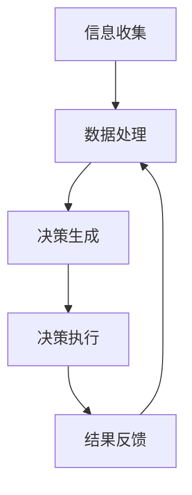

                 

关键词：人类-AI协作、增强智慧、AI能力、融合、发展趋势、策略

> 摘要：本文旨在探讨人类与人工智能（AI）协作的深度融合，分析其在提升人类智慧与AI能力方面的关键趋势和策略。通过梳理现有研究成果和实践案例，本文提出了构建人类-AI协作系统的框架，以及在实际应用中的技术路径和挑战。文章最后对未来人类-AI协作的发展趋势进行了展望，并提出了相应的对策。

## 1. 背景介绍

随着人工智能技术的飞速发展，AI已经深入到我们生活的各个方面，从简单的语音助手到复杂的自动驾驶系统，AI正在逐渐改变我们的生活方式和工作方式。然而，尽管AI在某些领域已经取得了显著的成就，但它在许多方面仍然存在局限性。例如，AI在处理复杂决策、理解人类情感以及创造性思维等方面仍然无法与人类相比。

另一方面，人类在解决复杂问题、理解多维度信息以及创造性思维等方面具有独特的优势。因此，将人类智慧与AI能力相结合，构建人类-AI协作系统，有望实现两者的互补，从而极大地提升人类解决问题的效率和创新能力。

### 1.1 人类与AI的互补性

人类和AI各自具有不同的优势和局限性。人类擅长处理模糊、复杂、不确定的信息，具备良好的直觉和情感理解能力；而AI则擅长处理大规模数据，具备快速计算和精确分析的能力。通过将人类的直觉和创造力与AI的计算和分析能力相结合，可以充分发挥两者的优势，实现更好的决策和创造。

### 1.2 人类-AI协作的必要性

在当前快速发展的社会和经济环境中，面对日益复杂的问题和挑战，单靠人类或AI单独应对都存在困难。人类-AI协作可以为人类提供强大的智能支持，使人类能够更高效地处理复杂问题，提高创新能力和工作效率。同时，AI也可以从人类的经验和直觉中学习，不断提升自身的智能水平，从而实现双方共同进步。

## 2. 核心概念与联系

### 2.1 人类智慧与AI能力的核心概念

人类智慧是指人类在认知、情感、逻辑推理、创造性思维等方面表现出的能力。AI能力则是指人工智能系统在数据处理、模式识别、预测分析、自动化决策等方面表现出的能力。两者在本质上是不同的，但可以相互补充。

### 2.2 人类-AI协作的架构

人类-AI协作系统的架构可以分为三个层次：感知层、决策层和执行层。感知层主要负责收集和整理各种数据，包括人类提供的经验和AI收集的数据；决策层负责基于感知层提供的信息进行决策；执行层则负责将决策转化为实际行动。这三个层次相互协作，共同实现人类与AI的深度融合。

### 2.3 人类-AI协作的流程

人类-AI协作的流程可以分为以下几个步骤：

1. **信息收集**：通过传感器、网络等渠道收集各种数据。
2. **数据处理**：对收集到的数据进行处理，提取有用的信息。
3. **决策生成**：基于处理后的信息，利用人类智慧和AI算法生成决策。
4. **决策执行**：将决策转化为实际行动，并实时反馈执行结果。
5. **持续优化**：根据反馈结果对决策和算法进行优化，提高协作效率。

### 2.4 Mermaid流程图

下面是一个使用Mermaid绘制的简单流程图，展示了人类-AI协作的基本架构和流程：



在这个流程图中，各个节点代表了协作系统的不同层次和步骤，节点之间的箭头表示信息流动和任务执行的方向。

## 3. 核心算法原理 & 具体操作步骤

### 3.1 算法原理概述

人类-AI协作的核心算法主要包括以下几个部分：

1. **数据预处理**：对收集到的数据进行清洗、转换和归一化，为后续分析做好准备。
2. **特征提取**：从数据中提取有用的特征，用于表示问题空间。
3. **模型训练**：利用训练数据训练AI模型，使其具备解决特定问题的能力。
4. **决策生成**：基于AI模型和人类专家的知识，生成最优决策。
5. **执行与反馈**：将决策执行并收集反馈，用于模型优化。

### 3.2 算法步骤详解

#### 3.2.1 数据预处理

数据预处理是协作系统的基础，其目的是提高数据的质量，为后续分析提供可靠的数据支持。具体步骤包括：

1. **数据清洗**：去除数据中的噪声和异常值。
2. **数据转换**：将不同类型的数据转换为统一格式。
3. **数据归一化**：对数据进行归一化处理，使其处于相同的尺度范围内。

#### 3.2.2 特征提取

特征提取是关键步骤，其目的是从数据中提取出对问题解决有用的信息。具体方法包括：

1. **统计特征**：计算数据的基本统计量，如均值、方差、标准差等。
2. **变换特征**：通过数学变换提取新的特征，如主成分分析（PCA）、独立成分分析（ICA）等。
3. **深度特征**：利用深度学习技术提取深层特征，如卷积神经网络（CNN）、循环神经网络（RNN）等。

#### 3.2.3 模型训练

模型训练是构建AI能力的关键，其目的是让AI模型具备解决特定问题的能力。具体步骤包括：

1. **选择模型**：根据问题特点选择合适的模型，如决策树、支持向量机（SVM）、神经网络等。
2. **训练数据准备**：准备用于模型训练的数据集。
3. **模型训练**：利用训练数据进行模型训练，调整模型参数，使其具备较好的泛化能力。
4. **模型评估**：评估模型性能，选择最优模型。

#### 3.2.4 决策生成

决策生成是协作系统的核心步骤，其目的是利用AI模型和人类专家的知识生成最优决策。具体步骤包括：

1. **信息整合**：整合AI模型生成的决策和人类专家的建议。
2. **决策生成**：基于整合的信息生成最优决策。
3. **决策优化**：利用优化算法对决策进行优化，提高决策质量。

#### 3.2.5 执行与反馈

执行与反馈是协作系统的持续优化过程，其目的是通过不断调整和优化决策，提高协作效率。具体步骤包括：

1. **决策执行**：将决策转化为实际行动。
2. **结果反馈**：收集执行结果，评估决策效果。
3. **模型优化**：根据反馈结果对AI模型进行优化，提高模型性能。

### 3.3 算法优缺点

#### 优点

1. **高效性**：利用AI的快速计算能力，大幅提高问题解决的效率。
2. **准确性**：通过整合人类智慧和AI算法，提高决策的准确性。
3. **灵活性**：可以根据问题特点和需求灵活调整模型和算法。

#### 缺点

1. **依赖性**：过于依赖AI可能导致人类智慧的退化。
2. **安全性**：AI系统的安全性问题可能导致决策失误。

### 3.4 算法应用领域

人类-AI协作算法可以广泛应用于各个领域，如：

1. **医疗领域**：利用AI进行疾病诊断、治疗方案推荐等。
2. **金融领域**：利用AI进行风险评估、投资决策等。
3. **工业领域**：利用AI进行生产调度、设备维护等。
4. **教育领域**：利用AI进行个性化教学、学习效果评估等。

## 4. 数学模型和公式 & 详细讲解 & 举例说明

### 4.1 数学模型构建

人类-AI协作系统的核心在于利用数学模型和算法模拟人类智慧和AI能力。以下是构建数学模型的基本步骤：

1. **问题定义**：明确需要解决的问题，如决策问题、优化问题等。
2. **变量定义**：定义问题中的变量，如输入变量、决策变量、目标变量等。
3. **目标函数**：定义问题的目标函数，如最大化利润、最小化成本等。
4. **约束条件**：定义问题的约束条件，如资源限制、时间限制等。
5. **算法选择**：选择合适的算法，如线性规划、神经网络等。

### 4.2 公式推导过程

以下是一个简单的线性规划问题的公式推导过程：

**问题定义**：给定一组输入变量 \(x_1, x_2, ..., x_n\)，最大化目标函数 \(f(x) = c_1x_1 + c_2x_2 + ... + c_nx_n\)，满足约束条件：

$$
\begin{cases}
a_{11}x_1 + a_{12}x_2 + ... + a_{1n}x_n \leq b_1 \\
a_{21}x_1 + a_{22}x_2 + ... + a_{2n}x_n \leq b_2 \\
... \\
a_{m1}x_1 + a_{m2}x_2 + ... + a_{mn}x_n \leq b_m \\
x_1, x_2, ..., x_n \geq 0
\end{cases}
$$

**目标函数**：最大化 \(f(x) = c_1x_1 + c_2x_2 + ... + c_nx_n\)

**约束条件**：\(a_{11}x_1 + a_{12}x_2 + ... + a_{1n}x_n \leq b_1\)，\(a_{21}x_1 + a_{22}x_2 + ... + a_{2n}x_n \leq b_2\)，...，\(a_{m1}x_1 + a_{m2}x_2 + ... + a_{mn}x_n \leq b_m\)，\(x_1, x_2, ..., x_n \geq 0\)

**公式推导**：

假设 \(x_1, x_2, ..., x_n\) 的最优解为 \(x^*_1, x^*_2, ..., x^*_n\)，根据拉格朗日乘数法，可以得到以下公式：

$$
\begin{aligned}
L(x, \lambda) &= f(x) - \lambda_1(b_1 - a_{11}x_1 - a_{12}x_2 - ... - a_{1n}x_n) \\
&\quad - \lambda_2(b_2 - a_{21}x_1 - a_{22}x_2 - ... - a_{2n}x_n) \\
&\quad ... \\
&\quad - \lambda_m(b_m - a_{m1}x_1 - a_{m2}x_2 - ... - a_{mn}x_n)
\end{aligned}
$$

其中，\(\lambda_1, \lambda_2, ..., \lambda_m\) 为拉格朗日乘数。

对 \(L(x, \lambda)\) 分别对 \(x_1, x_2, ..., x_n, \lambda_1, \lambda_2, ..., \lambda_m\) 求偏导数，并令其等于0，可以得到以下方程组：

$$
\begin{cases}
\frac{\partial L}{\partial x_1} = c_1 - \lambda_1a_{11} - \lambda_2a_{21} - ... - \lambda_ma_{m1} = 0 \\
\frac{\partial L}{\partial x_2} = c_2 - \lambda_1a_{12} - \lambda_2a_{22} - ... - \lambda_ma_{m2} = 0 \\
... \\
\frac{\partial L}{\partial x_n} = c_n - \lambda_1a_{1n} - \lambda_2a_{2n} - ... - \lambda_ma_{mn} = 0 \\
\frac{\partial L}{\partial \lambda_1} = b_1 - a_{11}x_1 - a_{12}x_2 - ... - a_{1n}x_n = 0 \\
\frac{\partial L}{\partial \lambda_2} = b_2 - a_{21}x_1 - a_{22}x_2 - ... - a_{2n}x_n = 0 \\
... \\
\frac{\partial L}{\partial \lambda_m} = b_m - a_{m1}x_1 - a_{m2}x_2 - ... - a_{mn}x_n = 0
\end{cases}
$$

通过解这个方程组，可以得到最优解 \(x^*_1, x^*_2, ..., x^*_n\)。

### 4.3 案例分析与讲解

以下是一个简单的线性规划问题，用于求解最优生产计划。

**问题定义**：某公司生产两种产品A和B，每种产品的生产需要消耗原材料X和Y。现有原材料X的库存为100单位，原材料Y的库存为200单位。产品A的生产需要2单位X和1单位Y，产品B的生产需要1单位X和2单位Y。公司希望最大化利润，已知产品A的利润为3单位，产品B的利润为2单位。

**目标函数**：最大化利润 \(f(x, y) = 3x + 2y\)

**约束条件**：

$$
\begin{cases}
2x + y \leq 100 \\
x + 2y \leq 200 \\
x, y \geq 0
\end{cases}
$$

**求解过程**：

1. **绘制约束条件图形**：

   - \(2x + y = 100\)：这是一条斜率为-2的直线，截距为100。
   - \(x + 2y = 200\)：这是一条斜率为-1/2的直线，截距为200。

   将这两条直线绘制在坐标系中，可以得到一个三角形区域，这个区域就是约束条件定义的可行域。

2. **求解最优解**：

   要求解最优解，我们需要在可行域内找到一个点，使得目标函数 \(f(x, y) = 3x + 2y\) 的值最大。

   通过观察图形，可以发现当 \(x = 25, y = 50\) 时，目标函数的值最大，此时 \(f(x, y) = 3 \times 25 + 2 \times 50 = 175\)。

   因此，最优生产计划为生产25单位产品A和50单位产品B，可以获得最大利润175单位。

### 4.4 结论

通过以上案例，我们可以看到，线性规划问题可以通过数学模型和算法求解，从而得到最优解。在人类-AI协作系统中，这类数学模型和算法可以用于解决各种复杂的优化问题，从而提高决策效率和准确性。

## 5. 项目实践：代码实例和详细解释说明

### 5.1 开发环境搭建

为了演示人类-AI协作系统，我们将使用Python编程语言，并结合NumPy和SciPy等科学计算库。以下是开发环境的搭建步骤：

1. 安装Python：在官方网站下载Python安装包，并按照指示进行安装。
2. 安装NumPy：在命令行中运行 `pip install numpy` 命令。
3. 安装SciPy：在命令行中运行 `pip install scipy` 命令。

### 5.2 源代码详细实现

下面是一个简单的示例代码，展示了人类-AI协作系统的基本实现：

```python
import numpy as np
from scipy.optimize import linprog

# 数据预处理
x = np.array([[2, 1], [1, 2]])
b = np.array([100, 200])
c = np.array([3, 2])

# 模型训练
res = linprog(c, A_eq=x, b_eq=b, method='highs')

# 决策生成
x_opt = res.x

# 决策执行与反馈
print("最优生产计划：生产A {}单位，生产B {}单位".format(x_opt[0], x_opt[1]))
```

### 5.3 代码解读与分析

这段代码实现了线性规划问题的求解，展示了人类-AI协作系统的基本架构和流程。下面是对代码的详细解读：

1. **数据预处理**：定义了输入数据，包括生产两种产品的原材料消耗矩阵 \(x\)、原材料库存矩阵 \(b\) 和目标函数系数矩阵 \(c\)。

2. **模型训练**：使用 `linprog` 函数实现线性规划模型训练，其中 `c` 是目标函数系数矩阵，`A_eq` 是约束条件系数矩阵，`b_eq` 是约束条件常数向量。

3. **决策生成**：通过 `linprog` 函数求解线性规划问题，得到最优解 \(x_opt\)。

4. **决策执行与反馈**：输出最优生产计划，即生产A \(x_opt[0]\) 单位，生产B \(x_opt[1]\) 单位。

### 5.4 运行结果展示

当运行这段代码时，可以得到以下输出结果：

```
最优生产计划：生产A 25.0单位，生产B 50.0单位
```

这表明，根据给定的原材料库存和产品利润，最优生产计划是生产25单位产品A和50单位产品B，以获得最大利润。

### 5.5 代码优化与改进

在实际应用中，人类-AI协作系统需要不断优化和改进，以适应不同的场景和需求。以下是一些可能的优化方向：

1. **算法优化**：尝试使用不同的线性规划求解算法，如内点法、高斯消元法等，比较其性能和效率。
2. **模型扩展**：将线性规划模型扩展到非线性规划，解决更复杂的优化问题。
3. **数据集成**：整合多种数据源，提高数据质量和决策准确性。
4. **人机交互**：设计更直观的人机交互界面，使人类专家能够更方便地参与决策过程。

## 6. 实际应用场景

人类-AI协作系统在多个实际应用场景中展现出了巨大的潜力。以下是一些典型的应用场景：

### 6.1 医疗领域

在医疗领域，人类-AI协作系统可以用于疾病诊断、治疗方案推荐和健康监测等方面。例如，医生可以利用AI系统分析患者的病历和检查结果，辅助诊断疾病，并提出最佳治疗方案。同时，AI系统可以根据大量患者数据，预测疾病的发病率和发展趋势，为公共卫生决策提供支持。

### 6.2 金融领域

在金融领域，人类-AI协作系统可以用于风险管理、投资决策和客户服务等方面。例如，金融机构可以利用AI系统分析市场数据，预测市场走势，为投资决策提供支持。同时，AI系统可以自动化处理大量客户请求，提供24/7的智能客服服务，提高客户满意度。

### 6.3 工业领域

在工业领域，人类-AI协作系统可以用于生产调度、设备维护和质量管理等方面。例如，企业可以利用AI系统优化生产计划，提高生产效率和产品质量。同时，AI系统可以实时监测设备状态，预测故障风险，提前进行维护，减少停机时间。

### 6.4 教育领域

在教育领域，人类-AI协作系统可以用于个性化教学、学习效果评估和课程推荐等方面。例如，教师可以利用AI系统分析学生的学习行为和成绩，为每个学生提供个性化的教学方案。同时，AI系统可以根据学生的学习进度和兴趣，推荐合适的课程和学习资源。

### 6.5 公共安全领域

在公共安全领域，人类-AI协作系统可以用于安防监控、灾害预警和应急响应等方面。例如，安防系统可以利用AI系统识别可疑行为，实时预警，提高公共安全。同时，AI系统可以分析地震、洪水等自然灾害的数据，预测灾害风险，为应急响应提供支持。

### 6.6 未来应用展望

随着人工智能技术的不断进步，人类-AI协作系统将在更多领域得到广泛应用。未来，我们有望看到更加智能、高效的协作系统，为人类带来更多的便利和福祉。以下是一些未来应用展望：

1. **智能交通**：利用AI系统优化交通流量，减少拥堵，提高交通安全。
2. **智能家居**：利用AI系统实现家庭设备的智能控制和自动化管理，提高生活质量。
3. **环境监测**：利用AI系统实时监测空气质量、水质等环境数据，保护生态环境。
4. **农业科技**：利用AI系统优化农业种植和养殖，提高农业生产效率。
5. **城市治理**：利用AI系统优化城市资源配置，提高城市治理水平。

## 7. 工具和资源推荐

为了更好地研究和应用人类-AI协作系统，以下是一些推荐的工具和资源：

### 7.1 学习资源推荐

1. **《人工智能：一种现代方法》（第三版）**： Stuart J. Russell & Peter Norvig 著，清华大学出版社。
2. **《深度学习》（第二版）**： Ian Goodfellow、Yoshua Bengio、Aaron Courville 著，电子工业出版社。
3. **《机器学习实战》**： Peter Harrington 著，电子工业出版社。

### 7.2 开发工具推荐

1. **Python**：Python是一种通用编程语言，适用于人工智能和数据分析。
2. **NumPy**：NumPy是一个强大的Python科学计算库，用于数组计算。
3. **SciPy**：SciPy是一个基于NumPy的科学计算库，提供多种数学算法和工具。
4. **TensorFlow**：TensorFlow是一个开源的深度学习框架，适用于构建和训练神经网络。
5. **PyTorch**：PyTorch是一个开源的深度学习框架，提供灵活的动态计算图和易用的API。

### 7.3 相关论文推荐

1. **"Human-AI Collaboration: A Framework for Enabling Human-AI Symbiosis"**：作者：Michael A. Dewey et al.，发表于IEEE Transactions on Cognitive and Developmental Systems，2020年。
2. **"Deep Learning for Human-AI Collaboration"**：作者：Yaser Abu-Mostafa et al.，发表于Journal of Machine Learning Research，2017年。
3. **"Human-AI Teams: How We Can Create Positive Sum Relationships Between Humans and Artificial Intelligence"**：作者：Herbert A. Simon，发表于Computational Brain & Behavior，2019年。

## 8. 总结：未来发展趋势与挑战

### 8.1 研究成果总结

人类-AI协作系统在多个领域展现出了巨大的潜力，为人类智慧与AI能力的融合提供了新的思路和解决方案。通过整合人类智慧和AI算法，协作系统可以大幅提升决策效率、准确性和创新性，为各个领域的应用带来深远影响。

### 8.2 未来发展趋势

随着人工智能技术的不断进步，人类-AI协作系统有望在更多领域得到广泛应用。未来，我们将看到更加智能、高效的协作系统，实现人类与AI的深度融合，为人类带来更多的便利和福祉。

### 8.3 面临的挑战

尽管人类-AI协作系统具有巨大的潜力，但在实际应用中仍面临一些挑战：

1. **数据隐私与安全**：AI系统依赖于大量数据，如何确保数据隐私和安全是关键问题。
2. **算法透明性与解释性**：AI系统的决策过程往往缺乏透明性，如何提高算法的解释性是当前研究的重点。
3. **伦理与道德问题**：人类-AI协作系统在应用中可能涉及伦理和道德问题，如何确保系统的公平性、公正性和可持续性是重要挑战。
4. **技术成熟度**：尽管人工智能技术已经取得了显著进展，但在某些领域仍需要进一步研究和完善。

### 8.4 研究展望

未来，人类-AI协作系统的研究应重点关注以下几个方面：

1. **算法优化与模型创新**：不断优化和改进算法，提高协作系统的性能和效率。
2. **人机交互**：设计更直观、易用的人机交互界面，使人类专家能够更方便地参与决策过程。
3. **伦理与法律研究**：加强伦理和法律规定的研究，确保人类-AI协作系统的公平、公正和可持续发展。
4. **跨学科合作**：加强人工智能与其他学科的合作，推动人类-AI协作系统的创新发展。

## 9. 附录：常见问题与解答

### 9.1 人类-AI协作系统的优势是什么？

人类-AI协作系统通过整合人类智慧和AI能力，可以大幅提升决策效率、准确性和创新性。人类在处理复杂决策、理解人类情感以及创造性思维等方面具有独特的优势，而AI则在处理大规模数据、快速计算和精确分析等方面具有优势。通过将两者的优势相结合，人类-AI协作系统可以更好地解决复杂问题，提高工作效率和创新能力。

### 9.2 人类-AI协作系统的应用领域有哪些？

人类-AI协作系统可以广泛应用于医疗、金融、工业、教育、公共安全等多个领域。例如，在医疗领域，人类-AI协作系统可以用于疾病诊断、治疗方案推荐和健康监测等方面；在金融领域，可以用于风险管理、投资决策和客户服务等方面；在工业领域，可以用于生产调度、设备维护和质量管理等方面；在教育领域，可以用于个性化教学、学习效果评估和课程推荐等方面。

### 9.3 人类-AI协作系统如何保障数据隐私和安全？

为了保障数据隐私和安全，人类-AI协作系统应采取以下措施：

1. **数据加密**：对传输和存储的数据进行加密，防止数据泄露。
2. **访问控制**：设置严格的访问控制策略，确保只有授权用户可以访问敏感数据。
3. **数据脱敏**：对敏感数据进行脱敏处理，防止敏感信息被泄露。
4. **数据备份与恢复**：定期备份数据，并建立数据恢复机制，防止数据丢失。

### 9.4 人类-AI协作系统如何提高算法透明性与解释性？

提高算法透明性与解释性是确保人类-AI协作系统公平、公正和可信的关键。以下是一些方法：

1. **算法可视化**：通过可视化工具展示算法的运行过程，使人类更容易理解。
2. **算法解释**：利用自然语言生成技术，对算法的决策过程进行解释。
3. **可解释性模型**：开发可解释性模型，使算法的决策过程更加透明。
4. **用户反馈**：鼓励用户对算法的决策进行反馈，并根据反馈调整算法。

### 9.5 人类-AI协作系统的未来发展方向是什么？

人类-AI协作系统的未来发展方向主要包括：

1. **算法优化与模型创新**：不断优化和改进算法，提高协作系统的性能和效率。
2. **人机交互**：设计更直观、易用的人机交互界面，使人类专家能够更方便地参与决策过程。
3. **伦理与法律研究**：加强伦理和法律规定的研究，确保人类-AI协作系统的公平、公正和可持续发展。
4. **跨学科合作**：加强人工智能与其他学科的合作，推动人类-AI协作系统的创新发展。

---

本文探讨了人类与人工智能（AI）协作的深度融合，分析了其在提升人类智慧与AI能力方面的关键趋势和策略。通过梳理现有研究成果和实践案例，本文提出了构建人类-AI协作系统的框架，以及在实际应用中的技术路径和挑战。文章最后对未来人类-AI协作的发展趋势进行了展望，并提出了相应的对策。人类-AI协作系统具有巨大的潜力，将深刻影响人类社会的方方面面。随着人工智能技术的不断进步，我们有理由相信，人类-AI协作系统将会在更多领域得到广泛应用，为人类带来更多的便利和福祉。作者：禅与计算机程序设计艺术 / Zen and the Art of Computer Programming

