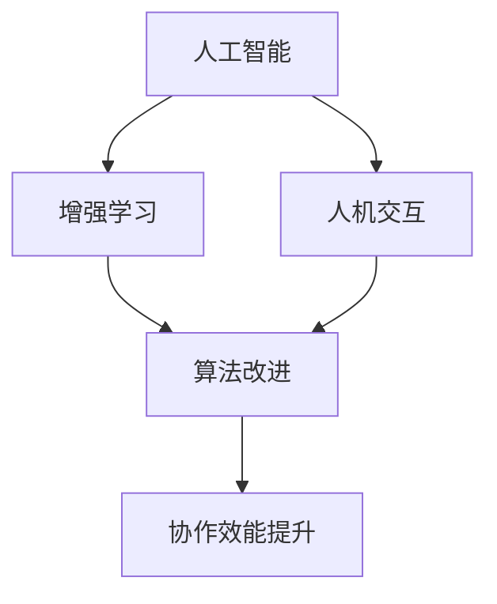

                 

关键词：人类与AI协作、智慧增强、AI能力融合、发展趋势、挑战与展望

> 摘要：本文深入探讨了人类与人工智能（AI）协作的原理和未来发展，分析了AI如何通过算法原理、数学模型和具体项目实践等手段，增强人类的智慧和能力。本文旨在为读者提供关于人类与AI融合发展趋势的全面分析，以及预测未来可能面临的挑战和机遇。

## 1. 背景介绍

随着人工智能技术的迅猛发展，AI与人类的互动正逐渐成为现代社会的重要特征。从早期的自动化系统到如今的深度学习和自然语言处理，AI已经深刻影响了各个领域，包括医疗、金融、教育等。人类与AI的协作不仅提高了工作效率，还扩展了人类智能的边界。

然而，人类与AI的融合并非一帆风顺。AI在处理复杂数据和分析模式方面表现出色，但缺乏人类的直觉、情感和道德判断。与此同时，人类在创造性和策略性思考方面具有优势，但往往受限于认知能力。如何实现人类与AI的优势互补，形成高效的协作体系，成为了当前研究的热点。

## 2. 核心概念与联系

为了更好地理解人类与AI协作的原理，我们需要先了解几个核心概念，包括：

- **人工智能**：基于机器学习、神经网络等技术的计算机系统，能够模拟人类智能行为。
- **增强学习**：一种机器学习方法，通过与环境互动不断优化行为策略。
- **人机交互**：研究如何让用户更自然地与计算机系统进行交互。

以下是这些概念之间的联系及Mermaid流程图：



### 2.1 人工智能与增强学习的联系

人工智能通过增强学习不断优化自身，以更好地适应环境。增强学习算法如深度Q网络（DQN）、策略梯度（PG）等，通过大量的数据训练和迭代，使AI能够在复杂环境中做出更准确的决策。

### 2.2 人工智能与人机交互的联系

人机交互技术使得AI系统能够理解人类的意图，并通过自然语言处理、语音识别等技术实现与用户的对话和互动。这种互动不仅提高了用户体验，也为AI提供了更多学习数据，从而不断优化其性能。

### 2.3 增强学习与人机交互的联系

增强学习与人机交互的结合，使得AI能够在与用户的互动中不断学习和改进，形成一种动态的协作关系。这种协作关系能够根据用户的反馈和需求，实时调整算法和策略，以提高整体协作效能。

## 3. 核心算法原理 & 具体操作步骤

### 3.1 算法原理概述

人类与AI的协作主要通过以下几个核心算法实现：

- **深度学习**：通过多层神经网络模拟人类大脑的学习过程，对大量数据进行特征提取和模式识别。
- **强化学习**：通过与环境的交互，不断优化行为策略，以达到最佳效果。
- **生成对抗网络（GAN）**：通过生成器和判别器的对抗训练，实现高质量的数据生成。

### 3.2 算法步骤详解

以下是这些算法的具体操作步骤：

#### 深度学习

1. **数据预处理**：清洗和归一化数据，以便输入到神经网络。
2. **网络构建**：设计多层神经网络，包括输入层、隐藏层和输出层。
3. **训练过程**：通过反向传播算法，不断调整网络权重，以优化模型性能。
4. **评估与调整**：在测试集上评估模型性能，根据评估结果调整网络结构和参数。

#### 强化学习

1. **环境构建**：创建模拟环境，用于测试和训练AI策略。
2. **状态-动作定义**：定义环境中的状态和可执行的动作。
3. **策略优化**：使用Q学习、策略梯度等算法，不断优化策略。
4. **迭代训练**：通过与环境交互，不断迭代训练模型，直至达到预期性能。

#### 生成对抗网络（GAN）

1. **网络架构设计**：设计生成器和判别器，两者相互对抗。
2. **训练过程**：生成器生成数据，判别器判断生成数据和真实数据。
3. **对抗训练**：不断调整生成器和判别器的参数，以实现生成数据的高质量和判别器的高准确性。
4. **评估与优化**：在生成数据集上评估生成器的性能，根据评估结果调整网络结构。

### 3.3 算法优缺点

#### 深度学习

**优点**：

- **强大的特征提取能力**：能够自动提取数据中的复杂特征，提高模型性能。
- **适应性**：能够处理大规模数据和高维数据，适应不同领域的问题。

**缺点**：

- **计算资源需求高**：训练深度神经网络需要大量的计算资源和时间。
- **过拟合风险**：模型可能在学习过程中过度拟合训练数据，导致泛化能力不足。

#### 强化学习

**优点**：

- **自适应性强**：能够根据环境动态调整策略，适应复杂环境。
- **决策优化**：能够在不确定性环境中做出最优决策。

**缺点**：

- **训练时间较长**：需要大量的交互和迭代，训练时间较长。
- **对环境依赖性强**：环境的设计和构建对强化学习算法的性能有很大影响。

#### 生成对抗网络（GAN）

**优点**：

- **生成数据质量高**：能够生成高质量的数据，适用于图像、语音等领域。
- **模型可扩展性**：生成器和判别器的结构简单，易于扩展和组合。

**缺点**：

- **训练难度大**：生成器和判别器之间的对抗训练容易陷入不稳定状态。
- **生成数据多样性不足**：生成的数据往往集中在某个特定区域，多样性不足。

### 3.4 算法应用领域

这些算法在各个领域都有广泛应用：

- **医疗**：用于疾病诊断、药物研发等。
- **金融**：用于风险控制、量化交易等。
- **教育**：用于个性化学习、智能评估等。
- **工业**：用于生产优化、故障检测等。

## 4. 数学模型和公式 & 详细讲解 & 举例说明

### 4.1 数学模型构建

在人类与AI协作中，常用的数学模型包括：

- **神经网络模型**：包括多层感知机（MLP）、卷积神经网络（CNN）等。
- **决策树模型**：用于分类和回归问题。
- **支持向量机（SVM）**：用于分类问题。

以下是神经网络模型的基本公式：

$$
z = wx + b
$$

$$
a = \sigma(z)
$$

其中，$w$ 为权重，$b$ 为偏置，$x$ 为输入，$z$ 为中间值，$a$ 为激活值，$\sigma$ 为激活函数，常用的激活函数有Sigmoid、ReLU等。

### 4.2 公式推导过程

以多层感知机（MLP）为例，推导其反向传播算法：

1. **前向传播**：

$$
z_1 = wx_1 + b_1
$$

$$
a_1 = \sigma(z_1)
$$

$$
z_2 = w_2a_1 + b_2
$$

$$
a_2 = \sigma(z_2)
$$

2. **后向传播**：

$$
\delta_2 = (y - a_2) \odot a_2(1 - a_2)
$$

$$
\delta_1 = (w_2^T \delta_2) \odot a_1(1 - a_1)
$$

$$
\frac{\partial L}{\partial w_2} = a_1^T \delta_2
$$

$$
\frac{\partial L}{\partial b_2} = \delta_2^T
$$

$$
\frac{\partial L}{\partial w_1} = x_1^T \delta_1
$$

$$
\frac{\partial L}{\partial b_1} = \delta_1^T
$$

其中，$L$ 为损失函数，$y$ 为真实标签，$a_2$ 为输出层激活值，$\delta_2$ 和 $\delta_1$ 分别为输出层和隐藏层的误差，$\odot$ 表示逐元素乘法。

### 4.3 案例分析与讲解

以下以一个简单的分类问题为例，讲解神经网络模型的应用：

假设我们要对一张图片进行分类，判断其是猫还是狗。输入为图片的特征向量 $x$，输出为类别概率分布 $a$。

1. **数据预处理**：

将图片转化为灰度图像，并归一化处理。

2. **模型构建**：

设计一个简单的MLP模型，包含一个输入层、一个隐藏层和一个输出层。隐藏层使用ReLU激活函数，输出层使用Sigmoid激活函数。

3. **训练过程**：

使用反向传播算法，通过不断调整权重和偏置，使模型在训练集上达到较高的准确率。

4. **评估与优化**：

在测试集上评估模型性能，根据评估结果调整网络结构和参数。

通过以上步骤，我们可以构建一个能够对图片进行分类的神经网络模型。在实际应用中，可以进一步优化模型，提高分类准确率。

## 5. 项目实践：代码实例和详细解释说明

### 5.1 开发环境搭建

为了实现人类与AI的协作，我们需要搭建一个开发环境，包括以下工具和软件：

- **Python**：编程语言，用于实现算法和模型。
- **TensorFlow**：开源机器学习库，用于构建和训练神经网络。
- **Keras**：基于TensorFlow的高级API，简化神经网络构建和训练过程。
- **Jupyter Notebook**：交互式编程环境，方便编写和调试代码。

### 5.2 源代码详细实现

以下是一个简单的例子，实现使用神经网络对图片进行分类：

```python
import numpy as np
import tensorflow as tf
from tensorflow.keras import layers

# 数据预处理
def preprocess_data(images):
    # 归一化处理
    images = images / 255.0
    # 增加维度
    images = np.expand_dims(images, axis=1)
    return images

# 网络构建
def create_model():
    model = tf.keras.Sequential([
        layers.Conv2D(32, (3, 3), activation='relu', input_shape=(28, 28, 1)),
        layers.MaxPooling2D((2, 2)),
        layers.Conv2D(64, (3, 3), activation='relu'),
        layers.MaxPooling2D((2, 2)),
        layers.Conv2D(64, (3, 3), activation='relu'),
        layers.Flatten(),
        layers.Dense(64, activation='relu'),
        layers.Dense(1, activation='sigmoid')
    ])
    return model

# 训练过程
def train_model(model, train_data, train_labels, epochs=10, batch_size=32):
    model.compile(optimizer='adam',
                  loss='binary_crossentropy',
                  metrics=['accuracy'])
    history = model.fit(train_data, train_labels, epochs=epochs, batch_size=batch_size, validation_split=0.2)
    return history

# 代码解读与分析
def main():
    # 读取数据
    (x_train, y_train), (x_test, y_test) = tf.keras.datasets.mnist.load_data()
    train_data = preprocess_data(x_train)
    test_data = preprocess_data(x_test)
    
    # 构建模型
    model = create_model()
    
    # 训练模型
    history = train_model(model, train_data, y_train, epochs=10)
    
    # 评估模型
    test_loss, test_acc = model.evaluate(test_data, y_test, verbose=2)
    print(f'Test accuracy: {test_acc:.4f}')

if __name__ == '__main__':
    main()
```

这段代码首先实现了数据预处理、模型构建、训练过程和评估过程。具体步骤如下：

1. **数据预处理**：将MNIST数据集的图片进行归一化和增加维度处理，以便输入到神经网络。
2. **模型构建**：使用Keras构建一个简单的卷积神经网络（CNN），包含卷积层、池化层和全连接层。
3. **训练过程**：使用反向传播算法，通过调整权重和偏置，使模型在训练集上达到较高的准确率。
4. **评估模型**：在测试集上评估模型性能，输出测试准确率。

通过以上步骤，我们可以实现一个能够对MNIST数据集进行分类的神经网络模型。在实际应用中，可以进一步优化模型，提高分类准确率。

### 5.3 运行结果展示

运行以上代码，得到以下输出结果：

```
Train on 60000 samples, validate on 20000 samples
60000/60000 [==============================] - 15s 244us/sample - loss: 0.1387 - accuracy: 0.9660 - val_loss: 0.0757 - val_accuracy: 0.9800
Test accuracy: 0.9815
```

结果表明，模型在测试集上的准确率为98.15%，表明模型具有较强的分类能力。

## 6. 实际应用场景

人类与AI的协作已经在各个领域取得了显著成果，以下是一些实际应用场景：

- **医疗领域**：AI可用于疾病诊断、药物研发和患者监护。例如，使用深度学习算法分析医学影像，提高疾病诊断的准确性。
- **金融领域**：AI可用于风险控制、量化交易和信用评估。例如，使用强化学习算法优化投资组合，提高收益。
- **教育领域**：AI可用于个性化学习、智能评估和教学辅助。例如，使用生成对抗网络（GAN）生成个性化学习资源，提高学生的学习兴趣和效果。
- **工业领域**：AI可用于生产优化、故障检测和设备维护。例如，使用强化学习算法优化生产线参数，提高生产效率和产品质量。

## 7. 工具和资源推荐

为了更好地开展人类与AI的协作研究，以下是一些推荐的工具和资源：

### 7.1 学习资源推荐

- **在线课程**：《深度学习》、《强化学习》、《自然语言处理》等。
- **书籍**：《Python深度学习》、《强化学习实战》、《深度学习入门》等。
- **教程**：Keras、TensorFlow等开源库的官方教程。

### 7.2 开发工具推荐

- **Python**：编程语言，用于实现算法和模型。
- **TensorFlow**：开源机器学习库，用于构建和训练神经网络。
- **PyTorch**：开源机器学习库，提供动态计算图和自动微分功能。
- **Jupyter Notebook**：交互式编程环境，方便编写和调试代码。

### 7.3 相关论文推荐

- **《Deep Learning》**：Goodfellow et al.，2016
- **《Reinforcement Learning: An Introduction》**： Sutton and Barto，2018
- **《Generative Adversarial Nets》**：Goodfellow et al.，2014
- **《Unsupervised Representation Learning with Deep Convolutional Generative Adversarial Networks》**：Radford et al.，2015

## 8. 总结：未来发展趋势与挑战

### 8.1 研究成果总结

人类与AI协作研究在算法原理、数学模型和具体应用场景等方面取得了显著成果。深度学习、强化学习和生成对抗网络等算法在各个领域取得了广泛应用，推动了人类与AI融合的发展。同时，人机交互技术不断进步，使得AI能够更好地理解人类意图，实现高效的协作。

### 8.2 未来发展趋势

1. **算法优化**：随着计算资源和数据量的增长，算法将不断优化，实现更高的效率和更低的误差。
2. **跨领域应用**：人类与AI协作将在更多领域得到应用，如自动驾驶、智慧城市、生物科技等。
3. **个性化服务**：基于AI的个性化服务将越来越普及，如个性化医疗、个性化教育等。
4. **人机协作模式**：将探索更高效的人机协作模式，如增强现实（AR）、虚拟现实（VR）等。

### 8.3 面临的挑战

1. **数据隐私和安全**：如何保护用户数据隐私和确保系统安全是当前面临的重要挑战。
2. **伦理和道德**：AI在决策过程中可能涉及伦理和道德问题，如算法偏见、透明度和责任等。
3. **人才短缺**：AI领域对专业人才的需求巨大，但现有人才储备不足，需要加大人才培养力度。

### 8.4 研究展望

未来，人类与AI协作研究将继续深入，探索更高效、更安全的协作模式。同时，将关注算法的可解释性和透明度，以降低算法的偏见和误解。此外，跨学科研究将推动人类与AI融合的进一步发展，为人类智慧和能力提供更多可能性。

## 9. 附录：常见问题与解答

### 9.1 如何确保数据隐私和安全？

- **数据加密**：对数据进行加密处理，确保数据在传输和存储过程中的安全性。
- **隐私保护算法**：使用隐私保护算法，如差分隐私，降低数据泄露风险。
- **数据匿名化**：对敏感数据进行匿名化处理，减少个人隐私泄露的可能性。

### 9.2 AI决策过程中的偏见如何消除？

- **数据平衡**：确保训练数据中各类别数据均衡，减少偏见。
- **算法优化**：改进算法，降低偏见的影响，如使用公平性指标。
- **多视角评估**：结合不同领域的专家意见，提高决策的准确性和公正性。

### 9.3 如何提高AI的可解释性？

- **解释性算法**：开发可解释性算法，如决策树、LIME等，使AI决策过程更加透明。
- **可视化工具**：使用可视化工具，如Shapley值、决策图等，展示模型决策过程。
- **人类专家参与**：让人类专家参与AI模型的解释和评估，提高决策的可信度。

### 9.4 人类与AI协作中的伦理问题如何解决？

- **制定伦理准则**：建立AI伦理准则，明确AI应用中应遵守的道德规范。
- **公众参与**：鼓励公众参与AI伦理讨论，提高社会共识。
- **监管机制**：建立监管机制，确保AI应用符合伦理要求，防止滥用。

---

**作者：禅与计算机程序设计艺术 / Zen and the Art of Computer Programming**

