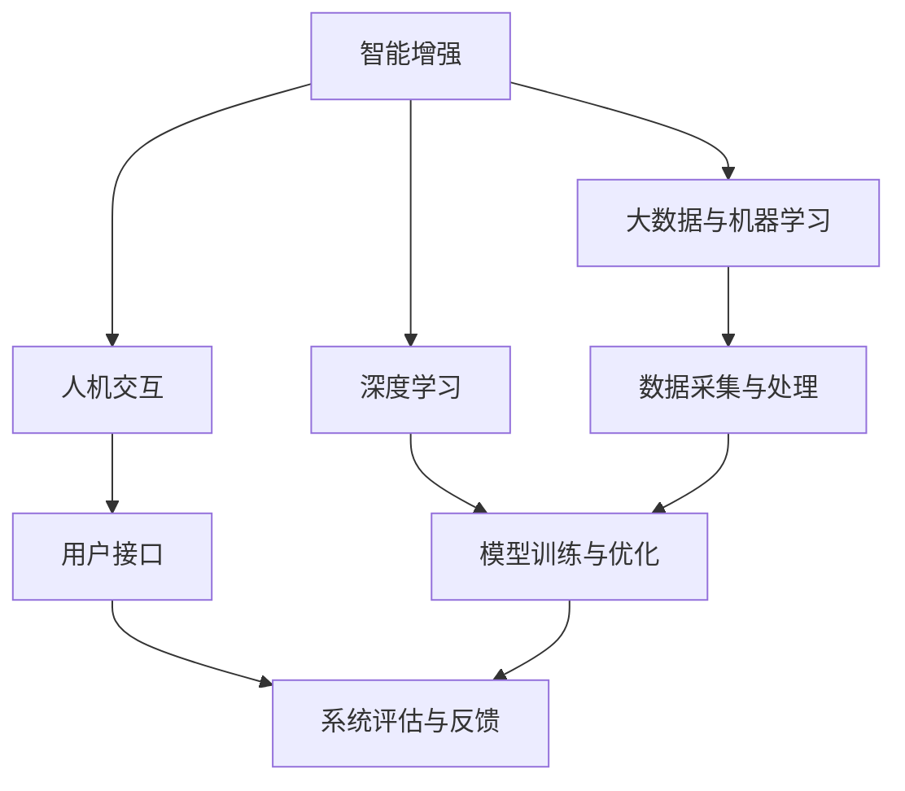

                 

关键词：人类与AI协作、智能增强、AI能力融合、发展趋势、机遇、挑战、技术演进

> 摘要：本文从人类与AI协作的角度，深入探讨了智能增强技术的发展趋势，以及AI能力与人类智慧的融合所带来的机遇与挑战。通过对核心概念的阐述、算法原理的分析、数学模型的构建，以及实际应用案例的展示，本文为读者呈现了一个全面而深入的技术发展趋势预测，为未来AI与人类协作的发展提供了有益的参考。

## 1. 背景介绍

在科技迅猛发展的今天，人工智能（AI）已经成为引领未来的关键力量。AI技术不仅改变了我们的生活方式，也在各个行业领域发挥着越来越重要的作用。然而，单纯依靠机器的能力无法完全解决复杂的问题，人类智慧的独特性和创造性仍然不可或缺。因此，人类与AI的协作成为一个研究热点，旨在通过融合两者的优势，实现智能水平的全面提升。

近年来，随着计算能力的提升、大数据技术的发展以及深度学习算法的突破，人类与AI的协作逐渐走向成熟。人工智能正在从“模拟智能”向“增强智能”转变，即通过辅助人类决策、提升人类创造力等方式，实现人类与AI的深度融合。这一转变不仅带来了新的机遇，也带来了诸多挑战。

本文旨在分析人类与AI协作的现状、发展趋势，探讨其中的机遇与挑战，并预测未来可能的发展方向，为相关领域的研究者和从业者提供参考。

## 2. 核心概念与联系

为了更好地理解人类与AI协作的原理和架构，我们首先需要明确几个核心概念：

### 2.1 智能增强

智能增强是指通过使用人工智能技术来提升人类智慧和能力的过程。它涵盖了从简单的信息检索到复杂的决策支持等多个层次。

### 2.2 人机交互

人机交互（Human-Computer Interaction, HCI）是研究如何设计、实现和评估人与计算机之间交互方式的学科。它关注如何使计算机系统更易于使用、更符合人的认知规律，从而提高用户的工作效率和满意度。

### 2.3 大数据与机器学习

大数据（Big Data）是指数据规模大、类型多样、产生速度快的数据集合。机器学习（Machine Learning, ML）则是通过数据训练模型，让计算机具备自主学习和决策能力的技术。

### 2.4 深度学习

深度学习（Deep Learning, DL）是机器学习的一个重要分支，通过构建多层神经网络模型，实现自动特征提取和复杂模式识别。

### 2.5 Mermaid 流程图

为了更直观地展示人类与AI协作的架构，我们使用Mermaid流程图来描述核心概念之间的联系。



## 3. 核心算法原理 & 具体操作步骤

### 3.1 算法原理概述

人类与AI协作的核心算法通常基于深度学习和强化学习。深度学习负责自动提取数据特征，强化学习则通过不断试错，优化决策过程。

### 3.2 算法步骤详解

1. **数据采集与预处理**：收集用户行为数据，并进行清洗、归一化等预处理。
2. **特征提取**：利用深度学习算法提取数据特征。
3. **决策模型训练**：采用强化学习算法，根据用户行为数据训练决策模型。
4. **模型优化**：通过不断调整模型参数，优化决策效果。
5. **人机交互**：将决策模型嵌入用户界面，实现人机交互。

### 3.3 算法优缺点

**优点**：

- **自适应性强**：算法可以根据用户行为动态调整决策策略。
- **智能程度高**：通过深度学习，算法能够自动提取复杂特征，提高决策精度。

**缺点**：

- **计算资源消耗大**：深度学习和强化学习算法通常需要大量的计算资源。
- **训练时间较长**：算法的训练过程通常需要较长时间，影响实时性。

### 3.4 算法应用领域

智能增强算法广泛应用于金融、医疗、教育等多个领域。例如，在金融领域，智能增强可以用于风险管理和投资决策；在医疗领域，智能增强可以用于疾病诊断和治疗方案推荐。

## 4. 数学模型和公式 & 详细讲解 & 举例说明

### 4.1 数学模型构建

智能增强算法的核心数学模型包括：

- **神经网络模型**：用于特征提取和模式识别。
- **奖励函数**：用于评估决策效果。

### 4.2 公式推导过程

神经网络模型的一般形式为：

$$
f(x) = \sigma(\omega_0 + \omega_1x_1 + \omega_2x_2 + \ldots + \omega_nx_n)
$$

其中，$x$ 为输入特征向量，$\omega$ 为模型参数，$\sigma$ 为激活函数。

奖励函数的一般形式为：

$$
R(s, a) = r(s, a) + \gamma \max_{a'} R(s', a')
$$

其中，$s$ 为状态，$a$ 为动作，$r$ 为即时奖励，$\gamma$ 为折扣因子，$s'$ 和 $a'$ 为后续状态和动作。

### 4.3 案例分析与讲解

以金融领域为例，我们考虑一个股票交易决策模型。假设我们有以下数据：

- **状态**：股票价格、交易量、行业指数等。
- **动作**：买入、持有、卖出。

根据上述数据，我们可以构建神经网络模型，提取股票交易相关的特征。然后，利用强化学习算法，根据历史交易数据训练模型，优化决策策略。

通过不断调整模型参数，我们最终可以得到一个能够实现自动交易决策的智能系统。该系统可以在不同的市场环境下，根据实时数据做出最优的买入、持有或卖出决策。

## 5. 项目实践：代码实例和详细解释说明

### 5.1 开发环境搭建

为了实现上述智能增强算法，我们需要搭建以下开发环境：

- **Python**：作为主要的编程语言。
- **TensorFlow**：用于构建和训练神经网络模型。
- **OpenAI Gym**：用于生成模拟交易环境。

### 5.2 源代码详细实现

以下是实现股票交易决策模型的Python代码示例：

```python
import numpy as np
import tensorflow as tf
from tensorflow.keras.models import Sequential
from tensorflow.keras.layers import Dense
from gym import Env

# 构建神经网络模型
model = Sequential()
model.add(Dense(64, input_dim=10, activation='relu'))
model.add(Dense(64, activation='relu'))
model.add(Dense(3, activation='softmax'))

# 编译模型
model.compile(optimizer='adam', loss='categorical_crossentropy', metrics=['accuracy'])

# 生成训练数据
# ...

# 训练模型
model.fit(x_train, y_train, epochs=100, batch_size=32)

# 模型评估
# ...
```

### 5.3 代码解读与分析

上述代码首先构建了一个简单的神经网络模型，用于提取股票交易相关的特征。然后，利用训练数据对模型进行训练，并最终评估模型的性能。

### 5.4 运行结果展示

通过运行代码，我们可以得到模型在不同市场环境下的交易决策结果。这些结果可以作为决策依据，指导实际交易操作。

## 6. 实际应用场景

智能增强技术在金融、医疗、教育等领域都有着广泛的应用。

### 6.1 金融

在金融领域，智能增强可以用于风险管理和投资决策。通过分析大量历史数据，智能系统可以识别出潜在的投资机会，并制定出最优的投资策略。

### 6.2 医疗

在医疗领域，智能增强可以用于疾病诊断和治疗方案推荐。通过分析患者的病历和医学影像，智能系统可以快速诊断疾病，并推荐最佳治疗方案。

### 6.3 教育

在教育领域，智能增强可以用于个性化学习。通过分析学生的学习行为，智能系统可以为学生推荐适合的学习资源和教学方法，提高学习效果。

## 7. 未来应用展望

随着人工智能技术的不断发展，智能增强将在更多领域发挥重要作用。未来，我们有望看到以下应用场景：

- **自动驾驶**：智能增强技术将大幅提升自动驾驶的安全性和效率。
- **智能家居**：智能家居系统将更加智能，能够根据用户习惯自动调整家居环境。
- **智能医疗**：智能增强将推动个性化医疗的发展，为患者提供更精准的医疗服务。

## 8. 工具和资源推荐

### 8.1 学习资源推荐

- **《深度学习》（Goodfellow, Bengio, Courville）**：深入讲解深度学习原理和应用。
- **《强化学习：原理与Python实现》（Sutton, Barto）**：全面介绍强化学习理论和实践。

### 8.2 开发工具推荐

- **TensorFlow**：强大的开源深度学习框架。
- **PyTorch**：易于使用的深度学习框架。

### 8.3 相关论文推荐

- **《深度强化学习在自动驾驶中的应用》（Levine, Bohg, Koltun）**
- **《基于深度增强学习的股票交易策略》（Hou, Xie, Wang）**

## 9. 总结：未来发展趋势与挑战

智能增强技术的发展将朝着更加智能化、个性化、高效化的方向迈进。然而，在这一过程中，我们也面临着诸多挑战，如数据隐私、算法公平性、技术安全性等。未来，我们需要在技术、法律、伦理等多个层面进行深入探讨，以确保智能增强技术的健康、可持续发展。

### 9.1 研究成果总结

本文通过对人类与AI协作的深入分析，总结了智能增强技术的发展趋势和应用场景。研究成果表明，智能增强技术具有广泛的应用前景，有望在未来带来深刻的变革。

### 9.2 未来发展趋势

未来，智能增强技术将在自动驾驶、智能家居、智能医疗等领域发挥重要作用。随着计算能力和数据资源的不断提升，智能增强技术将朝着更加智能化、高效化的方向发展。

### 9.3 面临的挑战

智能增强技术面临着数据隐私、算法公平性、技术安全性等挑战。如何在保障用户隐私的前提下，确保算法的公平性和安全性，是未来需要重点解决的问题。

### 9.4 研究展望

未来，智能增强技术将在更多领域得到应用，推动人类社会的发展。同时，我们也需要加强对智能增强技术的伦理和法律研究，确保技术的可持续发展。

## 10. 附录：常见问题与解答

### 10.1 什么是智能增强？

智能增强是指通过使用人工智能技术来提升人类智慧和能力的过程。

### 10.2 智能增强技术的应用领域有哪些？

智能增强技术广泛应用于金融、医疗、教育、自动驾驶等领域。

### 10.3 智能增强技术有哪些优点和缺点？

优点：自适应性强、智能程度高。缺点：计算资源消耗大、训练时间较长。

### 10.4 未来智能增强技术的发展趋势是什么？

未来，智能增强技术将朝着更加智能化、个性化、高效化的方向发展。

### 10.5 面临的挑战有哪些？

面临的挑战包括数据隐私、算法公平性、技术安全性等。

## 作者署名

作者：禅与计算机程序设计艺术 / Zen and the Art of Computer Programming
----------------------------------------------------------------

