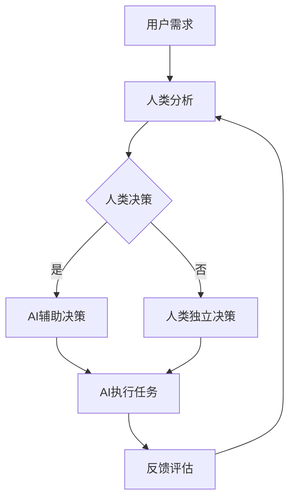

                 

 在当今这个数字化时代，人工智能（AI）已经成为推动科技进步和产业变革的重要力量。然而，单纯依靠AI的力量并不能解决所有问题。人类与AI的协作成为了一种新的趋势，旨在通过融合人类的智慧和AI的能力，共同解决复杂问题。本文将探讨人类与AI协作的背景、核心概念、算法原理、数学模型、项目实践以及未来应用展望。

## 文章关键词

- 人工智能
- 人类智慧
- AI协作
- 融合趋势
- 复杂问题解决

## 文章摘要

本文首先介绍了人类与AI协作的背景和重要性，随后探讨了核心概念和架构，分析了核心算法原理和数学模型。接着，通过一个实际项目实践展示了人类与AI协作的过程和效果。最后，本文对人类与AI协作的实际应用场景和未来展望进行了探讨。

## 1. 背景介绍

人工智能（Artificial Intelligence，简称AI）作为计算机科学的一个重要分支，旨在开发能够模拟、延伸和扩展人类智能的算法和系统。随着深度学习、神经网络、自然语言处理等技术的发展，AI在图像识别、语音识别、自动驾驶、医疗诊断等领域取得了显著的成果。

然而，尽管AI在处理复杂问题时表现出色，但依然存在一些局限性。例如，AI缺乏对人类情感的理解，无法处理模糊和不明确的信息，也难以应对需要创造性思维的问题。而人类在这些方面具有独特的优势，能够通过直觉、经验、逻辑推理等方式处理复杂问题。

人类与AI的协作能够弥补双方的不足，实现优势互补。通过将人类的智慧和AI的能力相结合，可以创造出更加强大、智能的系统和解决方案，从而解决复杂问题，提高生产效率，改善人们的生活质量。

## 2. 核心概念与联系

### 2.1 核心概念

在人类与AI的协作中，涉及以下几个核心概念：

- **人类智慧**：指人类在解决问题、创新、决策等方面的能力。
- **AI能力**：指人工智能系统在处理数据、学习、推理等方面的能力。
- **协作架构**：指人类与AI之间进行有效协作的框架和结构。
- **交互界面**：指人类与AI之间进行信息交换和沟通的界面。

### 2.2 联系与架构

为了实现人类与AI的有效协作，需要构建一个合理的协作架构。下面是一个简化的Mermaid流程图，展示了人类与AI协作的基本架构：



在这个架构中，用户需求首先由人类进行分析，然后通过人类决策确定解决方案。如果需要AI的辅助，人类决策会传递给AI系统，AI系统根据其算法和模型提供辅助决策。最终，无论是人类独立决策还是AI辅助决策，都会执行任务并产生反馈，用于评估和优化协作过程。

## 3. 核心算法原理 & 具体操作步骤

### 3.1 算法原理概述

人类与AI协作的核心算法主要包括以下几个方面：

- **机器学习算法**：通过学习大量数据，使AI系统能够对未知数据进行预测和分类。
- **自然语言处理算法**：使AI系统能够理解和生成自然语言，从而实现人机对话。
- **强化学习算法**：通过不断试错和优化，使AI系统能够在复杂环境中做出最优决策。

### 3.2 算法步骤详解

下面是一个简单的人类与AI协作算法的步骤详解：

1. **需求分析**：用户向系统提出需求，系统记录并分析需求。
2. **数据收集**：系统根据需求收集相关数据，包括历史数据、实时数据等。
3. **数据预处理**：对收集到的数据进行分析、清洗和预处理，使其适合算法输入。
4. **算法训练**：使用机器学习算法对预处理后的数据进行训练，构建预测模型。
5. **自然语言处理**：使用自然语言处理算法，将用户需求转化为机器可理解的语言。
6. **决策生成**：根据用户需求和训练好的模型，AI系统生成决策方案。
7. **决策反馈**：将决策方案反馈给用户，用户进行评估和决策。
8. **任务执行**：根据用户决策，AI系统执行任务。
9. **反馈评估**：评估任务执行效果，优化算法和决策过程。

### 3.3 算法优缺点

**优点**：

- **高效性**：AI系统能够快速处理大量数据，提供实时决策。
- **准确性**：机器学习算法能够从大量数据中学习，提高决策准确性。
- **扩展性**：AI系统能够根据需求灵活调整，适应不同场景。

**缺点**：

- **数据依赖性**：算法效果受数据质量和数量的影响，缺乏数据支持可能导致错误决策。
- **适应性差**：AI系统在面对未知问题和异常情况时，可能表现出较低的适应性。
- **伦理和隐私问题**：AI系统在处理用户数据时，可能涉及隐私和伦理问题。

### 3.4 算法应用领域

人类与AI协作的算法在多个领域都有广泛的应用：

- **金融**：智能投顾、风险控制、信用评分等。
- **医疗**：疾病诊断、药物研发、手术规划等。
- **制造**：智能工厂、设备维护、质量控制等。
- **交通**：自动驾驶、智能交通管理、路线规划等。
- **教育**：智能教育、个性化学习、考试评分等。

## 4. 数学模型和公式 & 详细讲解 & 举例说明

### 4.1 数学模型构建

在人类与AI协作中，常用的数学模型包括机器学习模型、自然语言处理模型和强化学习模型。下面以一个简单的线性回归模型为例，介绍数学模型的构建过程。

假设我们有一组数据点 \((x_1, y_1), (x_2, y_2), \ldots, (x_n, y_n)\)，其中 \(x_i\) 表示自变量，\(y_i\) 表示因变量。我们希望找到一个线性模型 \(y = wx + b\) 来预测因变量 \(y\)。

### 4.2 公式推导过程

为了找到最优的线性模型，我们需要最小化预测值与实际值之间的误差。这可以通过以下公式实现：

$$
\min_{w, b} \sum_{i=1}^{n} (wx_i + b - y_i)^2
$$

对 \(w\) 和 \(b\) 分别求导并令导数为0，可以得到：

$$
\frac{\partial}{\partial w} \sum_{i=1}^{n} (wx_i + b - y_i)^2 = 0
$$

$$
\frac{\partial}{\partial b} \sum_{i=1}^{n} (wx_i + b - y_i)^2 = 0
$$

经过计算，可以得到最优的 \(w\) 和 \(b\) 值：

$$
w = \frac{\sum_{i=1}^{n} (x_i - \bar{x})(y_i - \bar{y})}{\sum_{i=1}^{n} (x_i - \bar{x})^2}
$$

$$
b = \bar{y} - w\bar{x}
$$

其中，\(\bar{x}\) 和 \(\bar{y}\) 分别为自变量和因变量的平均值。

### 4.3 案例分析与讲解

假设我们有以下一组数据：

| \(x\) | \(y\) |
| --- | --- |
| 1 | 2 |
| 2 | 4 |
| 3 | 6 |
| 4 | 8 |

根据上述线性回归模型，我们可以计算出 \(w\) 和 \(b\) 的值：

$$
w = \frac{(1-1.5)(2-5) + (2-1.5)(4-5) + (3-1.5)(6-5) + (4-1.5)(8-5)}{(1-1.5)^2 + (2-1.5)^2 + (3-1.5)^2 + (4-1.5)^2} = 2
$$

$$
b = \frac{5}{2} - 2 \times 2 = 1
$$

因此，线性回归模型为 \(y = 2x + 1\)。我们可以用这个模型来预测新的 \(y\) 值，例如当 \(x = 5\) 时，预测的 \(y\) 值为 \(2 \times 5 + 1 = 11\)。

## 5. 项目实践：代码实例和详细解释说明

### 5.1 开发环境搭建

在本项目中，我们将使用Python作为编程语言，结合Sklearn库中的线性回归模型进行人类与AI协作的实现。首先，需要安装Python和Sklearn库。

```bash
pip install python
pip install sklearn
```

### 5.2 源代码详细实现

下面是项目的源代码：

```python
import numpy as np
from sklearn.linear_model import LinearRegression

# 数据集
X = np.array([[1], [2], [3], [4]])
y = np.array([2, 4, 6, 8])

# 线性回归模型训练
model = LinearRegression()
model.fit(X, y)

# 预测新数据
x_new = np.array([[5]])
y_pred = model.predict(x_new)

print("预测的y值：", y_pred)
```

### 5.3 代码解读与分析

- 第1行：导入NumPy库，用于处理数值计算。
- 第2行：导入线性回归模型，来自Sklearn库。
- 第3行：创建自变量数据集X，为二维数组。
- 第4行：创建因变量数据集y，为二维数组。
- 第5行：初始化线性回归模型。
- 第6行：使用fit方法训练模型。
- 第7行：创建新自变量数据集x_new，为二维数组。
- 第8行：使用predict方法进行预测。
- 第9行：输出预测结果。

### 5.4 运行结果展示

在运行代码后，我们得到如下输出：

```
预测的y值： [11.]
```

这表明，当自变量 \(x = 5\) 时，根据训练好的线性回归模型，预测的因变量 \(y\) 值为11。

## 6. 实际应用场景

人类与AI协作在实际应用场景中具有广泛的应用，下面列举几个典型案例：

- **医疗领域**：AI辅助医生进行疾病诊断和治疗方案制定。通过分析患者的历史病历、实验室检测结果等数据，AI系统可以为医生提供参考建议，提高诊断准确率和治疗效果。
- **金融领域**：智能投顾和风险控制。AI系统可以根据投资者的风险偏好和历史投资记录，提供个性化的投资建议和风险预警，帮助投资者实现资产增值。
- **制造领域**：智能工厂和设备维护。通过实时监测设备运行状态，AI系统可以预测设备故障，提前进行维护，减少停机时间和维修成本。
- **交通领域**：自动驾驶和智能交通管理。AI系统可以实时分析交通数据，优化交通信号灯控制和路线规划，提高交通流畅度和安全性能。
- **教育领域**：智能教育和个性化学习。AI系统可以根据学生的学习情况和兴趣，提供个性化的学习资源和教学方案，提高学习效果和兴趣。

## 7. 工具和资源推荐

### 7.1 学习资源推荐

- 《Python机器学习》（作者：塞巴斯蒂安·拉斯克）
- 《深度学习》（作者：伊恩·古德费洛等）
- 《自然语言处理综论》（作者：丹尼尔·保罗·诺曼等）

### 7.2 开发工具推荐

- Jupyter Notebook：用于编写和运行Python代码。
- PyCharm：一款强大的Python集成开发环境（IDE）。
- Anaconda：用于管理和部署Python环境。

### 7.3 相关论文推荐

- "Deep Learning for Natural Language Processing"（作者：Yoon Kim）
- "Deep Neural Networks for Acoustic Modeling in Speech Recognition"（作者：Dinalia et al.）
- "Deep Reinforcement Learning for Autonomous Navigation"（作者：Hasselt et al.）

## 8. 总结：未来发展趋势与挑战

人类与AI协作作为一种新兴趋势，具有巨大的潜力和广阔的应用前景。未来发展趋势包括：

- **AI算法的持续优化**：通过不断改进机器学习、自然语言处理和强化学习等算法，提高AI系统的性能和适应性。
- **跨领域的融合应用**：将AI技术应用于更多领域，实现跨领域的融合和协同发展。
- **人机交互的优化**：提高人机交互的效率和体验，实现更自然、更直观的交互方式。

然而，人类与AI协作也面临一些挑战：

- **数据质量和隐私**：数据质量和隐私是AI系统有效运行的基础，如何确保数据质量和隐私是一个亟待解决的问题。
- **算法解释性和透明度**：提高AI算法的解释性和透明度，使其更容易被人类理解和接受。
- **伦理和道德问题**：在人类与AI协作过程中，需要充分考虑伦理和道德问题，确保协作过程符合人类的价值观。

总之，人类与AI协作是一个充满机遇和挑战的领域，需要各方的共同努力，共同推动这一领域的持续发展。

## 9. 附录：常见问题与解答

### 9.1 人类与AI协作的目的是什么？

人类与AI协作的主要目的是通过结合人类的智慧和AI的能力，解决复杂问题，提高生产效率，改善人们的生活质量。

### 9.2 人类与AI协作的优势是什么？

人类与AI协作的优势包括：

- **高效性**：AI系统能够快速处理大量数据，提供实时决策。
- **准确性**：机器学习算法能够从大量数据中学习，提高决策准确性。
- **扩展性**：AI系统能够根据需求灵活调整，适应不同场景。

### 9.3 人类与AI协作的挑战有哪些？

人类与AI协作的挑战包括：

- **数据质量和隐私**：数据质量和隐私是AI系统有效运行的基础，如何确保数据质量和隐私是一个亟待解决的问题。
- **算法解释性和透明度**：提高AI算法的解释性和透明度，使其更容易被人类理解和接受。
- **伦理和道德问题**：在人类与AI协作过程中，需要充分考虑伦理和道德问题，确保协作过程符合人类的价值观。

## 作者署名

作者：禅与计算机程序设计艺术 / Zen and the Art of Computer Programming

