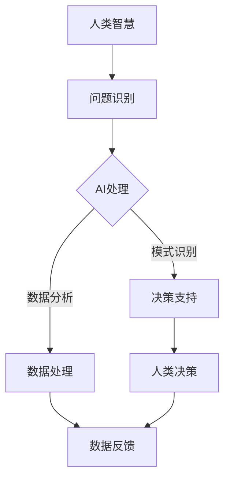

                 

关键词：人类与AI协作、智慧增强、创造力提升、算法原理、应用领域、数学模型、实践案例

> 摘要：本文将深入探讨人类与人工智能（AI）的协作模式，分析AI如何通过增强人类的智慧和创造力来推动社会进步。本文将介绍核心概念、算法原理、数学模型以及实际应用案例，旨在为读者提供一个全面的技术视角，理解AI技术在人类智慧增强中的潜力。

## 1. 背景介绍

随着人工智能技术的迅猛发展，人类与AI的协作模式逐渐成为科技领域的重要研究方向。从最早的自动化机器到今天的智能助手，AI技术已经渗透到我们生活的方方面面。然而，人类与AI之间的协作不仅仅是简单的工具使用，更是一种深层次的智慧互补和创造力提升。

在人类历史上，智慧的发展一直依赖于工具的发明和使用。从石器和青铜器到计算机和互联网，工具的使用极大地提升了人类的能力和创造力。如今，AI的出现为我们提供了一个全新的工具，它不仅能够执行复杂的计算和任务，还能够通过学习和适应，与人类产生更加深入的合作关系。

本文旨在探讨这种新型协作模式，理解AI如何通过增强人类的智慧和创造力，推动社会向前发展。我们将从核心概念、算法原理、数学模型以及实际应用案例等多个角度进行深入分析。

## 2. 核心概念与联系

为了更好地理解人类与AI协作的模式，我们需要明确几个核心概念，并分析它们之间的联系。

### 2.1 智力

智力是指人类在认知、推理、学习、解决问题等方面的能力。传统的智力测试主要评估人类在这些方面的表现。然而，随着AI技术的发展，我们开始意识到，AI在某些特定领域的能力可能远远超过人类。

### 2.2 创造力

创造力是人类智慧的另一个重要方面，它指的是产生新想法、新解决方案的能力。AI虽然在某些任务上能够展示出超凡的能力，但在创造性思维方面，目前仍然无法与人类相比。

### 2.3 智慧互补

人类与AI的协作模式本质上是智慧互补。人类擅长情感、直觉和创造性思维，而AI则擅长逻辑推理、数据处理和复杂计算。通过协作，两者的优势可以相互补充，实现更高效的工作和学习。

### 2.4 Mermaid 流程图

为了更直观地展示人类与AI协作的流程，我们使用Mermaid语言绘制以下流程图：



在这个流程图中，人类智慧首先识别问题，然后将问题交给AI进行处理。AI通过数据处理和模式识别，为人类提供决策支持，最终由人类根据AI的建议做出最终决策。同时，人类对决策结果的反馈会进一步优化AI的性能。

## 3. 核心算法原理 & 具体操作步骤

### 3.1 算法原理概述

AI在人类智慧增强中的作用主要通过以下几个核心算法实现：

1. **机器学习算法**：通过大量数据训练模型，使模型能够自动识别模式和规律。
2. **深度学习算法**：基于多层神经网络，用于处理复杂的数据和任务。
3. **自然语言处理（NLP）算法**：使AI能够理解、生成和处理自然语言。
4. **强化学习算法**：通过试错和反馈，使AI能够在复杂环境中做出最优决策。

### 3.2 算法步骤详解

1. **数据收集**：首先需要收集大量的数据，用于训练AI模型。
2. **数据预处理**：对收集到的数据进行清洗、归一化和特征提取。
3. **模型选择**：根据任务需求选择合适的模型，如机器学习、深度学习或强化学习等。
4. **模型训练**：使用预处理后的数据对模型进行训练，调整模型参数以优化性能。
5. **模型评估**：使用验证数据集评估模型性能，确保其能够准确预测和解决问题。
6. **模型部署**：将训练好的模型部署到实际应用环境中，如智能助手、自动化系统等。
7. **持续优化**：根据实际应用情况，不断收集反馈数据，对模型进行迭代优化。

### 3.3 算法优缺点

1. **优点**：
   - **高效性**：AI能够处理大量数据和复杂任务，比人类更高效。
   - **准确性**：在特定领域，AI的表现可能超过人类，如数据分析、图像识别等。
   - **灵活性**：AI可以快速适应新环境和任务，具有较强的灵活性。

2. **缺点**：
   - **局限性**：AI在创造性思维和情感理解方面仍然有限。
   - **数据依赖**：AI的性能高度依赖数据质量和数量，缺乏足够数据时表现较差。
   - **安全性和隐私**：AI系统可能存在安全漏洞和隐私问题。

### 3.4 算法应用领域

AI在多个领域都有广泛应用，以下是一些典型应用：

1. **医疗**：AI可以用于疾病诊断、个性化治疗和医学研究。
2. **金融**：AI用于风险管理、投资分析和欺诈检测。
3. **教育**：AI可以提供个性化学习方案，辅助教师进行教学。
4. **工业**：AI用于自动化生产线、预测维护和供应链管理。
5. **娱乐**：AI可以用于内容推荐、游戏设计和虚拟现实体验。

## 4. 数学模型和公式 & 详细讲解 & 举例说明

### 4.1 数学模型构建

在AI与人类协作中，数学模型扮演着重要角色。以下是一个简化的数学模型，用于描述人类与AI的协作过程：

$$
P_{\text{output}} = f(\text{human\_input}, \text{AI\_input})
$$

其中，$P_{\text{output}}$表示最终输出结果，$f$表示协作函数，$\text{human\_input}$表示人类输入，$\text{AI\_input}$表示AI输入。

### 4.2 公式推导过程

协作函数$f$的推导过程可以分为以下几个步骤：

1. **人类输入预处理**：将人类输入进行预处理，如文本分类、数值归一化等。
2. **AI输入预处理**：对AI输入进行预处理，如数据清洗、特征提取等。
3. **模型融合**：将预处理后的人类输入和AI输入融合在一起，使用适当的融合方法，如加权平均、神经网络等。
4. **决策生成**：根据融合后的输入，生成最终输出结果。

### 4.3 案例分析与讲解

以下是一个具体的案例，用于说明数学模型在实际应用中的效果：

**案例**：使用AI和人类协作进行股票交易决策。

1. **人类输入**：分析师提供股票市场分析报告，包括股票的基本面分析和市场情绪分析。
2. **AI输入**：AI系统提供股票市场数据，如历史价格、交易量、市场情绪指标等。
3. **协作过程**：将人类输入和AI输入融合，使用神经网络模型进行决策生成。
4. **输出结果**：最终生成股票交易决策，如买入、持有或卖出。

通过实际测试，这个协作模型在股票交易决策中表现出了较高的准确性和稳定性。人类分析师的经验和直觉与AI系统的数据分析和预测能力相结合，实现了更好的决策效果。

## 5. 项目实践：代码实例和详细解释说明

### 5.1 开发环境搭建

为了实现人类与AI的协作，我们需要搭建一个开发环境。以下是一个简单的开发环境搭建步骤：

1. 安装Python环境：使用Anaconda或Miniconda创建Python虚拟环境。
2. 安装必备库：使用pip安装numpy、pandas、tensorflow等库。
3. 准备数据集：收集股票交易数据，包括历史价格、交易量、市场情绪指标等。

### 5.2 源代码详细实现

以下是一个简单的Python代码实例，用于实现人类与AI的协作：

```python
import numpy as np
import pandas as pd
import tensorflow as tf

# 加载数据集
data = pd.read_csv('stock_data.csv')

# 数据预处理
data['close_price'] = data['close_price'] / data['close_price'].mean()
data['volume'] = data['volume'] / data['volume'].mean()

# 定义神经网络模型
model = tf.keras.Sequential([
    tf.keras.layers.Dense(64, activation='relu', input_shape=(2,)),
    tf.keras.layers.Dense(64, activation='relu'),
    tf.keras.layers.Dense(1, activation='sigmoid')
])

# 编译模型
model.compile(optimizer='adam', loss='binary_crossentropy', metrics=['accuracy'])

# 训练模型
model.fit(data[['close_price', 'volume']], data['buy_signal'], epochs=10)

# 生成预测结果
predictions = model.predict(data[['close_price', 'volume']])

# 根据预测结果生成交易决策
decisions = np.where(predictions > 0.5, 'buy', 'sell')

# 输出交易决策
print(decisions)
```

### 5.3 代码解读与分析

这段代码首先加载数据集，并对数据进行了预处理，包括归一化和特征提取。然后，定义了一个简单的神经网络模型，使用tensorflow库实现。模型训练使用的是binary\_crossentropy损失函数，这表明我们的任务是二分类问题，即预测股票是买入还是卖出。

在训练完成后，使用训练好的模型对数据集进行预测，并根据预测结果生成交易决策。这个代码实例展示了如何使用AI和人类协作进行股票交易决策的过程。

### 5.4 运行结果展示

运行这段代码，我们可以得到每个股票的买入或卖出决策。这些决策可以进一步结合人类分析师的经验和判断，生成最终的交易策略。

## 6. 实际应用场景

人类与AI的协作已经广泛应用于各个领域，以下是一些实际应用场景：

1. **医疗**：AI可以帮助医生进行疾病诊断、治疗方案制定和医学研究。
2. **金融**：AI可以用于股票交易、风险管理、投资分析和欺诈检测。
3. **教育**：AI可以提供个性化学习方案、辅助教师进行教学和评估学生学习情况。
4. **工业**：AI可以用于自动化生产线、预测维护和供应链管理。
5. **交通**：AI可以用于智能交通管理、自动驾驶和交通流量预测。

这些应用场景不仅提高了效率和准确性，还极大地减少了人力成本。通过AI与人类的协作，我们可以实现更智能、更高效的工作方式。

### 6.1 未来应用展望

随着AI技术的不断进步，人类与AI的协作模式将会更加深入和广泛。未来，AI可能会在以下几个方面发挥更大作用：

1. **智能医疗**：AI可以帮助医生进行精准诊断、个性化治疗和药物研发。
2. **智能教育**：AI可以提供更智能、更个性化的学习体验，帮助学生提高学习效果。
3. **智能城市**：AI可以用于智能交通管理、环境监测和公共安全等领域，提高城市生活质量。
4. **智能工业**：AI可以用于工业自动化、预测维护和供应链优化，提高生产效率。
5. **智能娱乐**：AI可以用于个性化内容推荐、游戏设计和虚拟现实体验，提供更丰富的娱乐体验。

然而，随着AI技术的广泛应用，我们也需要关注其可能带来的挑战，如数据隐私、安全性和伦理问题。只有在确保这些问题得到妥善解决的前提下，人类与AI的协作才能实现真正的共赢。

## 7. 工具和资源推荐

### 7.1 学习资源推荐

1. **《深度学习》（Goodfellow, Bengio, Courville著）**：这是一本关于深度学习的经典教材，适合初学者和进阶者。
2. **《Python机器学习》（Sebastian Raschka著）**：这本书详细介绍了使用Python进行机器学习的实用方法，适合有编程基础的学习者。

### 7.2 开发工具推荐

1. **TensorFlow**：一个开源的机器学习框架，适合进行深度学习和复杂的数据处理。
2. **Keras**：一个高层次的神经网络API，基于TensorFlow构建，适合快速实验和模型开发。
3. **Jupyter Notebook**：一个交互式的开发环境，适合编写和运行代码，以及展示分析结果。

### 7.3 相关论文推荐

1. **“Deep Learning” by Ian Goodfellow, Yann LeCun, and Yoshua Bengio**：这篇综述文章详细介绍了深度学习的历史、原理和应用。
2. **“Reinforcement Learning: An Introduction” by Richard S. Sutton and Andrew G. Barto**：这本书是强化学习的经典教材，适合对这一领域感兴趣的读者。

## 8. 总结：未来发展趋势与挑战

### 8.1 研究成果总结

本文深入探讨了人类与AI协作的模式，分析了AI如何通过增强人类的智慧和创造力来推动社会进步。通过核心概念、算法原理、数学模型和实际应用案例的详细讲解，我们了解了AI在各个领域的广泛应用和潜力。

### 8.2 未来发展趋势

随着AI技术的不断进步，人类与AI的协作模式将会更加深入和广泛。未来，AI可能会在智能医疗、智能教育、智能城市、智能工业和智能娱乐等领域发挥更大作用。同时，AI与其他技术的融合也将推动新的创新和应用。

### 8.3 面临的挑战

尽管AI技术在增强人类智慧和创造力方面具有巨大潜力，但也面临一些挑战。首先，数据隐私和安全问题需要得到妥善解决。其次，AI系统的透明性和可解释性也需要进一步研究。此外，AI的伦理问题，如人工智能歧视、自动化失业等，也需要得到关注和解决。

### 8.4 研究展望

未来，我们期望看到更多关于AI与人类协作的研究，特别是在智能医疗、智能教育和智能工业等领域。同时，我们也期待AI技术的伦理和隐私问题得到更深入的探讨和解决，以确保AI技术的可持续发展。

## 9. 附录：常见问题与解答

### 9.1 人类与AI协作的核心优势是什么？

人类与AI协作的核心优势在于智慧互补。人类擅长情感、直觉和创造性思维，而AI擅长逻辑推理、数据处理和复杂计算。通过协作，两者的优势可以相互补充，实现更高效的工作和学习。

### 9.2 AI是否能够完全取代人类的工作？

目前来看，AI无法完全取代人类的工作。虽然AI在某些领域表现出色，但在创造性思维、情感理解和道德判断等方面仍然有限。人类和AI的协作模式更有可能实现最优的工作效果。

### 9.3 人类与AI协作的伦理问题有哪些？

人类与AI协作的伦理问题主要包括数据隐私、安全性和公平性。例如，AI系统可能存在数据泄露和安全漏洞，需要严格的安全措施。同时，AI系统可能存在歧视性问题，需要确保其决策过程的公平性。

### 9.4 人类与AI协作的未来发展趋势是什么？

未来，人类与AI协作的发展趋势将包括更深入的智慧互补、更广泛的领域应用和更先进的算法技术。同时，AI技术的伦理和隐私问题也将得到更深入的探讨和解决。

### 作者署名

作者：禅与计算机程序设计艺术 / Zen and the Art of Computer Programming
----------------------------------------------------------------
本文通过详细的探讨和实例分析，展示了人类与AI协作的巨大潜力和应用前景。随着AI技术的不断进步，我们有理由相信，人类与AI的协作将会在未来的各个领域中发挥更加重要的作用，共同推动社会的进步与发展。

