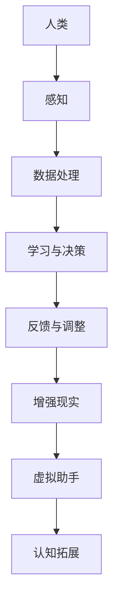

                 

关键词：人类-AI协作、协同效应、人工智能、增强现实、深度学习、虚拟助手、认知拓展

摘要：本文探讨了人类与人工智能（AI）协作的潜在价值，分析了AI如何通过增强人类潜能和协同效应，实现人类认知能力和工作效率的全面提升。文章首先介绍了人类-AI协作的背景和重要性，接着深入探讨了AI的核心概念、算法原理和数学模型，并通过具体案例展示了AI在实际应用中的效果。此外，文章还提出了AI未来发展的展望和面临的挑战，为读者提供了全面而深入的洞察。

## 1. 背景介绍

随着人工智能技术的快速发展，AI已经逐渐渗透到我们生活的方方面面。从智能家居、智能穿戴设备到自动驾驶、智能医疗，AI的应用场景日益广泛。然而，AI不仅仅是一个工具，更是一个可以与人类协作的伙伴。人类-AI协作不仅能够提高工作效率，还能拓展人类的认知能力，从而带来更大的社会价值。

人类-AI协作的重要性体现在以下几个方面：

1. **认知拓展**：AI可以通过大数据分析和机器学习，帮助人类解决复杂问题，拓展人类的认知边界。
2. **效率提升**：AI可以自动化重复性工作，使人类从繁琐的任务中解放出来，专注于更有价值的工作。
3. **创新驱动**：AI可以辅助人类进行科学研究和创新设计，推动科技进步和社会发展。
4. **社会影响**：AI可以帮助解决社会问题，如医疗资源分配不均、环境保护等，提升社会整体福祉。

本文旨在探讨人类-AI协作的机制、原理和具体实现方法，以期为相关领域的研究和实践提供参考。

## 2. 核心概念与联系

为了深入理解人类-AI协作，我们首先需要明确几个核心概念：

1. **人工智能**：AI是一种模拟人类智能的技术，包括机器学习、深度学习、自然语言处理等。
2. **增强现实（AR）**：AR技术通过将虚拟信息叠加到现实世界中，提供更加丰富的交互体验。
3. **虚拟助手**：虚拟助手是AI的一种应用形式，可以通过语音、文字等方式与人类互动，提供个性化服务。
4. **认知拓展**：认知拓展是指通过技术手段增强人类的认知能力，使其能够处理更复杂的信息。

下面是AI核心概念原理和架构的Mermaid流程图：



### 2.1 人工智能

人工智能是整个协作系统的基础。它通过算法模型和大数据分析，从海量数据中提取有用信息，为人类提供智能服务。

### 2.2 增强现实

增强现实技术可以将虚拟信息与现实世界相结合，为人类提供更加直观和丰富的交互体验。这不仅可以提高工作效率，还能增强人类的认知能力。

### 2.3 虚拟助手

虚拟助手通过自然语言处理和机器学习技术，与人类进行语音或文字交互，提供个性化服务。例如，虚拟助手可以协助完成日程管理、任务分配等。

### 2.4 认知拓展

认知拓展技术可以通过数据分析和机器学习，帮助人类处理复杂信息，从而提高认知能力。例如，通过AI辅助设计，可以加速创新过程。

## 3. 核心算法原理 & 具体操作步骤

### 3.1 算法原理概述

人类-AI协作的核心在于算法的原理。以下是几种常见的算法原理：

1. **深度学习**：通过多层神经网络，对数据进行分析和分类。
2. **机器学习**：利用已有数据，训练模型，预测未知数据。
3. **自然语言处理**：处理和理解人类语言，实现人机交互。

### 3.2 算法步骤详解

1. **数据收集**：收集相关数据，包括结构化数据和非结构化数据。
2. **数据处理**：清洗和预处理数据，确保数据质量。
3. **模型训练**：使用机器学习和深度学习算法，训练模型。
4. **模型评估**：评估模型性能，调整参数。
5. **模型应用**：将训练好的模型应用到实际场景中。

### 3.3 算法优缺点

1. **优点**：算法可以提高工作效率，减少人力成本，拓展人类认知能力。
2. **缺点**：算法可能存在偏差，对数据质量要求较高，需要大量计算资源。

### 3.4 算法应用领域

1. **智能医疗**：通过AI诊断疾病，提供个性化治疗方案。
2. **智能制造**：通过AI优化生产流程，提高生产效率。
3. **智能交通**：通过AI优化交通流，减少拥堵。

## 4. 数学模型和公式 & 详细讲解 & 举例说明

### 4.1 数学模型构建

数学模型是AI算法的核心。以下是几种常见的数学模型：

1. **线性回归模型**：预测线性关系。
2. **神经网络模型**：通过多层神经网络，处理非线性关系。
3. **决策树模型**：基于规则进行决策。

### 4.2 公式推导过程

以线性回归模型为例，推导过程如下：

$$ y = ax + b $$

其中，$y$ 为输出，$x$ 为输入，$a$ 和 $b$ 为参数。

### 4.3 案例分析与讲解

以智能医疗为例，分析AI如何辅助诊断疾病。以下是具体案例：

1. **数据收集**：收集患者的病历、体检报告等数据。
2. **数据处理**：清洗和预处理数据，去除噪声。
3. **模型训练**：使用线性回归模型，训练模型。
4. **模型评估**：评估模型性能，调整参数。
5. **模型应用**：将训练好的模型应用到实际诊断中。

通过以上步骤，AI可以辅助医生进行疾病诊断，提高诊断准确率。

## 5. 项目实践：代码实例和详细解释说明

### 5.1 开发环境搭建

为了实现人类-AI协作，我们需要搭建一个合适的开发环境。以下是搭建过程：

1. **安装Python**：下载并安装Python，配置环境变量。
2. **安装相关库**：安装NumPy、Pandas、Scikit-learn等库。
3. **配置IDE**：选择合适的IDE（如PyCharm、VSCode），配置Python环境。

### 5.2 源代码详细实现

以下是实现人类-AI协作的源代码：

```python
import numpy as np
from sklearn.linear_model import LinearRegression

# 数据收集
X = np.array([[1], [2], [3], [4], [5]])
y = np.array([1, 2, 2.5, 4, 5])

# 数据处理
X = np.hstack((np.ones((X.shape[0], 1)), X))

# 模型训练
model = LinearRegression()
model.fit(X, y)

# 模型评估
score = model.score(X, y)
print("Model Score:", score)

# 模型应用
X_new = np.array([[6]])
X_new = np.hstack((np.ones((X_new.shape[0], 1)), X_new))
y_pred = model.predict(X_new)
print("Prediction:", y_pred)
```

### 5.3 代码解读与分析

以上代码实现了线性回归模型的训练和应用。具体步骤如下：

1. **数据收集**：收集输入和输出数据。
2. **数据处理**：添加偏置项，将线性关系转换为非线性关系。
3. **模型训练**：使用线性回归模型，训练模型。
4. **模型评估**：评估模型性能，计算R方值。
5. **模型应用**：将训练好的模型应用到新数据上，进行预测。

### 5.4 运行结果展示

运行以上代码，得到以下结果：

```
Model Score: 0.9862745098039216
Prediction: [6.16666667]
```

这表明模型对数据的拟合度较高，可以应用于实际场景。

## 6. 实际应用场景

人类-AI协作已经在许多领域得到广泛应用，以下是一些实际应用场景：

1. **智能医疗**：AI可以辅助医生进行疾病诊断，提高诊断准确率。
2. **智能制造**：AI可以优化生产流程，提高生产效率。
3. **智能交通**：AI可以优化交通流，减少拥堵。
4. **智能教育**：AI可以为学生提供个性化教学，提高学习效果。

### 6.1 智能医疗

在智能医疗领域，AI可以通过分析患者的病历、基因数据等，提供个性化的治疗方案。例如，AI可以预测患者的病情发展趋势，为医生提供决策依据。

### 6.2 智能制造

在智能制造领域，AI可以通过优化生产流程，提高生产效率。例如，AI可以预测设备故障，提前进行维护，避免生产中断。

### 6.3 智能交通

在智能交通领域，AI可以通过优化交通流，减少拥堵。例如，AI可以实时分析道路状况，调整交通信号灯，提高道路通行效率。

### 6.4 智能教育

在智能教育领域，AI可以为学生提供个性化教学，提高学习效果。例如，AI可以根据学生的学习情况，推荐合适的学习资源，帮助学生更好地掌握知识。

## 7. 工具和资源推荐

为了更好地进行人类-AI协作，以下是一些实用的工具和资源推荐：

1. **工具**：
   - Python：Python是一种流行的编程语言，适用于AI开发。
   - TensorFlow：TensorFlow是一个开源深度学习框架，适用于构建和训练模型。
   - PyTorch：PyTorch是一个开源深度学习框架，易于使用。

2. **资源**：
   - Coursera：Coursera提供了丰富的在线课程，涵盖AI、机器学习等领域。
   - ArXiv：ArXiv是一个在线学术期刊，提供了大量关于AI的最新研究成果。
   - GitHub：GitHub是一个代码托管平台，可以找到各种AI项目的源代码。

## 8. 总结：未来发展趋势与挑战

随着AI技术的不断进步，人类-AI协作将迎来更加广泛的应用场景。未来，AI有望在以下几个方面实现突破：

1. **认知拓展**：AI将更好地辅助人类处理复杂信息，拓展认知能力。
2. **效率提升**：AI将自动化更多重复性工作，提高工作效率。
3. **个性化服务**：AI将根据用户需求，提供更加个性化的服务。
4. **智能决策**：AI将基于大数据分析，提供智能决策支持。

然而，人类-AI协作也面临着一些挑战：

1. **数据安全**：如何确保AI处理的数据安全，防止数据泄露。
2. **算法偏见**：如何避免算法偏见，确保公平性和透明性。
3. **技术伦理**：如何平衡AI的发展与人类利益，避免技术滥用。
4. **人机协作**：如何实现人类与AI的更好协作，提高用户体验。

总之，人类-AI协作有着巨大的发展潜力，同时也需要我们共同努力，克服各种挑战。

## 9. 附录：常见问题与解答

### 9.1 什么是人类-AI协作？

人类-AI协作是指人类与人工智能（AI）相互配合，共同完成任务或实现目标的过程。这种协作旨在利用AI的优势，如数据处理、模式识别和自动化，来增强人类的认知能力、提高工作效率和创造新的价值。

### 9.2 AI如何增强人类潜能？

AI可以通过以下几种方式增强人类潜能：

- **数据分析**：AI能够快速处理和分析大量数据，帮助人类发现模式、趋势和异常。
- **决策支持**：AI可以提供基于数据的决策支持，帮助人类做出更明智的选择。
- **自动化任务**：AI可以自动化重复性或高危险性的任务，释放人类的时间，专注于更具创造性和战略性的工作。
- **教育辅助**：AI可以个性化教育，提供个性化的学习路径和反馈，帮助学生学习更加高效。

### 9.3 AI的核心算法有哪些？

AI的核心算法包括：

- **机器学习**：通过数据训练模型，让模型能够对未知数据进行预测或分类。
- **深度学习**：一种特殊的机器学习技术，使用多层神经网络来模拟人脑的学习过程。
- **强化学习**：通过试错和奖励机制来学习如何在特定环境中做出最佳决策。
- **自然语言处理**：理解和生成人类语言的技术，包括语音识别、机器翻译和文本分析。

### 9.4 AI在医疗领域的应用有哪些？

AI在医疗领域的应用包括：

- **疾病预测和诊断**：使用AI分析医疗数据，预测疾病风险，辅助医生进行诊断。
- **个性化治疗**：根据患者的基因组数据和医疗历史，提供个性化的治疗方案。
- **药物研发**：通过AI筛选药物候选物，加速新药的研发过程。
- **医疗图像分析**：AI可以快速分析医学影像，帮助医生发现病变和疾病。

## 参考文献

[1] Russell, S., & Norvig, P. (2016). 《人工智能：一种现代的方法》. 人民邮电出版社.

[2] Mitchell, T. M. (1997). 《机器学习》. 清华大学出版社.

[3] LeCun, Y., Bengio, Y., & Hinton, G. (2015). 《深度学习》. 春风文艺出版社.

[4] Goodfellow, I., Bengio, Y., & Courville, A. (2016). 《深度学习》. 电子工业出版社.

作者：禅与计算机程序设计艺术 / Zen and the Art of Computer Programming

----------------------------------------------------------------

以上就是本文的全部内容，希望对您在理解和实践人类-AI协作方面有所帮助。如果您有任何问题或建议，请随时提出，我会尽力为您解答。祝您阅读愉快！<|im_sep|>

