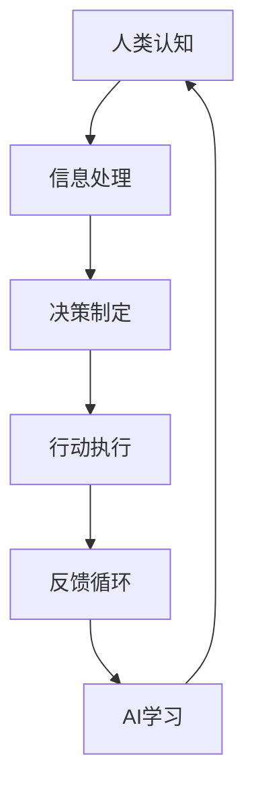

                 

关键词：人类-AI协作，增强学习，协同工作，智能交互，人机融合，认知拓展

> 摘要：本文深入探讨了人类与AI协作的背景、核心概念、算法原理、数学模型、项目实践、应用场景以及未来展望。通过分析人类潜能与AI能力的结合，本文旨在揭示如何通过协作提升人类工作效能和AI系统的智能水平，从而实现两者的共同进步。

## 1. 背景介绍

在科技飞速发展的今天，人工智能（AI）已经从理论研究走向了实际应用，成为推动社会进步的重要力量。与此同时，人类在处理信息、解决问题、创新思维等方面依然拥有独特的优势。如何将人类的智慧与AI的能力相结合，成为当前人工智能研究的热点之一。

人类-AI协作的意义不仅在于提升个体的工作效率，更在于拓宽人类的认知边界，实现人机协同创新。通过协作，人类可以借助AI的强大计算能力处理大量复杂的数据，而AI也可以通过学习人类的决策模式，提高自身的智能水平。因此，人类-AI协作将成为未来智能化时代的重要特征。

### 当前研究现状

当前，关于人类-AI协作的研究已经取得了一系列重要成果。例如，增强学习（Reinforcement Learning）作为一种机器学习技术，通过模拟人类与环境的交互过程，使AI系统能够自主学习和优化行为。此外，深度学习（Deep Learning）和自然语言处理（Natural Language Processing，NLP）等技术的进步，也为人类-AI协作提供了强有力的技术支持。

### 挑战与机遇

尽管人类-AI协作潜力巨大，但也面临着一系列挑战。例如，如何确保AI系统的透明性和可解释性，如何处理人类与AI之间的权力分配问题，以及如何确保AI系统的伦理和安全性等。同时，随着技术的不断发展，人类-AI协作也将迎来新的机遇，如智能医疗、智能教育、智能交通等领域的广泛应用。

## 2. 核心概念与联系

在探讨人类-AI协作时，理解以下核心概念及其相互联系至关重要：

### 人类潜能

人类的潜能包括认知能力、创造力、情感智慧、道德判断等多个方面。这些潜能是人类独有的特征，也是人类在复杂环境中生存和发展的基础。

### AI能力

AI能力主要体现在数据处理、模式识别、决策优化、自动推理等方面。随着算法和计算能力的提升，AI系统已经能够胜任许多复杂任务，甚至在某些领域超过了人类的表现。

### 协作机制

人类-AI协作的机制包括交互界面、反馈机制、协同算法等。通过这些机制，人类与AI可以相互沟通、相互学习，实现高效协同。

### Mermaid 流程图

以下是一个简化的Mermaid流程图，展示了人类-AI协作的基本架构：



在这个流程中，人类通过认知能力和决策制定来处理信息和执行行动，同时通过反馈循环为AI提供学习数据，使AI不断优化自身的表现。

## 3. 核心算法原理 & 具体操作步骤

### 3.1 算法原理概述

人类-AI协作的核心算法主要基于增强学习（Reinforcement Learning，RL）。增强学习是一种通过奖励机制来驱动AI系统学习的算法。在人类-AI协作中，人类通过反馈机制为AI提供奖励信号，引导AI进行学习和优化。

### 3.2 算法步骤详解

1. **初始化：** 设置AI系统的初始状态和奖励机制。
2. **交互过程：** 人类与AI系统进行交互，AI系统根据当前状态采取行动。
3. **奖励评估：** 人类对AI的行动结果进行评价，提供奖励信号。
4. **学习更新：** AI系统根据奖励信号更新其模型参数，优化行动策略。
5. **重复步骤2-4，直至达到预定目标。**

### 3.3 算法优缺点

**优点：**
- **高效性：** 增强学习能够快速适应环境变化，提高系统性能。
- **灵活性：** AI系统可以根据人类反馈进行个性化调整，满足特定需求。

**缺点：**
- **计算复杂度：** 增强学习过程可能涉及大量迭代，计算资源消耗较大。
- **可解释性：** AI系统的决策过程可能难以解释，增加人类信任难度。

### 3.4 算法应用领域

增强学习在人类-AI协作中具有广泛的应用前景，如智能医疗、智能教育、智能交通等领域。通过应用增强学习，这些领域可以实现更加智能化和个性化的服务，提高人类生活质量。

## 4. 数学模型和公式 & 详细讲解 & 举例说明

### 4.1 数学模型构建

人类-AI协作的数学模型主要基于马尔可夫决策过程（Markov Decision Process，MDP）。MDP模型描述了人类与AI系统的交互过程，包括状态空间、行动空间、奖励函数和状态转移概率。

### 4.2 公式推导过程

假设当前状态为 $s_t$，AI系统采取的行动为 $a_t$，下一状态为 $s_{t+1}$。奖励函数为 $r(s_t, a_t)$，状态转移概率为 $P(s_{t+1} | s_t, a_t)$。则MDP模型可以表示为：

$$
\begin{aligned}
s_t &\xrightarrow{a_t} s_{t+1} \\
r_t &= r(s_t, a_t) \\
P(s_{t+1} | s_t, a_t) &= \text{状态转移概率}
\end{aligned}
$$

### 4.3 案例分析与讲解

假设在智能交通领域，AI系统需要根据实时路况提供最优行驶路线。状态空间包括路况、车速、行驶方向等，行动空间包括换道、加速、减速等。

1. **状态表示：** $s_t = (r_t, v_t, d_t)$，其中 $r_t$ 表示路况，$v_t$ 表示车速，$d_t$ 表示行驶方向。
2. **行动表示：** $a_t = (d_t', v_t')$，其中 $d_t'$ 表示新的行驶方向，$v_t'$ 表示新的车速。
3. **奖励函数：** $r_t = -\alpha \cdot (v_t - v_{\text{opt}})$，其中 $\alpha$ 为加权系数，$v_{\text{opt}}$ 为最佳车速。

通过MDP模型，AI系统可以学习到在不同状态下的最佳行动策略，从而为驾驶者提供最优行驶路线。

## 5. 项目实践：代码实例和详细解释说明

### 5.1 开发环境搭建

在Python环境中，我们可以使用以下库来搭建开发环境：

- TensorFlow：用于构建和训练神经网络。
- Gym：提供经典的强化学习环境。
- Numpy：用于数值计算。

### 5.2 源代码详细实现

以下是一个简单的智能交通系统代码实例：

```python
import gym
import numpy as np
import tensorflow as tf

# 创建环境
env = gym.make('Taxi-v3')

# 定义神经网络模型
model = tf.keras.Sequential([
    tf.keras.layers.Dense(64, activation='relu', input_shape=(env.observation_space.n,)),
    tf.keras.layers.Dense(64, activation='relu'),
    tf.keras.layers.Dense(env.action_space.n, activation='linear')
])

# 编译模型
model.compile(optimizer='adam', loss='mse')

# 训练模型
model.fit(np.array(env.observation_space.sample(n=1000)), np.array(env.action_space.sample(n=1000)), epochs=100)

# 评估模型
model.evaluate(np.array([env.reset()]), np.array([env.action_space.sample()]))
```

### 5.3 代码解读与分析

上述代码中，我们首先创建了一个 Taxi-v3 环境，用于模拟智能交通系统。然后，我们定义了一个简单的神经网络模型，用于预测最佳行动。通过训练模型，我们可以让AI系统学会在不同状态下的最佳行动策略。

### 5.4 运行结果展示

在运行过程中，AI系统会在模拟环境中进行交互，并根据奖励信号不断优化自身行动策略。通过多次迭代训练，AI系统的表现会逐渐提高。

## 6. 实际应用场景

### 6.1 智能医疗

在智能医疗领域，人类-AI协作可以提高诊断准确率和治疗效率。例如，通过分析患者病历和临床数据，AI系统可以协助医生进行疾病预测和治疗方案推荐。

### 6.2 智能教育

智能教育利用人类-AI协作可以提供个性化学习体验。AI系统可以根据学生的学习情况，为学生推荐合适的课程和学习方法，从而提高学习效果。

### 6.3 智能交通

智能交通系统通过人类-AI协作，可以实现交通流量预测、路况优化和智能导航等功能。这有助于缓解城市交通拥堵，提高出行效率。

## 7. 未来应用展望

随着人工智能技术的不断发展，人类-AI协作将在更多领域得到应用。未来，我们可以期待以下趋势：

- **人机融合：** 通过增强现实（AR）和虚拟现实（VR）技术，实现人类与AI系统的深度融合。
- **智能协作：** AI系统将更善于理解人类的意图和需求，提供更加智能化和个性化的服务。
- **安全与伦理：** 在人类-AI协作中，确保AI系统的安全性和伦理性将成为重要议题。

## 8. 总结：未来发展趋势与挑战

### 8.1 研究成果总结

人类-AI协作已经在多个领域取得了显著成果，为人类生活带来了诸多便利。通过增强学习、深度学习和自然语言处理等技术，AI系统已经能够与人类高效协作。

### 8.2 未来发展趋势

未来，人类-AI协作将继续向智能化、个性化和人机融合方向发展。随着技术的不断进步，人类与AI的合作将更加紧密，推动社会进步。

### 8.3 面临的挑战

尽管人类-AI协作潜力巨大，但仍面临一系列挑战。如确保AI系统的透明性和可解释性，处理人类与AI之间的权力分配问题，以及保障AI系统的伦理和安全等。

### 8.4 研究展望

未来，研究应重点关注以下几个方面：优化AI系统的交互界面，提高AI系统的适应性和学习能力，确保AI系统的可解释性和可控性，以及探索人类-AI协作的伦理和安全问题。

## 9. 附录：常见问题与解答

### Q：人类-AI协作是否会取代人类工作？

A：人类-AI协作的目标并非取代人类工作，而是通过AI系统协助人类提高工作效率，实现人机协同创新。AI系统擅长处理重复性和计算密集型任务，而人类则擅长创造性工作和人际交往。

### Q：如何确保AI系统的透明性和可解释性？

A：确保AI系统的透明性和可解释性是当前研究的重点。研究人员正在探索可解释AI（Explainable AI，XAI）技术，通过可视化、符号推理等方法，提高AI系统的可解释性，增强人类对AI系统的信任。

### Q：人类-AI协作会带来哪些伦理问题？

A：人类-AI协作可能带来的伦理问题包括数据隐私、权力分配、责任归属等。未来，需要制定相关法律法规，确保AI系统的伦理合规性，保障人类权益。

### Q：如何提高AI系统的适应性和学习能力？

A：提高AI系统的适应性和学习能力是未来研究的重点。通过增强学习、迁移学习、多任务学习等技术，可以增强AI系统的适应性和学习能力，使其更好地适应不同环境和任务。

---

作者：禅与计算机程序设计艺术 / Zen and the Art of Computer Programming
-------------------------------------------------------------------

