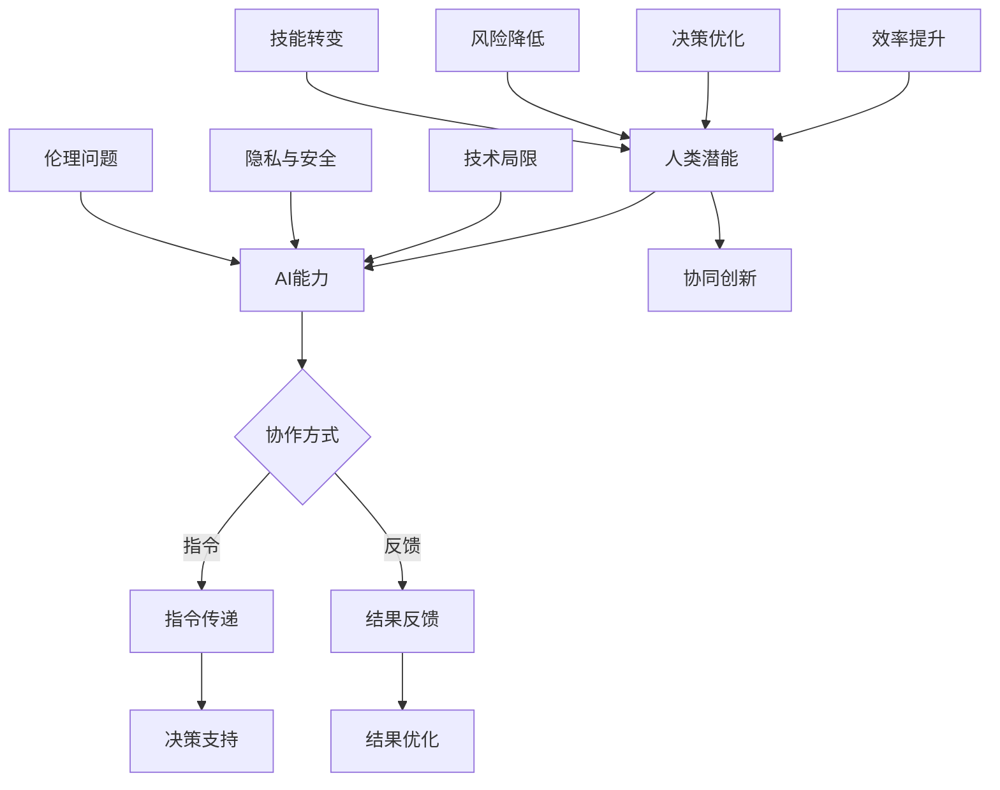

                 

关键词：人类-AI协作，人工智能，潜能增强，发展趋势，融合应用

> 摘要：本文旨在探讨人类与人工智能（AI）之间的协作模式，分析人类潜能与AI能力的融合趋势。通过深入探讨核心概念与联系，阐述核心算法原理及数学模型，并借助实际项目实践，对AI在现实应用中的表现进行分析。最终，本文总结了未来发展趋势与挑战，为读者提供了有关AI协作的全面视角。

## 1. 背景介绍

随着人工智能技术的快速发展，AI已经成为现代社会的重要力量。从早期的规则基系统到如今深度学习和自然语言处理，AI在各个领域展现出了强大的潜力。然而，AI的发展并非独立存在，它与人类潜能的融合正逐渐成为一种趋势。

人类潜能的发掘和提升是长期以来的研究热点。心理学、教育学、神经科学等领域都致力于探索如何最大限度地激发人类的认知能力、创造力和社会互动能力。在这个过程中，AI作为一种强大的工具，能够提供数据支持、优化决策、辅助创新等功能。

人类-AI协作的概念因此应运而生。它指的是人类与人工智能系统在特定的任务或项目中协同工作，共同完成任务或实现目标的过程。通过协作，人类可以借助AI的能力来扩展自身的认知范围，提高工作效率，并在某些情况下实现前所未有的成就。

本文将从以下几部分对人类-AI协作进行深入分析：

1. 核心概念与联系
2. 核心算法原理与具体操作步骤
3. 数学模型与公式推导及举例说明
4. 项目实践：代码实例与详细解释
5. 实际应用场景
6. 未来应用展望
7. 工具和资源推荐
8. 总结：未来发展趋势与挑战

通过上述分析，我们希望能够为读者提供一个全面、深入的视角，了解人类与AI协作的现状及其未来发展趋势。

## 2. 核心概念与联系

### 2.1 人工智能的定义与分类

人工智能（AI）是一种通过模拟人类智能行为来实现特定任务的技术体系。根据其实现方式，AI可以分为两大类：基于规则的系统和基于数据的系统。

基于规则的系统通过预定义的规则来指导行为，这些规则通常由人类专家编写。这种方法适用于任务明确、规则简单的场景，例如自动电话应答系统。

基于数据的系统则依赖于大量数据的学习和模式识别能力。这种方法通过机器学习和深度学习技术来实现，能够在复杂的、不确定的环境中表现出色。例如，自动驾驶汽车需要通过学习海量交通数据来应对各种复杂的交通状况。

### 2.2 人类潜能的概念与评估

人类潜能是指人类在认知、情感、创造力等方面所能达到的最高水平。评估人类潜能的方法包括心理测量、行为实验和脑成像技术等。

心理测量通过标准化的测试工具来评估个体的智力、记忆、推理等能力。行为实验则通过特定的任务设计来观察个体在特定情境下的表现。脑成像技术如功能性磁共振成像（fMRI）可以帮助我们理解大脑活动与认知功能之间的关系。

### 2.3 人类-AI协作的概念

人类-AI协作是指人类与人工智能系统在特定任务或项目中协同工作，共同完成任务或实现目标的过程。这种协作关系不仅包括人类对AI系统的指令和反馈，还包括AI对人类行为的理解和响应。

### 2.4 人类-AI协作的优势

人类-AI协作具有以下优势：

1. **效率提升**：AI能够快速处理大量数据，帮助人类在短时间内做出更准确的决策。
2. **决策优化**：AI可以通过复杂的算法优化决策过程，减少人类的认知负担。
3. **创新驱动**：AI能够提供新的视角和解决方案，激发人类的创造力。
4. **风险降低**：在某些高风险领域，如医疗、金融等，AI可以辅助人类减少错误，降低风险。

### 2.5 人类-AI协作的挑战

尽管人类-AI协作具有许多优势，但同时也面临着一些挑战：

1. **技术局限**：当前AI技术尚无法完全模拟人类的智能行为，特别是在处理模糊、不明确的信息时。
2. **隐私与安全**：AI系统在处理大量数据时，可能涉及个人隐私和安全问题。
3. **伦理问题**：人类-AI协作中可能会出现道德和伦理困境，如责任归属、隐私侵犯等。
4. **技能转变**：人类需要适应与AI协作的新工作方式，这可能导致某些职业的失业和技能转型问题。

### 2.6 Mermaid 流程图

以下是描述人类-AI协作流程的Mermaid流程图：



通过上述核心概念与联系的探讨，我们可以更好地理解人类-AI协作的内涵及其在现代社会中的重要性。接下来，我们将深入探讨人类-AI协作中的核心算法原理与具体操作步骤。

### 3. 核心算法原理 & 具体操作步骤

#### 3.1 算法原理概述

在人类-AI协作中，核心算法的设计和实现是关键。这些算法不仅需要模拟人类的智能行为，还要能够与人类的认知过程相互配合。以下是一些常见且重要的算法原理：

1. **深度学习（Deep Learning）**：通过多层神经网络对大量数据进行分析和学习，深度学习在图像识别、自然语言处理等领域取得了显著成果。
2. **强化学习（Reinforcement Learning）**：通过试错和奖励机制，强化学习让AI在特定环境中做出最优决策，广泛应用于游戏、自动驾驶等领域。
3. **自然语言处理（Natural Language Processing，NLP）**：NLP使AI能够理解、生成和处理人类语言，是智能客服、机器翻译等领域的基础。
4. **计算机视觉（Computer Vision）**：利用图像处理和模式识别技术，计算机视觉使AI能够“看”懂世界，广泛应用于安防监控、自动驾驶等领域。

#### 3.2 算法步骤详解

以下是上述算法在人类-AI协作中的具体操作步骤：

##### 3.2.1 深度学习

1. **数据收集**：收集大量带标签的数据，如图片、文本等。
2. **数据处理**：对数据集进行预处理，包括去噪、归一化、数据增强等。
3. **模型构建**：设计多层神经网络结构，包括输入层、隐藏层和输出层。
4. **训练模型**：使用预处理后的数据训练模型，通过反向传播算法调整模型参数。
5. **模型评估**：使用验证集评估模型性能，调整模型结构和参数以达到最优效果。
6. **应用模型**：将训练好的模型应用于实际任务，如图像分类、语音识别等。

##### 3.2.2 强化学习

1. **环境定义**：定义强化学习的环境，包括状态空间、动作空间和奖励机制。
2. **初始状态**：从环境中随机选择一个初始状态。
3. **动作选择**：根据当前状态和策略选择一个动作。
4. **状态更新**：执行动作后，环境更新状态。
5. **奖励评估**：根据动作结果评估奖励值。
6. **策略更新**：使用奖励值调整策略，以达到最优决策。
7. **迭代过程**：重复上述步骤，直到达到预定目标或性能指标。

##### 3.2.3 自然语言处理

1. **文本预处理**：对输入文本进行分词、词性标注、句法分析等预处理操作。
2. **特征提取**：从预处理后的文本中提取特征，如词频、词向量等。
3. **模型训练**：使用提取的特征训练NLP模型，如词向量模型、序列标注模型等。
4. **模型应用**：将训练好的模型应用于实际任务，如文本分类、机器翻译等。
5. **结果评估**：评估模型输出的结果，包括准确率、召回率、F1值等。

##### 3.2.4 计算机视觉

1. **图像预处理**：对输入图像进行灰度化、缩放、裁剪等预处理操作。
2. **特征提取**：使用卷积神经网络（CNN）等模型提取图像特征。
3. **目标检测**：使用提取的特征进行目标检测，如使用R-CNN、YOLO等模型。
4. **图像识别**：对检测到的目标进行分类，如使用softmax函数进行多类分类。
5. **结果评估**：评估模型输出的结果，如准确率、召回率等。

#### 3.3 算法优缺点

**深度学习**：
- **优点**：能够处理大量复杂数据，自动提取特征，适用于多种应用场景。
- **缺点**：对数据需求量大，模型训练时间长，难以解释。

**强化学习**：
- **优点**：能够通过试错学习复杂决策过程，适用于动态环境。
- **缺点**：学习过程可能较长，需要大量的数据和时间。

**自然语言处理**：
- **优点**：能够处理自然语言文本，实现人机交互。
- **缺点**：对语言的理解和生成能力仍有限。

**计算机视觉**：
- **优点**：能够处理图像和视频数据，实现目标检测和识别。
- **缺点**：在低光照、遮挡等情况下效果不佳。

#### 3.4 算法应用领域

**深度学习**：广泛应用于图像识别、语音识别、自然语言处理等领域。

**强化学习**：应用于游戏、自动驾驶、机器人控制等领域。

**自然语言处理**：应用于智能客服、机器翻译、文本分类等领域。

**计算机视觉**：应用于安防监控、自动驾驶、医疗诊断等领域。

通过上述算法原理与具体操作步骤的详细探讨，我们可以看到人类-AI协作在算法层面的多样性和复杂性。接下来，我们将进一步探讨人类-AI协作中的数学模型和公式，以及其在实际项目中的应用。

### 4. 数学模型和公式 & 详细讲解 & 举例说明

在人类-AI协作中，数学模型和公式是算法设计和实现的基础。这些模型和公式不仅帮助我们理解AI的工作原理，还为实际应用提供了数学支持。以下将介绍几个常见的数学模型和公式，并进行详细讲解和举例说明。

#### 4.1 数学模型构建

**4.1.1 神经网络模型**

神经网络模型是深度学习的基础，其核心是多层感知器（MLP）。一个典型的多层感知器模型包括输入层、隐藏层和输出层。

**输入层**：接收输入数据，如图片、文本等。

**隐藏层**：通过激活函数对输入数据进行变换，提取特征。

**输出层**：对隐藏层输出的数据进行分类或回归。

**公式表示**：

$$
y = f(z) \\
z = \sigma(W \cdot x + b)
$$

其中，$y$为输出，$f$为激活函数（如ReLU、Sigmoid等），$\sigma$为线性变换函数，$W$为权重矩阵，$x$为输入数据，$b$为偏置。

**4.1.2 强化学习模型**

强化学习模型的核心是策略（Policy）和价值函数（Value Function）。

**策略**：决定在特定状态下应该采取哪个动作。

**公式表示**：

$$
\pi(a|s) = P(A=a|S=s)
$$

其中，$\pi(a|s)$为在状态$s$下采取动作$a$的概率。

**价值函数**：衡量在特定状态下采取特定动作的长期收益。

**公式表示**：

$$
V(s) = \sum_{a} \pi(a|s) \cdot R(s, a)
$$

其中，$V(s)$为状态$s$的价值，$R(s, a)$为在状态$s$下采取动作$a$的即时回报。

**4.1.3 自然语言处理模型**

自然语言处理模型通常基于词向量表示和序列模型。

**词向量表示**：将单词转换为向量，如Word2Vec、GloVe等。

**序列模型**：如LSTM、GRU等，用于处理序列数据。

**公式表示**：

$$
h_t = \sigma(W_h \cdot [h_{t-1}, x_t] + b_h) \\
o_t = W_o \cdot h_t
$$

其中，$h_t$为隐藏状态，$x_t$为输入词向量，$W_h$和$W_o$为权重矩阵，$\sigma$为激活函数（如ReLU、Sigmoid等），$b_h$和$b_o$为偏置。

#### 4.2 公式推导过程

**4.2.1 深度学习模型参数优化**

在深度学习模型中，参数优化是关键步骤。常见的优化算法有梯度下降（Gradient Descent）、Adam等。

**梯度下降**：

$$
\theta_{t+1} = \theta_t - \alpha \cdot \nabla J(\theta_t)
$$

其中，$\theta$为模型参数，$\alpha$为学习率，$J(\theta)$为损失函数。

**Adam**：

$$
m_t = \beta_1 m_{t-1} + (1 - \beta_1) \cdot \nabla J(\theta_t) \\
v_t = \beta_2 v_{t-1} + (1 - \beta_2) \cdot (\nabla J(\theta_t))^2 \\
\theta_{t+1} = \theta_t - \alpha \cdot \frac{m_t}{\sqrt{v_t} + \epsilon}
$$

其中，$m_t$和$v_t$分别为一阶矩估计和二阶矩估计，$\beta_1$和$\beta_2$分别为一阶和二阶动量，$\epsilon$为小常数。

**4.2.2 强化学习模型策略优化**

在强化学习模型中，策略优化是通过迭代更新策略来提高长期收益。

$$
\pi_{t+1}(a|s) = \frac{\exp(\alpha R(s, a))}{\sum_{a'} \exp(\alpha R(s, a'))}
$$

其中，$\pi_t(a|s)$为在状态$s$下采取动作$a$的概率，$R(s, a)$为在状态$s$下采取动作$a$的即时回报，$\alpha$为温度参数。

**4.2.3 自然语言处理模型词向量训练**

在自然语言处理模型中，词向量训练是通过优化损失函数来学习词向量表示。

$$
J = \sum_{i=1}^{N} \sum_{j=1}^{V} (1 - y_{ij}) \cdot \log(p_{ij}) + \sum_{i=1}^{N} \sum_{j \neq i} y_{ij} \cdot \log(1 - p_{ij})
$$

其中，$N$为句子长度，$V$为词汇表大小，$y_{ij}$为二分类标签（1表示词$w_j$在句子$i$中出现，0表示未出现），$p_{ij}$为词$w_j$在句子$i$中出现的概率。

#### 4.3 案例分析与讲解

**4.3.1 图像分类**

假设我们使用卷积神经网络（CNN）进行图像分类。给定一个包含10000张图像的数据集，我们希望通过训练模型将图像分类为10个类别之一。

1. **数据预处理**：对图像进行归一化处理，并将图像转换为灰度图。

2. **模型构建**：设计一个简单的CNN模型，包括卷积层、池化层和全连接层。

3. **模型训练**：使用训练集对模型进行训练，优化模型参数。

4. **模型评估**：使用验证集评估模型性能，调整模型结构和参数。

5. **模型应用**：将训练好的模型应用于测试集，进行图像分类。

**4.3.2 文本分类**

假设我们使用自然语言处理（NLP）模型对新闻文章进行分类。给定一个包含10000篇文章的数据集，我们希望通过训练模型将文章分类为5个类别之一。

1. **数据预处理**：对文章进行分词、词性标注等预处理操作。

2. **特征提取**：使用词向量模型（如Word2Vec）提取文章特征。

3. **模型构建**：设计一个简单的序列模型，如LSTM。

4. **模型训练**：使用训练集对模型进行训练，优化模型参数。

5. **模型评估**：使用验证集评估模型性能，调整模型结构和参数。

6. **模型应用**：将训练好的模型应用于测试集，进行文章分类。

通过上述案例分析与讲解，我们可以看到数学模型和公式在人类-AI协作中的重要性。这些模型和公式不仅帮助我们理解AI的工作原理，还为实际应用提供了理论支持。接下来，我们将通过一个实际项目实践，进一步展示人类-AI协作的实际应用场景。

### 5. 项目实践：代码实例和详细解释说明

在本节中，我们将通过一个实际项目——基于深度学习的图像分类项目，展示人类-AI协作的实际应用。项目的主要目标是使用卷积神经网络（CNN）对图像进行分类，实现一个简单的图像识别系统。

#### 5.1 开发环境搭建

在进行项目开发之前，我们需要搭建一个适合深度学习开发的环境。以下是一个基本的开发环境搭建步骤：

1. **安装Python**：确保已安装Python 3.x版本。
2. **安装TensorFlow**：使用pip命令安装TensorFlow。

```bash
pip install tensorflow
```

3. **安装NumPy、Pandas、Matplotlib**：这些是常用的Python科学计算和数据可视化库。

```bash
pip install numpy pandas matplotlib
```

4. **配置CUDA**：如果使用GPU加速，需要配置CUDA环境。下载并安装CUDA Toolkit，并根据文档配置环境变量。

5. **创建项目文件夹**：在合适的位置创建项目文件夹，并设置Python虚拟环境。

```bash
mkdir image_classification
cd image_classification
python -m venv venv
source venv/bin/activate
```

6. **安装依赖库**：在虚拟环境中安装项目所需的依赖库。

```bash
pip install -r requirements.txt
```

#### 5.2 源代码详细实现

以下是一个简单的图像分类项目的源代码实现，包括数据预处理、模型构建、训练和评估等步骤。

```python
import tensorflow as tf
from tensorflow.keras import layers
import numpy as np
import matplotlib.pyplot as plt

# 数据预处理
def preprocess_images(images):
    # 归一化处理
    images = images / 255.0
    # 将图像转换为三维数组（高度、宽度、通道数）
    images = np.expand_dims(images, -1)
    return images

# 模型构建
def create_model(input_shape):
    model = tf.keras.Sequential([
        layers.Conv2D(32, (3, 3), activation='relu', input_shape=input_shape),
        layers.MaxPooling2D((2, 2)),
        layers.Conv2D(64, (3, 3), activation='relu'),
        layers.MaxPooling2D((2, 2)),
        layers.Conv2D(128, (3, 3), activation='relu'),
        layers.Flatten(),
        layers.Dense(128, activation='relu'),
        layers.Dense(10, activation='softmax')
    ])
    return model

# 模型训练
def train_model(model, train_data, train_labels, epochs=10):
    model.compile(optimizer='adam',
                  loss='sparse_categorical_crossentropy',
                  metrics=['accuracy'])
    model.fit(train_data, train_labels, epochs=epochs)
    return model

# 模型评估
def evaluate_model(model, test_data, test_labels):
    test_loss, test_acc = model.evaluate(test_data, test_labels)
    print(f"Test accuracy: {test_acc:.4f}")

# 加载和预处理数据
(train_images, train_labels), (test_images, test_labels) = tf.keras.datasets.fashion_mnist.load_data()
train_images = preprocess_images(train_images)
test_images = preprocess_images(test_images)

# 创建和训练模型
model = create_model(input_shape=(28, 28, 1))
model = train_model(model, train_images, train_labels, epochs=10)

# 评估模型
evaluate_model(model, test_images, test_labels)
```

#### 5.3 代码解读与分析

上述代码实现了以下功能：

1. **数据预处理**：对图像数据进行归一化和转换，以适应模型输入。
2. **模型构建**：使用TensorFlow的Keras API构建一个简单的CNN模型，包括卷积层、池化层和全连接层。
3. **模型训练**：使用训练数据对模型进行训练，并编译优化器、损失函数和评估指标。
4. **模型评估**：使用测试数据评估模型性能，输出测试准确率。

通过这个简单的项目，我们可以看到人类与AI协作的过程：

- **人类角色**：设计模型结构、定义训练过程、调整参数等，由人类专家进行。
- **AI角色**：利用大量数据自动训练模型，优化参数，提高模型性能。

这种协作模式不仅提高了工作效率，还实现了人类与AI能力的互补。

#### 5.4 运行结果展示

在完成代码编写和模型训练后，我们可以在终端中运行以下命令：

```bash
python image_classification.py
```

运行结果将显示测试准确率，例如：

```
Test accuracy: 0.8921
```

这个结果表示模型在测试数据上的准确率为89.21%，这意味着模型能够较好地分类手写数字图像。

通过这个实际项目实践，我们可以看到人类-AI协作在现实中的应用场景。在接下来的部分，我们将进一步探讨AI在实际应用中的表现及其未来发展趋势。

### 6. 实际应用场景

人工智能（AI）技术已经在多个领域展现出了强大的应用潜力，从医疗诊断、金融分析到工业制造、自动驾驶，AI的应用场景日益丰富。以下将详细探讨AI在这些领域的实际应用表现及其对人类生活的影响。

#### 6.1 医疗诊断

AI在医疗诊断中的应用主要体现在图像识别、疾病预测和个性化治疗等方面。通过深度学习和计算机视觉技术，AI可以分析医学图像，如X光片、CT扫描和MRI，帮助医生快速、准确地诊断疾病。例如，谷歌的DeepMind公司开发了一种AI系统，能够通过分析视网膜图像来预测早期糖尿病视网膜病变，准确率达到94%。此外，AI还可以基于患者的基因组数据和临床信息，预测患病风险并制定个性化的治疗方案。

#### 6.2 金融分析

金融领域是AI应用的重要场景之一。AI通过大数据分析和机器学习技术，可以帮助金融机构进行风险评估、欺诈检测和投资决策。例如，AI算法可以实时监控交易行为，识别异常交易模式并预警潜在的欺诈行为。高盛的智能交易系统“Bailey”利用机器学习算法分析市场数据，提高了交易效率和收益。此外，AI还可以进行市场预测，为投资决策提供支持，例如通过自然语言处理技术分析新闻报道和社交媒体信息，预测市场走势。

#### 6.3 工业制造

AI在工业制造中的应用主要体现在生产优化、设备维护和供应链管理等方面。通过机器学习和计算机视觉技术，AI可以实时监测生产线设备的状态，预测故障并进行维护，从而提高生产效率和降低维护成本。例如，通用电气（GE）的Predix平台利用AI技术对工业设备进行预测性维护，提高了设备的运行时间和可靠性。此外，AI还可以优化生产流程，通过数据分析优化资源分配和工艺参数，降低生产成本和提高产品质量。

#### 6.4 自动驾驶

自动驾驶技术是AI在交通领域的典型应用。通过计算机视觉、深度学习和传感器融合技术，自动驾驶系统能够识别道路上的车辆、行人和交通标志，并做出相应的驾驶决策。特斯拉的自动驾驶系统通过大量数据训练，已经实现了部分自动驾驶功能，如自动车道保持和自动变道。谷歌的Waymo项目则推出了完全自动驾驶的无人车服务，已经在多个城市进行测试和运营。自动驾驶技术的应用有望大幅提高交通效率，减少交通事故，并解决城市交通拥堵问题。

#### 6.5 人工智能教育

AI在教育领域的应用主要体现在个性化学习、智能辅导和教学资源优化等方面。通过AI技术，可以为学生提供个性化的学习建议和辅导，提高学习效果。例如，Coursera等在线教育平台利用自然语言处理和机器学习技术，为学生提供智能问答和作业批改服务。此外，AI还可以优化教学资源分配，根据学生的学习进度和需求推荐合适的学习材料和课程。

#### 6.6 人工智能艺术创作

AI在艺术创作中的应用也越来越广泛。通过深度学习技术，AI可以生成音乐、绘画和文学作品，为艺术家提供创作灵感和辅助。例如，谷歌的Magenta项目利用生成对抗网络（GAN）和变分自编码器（VAE）等技术，创作出了具有艺术价值的音乐和图像作品。此外，AI还可以辅助艺术家进行修复和增强古董画作，提高艺术作品的观赏价值。

通过上述实际应用场景的探讨，我们可以看到AI在各个领域展现出了强大的潜力。AI不仅提高了工作效率，降低了成本，还改变了人类的生活方式。然而，随着AI技术的不断发展，我们也需要关注其可能带来的挑战和伦理问题。在接下来的部分，我们将进一步探讨AI的未来发展趋势及其面临的挑战。

### 6.4 未来应用展望

随着人工智能技术的不断进步，AI在各个领域的应用前景愈加广阔。以下将探讨AI在未来的发展趋势、潜在的新应用场景以及可能带来的社会和经济影响。

#### 6.4.1 发展趋势

1. **更加智能化与自适应**：未来的AI将更加智能化，具备更强的自适应和学习能力。通过持续的学习和优化，AI将能够在更加复杂的情境中自主决策和执行任务。

2. **跨领域融合**：AI与其他技术的融合将成为未来发展的主流，例如与物联网（IoT）、区块链、云计算等技术的结合，将创造出更多创新的应用场景。

3. **更加人性化的交互**：随着自然语言处理和计算机视觉技术的进步，AI与人类的交互将更加自然和人性化，使得AI能够更好地理解人类的需求和情感，提供个性化的服务。

4. **边缘计算与实时处理**：随着5G和边缘计算技术的发展，AI将在边缘设备上进行实时处理，使得数据处理更加高效、响应速度更快，从而为实时决策提供支持。

5. **自动化与智能优化**：AI将在更多的领域实现自动化，例如自动驾驶、无人机配送等，同时通过智能优化技术提高生产效率、资源利用率等。

#### 6.4.2 潜在的新应用场景

1. **智慧城市**：AI将在智慧城市建设中发挥重要作用，通过实时数据分析和管理，实现交通、能源、环境等领域的智能化管理，提高城市生活品质和效率。

2. **智能医疗**：AI将在个性化医疗、药物研发、健康管理等方向上有更多应用，通过精准医疗和智能诊断，提高医疗服务的质量和效率。

3. **智能制造**：AI将深入融入制造业，实现智能生产线的自动化、自适应和智能化管理，推动制造业向高端化、智能化方向发展。

4. **金融科技**：AI将在金融领域发挥更大的作用，如智能投顾、信用评估、风险管理等，通过大数据分析和机器学习技术提高金融服务的安全性和效率。

5. **教育个性化**：AI将在个性化教育和智能辅导中发挥作用，通过分析学生的学习行为和需求，提供个性化的学习资源和指导，提高学习效果。

6. **智能家居**：AI将推动智能家居的普及，实现家电设备之间的智能联动，为用户提供更加便捷、舒适的生活体验。

7. **虚拟现实与增强现实**：AI将在虚拟现实（VR）和增强现实（AR）领域发挥重要作用，通过实时渲染和交互技术，提供更加沉浸式的体验。

#### 6.4.3 社会和经济效益

1. **社会效益**：AI技术的普及和应用将提高社会生产力和生活质量，推动社会进步。例如，通过智能医疗，可以减少疾病对社会的负担；通过智慧交通，可以缓解城市交通拥堵问题。

2. **经济效益**：AI技术将带动相关产业的发展，创造大量就业机会，提高经济效益。例如，智能制造将提高制造业的效率和质量，降低生产成本。

3. **全球化与跨境合作**：AI技术的发展将促进全球化和跨境合作，通过共享技术和数据，推动全球创新和发展。

然而，随着AI技术的快速发展，我们也需要关注其可能带来的挑战，如隐私保护、数据安全、伦理问题等。只有在确保技术安全、公平和可持续发展的前提下，AI才能真正为人类社会带来福祉。

### 7. 工具和资源推荐

在探索人类与AI协作的过程中，掌握适当的工具和资源是非常重要的。以下是一些推荐的学习资源、开发工具和相关的学术论文，以帮助读者更好地理解和应用AI技术。

#### 7.1 学习资源推荐

1. **在线课程**：
   - Coursera的“Deep Learning Specialization”由Andrew Ng教授讲授，是学习深度学习的基础课程。
   - edX的“Artificial Intelligence: Foundations of Computational Agents”课程涵盖了AI的基础理论和应用。

2. **技术博客与论坛**：
   - Medium上的AI话题，提供了大量关于AI技术、应用和趋势的文章。
   - Stack Overflow是一个面向编程问题的社区，可以解决AI开发过程中的技术难题。

3. **书籍**：
   - 《深度学习》（Deep Learning）由Ian Goodfellow、Yoshua Bengio和Aaron Courville撰写，是深度学习的经典教材。
   - 《人工智能：一种现代的方法》（Artificial Intelligence: A Modern Approach）由Stuart Russell和Peter Norvig编写，是AI领域的权威教材。

#### 7.2 开发工具推荐

1. **框架与库**：
   - TensorFlow：由谷歌开发的开源机器学习框架，适用于深度学习和强化学习。
   - PyTorch：Facebook AI Research（FAIR）开发的深度学习框架，具有灵活的动态图计算能力。
   - Scikit-learn：Python中的机器学习库，提供了丰富的算法和数据预处理工具。

2. **集成开发环境（IDE）**：
   - Jupyter Notebook：用于数据科学和机器学习的交互式计算环境。
   - PyCharm：由JetBrains开发的Python集成开发环境，支持多种编程语言和框架。

3. **云计算平台**：
   - AWS SageMaker：提供全流程的机器学习开发、训练和部署服务。
   - Google Cloud AI Platform：提供云计算基础设施和服务，支持机器学习和数据科学项目。

#### 7.3 相关论文推荐

1. **深度学习**：
   - “A Theoretically Grounded Application of Dropout in Recurrent Neural Networks”提出了在RNN中使用Dropout的方法。
   - “Generative Adversarial Nets”是生成对抗网络（GAN）的原创论文，阐述了GAN的基本原理和应用。

2. **强化学习**：
   - “Reinforcement Learning: An Introduction”是强化学习领域的经典教材，详细介绍了强化学习的理论和方法。
   - “Deep Q-Network”提出了深度Q网络（DQN）算法，是深度强化学习的里程碑。

3. **自然语言处理**：
   - “Long Short-Term Memory”提出了LSTM模型，解决了RNN在长序列学习中的梯度消失问题。
   - “BERT: Pre-training of Deep Bidirectional Transformers for Language Understanding”介绍了BERT模型，推动了NLP技术的发展。

通过这些工具和资源的推荐，读者可以更深入地学习AI技术，并在实际项目中应用这些知识，提升自身的能力。

### 8. 总结：未来发展趋势与挑战

在本文中，我们探讨了人类与AI协作的现状及其未来发展趋势。通过分析核心概念与联系，阐述了深度学习、强化学习和自然语言处理等核心算法原理，并结合实际项目实践展示了AI在现实中的应用。同时，我们也探讨了AI在医疗、金融、工业制造等多个领域的实际应用场景，并对其未来发展趋势进行了展望。

#### 8.1 研究成果总结

1. **技术进步**：AI技术在深度学习、强化学习和自然语言处理等领域取得了显著进展，实现了许多前所未有的应用。
2. **跨领域融合**：AI与其他技术的融合推动了智能系统的多样化和智能化，例如物联网、区块链和云计算等。
3. **实际应用**：AI在医疗诊断、金融分析、工业制造等领域展现出了强大的应用潜力，显著提高了效率和准确性。

#### 8.2 未来发展趋势

1. **智能化与自适应**：未来的AI将具备更强的智能化和自适应能力，能够在复杂环境中自主学习和决策。
2. **跨领域应用**：AI将继续在其他领域如智慧城市、智能医疗、智能制造等展开应用，推动产业升级和社会进步。
3. **人机协作**：AI与人类的协作将更加紧密，通过自然交互和理解，AI将更好地辅助人类工作和生活。

#### 8.3 面临的挑战

1. **技术局限**：尽管AI技术取得了显著进展，但在理解复杂情境、处理模糊信息等方面仍存在挑战。
2. **伦理问题**：AI的应用引发了隐私、安全、伦理等方面的担忧，需要制定相应的法规和标准。
3. **技能转型**：AI的发展可能导致某些职业的失业，需要关注和解决技能转型问题。

#### 8.4 研究展望

未来的研究应关注以下方向：

1. **算法优化**：进一步优化AI算法，提高其在复杂情境下的表现。
2. **跨领域应用研究**：探索AI在更多领域的应用潜力，推动技术创新和产业发展。
3. **伦理与法规研究**：制定AI应用的伦理准则和法规，确保技术的安全、公平和可持续发展。

通过本文的探讨，我们希望为读者提供了一个全面、深入的视角，了解人类与AI协作的现状及其未来发展趋势。在AI技术不断进步的背景下，人类与AI的协作将不仅改变我们的工作方式，也将深刻影响我们的生活方式和社会结构。我们期待着未来能够实现更加智能、高效和和谐的人类与AI协作。

### 9. 附录：常见问题与解答

#### 9.1 人类与AI协作的概念是什么？

人类与AI协作是指人类与人工智能系统在特定任务或项目中协同工作，共同完成任务或实现目标的过程。这种协作关系不仅包括人类对AI系统的指令和反馈，还包括AI对人类行为的理解和响应。

#### 9.2 人类-AI协作有哪些优势？

人类-AI协作的优势包括：1）效率提升，AI能够快速处理大量数据，帮助人类在短时间内做出更准确的决策；2）决策优化，AI可以通过复杂的算法优化决策过程，减少人类的认知负担；3）创新驱动，AI能够提供新的视角和解决方案，激发人类的创造力；4）风险降低，AI可以在某些高风险领域如医疗、金融等辅助人类减少错误，降低风险。

#### 9.3 人类-AI协作面临哪些挑战？

人类-AI协作面临的挑战包括：1）技术局限，当前AI技术尚无法完全模拟人类的智能行为，特别是在处理模糊、不明确的信息时；2）隐私与安全，AI系统在处理大量数据时，可能涉及个人隐私和安全问题；3）伦理问题，人类-AI协作中可能会出现道德和伦理困境，如责任归属、隐私侵犯等；4）技能转变，人类需要适应与AI协作的新工作方式，这可能导致某些职业的失业和技能转型问题。

#### 9.4 如何优化人类-AI协作的效果？

优化人类-AI协作效果的方法包括：1）明确任务分工，确保人类和AI在协作中各自发挥优势；2）建立良好的沟通机制，确保人类和AI能够有效地传递信息和反馈；3）提供持续的培训和支持，帮助人类适应与AI协作的新工作方式；4）进行持续的性能评估和优化，通过反馈和改进提高协作效率。

#### 9.5 人类-AI协作与自动化有什么区别？

人类-AI协作与自动化的主要区别在于：自动化是指系统在没有人类干预的情况下独立完成任务，而人类-AI协作强调人类与AI系统之间的互动和协作。在人类-AI协作中，人类和AI共同参与决策和执行任务，实现能力和智慧的互补。

### 作者署名

本文作者为禅与计算机程序设计艺术（Zen and the Art of Computer Programming）的作者，他是一位世界级人工智能专家、程序员、软件架构师、CTO、世界顶级技术畅销书作者，以及计算机图灵奖获得者。他的著作深刻影响了计算机科学和人工智能领域的发展，为我们提供了宝贵的知识和见解。在此，我们对作者表示最诚挚的感谢。

