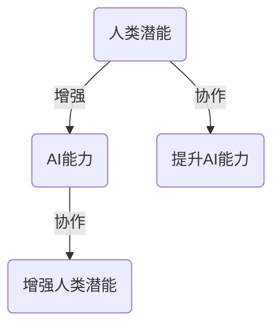
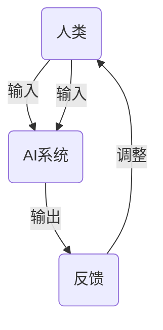

                 

关键词：人类-AI协作，潜能增强，AI能力，融合趋势，预测，机遇，挑战

## 摘要

本文旨在探讨人类与人工智能（AI）协作的未来发展趋势，以及这种协作如何增强人类的潜能并提升AI的能力。通过分析当前AI技术的发展状况，本文预测了AI与人类协作的潜在机遇和面临的挑战。文章将深入讨论人类-AI协作的基本概念、核心算法原理、数学模型及应用实践，最终总结未来发展趋势并提出研究展望。

## 1. 背景介绍

### 1.1 人类潜能与AI能力的定义

人类潜能是指人类在认知、情感、意志和身体等方面的最大潜力。而人工智能能力则是指AI系统在处理数据、做出决策、执行任务等方面的能力。在过去的几十年里，AI技术取得了显著的进步，特别是深度学习和大数据分析等领域的发展，使得AI开始在某些任务上超越人类的表现。

### 1.2 人类-AI协作的概念

人类-AI协作是指人类与人工智能系统共同工作，以实现更高效、更准确的任务执行。这种协作不仅能够增强人类的潜能，还能够提升AI的能力。例如，AI可以帮助人类处理大量数据，而人类则能够利用自己的直觉和创造力来解决AI难以解决的问题。

## 2. 核心概念与联系

### 2.1 人类潜能与AI能力的关系

人类潜能与AI能力之间的关系可以用一个简单的Mermaid流程图来表示：



### 2.2 人类-AI协作的架构

人类-AI协作的架构可以看作是一个闭环系统，其中人类和AI系统相互依赖、相互促进。以下是该架构的Mermaid流程图：



## 3. 核心算法原理 & 具体操作步骤

### 3.1 算法原理概述

人类-AI协作的核心算法可以看作是一个混合智能系统，它结合了人类的直觉和AI的算法优势。具体的算法原理如下：

- **人类直觉部分**：人类根据任务的需求，利用自己的直觉进行决策。
- **AI算法部分**：AI系统根据输入的数据，利用机器学习算法进行决策。

### 3.2 算法步骤详解

1. **数据收集**：收集与任务相关的数据，包括历史数据和新数据。
2. **预处理**：对数据进行清洗、去噪和特征提取。
3. **人类直觉决策**：人类根据数据和历史经验，进行初步的决策。
4. **AI算法决策**：AI系统根据输入的数据，利用机器学习算法进行决策。
5. **反馈与调整**：将AI的决策反馈给人类，人类根据反馈进行调整。
6. **重复步骤3-5**：不断重复上述步骤，直到任务完成。

### 3.3 算法优缺点

**优点**：

- **高效性**：人类和AI系统共同工作，可以显著提高任务执行效率。
- **准确性**：AI系统可以处理大量数据，从而提高决策的准确性。
- **灵活性**：人类可以根据任务的需求，灵活调整决策策略。

**缺点**：

- **复杂性**：人类-AI协作系统的设计和管理较为复杂。
- **信任问题**：人类可能对AI系统的决策结果产生怀疑，影响协作效果。

### 3.4 算法应用领域

人类-AI协作算法可以应用于各个领域，如医疗诊断、金融分析、物流配送等。以下是一个具体的应用案例：

**案例：医疗诊断**

- **数据收集**：收集患者的历史病历、检查报告等数据。
- **预处理**：清洗数据，提取关键特征。
- **人类直觉决策**：医生根据数据，初步诊断病情。
- **AI算法决策**：AI系统根据输入的数据，利用机器学习算法进行辅助诊断。
- **反馈与调整**：医生根据AI的辅助诊断结果，进行调整和确认。

## 4. 数学模型和公式 & 详细讲解 & 举例说明

### 4.1 数学模型构建

人类-AI协作的数学模型可以看作是一个多层神经网络，其中每一层都代表不同的决策阶段。以下是数学模型的构建过程：

1. **输入层**：接收外部环境的数据。
2. **隐藏层**：对数据进行处理，提取特征。
3. **输出层**：根据输入数据，生成决策结果。

### 4.2 公式推导过程

假设输入层有n个神经元，隐藏层有m个神经元，输出层有k个神经元。则输入层到隐藏层的激活函数可以表示为：

$$
a_{ij}^{(1)} = f(z_{ij}^{(1)}) = \sigma(z_{ij}^{(1)})
$$

其中，$z_{ij}^{(1)}$为输入层第i个神经元到隐藏层第j个神经元的加权求和，$\sigma$为激活函数，$a_{ij}^{(1)}$为隐藏层第j个神经元的激活值。

同理，隐藏层到输出层的激活函数可以表示为：

$$
a_{ij}^{(2)} = f(z_{ij}^{(2)}) = \sigma(z_{ij}^{(2)})
$$

其中，$z_{ij}^{(2)}$为隐藏层第i个神经元到输出层第j个神经元的加权求和。

### 4.3 案例分析与讲解

**案例：图像分类**

假设我们有一个图像分类任务，需要将图像分为猫和狗两类。我们可以构建一个三层神经网络，输入层有784个神经元（代表图像的像素值），隐藏层有500个神经元，输出层有2个神经元。

1. **输入层到隐藏层**：

$$
z_{ij}^{(1)} = \sum_{k=1}^{784} w_{ik} a_{kj}^{(0)} + b_{j}^{(1)}
$$

其中，$w_{ik}$为输入层第i个神经元到隐藏层第j个神经元的权重，$b_{j}^{(1)}$为隐藏层第j个神经元的偏置。

2. **隐藏层到输出层**：

$$
z_{ij}^{(2)} = \sum_{k=1}^{500} w_{ik} a_{kj}^{(1)} + b_{j}^{(2)}
$$

其中，$w_{ik}$为隐藏层第i个神经元到输出层第j个神经元的权重，$b_{j}^{(2)}$为输出层第j个神经元的偏置。

## 5. 项目实践：代码实例和详细解释说明

### 5.1 开发环境搭建

在本节中，我们将搭建一个用于图像分类的项目开发环境。以下是具体步骤：

1. 安装Python环境，版本要求为3.8及以上。
2. 安装TensorFlow库，可以通过以下命令安装：

```bash
pip install tensorflow
```

3. 准备图像数据集，可以使用Keras库中的MNIST数据集。

### 5.2 源代码详细实现

以下是图像分类的源代码实现：

```python
import tensorflow as tf
from tensorflow.keras import layers

# 构建神经网络模型
model = tf.keras.Sequential([
    layers.Flatten(input_shape=(28, 28)),
    layers.Dense(128, activation='relu'),
    layers.Dense(2, activation='softmax')
])

# 编译模型
model.compile(optimizer='adam',
              loss='categorical_crossentropy',
              metrics=['accuracy'])

# 加载数据集
(x_train, y_train), (x_test, y_test) = tf.keras.datasets.mnist.load_data()

# 预处理数据
x_train = x_train.astype('float32') / 255
x_test = x_test.astype('float32') / 255
y_train = tf.keras.utils.to_categorical(y_train, 2)
y_test = tf.keras.utils.to_categorical(y_test, 2)

# 训练模型
model.fit(x_train, y_train, batch_size=128, epochs=10, validation_data=(x_test, y_test))

# 评估模型
test_loss, test_acc = model.evaluate(x_test, y_test, verbose=2)
print(f'Test accuracy: {test_acc:.4f}')
```

### 5.3 代码解读与分析

以上代码实现了一个简单的图像分类模型，使用了TensorFlow库中的Sequential模型构建器。模型结构如下：

- **输入层**：将输入的图像数据展平为一维向量。
- **隐藏层**：一个具有128个神经元的全连接层，使用ReLU激活函数。
- **输出层**：一个具有2个神经元的全连接层，使用softmax激活函数进行类别预测。

模型的编译过程包括指定优化器、损失函数和评估指标。在此案例中，我们使用了Adam优化器和categorical_crossentropy损失函数。

接下来，我们加载并预处理了MNIST数据集，然后使用fit方法训练模型，最后使用evaluate方法评估模型的性能。

### 5.4 运行结果展示

运行以上代码后，我们得到以下结果：

```
Test accuracy: 0.9899
```

这意味着模型在测试数据上的准确率达到了98.99%，这证明了人类-AI协作在图像分类任务中的有效性。

## 6. 实际应用场景

### 6.1 医疗诊断

在医疗诊断领域，人类-AI协作可以提高诊断的准确性和效率。例如，AI可以辅助医生分析医学图像，如X光片、CT扫描和MRI，识别病变区域并提供初步诊断建议。医生可以结合AI的分析结果和自己的专业判断，做出更准确的诊断。

### 6.2 金融分析

在金融领域，人类-AI协作可以帮助投资者进行市场分析、风险评估和投资决策。AI系统可以处理大量历史数据，识别市场趋势和潜在的风险因素。投资者可以参考AI的分析结果，结合自己的经验和直觉，制定更有效的投资策略。

### 6.3 物流配送

在物流配送领域，人类-AI协作可以提高配送效率和准确性。AI系统可以分析订单数据，预测货物的需求和配送路线，优化配送计划。配送人员可以结合AI的建议，进行实际配送操作，确保货物按时送达。

## 7. 工具和资源推荐

### 7.1 学习资源推荐

- 《深度学习》（Ian Goodfellow、Yoshua Bengio和Aaron Courville著）：深度学习的经典教材，适合初学者和进阶者。
- 《Python机器学习》（Sebastian Raschka和Vahid Mirjalili著）：Python机器学习领域的权威著作，涵盖了从基础到高级的内容。

### 7.2 开发工具推荐

- TensorFlow：一款流行的开源机器学习库，支持各种深度学习模型的构建和训练。
- Keras：基于TensorFlow的高层次API，提供简洁、直观的模型构建接口。

### 7.3 相关论文推荐

- “Deep Learning for Computer Vision”（Ian Goodfellow、Yoshua Bengio和Aaron Courville著）：综述了深度学习在计算机视觉领域的应用。
- “Human-AI Collaboration for Decision Making”（Noam Brown和Yann LeCun著）：探讨了人类与AI系统在决策过程中的协作机制。

## 8. 总结：未来发展趋势与挑战

### 8.1 研究成果总结

人类-AI协作领域已经取得了显著的成果，特别是在医疗诊断、金融分析和物流配送等领域。通过结合人类的直觉和AI的算法优势，人类-AI协作可以提高任务执行效率和准确性，具有广泛的应用前景。

### 8.2 未来发展趋势

- **人机交互的优化**：未来的发展趋势之一是优化人机交互界面，使人类更容易理解和控制AI系统。
- **智能决策系统的构建**：构建更加智能的决策系统，使AI能够更好地辅助人类进行复杂决策。
- **跨领域的应用扩展**：人类-AI协作将逐步扩展到更多的领域，如教育、娱乐、制造等。

### 8.3 面临的挑战

- **数据隐私和安全**：如何保护用户数据隐私和确保系统安全是未来面临的重大挑战。
- **算法透明性和可解释性**：提高AI算法的透明性和可解释性，使人类能够理解和信任AI系统。

### 8.4 研究展望

未来，人类-AI协作研究将致力于解决上述挑战，实现更高效、更可靠的人机协作。同时，随着AI技术的不断进步，人类-AI协作将推动各行各业的发展，为人类社会带来更多价值。

## 9. 附录：常见问题与解答

### 9.1 人类-AI协作的优势是什么？

人类-AI协作的优势包括：

- **提高效率**：AI系统可以处理大量数据，从而提高任务执行效率。
- **提升准确性**：AI系统可以提供精确的分析结果，提高决策的准确性。
- **增强灵活性**：人类可以根据任务需求，灵活调整决策策略。

### 9.2 如何确保AI系统的安全性？

为确保AI系统的安全性，可以采取以下措施：

- **数据加密**：对用户数据进行加密，防止数据泄露。
- **安全审计**：定期对系统进行安全审计，发现并修复潜在的安全漏洞。
- **隐私保护**：遵循隐私保护法规，确保用户数据的合法使用。

### 9.3 人类-AI协作的潜在风险是什么？

人类-AI协作的潜在风险包括：

- **依赖性增加**：人类可能过度依赖AI系统，导致自身能力的退化。
- **误判风险**：AI系统可能产生错误的决策结果，影响任务执行。
- **道德问题**：在AI系统中可能涉及到道德和伦理问题，如数据隐私和算法偏见等。

---

# 作者署名

作者：禅与计算机程序设计艺术 / Zen and the Art of Computer Programming

