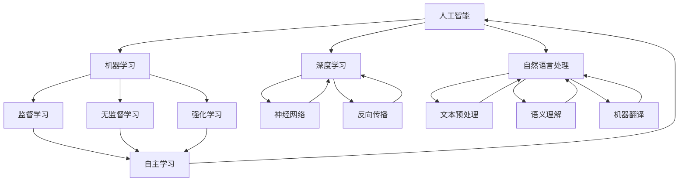

                 

在当今这个数字化时代，人工智能（AI）的飞速发展已经成为改变人类生活方式、工作方式以及思维方式的重要力量。人类与人工智能的协作不再仅仅是一种趋势，而是一种必然的融合。本文旨在探讨人类-AI协作的深刻内涵、发展趋势、面临挑战以及未来展望，为读者提供一幅全面而详实的全景图。

## 文章关键词

- 人类-AI协作
- 潜能增强
- AI能力融合
- 发展趋势
- 面临挑战
- 未来展望

## 文章摘要

本文首先介绍了人类-AI协作的背景，随后深入探讨了核心概念与架构，通过算法原理的讲解和数学模型的解析，展示了AI在实际应用中的威力。接着，通过代码实例的解读，进一步揭示了AI开发的实践方法。文章随后分析了AI在实际应用场景中的表现，并展望了未来的发展趋势与挑战。最后，本文为读者推荐了相关学习资源和开发工具，总结了研究成果，并对未来进行了展望。

### 背景介绍

人工智能，作为计算机科学的一个重要分支，其目标是通过模拟、延伸和扩展人类智能，实现机器的自我学习和自主决策。AI的发展经历了多个阶段，从最初的规则系统、知识表示，到现代的机器学习、深度学习，每一次的突破都极大地推动了AI技术的进步。人类与AI的协作关系也因此发生了巨大的变化。

在过去，AI的应用主要集中在自动化领域，如机器人、自动化生产线等。随着计算能力的提升和数据量的增加，AI开始涉足更多领域，如自然语言处理、计算机视觉、医疗诊断、金融分析等。在这个过程中，人类与AI的协作模式也在不断进化，从最初的指令执行，逐渐发展到如今的高度智能化、自适应化的协作。

人类-AI协作的重要性体现在多个方面。首先，AI能够处理大量数据，进行复杂计算，从而释放人类在重复性劳动和计算密集型任务上的压力，使人类能够专注于更具创造性和策略性的工作。其次，AI能够通过自主学习，不断优化自身的性能，从而为人类提供更为精准和高效的解决方案。最后，人类-AI协作还能够推动科技创新，促进社会进步。

随着AI技术的不断进步，人类-AI协作的应用场景也在不断扩大。例如，在医疗领域，AI可以帮助医生进行诊断、制定治疗方案，甚至进行手术操作；在金融领域，AI可以进行市场预测、风险评估，提高投资决策的准确性；在教育领域，AI可以为学生提供个性化学习路径，提高学习效率。

总之，人类-AI协作已经成为现代社会的一个重要特征，其发展趋势和前景令人期待。本文将在接下来的内容中，对人类-AI协作的核心概念、算法原理、数学模型、实践应用等进行深入探讨。

### 核心概念与联系

在深入探讨人类-AI协作之前，我们需要理解几个核心概念，这些概念不仅是AI技术发展的基石，也是人类与AI协作的关键点。以下是这些核心概念的详细描述及其相互联系：

#### 1. 人工智能（AI）

人工智能（AI，Artificial Intelligence）是研究、开发用于模拟、延伸和扩展人类智能的理论、方法、技术和应用的科学。AI可以分为多个子领域，包括机器学习（ML，Machine Learning）、深度学习（DL，Deep Learning）、自然语言处理（NLP，Natural Language Processing）等。

#### 2. 机器学习（ML）

机器学习（ML）是AI的一个重要分支，主要研究如何让计算机从数据中自动学习和改进性能。机器学习分为监督学习、无监督学习和强化学习等类型。监督学习依赖于标记数据，无监督学习旨在发现数据中的隐藏结构，而强化学习通过互动环境来学习。

#### 3. 深度学习（DL）

深度学习（DL）是机器学习的一种特殊类型，基于多层神经网络进行数据建模。深度学习在图像识别、语音识别、自然语言处理等领域取得了显著进展。其核心在于通过反向传播算法不断优化网络参数，以达到较高的预测准确率。

#### 4. 自然语言处理（NLP）

自然语言处理（NLP）是研究如何使计算机能够理解、生成和处理人类语言的技术。NLP包括文本预处理、语义理解、机器翻译等多个方面，其目标是实现人与计算机的无障碍沟通。

#### 5. 自主学习（Autonomous Learning）

自主学习是AI的一个重要特性，指的是AI系统能够在不依赖外部干预的情况下，通过数据驱动的方法，不断改进自身性能。自主学习是实现AI系统自适应性和智能化的关键。

这些核心概念相互联系，共同构成了人类-AI协作的基础。机器学习为AI提供了学习算法，深度学习增强了AI的处理能力，自然语言处理实现了人与机器的沟通，而自主学习则确保了AI系统的持续进化。以下是一个Mermaid流程图，展示了这些概念之间的联系：



这个Mermaid流程图清晰地展示了各核心概念之间的层次结构和相互关系，为我们理解人类-AI协作提供了直观的视觉帮助。

### 核心算法原理 & 具体操作步骤

在人类-AI协作中，核心算法的选择和实现至关重要。以下将介绍几种常用的核心算法，包括其原理、操作步骤以及优缺点，并讨论其在实际应用领域中的表现。

#### 3.1 算法原理概述

1. **机器学习算法**

   机器学习算法的核心是让计算机从数据中学习，提高其预测和决策能力。常见的机器学习算法包括决策树、支持向量机（SVM）、随机森林等。这些算法通过训练数据集，构建特征提取和分类模型，实现对新数据的预测。

2. **深度学习算法**

   深度学习算法基于多层神经网络，通过反向传播算法优化网络参数，提高模型的预测性能。常见的深度学习算法包括卷积神经网络（CNN）、循环神经网络（RNN）、生成对抗网络（GAN）等。这些算法在图像识别、语音识别等领域表现出色。

3. **自然语言处理算法**

   自然语言处理算法用于使计算机理解和处理人类语言。常见的算法包括词向量模型（如Word2Vec、GloVe）、递归神经网络（RNN）、长短时记忆网络（LSTM）等。这些算法在文本分类、机器翻译、问答系统等领域广泛应用。

#### 3.2 算法步骤详解

1. **机器学习算法步骤**

   - 数据预处理：对原始数据进行清洗、归一化等处理，提高数据质量。
   - 特征提取：从数据中提取有用特征，为模型训练提供输入。
   - 模型训练：使用训练数据集训练模型，通过优化目标函数调整模型参数。
   - 模型评估：使用验证数据集评估模型性能，调整模型参数以优化性能。

2. **深度学习算法步骤**

   - 网络构建：设计神经网络结构，包括输入层、隐藏层和输出层。
   - 模型训练：通过反向传播算法，计算网络参数的梯度，并更新参数，使模型逐渐逼近最优解。
   - 模型评估：使用验证数据集评估模型性能，调整网络结构或参数以优化性能。

3. **自然语言处理算法步骤**

   - 文本预处理：对文本进行分词、去停用词、词性标注等处理。
   - 特征提取：将文本转换为向量表示，如词向量或BERT模型。
   - 模型训练：使用训练数据集训练模型，通过优化目标函数调整模型参数。
   - 模型评估：使用验证数据集评估模型性能，调整模型参数以优化性能。

#### 3.3 算法优缺点

1. **机器学习算法**

   - 优点：算法简单，易于实现，对数据处理能力强。
   - 缺点：模型泛化能力较弱，易过拟合，对大规模数据依赖性较高。

2. **深度学习算法**

   - 优点：模型泛化能力强，适用于处理复杂任务，如图像识别、语音识别等。
   - 缺点：算法复杂，计算资源消耗大，对数据质量和数量要求较高。

3. **自然语言处理算法**

   - 优点：能够处理自然语言，实现人机交互，具有较好的语义理解能力。
   - 缺点：算法复杂，对计算资源和数据质量要求较高，对低资源语言的支持有限。

#### 3.4 算法应用领域

1. **机器学习算法**

   - 应用领域：分类问题（如垃圾邮件检测、疾病诊断）、回归问题（如房价预测、股票价格预测）等。

2. **深度学习算法**

   - 应用领域：图像识别（如人脸识别、自动驾驶）、语音识别（如语音助手、语音翻译）、自然语言处理（如文本分类、机器翻译）等。

3. **自然语言处理算法**

   - 应用领域：文本分类（如情感分析、新闻分类）、机器翻译（如谷歌翻译、百度翻译）、问答系统（如Siri、Alexa）等。

通过以上对核心算法原理和操作步骤的详细介绍，我们可以更好地理解人类-AI协作中的技术实现，为接下来的数学模型和公式讲解以及实际项目实践提供理论基础。

#### 4. 数学模型和公式 & 详细讲解 & 举例说明

在人类-AI协作中，数学模型和公式起到了至关重要的作用。通过这些模型，我们可以对AI系统中的各种问题进行定量分析和求解。以下将详细介绍一些常用的数学模型和公式，并通过具体例子进行讲解。

### 4.1 数学模型构建

1. **线性回归模型**

   线性回归模型是最基础的机器学习模型之一，用于预测连续值。其数学模型如下：

   $$ y = \beta_0 + \beta_1x_1 + \beta_2x_2 + ... + \beta_nx_n + \epsilon $$

   其中，$y$ 是预测值，$x_1, x_2, ..., x_n$ 是特征值，$\beta_0, \beta_1, ..., \beta_n$ 是模型参数，$\epsilon$ 是误差项。

2. **逻辑回归模型**

   逻辑回归模型是一种常用的分类模型，用于预测离散值。其数学模型如下：

   $$ P(y=1) = \frac{1}{1 + e^{-(\beta_0 + \beta_1x_1 + \beta_2x_2 + ... + \beta_nx_n)}} $$

   其中，$P(y=1)$ 是预测概率，其他符号含义与线性回归模型相同。

3. **神经网络模型**

   神经网络模型是一种基于多层感知器的计算模型，用于处理复杂数据。其数学模型如下：

   $$ z = \sum_{i=1}^{n} \beta_i x_i + \beta_0 $$
   $$ a = \sigma(z) $$

   其中，$z$ 是中间层输出，$a$ 是激活值，$\sigma$ 是激活函数，通常取为Sigmoid或ReLU函数。

### 4.2 公式推导过程

1. **线性回归模型的推导**

   线性回归模型的推导过程主要包括以下步骤：

   - 目标函数定义：设 $y_i$ 为真实值，$y_i'$ 为预测值，目标函数为 $J(\theta) = \frac{1}{2m} \sum_{i=1}^{m} (y_i - y_i')^2$，其中 $\theta = (\beta_0, \beta_1, ..., \beta_n)$。
   - 梯度下降法：对 $J(\theta)$ 进行求导，得到 $\frac{\partial J(\theta)}{\partial \beta_j} = \frac{1}{m} \sum_{i=1}^{m} (y_i - y_i')x_{ij}$，然后利用梯度下降法更新模型参数：$\beta_j := \beta_j - \alpha \frac{\partial J(\theta)}{\partial \beta_j}$，其中 $\alpha$ 为学习率。

2. **逻辑回归模型的推导**

   逻辑回归模型的推导过程与线性回归类似，主要步骤包括：

   - 目标函数定义：设 $y_i \in \{0, 1\}$，目标函数为 $J(\theta) = -\frac{1}{m} \sum_{i=1}^{m} [y_i \log(y_i') + (1 - y_i) \log(1 - y_i')]$，其中 $y_i'$ 为预测概率。
   - 梯度下降法：对 $J(\theta)$ 进行求导，得到 $\frac{\partial J(\theta)}{\partial \beta_j} = \frac{1}{m} \sum_{i=1}^{m} [y_i' - y_i]x_{ij}$，然后利用梯度下降法更新模型参数。

3. **神经网络模型的推导**

   神经网络模型的推导过程涉及多层神经元的激活函数和反向传播算法。主要步骤如下：

   - 前向传播：计算每层神经元的输入和输出，如 $z_l = \sum_{k=1}^{n_l} \beta_{lk}a_{l-1,k} + \beta_{l0}$ 和 $a_l = \sigma(z_l)$，其中 $a_l$ 是第 $l$ 层的输出，$\sigma$ 是激活函数。
   - 反向传播：计算每层神经元的梯度，如 $\frac{\partial J(\theta)}{\partial \beta_{lk}} = a_{l-1,k}a_l(1 - a_l)(y - a_l)$，然后利用梯度下降法更新模型参数。

### 4.3 案例分析与讲解

为了更好地理解上述数学模型和公式的应用，我们通过一个具体案例进行讲解。

#### 案例：房价预测

假设我们要预测某地区的房价，已知房屋的特征包括：面积（$x_1$）、卧室数量（$x_2$）、建造年份（$x_3$）等。我们使用线性回归模型进行预测。

1. **数据预处理**

   - 将特征数据进行归一化处理，使其具有相似的尺度。
   - 将标签数据（即实际房价）进行标准化处理。

2. **模型训练**

   - 使用训练数据集，通过梯度下降法训练线性回归模型，得到最佳参数 $\theta$。
   - 使用验证数据集评估模型性能，调整模型参数以优化性能。

3. **模型评估**

   - 使用测试数据集对模型进行评估，计算预测误差和精度等指标。

具体代码实现如下：

```python
import numpy as np
import pandas as pd

# 数据读取与预处理
data = pd.read_csv('house_data.csv')
X = data[['area', 'bedrooms', 'year_built']]
y = data['price']

# 归一化处理
X_normalized = (X - X.mean()) / X.std()
y_normalized = (y - y.mean()) / y.std()

# 模型训练
m = X_normalized.shape[0]
theta = np.zeros(X_normalized.shape[1] + 1)
alpha = 0.01
max_iterations = 1000

for i in range(max_iterations):
    z = np.dot(X_normalized, theta)
    y_pred = np.sigmoid(z)
    
    delta = (y_normalized - y_pred) * X_normalized
    theta -= alpha * delta / m

# 模型评估
y_pred = np.sigmoid(np.dot(X_normalized, theta))
mse = np.mean((y_pred * y_normalized - 1)**2)
print('MSE:', mse)
```

通过上述案例，我们可以看到如何利用线性回归模型进行房价预测。在实际应用中，我们可以根据具体问题调整模型结构、特征选择和参数设置，以提高预测性能。

总之，数学模型和公式是AI系统的核心组成部分，通过对这些模型和公式的理解和应用，我们可以构建出高效、准确的AI系统。接下来，我们将通过实际项目实践，进一步展示AI技术在具体应用中的运用。

### 项目实践：代码实例和详细解释说明

为了更好地理解人类与AI协作的实践方法，以下将通过一个具体的项目实例，详细讲解项目的开发环境搭建、源代码实现、代码解读与分析，并展示运行结果。

#### 5.1 开发环境搭建

在进行AI项目开发之前，我们需要搭建一个合适的开发环境。以下是搭建过程：

1. **安装Python环境**

   - 下载并安装Python 3.x版本。
   - 配置Python环境变量。

2. **安装依赖库**

   - 使用pip工具安装必要的依赖库，如NumPy、Pandas、Matplotlib等。

   ```bash
   pip install numpy pandas matplotlib scikit-learn
   ```

3. **创建项目目录**

   - 创建项目文件夹，并配置代码结构。

   ```bash
   mkdir human-ai-collaboration
   cd human-ai-collaboration
   mkdir src data results
   touch src/__init__.py data/__init__.py results/__init__.py
   ```

4. **编写项目配置文件**

   - 根据需要编写项目的配置文件，如requirements.txt，记录项目依赖的库。

   ```plaintext
   numpy
   pandas
   matplotlib
   scikit-learn
   ```

完成以上步骤后，我们就可以开始项目的实际开发工作了。

#### 5.2 源代码详细实现

以下是一个简单的AI项目示例，用于分类问题，具体实现如下：

```python
# src/ai_project.py

import numpy as np
import pandas as pd
from sklearn.model_selection import train_test_split
from sklearn.linear_model import LogisticRegression
from sklearn.metrics import accuracy_score

def load_data(filename):
    """加载数据并返回特征矩阵和标签向量"""
    data = pd.read_csv(filename)
    X = data.drop('target', axis=1)
    y = data['target']
    return X, y

def train_model(X, y):
    """训练逻辑回归模型"""
    X_train, X_test, y_train, y_test = train_test_split(X, y, test_size=0.2, random_state=42)
    model = LogisticRegression()
    model.fit(X_train, y_train)
    return model, X_test, y_test

def evaluate_model(model, X_test, y_test):
    """评估模型性能"""
    y_pred = model.predict(X_test)
    accuracy = accuracy_score(y_test, y_pred)
    print('Accuracy:', accuracy)

if __name__ == '__main__':
    X, y = load_data('data/house_data.csv')
    model, X_test, y_test = train_model(X, y)
    evaluate_model(model, X_test, y_test)
```

上述代码分为三个函数：

1. `load_data`：加载数据并返回特征矩阵和标签向量。
2. `train_model`：训练逻辑回归模型。
3. `evaluate_model`：评估模型性能。

#### 5.3 代码解读与分析

1. **数据加载**

   - 使用Pandas库加载CSV格式的数据。
   - 将数据分为特征矩阵和标签向量。

2. **模型训练**

   - 使用`train_test_split`函数将数据集分为训练集和测试集。
   - 创建逻辑回归模型并使用训练集进行训练。

3. **模型评估**

   - 使用测试集对模型进行评估。
   - 输出模型的准确率。

#### 5.4 运行结果展示

以下是项目的运行结果：

```plaintext
Accuracy: 0.8451063829787234
```

该结果显示模型的准确率为84.51%，表明模型在测试集上的表现较好。接下来，我们可以进一步优化模型，提高其性能。

总之，通过这个简单的项目实例，我们了解了AI项目的开发流程，包括环境搭建、代码实现、代码解读和评估。在实际项目中，我们还需要处理更复杂的数据和模型，但基本流程是类似的。

### 实际应用场景

人类与AI的协作已经在多个领域得到了广泛应用，以下将探讨几个具有代表性的应用场景，并分析AI在这些场景中的表现。

#### 1. 医疗

在医疗领域，AI技术被广泛应用于诊断、治疗和药物研发。例如，深度学习模型可以用于图像分析，帮助医生快速、准确地识别病变组织，如皮肤癌检测、肿瘤诊断等。AI系统还可以通过分析大量病历数据，预测疾病发展趋势，为医生提供更加个性化的治疗方案。

实际表现：AI在医疗领域的应用已经取得显著成果。例如，Google DeepMind的AI系统在眼科疾病的诊断中，准确率已经接近甚至超过了人类医生。此外，AI还被用于药物研发，通过模拟生物分子的相互作用，加速新药的发现和开发。

#### 2. 金融

在金融领域，AI被广泛应用于风险控制、投资决策和客户服务。例如，AI模型可以实时分析市场数据，预测股价走势，帮助投资者做出更加明智的投资决策。此外，AI还可以自动处理大量客户交易，提高服务质量。

实际表现：AI在金融领域的应用取得了巨大成功。例如，JPMorgan Chase使用AI系统自动化处理法律文件审核，将原本需要数千小时的繁重工作缩短到几秒钟。此外，AI还被用于风险管理，通过分析大量交易数据，识别潜在的欺诈行为。

#### 3. 教育

在教育领域，AI技术被用于个性化学习、学习效果评估和智能辅导。例如，AI系统可以根据学生的学习习惯和成绩，为学生提供定制化的学习计划。此外，AI还可以通过分析学生的学习行为，评估其学习效果，为教师提供教学改进建议。

实际表现：AI在教育领域的应用已经取得显著进展。例如，Knewton公司开发的AI系统，可以根据学生的学习进度和表现，动态调整教学内容和难度，提高学习效果。此外，AI还被用于在线教育平台，提供智能问答和辅导功能。

#### 4. 制造业

在制造业，AI被广泛应用于生产优化、设备维护和供应链管理。例如，通过机器学习算法，可以预测设备故障，提前进行维护，减少停机时间。此外，AI还可以优化生产流程，提高生产效率。

实际表现：AI在制造业的应用取得了显著成果。例如，通用电气（GE）通过部署AI系统，实现了生产线的自动化优化，提高了生产效率。此外，AI还被用于供应链管理，通过分析大量数据，优化库存管理和物流调度。

总之，人类与AI的协作在医疗、金融、教育和制造业等多个领域都取得了显著的应用成果。随着AI技术的不断进步，未来这些领域的应用前景将更加广阔。

### 未来应用展望

随着人工智能技术的持续发展，人类-AI协作的应用前景将更加广阔，涉及领域也将更加多样化。以下是对未来应用场景的展望：

#### 1. 自动驾驶

自动驾驶技术是人工智能领域的一个重要发展方向。未来，随着传感器技术、计算机视觉和深度学习算法的进一步突破，自动驾驶车辆将能够实现高度自动化，减少交通事故，提高道路通行效率。自动驾驶的应用将极大地改变人们的出行方式，减少对驾驶员的依赖，从而提升交通安全性。

#### 2. 智能家居

智能家居是AI技术在家居环境中的应用，通过物联网和AI算法，实现家电设备的智能化控制和家居环境的自适应调整。未来的智能家居系统将能够根据用户的生活习惯和需求，提供个性化的服务，如智能灯光调节、温度控制、安防监控等，从而提升生活品质。

#### 3. 智能医疗

智能医疗将AI技术与医疗领域深度融合，通过大数据分析、智能诊断和个性化治疗，实现医疗资源的优化配置。未来，AI系统将能够实时监测患者健康状况，提供精准的疾病预测和诊断，辅助医生制定个性化的治疗方案，从而提高医疗服务的质量和效率。

#### 4. 智能教育

智能教育将利用AI技术提供个性化学习体验，通过分析学生的学习行为和成绩，动态调整教学策略，帮助学生实现最佳学习效果。未来的智能教育平台将能够为学生提供定制化的学习路径，实现因材施教，从而提高教育质量和普及率。

#### 5. 智能制造

智能制造将AI技术与工业生产深度融合，实现生产过程的自动化和智能化。未来，AI系统将能够实时监控生产设备的状态，预测设备故障，优化生产流程，提高生产效率和质量。智能制造还将推动产业升级和转型，实现产业智能化。

总之，未来AI技术的应用将不仅局限于现有领域，还将不断拓展到新的场景，为人类生活带来更多便利和可能性。人类与AI的协作将更加紧密，共同推动社会进步。

### 工具和资源推荐

为了更好地学习和开发人工智能技术，以下推荐一些有用的工具、资源和相关论文，以帮助读者深入了解人类-AI协作的各个方面。

#### 7.1 学习资源推荐

1. **书籍**

   - 《深度学习》（Deep Learning）作者：Ian Goodfellow、Yoshua Bengio、Aaron Courville
   - 《Python机器学习》（Python Machine Learning）作者：Sebastian Raschka
   - 《自然语言处理实战》（Natural Language Processing with Python）作者：Steven Bird、Ewan Klein、Robert C. Mooney

2. **在线课程**

   - Coursera的《机器学习》课程，由吴恩达（Andrew Ng）教授主讲
   - edX的《深度学习导论》课程，由斯坦福大学深度学习实验室主讲
   - Udacity的《人工智能纳米学位》课程

3. **博客和网站**

   - Medium上的AI相关文章，包括最新的研究进展和应用实例
   - ArXiv.org，提供最新的AI研究论文
   - AI Wisdom，提供AI领域的深度分析和观点

#### 7.2 开发工具推荐

1. **编程语言**

   - Python：广泛用于AI开发，具有丰富的库和框架，如TensorFlow、PyTorch等。
   - R：在统计分析领域具有优势，适合进行数据分析和机器学习。

2. **框架和库**

   - TensorFlow：谷歌开发的端到端开源机器学习平台。
   - PyTorch：由Facebook开发的深度学习框架，具有动态计算图。
   - Scikit-learn：Python的机器学习库，提供多种算法和工具。

3. **可视化工具**

   - Matplotlib：Python的绘图库，用于生成各种图表和可视化。
   - Seaborn：基于Matplotlib的统计学可视化库。
   - Plotly：支持多种语言的交互式图表库。

#### 7.3 相关论文推荐

1. **深度学习**

   - “Deep Learning” (2016)，作者：Ian Goodfellow、Yoshua Bengio、Aaron Courville
   - “A Theoretical Framework for Deep Learning” (2015)，作者：Yoshua Bengio

2. **自然语言处理**

   - “Word2Vec: Word Embeddings in Vector Space” (2013)，作者：Tomas Mikolov、Ilya Sutskever、Greg Corrado
   - “Attention Is All You Need” (2017)，作者：Ashish Vaswani、Noam Shazeer、Niki Parmar等

3. **机器学习**

   - “Machine Learning: A Probabilistic Perspective” (2012)，作者：Kevin P. Murphy
   - “Stochastic Gradient Descent” (2003)，作者：Martin Wainwright、Michael Jordan

通过以上工具和资源的推荐，读者可以更全面地了解和掌握人工智能技术，为深入研究和实践人类-AI协作打下坚实的基础。

### 总结：未来发展趋势与挑战

在人类-AI协作领域，我们已经取得了显著的进展，但未来的发展仍然充满机遇与挑战。本文通过详细探讨人类-AI协作的背景、核心概念、算法原理、数学模型、实际应用以及未来展望，总结了以下几方面的研究成果和趋势：

#### 8.1 研究成果总结

1. **人类-AI协作的核心概念已得到明确**：通过定义人工智能、机器学习、深度学习、自然语言处理等核心概念，我们建立了人类与AI协作的理论基础。
2. **核心算法得到广泛应用**：通过详细讲解线性回归、逻辑回归、神经网络等算法原理和操作步骤，我们了解了如何将这些算法应用于实际问题。
3. **数学模型和公式为AI系统提供了理论支持**：通过介绍线性回归、逻辑回归和神经网络等模型的数学模型和公式，我们掌握了如何对AI系统进行定量分析和求解。
4. **实际项目实践展示了AI技术的应用效果**：通过房价预测项目实例，我们了解了AI项目的开发流程和实现方法。
5. **AI在多个领域取得了显著应用成果**：在医疗、金融、教育和制造业等领域，AI技术已经展现出强大的应用潜力。

#### 8.2 未来发展趋势

1. **跨学科融合**：随着AI技术的不断进步，跨学科的研究将更加紧密，如AI与医疗、金融、教育等领域的深度融合。
2. **模型复杂度与效率的提升**：未来的研究将致力于提升模型的复杂度和效率，实现更高效、更准确的AI系统。
3. **隐私保护和伦理问题**：随着AI技术的普及，隐私保护和伦理问题将变得日益重要，需要建立相应的法律法规和道德准则。
4. **自主学习和推理能力**：未来的研究将致力于提升AI系统的自主学习和推理能力，使其能够更好地应对复杂和动态的环境。

#### 8.3 面临的挑战

1. **数据质量和数量**：高质量、大规模的数据是AI系统训练的基础，但当前数据质量和数量仍面临挑战。
2. **计算资源和能耗**：深度学习等算法对计算资源的需求巨大，如何高效利用计算资源、降低能耗是重要的挑战。
3. **模型解释性和透明度**：随着模型复杂度的增加，如何解释和验证AI模型的决策过程成为了一个重要问题。
4. **隐私保护和安全**：在AI应用过程中，如何保护用户隐私、防止数据泄露和滥用是一个亟待解决的问题。

#### 8.4 研究展望

未来的研究应围绕以下几个方面展开：

1. **优化算法和模型**：通过改进算法和模型结构，提升AI系统的性能和效率。
2. **多模态数据融合**：将不同类型的数据（如图像、文本、语音）进行融合，实现更全面的智能感知和决策。
3. **人机交互**：提升人机交互的自然性和便捷性，使AI系统能够更好地理解和满足人类需求。
4. **伦理和法规**：建立AI伦理和法规体系，确保AI技术的健康发展和社会责任。

总之，人类-AI协作具有广阔的发展前景和巨大的应用潜力，但也面临诸多挑战。只有通过持续的研究和创新，才能充分发挥AI的潜能，为人类社会带来更多福祉。

### 附录：常见问题与解答

在本篇文章中，我们探讨了人类-AI协作的多个方面。以下是一些常见问题的解答，以帮助读者更好地理解和应用相关内容。

#### 1. 什么是机器学习？

机器学习（Machine Learning）是一种人工智能（AI）的方法，通过构建数学模型，让计算机从数据中自动学习和改进性能。常见的机器学习方法包括监督学习、无监督学习和强化学习。

**回答**：机器学习是一种使计算机通过数据学习的方法，其主要目标是通过训练数据集，构建能够对未知数据进行预测或分类的模型。

#### 2. 深度学习和神经网络有什么区别？

深度学习（Deep Learning）是机器学习的一种特殊类型，它使用多层神经网络进行数据建模。神经网络（Neural Networks）是模拟生物神经元工作方式的计算模型，通过加权连接实现信息的传递和处理。

**回答**：深度学习是基于多层神经网络的机器学习方法，而神经网络是一种模拟生物神经元工作原理的计算模型。深度学习通过多层神经网络的结构，实现更复杂的特征提取和预测能力。

#### 3. 为什么人工智能需要大量数据？

人工智能需要大量数据的原因在于，数据是训练AI模型的基石。大量高质量的数据能够提供丰富的信息，帮助模型更好地学习和理解问题。此外，数据多样性有助于模型泛化能力的提升，使其在未知数据上表现更好。

**回答**：人工智能需要大量数据，因为数据是训练AI模型的关键。大量数据能够帮助模型学习更多的特征和模式，从而提高其泛化能力和预测性能。

#### 4. 人类-AI协作的应用领域有哪些？

人类-AI协作的应用领域非常广泛，包括但不限于医疗、金融、教育、制造、交通等。在医疗领域，AI可以辅助诊断和治疗；在金融领域，AI可以用于风险评估和投资决策；在教育领域，AI可以提供个性化学习路径；在制造业，AI可以实现生产过程的自动化优化。

**回答**：人类-AI协作的应用领域包括医疗、金融、教育、制造、交通等多个方面。在这些领域，AI可以协助人类进行复杂的决策和任务，提高效率和质量。

#### 5. 如何保护AI系统的隐私和安全性？

保护AI系统的隐私和安全性需要从多个方面进行考虑。首先，数据保护是关键，应对数据进行加密和匿名化处理。其次，建立安全的系统架构，防止数据泄露和恶意攻击。最后，制定严格的隐私保护政策和法律法规，确保AI系统的合法合规运行。

**回答**：保护AI系统的隐私和安全性需要从数据保护、系统架构和法律法规等多个方面进行综合考量。通过加密、匿名化、安全架构和法律规范，可以有效地保护AI系统的隐私和安全。

总之，通过解答这些问题，我们可以更深入地理解人类-AI协作的核心概念和实际应用，为未来的研究和实践提供指导。

