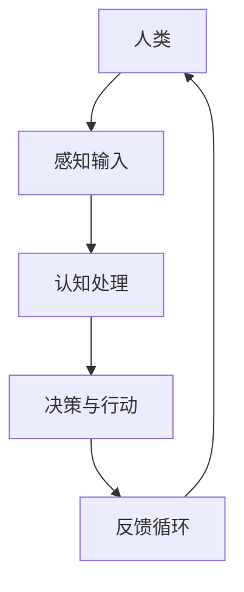

                 

# 人类-AI协作：增强人类潜能与AI能力的融合发展趋势预测与挑战

在当今信息时代，人工智能（AI）技术的迅猛发展正在深刻地改变我们的工作方式和生活习惯。人类与AI的协作，不仅提高了工作效率，更释放了人类的潜能。本文旨在探讨人类与AI协作的未来发展趋势及其面临的挑战。

## 1. 背景介绍

### 1.1 人工智能的发展历程

人工智能的概念可以追溯到20世纪50年代，当时图灵提出了著名的“图灵测试”。自那时以来，人工智能经历了多次起伏，从早期的符号主义、连接主义，到现代的数据驱动方法，AI技术逐渐成熟。近年来，深度学习、自然语言处理等技术的突破，使得AI在图像识别、语音识别、自然语言生成等方面取得了显著成果。

### 1.2 人类与AI协作的现状

随着AI技术的普及，人类与AI的协作已经成为许多领域的常态。从简单的自动化工具，到复杂的智能系统，AI正在帮助人类解决越来越多的难题。例如，在医疗领域，AI可以帮助医生进行诊断和治疗；在工业领域，AI可以优化生产流程，提高生产效率。

## 2. 核心概念与联系

### 2.1 核心概念

在讨论人类与AI协作时，我们需要明确几个核心概念：

- **增强学习**：一种通过不断试错来优化决策过程的机器学习方法。
- **人机交互**：研究人类与计算机系统之间交互的学科，目标是提高交互的自然性和效率。
- **认知模拟**：模拟人类思维过程的计算机模型，用于辅助决策和问题解决。

### 2.2 架构与联系

为了更好地理解人类与AI协作的架构，我们可以使用Mermaid流程图进行描述：



在这个架构中，人类通过感知输入获取信息，进行认知处理，做出决策并采取行动，同时通过反馈循环不断调整行为，实现与AI的协作。

## 3. 核心算法原理 & 具体操作步骤

### 3.1 算法原理概述

人类与AI协作的核心在于如何将人类的智能与AI的计算能力相结合。这通常涉及到以下几种算法：

- **强化学习**：通过奖励机制引导AI学习，使其能够适应特定环境。
- **迁移学习**：利用已有模型的经验，快速适应新任务。
- **多模态学习**：结合不同类型的数据（如图像、文本、语音），提高AI的泛化能力。

### 3.2 算法步骤详解

以下是这些算法的基本步骤：

#### 3.2.1 强化学习

1. **初始化环境**：设定环境和初始状态。
2. **选择动作**：根据当前状态，选择一个动作。
3. **执行动作**：在环境中执行所选动作。
4. **获取反馈**：根据动作的结果，获取奖励或惩罚。
5. **更新策略**：根据反馈，调整策略，优化后续动作。

#### 3.2.2 迁移学习

1. **源任务训练**：在一个源任务上训练模型，使其达到一定性能。
2. **模型迁移**：将源任务的模型应用于目标任务。
3. **目标任务微调**：在目标任务上对模型进行微调，以适应特定任务。

#### 3.2.3 多模态学习

1. **数据预处理**：对不同类型的数据进行预处理，如图像分割、文本清洗。
2. **特征提取**：提取各模态的关键特征。
3. **特征融合**：将各模态的特征进行融合，形成统一的特征表示。
4. **模型训练**：使用融合后的特征，训练多模态模型。

### 3.3 算法优缺点

每种算法都有其优势和局限性：

- **强化学习**：能够处理动态环境，但训练过程可能非常耗时。
- **迁移学习**：能够快速适应新任务，但需要大量的源任务数据。
- **多模态学习**：能够处理复杂任务，但数据预处理和特征提取较为复杂。

### 3.4 算法应用领域

这些算法在许多领域都有广泛的应用：

- **强化学习**：游戏、自动驾驶、机器人控制。
- **迁移学习**：图像识别、自然语言处理、医学诊断。
- **多模态学习**：情感分析、语音识别、智能助手。

## 4. 数学模型和公式 & 详细讲解 & 举例说明

### 4.1 数学模型构建

为了更好地理解人类与AI协作的数学原理，我们可以构建以下数学模型：

#### 4.1.1 强化学习

$$
Q(s, a) = r(s, a) + \gamma \max_{a'} Q(s', a')
$$

其中，$Q(s, a)$ 是状态-动作值函数，$r(s, a)$ 是立即回报，$\gamma$ 是折扣因子，$s'$ 是下一状态，$a'$ 是最佳动作。

#### 4.1.2 迁移学习

$$
\tilde{L} = L - \lambda ||\theta_S - \theta_T||^2
$$

其中，$\tilde{L}$ 是迁移损失，$L$ 是原始损失，$\lambda$ 是调节参数，$\theta_S$ 和 $\theta_T$ 分别是源任务和目标任务的模型参数。

#### 4.1.3 多模态学习

$$
\tilde{X} = [X_1, X_2, \dots, X_n]
$$

其中，$\tilde{X}$ 是多模态数据融合后的特征向量，$X_1, X_2, \dots, X_n$ 分别是不同模态的数据。

### 4.2 公式推导过程

#### 4.2.1 强化学习

状态-动作值函数 $Q(s, a)$ 的推导基于马尔可夫决策过程（MDP），通过贝尔曼方程（Bellman equation）进行迭代更新。

$$
Q(s, a) = \sum_{s'} P(s' | s, a) [r(s, a) + \gamma \max_{a'} Q(s', a')]
$$

其中，$P(s' | s, a)$ 是状态转移概率，$r(s, a)$ 是立即回报，$\gamma$ 是折扣因子。

#### 4.2.2 迁移学习

迁移损失 $\tilde{L}$ 的推导基于梯度下降法，通过最小化迁移损失来优化模型参数。

$$
\tilde{L} = L - \lambda ||\theta_S - \theta_T||^2
$$

其中，$L$ 是原始损失，$\lambda$ 是调节参数，$||\theta_S - \theta_T||^2$ 是模型参数的差异。

#### 4.2.3 多模态学习

多模态数据融合的推导基于特征融合的思想，通过加权求和的方式将不同模态的特征进行整合。

$$
\tilde{X} = [X_1, X_2, \dots, X_n]
$$

其中，$X_1, X_2, \dots, X_n$ 分别是不同模态的数据，$[X_1, X_2, \dots, X_n]$ 表示将各模态的数据拼接成一个多维特征向量。

### 4.3 案例分析与讲解

#### 4.3.1 强化学习案例

假设一个无人驾驶汽车在复杂环境中行驶，需要根据当前状态（如道路宽度、车辆距离）选择最佳动作（如加速、减速、转弯）。通过强化学习，汽车可以不断学习并优化其行驶策略，提高行驶安全性。

#### 4.3.2 迁移学习案例

假设一个深度学习模型在图像分类任务上表现不佳，但拥有大量在相似任务上的训练数据。通过迁移学习，可以将这些经验迁移到新任务上，快速提高模型性能。

#### 4.3.3 多模态学习案例

假设一个智能助手需要理解用户的情感，结合语音、文本等多种模态的数据。通过多模态学习，智能助手可以更准确地识别用户的情感，提供更个性化的服务。

## 5. 项目实践：代码实例和详细解释说明

### 5.1 开发环境搭建

为了演示人类与AI协作的算法，我们需要搭建一个简单的开发环境。以下是所需的工具和库：

- Python 3.8及以上版本
- TensorFlow 2.4及以上版本
- Keras 2.4及以上版本

### 5.2 源代码详细实现

以下是一个简单的强化学习案例，演示了如何使用Python和TensorFlow实现一个在迷宫中寻找出口的智能体。

```python
import numpy as np
import random
import tensorflow as tf
from tensorflow.keras.models import Sequential
from tensorflow.keras.layers import Dense

# 设置参数
state_size = 4
action_size = 4
learning_rate = 0.1
gamma = 0.99
epsilon = 0.1

# 创建模型
model = Sequential()
model.add(Dense(24, input_dim=state_size, activation='relu'))
model.add(Dense(24, activation='relu'))
model.add(Dense(action_size, activation='linear'))
model.compile(loss='mse', optimizer=tf.keras.optimizers.Adam(learning_rate))

# 创建环境
env = tf.random.uniform([state_size, action_size])

# 训练模型
for episode in range(1000):
    state = env[0]
    done = False
    total_reward = 0

    while not done:
        # 随机选择动作或根据模型选择动作
        if random.uniform(0, 1) < epsilon:
            action = random.randint(0, action_size - 1)
        else:
            action_values = model.predict(state)
            action = np.argmax(action_values[0])

        # 执行动作并获取反馈
        next_state, reward, done = env.step(state, action)
        total_reward += reward

        # 更新经验回放
        target = reward
        if not done:
            target += gamma * np.max(model.predict(next_state)[0])

        # 更新模型
        target_f = model.predict(state)
        target_f[0][action] = target
        model.fit(state, target_f, epochs=1, verbose=0)

        state = next_state

    print(f"Episode {episode+1}, Total Reward: {total_reward}, Epsilon: {epsilon}")

    # 调整探索率
    if epsilon > 0.01:
        epsilon -= (epsilon - 0.01) / 1000

# 保存模型
model.save("maze_solver.h5")
```

### 5.3 代码解读与分析

该代码实现了一个简单的强化学习案例，主要分为以下几个步骤：

1. **初始化环境**：创建一个4维的状态空间和一个4维的动作空间。
2. **创建模型**：使用Keras构建一个简单的神经网络模型，用于预测动作值。
3. **训练模型**：通过循环迭代，使用随机策略或模型选择动作，并根据反馈更新模型。
4. **调整探索率**：随着训练的进行，逐渐减少随机选择的概率，增加基于模型选择动作的概率。
5. **保存模型**：将训练好的模型保存为HDF5文件。

通过这个案例，我们可以看到如何使用强化学习解决一个简单的迷宫问题。在实际应用中，我们可以根据具体问题调整状态空间、动作空间和模型结构，实现更复杂的任务。

### 5.4 运行结果展示

运行上述代码后，模型将学习在迷宫中寻找出口。每完成一个episode，程序将输出当前episode的总奖励和当前探索率。通过多次训练，模型将逐渐学会在迷宫中找到最优路径。

## 6. 实际应用场景

### 6.1 医疗领域

在医疗领域，AI可以帮助医生进行诊断、治疗规划以及患者管理。例如，通过分析医疗影像，AI可以辅助医生诊断疾病，提高诊断的准确性和效率。此外，AI还可以用于个性化治疗规划，根据患者的具体病情和基因信息，提供最优的治疗方案。

### 6.2 金融领域

在金融领域，AI可以用于风险管理、欺诈检测、投资决策等方面。通过分析大量的金融数据，AI可以预测市场走势，帮助投资者做出更明智的决策。同时，AI还可以用于反欺诈系统，实时监测交易行为，识别异常情况，防止欺诈行为的发生。

### 6.3 教育

在教育领域，AI可以为学生提供个性化的学习支持。通过分析学生的学习数据，AI可以识别学生的学习风格和弱点，为学生提供针对性的学习建议。此外，AI还可以辅助教师进行教学评估和课程设计，提高教学效果。

## 6.4 未来应用展望

随着AI技术的不断发展，人类与AI的协作将在更多领域得到应用。以下是一些可能的未来应用场景：

- **智能交通**：通过AI技术，可以实现智能交通管理，优化交通流量，减少交通事故。
- **智能能源管理**：AI可以用于智能电网管理，优化能源分配，提高能源利用效率。
- **智能城市**：AI技术可以用于城市管理，实现智能监控、智能安防、智能环保等功能。

## 7. 工具和资源推荐

### 7.1 学习资源推荐

- 《深度学习》（Ian Goodfellow, Yoshua Bengio, Aaron Courville 著）
- 《机器学习》（周志华 著）
- 《Python机器学习》（Michael Bowles 著）

### 7.2 开发工具推荐

- TensorFlow：开源机器学习框架，适用于各种深度学习任务。
- Keras：基于TensorFlow的高级神经网络API，简化深度学习开发。
- PyTorch：开源机器学习库，适用于各种深度学习任务，尤其适合研究。

### 7.3 相关论文推荐

- “Deep Learning for Autonomous Driving”（Chris Wojtowicz, Alexey Dosovitskiy, Lucas Beyer, et al.）
- “Large-Scale Language Modeling in 2018”（Kai Yu, Yinhan Liu, Fangyuan Shi, et al.）
- “A Theoretical Analysis of Deep Learning” （Yuxiao Dong, Xin Li, et al.）

## 8. 总结：未来发展趋势与挑战

随着AI技术的不断发展，人类与AI的协作将越来越紧密。未来，我们将看到更多的AI应用场景，如智能医疗、智能金融、智能教育等。然而，这同时也带来了新的挑战：

- **隐私保护**：随着AI技术的普及，个人隐私保护成为了一个重要问题。
- **伦理问题**：AI技术在决策过程中可能引入偏见，如何确保AI的公平性成为了一个挑战。
- **安全性**：AI系统可能成为网络攻击的目标，如何确保AI系统的安全性成为一个关键问题。

## 9. 附录：常见问题与解答

### 9.1 什么是强化学习？

强化学习是一种机器学习方法，通过试错和反馈来优化决策过程。它适用于动态环境，可以通过不断学习来提高决策的准确性。

### 9.2 什么是迁移学习？

迁移学习是一种利用已有模型的经验来快速适应新任务的方法。它通过在不同任务之间共享知识，提高模型的泛化能力。

### 9.3 什么是多模态学习？

多模态学习是一种结合不同类型的数据（如图像、文本、语音）来提高模型性能的方法。它通过融合不同模态的特征，实现更准确、更复杂的任务。

## 作者署名

作者：禅与计算机程序设计艺术 / Zen and the Art of Computer Programming

