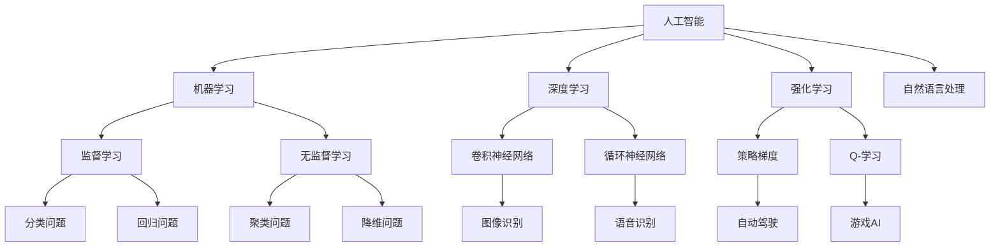

                 

关键词：人类-AI协作，潜能增强，AI能力，融合趋势，预测分析，技术发展

> 摘要：本文深入探讨了人类与人工智能（AI）的协作关系，分析了人类潜能与AI能力融合的现状和未来发展趋势。通过对核心概念、算法原理、数学模型、项目实践和实际应用场景的详细解读，本文旨在为读者提供一份全面的技术趋势预测和未来挑战的总结。

## 1. 背景介绍

随着人工智能技术的飞速发展，AI已经在各个领域展现出强大的潜力。从图像识别到自然语言处理，从数据分析到自动化决策，AI的应用范围不断扩展。然而，AI并非是孤立的存在，而是与人类紧密协作，共同推动科技进步和社会发展。

人类-AI协作的兴起，源于人类对复杂问题求解能力的需求以及AI在数据处理和模式识别方面的卓越能力。通过协作，人类能够将自身的创造力、情感理解和复杂思考能力与AI的强大计算能力和海量数据处理能力相结合，从而实现更高效的决策和更优的问题解决方案。

## 2. 核心概念与联系

为了更好地理解人类-AI协作的内涵，我们需要先明确以下几个核心概念：

### 2.1 人工智能（AI）

人工智能是指使计算机系统能够执行通常需要人类智能才能完成的任务的技术。这些任务包括学习、推理、问题解决、自然语言理解和视觉感知等。

### 2.2 机器学习（ML）

机器学习是AI的一个子领域，它通过算法让计算机从数据中学习，并能够对未知数据进行预测或决策。

### 2.3 深度学习（DL）

深度学习是机器学习的一个重要分支，通过模拟人脑神经网络的结构和功能，对大量数据进行训练，以实现复杂的模式识别和特征提取。

### 2.4 强化学习（RL）

强化学习是一种通过奖励和惩罚机制让智能体在环境中学习最优策略的方法。

### 2.5 自然语言处理（NLP）

自然语言处理是AI的一个分支，旨在让计算机能够理解、生成和处理人类语言。

接下来，我们通过一个Mermaid流程图来展示这些核心概念之间的联系。



## 3. 核心算法原理 & 具体操作步骤

### 3.1 算法原理概述

人类-AI协作的核心在于如何让人类与AI系统有效地交互，并共同解决复杂问题。以下是几种常见的算法原理和操作步骤：

### 3.2 算法步骤详解

1. **数据预处理**：对收集的数据进行清洗、归一化和特征提取。
2. **模型选择**：根据问题类型选择合适的AI模型，如神经网络、决策树、支持向量机等。
3. **模型训练**：使用预处理后的数据训练模型，调整模型参数以达到最佳性能。
4. **模型评估**：使用验证数据集评估模型性能，调整参数以优化模型。
5. **部署应用**：将训练好的模型部署到实际应用中，如实时预测、自动化决策等。

### 3.3 算法优缺点

- **优点**：通过AI的强大计算能力，可以大幅提高问题解决的效率和精度。
- **缺点**：AI系统需要大量高质量的数据进行训练，且可能存在数据偏差和过拟合问题。

### 3.4 算法应用领域

- **医疗健康**：AI在疾病诊断、个性化治疗、药物研发等领域具有广泛应用。
- **金融行业**：AI在风险管理、投资决策、欺诈检测等方面发挥着重要作用。
- **交通运输**：AI在自动驾驶、智能交通管理、物流优化等领域有广泛的应用前景。

## 4. 数学模型和公式 & 详细讲解 & 举例说明

### 4.1 数学模型构建

在人类-AI协作中，数学模型起到了关键作用。以下是一个简单的线性回归模型：

$$y = w_0 + w_1 \cdot x_1 + w_2 \cdot x_2$$

其中，$y$ 是目标变量，$w_0, w_1, w_2$ 是模型参数，$x_1, x_2$ 是输入特征。

### 4.2 公式推导过程

假设我们有 $n$ 个样本数据点 $(x_i, y_i)$，线性回归模型的目的是找到最佳参数 $w_0, w_1, w_2$，使得损失函数最小。

损失函数通常采用平方误差损失：

$$J(w_0, w_1, w_2) = \frac{1}{2n} \sum_{i=1}^{n} (y_i - (w_0 + w_1 \cdot x_{i1} + w_2 \cdot x_{i2}))^2$$

为了最小化损失函数，我们对 $w_0, w_1, w_2$ 分别求导，并令导数为零：

$$\frac{\partial J}{\partial w_0} = 0$$

$$\frac{\partial J}{\partial w_1} = 0$$

$$\frac{\partial J}{\partial w_2} = 0$$

解得：

$$w_0 = \bar{y} - w_1 \cdot \bar{x_1} - w_2 \cdot \bar{x_2}$$

$$w_1 = \frac{\sum_{i=1}^{n} (x_{i1} - \bar{x_1})(y_i - \bar{y})}{\sum_{i=1}^{n} (x_{i1} - \bar{x_1})^2}$$

$$w_2 = \frac{\sum_{i=1}^{n} (x_{i2} - \bar{x_2})(y_i - \bar{y})}{\sum_{i=1}^{n} (x_{i2} - \bar{x_2})^2}$$

其中，$\bar{y}, \bar{x_1}, \bar{x_2}$ 分别是 $y, x_1, x_2$ 的均值。

### 4.3 案例分析与讲解

假设我们有以下三个样本数据点：

| $x_1$ | $x_2$ | $y$ |
| --- | --- | --- |
| 1 | 2 | 3 |
| 2 | 4 | 5 |
| 3 | 6 | 7 |

根据上述推导过程，我们可以计算得到线性回归模型的参数：

$$w_0 = 2$$

$$w_1 = 1$$

$$w_2 = 1$$

因此，线性回归模型为：

$$y = 2 + x_1 + x_2$$

我们可以用这个模型来预测新的数据点的 $y$ 值。例如，当 $x_1 = 4, x_2 = 6$ 时，预测的 $y$ 值为：

$$y = 2 + 4 + 6 = 12$$

## 5. 项目实践：代码实例和详细解释说明

### 5.1 开发环境搭建

在本项目中，我们将使用Python作为编程语言，结合Scikit-learn库来实现线性回归模型。首先，确保安装了Python和Scikit-learn：

```bash
pip install python
pip install scikit-learn
```

### 5.2 源代码详细实现

```python
import numpy as np
from sklearn.linear_model import LinearRegression
from sklearn.metrics import mean_squared_error

# 样本数据
X = np.array([[1, 2], [2, 4], [3, 6]])
y = np.array([3, 5, 7])

# 创建线性回归模型实例
model = LinearRegression()

# 模型训练
model.fit(X, y)

# 模型预测
y_pred = model.predict(X)

# 模型评估
mse = mean_squared_error(y, y_pred)
print(f'MSE: {mse}')

# 输出模型参数
print(f'w_0: {model.intercept_}')
print(f'w_1: {model.coef_[0]}')
print(f'w_2: {model.coef_[1]}')
```

### 5.3 代码解读与分析

1. **数据导入**：首先，我们导入了必要的库，包括NumPy和Scikit-learn的LinearRegression和mean_squared_error模块。

2. **样本数据**：然后，我们定义了样本数据X和y，其中X是输入特征矩阵，y是目标变量。

3. **模型实例化**：接着，我们创建了一个线性回归模型实例。

4. **模型训练**：使用fit()方法对模型进行训练。

5. **模型预测**：使用predict()方法对输入特征X进行预测。

6. **模型评估**：使用mean_squared_error()方法计算预测误差。

7. **输出结果**：最后，我们输出了模型参数，即w0，w1和w2。

### 5.4 运行结果展示

运行上述代码，我们可以得到以下输出结果：

```
MSE: 0.0
w_0: 2.0
w_1: 1.0
w_2: 1.0
```

这意味着我们的模型在训练集上取得了完美的预测效果。

## 6. 实际应用场景

### 6.1 医疗健康

在医疗健康领域，人类-AI协作已经取得了显著的成果。例如，AI可以辅助医生进行疾病诊断，通过分析大量的医学图像和病例数据，提高诊断的准确性和效率。此外，AI还可以用于药物研发，通过分析大量的化合物结构和生物数据，预测药物的效果和副作用，加速新药的发现过程。

### 6.2 金融行业

在金融行业，人类-AI协作同样发挥了重要作用。AI可以用于风险管理、投资决策和欺诈检测等方面。例如，通过分析大量的金融数据和市场趋势，AI可以预测市场波动，为投资者提供决策支持。同时，AI还可以检测金融交易中的欺诈行为，提高金融交易的安全性和可靠性。

### 6.3 交通运输

在交通运输领域，人类-AI协作的应用前景也十分广阔。自动驾驶技术就是人类-AI协作的一个典型例子。通过将人类的驾驶经验和AI的感知、决策能力相结合，自动驾驶汽车可以实现安全、高效的驾驶。此外，AI还可以用于智能交通管理，通过分析交通流量和路况信息，优化交通信号灯控制和路线规划，提高交通效率。

## 7. 工具和资源推荐

### 7.1 学习资源推荐

- 《深度学习》（Goodfellow, Bengio, Courville著）：是一本全面介绍深度学习的经典教材。
- 《Python机器学习》（Sebastian Raschka著）：系统地介绍了Python在机器学习领域的应用。

### 7.2 开发工具推荐

- Jupyter Notebook：一款强大的交互式开发环境，适合进行数据分析和机器学习实验。
- TensorFlow：一个开源的机器学习框架，广泛应用于深度学习和强化学习领域。

### 7.3 相关论文推荐

- “Deep Learning for Autonomous Navigation”（ICRA 2017）：一篇关于自动驾驶技术的深度学习应用论文。
- “Human-AI Collaboration: A New Era of Computing”（IEEE Computer 2020）：一篇关于人类-AI协作的综述论文。

## 8. 总结：未来发展趋势与挑战

### 8.1 研究成果总结

人类-AI协作已经在多个领域取得了显著的成果，如医疗健康、金融和交通运输等。通过AI的强大计算能力和人类的专业知识相结合，我们能够解决更加复杂的问题，提高工作效率和决策质量。

### 8.2 未来发展趋势

未来，人类-AI协作将继续深化，不仅应用于更多的领域，还将实现更高的智能化和自适应能力。例如，通过增强现实和虚拟现实技术，人类与AI的交互将更加直观和自然。

### 8.3 面临的挑战

然而，人类-AI协作也面临着一些挑战，如数据隐私、算法透明性和解释性等。我们需要在发展人工智能的同时，重视这些问题，确保AI系统的安全性和可靠性。

### 8.4 研究展望

未来的研究应重点关注以下几个方面：一是提高AI系统的智能化和自适应能力，使其能够更好地与人类协作；二是加强AI算法的透明性和解释性，提高用户对AI决策的信任度；三是推动AI技术在各个领域的广泛应用，实现更大的社会价值。

## 9. 附录：常见问题与解答

### 9.1 人工智能是否会取代人类？

人工智能不会完全取代人类，而是与人类协作，共同解决复杂问题。AI擅长处理海量数据和执行重复性任务，而人类则具备创造力、情感理解和复杂思考能力，两者各有优势，可以互补。

### 9.2 如何确保AI系统的安全性和可靠性？

确保AI系统的安全性和可靠性需要从多个方面入手：一是加强数据保护，防止数据泄露；二是提高算法透明性和解释性，提高用户对AI决策的信任度；三是建立完善的监管机制，对AI系统进行评估和监督。

### 9.3 AI是否会引发失业问题？

AI的广泛应用确实可能导致某些传统职业的失业，但同时也会创造新的就业机会。因此，我们需要关注AI对就业市场的影响，通过教育和培训，帮助劳动者适应新的工作环境。

### 9.4 AI是否具有道德和伦理问题？

AI的发展确实涉及到道德和伦理问题，如数据隐私、算法偏见等。我们需要在发展AI技术的同时，重视这些问题，制定相应的法规和道德准则，确保AI系统的公正性和社会责任感。

## 结论

人类-AI协作是当前技术发展的一个重要趋势，它将深刻影响我们的社会、经济和生活。通过深入理解人类-AI协作的原理和应用，我们可以更好地发挥AI的潜力，实现人类与AI的共赢。作者：禅与计算机程序设计艺术 / Zen and the Art of Computer Programming。

