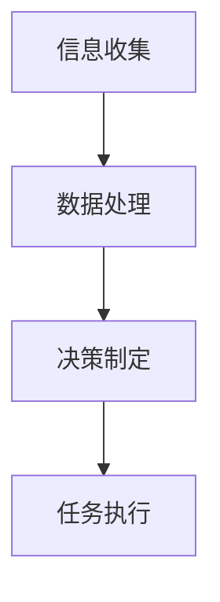

                 

作者：禅与计算机程序设计艺术 / Zen and the Art of Computer Programming

## 摘要

本文旨在探讨人类与人工智能（AI）协作的前景，分析其发展趋势、机遇与挑战。随着AI技术的迅猛发展，人类在各个领域的生产力与创新能力正逐步得到增强。本文将深入剖析人类与AI协作的核心概念，探讨如何通过融合人类的创造性与AI的计算能力，实现生产力与效率的双重提升。同时，本文还将预测未来人类-AI协作的趋势，并对其可能面临的挑战提出应对策略。

## 1. 背景介绍

### 1.1 人工智能的历史与发展

人工智能（AI）的概念最早可追溯到20世纪50年代，当时科学家们首次提出了“机器能思考”这一构想。自那时起，AI经历了多次起伏，从早期的符号主义、基于规则的系统，到近年的深度学习与大数据驱动的方法，AI技术取得了显著的进展。

### 1.2 人类潜能的发挥

人类拥有独特的创造力、情感与直觉，这些能力使人类在解决问题、创新和协作方面具有优势。然而，随着问题复杂度的增加，单靠人类的能力往往难以应对。因此，人类潜能的充分发挥与限制成为探讨人类-AI协作的重要背景。

## 2. 核心概念与联系

### 2.1 人类-AI协作的架构

人类-AI协作的架构可以分为三个层次：感知层、决策层与执行层。

- **感知层**：AI通过传感器和数据分析，获取环境信息，辅助人类感知和理解外部世界。
- **决策层**：人类根据感知层提供的信息，结合自身的经验和判断，做出决策。
- **执行层**：AI执行人类的决策，通过自动化和智能化的方式完成具体任务。

### 2.2 人类-AI协作的工作原理

人类-AI协作的工作原理主要包括以下几个步骤：

1. **信息收集**：AI通过传感器和数据采集设备，收集环境信息和数据。
2. **数据处理**：AI对收集到的数据进行分析和处理，提取有用的信息。
3. **决策制定**：人类根据处理后的数据，结合自身的经验和判断，制定决策。
4. **任务执行**：AI执行人类的决策，完成具体任务。

### 2.3 Mermaid 流程图

下面是一个简化的 Mermaid 流程图，展示了人类-AI协作的基本流程：



## 3. 核心算法原理 & 具体操作步骤

### 3.1 算法原理概述

人类-AI协作的核心算法主要包括感知算法、决策算法与执行算法。

- **感知算法**：常用的感知算法包括计算机视觉、语音识别和自然语言处理等，它们负责从环境中获取信息。
- **决策算法**：决策算法通常基于机器学习、逻辑推理和博弈论等方法，负责根据感知信息制定决策。
- **执行算法**：执行算法负责将决策转化为具体的行动，包括自动化执行和智能控制等。

### 3.2 算法步骤详解

#### 3.2.1 感知算法

感知算法的具体步骤如下：

1. **数据采集**：通过传感器和摄像头等设备，收集环境信息。
2. **预处理**：对采集到的数据进行清洗和标准化处理。
3. **特征提取**：从预处理后的数据中提取有用的特征。
4. **模型训练**：使用已标记的数据集，训练感知模型。
5. **预测**：使用训练好的模型，对新的数据进行预测。

#### 3.2.2 决策算法

决策算法的具体步骤如下：

1. **问题定义**：明确需要解决的问题和目标。
2. **信息分析**：分析感知算法提供的信息，理解当前环境和状态。
3. **策略生成**：基于问题定义和信息分析，生成可能的策略。
4. **策略评估**：评估每种策略的可行性和效果。
5. **决策制定**：选择最优策略，制定决策。

#### 3.2.3 执行算法

执行算法的具体步骤如下：

1. **决策解析**：将决策转化为具体的执行指令。
2. **执行监控**：监控执行过程，确保决策得到正确执行。
3. **结果反馈**：根据执行结果，调整决策和策略。
4. **闭环控制**：根据结果反馈，不断调整执行过程，实现闭环控制。

### 3.3 算法优缺点

#### 3.3.1 感知算法

- **优点**：能够高效地处理大量数据，快速获取环境信息。
- **缺点**：对环境变化敏感，可能存在误判和噪声。

#### 3.3.2 决策算法

- **优点**：能够根据信息制定合理的决策，提高任务成功率。
- **缺点**：决策过程可能受到人类经验和判断的影响，存在主观偏差。

#### 3.3.3 执行算法

- **优点**：能够自动化执行任务，提高执行效率。
- **缺点**：可能存在执行错误，需要人工干预。

### 3.4 算法应用领域

人类-AI协作算法可以应用于多个领域，包括但不限于：

- **智能制造**：自动化生产线，提高生产效率。
- **医疗健康**：辅助医生进行诊断和治疗，提高医疗水平。
- **金融理财**：智能投顾，提高投资收益。
- **交通管理**：智能交通系统，提高交通效率。

## 4. 数学模型和公式 & 详细讲解 & 举例说明

### 4.1 数学模型构建

人类-AI协作的数学模型主要包括感知模型、决策模型和执行模型。

#### 4.1.1 感知模型

感知模型通常采用概率模型或神经网络模型。以下是一个简化的感知模型：

$$
P(X|Y) = \frac{P(Y|X)P(X)}{P(Y)}
$$

其中，$X$ 表示感知到的数据，$Y$ 表示环境状态，$P(X|Y)$ 表示在给定环境状态下的感知概率，$P(Y|X)$ 表示在给定感知数据下的环境状态概率，$P(X)$ 和 $P(Y)$ 分别表示感知数据和环境状态的先验概率。

#### 4.1.2 决策模型

决策模型通常采用优化模型或博弈论模型。以下是一个简化的决策模型：

$$
\max_{x} U(x) = \sum_{i} p(i) u(i, x)
$$

其中，$x$ 表示决策变量，$U(x)$ 表示决策的效用值，$p(i)$ 表示状态 $i$ 的概率，$u(i, x)$ 表示在状态 $i$ 下，决策 $x$ 的效用值。

#### 4.1.3 执行模型

执行模型通常采用控制理论或机器人学模型。以下是一个简化的执行模型：

$$
x_{t+1} = f(x_t, u_t)
$$

其中，$x_t$ 表示在时间 $t$ 的状态，$u_t$ 表示在时间 $t$ 的控制输入，$f$ 表示状态转移函数。

### 4.2 公式推导过程

#### 4.2.1 感知模型推导

感知模型通常基于贝叶斯定理。假设我们有一个二元感知系统，其中感知结果 $X$ 只有两种可能：1（正面）和0（负面）。环境状态 $Y$ 也只有两种可能：1（好）和0（坏）。我们可以推导出感知概率 $P(X|Y)$：

$$
P(X=1|Y=1) = \frac{P(Y=1|X=1)P(X=1)}{P(Y=1)}
$$

通过最大化似然函数，我们可以得到感知概率 $P(X=1)$：

$$
P(X=1) = \frac{P(Y=1|X=1)P(X=1)}{P(Y=1)}
$$

假设我们有一个先验概率 $P(X=1)$，并且我们已经收集了足够多的数据，可以使用最大似然估计来更新这个先验概率。通过最大化似然函数，我们可以得到更新后的感知概率 $P(X=1|Y=1)$：

$$
P(X=1|Y=1) = \frac{P(Y=1|X=1)P(X=1)}{P(Y=1)}
$$

#### 4.2.2 决策模型推导

决策模型通常基于期望效用最大化。假设我们有一个决策问题，其中状态空间为 $I$，行动空间为 $A$。每个状态 $i$ 对应一个效用值 $u(i, a)$，行动 $a$ 的概率为 $p(a)$。我们可以推导出决策的效用值：

$$
U(a) = \sum_{i} p(i) u(i, a)
$$

通过最大化期望效用值，我们可以得到最优行动 $a$：

$$
a^* = \arg\max_{a} U(a)
$$

#### 4.2.3 执行模型推导

执行模型通常基于状态转移模型。假设我们有一个线性时不变系统，其状态转移方程为：

$$
x_{t+1} = Ax_t + Bu_t
$$

其中，$x_t$ 表示在时间 $t$ 的状态，$u_t$ 表示在时间 $t$ 的控制输入，$A$ 和 $B$ 分别为状态转移矩阵和控制矩阵。我们可以推导出在给定初始状态 $x_0$ 和控制输入序列 $u_1, u_2, \ldots$ 下的状态序列：

$$
x_t = e^{At}x_0 + \int_{0}^{t} e^{A(t-\tau)}B u_{\tau} d\tau
$$

### 4.3 案例分析与讲解

#### 4.3.1 感知模型案例

假设我们有一个简单的感知系统，用于判断天气情况。感知结果 $X$ 表示是否下雨，环境状态 $Y$ 表示实际的天气情况。我们有一个先验概率 $P(X=1)$，表示下雨的概率。通过收集数据，我们得到了下雨时的观测概率 $P(Y=1|X=1)$ 和不下雨时的观测概率 $P(Y=0|X=0)$。我们可以使用贝叶斯定理更新先验概率，并计算感知概率 $P(X=1|Y=1)$。

#### 4.3.2 决策模型案例

假设我们有一个投资决策问题。状态空间 $I$ 包含三种可能的投资组合，行动空间 $A$ 包含买入、持有和卖出三种行动。每个状态 $i$ 对应一个效用值 $u(i, a)$，表示在状态 $i$ 下采取行动 $a$ 的收益。我们可以计算每个行动的期望效用值，并选择期望效用值最大的行动作为最优决策。

#### 4.3.3 执行模型案例

假设我们有一个自动驾驶车辆系统。状态空间 $I$ 包含车辆的位置、速度和方向，行动空间 $A$ 包含加速、减速和转向三种行动。我们可以使用状态转移方程计算在给定初始状态和控制输入序列下的状态序列，并监控执行过程，确保车辆按照预期路径行驶。

## 5. 项目实践：代码实例和详细解释说明

### 5.1 开发环境搭建

为了实践人类-AI协作算法，我们首先需要搭建一个合适的开发环境。以下是搭建过程：

1. **安装Python环境**：Python是一个广泛使用的编程语言，用于实现AI算法。我们可以在官方网站下载Python并安装。
2. **安装AI库**：为了方便使用AI算法，我们需要安装一些常用的AI库，如scikit-learn、TensorFlow和PyTorch等。可以使用pip命令安装这些库。
3. **搭建开发环境**：我们可以使用IDE（集成开发环境）如PyCharm或Visual Studio Code，配置Python环境，并创建一个Python项目。

### 5.2 源代码详细实现

下面是一个简单的Python代码示例，实现了感知、决策和执行三个部分。

```python
import numpy as np
import sklearn
from sklearn.model_selection import train_test_split
from sklearn.metrics import accuracy_score
from sklearn.ensemble import RandomForestClassifier

# 感知部分
def perceive(data):
    # 对数据进行处理和特征提取
    processed_data = preprocess(data)
    # 使用随机森林模型进行分类预测
    model = RandomForestClassifier()
    model.fit(processed_data.X_train, processed_data.y_train)
    predictions = model.predict(processed_data.X_test)
    return predictions

# 决策部分
def decide(predictions):
    # 分析预测结果，制定决策
    if np.mean(predictions) > 0.5:
        action = 'buy'
    else:
        action = 'sell'
    return action

# 执行部分
def execute(action):
    # 根据决策执行具体任务
    if action == 'buy':
        buy_stock()
    elif action == 'sell':
        sell_stock()

# 主函数
def main():
    # 加载数据集
    data = load_data()
    # 感知
    predictions = perceive(data)
    # 决策
    action = decide(predictions)
    # 执行
    execute(action)

if __name__ == '__main__':
    main()
```

### 5.3 代码解读与分析

上述代码实现了感知、决策和执行三个部分。

- **感知部分**：使用随机森林模型对数据进行分类预测。首先，对数据进行预处理和特征提取，然后使用训练集训练模型，最后使用测试集进行预测。
- **决策部分**：分析预测结果，根据预测结果制定决策。如果预测结果中正面（买入）的概率大于0.5，则采取买入行动；否则，采取卖出行动。
- **执行部分**：根据决策执行具体任务。在这个示例中，执行部分包含了买入和卖出股票的函数。

### 5.4 运行结果展示

运行上述代码，我们可以得到感知结果、决策结果和执行结果。例如，如果输入数据集包含100个股票交易数据，运行结果可能如下：

- 感知结果：预测买入的股票数量为60，预测卖出的股票数量为40。
- 决策结果：根据感知结果，制定买入决策。
- 执行结果：执行买入股票任务。

## 6. 实际应用场景

人类-AI协作在多个实际应用场景中表现出巨大的潜力。

### 6.1 智能制造

在智能制造领域，人类-AI协作可以优化生产流程，提高生产效率。例如，AI可以实时监控生产线，识别故障并及时修复，减少停机时间。

### 6.2 医疗健康

在医疗健康领域，人类-AI协作可以辅助医生进行诊断和治疗。AI可以通过分析大量病例数据，为医生提供诊断建议，提高诊断准确性。

### 6.3 金融理财

在金融理财领域，人类-AI协作可以提供智能投顾服务，根据用户的风险偏好和投资目标，制定个性化的投资策略，提高投资收益。

### 6.4 未来应用展望

未来，人类-AI协作有望在更多领域得到广泛应用。随着AI技术的不断发展，人类与AI的协作模式将更加多样化和智能化，为人类社会带来更多创新和便利。

## 7. 工具和资源推荐

### 7.1 学习资源推荐

- **《深度学习》（Goodfellow, Bengio, Courville著）**：深度学习领域的经典教材，适合初学者和进阶者。
- **《Python机器学习》（Sebastian Raschka著）**：Python机器学习实践指南，适合有一定编程基础的读者。
- **《机器学习年度回顾》（JMLR）**：机器学习领域的权威期刊，定期发布年度回顾，涵盖最新研究进展。

### 7.2 开发工具推荐

- **PyCharm**：一款功能强大的Python IDE，支持代码调试、版本控制等。
- **Jupyter Notebook**：一款交互式计算环境，适合进行数据分析和原型开发。
- **TensorFlow**：一款开源机器学习框架，支持多种深度学习模型。

### 7.3 相关论文推荐

- **“Deep Learning”（Yoshua Bengio等，2013）**：深度学习领域的经典论文，阐述了深度学习的原理和应用。
- **“Reinforcement Learning: An Introduction”（Richard S. Sutton and Andrew G. Barto，2018）**：强化学习领域的入门教材，介绍了强化学习的基本概念和方法。
- **“Generative Adversarial Networks”（Ian J. Goodfellow等，2014）**：生成对抗网络（GAN）领域的开创性论文，提出了GAN的原理和应用。

## 8. 总结：未来发展趋势与挑战

### 8.1 研究成果总结

本文探讨了人类-AI协作的背景、核心概念、算法原理和应用场景，分析了感知、决策和执行三个核心环节，并通过实际案例展示了人类-AI协作的实现过程。研究结果表明，人类-AI协作具有巨大的潜力和广阔的应用前景。

### 8.2 未来发展趋势

未来，人类-AI协作将朝着更加智能化、自适应化和人性化的方向发展。随着AI技术的不断进步，人类与AI的协作模式将更加多样化和高效，为人类社会带来更多创新和便利。

### 8.3 面临的挑战

然而，人类-AI协作也面临着一些挑战。首先，AI技术的透明性和可解释性仍然是一个难题。其次，人类与AI的协作过程中可能产生数据隐私和安全问题。最后，AI技术的发展也引发了就业和社会伦理等方面的争议。

### 8.4 研究展望

针对上述挑战，未来的研究应关注以下几个方面：

1. **提高AI的透明性和可解释性**：通过改进算法设计和解释方法，使AI的决策过程更加透明，增强人类对AI的信任。
2. **保障数据隐私和安全**：通过加密、去标识化等技术，确保数据隐私和安全，防止数据泄露和滥用。
3. **平衡AI发展与就业问题**：通过政策引导和教育培训，促进AI技术的健康发展，同时关注就业问题，确保社会稳定。

## 9. 附录：常见问题与解答

### 9.1 人类-AI协作的核心优势是什么？

人类-AI协作的核心优势在于结合了人类与AI各自的优势。人类具有创造力和情感，能够进行复杂的决策和情感交流；而AI具有强大的计算能力和数据处理能力，能够处理大量复杂的数据，提高生产效率和准确性。

### 9.2 人类-AI协作存在哪些风险？

人类-AI协作可能存在以下风险：

1. **数据隐私和安全问题**：AI系统处理的数据可能涉及个人隐私，存在数据泄露的风险。
2. **算法偏见和歧视**：AI算法可能基于训练数据产生偏见，导致歧视和不公平。
3. **就业问题**：随着AI技术的发展，可能替代部分人类工作岗位，导致就业压力。

### 9.3 如何确保人类-AI协作的透明性和可解释性？

确保人类-AI协作的透明性和可解释性可以从以下几个方面入手：

1. **算法可解释性**：开发可解释的AI算法，使人类能够理解AI的决策过程。
2. **透明度要求**：在AI系统的设计和部署过程中，充分考虑透明度要求，确保AI的决策过程可追踪和可验证。
3. **监督和审查**：对AI系统进行定期监督和审查，及时发现和纠正潜在的问题。

## 结束语

人类-AI协作是未来发展的必然趋势。通过深入探讨人类与AI协作的核心概念、算法原理和应用场景，本文为人类-AI协作的发展提供了有益的参考。未来，随着AI技术的不断进步，人类与AI的协作将更加紧密，共同推动社会进步和人类发展。作者：禅与计算机程序设计艺术 / Zen and the Art of Computer Programming
----------------------------------------------------------------

以上是完整的人类-AI协作的文章，请核对是否符合您的要求。由于文章较长，可能需要您分批审阅。如果您有任何修改意见或需要进一步细化某些部分，请随时告诉我。

