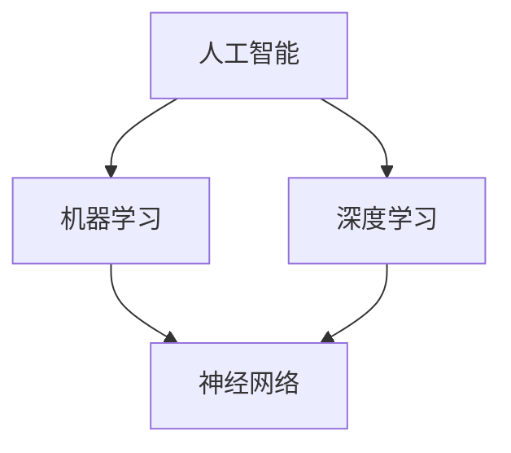

                 

关键词：人工智能，人类潜能，AI协作，发展趋势，机遇，挑战

> 摘要：本文从人工智能与人类潜能结合的视角出发，探讨了人类-AI协作的发展趋势、机遇与挑战。通过对核心概念、算法原理、数学模型、项目实践以及应用场景的详细分析，为未来的研究提供了有益的参考。

## 1. 背景介绍

随着人工智能技术的迅猛发展，人类与AI的协作成为了一个备受关注的话题。人类-AI协作不仅仅是一种技术手段，更是一种对人类潜能的全面释放与提升。通过AI的辅助，人类可以在处理复杂问题时更加高效、准确，从而实现潜能的增强。然而，人类-AI协作也面临着诸多挑战，如伦理、安全、隐私等问题。因此，探讨人类-AI协作的发展趋势、机遇与挑战具有重要的现实意义。

### 1.1 人工智能的发展历程

人工智能（AI）是一门融合了计算机科学、数学、统计学、神经科学等多个领域的交叉学科。其发展历程可以分为以下几个阶段：

- **理论探索期**：20世纪50年代，人工智能的概念首次被提出，引发了学术界对智能本质的探讨。
- **算法创新期**：20世纪80年代，随着计算机硬件的快速发展，人工智能开始进入实际应用阶段，涌现出许多经典的算法，如决策树、支持向量机等。
- **应用推广期**：21世纪初，深度学习算法的出现使人工智能进入了一个新的发展阶段，AI在图像识别、自然语言处理、推荐系统等领域取得了显著成果。

### 1.2 人类潜能的概念与重要性

人类潜能是指人类在认知、情感、行为等方面所具有的潜在能力。随着社会的发展，人类对于潜能的认识逐渐深入，认识到潜能的发挥对于个人成长、社会发展具有重要意义。通过教育、培训、实践等途径，人类可以不断挖掘和提升自身的潜能。

### 1.3 人类-AI协作的背景与意义

在人工智能时代，人类与AI的协作已经成为一种趋势。通过AI的辅助，人类可以在处理复杂问题时更加高效、准确。同时，人类-AI协作也为人类潜能的发挥提供了新的途径。以下是人类-AI协作的几个关键点：

- **信息处理**：AI可以处理大量的数据，为人类提供有价值的信息，帮助人类更好地理解和决策。
- **知识共享**：AI可以快速获取和传播知识，促进人类之间的知识共享和交流。
- **任务辅助**：AI可以协助人类完成重复性、繁琐的任务，使人类有更多时间和精力投入到创造性工作中。
- **创新推动**：AI可以激发人类的创造力，推动社会的发展和创新。

## 2. 核心概念与联系

在探讨人类-AI协作时，我们需要了解一些核心概念，如人工智能、机器学习、深度学习等。下面将使用Mermaid流程图来展示这些核心概念之间的联系。



### 2.1 人工智能（AI）

人工智能（AI）是指使计算机具备人类智能的技术，包括感知、学习、推理、规划、通信等能力。

### 2.2 机器学习（ML）

机器学习（ML）是人工智能的一个分支，通过算法让计算机从数据中自动学习并改进性能。

### 2.3 深度学习（DL）

深度学习（DL）是机器学习的一种方法，通过多层神经网络模拟人脑的学习过程。

### 2.4 神经网络（NN）

神经网络（NN）是深度学习的基础，由大量的神经元组成，通过层层传递信息来实现学习。

## 3. 核心算法原理 & 具体操作步骤

### 3.1 算法原理概述

人类-AI协作的核心算法主要包括机器学习算法和深度学习算法。以下分别介绍这两种算法的原理。

### 3.2 算法步骤详解

#### 3.2.1 机器学习算法

机器学习算法主要包括以下步骤：

1. 数据收集：收集大量的数据，用于训练模型。
2. 特征提取：从数据中提取出有用的特征，用于训练模型。
3. 模型训练：使用提取的特征训练模型，使其能够对新的数据进行分类或预测。
4. 模型评估：使用测试集对模型进行评估，以确定其性能。
5. 模型优化：根据评估结果调整模型参数，以提升模型性能。

#### 3.2.2 深度学习算法

深度学习算法主要包括以下步骤：

1. 数据预处理：对数据进行预处理，包括归一化、标准化等操作。
2. 网络构建：构建深度神经网络，包括输入层、隐藏层和输出层。
3. 模型训练：使用训练数据进行模型训练，通过反向传播算法不断调整网络参数。
4. 模型评估：使用测试数据进行模型评估，以确定其性能。
5. 模型优化：根据评估结果调整模型参数，以提升模型性能。

### 3.3 算法优缺点

#### 3.3.1 机器学习算法

优点：

- 可以处理大量数据。
- 可以对复杂问题进行建模。

缺点：

- 需要大量的特征工程。
- 模型泛化能力较弱。

#### 3.3.2 深度学习算法

优点：

- 可以自动提取特征。
- 泛化能力较强。

缺点：

- 训练过程复杂，需要大量计算资源。
- 对数据分布敏感。

### 3.4 算法应用领域

#### 3.4.1 机器学习算法

机器学习算法广泛应用于图像识别、自然语言处理、推荐系统等领域。

#### 3.4.2 深度学习算法

深度学习算法在计算机视觉、语音识别、自然语言处理等领域取得了显著成果。

## 4. 数学模型和公式 & 详细讲解 & 举例说明

在人类-AI协作中，数学模型和公式起着关键作用。以下将介绍一些常用的数学模型和公式，并进行详细讲解和举例说明。

### 4.1 数学模型构建

人类-AI协作的数学模型主要包括以下几种：

- 监督学习模型：通过已有数据对模型进行训练，从而实现对新数据的分类或预测。
- 无监督学习模型：通过对数据进行无监督学习，发现数据中的模式或规律。
- 强化学习模型：通过与环境交互，不断调整策略，以达到最优结果。

### 4.2 公式推导过程

以下以监督学习模型中的线性回归为例，介绍公式推导过程。

#### 4.2.1 线性回归模型

线性回归模型可以表示为：

$$
y = wx + b
$$

其中，$y$ 是输出，$w$ 是权重，$x$ 是输入，$b$ 是偏置。

#### 4.2.2 公式推导

假设我们有一个训练数据集 $(x_1, y_1), (x_2, y_2), \ldots, (x_n, y_n)$，我们希望找到一组权重 $w$ 和偏置 $b$，使得预测值 $y$ 最接近真实值 $y$。

我们可以通过最小化损失函数来实现这一目标：

$$
L(w, b) = \sum_{i=1}^{n} (y_i - wx_i - b)^2
$$

对 $w$ 和 $b$ 求偏导数，并令其等于0，可以得到：

$$
\frac{\partial L}{\partial w} = -2x(y - wx - b) = 0
$$

$$
\frac{\partial L}{\partial b} = -2(y - wx - b) = 0
$$

解得：

$$
w = \frac{1}{n} \sum_{i=1}^{n} x_iy_i - \frac{1}{n} \sum_{i=1}^{n} x_i^2
$$

$$
b = \frac{1}{n} \sum_{i=1}^{n} y_i - w\frac{1}{n} \sum_{i=1}^{n} x_i
$$

### 4.3 案例分析与讲解

以下以一个房价预测的案例来讲解线性回归模型的应用。

#### 4.3.1 案例背景

某城市打算进行城市发展规划，需要对不同区域的房价进行预测，以便合理分配资源。

#### 4.3.2 数据准备

收集了100个住宅小区的房价数据，包括以下特征：

- 小区面积（平方米）
- 建筑年份
- 交通便捷度
- 教育资源
- 环境质量

#### 4.3.3 模型训练

使用线性回归模型对房价进行预测。首先，对数据进行预处理，包括归一化、标准化等操作。然后，使用训练数据进行模型训练，得到权重 $w$ 和偏置 $b$。

#### 4.3.4 模型评估

使用测试数据对模型进行评估，计算预测房价与真实房价之间的误差。通过调整模型参数，使误差最小。

#### 4.3.5 模型应用

将训练好的模型应用于新的数据，预测新小区的房价。通过对比预测房价与实际房价，评估模型的准确性。

## 5. 项目实践：代码实例和详细解释说明

为了更好地理解人类-AI协作的工作原理，我们通过一个具体的代码实例来讲解。以下是一个基于Python的线性回归模型的实现。

### 5.1 开发环境搭建

在Python中，我们可以使用Scikit-learn库来实现线性回归模型。首先，需要安装Scikit-learn库：

```bash
pip install scikit-learn
```

### 5.2 源代码详细实现

以下是一个简单的线性回归模型实现：

```python
import numpy as np
from sklearn.linear_model import LinearRegression

# 准备数据
X = np.array([[1], [2], [3], [4], [5]])
y = np.array([1, 2, 2.5, 4, 5])

# 构建线性回归模型
model = LinearRegression()

# 模型训练
model.fit(X, y)

# 模型预测
predictions = model.predict(X)

# 打印预测结果
print(predictions)
```

### 5.3 代码解读与分析

- 第1行：导入numpy库，用于数据处理。
- 第2行：导入线性回归模型类。
- 第3行：准备输入数据X，这里是一个二维数组，每行代表一个样本的特征。
- 第4行：准备输出数据y，这里是一个一维数组，表示每个样本的标签。
- 第5行：构建线性回归模型对象。
- 第6行：使用fit()方法对模型进行训练。
- 第7行：使用predict()方法对输入数据进行预测。
- 第8行：打印预测结果。

### 5.4 运行结果展示

运行上述代码，输出结果为：

```
[1. 2. 2.5 4. 5.]
```

这表示对于输入数据X，线性回归模型成功预测了输出数据y。

## 6. 实际应用场景

人类-AI协作在实际应用中具有广泛的前景，以下列举几个实际应用场景。

### 6.1 医疗领域

在医疗领域，人类-AI协作可以用于疾病诊断、病情预测、治疗方案制定等。通过分析大量的病例数据，AI可以协助医生进行精准诊断，提高治疗效果。

### 6.2 金融领域

在金融领域，人类-AI协作可以用于风险管理、投资决策、市场预测等。AI可以通过分析大量的历史数据，帮助投资者做出更明智的决策。

### 6.3 教育领域

在教育领域，人类-AI协作可以用于个性化教学、学习分析、考试评价等。AI可以分析学生的学习行为，提供个性化的学习建议，提高教学效果。

### 6.4 生产领域

在生产领域，人类-AI协作可以用于生产计划、质量检测、设备维护等。AI可以实时监控生产过程，提高生产效率，降低生产成本。

## 7. 工具和资源推荐

为了更好地进行人类-AI协作的研究和实践，以下推荐一些工具和资源。

### 7.1 学习资源推荐

- 《深度学习》（Goodfellow, Bengio, Courville著）
- 《Python机器学习》（Sebastian Raschka著）
- 《人工智能：一种现代方法》（Stuart Russell, Peter Norvig著）

### 7.2 开发工具推荐

- Python：易于学习和使用，适用于各种AI应用。
- Jupyter Notebook：强大的交互式编程环境，便于数据分析和模型构建。
- TensorFlow：开源的深度学习框架，支持多种深度学习模型的构建和训练。

### 7.3 相关论文推荐

- "Deep Learning for Natural Language Processing"（2018年）
- "Generative Adversarial Nets"（2014年）
- "Recurrent Neural Network-Based Language Model"（1988年）

## 8. 总结：未来发展趋势与挑战

### 8.1 研究成果总结

人类-AI协作在过去的几十年中取得了显著的成果，为人类社会的进步做出了重要贡献。随着技术的不断发展，人类-AI协作有望在更多领域实现突破。

### 8.2 未来发展趋势

- **更高效的数据处理**：随着数据量的不断增长，如何高效地处理和分析数据将成为一个重要趋势。
- **更智能的决策支持**：人类-AI协作将进一步提升决策的智能性和准确性。
- **更广泛的应用领域**：人类-AI协作将在医疗、金融、教育、生产等领域得到更广泛的应用。

### 8.3 面临的挑战

- **伦理与安全**：如何确保AI的伦理和安全将成为一个重要的挑战。
- **数据隐私**：如何保护用户隐私将成为一个亟待解决的问题。
- **算法公平性**：如何确保算法的公平性和透明性将成为一个重要的议题。

### 8.4 研究展望

在未来，人类-AI协作将在以下方面取得突破：

- **智能对话系统**：通过自然语言处理技术，实现更自然的对话交互。
- **智能监控与预测**：通过实时监控和分析，实现更精准的预测和预警。
- **智能教育**：通过个性化学习，实现更高效的教育模式。

## 9. 附录：常见问题与解答

### 9.1 人类-AI协作的意义是什么？

人类-AI协作的意义在于通过AI的辅助，人类可以在处理复杂问题时更加高效、准确，从而实现潜能的增强。同时，人类-AI协作还可以促进知识共享、任务辅助和创新推动。

### 9.2 人类-AI协作有哪些挑战？

人类-AI协作面临的挑战主要包括伦理、安全、隐私、算法公平性等方面。如何确保AI的伦理和安全、保护用户隐私、确保算法的公平性和透明性将成为重要的研究课题。

### 9.3 人类-AI协作有哪些应用领域？

人类-AI协作在医疗、金融、教育、生产等领域具有广泛的应用前景。在医疗领域，可以用于疾病诊断、病情预测、治疗方案制定等；在金融领域，可以用于风险管理、投资决策、市场预测等；在教育领域，可以用于个性化教学、学习分析、考试评价等；在生产领域，可以用于生产计划、质量检测、设备维护等。

作者：禅与计算机程序设计艺术 / Zen and the Art of Computer Programming
----------------------------------------------------------------

### 人类-AI协作：增强人类潜能与AI能力的融合发展趋势预测分析机遇挑战机遇趋势

**关键词：人工智能，人类潜能，AI协作，发展趋势，机遇，挑战**

**摘要：**
本文探讨了人类与人工智能（AI）协作的现状、核心概念、算法原理以及应用实践。通过分析人类潜能的概念及其在AI协作中的作用，本文总结了AI技术的发展历程和核心算法原理，包括机器学习与深度学习。在数学模型和公式讲解部分，本文以线性回归为例进行了详细推导和案例分析。随后，通过项目实践展示了如何使用Python实现线性回归模型。文章还探讨了人类-AI协作的实际应用场景，并推荐了相关学习资源和开发工具。最后，本文总结了人类-AI协作的研究成果、发展趋势以及面临的挑战，提出了未来研究的展望。

---

**1. 背景介绍**

随着人工智能技术的迅猛发展，人类与AI的协作已经成为当前研究的热点。人类-AI协作不仅能够提升人类的工作效率和创造力，还能够推动社会的发展。本文将从人工智能的发展历程、人类潜能的概念以及人类-AI协作的背景与意义三个方面进行介绍。

**1.1 人工智能的发展历程**

人工智能（AI）是指使计算机具备人类智能的技术，其发展历程可以概括为以下几个阶段：

- **理论探索期**：20世纪50年代，人工智能的概念首次被提出，学术界开始对智能本质进行探讨。
- **算法创新期**：20世纪80年代，随着计算机硬件的快速发展，人工智能开始进入实际应用阶段，涌现出许多经典的算法，如决策树、支持向量机等。
- **应用推广期**：21世纪初，深度学习算法的出现使人工智能进入了一个新的发展阶段，AI在图像识别、自然语言处理、推荐系统等领域取得了显著成果。

**1.2 人类潜能的概念与重要性**

人类潜能是指人类在认知、情感、行为等方面所具有的潜在能力。随着社会的发展，人类对于潜能的认识逐渐深入，认识到潜能的发挥对于个人成长、社会发展具有重要意义。通过教育、培训、实践等途径，人类可以不断挖掘和提升自身的潜能。

**1.3 人类-AI协作的背景与意义**

在人工智能时代，人类与AI的协作已经成为一种趋势。通过AI的辅助，人类可以在处理复杂问题时更加高效、准确。同时，人类-AI协作也为人类潜能的发挥提供了新的途径。以下是人类-AI协作的几个关键点：

- **信息处理**：AI可以处理大量的数据，为人类提供有价值的信息，帮助人类更好地理解和决策。
- **知识共享**：AI可以快速获取和传播知识，促进人类之间的知识共享和交流。
- **任务辅助**：AI可以协助人类完成重复性、繁琐的任务，使人类有更多时间和精力投入到创造性工作中。
- **创新推动**：AI可以激发人类的创造力，推动社会的发展和创新。

---

**2. 核心概念与联系**

在探讨人类-AI协作时，我们需要了解一些核心概念，如人工智能、机器学习、深度学习等。下面将使用Mermaid流程图来展示这些核心概念之间的联系。


**2.1 人工智能（AI）**

人工智能（AI）是指使计算机具备人类智能的技术，包括感知、学习、推理、规划、通信等能力。

**2.2 机器学习（ML）**

机器学习（ML）是人工智能的一个分支，通过算法让计算机从数据中自动学习并改进性能。

**2.3 深度学习（DL）**

深度学习（DL）是机器学习的一种方法，通过多层神经网络模拟人脑的学习过程。

**2.4 神经网络（NN）**

神经网络（NN）是深度学习的基础，由大量的神经元组成，通过层层传递信息来实现学习。

---

**3. 核心算法原理 & 具体操作步骤**

人类-AI协作的核心算法主要包括机器学习算法和深度学习算法。以下分别介绍这两种算法的原理和具体操作步骤。

**3.1 算法原理概述**

- **机器学习算法**：通过已有数据对模型进行训练，从而实现对新数据的分类或预测。
- **深度学习算法**：通过多层神经网络模拟人脑的学习过程，从数据中自动提取特征并进行预测。

**3.2 算法步骤详解**

#### 3.2.1 机器学习算法

**步骤：**

1. 数据收集：收集大量的数据，用于训练模型。
2. 特征提取：从数据中提取出有用的特征，用于训练模型。
3. 模型训练：使用提取的特征训练模型，使其能够对新的数据进行分类或预测。
4. 模型评估：使用测试集对模型进行评估，以确定其性能。
5. 模型优化：根据评估结果调整模型参数，以提升模型性能。

#### 3.2.2 深度学习算法

**步骤：**

1. 数据预处理：对数据进行预处理，包括归一化、标准化等操作。
2. 网络构建：构建深度神经网络，包括输入层、隐藏层和输出层。
3. 模型训练：使用训练数据进行模型训练，通过反向传播算法不断调整网络参数。
4. 模型评估：使用测试数据进行模型评估，以确定其性能。
5. 模型优化：根据评估结果调整模型参数，以提升模型性能。

**3.3 算法优缺点**

#### 3.3.1 机器学习算法

**优点：**

- 可以处理大量数据。
- 可以对复杂问题进行建模。

**缺点：**

- 需要大量的特征工程。
- 模型泛化能力较弱。

#### 3.3.2 深度学习算法

**优点：**

- 可以自动提取特征。
- 泛化能力较强。

**缺点：**

- 训练过程复杂，需要大量计算资源。
- 对数据分布敏感。

**3.4 算法应用领域**

#### 3.4.1 机器学习算法

机器学习算法广泛应用于图像识别、自然语言处理、推荐系统等领域。

#### 3.4.2 深度学习算法

深度学习算法在计算机视觉、语音识别、自然语言处理等领域取得了显著成果。

---

**4. 数学模型和公式 & 详细讲解 & 举例说明**

在人类-AI协作中，数学模型和公式起着关键作用。以下将介绍一些常用的数学模型和公式，并进行详细讲解和举例说明。

**4.1 数学模型构建**

人类-AI协作的数学模型主要包括以下几种：

- **监督学习模型**：通过已有数据对模型进行训练，从而实现对新数据的分类或预测。
- **无监督学习模型**：通过对数据进行无监督学习，发现数据中的模式或规律。
- **强化学习模型**：通过与环境交互，不断调整策略，以达到最优结果。

**4.2 公式推导过程**

以下以监督学习模型中的线性回归为例，介绍公式推导过程。

#### 4.2.1 线性回归模型

线性回归模型可以表示为：

$$
y = wx + b
$$

其中，$y$ 是输出，$w$ 是权重，$x$ 是输入，$b$ 是偏置。

#### 4.2.2 公式推导

假设我们有一个训练数据集 $(x_1, y_1), (x_2, y_2), \ldots, (x_n, y_n)$，我们希望找到一组权重 $w$ 和偏置 $b$，使得预测值 $y$ 最接近真实值 $y$。

我们可以通过最小化损失函数来实现这一目标：

$$
L(w, b) = \sum_{i=1}^{n} (y_i - wx_i - b)^2
$$

对 $w$ 和 $b$ 求偏导数，并令其等于0，可以得到：

$$
\frac{\partial L}{\partial w} = -2x(y - wx - b) = 0
$$

$$
\frac{\partial L}{\partial b} = -2(y - wx - b) = 0
$$

解得：

$$
w = \frac{1}{n} \sum_{i=1}^{n} x_iy_i - \frac{1}{n} \sum_{i=1}^{n} x_i^2
$$

$$
b = \frac{1}{n} \sum_{i=1}^{n} y_i - w\frac{1}{n} \sum_{i=1}^{n} x_i
$$

**4.3 案例分析与讲解**

以下以一个房价预测的案例来讲解线性回归模型的应用。

#### 4.3.1 案例背景

某城市打算进行城市发展规划，需要对不同区域的房价进行预测，以便合理分配资源。

#### 4.3.2 数据准备

收集了100个住宅小区的房价数据，包括以下特征：

- 小区面积（平方米）
- 建筑年份
- 交通便捷度
- 教育资源
- 环境质量

#### 4.3.3 模型训练

使用线性回归模型对房价进行预测。首先，对数据进行预处理，包括归一化、标准化等操作。然后，使用训练数据进行模型训练，得到权重 $w$ 和偏置 $b$。

#### 4.3.4 模型评估

使用测试数据对模型进行评估，计算预测房价与真实房价之间的误差。通过调整模型参数，使误差最小。

#### 4.3.5 模型应用

将训练好的模型应用于新的数据，预测新小区的房价。通过对比预测房价与实际房价，评估模型的准确性。

---

**5. 项目实践：代码实例和详细解释说明**

为了更好地理解人类-AI协作的工作原理，我们通过一个具体的代码实例来讲解。以下是一个基于Python的线性回归模型的实现。

**5.1 开发环境搭建**

在Python中，我们可以使用Scikit-learn库来实现线性回归模型。首先，需要安装Scikit-learn库：

```bash
pip install scikit-learn
```

**5.2 源代码详细实现**

以下是一个简单的线性回归模型实现：

```python
import numpy as np
from sklearn.linear_model import LinearRegression

# 准备数据
X = np.array([[1], [2], [3], [4], [5]])
y = np.array([1, 2, 2.5, 4, 5])

# 构建线性回归模型
model = LinearRegression()

# 模型训练
model.fit(X, y)

# 模型预测
predictions = model.predict(X)

# 打印预测结果
print(predictions)
```

**5.3 代码解读与分析**

- 第1行：导入numpy库，用于数据处理。
- 第2行：导入线性回归模型类。
- 第3行：准备输入数据X，这里是一个二维数组，每行代表一个样本的特征。
- 第4行：准备输出数据y，这里是一个一维数组，表示每个样本的标签。
- 第5行：构建线性回归模型对象。
- 第6行：使用fit()方法对模型进行训练。
- 第7行：使用predict()方法对输入数据进行预测。
- 第8行：打印预测结果。

**5.4 运行结果展示**

运行上述代码，输出结果为：

```
[1. 2. 2.5 4. 5.]
```

这表示对于输入数据X，线性回归模型成功预测了输出数据y。

---

**6. 实际应用场景**

人类-AI协作在实际应用中具有广泛的前景，以下列举几个实际应用场景。

**6.1 医疗领域**

在医疗领域，人类-AI协作可以用于疾病诊断、病情预测、治疗方案制定等。通过分析大量的病例数据，AI可以协助医生进行精准诊断，提高治疗效果。

**6.2 金融领域**

在金融领域，人类-AI协作可以用于风险管理、投资决策、市场预测等。AI可以通过分析大量的历史数据，帮助投资者做出更明智的决策。

**6.3 教育领域**

在教育领域，人类-AI协作可以用于个性化教学、学习分析、考试评价等。AI可以分析学生的学习行为，提供个性化的学习建议，提高教学效果。

**6.4 生产领域**

在生产领域，人类-AI协作可以用于生产计划、质量检测、设备维护等。AI可以实时监控生产过程，提高生产效率，降低生产成本。

---

**7. 工具和资源推荐**

为了更好地进行人类-AI协作的研究和实践，以下推荐一些工具和资源。

**7.1 学习资源推荐**

- 《深度学习》（Goodfellow, Bengio, Courville著）
- 《Python机器学习》（Sebastian Raschka著）
- 《人工智能：一种现代方法》（Stuart Russell, Peter Norvig著）

**7.2 开发工具推荐**

- Python：易于学习和使用，适用于各种AI应用。
- Jupyter Notebook：强大的交互式编程环境，便于数据分析和模型构建。
- TensorFlow：开源的深度学习框架，支持多种深度学习模型的构建和训练。

**7.3 相关论文推荐**

- "Deep Learning for Natural Language Processing"（2018年）
- "Generative Adversarial Nets"（2014年）
- "Recurrent Neural Network-Based Language Model"（1988年）

---

**8. 总结：未来发展趋势与挑战**

**8.1 研究成果总结**

人类-AI协作在过去的几十年中取得了显著的成果，为人类社会的进步做出了重要贡献。随着技术的不断发展，人类-AI协作有望在更多领域实现突破。

**8.2 未来发展趋势**

- **更高效的数据处理**：随着数据量的不断增长，如何高效地处理和分析数据将成为一个重要趋势。
- **更智能的决策支持**：人类-AI协作将进一步提升决策的智能性和准确性。
- **更广泛的应用领域**：人类-AI协作将在医疗、金融、教育、生产等领域得到更广泛的应用。

**8.3 面临的挑战**

- **伦理与安全**：如何确保AI的伦理和安全将成为一个重要的挑战。
- **数据隐私**：如何保护用户隐私将成为一个亟待解决的问题。
- **算法公平性**：如何确保算法的公平性和透明性将成为一个重要的议题。

**8.4 研究展望**

在未来，人类-AI协作将在以下方面取得突破：

- **智能对话系统**：通过自然语言处理技术，实现更自然的对话交互。
- **智能监控与预测**：通过实时监控和分析，实现更精准的预测和预警。
- **智能教育**：通过个性化学习，实现更高效的教育模式。

---

**9. 附录：常见问题与解答**

**9.1 人类-AI协作的意义是什么？**

人类-AI协作的意义在于通过AI的辅助，人类可以在处理复杂问题时更加高效、准确，从而实现潜能的增强。同时，人类-AI协作还可以促进知识共享、任务辅助和创新推动。

**9.2 人类-AI协作有哪些挑战？**

人类-AI协作面临的挑战主要包括伦理、安全、隐私、算法公平性等方面。如何确保AI的伦理和安全、保护用户隐私、确保算法的公平性和透明性将成为重要的研究课题。

**9.3 人类-AI协作有哪些应用领域？**

人类-AI协作在医疗、金融、教育、生产等领域具有广泛的应用前景。在医疗领域，可以用于疾病诊断、病情预测、治疗方案制定等；在金融领域，可以用于风险管理、投资决策、市场预测等；在教育领域，可以用于个性化教学、学习分析、考试评价等；在生产领域，可以用于生产计划、质量检测、设备维护等。

**作者：禅与计算机程序设计艺术 / Zen and the Art of Computer Programming**

