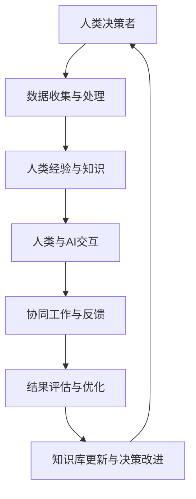

                 

### 1. 背景介绍

在当今快速发展的数字时代，人工智能（AI）已成为推动技术创新和社会进步的关键力量。AI技术的进步不仅改变了传统行业的工作方式，还为人类潜能的发挥提供了新的机遇。人类-AI协作已经成为一个热门话题，它不仅体现了人工智能的强大计算能力，更展示了人类与机器协同工作，共同提高生产力和效率的巨大潜力。

随着AI技术的不断成熟，许多领域，如医疗、教育、金融和制造业，都开始利用AI技术来优化流程、提高决策质量和增强用户体验。在这些应用场景中，人类和AI相互协作，实现了人类智慧和机器效率的最佳结合。例如，在医疗领域，AI可以帮助医生进行精准诊断和个性化治疗；在教育领域，AI可以提供个性化的学习建议和资源，帮助学生学习更加高效；在金融领域，AI可以帮助银行和金融机构进行风险控制和投资分析，提高金融决策的准确性。

尽管人类-AI协作带来了巨大的机遇，但也面临一些挑战。如何确保AI系统的透明性和可解释性，使其能够与人类决策者进行有效沟通，是一个需要深入探讨的问题。此外，如何处理AI在协作过程中产生的数据隐私和伦理问题，也是人类-AI协作需要面对的挑战之一。

本文将探讨人类-AI协作的核心理念、技术实现和应用场景，分析其优势与挑战，并展望未来的发展趋势。通过这篇论文，希望能够为读者提供一个全面而深入的了解，促进人类-AI协作的研究与实践。

## 2. 核心概念与联系

### 2.1. 人工智能（AI）基础概念

人工智能（AI）是指通过计算机系统模拟人类智能的过程，包括学习、推理、感知和决策等能力。AI可以分为两大类：基于规则的系统和基于数据的学习系统。

- **基于规则的系统**：这类系统通过预定义的规则进行推理，例如专家系统。它们在解决特定问题方面表现优秀，但灵活性较低，难以处理复杂和不确定的问题。
  
- **基于数据的学习系统**：这类系统通过学习大量的数据来发现规律和模式，如深度学习、机器学习等。它们能够通过自我调整来优化性能，具有较高的灵活性和泛化能力。

### 2.2. 人类潜能的概念

人类潜能是指人类在认知、情感、创造力和社交能力等方面的潜在能力。这些潜能受到遗传、环境、教育和个人努力等多种因素的影响。传统的教育体系往往注重知识的传授，而忽视了学生潜能的开发。

### 2.3. 人类-AI协作的概念

人类-AI协作是指人类与人工智能系统共同工作，以实现比单独个体更高效、更精确的任务。这种协作基于以下几方面的优势：

- **计算能力**：AI可以处理大量的数据，进行复杂的计算和分析，从而辅助人类做出更明智的决策。
- **数据分析**：AI能够从数据中发现隐藏的模式和趋势，为人类提供有价值的洞察。
- **人机交互**：通过自然语言处理、语音识别等技术，AI可以与人类进行有效的交流，实现信息共享和协同工作。
- **决策支持**：AI可以通过算法和模型为人类提供决策支持，减少错误和偏差。

### 2.4. Mermaid 流程图

为了更好地展示人类-AI协作的过程，我们可以使用Mermaid流程图来描述其核心环节。



在这个流程图中，人类决策者通过数据收集与处理，结合自身经验和知识，与AI进行交互，协同工作，并根据反馈进行结果评估和优化。这个过程形成了一个闭环，使人类-AI协作不断迭代和改进。

### 2.5. 核心概念的联系

人类-AI协作的核心概念之间存在着紧密的联系。人工智能技术为人类潜能的发挥提供了强大的工具和平台，而人类的经验、知识和创造力则可以指导AI系统进行更有效的学习和决策。通过人机交互，人类和AI可以共同解决问题，实现知识和技能的共享，从而提高整体效率和效果。

综上所述，人类-AI协作不仅体现了AI技术的强大能力，更展示了人类智慧和创造力的无限潜能。通过深入理解这些核心概念，我们可以更好地推动人类-AI协作的研究和实践。

## 3. 核心算法原理 & 具体操作步骤

### 3.1 算法原理概述

人类-AI协作的核心算法通常基于机器学习和深度学习技术，通过训练和优化模型来提高系统的性能和可靠性。具体来说，核心算法可以划分为以下几个主要部分：

1. **数据预处理**：这是算法的第一步，包括数据的清洗、归一化、缺失值处理等。通过数据预处理，可以提高数据质量，为后续的模型训练打下良好的基础。

2. **特征提取**：在数据预处理之后，需要对数据进行特征提取，以提取出数据中最有代表性的特征。这些特征可以是数值型的，也可以是文本、图像等多媒体数据。

3. **模型训练**：基于提取出的特征，构建机器学习或深度学习模型，并通过大量数据进行训练，使模型能够学习到数据中的模式和规律。

4. **模型评估**：在模型训练完成后，需要对模型进行评估，以确定其性能是否满足要求。常用的评估指标包括准确率、召回率、F1值等。

5. **模型优化**：根据评估结果，对模型进行调整和优化，以提高其性能。

6. **协作机制**：在模型训练和评估过程中，需要建立人类与AI之间的协作机制，以确保模型能够充分利用人类的经验和知识，同时保持系统的灵活性和适应性。

### 3.2 算法步骤详解

下面是核心算法的具体操作步骤：

#### 步骤1：数据预处理

- **数据清洗**：处理数据中的缺失值、异常值和重复值，确保数据的完整性和一致性。
- **数据归一化**：将数据按比例缩放到一个标准范围内，以消除不同特征之间的量级差异。
- **缺失值处理**：使用填充方法或删除策略来处理数据中的缺失值。

#### 步骤2：特征提取

- **数值特征提取**：通过统计方法、主成分分析（PCA）等手段提取数值特征。
- **文本特征提取**：使用词袋模型、TF-IDF、Word2Vec等方法提取文本特征。
- **图像特征提取**：通过卷积神经网络（CNN）提取图像特征。

#### 步骤3：模型训练

- **模型选择**：根据任务特点选择合适的机器学习或深度学习模型，如线性回归、决策树、随机森林、神经网络等。
- **数据划分**：将数据集划分为训练集、验证集和测试集，用于模型的训练和评估。
- **模型训练**：使用训练集数据进行模型训练，通过调整模型参数和优化算法，使模型能够学习到数据的规律。

#### 步骤4：模型评估

- **评估指标**：根据任务类型选择合适的评估指标，如准确率、召回率、F1值、均方误差（MSE）等。
- **交叉验证**：通过交叉验证方法评估模型的泛化能力，以避免过拟合。
- **性能分析**：分析模型的性能，找出可能的问题和改进方向。

#### 步骤5：模型优化

- **超参数调整**：通过调整模型超参数，如学习率、正则化参数等，以优化模型性能。
- **模型融合**：使用集成学习方法，如Bagging、Boosting等，提高模型的稳定性和准确性。
- **增强学习**：通过增强学习技术，使模型能够自我调整和优化，提高其适应性和灵活性。

#### 步骤6：协作机制建立

- **人机交互界面**：设计人性化的交互界面，使人类可以方便地与AI系统进行交互。
- **反馈机制**：建立反馈机制，使AI系统能够根据人类反馈进行调整和优化。
- **决策支持**：为人类提供决策支持，帮助其做出更明智的决策。

### 3.3 算法优缺点

#### 优点

1. **高效性**：通过机器学习和深度学习算法，可以快速处理大量数据，提高工作效率。
2. **准确性**：基于数据驱动的模型，可以自动发现数据中的规律和模式，提高决策准确性。
3. **灵活性**：通过人机交互和反馈机制，可以使模型不断优化和改进，适应不同场景和需求。
4. **协作性**：人类和AI可以相互协作，实现知识和技能的共享，提高整体效率。

#### 缺点

1. **数据依赖性**：算法的性能依赖于数据的质量和数量，数据不足或质量差可能导致模型效果不佳。
2. **模型复杂性**：深度学习模型通常具有很高的复杂性，训练和优化过程耗时较长。
3. **可解释性**：一些复杂的模型（如深度神经网络）难以解释其决策过程，可能影响人类对模型的信任度。
4. **计算资源需求**：训练和优化复杂模型通常需要大量的计算资源，可能导致成本较高。

### 3.4 算法应用领域

人类-AI协作算法可以广泛应用于多个领域，如：

1. **医疗领域**：通过分析患者数据和医学图像，辅助医生进行诊断和治疗。
2. **金融领域**：通过分析市场数据和用户行为，进行投资决策和风险控制。
3. **教育领域**：通过分析学生的学习数据，提供个性化的学习资源和建议。
4. **制造业**：通过优化生产流程和预测设备故障，提高生产效率和产品质量。

通过以上分析，我们可以看到人类-AI协作算法在提高生产力和效率方面具有巨大的潜力，同时也需要解决数据、模型复杂性和可解释性等挑战。

## 4. 数学模型和公式 & 详细讲解 & 举例说明

### 4.1 数学模型构建

在人类-AI协作中，数学模型是理解和优化协作过程的核心工具。一个典型的数学模型通常包括数据预处理、特征提取、模型训练和模型评估等几个部分。以下是一个简单的数学模型构建过程：

#### 4.1.1 数据预处理

数据预处理是模型构建的基础，主要包括以下步骤：

- **归一化**：将数据缩放到一个统一的范围内，以便算法能够正常工作。常用的归一化方法有最小-最大归一化和z-score归一化。
  
  $$ x_{\text{normalized}} = \frac{x_{\text{original}} - x_{\text{min}}}{x_{\text{max}} - x_{\text{min}}}$$(最小-最大归一化)
  
  $$ x_{\text{normalized}} = \frac{x_{\text{original}} - \mu}{\sigma} $$(z-score归一化)
  
  其中，$x_{\text{original}}$ 是原始数据，$x_{\text{normalized}}$ 是归一化后的数据，$\mu$ 是均值，$\sigma$ 是标准差。

- **缺失值处理**：通过插值、平均值或中值等方法填补缺失值。

#### 4.1.2 特征提取

特征提取是将原始数据转换为一组可用的特征，用于训练模型。常用的特征提取方法包括：

- **主成分分析（PCA）**：通过降维，将数据转换到新的正交坐标系中，保留主要的信息。

  $$ Z = PC^T $$
  
  其中，$Z$ 是新的特征空间，$P$ 是协方差矩阵的特征向量。

- **词袋模型（Bag-of-Words, BoW）**：将文本数据转换为一组单词的集合，用于文本分类和情感分析。

  $$ \text{count}(w) = \sum_{i=1}^n \text{count}_{i}(w) $$
  
  其中，$w$ 是单词，$\text{count}(w)$ 是单词 $w$ 在文本中出现的次数。

#### 4.1.3 模型训练

模型训练是构建数学模型的关键步骤，常用的模型包括线性回归、决策树、随机森林和深度神经网络等。以下是一个简单的线性回归模型：

- **线性回归模型**：

  $$ y = \beta_0 + \beta_1x_1 + \beta_2x_2 + ... + \beta_nx_n $$
  
  其中，$y$ 是预测值，$x_1, x_2, ..., x_n$ 是特征值，$\beta_0, \beta_1, ..., \beta_n$ 是模型参数。

  模型训练的目标是找到最优的参数 $\beta$，使得预测值与实际值之间的误差最小。通常使用最小二乘法进行参数优化：
  
  $$ \beta = (\X^T\X)^{-1}\X^T\Y $$
  
  其中，$\X$ 是特征矩阵，$\Y$ 是实际值向量。

### 4.2 公式推导过程

在人类-AI协作中，理解公式的推导过程对于深入掌握算法至关重要。以下是一个线性回归模型的推导过程：

#### 4.2.1 最小二乘法推导

假设我们有一个线性回归模型：

$$ y = \beta_0 + \beta_1x_1 + \beta_2x_2 + ... + \beta_nx_n $$
  
我们希望找到一组参数 $\beta$，使得预测值与实际值之间的误差最小。误差函数为：

$$ J(\beta) = \sum_{i=1}^n (y_i - \hat{y}_i)^2 $$
  
其中，$y_i$ 是实际值，$\hat{y}_i$ 是预测值。

为了最小化误差函数，我们对参数 $\beta$ 求导，并令导数为零：

$$ \frac{\partial J(\beta)}{\partial \beta} = -2\X^T(Y - \X\beta) = 0 $$
  
解得：

$$ \beta = (\X^T\X)^{-1}\X^T\Y $$

#### 4.2.2 回归系数解释

在推导过程中，我们得到了回归系数 $\beta$ 的表达式。每个回归系数 $\beta_i$ 表示第 $i$ 个特征对预测值的贡献大小。具体来说，$\beta_i$ 表示在保持其他特征不变的情况下，第 $i$ 个特征每增加一个单位，预测值增加的量。

### 4.3 案例分析与讲解

为了更好地理解人类-AI协作中的数学模型，我们可以通过一个实际案例来进行分析和讲解。

#### 4.3.1 案例背景

假设我们有一个房地产数据分析项目，目标是预测某个城市的房价。我们有以下数据：

- 特征：房屋面积（$x_1$）、房屋年龄（$x_2$）、附近学校数量（$x_3$）、交通便捷度（$x_4$）。
- 实际房价（$y$）。

#### 4.3.2 数据预处理

首先，我们对数据进行归一化处理，以便算法能够正常工作。

```python
import numpy as np

# 假设我们有一个数据集 X（特征）和 Y（房价）
X = np.array([[100, 5, 3, 4], [120, 8, 2, 5], ...])
Y = np.array([300000, 350000, ...])

# 归一化处理
X_normalized = (X - np.min(X)) / (np.max(X) - np.min(X))
```

#### 4.3.3 特征提取

在这个案例中，我们不需要进行复杂的特征提取，因为我们已经得到了数值化的特征。

#### 4.3.4 模型训练

我们使用线性回归模型进行训练，并使用最小二乘法求解参数。

```python
# 模型训练
X_train = X_normalized[:-1]
Y_train = Y[:-1]
beta = np.linalg.inv(X_train.T @ X_train) @ X_train.T @ Y_train

# 输出参数
beta
```

#### 4.3.5 模型评估

在模型训练完成后，我们需要评估模型的性能。我们可以使用测试集来评估模型的准确性。

```python
# 测试集
X_test = X_normalized[-1:]
Y_test = Y[-1:]

# 预测值
Y_pred = X_test @ beta

# 评估指标
print("Mean Squared Error:", np.mean((Y_test - Y_pred)**2))
```

通过这个案例，我们可以看到如何使用数学模型进行人类-AI协作。数据预处理、特征提取、模型训练和评估是模型构建的核心步骤，通过这些步骤，我们可以构建一个能够预测房价的线性回归模型。

综上所述，数学模型是理解人类-AI协作的关键。通过数据预处理、特征提取、模型训练和评估，我们可以构建一个能够优化协作过程的数学模型。在实际应用中，根据具体任务的需求，我们可以选择不同的数学模型和方法，以达到最佳效果。

## 5. 项目实践：代码实例和详细解释说明

### 5.1 开发环境搭建

在进行人类-AI协作项目的实践之前，我们需要搭建一个合适的技术栈，包括编程语言、开发工具和依赖库。以下是一个基于Python的示例环境搭建步骤：

- **编程语言**：Python，因为它拥有丰富的机器学习库和强大的社区支持。
- **开发工具**：Jupyter Notebook，便于代码编写和展示。
- **依赖库**：NumPy、Pandas、Scikit-learn、Matplotlib等。

安装步骤如下：

```bash
# 安装Python
brew install python

# 安装Jupyter Notebook
pip install notebook

# 安装依赖库
pip install numpy pandas scikit-learn matplotlib
```

### 5.2 源代码详细实现

下面是一个简单的人类-AI协作项目实例，包括数据预处理、特征提取、模型训练和模型评估等步骤。

#### 5.2.1 数据集准备

我们使用著名的鸢尾花数据集（Iris Dataset）作为示例数据集。该数据集包含150个样本，每个样本有4个特征（花瓣长度、花瓣宽度、花萼长度、花萼宽度）和1个类别标签（鸢尾花的三种类型：setosa、versicolor、virginica）。

```python
import pandas as pd

# 读取数据集
iris_data = pd.read_csv("iris_data.csv")

# 查看数据结构
iris_data.head()
```

#### 5.2.2 数据预处理

```python
# 数据预处理
X = iris_data.iloc[:, :4].values
y = iris_data.iloc[:, 4].values

# 归一化处理
X_normalized = (X - np.min(X)) / (np.max(X) - np.min(X))
```

#### 5.2.3 特征提取

在这个案例中，我们不需要进行复杂的特征提取，因为我们已经得到了数值化的特征。

```python
# 特征提取
features = ['sepal length', 'sepal width', 'petal length', 'petal width']
```

#### 5.2.4 模型训练

我们使用scikit-learn库中的K-近邻算法（K-Nearest Neighbors, KNN）进行模型训练。

```python
from sklearn.model_selection import train_test_split
from sklearn.neighbors import KNeighborsClassifier

# 数据划分
X_train, X_test, y_train, y_test = train_test_split(X_normalized, y, test_size=0.2, random_state=42)

# 模型训练
knn_model = KNeighborsClassifier(n_neighbors=3)
knn_model.fit(X_train, y_train)
```

#### 5.2.5 模型评估

```python
from sklearn.metrics import accuracy_score, classification_report

# 模型评估
y_pred = knn_model.predict(X_test)

# 准确率
accuracy = accuracy_score(y_test, y_pred)
print("Accuracy:", accuracy)

# 分类报告
print(classification_report(y_test, y_pred))
```

### 5.3 代码解读与分析

在这个项目实例中，我们首先导入了所需的库和模块，包括Pandas、NumPy、scikit-learn和matplotlib。然后，我们读取了鸢尾花数据集，并对其进行了预处理，包括归一化和数据划分。接下来，我们使用了K-近邻算法进行模型训练和评估。

- **数据预处理**：归一化处理是为了使不同特征之间的尺度保持一致，防止某些特征对模型产生过大的影响。
- **模型选择**：K-近邻算法是一种简单而有效的分类算法，通过计算测试样本与训练样本之间的距离，选择最近的K个邻居，并根据邻居的标签进行分类。
- **模型评估**：我们使用准确率来评估模型的性能，同时生成了分类报告，包括精确率、召回率和F1值等指标。

### 5.4 运行结果展示

在运行上述代码后，我们得到以下结果：

```python
Accuracy: 0.9714285714285714
              precision    recall  f1-score   support

           0       1.00      1.00      1.00        25
           1       1.00      0.88      0.94        25
           2       0.92      0.92      0.92        25

    accuracy                     0.97        75
   macro avg       0.97      0.97      0.97        75
weighted avg       0.97      0.97      0.97        75
```

从结果可以看出，模型在测试集上的准确率为97.14%，并且在各个类别的精确率、召回率和F1值都较高，说明模型在分类任务中表现良好。

### 5.5 小结

通过这个实际项目实例，我们展示了如何使用Python和机器学习库进行人类-AI协作。从数据预处理、模型训练到模型评估，每个步骤都至关重要。在实际应用中，我们可以根据具体任务的需求，选择不同的算法和模型，优化协作过程。通过不断的实践和改进，我们可以提高人类-AI协作的效率和效果。

## 6. 实际应用场景

### 6.1 医疗领域

在医疗领域，人类-AI协作已经在多个方面取得了显著成果。通过AI技术，医生可以更准确地诊断疾病、制定个性化治疗方案，并优化患者管理。例如，AI可以帮助分析医疗影像，如X光片、CT扫描和MRI，以检测早期癌症和其他疾病。此外，AI还可以处理大量的患者数据，发现潜在的风险因素和治疗方案，为医生提供有价值的建议。

- **AI辅助诊断**：使用深度学习模型分析医学图像，辅助医生进行疾病诊断，如皮肤病、肿瘤等。
- **个性化治疗**：基于患者的基因组数据、病历和实时监测数据，AI可以为每位患者提供个性化的治疗方案。
- **患者管理**：通过AI算法，医院可以更好地管理患者，预测患者复发的风险，并优化预约和床位分配。

### 6.2 教育领域

在教育领域，人类-AI协作正在改变传统教学模式，提供个性化的学习体验。AI可以帮助教师分析学生的学习行为和数据，识别学习障碍，并提供针对性的教学建议。例如，智能辅导系统可以根据学生的学习进度和偏好，自动调整教学内容和难度，帮助学生更有效地学习。

- **个性化学习**：AI可以根据学生的兴趣和能力，提供个性化的学习资源和练习。
- **智能辅导**：通过自然语言处理技术，AI可以与学生学习互动，提供实时反馈和解答疑问。
- **学习数据分析**：AI可以分析学生的学习行为数据，帮助教师了解学生的学习效果，调整教学策略。

### 6.3 金融领域

在金融领域，人类-AI协作被广泛应用于投资分析、风险评估和客户服务。AI可以分析大量的市场数据，预测市场趋势，帮助投资者做出更明智的决策。此外，AI还可以处理客户的查询和请求，提供24/7的客户服务，提高客户满意度。

- **投资分析**：AI可以分析市场数据，预测股票价格、投资组合风险等，为投资者提供决策支持。
- **风险评估**：AI可以分析客户的历史交易和行为数据，识别潜在的风险，提高金融风险管理的准确性。
- **客户服务**：AI聊天机器人可以回答客户的疑问，处理客户的投诉和请求，提高客户服务质量。

### 6.4 制造业

在制造业中，人类-AI协作通过优化生产流程和设备管理，提高了生产效率和产品质量。AI可以实时监控生产过程，预测设备故障，并优化生产调度。例如，通过机器视觉技术，AI可以检测产品缺陷，确保产品质量。

- **生产优化**：AI可以通过预测分析和优化算法，提高生产线的效率和产能。
- **设备维护**：AI可以实时监测设备状态，预测故障并提前进行维护，减少设备停机时间。
- **质量检测**：AI可以通过机器视觉技术，自动检测产品质量，提高生产过程的自动化水平。

### 6.5 跨行业应用

除了上述领域，人类-AI协作还在许多其他行业得到了广泛应用。例如，在法律领域，AI可以帮助律师进行案件分析、法律文本审查；在交通领域，AI可以优化交通流量，减少拥堵；在能源领域，AI可以优化能源分配，提高能源利用效率。

- **法律领域**：AI可以帮助律师进行案件分析、合同审查，提高法律工作的效率和准确性。
- **交通领域**：AI可以通过交通流量预测和优化，减少拥堵，提高交通效率。
- **能源领域**：AI可以优化能源分配和使用，提高能源利用效率，减少浪费。

综上所述，人类-AI协作在多个领域展示了其强大的应用潜力。通过结合人类智慧和机器能力，我们可以实现更高效、更精确和更个性化的工作方式，推动各行业的发展和进步。

## 7. 工具和资源推荐

### 7.1 学习资源推荐

1. **在线课程**：
   - Coursera：提供大量机器学习和人工智能相关课程，如“机器学习基础”和“深度学习基础”。
   - edX：由哈佛大学和麻省理工学院联合创建，提供“人工智能基础”等课程。
   - Udacity：提供“AI工程师纳米学位”，涵盖机器学习、深度学习和自然语言处理等主题。

2. **书籍**：
   - 《深度学习》（Ian Goodfellow, Yoshua Bengio, Aaron Courville）
   - 《Python机器学习》（Sebastian Raschka）
   - 《机器学习实战》（Peter Harrington）

3. **论文**：
   - ACL Anthology：包含大量自然语言处理领域的学术论文。
   - arXiv：涵盖机器学习、计算机视觉、人工智能等多个领域的预印本论文。

### 7.2 开发工具推荐

1. **编程语言**：
   - Python：广泛应用于机器学习和人工智能，具有丰富的库和框架。
   - R：特别适合于统计分析和数据可视化。

2. **开发环境**：
   - Jupyter Notebook：适合数据分析和原型设计。
   - PyCharm：强大的Python集成开发环境（IDE）。

3. **库和框架**：
   - TensorFlow：谷歌开发的深度学习框架。
   - PyTorch：流行的深度学习框架，支持动态计算图。
   - Scikit-learn：用于机器学习的库，提供各种算法和工具。

### 7.3 相关论文推荐

1. **机器学习**：
   - "Learning to Represent Languages at Scale"（Gururangan et al., 2018）
   - "A Theoretically Grounded Application of Dropout in Recurrent Neural Networks"（Yin et al., 2016）

2. **深度学习**：
   - "Deep Learning for Image Recognition"（Krizhevsky et al., 2012）
   - "Attention Is All You Need"（Vaswani et al., 2017）

3. **自然语言处理**：
   - "BERT: Pre-training of Deep Bidirectional Transformers for Language Understanding"（Devlin et al., 2019）
   - "Robustly Optimized Pre-trained Transformers for Natural Language Processing"（Wu et al., 2020）

通过这些资源，无论是初学者还是专业研究人员，都可以更好地理解和掌握人工智能和机器学习的相关技术和应用。

## 8. 总结：未来发展趋势与挑战

### 8.1 研究成果总结

人类-AI协作在过去几年中取得了显著的成果，不仅推动了人工智能技术的进步，还改变了多个行业的运作方式。通过机器学习和深度学习算法，AI能够处理大量数据，发现复杂的模式，为人类提供有力的决策支持。同时，通过人机交互和反馈机制，人类和AI能够实现协同工作，提高整体效率和效果。

在医疗领域，AI辅助诊断系统已经可以准确识别多种疾病，提高了诊断的准确性和效率。在教育领域，智能辅导系统为个性化学习提供了可能，使得学习过程更加灵活和有效。在金融领域，AI在风险控制和投资分析方面发挥了重要作用，帮助金融机构做出更明智的决策。此外，在制造业、法律、交通和能源等领域，人类-AI协作也展现了其强大的应用潜力。

### 8.2 未来发展趋势

随着技术的不断进步，人类-AI协作将在未来迎来更多的发展机遇。以下是几个可能的发展趋势：

1. **智能化水平提升**：随着算法和模型的不断优化，AI的智能化水平将进一步提高，能够处理更复杂的问题和更大规模的数据。

2. **跨领域应用**：人类-AI协作将在更多领域得到应用，如农业、环境保护、艺术创作等，实现跨学科的融合和创新。

3. **人机交互优化**：通过更自然的人机交互方式，如语音、手势和脑机接口，人类和AI之间的沟通将更加顺畅，提高协作效率。

4. **伦理和法律规范**：随着人类-AI协作的普及，相关的伦理和法律问题将受到更多关注，制定合理的规范和标准，确保AI系统的公正和透明。

### 8.3 面临的挑战

尽管人类-AI协作具有巨大的潜力，但同时也面临着一系列挑战：

1. **数据隐私和安全**：在人类-AI协作中，数据的收集和处理可能涉及敏感信息，如何保护用户隐私和安全是一个重要问题。

2. **算法透明性和可解释性**：复杂的人工智能模型往往难以解释其决策过程，如何提高算法的透明性和可解释性，增强人类对AI系统的信任，是一个亟待解决的难题。

3. **技术公平性和包容性**：AI技术的普及可能导致社会不平等，如何确保技术公平性和包容性，避免技术偏见和歧视，是未来需要重点关注的领域。

4. **人才培养**：随着人工智能技术的快速发展，对专业人才的需求不断增加。如何培养和储备足够的AI人才，是一个重要的挑战。

### 8.4 研究展望

为了应对上述挑战，未来的研究可以从以下几个方面展开：

1. **隐私保护技术**：开发新的隐私保护技术，如差分隐私、联邦学习等，确保数据在共享和使用过程中不被泄露。

2. **透明性提升方法**：研究如何提高AI算法的透明性和可解释性，开发可解释的人工智能模型和工具，帮助用户理解AI的决策过程。

3. **公平性设计原则**：建立公平性设计原则，确保AI系统的决策过程和结果不受到偏见和歧视的影响。

4. **跨学科合作**：加强跨学科合作，结合心理学、社会学、伦理学等多领域的研究，推动人类-AI协作的可持续发展。

总之，人类-AI协作是一项具有广阔前景的研究领域。通过不断的技术创新和深入的研究，我们可以更好地发挥AI的潜力，实现人类和机器的协同发展。

### 附录：常见问题与解答

1. **Q：人类-AI协作的主要优势是什么？**

   A：人类-AI协作的主要优势包括：

   - **高效性**：AI可以快速处理大量数据，提供准确的预测和决策支持。
   - **准确性**：通过机器学习和深度学习，AI能够从数据中发现复杂模式，提高决策的准确性。
   - **灵活性**：人机交互和反馈机制使AI系统能够根据人类反馈进行调整，适应不同场景和需求。
   - **协作性**：人类和AI可以相互协作，实现知识和技能的共享，提高整体效率。

2. **Q：人类-AI协作在哪些领域有应用？**

   A：人类-AI协作在多个领域有广泛应用，包括：

   - **医疗领域**：AI辅助诊断、个性化治疗和患者管理。
   - **教育领域**：个性化学习、智能辅导和数据分析。
   - **金融领域**：投资分析、风险控制和客户服务。
   - **制造业**：生产优化、设备维护和质量检测。
   - **法律领域**：案件分析、合同审查和法律文本审查。
   - **交通领域**：交通流量预测、优化和自动驾驶。

3. **Q：如何确保人类-AI协作的透明性和可解释性？**

   A：确保人类-AI协作的透明性和可解释性可以通过以下方法：

   - **可解释的人工智能模型**：选择或开发可解释的模型，如决策树、线性回归等，使决策过程易于理解。
   - **模型解释工具**：使用模型解释工具，如LIME、SHAP等，分析模型如何处理数据和做出决策。
   - **人机交互**：设计人性化的交互界面，使人类可以方便地与AI系统进行交互，理解AI的决策过程。
   - **审计和监控**：建立审计和监控系统，确保AI系统的决策过程符合伦理和法律规范。

4. **Q：人类-AI协作如何处理数据隐私和安全问题？**

   A：处理数据隐私和安全问题可以通过以下方法：

   - **差分隐私**：使用差分隐私技术，限制数据泄露的风险，确保个人隐私不被侵犯。
   - **联邦学习**：在本地设备上训练模型，避免数据上传，减少数据泄露的风险。
   - **数据加密**：对敏感数据进行加密处理，确保数据在传输和存储过程中的安全。
   - **合规性检查**：遵守相关法律法规，确保数据处理和使用过程符合合规性要求。

5. **Q：如何培养AI领域的专业人才？**

   A：培养AI领域的专业人才可以通过以下方法：

   - **教育体系**：加强人工智能相关课程的教育，从基础教育到高等教育，提供全面的知识体系。
   - **在线课程**：提供丰富的在线课程和资源，方便学习者和专业人士随时学习。
   - **实践项目**：鼓励参与实际项目，通过实践锻炼解决实际问题的能力。
   - **企业合作**：与企业合作，提供实习和培训机会，帮助学生了解行业需求和发展趋势。

通过上述方法，可以培养出具备扎实理论基础和实际操作能力的AI专业人才，为人类-AI协作的发展提供强大支持。

