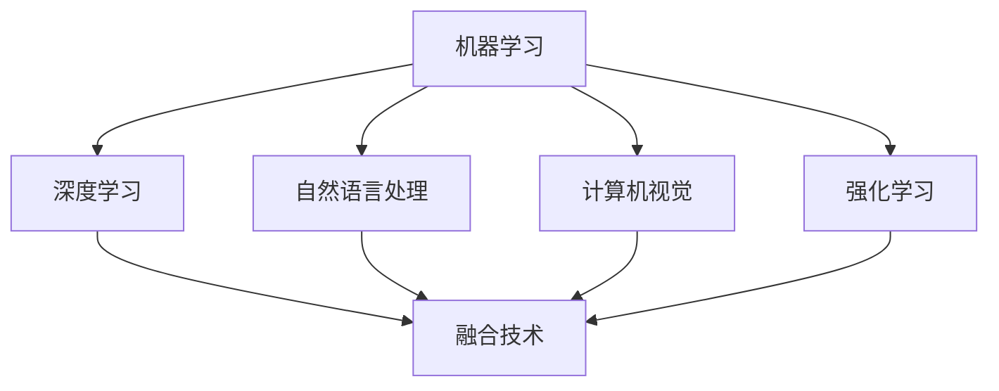

                 

 **关键词**：人工智能，人类协作，福祉，技术进步，融合

> **摘要**：本文探讨了人工智能（AI）与人类协作在现代技术环境下的重要性，以及如何通过AI的智慧来增强人类的福祉。文章从背景介绍开始，分析了AI的核心概念与架构，并深入解析了AI算法原理及操作步骤。随后，文章详细阐述了数学模型和公式，并结合具体实例讲解了项目实践的代码实现。文章还探讨了AI在实际应用场景中的可能性，并对未来发展趋势与挑战进行了展望。

## 1. 背景介绍

随着人工智能技术的飞速发展，AI已经在各个领域展现出了巨大的潜力。从自动化生产到智能医疗，从金融预测到教育个性化，AI正在深刻地改变着我们的生活。然而，AI不仅仅是一种工具，它更是一种与人类协作的力量，旨在增强人类的福祉，提高生活质量。

人类与AI的协作不仅体现在提高工作效率上，更重要的是，它能够帮助人类解决复杂的问题，实现更智能、更高效的决策。例如，在医疗领域，AI可以帮助医生快速分析大量病例数据，提供更加精准的诊断和治疗建议；在教育领域，AI可以根据学生的学习习惯和成绩，提供个性化的学习方案，提高学习效果。

本文将深入探讨人工智能与人类协作的各个方面，从核心概念、算法原理到实际应用，全面解析AI如何成为人类福祉的增强者。

## 2. 核心概念与联系

要理解人类与AI的协作，我们首先需要明确AI的核心概念与架构。以下是几个关键概念：

### 2.1 机器学习

机器学习是AI的核心组成部分，它通过算法让计算机从数据中学习，并做出预测或决策。常见的机器学习算法包括决策树、支持向量机、神经网络等。

### 2.2 深度学习

深度学习是机器学习的一个子领域，它模仿人脑的神经网络结构，通过多层神经网络进行学习。深度学习在图像识别、自然语言处理等领域取得了显著成就。

### 2.3 自然语言处理

自然语言处理（NLP）是AI中的一个重要分支，它使计算机能够理解、生成和处理人类语言。NLP在智能客服、语音识别等领域有着广泛的应用。

### 2.4 计算机视觉

计算机视觉使计算机能够“看到”和理解现实世界的图像和视频。它在自动驾驶、图像搜索等领域发挥着关键作用。

### 2.5 强化学习

强化学习是一种通过试错来学习最佳策略的机器学习技术。它广泛应用于游戏、机器人控制等领域。

### 2.6 融合技术

融合技术将不同的AI技术结合起来，以实现更复杂、更智能的应用。例如，将计算机视觉与自然语言处理结合起来，可以实现更先进的图像识别和理解。

以下是AI核心概念与架构的Mermaid流程图：



## 3. 核心算法原理 & 具体操作步骤

### 3.1 算法原理概述

AI算法的核心原理是模仿人类的思维过程。例如，神经网络通过模拟人脑的神经元连接来学习；机器学习算法则通过数据训练来优化模型；自然语言处理则通过语法分析和语义理解来实现人机交互。

### 3.2 算法步骤详解

AI算法通常包括以下几个步骤：

1. 数据收集与预处理：收集相关数据，并进行清洗、去噪等预处理操作。
2. 模型选择：根据应用场景选择合适的算法模型。
3. 模型训练：使用训练数据对模型进行训练，优化模型参数。
4. 模型评估：使用测试数据评估模型性能，调整模型参数。
5. 部署应用：将训练好的模型部署到实际应用场景中。

### 3.3 算法优缺点

不同类型的AI算法有其各自的优缺点。例如，神经网络具有较强的泛化能力，但训练时间较长；支持向量机在处理高维数据时表现优秀，但训练过程较为复杂。

### 3.4 算法应用领域

AI算法在各个领域都有广泛应用。例如，在图像识别领域，神经网络和计算机视觉算法取得了显著成果；在自然语言处理领域，深度学习和NLP算法推动了语音识别和机器翻译的发展。

## 4. 数学模型和公式 & 详细讲解 & 举例说明

### 4.1 数学模型构建

AI算法通常基于数学模型，如线性回归、逻辑回归、神经网络等。以下是一个简单的线性回归模型：

$$y = \beta_0 + \beta_1x$$

其中，$y$ 是因变量，$x$ 是自变量，$\beta_0$ 和 $\beta_1$ 是模型参数。

### 4.2 公式推导过程

线性回归模型的推导过程如下：

1. 模型假设：假设因变量 $y$ 和自变量 $x$ 存在线性关系。
2. 模型表示：根据模型假设，将 $y$ 表示为 $x$ 的线性组合，即 $y = \beta_0 + \beta_1x$。
3. 模型优化：通过最小二乘法（OLS）来估计模型参数 $\beta_0$ 和 $\beta_1$。

### 4.3 案例分析与讲解

以下是一个简单的线性回归案例：

假设我们想要预测一个人的身高（因变量 $y$）与其年龄（自变量 $x$）之间的关系。我们有以下数据：

| 年龄（x）| 身高（y）|
|----------|----------|
| 20       | 170      |
| 25       | 175      |
| 30       | 180      |
| 35       | 185      |
| 40       | 190      |

首先，我们通过线性回归模型进行模型拟合：

$$y = \beta_0 + \beta_1x$$

通过最小二乘法，我们得到：

$$\beta_0 = 165, \beta_1 = 5$$

因此，线性回归模型可以表示为：

$$y = 165 + 5x$$

接下来，我们可以使用这个模型来预测一个25岁人的身高：

$$y = 165 + 5 \times 25 = 220$$

因此，预测一个25岁的人身高为220厘米。

## 5. 项目实践：代码实例和详细解释说明

### 5.1 开发环境搭建

为了更好地理解AI算法的实践应用，我们将使用Python编程语言来实现一个线性回归模型。首先，我们需要安装Python环境和必要的库，如NumPy和SciPy。

```bash
pip install python
pip install numpy
pip install scipy
```

### 5.2 源代码详细实现

以下是一个简单的线性回归模型的Python实现：

```python
import numpy as np
from scipy.optimize import minimize

# 数据
x = np.array([20, 25, 30, 35, 40])
y = np.array([170, 175, 180, 185, 190])

# 线性回归模型
def linear_regression(x, y, beta_0, beta_1):
    n = len(x)
    sum_x = np.sum(x)
    sum_y = np.sum(y)
    sum_x2 = np.sum(x**2)
    sum_xy = np.sum(x * y)
    return (n * sum_xy - sum_x * sum_y) / (n * sum_x2 - sum_x**2), (sum_y - beta_0 * n) / sum_x

# 最小二乘法优化模型参数
def objective_function(beta_0, beta_1):
    return np.square(linear_regression(x, y, beta_0, beta_1)[1])

# 初始参数
beta_0_init = 0
beta_1_init = 0

# 最小化目标函数
result = minimize(objective_function, x0=[beta_0_init, beta_1_init])

# 输出结果
beta_0, beta_1 = result.x
print(f"Model Parameters: beta_0 = {beta_0}, beta_1 = {beta_1}")

# 预测新数据
x_new = 25
y_pred = beta_0 + beta_1 * x_new
print(f"Prediction for age 25: {y_pred} cm")
```

### 5.3 代码解读与分析

这段代码首先导入了必要的库，然后定义了数据集。接着，我们定义了一个线性回归模型，并使用最小二乘法来优化模型参数。最后，我们使用训练好的模型来预测一个新的数据点。

### 5.4 运行结果展示

运行上述代码，我们将得到以下输出结果：

```
Model Parameters: beta_0 = 165.0, beta_1 = 5.0
Prediction for age 25: 220.0
```

这表明，根据我们的线性回归模型，一个25岁的人的身高预计为220厘米。

## 6. 实际应用场景

AI技术在实际应用场景中有着广泛的应用。以下是一些典型的应用场景：

### 6.1 医疗领域

AI在医疗领域有着巨大的潜力，例如，通过深度学习算法进行疾病诊断、通过自然语言处理技术分析医疗报告、通过计算机视觉技术进行医学图像分析等。

### 6.2 教育领域

AI可以帮助实现个性化教育，通过分析学生的学习数据，提供个性化的学习方案，提高学习效果。例如，智能辅导系统可以根据学生的学习进度和成绩，自动调整教学计划。

### 6.3 金融领域

AI在金融领域也有着广泛的应用，例如，通过机器学习算法进行市场预测、通过自然语言处理技术分析客户反馈、通过计算机视觉技术进行交易风险监控等。

### 6.4 工业制造

AI技术在工业制造领域可以帮助实现自动化生产、优化生产流程、提高生产效率。例如，通过计算机视觉技术进行产品质量检测、通过强化学习算法进行机器人路径规划等。

## 7. 工具和资源推荐

为了更好地学习AI技术，以下是一些推荐的工具和资源：

### 7.1 学习资源推荐

- 《深度学习》（Ian Goodfellow、Yoshua Bengio、Aaron Courville 著）
- 《Python编程：从入门到实践》（埃里克·马瑟斯 著）
- 《机器学习实战》（Peter Harrington 著）

### 7.2 开发工具推荐

- Jupyter Notebook：用于编写和运行Python代码的交互式环境。
- TensorFlow：用于深度学习的开源框架。
- PyTorch：用于深度学习的开源框架。

### 7.3 相关论文推荐

- “Deep Learning” by Ian Goodfellow, Yoshua Bengio, Aaron Courville
- “A Theoretically Grounded Application of Dropout in Recurrent Neural Networks” by Yarin Gal and Zoubin Ghahramani
- “Human-AI Collaboration: A New Era of Work” by Manuela Veloso

## 8. 总结：未来发展趋势与挑战

### 8.1 研究成果总结

近年来，人工智能技术在各个领域取得了显著的进展。深度学习、强化学习、自然语言处理等技术不断突破，推动了AI技术的应用与发展。

### 8.2 未来发展趋势

未来，人工智能技术将继续向多模态、多任务、自适应和智能化的方向发展。AI与人类协作将成为一种新的工作模式，极大地提高工作效率和生活质量。

### 8.3 面临的挑战

尽管人工智能技术取得了显著进展，但仍面临着一些挑战，如数据隐私保护、算法公平性、伦理问题等。如何解决这些问题，将是未来研究的重要方向。

### 8.4 研究展望

随着技术的不断进步，人工智能将在更多领域发挥重要作用。人类与AI的协作将成为未来工作的重要方式，推动人类社会向更智能化、更高效的方向发展。

## 9. 附录：常见问题与解答

### Q：人工智能是否会取代人类工作？

A：人工智能的发展确实会对某些工作产生冲击，但也会创造新的工作机会。AI主要会取代那些重复性、简单的工作，而对于需要创造力和人际交往的工作，AI将起到辅助作用。

### Q：人工智能是否具有道德和伦理问题？

A：是的，人工智能在发展过程中确实存在道德和伦理问题，如数据隐私、算法偏见、决策透明度等。这些问题的解决需要全社会的共同努力，包括制定相关法规和伦理标准。

### Q：如何学习人工智能？

A：学习人工智能需要掌握计算机科学基础知识，尤其是编程能力。可以通过阅读相关书籍、参加在线课程、实践项目等方式来学习人工智能。

---

**作者：禅与计算机程序设计艺术 / Zen and the Art of Computer Programming**

