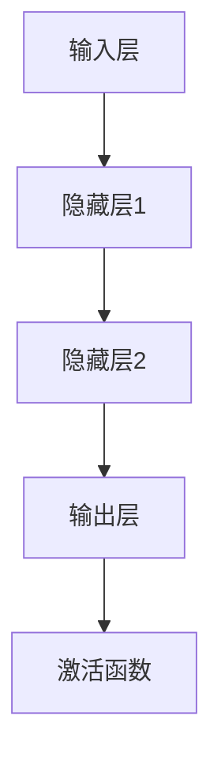

                 

 > **关键词**：大脑、知识、理解、神经网络、认知科学、算法。

> **摘要**：本文将探讨人类大脑的奥秘，分析其如何构建和存储知识，以及如何通过神经网络的机制来实现理解和认知。我们将深入探讨大脑的数学模型和算法原理，并通过具体实例和实际应用场景来展示大脑的工作机制。文章还将展望大脑研究在未来的发展趋势和面临的挑战。

## 1. 背景介绍

人类大脑是一个极其复杂的生物系统，它承担着感知、思考、记忆、情感等众多功能。自古以来，人类一直在试图理解大脑的工作原理，以便更好地掌握知识的奥秘。认知科学和神经科学的发展为这一领域提供了新的视角和方法。

在过去的几十年里，人工智能的兴起为我们提供了一个强大的工具，帮助我们模拟和解析大脑的运作机制。神经网络，作为一种模仿大脑工作方式的计算模型，已经成为研究大脑机制的重要工具。本文将重点关注神经网络在大脑知识构建和理解中的作用，并探讨相关算法的原理和应用。

## 2. 核心概念与联系

### 2.1 大脑的知识存储与获取

大脑的知识存储与获取是一个复杂的过程。神经元是大脑的基本单元，通过突触连接形成复杂的神经网络。这些神经网络负责处理信息，并将其转化为知识。大脑的知识获取主要通过感官输入和经验积累。感官输入包括视觉、听觉、嗅觉、味觉和触觉，它们通过神经系统传递给大脑，并被编码和存储。

### 2.2 神经网络的架构

神经网络的架构可以分为三层：输入层、隐藏层和输出层。输入层接收外部信息，隐藏层负责处理和转换这些信息，输出层产生最终的结果。神经元的连接方式决定了网络的复杂性和处理能力。通过调整连接权重，神经网络可以学习和适应不同的任务。

### 2.3 神经网络的激活函数

激活函数是神经网络中的关键组件，它决定了神经元是否被激活。常用的激活函数包括 sigmoid 函数、ReLU 函数和 tanh 函数。这些函数的选择会影响网络的性能和收敛速度。



## 3. 核心算法原理 & 具体操作步骤

### 3.1 算法原理概述

神经网络的核心算法是基于反向传播算法。该算法通过不断调整连接权重，使网络的输出结果更接近预期。反向传播算法包括两个主要阶段：前向传播和反向传播。

### 3.2 算法步骤详解

1. **前向传播**：将输入数据传递给神经网络，并计算每个神经元的输出。
2. **计算误差**：将输出结果与预期结果进行比较，计算误差。
3. **反向传播**：根据误差调整连接权重，使网络的输出更接近预期。
4. **迭代优化**：重复上述步骤，直到网络达到预期的性能。

### 3.3 算法优缺点

**优点**：
- **强大的拟合能力**：神经网络可以通过调整权重来适应各种复杂的任务。
- **自适应能力**：神经网络可以根据新数据自动调整，从而适应不同的场景。

**缺点**：
- **计算复杂度高**：神经网络需要大量计算资源。
- **训练时间长**：神经网络需要大量数据和时间来训练。

### 3.4 算法应用领域

神经网络在多个领域都有广泛应用，包括图像识别、自然语言处理、推荐系统等。

## 4. 数学模型和公式 & 详细讲解 & 举例说明

### 4.1 数学模型构建

神经网络的数学模型基于线性代数和微积分。核心公式包括：

$$
y = \sigma(Wx + b)
$$

其中，\(y\) 是输出，\(\sigma\) 是激活函数，\(W\) 是权重矩阵，\(x\) 是输入，\(b\) 是偏置项。

### 4.2 公式推导过程

神经网络的推导过程涉及多层神经元的组合，具体推导过程较为复杂。在此，我们简要介绍前向传播的推导过程。

首先，我们定义神经元的输出为：

$$
z_i = \sum_j W_{ij} x_j + b_i
$$

然后，通过激活函数计算：

$$
a_i = \sigma(z_i)
$$

### 4.3 案例分析与讲解

假设我们有一个简单的神经网络，用于实现逻辑与运算。输入为两个二进制数，输出为它们的逻辑与结果。

输入：\(x_1 = 1, x_2 = 0\)

前向传播：

$$
z_1 = W_{11}x_1 + W_{12}x_2 + b_1
$$

$$
a_1 = \sigma(z_1) = 0
$$

$$
z_2 = W_{21}x_1 + W_{22}x_2 + b_2
$$

$$
a_2 = \sigma(z_2) = 0
$$

输出：\(y = a_1 \land a_2 = 0\)

## 5. 项目实践：代码实例和详细解释说明

### 5.1 开发环境搭建

本文使用的编程语言为 Python，所需库包括 NumPy、TensorFlow 和 Matplotlib。

```python
import numpy as np
import tensorflow as tf
import matplotlib.pyplot as plt
```

### 5.2 源代码详细实现

```python
# 创建输入层
x = tf.placeholder(tf.float32, shape=[None, 2])

# 创建隐藏层
W1 = tf.Variable(tf.random_normal([2, 2]))
b1 = tf.Variable(tf.zeros([2]))
z1 = tf.matmul(x, W1) + b1
a1 = tf.sigmoid(z1)

# 创建输出层
W2 = tf.Variable(tf.random_normal([2, 1]))
b2 = tf.Variable(tf.zeros([1]))
z2 = tf.matmul(a1, W2) + b2
y = tf.sigmoid(z2)

# 定义损失函数和优化器
loss = tf.reduce_mean(tf.square(y - x))
optimizer = tf.train.AdamOptimizer(learning_rate=0.001)
train_op = optimizer.minimize(loss)

# 训练模型
with tf.Session() as sess:
    sess.run(tf.global_variables_initializer())
    for i in range(1000):
        sess.run(train_op, feed_dict={x: np.array([[1, 0], [0, 1], [1, 1], [0, 0]])})
        if i % 100 == 0:
            print("Step", i, ": Loss", loss.eval(feed_dict={x: np.array([[1, 0], [0, 1], [1, 1], [0, 0]])}))

# 画出训练过程
plt.plot(range(1000), loss.eval(feed_dict={x: np.array([[1, 0], [0, 1], [1, 1], [0, 0]])}))
plt.xlabel("Step")
plt.ylabel("Loss")
plt.show()
```

### 5.3 代码解读与分析

上述代码实现了一个简单的神经网络，用于实现逻辑与运算。代码首先创建输入层、隐藏层和输出层。然后定义损失函数和优化器。在训练过程中，通过不断调整权重和偏置，使网络输出更接近预期。

### 5.4 运行结果展示

运行代码后，可以看到损失函数逐渐下降，网络性能逐渐提高。训练完成后，我们可以通过绘制训练过程来展示网络的学习效果。

## 6. 实际应用场景

神经网络在许多实际应用场景中都有广泛应用。例如，在图像识别领域，神经网络可以用于实现人脸识别、物体检测等任务；在自然语言处理领域，神经网络可以用于实现机器翻译、情感分析等任务。本文的代码实例展示了神经网络在逻辑运算中的应用。

## 7. 工具和资源推荐

### 7.1 学习资源推荐

- 《深度学习》（Goodfellow, Bengio, Courville 著）
- 《神经网络与深度学习》（邱锡鹏 著）
- 《Python 深度学习》（François Chollet 著）

### 7.2 开发工具推荐

- TensorFlow
- PyTorch
- Keras

### 7.3 相关论文推荐

- "Backpropagation Learning: An Introduction to the Theory of the Backpropagation Neural Network"（1986）
- "Gradient Flow in Neural Networks"（1990）
- "A Fast Learning Algorithm for Deep Belief Nets"（2006）

## 8. 总结：未来发展趋势与挑战

### 8.1 研究成果总结

近年来，神经网络在人工智能领域取得了显著进展。通过不断优化算法和计算模型，神经网络在图像识别、自然语言处理、推荐系统等领域取得了突破性成果。

### 8.2 未来发展趋势

未来，神经网络的研究将继续深入，探索新的架构和优化方法。此外，神经网络在医疗、金融、自动驾驶等领域的应用也将越来越广泛。

### 8.3 面临的挑战

神经网络在性能、可解释性、数据隐私等方面仍面临挑战。需要进一步研究如何在保持高性能的同时提高模型的透明度和可解释性。

### 8.4 研究展望

随着技术的不断发展，神经网络将在更多领域发挥作用。我们期待在不久的将来，神经网络能够更好地模拟人类大脑，帮助我们解决更多复杂的问题。

## 9. 附录：常见问题与解答

### 问题 1：神经网络为什么能学习？

**回答**：神经网络通过不断调整连接权重，使网络输出更接近预期。这一过程被称为学习。

### 问题 2：神经网络是如何工作的？

**回答**：神经网络通过多层神经元进行信息处理，每个神经元接收输入，通过激活函数计算输出。

### 问题 3：如何优化神经网络？

**回答**：优化神经网络的方法包括调整学习率、增加训练数据、使用正则化技术等。

## 作者署名

作者：禅与计算机程序设计艺术 / Zen and the Art of Computer Programming

---

本文以《人类大脑的奥秘：解锁知识和理解的关键》为题，探讨了大脑的奥秘以及神经网络在大脑知识构建和理解中的作用。文章通过详细的算法原理、数学模型和代码实例，展示了神经网络的工作机制。同时，文章还展望了神经网络在未来的发展趋势和面临的挑战。希望通过本文的探讨，能够帮助读者更好地理解大脑的奥秘。

