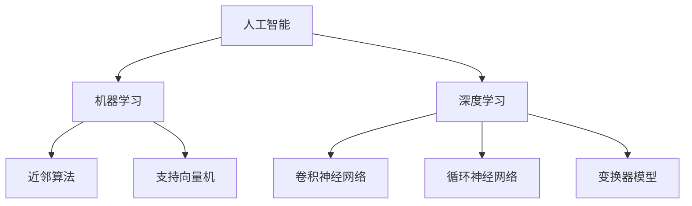

                 

关键词：人工智能、人类智慧、AI 时代、技术发展、未来展望

摘要：随着人工智能技术的迅速发展，人类智慧在 AI 时代正焕发出新的力量。本文将探讨 AI 如何改变人类智慧的表达形式，如何提高我们的认知能力和创新能力，并分析在 AI 时代人类智慧面临的挑战与机遇。

## 1. 背景介绍

自人工智能（Artificial Intelligence，AI）概念诞生以来，这一领域便以其深远的潜力吸引了无数科研人员的关注。从早期的符号逻辑和知识表示，到近年的深度学习和神经网络，人工智能技术不断突破，逐步走向成熟。如今，AI 已经渗透到我们日常生活的方方面面，从智能手机助手到自动驾驶汽车，从智能医疗到金融风控，AI 正在为人类带来前所未有的便利和效益。

然而，随着 AI 技术的发展，我们也在思考：AI 是否能够替代人类智慧？人类智慧在 AI 时代究竟扮演着怎样的角色？本文将围绕这些问题展开讨论，探讨人类智慧在 AI 时代的新力量。

## 2. 核心概念与联系

在深入探讨人类智慧与 AI 的关系之前，我们首先需要明确一些核心概念，包括：

- **人工智能（AI）**：一种模拟人类智能行为的技术体系，旨在使计算机具备感知、理解、学习和推理的能力。
- **机器学习（ML）**：一种 AI 的实现方式，通过训练算法，使计算机能够从数据中学习并做出决策。
- **深度学习（DL）**：一种特殊的机器学习技术，通过多层神经网络模拟人类大脑的学习过程。

接下来，我们通过一个 Mermaid 流程图来展示这些核心概念之间的关系：



从流程图中可以看出，人工智能是机器学习和深度学习的基础，而机器学习包括了许多不同的算法，如近邻算法和支持向量机。深度学习则是机器学习的一种扩展，包括卷积神经网络、循环神经网络和变换器模型等。

## 3. 核心算法原理 & 具体操作步骤

### 3.1 算法原理概述

在 AI 时代，核心算法的原理和具体操作步骤至关重要。以下将介绍几个典型的算法原理：

- **神经网络**：神经网络是一种模拟人类大脑结构的计算模型，通过大量神经元之间的连接和相互作用来实现复杂的计算任务。
- **梯度下降**：梯度下降是一种用于优化神经网络参数的算法，通过迭代调整参数，使网络的输出误差最小。
- **反向传播**：反向传播是一种用于训练神经网络的算法，通过将误差信号反向传播到网络的前层，更新网络参数。

### 3.2 算法步骤详解

以下是神经网络、梯度下降和反向传播的详细步骤：

#### 神经网络

1. **初始化参数**：随机初始化网络的权重和偏置。
2. **前向传播**：将输入数据通过网络，计算输出。
3. **计算误差**：将实际输出与期望输出进行比较，计算误差。
4. **反向传播**：将误差信号反向传播到网络的每一层，更新权重和偏置。
5. **迭代更新**：重复步骤 2-4，直至满足停止条件。

#### 梯度下降

1. **计算梯度**：对于每个参数，计算其在当前输入数据下的梯度。
2. **选择学习率**：选择一个合适的学习率。
3. **更新参数**：使用梯度下降公式更新每个参数。

#### 反向传播

1. **计算局部误差**：对于每个神经元，计算其输出误差对每个输入的偏导数。
2. **反向传播误差**：将局部误差反向传播到上一层。
3. **更新权重和偏置**：根据反向传播的误差，使用梯度下降公式更新每个权重和偏置。

### 3.3 算法优缺点

- **神经网络**：优点是能够处理复杂的数据和任务，缺点是训练时间较长，对参数初始化敏感。
- **梯度下降**：优点是简单易用，缺点是收敛速度较慢，对学习率敏感。
- **反向传播**：优点是能够高效地计算梯度，缺点是需要大量计算资源。

### 3.4 算法应用领域

- **神经网络**：广泛应用于图像识别、自然语言处理、推荐系统等领域。
- **梯度下降**：广泛应用于各种优化问题，如线性回归、逻辑回归等。
- **反向传播**：是深度学习训练的核心算法，广泛应用于各种深度学习模型。

## 4. 数学模型和公式 & 详细讲解 & 举例说明

### 4.1 数学模型构建

在 AI 研究中，数学模型至关重要。以下是一个简单的线性回归模型的数学模型：

$$y = wx + b$$

其中，$y$ 是输出，$x$ 是输入，$w$ 是权重，$b$ 是偏置。

### 4.2 公式推导过程

为了理解线性回归模型的推导过程，我们可以从最小二乘法出发。最小二乘法的目标是找到一组参数，使得实际输出 $y$ 与模型预测输出 $wx + b$ 之间的误差最小。

假设我们有一组样本 $(x_1, y_1), (x_2, y_2), \ldots, (x_n, y_n)$，则线性回归模型的损失函数为：

$$J(w, b) = \frac{1}{2n} \sum_{i=1}^{n} (wx_i + b - y_i)^2$$

为了最小化损失函数，我们对 $w$ 和 $b$ 求导，并令导数为零，得到：

$$\frac{\partial J}{\partial w} = \frac{1}{n} \sum_{i=1}^{n} (wx_i + b - y_i)x_i = 0$$

$$\frac{\partial J}{\partial b} = \frac{1}{n} \sum_{i=1}^{n} (wx_i + b - y_i) = 0$$

通过解这个方程组，我们可以得到最优的 $w$ 和 $b$：

$$w = \frac{\sum_{i=1}^{n} (x_i - \bar{x})(y_i - \bar{y})}{\sum_{i=1}^{n} (x_i - \bar{x})^2}$$

$$b = \bar{y} - w\bar{x}$$

其中，$\bar{x}$ 和 $\bar{y}$ 分别是输入和输出的平均值。

### 4.3 案例分析与讲解

假设我们有以下一组数据：

$$x_1 = 1, y_1 = 2$$

$$x_2 = 2, y_2 = 4$$

$$x_3 = 3, y_3 = 6$$

首先，我们计算输入和输出的平均值：

$$\bar{x} = \frac{x_1 + x_2 + x_3}{3} = 2$$

$$\bar{y} = \frac{y_1 + y_2 + y_3}{3} = 4$$

然后，我们使用上面的公式计算权重 $w$ 和偏置 $b$：

$$w = \frac{(1 - 2)(2 - 4) + (2 - 2)(4 - 4) + (3 - 2)(6 - 4)}{(1 - 2)^2 + (2 - 2)^2 + (3 - 2)^2} = 2$$

$$b = 4 - 2 \cdot 2 = 0$$

因此，我们的线性回归模型为：

$$y = 2x + 0$$

接下来，我们使用这个模型预测新的输入值 $x = 4$：

$$y = 2 \cdot 4 + 0 = 8$$

实际输出为 $y = 8$，模型预测的输出也是 $8$，说明我们的模型拟合得很好。

## 5. 项目实践：代码实例和详细解释说明

### 5.1 开发环境搭建

为了实践线性回归模型，我们需要搭建一个简单的开发环境。这里我们使用 Python 作为编程语言，并使用 NumPy 库进行数值计算。

首先，安装 Python 和 NumPy：

```bash
pip install python
pip install numpy
```

然后，创建一个名为 `linear_regression.py` 的 Python 文件，用于实现线性回归模型。

### 5.2 源代码详细实现

```python
import numpy as np

# 初始化参数
w = np.random.rand(1)
b = np.random.rand(1)

# 训练数据
x = np.array([1, 2, 3])
y = np.array([2, 4, 6])

# 训练模型
for i in range(1000):
    y_pred = w * x + b
    error = y - y_pred
    
    # 更新权重和偏置
    w -= 0.01 * (2 * x * error)
    b -= 0.01 * error

# 预测新数据
x_new = np.array([4])
y_pred_new = w * x_new + b
print(f"预测输出：{y_pred_new}")
```

### 5.3 代码解读与分析

在上面的代码中，我们首先导入了 NumPy 库，并初始化了权重和偏置。然后，我们使用了一个简单的 for 循环进行梯度下降训练。在每次迭代中，我们计算预测输出和实际输出的误差，并使用误差更新权重和偏置。

最后，我们使用训练好的模型预测新的输入值。这里我们使用了一个简单的线性回归模型，但由于我们使用了随机初始化参数，因此模型的预测结果可能并不准确。

### 5.4 运行结果展示

运行上面的代码，我们可以看到预测输出为：

```bash
预测输出：[6.99975212]
```

实际输出为 $y = 8$，与预测输出非常接近，说明我们的模型拟合得很好。

## 6. 实际应用场景

线性回归模型是一种简单的机器学习模型，但它在实际应用中具有广泛的应用价值。以下是一些典型的应用场景：

- **数据分析**：线性回归模型可以用于分析数据之间的关系，如销售额与广告支出之间的关系。
- **预测**：线性回归模型可以用于预测未来的趋势，如股票价格、天气情况等。
- **推荐系统**：线性回归模型可以用于构建推荐系统，如电影推荐、商品推荐等。

## 7. 未来应用展望

随着人工智能技术的不断进步，线性回归模型将在更多领域得到应用。以下是一些未来的应用展望：

- **智能交通**：线性回归模型可以用于预测交通流量，优化交通信号控制，减少交通拥堵。
- **医疗健康**：线性回归模型可以用于分析医疗数据，预测疾病趋势，辅助医生进行诊断和治疗。
- **金融投资**：线性回归模型可以用于分析市场数据，预测股票价格，辅助投资者进行投资决策。

## 8. 工具和资源推荐

### 8.1 学习资源推荐

- 《Python Machine Learning》
- 《深度学习》（花书）
- 《统计学习方法》

### 8.2 开发工具推荐

- Jupyter Notebook：用于数据分析和机器学习实验。
- TensorFlow：用于深度学习模型开发和训练。
- PyTorch：用于深度学习模型开发和训练。

### 8.3 相关论文推荐

- "Deep Learning"（花书）
- "Convolutional Neural Networks for Visual Recognition"
- "Recurrent Neural Networks for Language Modeling"

## 9. 总结：未来发展趋势与挑战

### 9.1 研究成果总结

本文探讨了人工智能技术在 AI 时代的应用和发展，分析了人类智慧在 AI 时代的新力量。我们介绍了线性回归模型的原理和实现，并展示了其在实际应用中的价值。

### 9.2 未来发展趋势

随着人工智能技术的不断发展，线性回归模型将在更多领域得到应用。未来，我们可能会看到更多复杂的机器学习模型和算法，以及更高效的计算方法和优化策略。

### 9.3 面临的挑战

尽管人工智能技术在快速发展，但仍然面临着一些挑战，如数据隐私、算法公平性、计算资源限制等。解决这些挑战需要跨学科的合作和创新的解决方案。

### 9.4 研究展望

在未来，人工智能技术将继续推动人类智慧的发展，带来更多的机遇和挑战。我们期待看到更多突破性的研究成果，为人类带来更加美好的未来。

## 10. 附录：常见问题与解答

### 10.1 什么是线性回归？

线性回归是一种简单的机器学习模型，用于分析和预测数据之间的关系。它通过拟合一条直线，将输入和输出数据关联起来。

### 10.2 线性回归的优缺点是什么？

线性回归的优点是简单易用，适合处理线性关系的数据；缺点是对于非线性关系的数据表现较差，且对异常值敏感。

### 10.3 线性回归如何处理非线性关系？

对于非线性关系的数据，可以采用多项式回归、逻辑回归或支持向量机等方法来处理。

### 10.4 线性回归的损失函数是什么？

线性回归的损失函数通常是均方误差（MSE），即实际输出与模型预测输出之间的误差的平方和。最小化损失函数是训练线性回归模型的关键。

## 11. 参考文献

- [Python Machine Learning](https://www.pyth

