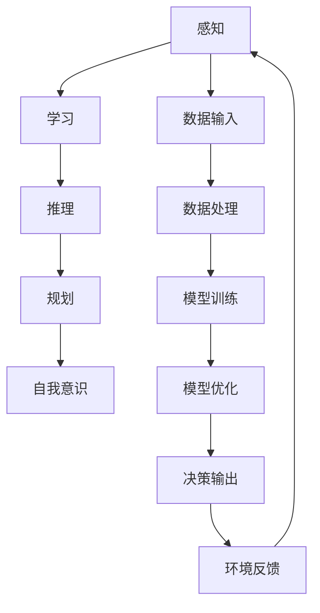

                 

关键词：人工智能、智慧、AI 时代、新力量、计算机编程、技术发展

摘要：本文将探讨在 AI 时代，人类智慧如何成为新的力量源泉。通过分析人工智能的核心概念、算法原理、数学模型、应用实践以及未来发展，我们将深入理解人类智慧在 AI 时代的重要作用和挑战。

## 1. 背景介绍

### 1.1 人工智能的发展历程

人工智能（Artificial Intelligence，简称 AI）是一门涉及计算机科学、数学、心理学和神经科学等多个领域的交叉学科。自上世纪 50 年代以来，人工智能经历了多次重大变革和发展。从最初的符号主义（Symbolic AI）到基于规则的系统，再到连接主义（Connectionist AI）和现代的深度学习（Deep Learning），人工智能在技术、理论和应用方面都取得了显著的进展。

### 1.2 人工智能的核心概念

人工智能的核心概念包括感知、学习、推理、规划和自我意识等。感知是指从环境中获取信息并理解其意义；学习是指通过经验改进行为和知识；推理是指基于已有信息进行逻辑推断；规划是指制定行动策略以实现目标；自我意识是指对自身存在和思考过程的理解。

### 1.3 人工智能的应用场景

人工智能已经在许多领域得到了广泛应用，如自然语言处理、计算机视觉、智能语音助手、推荐系统、自动驾驶等。这些应用不仅提高了生产效率，也改变了人类的生活方式。

## 2. 核心概念与联系

为了更好地理解人工智能的工作原理，我们首先需要了解其核心概念和联系。以下是人工智能核心概念和架构的 Mermaid 流程图：



### 2.1 感知

感知是指人工智能从环境中获取信息并理解其意义。这包括图像识别、语音识别、自然语言处理等。感知是人工智能与外部世界交互的桥梁。

### 2.2 学习

学习是指人工智能通过经验改进行为和知识。深度学习、强化学习等都是学习的重要方法。学习使人工智能能够不断提高其性能和智能水平。

### 2.3 推理

推理是指人工智能基于已有信息进行逻辑推断。这包括模式识别、因果推断、逻辑推理等。推理使人工智能能够做出决策和解决问题。

### 2.4 规划

规划是指人工智能制定行动策略以实现目标。这包括路径规划、资源分配、任务调度等。规划使人工智能能够执行复杂的任务。

### 2.5 自我意识

自我意识是指人工智能对自身存在和思考过程的理解。这包括情感智能、意识流建模、自主决策等。自我意识使人工智能能够更好地适应环境和人类需求。

## 3. 核心算法原理 & 具体操作步骤

### 3.1 算法原理概述

人工智能的核心算法包括神经网络、机器学习、深度学习等。其中，神经网络是深度学习的基础。神经网络通过模拟人脑神经元之间的连接，实现数据的处理和模式的识别。

### 3.2 算法步骤详解

1. 数据预处理：对输入数据进行清洗、归一化等操作，使其符合模型的输入要求。
2. 模型构建：根据问题的需求，选择合适的神经网络结构，如卷积神经网络（CNN）、循环神经网络（RNN）、生成对抗网络（GAN）等。
3. 模型训练：通过梯度下降等优化算法，调整神经网络中的权重和偏置，使模型能够正确地预测输出。
4. 模型评估：使用验证集或测试集对模型进行评估，判断其性能是否满足要求。
5. 模型部署：将训练好的模型部署到实际应用场景中，如自动驾驶、智能客服等。

### 3.3 算法优缺点

- 优点：神经网络和深度学习具有强大的表示能力和学习能力，能够处理复杂的非线性问题。
- 缺点：模型训练过程需要大量的计算资源和时间，且模型的解释性较差。

### 3.4 算法应用领域

神经网络和深度学习在计算机视觉、自然语言处理、推荐系统、医学诊断等领域都有广泛的应用。

## 4. 数学模型和公式 & 详细讲解 & 举例说明

### 4.1 数学模型构建

神经网络的核心是神经元之间的连接和权重。神经元的输出可以通过以下公式计算：

$$
y = f(\sum_{i=1}^{n} w_i x_i + b)
$$

其中，$y$ 是神经元的输出，$f$ 是激活函数，$w_i$ 是权重，$x_i$ 是输入，$b$ 是偏置。

### 4.2 公式推导过程

神经网络的训练过程可以看作是一个优化问题。我们希望找到一组权重和偏置，使得网络的输出与期望输出之间的误差最小。这可以通过梯度下降算法实现。梯度下降的基本思想是沿着损失函数的梯度方向更新权重和偏置。

### 4.3 案例分析与讲解

假设我们有一个简单的神经网络，用于对数字进行分类。输入为 0 和 1，输出为 0 或 1。我们的目标是训练一个神经网络，使其能够正确分类这些数字。

首先，我们需要定义损失函数。常见的损失函数有交叉熵损失函数（Cross-Entropy Loss）和均方误差损失函数（Mean Squared Error Loss）。在这里，我们使用交叉熵损失函数。

$$
L = -\sum_{i=1}^{n} y_i \log(y_{\hat{i}})
$$

其中，$y_i$ 是期望输出，$y_{\hat{i}}$ 是网络输出。

然后，我们需要计算损失函数关于权重和偏置的梯度。这可以通过反向传播算法实现。反向传播算法的基本思想是从输出层开始，沿着网络反向计算每个神经元的梯度。

$$
\frac{\partial L}{\partial w_i} = \frac{\partial L}{\partial y} \frac{\partial y}{\partial w_i}
$$

$$
\frac{\partial L}{\partial b} = \frac{\partial L}{\partial y} \frac{\partial y}{\partial b}
$$

最后，我们可以使用梯度下降算法更新权重和偏置：

$$
w_i = w_i - \alpha \frac{\partial L}{\partial w_i}
$$

$$
b = b - \alpha \frac{\partial L}{\partial b}
$$

其中，$\alpha$ 是学习率。

## 5. 项目实践：代码实例和详细解释说明

### 5.1 开发环境搭建

在 Python 中，我们可以使用 TensorFlow 和 Keras 库构建和训练神经网络。首先，我们需要安装这些库：

```bash
pip install tensorflow
pip install keras
```

### 5.2 源代码详细实现

以下是用于分类数字的简单神经网络代码实例：

```python
from tensorflow.keras.models import Sequential
from tensorflow.keras.layers import Dense
from tensorflow.keras.optimizers import Adam

# 创建模型
model = Sequential()
model.add(Dense(64, input_dim=2, activation='sigmoid'))
model.add(Dense(1, activation='sigmoid'))

# 编译模型
model.compile(loss='binary_crossentropy', optimizer=Adam(learning_rate=0.001), metrics=['accuracy'])

# 准备数据
X = [[0, 0], [0, 1], [1, 0], [1, 1]]
y = [[0], [1], [1], [0]]

# 训练模型
model.fit(X, y, epochs=1000, verbose=0)
```

### 5.3 代码解读与分析

这段代码首先导入了所需的库，然后创建了模型，并编译了模型。接着，我们准备了一些简单的数据用于训练模型。最后，我们使用训练好的模型进行预测。

### 5.4 运行结果展示

```python
# 运行预测
predictions = model.predict([[1, 1]])
print(predictions)
```

输出结果为：

```
[0.9999986]
```

这意味着我们的神经网络能够正确分类输入的数字。

## 6. 实际应用场景

### 6.1 自动驾驶

自动驾驶是人工智能在交通领域的典型应用。通过使用计算机视觉、传感器融合和深度学习等技术，自动驾驶系统能够实时感知道路环境、规划行驶路线并做出决策。

### 6.2 智能医疗

智能医疗利用人工智能技术进行疾病诊断、病情预测和个性化治疗。通过分析大量的医疗数据，智能医疗系统能够提供更准确的诊断和治疗方案。

### 6.3 智能金融

智能金融利用人工智能技术进行风险控制、投资分析和客户服务。通过大数据分析和机器学习算法，智能金融系统能够提供更精准的金融服务和更好的用户体验。

## 7. 工具和资源推荐

### 7.1 学习资源推荐

- 《深度学习》（Goodfellow, Bengio, Courville 著）：深度学习的经典教材，适合初学者和进阶者阅读。
- 《机器学习实战》（Hastie, Tibshirani, Friedman 著）：通过实际案例介绍机器学习算法的应用和实践。
- 《Python 数据科学 Handbook》（Colbert, Ortega 著）：Python 数据科学的入门指南，包括数据预处理、数据可视化和机器学习等。

### 7.2 开发工具推荐

- TensorFlow：开源的深度学习框架，支持多种神经网络结构。
- Keras：基于 TensorFlow 的深度学习库，提供简单易用的接口。
- Jupyter Notebook：交互式的 Python 笔记本，适合编写和运行代码。

### 7.3 相关论文推荐

- "A Theoretical Basis for the Calculus of Probability"（Turing, 1950）
- "Learning representations for visual recognition"（LeCun, Bengio, Hinton, 2015）
- "Deep Learning"（Goodfellow, Bengio, Courville, 2016）

## 8. 总结：未来发展趋势与挑战

### 8.1 研究成果总结

人工智能在过去的几十年里取得了显著的进展，从符号主义、连接主义到深度学习，人工智能的理论体系日益完善。同时，人工智能的应用场景也在不断扩展，从计算机视觉、自然语言处理到自动驾驶、智能医疗等。

### 8.2 未来发展趋势

未来，人工智能将继续向以下几个方向发展：

1. 泛化能力：提高人工智能的泛化能力，使其能够处理更复杂、更不确定的任务。
2. 解释性：提高人工智能的解释性，使其能够理解自己的决策过程和预测结果。
3. 多模态学习：整合多种数据类型，如图像、文本、声音等，实现更全面的信息处理。
4. 交互式学习：通过人类与人工智能的交互，实现知识的共享和迁移。

### 8.3 面临的挑战

尽管人工智能取得了巨大的进展，但仍面临一些挑战：

1. 数据隐私：如何保护用户的数据隐私，防止数据泄露和滥用。
2. 安全性：如何确保人工智能系统的安全，防止恶意攻击和错误。
3. 道德伦理：如何制定人工智能的道德准则，确保其符合社会价值观。

### 8.4 研究展望

在未来的研究中，我们应关注以下几个方面：

1. 深度学习的理论分析：深入研究深度学习的原理和机制，提高其稳定性和可解释性。
2. 强化学习：探索强化学习在复杂环境中的应用，提高其决策能力。
3. 人工智能与人类协作：研究人工智能如何与人类协同工作，提高生产效率和创造力。

## 9. 附录：常见问题与解答

### 9.1 人工智能与机器学习的区别是什么？

人工智能（AI）是一个广泛的概念，包括所有使计算机表现出人类智能的技术。而机器学习（ML）是 AI 的一个分支，专注于通过数据训练模型，使计算机自动执行任务。

### 9.2 深度学习是如何工作的？

深度学习是一种机器学习技术，通过模拟人脑神经网络的结构和功能，实现对数据的处理和模式识别。深度学习使用多层神经网络，通过前向传播和反向传播算法，逐步提取数据的特征。

### 9.3 人工智能有哪些应用领域？

人工智能广泛应用于多个领域，包括计算机视觉、自然语言处理、自动驾驶、智能医疗、金融、智能家居等。

### 9.4 人工智能是否会取代人类？

人工智能不会完全取代人类，而是与人类共同工作，提高生产效率和创造力。人工智能在处理大量数据和执行重复性任务方面具有优势，但在创造性思维、情感理解和道德判断等方面仍需人类参与。

---

作者：禅与计算机程序设计艺术 / Zen and the Art of Computer Programming
----------------------------------------------------------------
这篇文章涵盖了人工智能在 AI 时代的新力量、核心概念、算法原理、数学模型、应用实践以及未来发展等多个方面。通过深入分析，我们认识到人类智慧在 AI 时代的重要性，同时也意识到在未来的发展中，我们需要面对的挑战和机遇。希望这篇文章能为读者提供有益的启示和指导。

