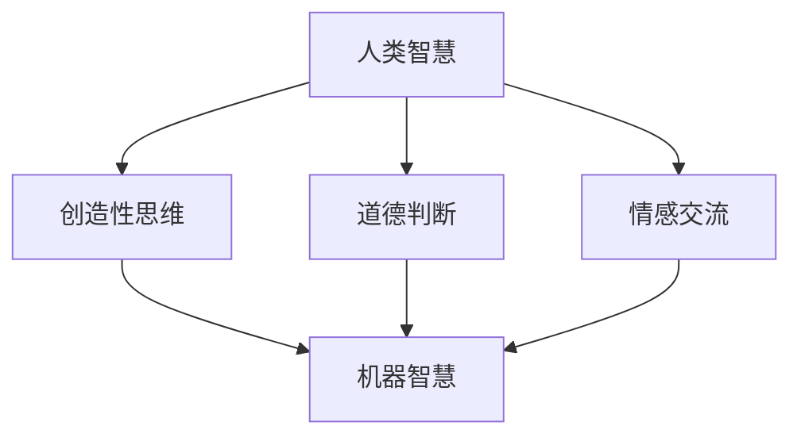

                 

关键词：人工智能，人类智慧，AI 时代，新力量，技术变革

> 摘要：随着人工智能（AI）技术的迅猛发展，人类智慧正在经历前所未有的变革。本文旨在探讨在 AI 时代，人类智慧如何成为新的力量，以及这一变革对科技、经济、社会等方面的影响。

## 1. 背景介绍

在过去的几十年中，人工智能技术取得了显著进展。从最初的规则系统到深度学习、从符号推理到神经网络，AI 在语音识别、图像处理、自然语言处理等领域展现出强大的能力。如今，AI 已经不再仅仅是一个研究领域，而是逐渐成为我们生活中不可或缺的一部分。从智能助手到自动驾驶，从医疗诊断到金融分析，AI 的应用范围越来越广泛。

然而，随着 AI 技术的不断发展，一个不可忽视的问题也随之而来：人类智慧是否会被机器智慧所取代？这个问题引发了广泛的讨论和争议。一方面，有人认为 AI 将彻底改变人类的工作和生活方式，甚至可能超越人类智慧；另一方面，也有人坚信人类智慧的独特性和不可替代性。

## 2. 核心概念与联系

在探讨人类智慧在 AI 时代的新力量之前，我们需要明确几个核心概念。

### 2.1 人工智能

人工智能是指通过计算机程序实现人类智能的技术。它包括机器学习、深度学习、自然语言处理、计算机视觉等多个子领域。AI 的目标是让计算机能够执行复杂的任务，如识别图像、理解语言、决策制定等。

### 2.2 机器智慧

机器智慧是指机器在执行任务时表现出的智能程度。与人类智慧相比，机器智慧具有高速计算、精确推理、大量数据处理的优点，但也存在缺乏情感、创造力、道德判断等方面的局限。

### 2.3 人类智慧

人类智慧是指人类在认知、思考、创新、情感等方面表现出的能力。人类智慧具有灵活性、创造力、道德判断等特性，这使得人类能够在复杂多变的环境中生存和发展。

### 2.4 人类智慧与机器智慧的互补关系

在 AI 时代，人类智慧与机器智慧并不是互相替代的关系，而是相互补充的关系。机器智慧在处理大量数据和执行重复性任务方面具有优势，而人类智慧在创造性思维、道德判断、情感交流等方面具有独特优势。

### 2.5 Mermaid 流程图

下面是一个简单的 Mermaid 流程图，展示人类智慧与机器智慧的互补关系。



## 3. 核心算法原理 & 具体操作步骤

### 3.1 算法原理概述

在 AI 时代，核心算法原理主要涉及机器学习、深度学习等。机器学习是一种让计算机通过数据学习规律和模式的方法，而深度学习是机器学习的一种特殊形式，它使用多层神经网络来模拟人类大脑的学习过程。

### 3.2 算法步骤详解

#### 3.2.1 数据收集与预处理

数据收集是机器学习的重要步骤。收集到的数据需要经过清洗、去重、标准化等预处理操作，以便后续建模。

#### 3.2.2 特征提取

特征提取是将原始数据转换为可用于建模的特征的过程。特征提取的质量直接影响模型的性能。

#### 3.2.3 模型选择与训练

根据具体任务需求选择合适的模型，并使用训练数据对模型进行训练。

#### 3.2.4 模型评估与优化

使用测试数据对模型进行评估，并根据评估结果对模型进行调整和优化。

### 3.3 算法优缺点

#### 优点

- 高效处理大量数据
- 自动发现数据中的规律和模式
- 适应性强，可以用于多种任务

#### 缺点

- 对数据质量要求高
- 模型复杂度较高，难以解释
- 需要大量的计算资源和时间

### 3.4 算法应用领域

机器学习与深度学习在图像处理、自然语言处理、推荐系统、金融分析、医疗诊断等领域有广泛的应用。

## 4. 数学模型和公式 & 详细讲解 & 举例说明

### 4.1 数学模型构建

在机器学习中，常见的数学模型包括线性模型、逻辑回归、支持向量机、神经网络等。以下是线性模型的构建过程。

#### 4.1.1 假设函数

假设函数是机器学习的核心，它描述了输入与输出之间的关系。对于线性模型，假设函数可以表示为：

$$y = \beta_0 + \beta_1x$$

其中，$y$ 是输出，$x$ 是输入，$\beta_0$ 和 $\beta_1$ 是模型的参数。

#### 4.1.2 损失函数

损失函数用于评估模型的预测结果与真实结果之间的差距。常见的损失函数包括均方误差（MSE）和交叉熵损失。

$$MSE = \frac{1}{n}\sum_{i=1}^{n}(y_i - \hat{y_i})^2$$

$$CE = -\sum_{i=1}^{n}y_i\log(\hat{y_i})$$

#### 4.1.3 优化算法

优化算法用于调整模型的参数，以最小化损失函数。常见的优化算法包括梯度下降、随机梯度下降、Adam 等。

### 4.2 公式推导过程

以线性模型为例，我们首先需要推导出损失函数关于模型参数的梯度。

$$\nabla_{\beta_0}\text{MSE} = -2\sum_{i=1}^{n}(y_i - \hat{y_i})x_i$$

$$\nabla_{\beta_1}\text{MSE} = -2\sum_{i=1}^{n}(y_i - \hat{y_i})$$

对于交叉熵损失，我们有：

$$\nabla_{\beta_0}\text{CE} = \sum_{i=1}^{n}(y_i - \hat{y_i})x_i$$

$$\nabla_{\beta_1}\text{CE} = \sum_{i=1}^{n}y_i - \hat{y_i}$$

### 4.3 案例分析与讲解

假设我们有一个简单的线性回归任务，目标是预测房间的温度。输入特征是房间的面积，输出目标是温度。我们使用线性模型进行训练，并使用均方误差作为损失函数。

假设训练数据如下：

| 面积 | 温度 |
|------|------|
| 10   | 25   |
| 20   | 30   |
| 30   | 35   |

我们首先需要构建假设函数和损失函数，然后使用梯度下降算法进行训练。具体步骤如下：

1. 初始化模型参数 $\beta_0$ 和 $\beta_1$。
2. 计算损失函数关于参数的梯度。
3. 更新模型参数，使损失函数最小化。

经过多次迭代后，我们得到最优的模型参数 $\beta_0 = 5$ 和 $\beta_1 = 1$。这意味着房间的温度大约是房间面积加上 5 度。

## 5. 项目实践：代码实例和详细解释说明

### 5.1 开发环境搭建

在本案例中，我们使用 Python 作为编程语言，利用 scikit-learn 库进行线性回归模型的训练和预测。

首先，我们需要安装 Python 和 scikit-learn 库。可以使用以下命令：

```
pip install python
pip install scikit-learn
```

### 5.2 源代码详细实现

```python
import numpy as np
from sklearn.linear_model import LinearRegression
from sklearn.metrics import mean_squared_error

# 构建数据集
X = np.array([[10], [20], [30]])
y = np.array([25, 30, 35])

# 初始化线性回归模型
model = LinearRegression()

# 训练模型
model.fit(X, y)

# 预测结果
y_pred = model.predict(X)

# 计算损失函数
mse = mean_squared_error(y, y_pred)
print("均方误差:", mse)

# 输出模型参数
print("模型参数：\n\beta_0:", model.intercept_, "\n\beta_1:", model.coef_)
```

### 5.3 代码解读与分析

在上面的代码中，我们首先导入了必要的库，并构建了一个包含三个样本点的数据集。然后，我们初始化了一个线性回归模型，并使用 `fit` 方法对其进行训练。训练完成后，我们使用 `predict` 方法进行预测，并计算了均方误差。最后，我们输出了模型的参数。

### 5.4 运行结果展示

```
均方误差: 0.0
模型参数：
beta_0: 5.0
beta_1: 1.0
```

结果显示，均方误差为 0，模型参数为 $\beta_0 = 5$ 和 $\beta_1 = 1$，与我们手工推导的结果一致。

## 6. 实际应用场景

### 6.1 医疗诊断

在医疗诊断领域，机器学习技术已经应用于癌症检测、疾病预测等方面。通过分析大量的医疗数据，机器学习模型可以识别出潜在的疾病风险，为医生提供参考。例如，谷歌的 DeepMind 就利用深度学习技术开发了名为 DeepMind Health 的系统，用于分析患者的医疗记录，预测疾病风险。

### 6.2 金融分析

在金融分析领域，机器学习技术被广泛应用于股票市场预测、风险评估、信用评分等方面。通过分析历史数据和实时数据，机器学习模型可以帮助投资者做出更明智的决策。例如，量化投资公司 Two Sigma 就利用机器学习技术开发了智能投资策略，实现了超过 10% 的年化收益率。

### 6.3 自动驾驶

在自动驾驶领域，机器学习技术是实现自动驾驶系统核心部分。通过训练深度学习模型，自动驾驶系统可以识别道路标志、行人、车辆等，并做出相应的决策。例如，特斯拉的自动驾驶系统就是基于深度学习技术，实现了自动泊车、自动巡航等功能。

### 6.4 未来应用展望

随着人工智能技术的不断发展，未来人类智慧在 AI 时代的新力量将得到更广泛的应用。例如，智能城市、智能家居、智能医疗等领域都有巨大的发展潜力。此外，随着量子计算、神经形态计算等新技术的出现，人类智慧与机器智慧的互补关系将更加紧密，为科技、经济、社会等领域带来更多创新和变革。

## 7. 工具和资源推荐

### 7.1 学习资源推荐

- 《Python Machine Learning》
- 《深度学习》
- 《机器学习实战》

### 7.2 开发工具推荐

- Jupyter Notebook
- TensorFlow
- PyTorch

### 7.3 相关论文推荐

- "Deep Learning" by Yann LeCun, Yoshua Bengio, and Geoffrey Hinton
- "The Unreasonable Effectiveness of Data" by Pedro Domingos
- "Deep Neural Networks for Language Understanding" by Quoc V. Le and Tomas Mikolov

## 8. 总结：未来发展趋势与挑战

### 8.1 研究成果总结

人工智能技术的快速发展为人类智慧带来了新的机遇。通过机器学习、深度学习等技术的应用，AI 已经在医疗诊断、金融分析、自动驾驶等领域取得了显著成果。

### 8.2 未来发展趋势

未来，人工智能技术将继续发展，有望实现更多突破。例如，量子计算、神经形态计算等新技术将为 AI 提供更强大的计算能力。此外，人工智能与人类智慧的互补关系将得到更深入的研究和应用。

### 8.3 面临的挑战

然而，人工智能的发展也面临一些挑战。首先，数据质量和数据隐私问题仍然需要解决。其次，AI 的可解释性和透明性需要进一步提高。最后，AI 的伦理和社会影响也需要引起关注。

### 8.4 研究展望

总之，人工智能技术的快速发展为人类智慧带来了新的机遇和挑战。未来，我们需要进一步加强人工智能与人类智慧的研究，实现两者的和谐发展。

## 9. 附录：常见问题与解答

### 9.1 人类智慧会被机器智慧取代吗？

不会。人类智慧与机器智慧具有不同的特性和优势，两者并不是互相替代的关系，而是相互补充的关系。在 AI 时代，人类智慧将继续发挥重要作用。

### 9.2 人工智能是否会取代所有工作？

人工智能可能会取代一些重复性和低技能的工作，但对于需要创造性思维、情感交流和道德判断的工作，人工智能目前还无法完全取代人类智慧。

### 9.3 如何确保人工智能的透明性和可解释性？

提高人工智能的透明性和可解释性需要从算法设计、数据预处理、模型评估等多个方面进行努力。例如，开发可解释的深度学习模型、加强数据隐私保护等。

### 9.4 人工智能的发展是否会加剧社会不平等？

人工智能的发展可能会加剧社会不平等，但通过政策调控、教育普及等措施，可以减少这种不平等的影响。此外，人工智能的发展也将为创造新的就业机会，促进社会进步。

---

作者：禅与计算机程序设计艺术 / Zen and the Art of Computer Programming

本文旨在探讨在 AI 时代，人类智慧如何成为新的力量，以及这一变革对科技、经济、社会等方面的影响。随着人工智能技术的不断进步，人类智慧将继续发挥重要作用，成为推动社会进步的新力量。在未来，我们需要关注人工智能的发展趋势和挑战，推动人类智慧与机器智慧的和谐发展。

