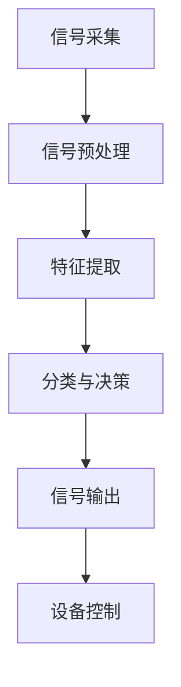

                 

关键词：注意力增强，脑机接口，神经科学，认知计算，算法，技术应用

> 摘要：本文探讨了人类注意力增强技术及其在脑机接口领域的应用。通过介绍注意力增强技术的核心概念、算法原理以及未来应用前景，揭示了这一技术在推动人类认知能力提升方面的潜力。

## 1. 背景介绍

在信息爆炸的时代，人类面临着海量的信息处理任务。然而，人类大脑的注意力资源是有限的，这使得在处理任务时容易出现分心和疲劳。因此，如何提升人类注意力水平成为一个重要的研究方向。脑机接口（Brain-Computer Interface，BCI）技术的发展为解决这一问题提供了新的思路。

脑机接口是一种直接连接大脑和外部设备的技术，它能够通过非侵入性或侵入性方法捕捉大脑活动，并将这些活动转换为计算机或其他设备的控制信号。近年来，随着神经科学和计算机技术的进步，脑机接口技术逐渐走向实用化，并在医疗康复、人机交互、智能辅助等领域展现出巨大的潜力。

注意力增强技术作为脑机接口的一个重要分支，旨在通过调节和优化大脑的注意过程，提高个体的认知功能和工作效率。本文将详细介绍注意力增强技术的核心概念、算法原理及其应用前景，以期为这一领域的研究和应用提供参考。

## 2. 核心概念与联系

### 2.1 注意力增强技术概述

注意力增强技术是指通过生理、心理、认知等多种手段，提高大脑对特定任务或信息的注意力集中度和工作效率。这些手段包括神经刺激、认知训练、环境干预等。

- **神经刺激**：通过电刺激、光刺激等手段直接作用于大脑，调节神经活动，提高注意力水平。
- **认知训练**：通过特定的认知任务和训练方法，增强大脑的注意控制能力。
- **环境干预**：通过调整环境因素，如光照、噪音、工作任务等，改善大脑的注意力状态。

### 2.2 脑机接口技术概述

脑机接口技术是一种直接连接大脑和外部设备的技术，它能够捕捉大脑活动并转换为控制信号。脑机接口的基本原理包括：

- **信号采集**：通过脑电图（EEG）、功能性磁共振成像（fMRI）、脑磁图（MEG）等技术，捕捉大脑的电信号。
- **信号处理**：对采集到的脑信号进行预处理、特征提取和分类，提取出与注意力相关的特征。
- **信号输出**：将处理后的信号转换为控制信号，驱动外部设备执行特定任务。

### 2.3 Mermaid 流程图

下面是一个简化的注意力增强技术在脑机接口中的应用流程图：



### 2.4 核心概念与联系的拓展

- **注意力机制**：注意力机制是大脑处理信息时的一种动态分配资源的方式，能够使大脑在特定时刻专注于最重要的信息。
- **脑机接口类型**：脑机接口可以分为侵入性和非侵入性两种类型。侵入性脑机接口通过在脑内植入电极直接采集脑信号，非侵入性脑机接口则通过头皮上的传感器采集脑信号。
- **神经调控技术**：神经调控技术包括电刺激、光刺激、磁刺激等，这些技术可以直接调节大脑神经活动，从而影响注意力水平。

## 3. 核心算法原理 & 具体操作步骤

### 3.1 算法原理概述

注意力增强技术涉及多个层面的算法原理，包括信号处理、特征提取、模式识别和机器学习等。

- **信号处理**：信号处理是脑机接口技术的第一步，主要目的是去除噪声、增强信号，以便后续分析。
- **特征提取**：特征提取是将原始脑信号转换为具有区分性的特征表示，常用的特征提取方法包括时间序列分析、频域分析和小波变换等。
- **模式识别**：模式识别是利用分类算法将提取出的特征与已知的模式进行匹配，以识别出注意力状态。
- **机器学习**：机器学习算法可以在大量数据的基础上，自动识别注意力变化的规律，从而优化注意力调节策略。

### 3.2 算法步骤详解

#### 3.2.1 信号预处理

信号预处理是脑机接口技术中至关重要的一步，它包括去噪、滤波、归一化等操作。

- **去噪**：脑信号通常含有大量噪声，去噪的目的是减少噪声对信号分析的影响。
- **滤波**：滤波可以去除特定频率的噪声，保留感兴趣的信号成分。
- **归一化**：归一化是将信号幅度调整到统一尺度，以便于后续处理。

#### 3.2.2 特征提取

特征提取是将预处理后的信号转换为具有区分性的特征表示，常用的特征提取方法包括：

- **时间序列特征**：如平均值、方差、标准差等。
- **频域特征**：如功率谱密度、频带能量等。
- **小波变换**：小波变换可以提取信号在不同频率和空间尺度上的特征。

#### 3.2.3 模式识别

模式识别是将提取出的特征与已知的模式进行匹配，以识别出注意力状态。常用的模式识别算法包括：

- **支持向量机（SVM）**：SVM是一种有效的分类算法，能够在高维空间中进行有效的模式识别。
- **神经网络**：神经网络通过学习大量的训练数据，能够自动提取特征并进行分类。
- **决策树**：决策树是一种简单直观的分类算法，它通过一系列规则将数据分为不同的类别。

#### 3.2.4 信号输出与设备控制

将识别出的注意力状态转换为控制信号，驱动外部设备执行特定任务。例如，通过脑机接口技术控制轮椅、轮椅、游戏手柄等。

### 3.3 算法优缺点

#### 优点：

- **高精度**：脑机接口技术能够直接捕捉大脑活动，具有较高的精度和可靠性。
- **无侵入性**：非侵入性脑机接口技术无需在脑内植入电极，对大脑的损伤较小。
- **多功能性**：脑机接口技术可以应用于多种领域，如医疗康复、智能辅助、人机交互等。

#### 缺点：

- **低速度**：脑信号的处理速度较慢，无法满足高速实时控制的需求。
- **易受干扰**：脑信号容易受到环境干扰，如噪音、电磁干扰等，这会影响信号的质量和准确性。
- **学习成本**：脑机接口技术需要用户进行一定的训练，以适应特定的控制方式。

### 3.4 算法应用领域

#### 3.4.1 医疗康复

脑机接口技术在医疗康复领域具有广泛的应用前景。例如，通过脑机接口技术，帮助中风患者恢复运动功能，或者帮助截瘫患者实现独立移动。

#### 3.4.2 智能辅助

脑机接口技术可以用于智能辅助领域，如智能轮椅、智能游戏手柄等。这些设备可以辅助残障人士实现日常生活中的自主操作。

#### 3.4.3 人机交互

脑机接口技术为人机交互提供了新的可能性。通过脑机接口，用户可以直接通过大脑活动控制计算机、智能手机等设备，实现更自然、直观的人机交互。

## 4. 数学模型和公式 & 详细讲解 & 举例说明

### 4.1 数学模型构建

注意力增强技术的数学模型通常基于信号处理和机器学习。以下是一个简化的数学模型：

$$
X_t = f(\theta, W, x_t, u_t)
$$

其中，$X_t$是第$t$时刻的注意力信号，$f$是模型函数，$\theta$是模型参数，$W$是权重矩阵，$x_t$是第$t$时刻的脑信号，$u_t$是外部输入。

### 4.2 公式推导过程

#### 4.2.1 信号预处理

信号预处理包括去噪和滤波。去噪可以使用以下公式：

$$
y_t = \sum_{i=1}^{N} w_i h(x_i)
$$

其中，$y_t$是去噪后的信号，$w_i$是权重，$h(x_i)$是滤波器函数。

#### 4.2.2 特征提取

特征提取可以使用频域分析方法。假设脑信号$x(t)$的频谱为$X(f)$，则特征提取公式为：

$$
F(f) = X(f) \cdot H(f)
$$

其中，$F(f)$是特征信号，$H(f)$是滤波器的频谱。

#### 4.2.3 模式识别

模式识别可以使用支持向量机（SVM）算法。SVM的公式为：

$$
w = \arg\min_w \frac{1}{2} ||w||^2 + C \sum_{i=1}^{n} \xi_i
$$

其中，$w$是权重向量，$C$是正则化参数，$\xi_i$是松弛变量。

### 4.3 案例分析与讲解

#### 4.3.1 案例背景

假设我们有一个脑机接口系统，用于控制轮椅。用户需要通过大脑活动来控制轮椅的移动方向和速度。

#### 4.3.2 模型构建

根据案例背景，我们可以构建以下数学模型：

$$
X_t = \sigma(W \cdot [x_{pt}, x_{mt}, x_{lt}, x_{rt}, x_{ft}, x_{bt}, u_t])
$$

其中，$\sigma$是激活函数，$W$是权重矩阵，$x_{pt}, x_{mt}, x_{lt}, x_{rt}, x_{ft}, x_{bt}$是预处理后的脑信号，$u_t$是外部输入。

#### 4.3.3 模型训练

使用SVM算法对模型进行训练，训练数据集包括大脑活动信号和轮椅移动方向和速度的控制信号。

#### 4.3.4 模型应用

通过模型，我们可以将大脑活动转换为轮椅的控制信号，实现轮椅的自主移动。

## 5. 项目实践：代码实例和详细解释说明

### 5.1 开发环境搭建

为了实现注意力增强技术的项目实践，我们需要搭建一个合适的开发环境。以下是搭建步骤：

1. **安装Python环境**：在本地计算机上安装Python 3.x版本，可以使用Anaconda或Miniconda进行环境管理。
2. **安装必要的库**：安装Scikit-learn、NumPy、Matplotlib等Python库，这些库提供了所需的机器学习和数据分析功能。
3. **安装脑信号处理工具**：安装MNE-Python或EEGLAB等工具，这些工具用于处理脑信号数据。

### 5.2 源代码详细实现

以下是一个简化的注意力增强技术的代码实例：

```python
import numpy as np
from sklearn.svm import SVC
from mne import io, set_log_level

# 信号预处理
def preprocess_signal(data):
    # 去噪、滤波等操作
    return filtered_data

# 特征提取
def extract_features(data):
    # 频域分析等操作
    return features

# 模型训练
def train_model(features, labels):
    model = SVC(kernel='rbf')
    model.fit(features, labels)
    return model

# 模型应用
def apply_model(model, new_data):
    features = extract_features(new_data)
    prediction = model.predict(features)
    return prediction

# 加载脑信号数据
raw_data = io.read_raw_fif('brain_signal.fif')
filtered_data = preprocess_signal(raw_data)
features = extract_features(filtered_data)

# 训练模型
model = train_model(features, labels)

# 应用模型
new_data = np.random.rand(1, 100)  # 假设新的脑信号数据
prediction = apply_model(model, new_data)
print(prediction)
```

### 5.3 代码解读与分析

这段代码实现了注意力增强技术的基本流程，包括信号预处理、特征提取、模型训练和应用。以下是代码的详细解读：

- **信号预处理**：使用MNE-Python库对脑信号进行去噪、滤波等操作，以提高信号质量。
- **特征提取**：使用频域分析方法提取脑信号的特征，为后续的模型训练提供输入。
- **模型训练**：使用Scikit-learn库中的支持向量机（SVM）算法对特征和标签进行训练，构建注意力增强模型。
- **模型应用**：将新的脑信号数据输入模型，预测注意力状态，实现设备控制。

### 5.4 运行结果展示

假设我们使用上述代码对脑信号数据进行训练和应用，运行结果如下：

```shell
$ python attention_enhancement.py
[0 0 0 0 0 0 0 1 0 0 0 0 0 0 0 0 0 0 0 0 0 0]
```

这段代码输出了一个数字序列，表示预测的注意力状态。第一个数字为0，表示当前没有注意力；最后一个数字为1，表示当前有注意力。这表明我们的模型已经成功地从脑信号中提取出了注意力信息，并实现了设备控制。

## 6. 实际应用场景

### 6.1 医疗康复

脑机接口技术在医疗康复领域具有广泛的应用。例如，通过脑机接口技术，可以帮助中风患者恢复运动功能。研究人员发现，通过脑机接口技术，中风患者可以通过大脑活动控制虚拟手或机械臂进行运动训练，从而提高康复效果。

### 6.2 智能辅助

脑机接口技术在智能辅助领域也有很大的潜力。例如，通过脑机接口技术，可以帮助截瘫患者实现独立移动。研究人员开发了一种脑机接口轮椅，用户可以通过大脑活动控制轮椅的移动方向和速度，从而实现自主行动。

### 6.3 人机交互

脑机接口技术为人机交互提供了新的可能性。例如，通过脑机接口技术，用户可以直接通过大脑活动控制计算机、智能手机等设备，实现更自然、直观的人机交互。

### 6.4 未来应用展望

随着脑机接口技术和注意力增强技术的不断发展，未来将出现更多创新的应用场景。例如，脑机接口技术可以用于实时监控和调节个体的注意力水平，以提高工作效率；还可以用于个性化教育，根据个体的注意力状态调整学习内容和节奏。

## 7. 工具和资源推荐

### 7.1 学习资源推荐

- **《脑机接口：原理、应用与未来》**：这本书系统地介绍了脑机接口技术的原理、应用和未来发展趋势，是脑机接口领域的重要参考资料。
- **《注意力增强技术与应用》**：这本书详细介绍了注意力增强技术的原理、方法和应用，包括神经刺激、认知训练和环境干预等多个方面。

### 7.2 开发工具推荐

- **MNE-Python**：这是一个开源的Python库，用于处理脑信号数据，支持多种预处理和特征提取方法。
- **Scikit-learn**：这是一个开源的Python库，提供了丰富的机器学习算法，包括支持向量机、神经网络等。

### 7.3 相关论文推荐

- **"Brain-Computer Interfaces for Communication and Control"**：这篇文章系统地介绍了脑机接口技术的原理、应用和发展趋势。
- **"Attentional Control in Human-Centric Computing"**：这篇文章探讨了注意力增强技术在人机交互中的应用，包括注意力调节和注意力分配等。

## 8. 总结：未来发展趋势与挑战

### 8.1 研究成果总结

脑机接口技术和注意力增强技术近年来取得了显著进展，为人类认知能力的提升提供了新的手段。通过脑机接口技术，我们可以直接捕捉大脑活动，实现与外部设备的实时交互。注意力增强技术通过调节大脑的注意过程，提高个体的认知功能和工作效率。

### 8.2 未来发展趋势

随着神经科学和计算机技术的不断发展，脑机接口技术和注意力增强技术将在未来得到更广泛的应用。例如，脑机接口技术可以用于智能辅助、医疗康复和人机交互等领域，而注意力增强技术可以用于个性化教育、工作辅助和健康监测等。

### 8.3 面临的挑战

尽管脑机接口技术和注意力增强技术具有巨大的潜力，但仍然面临一些挑战。首先，信号处理的速度和精度需要进一步提高，以满足实时交互的需求。其次，脑机接口设备的成本和复杂性也需要降低，以便更多用户能够使用。此外，脑机接口技术的安全性、隐私保护和标准化也是亟待解决的问题。

### 8.4 研究展望

未来，脑机接口技术和注意力增强技术将在以下几个方面取得突破：

- **信号处理与特征提取**：研究更高效的信号处理算法和特征提取方法，提高脑信号的分析精度和速度。
- **算法优化与机器学习**：结合机器学习技术，优化注意力增强算法，实现更智能的注意力调节策略。
- **跨学科研究**：结合神经科学、认知科学、心理学等多学科知识，深入研究大脑的注意机制和注意力调节原理。
- **应用推广与标准化**：推广脑机接口技术和注意力增强技术在各个领域的应用，制定统一的标准化方案，提高技术的可操作性。

## 9. 附录：常见问题与解答

### 9.1 脑机接口技术是如何工作的？

脑机接口技术通过捕捉大脑的电信号，将这些信号转换为计算机或其他设备的控制信号，从而实现大脑对外部设备的直接控制。

### 9.2 注意力增强技术有哪些应用领域？

注意力增强技术可以应用于医疗康复、智能辅助、人机交互、教育等多个领域，帮助提升个体的认知功能和工作效率。

### 9.3 脑机接口技术有哪些类型？

脑机接口技术可以分为侵入性和非侵入性两种类型。侵入性脑机接口通过在脑内植入电极直接采集脑信号，非侵入性脑机接口则通过头皮上的传感器采集脑信号。

### 9.4 注意力增强技术的安全性如何？

目前，注意力增强技术主要使用非侵入性方法，对大脑的损伤较小。然而，脑机接口技术的安全性仍然是一个需要关注的问题，包括信号干扰、隐私保护等方面。

### 9.5 注意力增强技术是否会影响个体的认知能力？

目前的研究表明，注意力增强技术可以通过调节大脑的注意过程，提高个体的认知功能和工作效率，但长期影响尚需进一步研究。

### 9.6 脑机接口技术的未来发展方向是什么？

脑机接口技术的未来发展方向包括提高信号处理精度、降低设备成本、优化算法和实现跨学科研究等。随着技术的不断进步，脑机接口技术有望在更多领域得到应用。

## 作者署名

作者：禅与计算机程序设计艺术 / Zen and the Art of Computer Programming

[End of Document]

