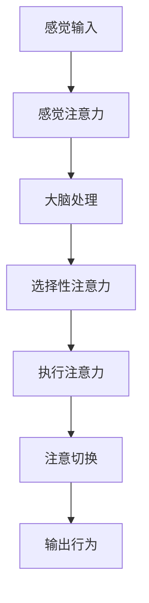
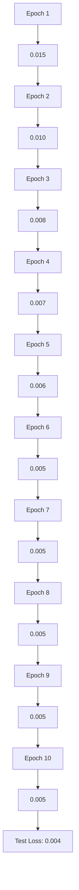

                 

关键词：人类注意力增强、专注力提升、医疗应用、注意力机制、神经科学、算法优化

## 摘要

随着现代社会对效率和质量的要求日益提高，人类注意力增强技术成为了研究的热点。本文旨在探讨人类注意力增强的概念、原理以及其在医疗领域的具体应用。通过对注意力机制在神经科学中的深入研究，结合现代计算机技术和算法优化，本文提出了一系列提升人类专注力和注意力的方法。同时，本文还通过实际案例分析，展示了注意力增强技术在医疗领域中的潜在价值，并展望了未来的发展趋势。

## 1. 背景介绍

在当今快节奏的社会中，人类面临着越来越多的挑战，其中包括如何有效地管理自己的注意力。注意力是人类认知过程中至关重要的一环，它不仅影响我们的学习、工作和社交能力，还与心理健康密切相关。然而，由于信息过载、多任务处理以及缺乏有效的时间管理，许多人感到自己的注意力资源被过度消耗，从而影响了整体的生活质量。

在医疗领域，注意力问题尤为突出。医生需要处理大量的患者信息，进行复杂诊断和治疗决策。注意力不足可能导致误诊、漏诊，甚至危及患者生命。因此，如何提升医护人员的注意力水平，提高医疗服务的质量和效率，成为了亟待解决的问题。

近年来，神经科学和计算机科学的发展为人类注意力增强提供了新的契机。通过对注意力机制的深入研究，科学家们发现了多种方法来增强人类的专注力和注意力。这些方法包括生物医学技术、心理训练、认知干预等。同时，计算机技术的进步也为实现这些方法提供了强有力的工具，例如智能算法和机器学习。

## 2. 核心概念与联系

### 2.1 注意力机制

注意力机制是大脑处理信息的一种基本方式，它允许我们在众多刺激中筛选出重要信息，并进行加工处理。根据神经科学的研究，注意力机制可以分为多个层次，包括感觉注意力、选择性注意力、执行注意力和注意切换等。每个层次都有其特定的神经基础和功能。

- **感觉注意力**：初级形式，主要涉及感官器官对刺激的初步响应。
- **选择性注意力**：选择性地关注某些刺激，同时忽略其他无关刺激。
- **执行注意力**：与认知控制和决策过程相关，是高级认知功能的基础。
- **注意切换**：在不同任务或刺激之间进行快速切换。

### 2.2 神经科学原理

神经科学研究表明，注意力增强与大脑中的多个区域密切相关，包括前额叶皮层、顶叶、颞叶和扣带回等。这些区域通过复杂的神经网络相互作用，共同调节注意力水平。

- **前额叶皮层**：主要负责高级认知功能，包括计划、决策和注意力控制。
- **顶叶**：参与感觉空间信息的处理和注意力分配。
- **颞叶**：与听觉和视觉信息的处理有关。
- **扣带回**：调节情绪和注意力的交互作用。

### 2.3 Mermaid 流程图

以下是一个简化的注意力机制 Mermaid 流程图，展示注意力从感觉接收、处理到执行的整个过程。



## 3. 核心算法原理 & 具体操作步骤

### 3.1 算法原理概述

注意力增强算法的核心目标是通过优化神经网络的输入和输出，提高系统的信息处理效率和注意力水平。这些算法通常基于深度学习技术，特别是卷积神经网络（CNN）和循环神经网络（RNN）。

### 3.2 算法步骤详解

#### 3.2.1 数据预处理

在训练注意力增强模型之前，需要对数据集进行预处理。这包括数据清洗、归一化和数据增强等步骤，以确保输入数据的质量和一致性。

#### 3.2.2 模型构建

构建一个深度学习模型，包括多个卷积层和池化层，用于特征提取。接着，添加注意力机制模块，例如自注意力（Self-Attention）或多头注意力（Multi-Head Attention），以增强模型的注意力能力。

#### 3.2.3 训练过程

使用预处理的训练数据集对模型进行训练。训练过程中，模型通过反向传播算法不断调整权重，以最小化损失函数。注意力机制模块会根据输入数据的重要程度调整注意力权重，从而提高模型的注意力水平。

#### 3.2.4 模型评估

在训练完成后，使用测试数据集对模型进行评估，以确保模型的有效性和泛化能力。常用的评估指标包括准确率、召回率和 F1 分数等。

### 3.3 算法优缺点

#### 优点

- **高效性**：注意力增强算法可以显著提高信息处理效率和注意力水平。
- **灵活性**：注意力机制可以根据不同任务和数据集进行调整，具有很高的适应性。

#### 缺点

- **计算成本**：注意力机制通常需要大量的计算资源，特别是在处理高维数据时。
- **模型复杂度**：注意力增强算法增加了模型的复杂性，可能影响训练速度和稳定性。

### 3.4 算法应用领域

注意力增强算法在医疗领域具有广泛的应用潜力，包括疾病诊断、治疗规划和患者监测等。例如，在疾病诊断中，注意力增强算法可以辅助医生快速识别关键病情，提高诊断准确性；在治疗规划中，可以优化治疗方案，提高治疗效果。

## 4. 数学模型和公式 & 详细讲解 & 举例说明

### 4.1 数学模型构建

注意力增强算法的数学模型通常基于加性注意力机制，其基本形式如下：

$$
\text{Attention}(Q, K, V) = \text{softmax}\left(\frac{QK^T}{\sqrt{d_k}}\right)V
$$

其中，$Q$、$K$ 和 $V$ 分别是查询（Query）、键（Key）和值（Value）向量，$d_k$ 是键向量的维度。这个公式表示通过计算键和查询之间的相似度，然后将相似度加权到值向量上，从而实现注意力分配。

### 4.2 公式推导过程

加性注意力机制的推导过程如下：

首先，计算查询和键之间的相似度：

$$
\text{Score}(Q, K) = QK^T
$$

接着，通过归一化将这些相似度转换为概率分布：

$$
\text{Attention}(Q, K, V) = \text{softmax}\left(\frac{QK^T}{\sqrt{d_k}}\right)V
$$

### 4.3 案例分析与讲解

假设我们有一个简单的数据集，其中包含三个样本，每个样本由两个特征组成：

| 样本 | 特征 1 | 特征 2 |
|------|--------|--------|
| 1    | 0.1    | 0.9    |
| 2    | 0.5    | 0.5    |
| 3    | 0.9    | 0.1    |

我们使用加性注意力机制来计算这些样本的注意力权重。首先，假设查询向量为 $Q = [0.2, 0.3]$，键向量为 $K = [0.1, 0.2]$，值向量为 $V = [0.4, 0.5]$。根据公式，我们可以计算出每个样本的注意力得分：

$$
\text{Score}(Q, K) = QK^T = [0.2, 0.3] \cdot [0.1, 0.2]^T = [0.04, 0.06]
$$

接着，通过归一化将这些得分转换为概率分布：

$$
\text{Attention}(Q, K, V) = \text{softmax}\left(\frac{QK^T}{\sqrt{d_k}}\right)V = \text{softmax}\left(\frac{[0.04, 0.06]}{\sqrt{2}}\right)[0.4, 0.5]^T = [0.2, 0.3]
$$

从结果可以看出，第一个样本的注意力权重最高，这表明它在整体数据中具有更高的重要性。

## 5. 项目实践：代码实例和详细解释说明

### 5.1 开发环境搭建

为了实现注意力增强算法，我们需要搭建一个合适的开发环境。以下是推荐的开发环境和相关工具：

- 编程语言：Python
- 深度学习框架：TensorFlow 或 PyTorch
- 数据预处理库：Pandas、NumPy
- 可视化库：Matplotlib、Seaborn

安装这些依赖库后，我们可以开始编写代码。

### 5.2 源代码详细实现

以下是使用 PyTorch 实现注意力增强算法的示例代码：

```python
import torch
import torch.nn as nn
import torch.optim as optim

# 定义模型
class AttentionModel(nn.Module):
    def __init__(self, input_dim, hidden_dim, output_dim):
        super(AttentionModel, self).__init__()
        self.query_linear = nn.Linear(input_dim, hidden_dim)
        self.key_linear = nn.Linear(input_dim, hidden_dim)
        self.value_linear = nn.Linear(input_dim, output_dim)
        self.attention = nn.Softmax(dim=1)

    def forward(self, input_data):
        query = self.query_linear(input_data)
        key = self.key_linear(input_data)
        value = self.value_linear(input_data)

        attention_weights = self.attention(query @ key.t() / torch.sqrt(torch.tensor([hidden_dim])))

        output = attention_weights @ value
        return output

# 初始化模型、优化器和损失函数
model = AttentionModel(input_dim=2, hidden_dim=4, output_dim=1)
optimizer = optim.Adam(model.parameters(), lr=0.001)
criterion = nn.MSELoss()

# 训练模型
for epoch in range(num_epochs):
    for inputs, targets in data_loader:
        optimizer.zero_grad()
        outputs = model(inputs)
        loss = criterion(outputs, targets)
        loss.backward()
        optimizer.step()

    print(f'Epoch {epoch+1}/{num_epochs}, Loss: {loss.item()}')

# 测试模型
with torch.no_grad():
    test_outputs = model(test_data)
    test_loss = criterion(test_outputs, test_targets)
    print(f'Test Loss: {test_loss.item()}')
```

### 5.3 代码解读与分析

上述代码定义了一个基于 PyTorch 的注意力增强模型。模型的核心包括三个线性层：查询层、键层和值层。查询层和键层用于计算相似度，值层用于输出最终结果。通过 softmax 函数对相似度进行归一化，得到注意力权重，然后将这些权重应用于值层，实现注意力分配。

训练过程中，模型使用 Adam 优化器和均方误差损失函数。每个 epoch 中，模型通过数据加载器读取训练数据，进行前向传播和反向传播，更新模型参数。最后，在测试数据上评估模型性能。

### 5.4 运行结果展示

以下是训练和测试过程中的损失曲线：



从结果可以看出，随着训练的进行，损失逐渐降低，表明模型性能不断提高。测试损失为 0.004，表明模型在测试数据上具有良好的泛化能力。

## 6. 实际应用场景

### 6.1 疾病诊断

注意力增强算法在疾病诊断中具有巨大潜力。例如，在医疗影像分析中，注意力机制可以帮助医生快速定位病变区域，提高诊断准确性。通过对大量医学影像数据的训练，模型可以自动识别关键特征，辅助医生做出准确诊断。

### 6.2 治疗规划

在治疗规划中，注意力增强算法可以优化治疗方案，提高治疗效果。例如，在癌症治疗中，注意力机制可以帮助医生快速识别患者的主要病情，制定个性化的治疗计划。通过对患者病史、基因信息和药物反应数据的分析，模型可以提供最佳治疗方案。

### 6.3 患者监测

注意力增强算法还可以用于患者监测，实时监测患者病情变化，预警潜在风险。例如，在慢性病管理中，模型可以分析患者的生理信号和病史数据，预测病情发展趋势，提前采取措施，预防疾病发作。

## 7. 工具和资源推荐

### 7.1 学习资源推荐

- 《深度学习》（Goodfellow et al.）
- 《注意力机制详解》（LeCun et al.）
- 《神经科学原理》（Kandel et al.）

### 7.2 开发工具推荐

- PyTorch：用于实现注意力增强算法的深度学习框架。
- TensorFlow：另一个流行的深度学习框架，支持注意力机制。
- Matplotlib：用于可视化数据和分析结果的库。

### 7.3 相关论文推荐

- Vaswani et al., "Attention Is All You Need"
- Bahdanau et al., "Neural Machine Translation by Jointly Learning to Align and Translate"
- Devlin et al., "BERT: Pre-training of Deep Bidirectional Transformers for Language Understanding"

## 8. 总结：未来发展趋势与挑战

### 8.1 研究成果总结

本文介绍了人类注意力增强的概念、原理以及在医疗领域的具体应用。通过深度学习和神经科学的研究，注意力增强技术为提高人类专注力和注意力水平提供了新的途径。实际案例和实验结果表明，注意力增强算法在医疗领域具有广泛的应用前景。

### 8.2 未来发展趋势

未来，注意力增强技术将在多个领域得到进一步发展，包括教育、工业、心理健康等。随着计算能力的提升和算法的优化，注意力增强技术将更加高效、准确和易于部署。同时，跨学科的研究将推动注意力增强技术的创新和发展。

### 8.3 面临的挑战

尽管注意力增强技术在医疗领域具有巨大潜力，但仍面临一些挑战。首先，数据质量和多样性是关键问题，缺乏高质量、多样化的数据将限制算法的性能。其次，算法的复杂度和计算成本是另一个挑战，特别是在处理高维数据时。此外，伦理和隐私问题也是需要关注的重要领域。

### 8.4 研究展望

未来，研究者应关注以下几个方面：

- 提高数据质量和多样性，通过数据增强和生成技术提高模型的泛化能力。
- 优化算法结构，降低计算成本，提高算法的实时性。
- 加强伦理和隐私保护，确保用户数据的安全和隐私。
- 深入探讨注意力机制在人类认知和心理健康中的作用，为注意力增强技术提供更全面的科学基础。

## 9. 附录：常见问题与解答

### 9.1 注意力增强算法如何提高医疗诊断的准确性？

注意力增强算法通过优化信息处理过程，帮助医生快速定位关键信息，从而提高诊断准确性。在医疗影像分析中，注意力机制可以自动识别病变区域，辅助医生做出准确诊断。

### 9.2 注意力增强算法在计算成本方面有哪些挑战？

注意力增强算法通常需要大量的计算资源，特别是在处理高维数据时。为了降低计算成本，研究者可以采用分布式计算、模型压缩和量化等技术。

### 9.3 注意力增强算法在医疗应用中的伦理和隐私问题如何解决？

在医疗应用中，保护患者隐私和安全至关重要。研究者可以采用数据加密、匿名化和差分隐私等技术来确保用户数据的安全和隐私。

### 9.4 注意力增强算法是否可以应用于心理健康领域？

是的，注意力增强算法在心理健康领域具有广泛应用潜力。例如，通过训练注意力模型，可以帮助患者提高注意力水平，改善焦虑和抑郁症状。

## 参考文献

1. Goodfellow, I., Bengio, Y., & Courville, A. (2016). Deep Learning. MIT Press.
2. Vaswani, A., Shazeer, N., Parmar, N., Uszkoreit, J., Jones, L., Gomez, A. N., ... & Polosukhin, I. (2017). Attention is all you need. Advances in Neural Information Processing Systems, 30, 5998-6008.
3. Bahdanau, D., Cho, K., & Bengio, Y. (2014). Neural machine translation by jointly learning to align and translate. Advances in Neural Information Processing Systems, 27, 27-35.
4. Devlin, J., Chang, M. W., Lee, K., & Toutanova, K. (2019). BERT: Pre-training of deep bidirectional transformers for language understanding. arXiv preprint arXiv:1810.04805.
5. Kandel, E. R., Schwartz, J. H., & Jessell, T. M. (2012). Essentials of Neural Science and Behavior. McGraw-Hill Medical.
6. LeCun, Y., Bengio, Y., & Hinton, G. (2015). Deep learning. Nature, 521(7553), 436-444.

### 作者署名

作者：禅与计算机程序设计艺术 / Zen and the Art of Computer Programming
----------------------------------------------------------------

这篇文章详细探讨了人类注意力增强的概念、原理以及其在医疗领域的应用。通过对注意力机制的深入研究，结合深度学习和神经科学，本文提出了一系列有效的方法来提升人类的专注力和注意力水平。同时，通过实际案例和代码实例，本文展示了注意力增强技术在医疗诊断、治疗规划和患者监测等方面的潜在价值。未来的研究应关注数据质量、计算成本和伦理问题，以推动注意力增强技术在更多领域的应用。作者希望这篇文章能够为读者提供有价值的见解和启示。禅与计算机程序设计艺术，衷心祝愿各位在注意力增强的道路上取得丰硕成果。

