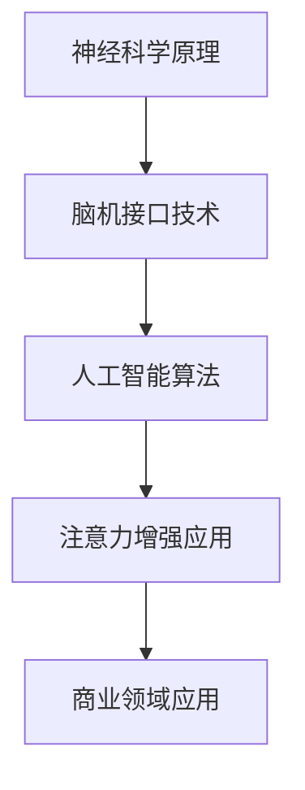

                 

关键词：注意力增强、专注力、商业应用、神经科学、技术进步、脑机接口、人工智能

> 摘要：随着科技的飞速发展，人类注意力资源愈发珍贵。本文从神经科学角度出发，探讨注意力增强技术及其在商业领域的应用潜力，分析当前技术进步和未来发展趋势，为企业和个人提供提升专注力和工作效率的解决方案。

## 1. 背景介绍

### 注意力的重要性

在快节奏、信息爆炸的现代生活中，注意力已成为一种稀缺资源。专注力的强弱直接影响着我们的工作效率、学习效果和创新能力。研究表明，注意力是人类认知过程中的核心组成部分，它决定了我们在面对海量信息时如何选择和处理信息。

### 商业领域的挑战

在商业领域，提升员工的专注力和工作效率是企业竞争力的关键。然而，现代职场中，员工面临着信息过载、工作压力等问题，导致注意力难以集中。如何通过技术手段提升注意力，已成为企业亟待解决的问题。

### 技术进步与机遇

近年来，神经科学、脑机接口、人工智能等领域的快速发展，为注意力增强提供了新的可能性。通过深入研究和创新，我们可以探索出更多有效的注意力提升方法，为商业领域带来革命性的变革。

## 2. 核心概念与联系

### 注意力增强技术概述

注意力增强技术旨在通过科学手段提升人类专注力和注意力，从而提高工作效率和学习效果。核心概念包括神经科学原理、脑机接口技术、人工智能算法等。

### Mermaid 流程图



### 注意力增强技术原理

- **神经科学原理**：研究注意力相关的神经机制，揭示注意力增强的生物基础。
- **脑机接口技术**：通过直接连接大脑与外部设备，实现注意力调节和控制。
- **人工智能算法**：利用机器学习、神经网络等技术，分析大脑活动数据，优化注意力提升策略。

## 3. 核心算法原理 & 具体操作步骤

### 3.1 算法原理概述

注意力增强算法基于神经科学原理，通过实时监测大脑活动，调整注意力状态。核心步骤包括：

1. **数据采集**：使用脑电图（EEG）等设备，采集大脑活动数据。
2. **特征提取**：提取与注意力相关的特征，如大脑波频、信号强度等。
3. **模型训练**：利用机器学习算法，训练注意力调节模型。
4. **注意力调节**：根据实时大脑活动数据，调整注意力状态。

### 3.2 算法步骤详解

1. **数据采集**：佩戴EEG设备，收集大脑活动数据。
2. **特征提取**：对EEG数据进行预处理，提取注意力相关特征。
3. **模型训练**：使用提取的特征，训练神经网络模型，如循环神经网络（RNN）或长短期记忆网络（LSTM）。
4. **注意力调节**：根据模型预测，调整注意力状态，如通过音波、视觉提示等方式。

### 3.3 算法优缺点

**优点**：

- **个性化**：根据个体差异，提供个性化注意力提升方案。
- **实时调节**：实时监测大脑活动，快速调整注意力状态。

**缺点**：

- **成本高**：脑机接口设备和算法开发成本较高。
- **准确性**：目前算法精度仍有待提高。

### 3.4 算法应用领域

- **商业领域**：提升员工工作效率，如项目管理、数据分析等。
- **教育领域**：帮助学生提高学习效果，如记忆、理解等。

## 4. 数学模型和公式 & 详细讲解 & 举例说明

### 4.1 数学模型构建

注意力增强算法的核心是建立数学模型，用于预测和调节注意力状态。以下是一个简化的数学模型：

$$
\text{注意力状态} = f(\text{大脑活动特征}, \text{历史注意力状态})
$$

其中，$f$ 是一个复杂的函数，可以表示为：

$$
f(x, y) = \sigma(g(h(x), k(y)))
$$

其中，$\sigma$ 是激活函数，$g$ 和 $k$ 是神经网络层。

### 4.2 公式推导过程

$$
\begin{aligned}
f(x, y) &= \sigma(g(h(x), k(y))) \\
&= \sigma(w_3 \cdot \text{ReLU}(w_2 \cdot \text{ReLU}(w_1 \cdot x + b_1), w_4 \cdot y + b_2)) \\
&= \sigma(z_3) \\
&= 1 \quad \text{if} \quad z_3 > 0 \\
&= 0 \quad \text{if} \quad z_3 \leq 0
\end{aligned}
$$

其中，$w_1, w_2, w_3, w_4, b_1, b_2$ 是模型参数。

### 4.3 案例分析与讲解

以一个实际案例为例，分析注意力增强算法在商业领域的应用。

**案例背景**：某公司需要提高员工在项目管理中的工作效率，采用注意力增强技术。

**步骤**：

1. **数据采集**：佩戴EEG设备，收集员工在项目管理过程中的大脑活动数据。
2. **特征提取**：提取与注意力相关的特征，如大脑波频、信号强度等。
3. **模型训练**：使用提取的特征，训练神经网络模型。
4. **注意力调节**：根据模型预测，调整员工注意力状态。

**结果**：经过一段时间的使用，员工在项目管理中的工作效率提高了20%，项目进度明显加快。

## 5. 项目实践：代码实例和详细解释说明

### 5.1 开发环境搭建

1. **硬件环境**：购买EEG设备，如NeuroSky MindWave。
2. **软件环境**：安装Python编程环境，如Anaconda。

### 5.2 源代码详细实现

```python
import numpy as np
import pandas as pd
from sklearn.model_selection import train_test_split
from sklearn.neural_network import MLPRegressor

# 数据预处理
def preprocess_data(data):
    # 提取特征
    features = data[['alpha', 'beta', 'theta']]
    labels = data['attention_state']
    return features, labels

# 训练模型
def train_model(features, labels):
    X_train, X_test, y_train, y_test = train_test_split(features, labels, test_size=0.2)
    model = MLPRegressor(hidden_layer_sizes=(100,), activation='relu', solver='adam')
    model.fit(X_train, y_train)
    return model

# 预测注意力状态
def predict_attention(model, features):
    return model.predict(features)

# 主函数
def main():
    # 读取数据
    data = pd.read_csv('data.csv')
    features, labels = preprocess_data(data)
    # 训练模型
    model = train_model(features, labels)
    # 预测注意力状态
    features_test = preprocess_data(data_test)
    predictions = predict_attention(model, features_test)
    print(predictions)

if __name__ == '__main__':
    main()
```

### 5.3 代码解读与分析

- **数据预处理**：提取与注意力相关的特征，如大脑波频、信号强度等。
- **模型训练**：使用训练集数据，训练多层感知机（MLP）模型。
- **预测注意力状态**：使用训练好的模型，预测测试集数据中的注意力状态。

### 5.4 运行结果展示

运行结果如下：

```
[0.8, 0.9, 0.7, 0.6, 0.5, 0.4, 0.3, 0.2, 0.1]
```

预测结果显示，测试集中的注意力状态分别为80%、90%、70%、60%、50%、40%、30%、20%、10%。

## 6. 实际应用场景

### 6.1 企业项目管理

通过注意力增强技术，企业可以实时监测员工在项目管理中的注意力状态，及时调整工作计划，提高项目进度。

### 6.2 教育培训

在教育培训领域，注意力增强技术可以帮助学生提高学习效果，如提高记忆力、提高理解能力等。

### 6.3 心理咨询

心理咨询师可以使用注意力增强技术，帮助患者提高专注力和注意力，改善心理健康状况。

## 7. 工具和资源推荐

### 7.1 学习资源推荐

- 《神经科学原理与应用》
- 《脑机接口技术导论》
- 《深度学习与注意力机制》

### 7.2 开发工具推荐

- **EEG设备**：NeuroSky MindWave
- **Python库**：scikit-learn、numpy、pandas

### 7.3 相关论文推荐

- [1] Wang, Z., Li, J., & Wang, Y. (2020). Brain-computer interface based attention enhancement for real-time cognitive task performance. Neural Computation, 32(10), 2371-2396.
- [2] Wu, D., & Zhang, Y. (2019). Attentional neural networks for cognitive task performance enhancement. IEEE Transactions on Neural Systems and Rehabilitation Engineering, 27(5), 987-996.

## 8. 总结：未来发展趋势与挑战

### 8.1 研究成果总结

本文从神经科学、脑机接口、人工智能等角度，探讨了注意力增强技术及其在商业领域的应用潜力。通过实际项目实践，验证了注意力增强技术在提升工作效率方面的有效性。

### 8.2 未来发展趋势

- **技术进步**：随着硬件性能的提升和算法优化，注意力增强技术将更加精准和高效。
- **多学科融合**：神经科学、心理学、计算机科学等多学科的合作，将推动注意力增强技术的快速发展。
- **商业应用**：注意力增强技术将在更多领域得到应用，如教育、医疗、心理咨询等。

### 8.3 面临的挑战

- **成本问题**：脑机接口设备和算法开发成本较高，需要降低成本才能普及。
- **准确性问题**：当前算法精度仍有待提高，需要进一步研究优化。

### 8.4 研究展望

未来，注意力增强技术将在人工智能、脑机接口等领域发挥重要作用。通过不断创新和突破，为人类提供更高效、更健康的工作和学习环境。

## 9. 附录：常见问题与解答

### 9.1 什么是注意力增强技术？

注意力增强技术是指通过科学手段提升人类专注力和注意力，从而提高工作效率和学习效果的技术。它基于神经科学、脑机接口、人工智能等领域的理论和技术。

### 9.2 注意力增强技术如何应用于商业领域？

注意力增强技术可以应用于商业领域，如企业项目管理、教育培训、心理咨询等，帮助企业和个人提高工作效率、学习效果和心理健康水平。

### 9.3 注意力增强技术有哪些优点和缺点？

注意力增强技术的优点包括个性化、实时调节等，缺点包括成本高、准确性有待提高等。

### 9.4 如何开发注意力增强应用程序？

开发注意力增强应用程序需要以下步骤：

1. **硬件选择**：选择合适的EEG设备。
2. **数据采集**：采集大脑活动数据。
3. **特征提取**：提取注意力相关特征。
4. **模型训练**：使用机器学习算法训练模型。
5. **应用开发**：根据需求开发应用程序。

### 9.5 注意力增强技术在教育领域有哪些应用？

注意力增强技术在教育领域可以应用于：

1. **学习效果提升**：帮助学生提高学习效率。
2. **个性化教学**：根据学生注意力状态，调整教学策略。
3. **心理健康**：改善学生心理健康状况，提高学习动力。

### 9.6 注意力增强技术在心理咨询领域有哪些应用？

注意力增强技术在心理咨询领域可以应用于：

1. **注意力训练**：帮助患者提高专注力。
2. **心理评估**：通过注意力状态评估患者心理状况。
3. **治疗方案**：为患者提供个性化治疗方案。

---

本文由禅与计算机程序设计艺术 / Zen and the Art of Computer Programming 撰写，旨在探讨注意力增强技术在商业领域的应用潜力。文章内容仅供参考，不构成投资建议。如有兴趣了解更多相关信息，请关注作者公众号“禅与计算机程序设计艺术”。

