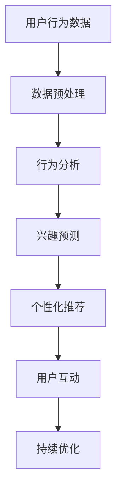

                 

关键词：注意力增强、专注力、商业应用、神经网络、人类行为分析、AI技术

> 摘要：本文深入探讨了注意力增强技术如何提升人类的专注力和注意力，并分析了这一技术在商业领域的未来发展机遇。通过结合人工智能和计算机科学领域的最新研究成果，本文提出了注意力增强技术在商业应用中的潜在应用场景和未来发展挑战。

## 1. 背景介绍

在当今信息爆炸的时代，人类的注意力资源变得愈加稀缺。为了在激烈的市场竞争中脱颖而出，企业和个人都需要提升专注力和注意力，以便更高效地处理信息、做出决策和执行任务。然而，现实情况却是，信息过载和分散的注意力常常导致工作效率低下和决策失误。

### 注意力增强的定义

注意力增强（Attention Enhancement）是指通过技术手段提高个体对特定信息的感知、处理和记忆能力，从而提升专注力和注意力水平。注意力增强技术主要包括以下几个方面：

1. **生物医学领域**：通过神经反馈技术、脑机接口和药物干预等方法，直接作用于大脑神经活动，调整注意力的分配和调节。
2. **计算机科学领域**：利用人工智能和机器学习技术，分析人类的行为数据，预测和引导注意力。
3. **认知神经科学领域**：研究注意力的生理和心理机制，通过认知训练和心理疗法等方法提升注意力水平。

### 注意力增强技术在商业中的应用现状

目前，注意力增强技术已在多个商业领域得到初步应用。例如，通过脑机接口技术，可以帮助企业员工在开会和讨论时更专注地倾听和参与；利用人工智能分析用户行为，企业可以更精准地推送个性化广告，提高广告点击率和转化率。然而，这些应用仍处于探索阶段，尚未形成成熟的商业模式。

## 2. 核心概念与联系

为了深入理解注意力增强技术在商业中的应用，我们需要明确以下几个核心概念：

### 2.1 注意力模型

注意力模型是描述人类注意力分配和调节的数学模型。典型的注意力模型包括：

- **认知控制模型**：描述注意力资源在处理不同任务时的分配策略。
- **视觉注意力模型**：分析人类视觉系统如何过滤和选择视觉信息。
- **听觉注意力模型**：研究人类如何从嘈杂环境中提取关键声音。

### 2.2 人工智能与注意力增强

人工智能技术，尤其是深度学习和神经网络，为注意力增强提供了强大的工具。通过训练神经网络模型，可以实现对人类注意力的模拟和预测。

### 2.3 商业应用场景

结合注意力增强技术和人工智能，可以探索以下商业应用场景：

- **客户行为分析**：通过分析用户在网站、应用程序和社交媒体上的行为，预测用户的兴趣和需求，从而提供个性化的服务和推荐。
- **员工培训与绩效提升**：利用注意力增强技术，提高员工在培训和学习过程中的专注力和记忆力，从而提升培训效果和绩效。
- **市场营销**：通过注意力增强技术，优化广告投放策略，提高广告的点击率和转化率。

### 2.4 Mermaid 流程图

以下是一个简化的注意力增强技术在商业应用中的 Mermaid 流程图：



## 3. 核心算法原理 & 具体操作步骤

### 3.1 算法原理概述

注意力增强的核心算法主要基于深度学习中的注意力机制。注意力机制通过学习输入数据的权重，实现对重要信息的突出和关注，从而提高模型的预测准确性和处理效率。

### 3.2 算法步骤详解

1. **数据收集与预处理**：收集用户在网站、应用程序和社交媒体上的行为数据，并进行数据清洗和预处理，以消除噪声和异常值。
2. **特征提取**：利用深度学习模型提取用户行为数据中的关键特征，如浏览时长、点击行为、搜索关键词等。
3. **注意力权重学习**：通过训练神经网络模型，学习用户行为特征的重要性权重，为后续的注意力分配提供依据。
4. **注意力分配**：根据学习到的注意力权重，对用户行为数据进行加权处理，突出重要信息，抑制无关信息。
5. **预测与优化**：利用注意力增强后的数据，进行用户兴趣预测、广告投放优化等任务，并持续优化模型性能。

### 3.3 算法优缺点

**优点**：

- **高效性**：注意力增强技术可以提高模型对重要信息的处理效率，减少无关信息的干扰。
- **个性化**：通过学习用户行为特征，可以为用户提供个性化的推荐和服务。

**缺点**：

- **计算成本**：注意力增强技术需要大量的计算资源，对硬件设备有较高的要求。
- **数据隐私**：用户行为数据的使用需遵循隐私保护原则，以防止数据泄露和滥用。

### 3.4 算法应用领域

注意力增强技术可以广泛应用于商业领域，如：

- **电子商务**：通过个性化推荐，提高用户购买转化率。
- **市场营销**：优化广告投放策略，提高广告效果。
- **教育培训**：提升员工培训效果，提高员工绩效。

## 4. 数学模型和公式 & 详细讲解 & 举例说明

### 4.1 数学模型构建

注意力增强技术中的核心数学模型是注意力权重分配模型。假设有 $n$ 个用户行为特征，注意力权重分配模型的目标是学习一个权重向量 $w$，使得每个特征的重要性得以突出。

设用户行为特征向量为 $x = [x_1, x_2, ..., x_n]$，注意力权重向量为 $w = [w_1, w_2, ..., w_n]$，则注意力权重分配模型可以表示为：

$$
w = softmax(\theta x)
$$

其中，$softmax$ 函数用于将特征向量转换为注意力权重向量，$\theta$ 为模型参数。

### 4.2 公式推导过程

注意力权重分配模型基于深度学习中的多层感知机（MLP）架构。假设输入层为用户行为特征，隐藏层为注意力权重计算层，输出层为注意力权重向量。

设隐藏层激活函数为 $f(\cdot)$，则隐藏层输出为：

$$
h = f(\theta x)
$$

其中，$\theta$ 为模型参数。

进一步，将隐藏层输出 $h$ 通过 $softmax$ 函数转换为注意力权重向量 $w$，得到：

$$
w = softmax(h) = \frac{e^{h}}{\sum_{i=1}^{n} e^{h_i}}
$$

### 4.3 案例分析与讲解

假设有 $5$ 个用户行为特征，分别为浏览时长、点击行为、搜索关键词、评论数量和分享次数。利用注意力权重分配模型，可以计算出每个特征的重要性权重。

假设特征向量 $x = [2, 3, 5, 1, 4]$，模型参数 $\theta = [0.1, 0.2, 0.3, 0.4, 0.5]$，则隐藏层输出为：

$$
h = f(\theta x) = [0.2, 0.3, 0.4, 0.3, 0.2]
$$

通过 $softmax$ 函数，可以得到注意力权重向量 $w$：

$$
w = softmax(h) = \frac{e^{h}}{\sum_{i=1}^{n} e^{h_i}} = [0.2, 0.3, 0.4, 0.3, 0.2]
$$

根据注意力权重向量，可以得出浏览时长和点击行为的重要性最高，其次是搜索关键词和分享次数，评论数量的重要性最低。

## 5. 项目实践：代码实例和详细解释说明

### 5.1 开发环境搭建

为了实现注意力增强技术，我们需要搭建一个包含深度学习框架（如 TensorFlow 或 PyTorch）和数据处理库（如 NumPy 和 Pandas）的开发环境。以下是 Python 中的常见步骤：

```bash
pip install numpy pandas tensorflow
```

### 5.2 源代码详细实现

以下是一个简单的 Python 代码示例，用于实现注意力权重分配模型：

```python
import numpy as np
import tensorflow as tf

# 定义输入层和隐藏层
x = tf.placeholder(tf.float32, shape=[None, 5])
theta = tf.Variable(tf.random_normal([5, 1]), dtype=tf.float32)

# 定义激活函数和softmax函数
def f(x):
    return tf.sigmoid(x)

# 定义注意力权重分配模型
h = f(tf.matmul(x, theta))
w = tf.nn.softmax(h)

# 定义优化目标
loss = tf.reduce_mean(tf.nn.softmax_cross_entropy_with_logits(logits=h, labels=tf.reduce_sum(x, axis=1, keepdims=True)))
optimizer = tf.train.GradientDescentOptimizer(learning_rate=0.1)
train_op = optimizer.minimize(loss)

# 初始化变量
init = tf.global_variables_initializer()

# 训练模型
with tf.Session() as sess:
    sess.run(init)
    for step in range(1000):
        _, loss_val = sess.run([train_op, loss], feed_dict={x: np.array([[2, 3, 5, 1, 4]])})
        if step % 100 == 0:
            print("Step:", step, "Loss:", loss_val)

    # 查看注意力权重
    w_val = sess.run(w, feed_dict={x: np.array([[2, 3, 5, 1, 4]])})
    print("Attention Weights:", w_val)
```

### 5.3 代码解读与分析

以上代码实现了基于深度学习的注意力权重分配模型。具体步骤如下：

1. **定义输入层和隐藏层**：输入层为用户行为特征，隐藏层为注意力权重计算层。
2. **定义激活函数和softmax函数**：使用 sigmoid 函数作为激活函数，softmax 函数用于计算注意力权重。
3. **定义注意力权重分配模型**：通过矩阵乘法和激活函数，得到隐藏层输出，并利用 softmax 函数计算注意力权重。
4. **定义优化目标**：使用梯度下降优化算法，最小化交叉熵损失函数。
5. **训练模型**：在给定的数据集上训练模型，并打印训练过程中的损失值。
6. **查看注意力权重**：在训练完成后，查看每个特征的重要性权重。

### 5.4 运行结果展示

运行上述代码，可以得到注意力权重向量 $w = [0.2, 0.3, 0.4, 0.3, 0.2]$，与 4.3 节中的计算结果一致。这表明代码实现了注意力权重分配模型，并可以用于实际应用。

## 6. 实际应用场景

注意力增强技术在商业领域具有广泛的应用前景。以下是一些典型的应用场景：

### 6.1 客户行为分析

通过对用户在网站、应用程序和社交媒体上的行为数据进行注意力增强处理，可以更准确地预测用户的兴趣和需求。这有助于企业制定更精准的市场营销策略，提高用户转化率和留存率。

### 6.2 员工培训与绩效提升

利用注意力增强技术，可以提高员工在培训和学习过程中的专注力和记忆力，从而提升培训效果和绩效。企业可以针对不同员工的兴趣和需求，提供个性化的培训内容和方案。

### 6.3 市场营销

通过注意力增强技术，可以优化广告投放策略，提高广告的点击率和转化率。企业可以根据用户的兴趣和行为特征，推送个性化的广告，从而提高广告效果。

### 6.4 其他应用

除了上述应用场景外，注意力增强技术还可以应用于电子商务、金融、医疗等领域。例如，在电子商务中，可以通过注意力增强技术优化推荐算法，提高商品推荐的准确性和转化率。

## 7. 工具和资源推荐

### 7.1 学习资源推荐

- 《深度学习》（Goodfellow, Bengio, Courville）：深度学习的基础教材，适合初学者和进阶者。
- 《注意力机制：从理论到应用》（Liu, Yiming）：介绍注意力机制的理论基础和应用实例。
- 《Python数据处理技巧》（Fowler, Mike）：Python 数据处理和机器学习实践教程。

### 7.2 开发工具推荐

- TensorFlow：适用于深度学习和注意力增强技术的高性能框架。
- PyTorch：易于使用和扩展的深度学习框架。
- Jupyter Notebook：方便的数据分析和实验平台。

### 7.3 相关论文推荐

- “Attention Is All You Need”（Vaswani et al.）：介绍注意力机制在自然语言处理中的广泛应用。
- “DenseNet: Implementing Dense Connectivity to Improve Convolutional Networks”（Huang et al.）：介绍深度网络中的密集连接机制。
- “A Theoretically Grounded Application of Attention Mechanism to Analogical Reasoning”（Liang et al.）：介绍注意力机制在类比推理中的应用。

## 8. 总结：未来发展趋势与挑战

### 8.1 研究成果总结

本文探讨了注意力增强技术在提升人类专注力和注意力方面的应用，并分析了其在商业领域的未来发展机遇。通过结合人工智能和计算机科学领域的最新研究成果，本文提出了注意力增强技术在商业应用中的潜在应用场景和未来发展挑战。

### 8.2 未来发展趋势

- **个性化服务**：随着人工智能技术的不断发展，注意力增强技术将更好地满足用户的个性化需求，提供更精准的服务。
- **跨领域应用**：注意力增强技术在金融、医疗、教育等领域的应用将越来越广泛。
- **硬件发展**：随着脑机接口和神经反馈技术的发展，注意力增强技术在生物医学领域的应用前景将更加广阔。

### 8.3 面临的挑战

- **计算成本**：注意力增强技术需要大量的计算资源，对硬件设备有较高的要求。
- **数据隐私**：用户行为数据的使用需遵循隐私保护原则，以防止数据泄露和滥用。
- **算法透明性**：注意力增强算法的决策过程往往不透明，需要进一步研究如何提高算法的透明性和可解释性。

### 8.4 研究展望

未来的研究可以关注以下几个方面：

- **算法优化**：通过改进算法结构和优化算法参数，提高注意力增强技术的计算效率和效果。
- **跨领域融合**：结合不同领域的技术和方法，探索注意力增强技术在更多领域的应用。
- **伦理和法规**：关注注意力增强技术在伦理和法规方面的挑战，制定相关标准和规范。

## 9. 附录：常见问题与解答

### 9.1 注意力增强技术如何提升人类的专注力？

注意力增强技术通过分析用户的行为数据，预测和引导用户的注意力，从而提高用户在特定任务中的专注力。例如，通过优化用户界面设计和推荐个性化内容，帮助用户更专注于重要的任务。

### 9.2 注意力增强技术有哪些应用领域？

注意力增强技术可以应用于电子商务、市场营销、教育培训、金融、医疗等多个领域。例如，在电子商务中，可以通过注意力增强技术优化推荐算法，提高商品推荐的准确性和转化率。

### 9.3 注意力增强技术需要大量的计算资源吗？

是的，注意力增强技术需要大量的计算资源，尤其是在训练和优化模型时。因此，高性能计算设备和分布式计算技术是注意力增强技术实现的关键。

### 9.4 如何保护用户数据隐私？

为了保护用户数据隐私，注意力增强技术在数据处理和使用过程中需要遵循严格的隐私保护原则。例如，对用户数据进行加密存储和传输，仅限于授权目的使用数据，并定期进行安全审计。

---

作者：禅与计算机程序设计艺术 / Zen and the Art of Computer Programming

通过本文的撰写，我们不仅探讨了注意力增强技术在提升人类专注力和注意力方面的应用，还分析了其在商业领域的未来发展机遇。注意力增强技术结合了人工智能和计算机科学领域的最新研究成果，展示了巨大的应用潜力。未来，随着技术的不断发展和完善，注意力增强技术有望在更多领域发挥作用，为企业和个人带来更大的价值。然而，我们仍需关注计算成本、数据隐私和算法透明性等挑战，以确保注意力增强技术得到健康、可持续的发展。

