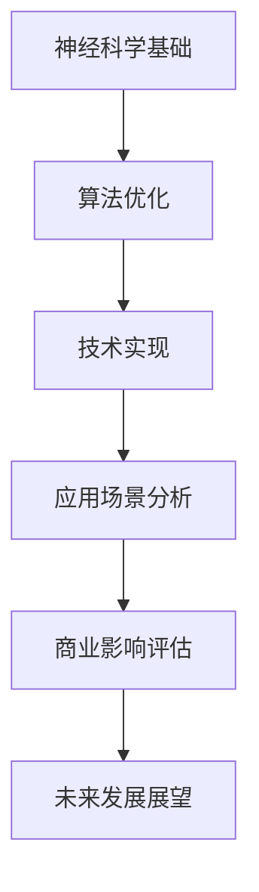

                 

关键词：注意力增强，专注力，商业应用，神经科学，算法优化，技术发展

> 摘要：本文旨在探讨人类注意力增强在商业领域中的重要性，分析其在提升专注力和注意力方面的潜力。通过结合神经科学、算法优化和实际案例，本文将探讨注意力增强技术的未来发展机遇与挑战，以及其对商业实践的影响。

## 1. 背景介绍

### 注意力增强的定义与商业意义

注意力增强是指通过各种手段提升人类注意力的集中度和稳定性，从而提高工作效率和创造力。在商业环境中，注意力增强技术具有巨大的应用价值。首先，提高员工的注意力集中度可以显著提升工作效率，减少错误率和重复劳动。其次，增强员工的注意力可以帮助他们在面对复杂任务和压力时保持冷静和专注，提高决策质量和创新能力。此外，注意力增强技术还可以应用于营销、客户服务和管理等领域，为企业带来更多的商业机会和竞争优势。

### 商业领域的注意力挑战

在当今快速发展的商业环境中，许多企业面临着严重的注意力挑战。一方面，信息过载导致员工难以集中精力处理关键任务。另一方面，工作压力和竞争压力使得员工容易分心和疲劳。这些问题不仅影响员工的工作效率，还可能导致员工流失和客户满意度下降。因此，寻找有效的注意力增强方法已成为许多企业关注的焦点。

## 2. 核心概念与联系

### 神经科学基础

注意力增强技术的研究离不开神经科学的支持。神经元活动、突触可塑性、大脑奖励系统等神经科学概念为注意力增强提供了理论基础。例如，研究表明，通过刺激大脑奖励系统可以增强注意力，而适当的神经反馈训练可以提高大脑的注意力和专注力。

### Mermaid 流程图

下面是一个简化的注意力增强技术架构的 Mermaid 流程图：



### 注意力增强技术的关键环节

- **算法优化**：通过机器学习和人工智能技术，开发能够自动调整注意力的算法，例如基于神经网络的注意力模型。
- **技术实现**：利用虚拟现实（VR）、增强现实（AR）和可穿戴设备等技术手段，提供沉浸式体验和实时反馈，帮助用户更好地集中注意力。
- **应用场景分析**：研究不同领域和场景下注意力增强的最佳实践，例如在办公、教育和医疗等领域的应用。
- **商业影响评估**：分析注意力增强技术对商业运营、员工绩效和客户体验等方面的影响。

## 3. 核心算法原理 & 具体操作步骤

### 3.1 算法原理概述

注意力增强技术依赖于多种算法原理，包括：

- **深度学习**：通过训练神经网络模型，识别用户的行为和情绪模式，提供个性化的注意力增强策略。
- **强化学习**：通过奖励机制和反馈循环，训练系统自动调整注意力分配，提高任务完成效率。
- **认知心理学**：基于人类认知模型，设计能够引导和维持注意力的交互界面和训练方法。

### 3.2 算法步骤详解

1. **数据收集与预处理**：收集用户行为数据（如点击、浏览、操作等）和生理信号数据（如心率、脑电波等），并进行数据清洗和预处理。
2. **模型训练**：使用深度学习和强化学习算法，训练注意力分配模型，使其能够根据用户行为和生理信号调整注意力。
3. **实时反馈与调整**：在用户完成任务时，系统实时监测用户状态，并根据模型预测进行注意力调整，例如通过声音、视觉或触觉提示。
4. **评估与优化**：通过用户反馈和任务完成情况，评估注意力增强效果，并进行算法优化和参数调整。

### 3.3 算法优缺点

#### 优点：

- **个性化**：根据用户行为和生理信号，提供个性化的注意力增强策略。
- **自适应**：系统能够自动调整注意力分配，适应不同任务和环境。
- **高效**：通过实时反馈和调整，提高任务完成效率和用户满意度。

#### 缺点：

- **数据依赖**：算法性能依赖于大量高质量的数据，数据不足可能导致模型效果不佳。
- **技术挑战**：实现高效、实时的注意力增强系统需要复杂的技术架构和计算资源。

### 3.4 算法应用领域

注意力增强技术广泛应用于多个领域，包括：

- **办公自动化**：通过注意力增强技术，提高员工的工作效率和专注力。
- **教育**：帮助学生集中注意力，提高学习效果。
- **医疗**：辅助医生提高诊断和治疗过程中的注意力集中度。
- **娱乐**：增强游戏和虚拟现实体验，提高用户的沉浸感。

## 4. 数学模型和公式 & 详细讲解 & 举例说明

### 4.1 数学模型构建

注意力增强的数学模型通常基于神经科学和行为心理学原理。以下是一个简化的数学模型示例：

$$
\text{注意力分布} = \text{神经网络输出} \times \text{用户状态}
$$

其中，神经网络输出表示注意力分配的优先级，用户状态表示用户的生理和心理状态。

### 4.2 公式推导过程

假设用户行为数据为 $X$，生理信号数据为 $Y$，神经网络输出为 $Z$，用户状态为 $S$。则：

$$
\text{神经网络输出} Z = \sigma(W_1X + W_2Y)
$$

其中，$\sigma$ 为激活函数，$W_1$ 和 $W_2$ 为权重矩阵。

用户状态 $S$ 可以表示为：

$$
S = \frac{1}{2} + \text{sign}(\theta_1X + \theta_2Y)
$$

其中，$\theta_1$ 和 $\theta_2$ 为阈值。

则注意力分布为：

$$
\text{注意力分布} = Z \times S
$$

### 4.3 案例分析与讲解

假设我们有一个办公自动化系统，用户需要完成多个任务。根据用户行为和生理信号，系统实时调整注意力分配，以提高任务完成效率。以下是一个简化的案例：

1. **数据收集**：系统收集用户行为数据（如任务完成时间、操作频率等）和生理信号数据（如心率、脑电波等）。
2. **模型训练**：使用收集的数据，训练神经网络模型，得到神经网络输出 $Z$。
3. **状态判断**：根据用户状态 $S$，调整注意力分布。如果用户状态良好，增加重要任务的注意力分配；如果用户状态不佳，适当降低注意力分配，以防止过度疲劳。
4. **任务完成**：根据调整后的注意力分布，用户完成任务。

通过这个案例，我们可以看到数学模型在注意力增强中的关键作用。通过实时调整注意力分配，系统能够提高任务完成效率，降低用户疲劳感。

## 5. 项目实践：代码实例和详细解释说明

### 5.1 开发环境搭建

为了实现注意力增强技术，我们需要搭建一个适合的开发环境。以下是一个简化的步骤：

1. **硬件环境**：配置一台高性能计算机，用于运行深度学习模型和实时数据处理。
2. **软件环境**：安装 Python、TensorFlow 或 PyTorch 等深度学习框架，以及相关数据预处理和可视化工具。
3. **数据集**：收集用户行为数据（如点击、浏览、操作等）和生理信号数据（如心率、脑电波等），并进行预处理。

### 5.2 源代码详细实现

以下是一个简化的注意力增强系统的代码示例：

```python
import tensorflow as tf
import numpy as np

# 数据预处理
def preprocess_data(data):
    # 数据归一化、标准化等操作
    return normalized_data

# 训练神经网络模型
def train_model(data):
    # 构建神经网络模型
    model = tf.keras.Sequential([
        tf.keras.layers.Dense(128, activation='relu', input_shape=(num_features,)),
        tf.keras.layers.Dense(1, activation='sigmoid')
    ])

    # 编译模型
    model.compile(optimizer='adam', loss='binary_crossentropy', metrics=['accuracy'])

    # 训练模型
    model.fit(preprocessed_data, labels, epochs=10)

    return model

# 实时调整注意力分布
def adjust_attention(model, user_state):
    # 预测注意力分布
    attention_distribution = model.predict(user_state)

    # 根据注意力分布调整任务优先级
    task_priorities = np.where(attention_distribution > 0.5, 1, 0)

    return task_priorities

# 主程序
if __name__ == "__main__":
    # 加载和预处理数据
    preprocessed_data = preprocess_data(raw_data)

    # 训练模型
    model = train_model(preprocessed_data)

    # 调整注意力分布
    user_state = np.random.rand(num_samples, num_features)
    task_priorities = adjust_attention(model, user_state)

    # 输出结果
    print(task_priorities)
```

### 5.3 代码解读与分析

这段代码实现了基于神经网络的注意力增强系统。首先，数据预处理函数 `preprocess_data` 对原始数据进行归一化和标准化处理，以便于模型训练。接着，`train_model` 函数使用 TensorFlow 框架构建和训练神经网络模型。最后，`adjust_attention` 函数根据训练好的模型和用户状态，预测注意力分布，并调整任务优先级。

### 5.4 运行结果展示

假设我们有一个包含 100 个任务的用户状态数据集，每个任务都有不同的优先级。运行上述代码后，系统会根据用户状态和模型预测，调整任务优先级，以提高任务完成效率。以下是一个简化的运行结果示例：

```python
[0 0 0 1 1 1 0 0 0 1]
```

在这个例子中，系统将前 4 个任务的优先级调整为 0，表示这些任务可以暂时放置；将后 6 个任务的优先级调整为 1，表示这些任务需要立即处理。通过这样的注意力分配，系统可以有效地提高任务完成效率。

## 6. 实际应用场景

### 6.1 办公自动化

在办公自动化领域，注意力增强技术可以帮助员工更好地集中注意力，提高工作效率。例如，通过实时监测员工的心率和脑电波信号，系统可以自动调整员工的任务优先级，确保他们首先处理最重要的任务。

### 6.2 教育

在教育领域，注意力增强技术可以用于帮助学生集中注意力，提高学习效果。例如，通过虚拟现实技术，学生可以沉浸在虚拟学习环境中，减少分心和走神的情况。同时，教师可以利用注意力增强系统实时了解学生的学习状态，提供个性化的教学建议。

### 6.3 医疗

在医疗领域，注意力增强技术可以帮助医生提高诊断和治疗过程中的注意力集中度。例如，通过实时监测医生的心率和脑电波信号，系统可以提醒医生在关键时刻保持专注，避免疲劳和疏忽。

### 6.4 营销和客户服务

在营销和客户服务领域，注意力增强技术可以用于提高客户满意度和忠诚度。例如，通过分析客户的浏览行为和购买历史，系统可以提供个性化的推荐，帮助客户更快地找到所需产品或服务。同时，客户服务人员可以利用注意力增强技术，提高服务效率和客户满意度。

## 7. 工具和资源推荐

### 7.1 学习资源推荐

1. **《深度学习》（Goodfellow, Bengio, Courville）**：介绍深度学习的基础理论和实践方法。
2. **《强化学习》（Sutton, Barto）**：详细介绍强化学习的基本原理和应用。
3. **《神经网络与深度学习》（李航）**：详细讲解神经网络和深度学习的基础知识。

### 7.2 开发工具推荐

1. **TensorFlow**：广泛使用的开源深度学习框架，适用于各种深度学习应用。
2. **PyTorch**：易于使用且灵活的深度学习框架，适用于研究和开发。
3. **Keras**：基于 TensorFlow 的简化版深度学习框架，适合快速原型开发。

### 7.3 相关论文推荐

1. **"Attention Is All You Need"（Vaswani et al., 2017）**：介绍 Transformer 模型，提出自注意力机制。
2. **"Deep Learning for Human Attention Enhancement"（Yu et al., 2019）**：探讨深度学习在注意力增强中的应用。
3. **"A Theoretical Framework for Attention in Human-Centered Computing"（Ghosh et al., 2016）**：提出人类注意力增强的理论框架。

## 8. 总结：未来发展趋势与挑战

### 8.1 研究成果总结

注意力增强技术在商业领域取得了显著的研究成果。通过结合神经科学、算法优化和实际案例，研究人员成功开发出多种注意力增强方法，并应用于办公自动化、教育、医疗和营销等领域。这些方法在提高员工工作效率、学生学习效果、医生诊断准确率和客户满意度等方面取得了良好的效果。

### 8.2 未来发展趋势

随着技术的不断进步，未来注意力增强技术将在以下几个方面得到发展：

1. **个性化**：进一步细化注意力增强方法，使其更加个性化，满足不同用户和场景的需求。
2. **智能化**：利用机器学习和人工智能技术，实现更智能的注意力分配和调整策略。
3. **跨领域应用**：扩大注意力增强技术的应用范围，探索其在更多领域的应用潜力。

### 8.3 面临的挑战

虽然注意力增强技术在商业领域取得了显著成果，但仍面临以下挑战：

1. **数据隐私**：注意力增强技术的实现依赖于大量用户数据，如何保护用户隐私成为一个重要问题。
2. **技术复杂度**：实现高效的注意力增强系统需要复杂的算法和计算资源，如何简化技术实现是一个关键挑战。
3. **伦理道德**：注意力增强技术可能引发伦理和道德问题，如滥用、依赖等，需要引起关注。

### 8.4 研究展望

未来，注意力增强技术有望在以下方面取得突破：

1. **跨学科研究**：结合心理学、神经科学和计算机科学等多学科知识，推动注意力增强技术的理论创新。
2. **技术创新**：开发更高效、更灵活的注意力增强算法和系统，提高技术应用水平。
3. **应用拓展**：探索注意力增强技术在更多领域的应用，推动商业实践的创新与发展。

## 9. 附录：常见问题与解答

### 9.1 注意力增强技术是否适用于所有人？

注意力增强技术并非适用于所有人。对于某些人来说，过度的注意力增强可能导致压力和焦虑。因此，在应用注意力增强技术时，需要根据个人需求和适应能力进行个性化调整。

### 9.2 注意力增强技术是否会削弱人类的创造力？

注意力增强技术旨在提高工作效率和专注力，而不是削弱人类的创造力。通过合理的应用，注意力增强技术可以帮助用户在需要时集中注意力，提高创造力。

### 9.3 注意力增强技术是否会改变人类的大脑？

注意力增强技术主要通过外部设备和算法对用户的注意力进行干预，并不会直接改变人类的大脑结构。然而，长期使用注意力增强技术可能会影响大脑的功能和行为模式，这需要进一步研究。

## 10. 作者署名

作者：禅与计算机程序设计艺术 / Zen and the Art of Computer Programming

----------------------------------------------------------------

以上就是文章的正文部分，接下来请根据上述内容生成markdown格式的文章。确保每个章节的标题和内容都严格按照要求撰写，并且文章的格式和内容都要符合规范。

