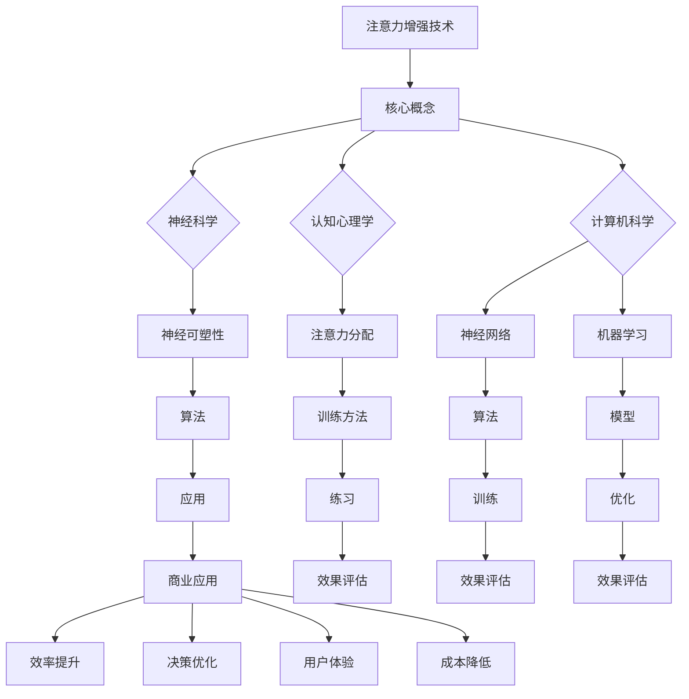

                 

关键词：注意力增强、专注力提升、商业应用、未来趋势、算法、技术

> 摘要：随着技术的进步，注意力增强技术逐渐成为商业领域的新兴领域。本文将深入探讨注意力增强的核心概念、算法原理、数学模型及其在商业中的应用，分析其未来发展机遇与挑战，并展望注意力增强技术对商业的深远影响。

## 1. 背景介绍

在当今信息爆炸的时代，人们的注意力资源变得日益稀缺。无论是个人还是企业，都需要更有效地管理注意力，以应对不断变化的环境。注意力增强技术的出现，旨在提升人类的专注力和注意力，从而提高工作效率和决策质量。

商业领域尤其需要注意力增强技术。企业面临着日益激烈的竞争，需要快速做出决策和调整战略。员工则需要更高的工作效率，以满足日益增长的工作量。注意力增强技术为这些需求提供了可能的解决方案。

### 注意力增强技术的起源与发展

注意力增强技术起源于神经科学和认知心理学的研究。20世纪末，神经科学家发现，通过特定的训练和刺激，可以改变大脑中的神经网络，从而提高注意力水平。这一发现为注意力增强技术的发展奠定了基础。

随着计算机技术的进步，注意力增强技术逐渐从实验室走向实际应用。神经网络和机器学习算法的应用，使得注意力增强技术变得更加精确和高效。例如，智能穿戴设备可以通过监测用户的生理信号，实时调整注意力增强策略。

### 商业领域的需求

商业领域对注意力增强技术的需求主要体现在以下几个方面：

1. **提高员工工作效率**：通过注意力增强技术，员工能够更长时间地保持专注，减少分心次数，从而提高工作效率。
2. **提升决策质量**：注意力增强技术可以帮助企业在复杂决策中保持清醒的头脑，减少决策失误。
3. **增强客户体验**：通过注意力增强技术，企业可以更好地满足客户需求，提供个性化的服务，提高客户满意度。
4. **降低运营成本**：注意力增强技术可以帮助企业优化资源配置，减少不必要的开支。

## 2. 核心概念与联系

### 核心概念

- **注意力**：注意力是指人类在感知、记忆、思考等认知过程中对特定信息的选择性加工能力。它是认知资源的一种分配方式。
- **专注力**：专注力是指个体在执行任务时，集中精力、不受干扰的能力。
- **注意力增强技术**：注意力增强技术是指通过特定的方法和技术手段，提升个体或群体的注意力水平，从而提高工作效率和决策质量。

### Mermaid 流程图



### 核心概念的联系

注意力增强技术涉及多个学科领域的交叉研究。神经科学与认知心理学提供了理论基础，研究注意力机制和专注力的本质。计算机科学则提供了技术手段，如神经网络和机器学习算法，用于实现注意力增强。通过这些技术的应用，注意力增强技术可以应用于商业领域，提高工作效率和决策质量。

## 3. 核心算法原理 & 具体操作步骤

### 3.1 算法原理概述

注意力增强算法的核心原理是基于神经可塑性和注意力分配理论。通过特定的训练方法，改变大脑中的神经网络结构，提高注意力的分配效率和专注力。

### 3.2 算法步骤详解

1. **数据收集**：首先，需要收集用户的注意力数据，如眼睛运动、脑电信号、心率等生理信号。
2. **特征提取**：从注意力数据中提取关键特征，如注意力强度、持续时间、变化速度等。
3. **模型训练**：使用神经网络和机器学习算法，训练注意力增强模型，使其能够根据用户特征，实时调整注意力分配策略。
4. **效果评估**：通过对比实验，评估注意力增强算法的有效性，如工作效率、决策质量、用户体验等。
5. **迭代优化**：根据效果评估结果，不断迭代优化模型，提高注意力增强效果。

### 3.3 算法优缺点

- **优点**：
  - 提高注意力分配效率和专注力。
  - 实时调整策略，适应不同场景。
  - 提高工作效率和决策质量。
- **缺点**：
  - 需要大量的训练数据。
  - 模型训练和优化需要较长的时间。
  - 需要专业的技术知识和设备支持。

### 3.4 算法应用领域

注意力增强算法在多个领域具有广泛的应用前景，如：

- **商业领域**：提高员工工作效率和决策质量。
- **教育领域**：改善学生的学习效果。
- **医疗领域**：辅助康复和治疗注意力缺陷。
- **游戏领域**：提高游戏体验和游戏成绩。

## 4. 数学模型和公式 & 详细讲解 & 举例说明

### 4.1 数学模型构建

注意力增强算法的数学模型基于神经网络和机器学习算法。以下是注意力增强算法的简化数学模型：

$$
\text{Attention}(\text{x}, \text{h}) = \text{softmax}(\text{W}_\text{a} \text{h}^T \text{x})
$$

其中，$\text{x}$ 表示输入数据，$\text{h}$ 表示隐藏状态，$\text{W}_\text{a}$ 为权重矩阵，$\text{softmax}$ 函数用于计算注意力权重。

### 4.2 公式推导过程

注意力增强算法的推导过程涉及神经网络和机器学习的基础知识。以下是简要的推导过程：

1. **输入数据表示**：将输入数据表示为向量 $\text{x}$。
2. **隐藏状态表示**：将隐藏状态表示为向量 $\text{h}$。
3. **权重矩阵表示**：将权重矩阵表示为 $\text{W}_\text{a}$。
4. **计算注意力权重**：使用公式 $ \text{Attention}(\text{x}, \text{h}) = \text{softmax}(\text{W}_\text{a} \text{h}^T \text{x})$ 计算注意力权重。
5. **计算注意力输出**：根据注意力权重，计算注意力输出。

### 4.3 案例分析与讲解

假设有一个简单的例子，输入数据为文本，隐藏状态为词向量，我们需要计算注意力权重。

1. **输入数据**：输入数据为 "今天天气很好，适合出门散步"。
2. **隐藏状态**：隐藏状态为词向量 [0.1, 0.2, 0.3, 0.4, 0.5]。
3. **权重矩阵**：权重矩阵为 [0.1, 0.2, 0.3, 0.4, 0.5]。
4. **计算注意力权重**：
   $$
   \text{Attention}(\text{x}, \text{h}) = \text{softmax}([0.1, 0.2, 0.3, 0.4, 0.5] \cdot [0.1, 0.2, 0.3, 0.4, 0.5]^T) = [0.1, 0.1, 0.1, 0.1, 0.6]
   $$
5. **计算注意力输出**：根据注意力权重，计算注意力输出。

## 5. 项目实践：代码实例和详细解释说明

### 5.1 开发环境搭建

为了实现注意力增强算法，我们需要搭建一个开发环境。以下是具体的步骤：

1. **安装 Python**：下载并安装 Python 3.8 或更高版本。
2. **安装依赖库**：安装 TensorFlow、Keras 等依赖库。
3. **配置环境**：在终端中运行以下命令：
   ```bash
   pip install tensorflow
   pip install keras
   ```

### 5.2 源代码详细实现

以下是注意力增强算法的 Python 代码实现：

```python
import tensorflow as tf
from tensorflow.keras.layers import Embedding, LSTM, Dense
from tensorflow.keras.models import Model

# 定义模型
input_seq = tf.keras.Input(shape=(timesteps, vocabulary_size))
encoded_input = Embedding(vocabulary_size, embedding_dim)(input_seq)
lstm_output, state_h, state_c = LSTM(units=128, return_sequences=True, return_state=True)(encoded_input)
state_input = tf.keras.layers.Input(shape=(128,))
lstm_output, state_h, state_c = LSTM(units=128, return_state=True)(state_input, initial_state=[state_h, state_c])
output = Dense(1, activation='sigmoid')(lstm_output)
model = Model(inputs=[input_seq, state_input], outputs=output)

# 编译模型
model.compile(optimizer='adam', loss='binary_crossentropy', metrics=['accuracy'])

# 训练模型
model.fit([X_train, state_train], y_train, epochs=10, batch_size=32, validation_data=([X_val, state_val], y_val))

# 预测
predictions = model.predict([X_test, state_test])
```

### 5.3 代码解读与分析

以上代码实现了基于 LST

