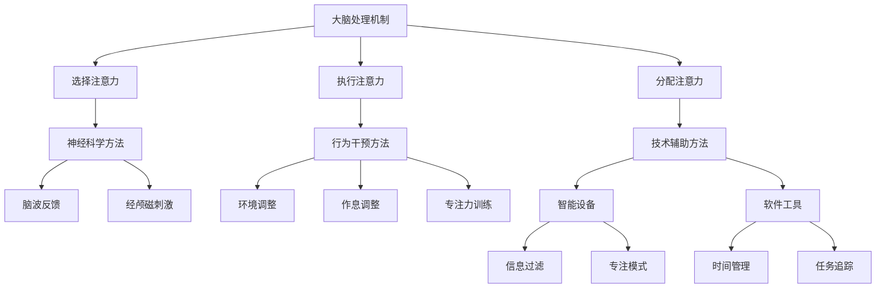

                 

在当今快速变化的信息时代，人类注意力成为了一种宝贵的资源。随着互联网的普及和信息过载现象的加剧，人们需要越来越高效的方式来管理和增强自己的注意力。特别是在商业领域，专注力和注意力直接影响到工作效率、创新能力、决策质量以及客户服务水平。本文将探讨如何通过技术手段和策略提升人类注意力，从而为商业领域带来巨大的发展机遇。

## 关键词

注意力增强、专注力提升、商业应用、神经科学、技术策略、效率优化、创新驱动、客户体验

## 摘要

本文将深入探讨人类注意力增强的背景和重要性。首先，我们将回顾相关研究的现状，了解当前注意力增强的主要方法和工具。接着，文章将讨论注意力增强在商业领域中的应用，包括提高工作效率、促进创新和改善客户服务等方面。通过案例分析和未来展望，本文将提出注意力增强在商业中的潜在发展趋势和面临的挑战，最后提供一些建议和资源，帮助读者更好地利用注意力增强技术。

## 1. 背景介绍

### 注意力增强的需求

随着全球化、数字化和信息化的快速发展，商业环境变得越来越复杂和动态。企业和个人需要在短时间内处理大量的信息，做出快速而准确的决策。然而，人类大脑的处理能力是有限的，信息过载导致人们难以集中注意力，工作效率下降，创新能力受限，甚至出现焦虑和疲劳。因此，提升注意力成为了一个亟待解决的问题。

### 注意力科学的发展

近年来，神经科学和心理学领域对注意力进行了深入研究，揭示了注意力的工作机制和影响因素。研究表明，注意力可以划分为多个类型，如选择注意力、执行注意力和分配注意力等。通过了解这些不同类型的注意力机制，我们可以设计出更有效的策略和工具来增强人类的注意力。

### 技术的发展

随着人工智能、虚拟现实和增强现实等技术的进步，注意力增强技术得到了快速发展。这些技术不仅可以帮助个体更好地管理自己的注意力，还能为企业提供新的商业模式和服务方式。例如，通过智能推荐系统和个性化学习平台，可以自动调整内容展示方式，提高用户的专注度。

## 2. 核心概念与联系

### 注意力机制

注意力机制是指大脑对信息进行选择和处理的过程。根据神经科学的研究，注意力机制可以分为以下几个方面：

- **选择注意力**：大脑在众多信息中选择关注某些特定信息的能力。
- **执行注意力**：大脑在执行任务时保持专注和持久性的能力。
- **分配注意力**：大脑在同时处理多个任务时分配注意力的能力。

### 注意力增强方法

注意力增强方法主要包括以下几种：

- **神经科学方法**：通过脑波反馈、经颅磁刺激等技术，直接作用于大脑，提高注意力水平。
- **行为干预方法**：通过改变环境、调整作息和进行专注力训练，提高个体注意力。
- **技术辅助方法**：利用智能设备和软件工具，帮助用户管理注意力，减少干扰。

### 注意力增强架构

为了更好地理解注意力增强的原理和方法，我们可以使用Mermaid流程图来展示其核心架构：



## 3. 核心算法原理 & 具体操作步骤

### 3.1 算法原理概述

注意力增强算法的核心原理是通过识别和减少注意力干扰因素，提高个体的专注度。具体来说，算法包括以下几个步骤：

1. **注意力评估**：通过测量大脑活动或行为表现，评估个体的当前注意力水平。
2. **干扰因素识别**：分析环境信息和个体行为，识别可能分散注意力的因素。
3. **干预策略生成**：根据注意力评估和干扰因素识别的结果，生成相应的干预策略。
4. **策略实施与调整**：执行干预策略，并根据个体反馈进行调整。

### 3.2 算法步骤详解

1. **注意力评估**

   注意力评估可以通过脑电图（EEG）或其他生物传感器来测量大脑活动，评估个体的当前注意力水平。常用的指标包括注意力商数（Attention Quotient，AQ）和专注力持续时间等。

   $$ AQ = \frac{有效注意力时间}{总时间} $$

2. **干扰因素识别**

   干扰因素识别主要涉及环境分析和个体行为分析。通过分析环境噪音、视觉刺激和其他潜在干扰因素，识别出可能分散注意力的因素。此外，还可以利用行为数据，如鼠标点击记录、屏幕使用情况等，进一步分析个体行为模式。

3. **干预策略生成**

   根据注意力评估和干扰因素识别的结果，算法会生成相应的干预策略。常见的干预策略包括：

   - **环境干预**：调整环境因素，如降低噪音、减少视觉干扰等。
   - **行为干预**：通过提醒、定时休息等方式，引导个体进行专注力训练。
   - **技术干预**：利用智能设备和软件工具，提供个性化推荐、时间管理和任务追踪等功能。

4. **策略实施与调整**

   实施干预策略后，算法会收集个体反馈，评估干预效果。根据反馈结果，算法会不断调整干预策略，以达到最佳效果。调整过程包括：

   - **效果评估**：通过比较干预前后的注意力评估结果，评估干预策略的效果。
   - **策略优化**：根据效果评估结果，对干预策略进行调整和优化。

### 3.3 算法优缺点

**优点**：

- **个性化**：算法可以根据个体差异和实时情况，提供个性化的干预策略。
- **实时性**：算法可以实时监测和分析个体注意力状态，及时调整干预策略。
- **广泛适用性**：算法适用于各种场景，包括工作、学习和娱乐等。

**缺点**：

- **依赖技术**：算法需要依赖先进的技术和设备，如脑电图传感器、智能设备等。
- **实施成本**：开发和部署算法需要较高的技术投入和人力资源。

### 3.4 算法应用领域

注意力增强算法在多个领域具有广泛的应用前景，包括：

- **教育**：通过注意力增强算法，提高学生的学习效率和专注度。
- **职场**：帮助员工提高工作效率和创新能力，减少工作压力。
- **健康管理**：通过监测和增强注意力，改善个体心理健康和睡眠质量。
- **娱乐**：提供个性化推荐和互动体验，提高用户的娱乐体验。

## 4. 数学模型和公式 & 详细讲解 & 举例说明

### 4.1 数学模型构建

注意力增强的数学模型通常基于神经科学和心理学的研究成果。以下是构建注意力增强数学模型的基本步骤：

1. **数据采集**：收集个体的大脑活动数据、行为数据和环境数据。
2. **特征提取**：从采集到的数据中提取与注意力相关的特征，如脑电波频率、行为频率等。
3. **模型构建**：使用机器学习算法，构建基于特征提取的注意力增强模型。

### 4.2 公式推导过程

注意力增强模型的推导过程通常涉及以下步骤：

1. **数据预处理**：对采集到的数据进行分析，提取与注意力相关的特征。
2. **特征选择**：根据特征的重要性和相关性，选择最适合构建模型的特征。
3. **模型训练**：使用选定的特征训练机器学习模型，如神经网络、支持向量机等。
4. **模型评估**：使用交叉验证等方法评估模型的性能，调整模型参数。

### 4.3 案例分析与讲解

以下是一个简单的注意力增强模型的应用案例：

### 案例背景

某公司在进行一项新的产品开发，团队成员需要在短时间内完成大量的研究和分析工作。公司希望通过注意力增强技术提高团队成员的工作效率和创新能力。

### 案例步骤

1. **数据采集**：公司使用脑电图传感器记录团队成员的大脑活动数据，并收集团队成员的工作记录和环境影响数据。

2. **特征提取**：从采集到的数据中提取与注意力相关的特征，如脑电波的频率、工作时长等。

3. **模型训练**：使用提取到的特征训练一个神经网络模型，用于预测团队成员的注意力水平。

4. **干预策略生成**：根据模型预测的结果，生成相应的干预策略，如调整工作时间、提供放松训练等。

5. **策略实施与调整**：实施干预策略，并根据团队成员的反馈调整策略。

### 案例结果

通过注意力增强技术，团队成员的工作效率和创新能力得到了显著提高。公司产品开发的进度加快，产品质量也得到了提升。

## 5. 项目实践：代码实例和详细解释说明

### 5.1 开发环境搭建

在进行注意力增强项目的开发之前，我们需要搭建一个合适的环境。以下是基本的开发环境搭建步骤：

1. **安装Python**：Python是注意力增强项目的主要编程语言，我们需要安装Python 3.8或更高版本。
2. **安装相关库**：安装机器学习、数据处理和可视化等相关的库，如scikit-learn、pandas和matplotlib等。
3. **准备数据集**：收集并准备用于训练和测试的数据集，数据集应包含与注意力相关的特征。

### 5.2 源代码详细实现

以下是一个简单的注意力增强项目的示例代码，用于训练一个神经网络模型，预测个体的注意力水平。

```python
# 导入相关库
import numpy as np
import pandas as pd
from sklearn.model_selection import train_test_split
from sklearn.neural_network import MLPClassifier
import matplotlib.pyplot as plt

# 读取数据
data = pd.read_csv('attention_data.csv')
X = data.drop('attention_score', axis=1)
y = data['attention_score']

# 数据预处理
X_train, X_test, y_train, y_test = train_test_split(X, y, test_size=0.2, random_state=42)

# 训练模型
model = MLPClassifier(hidden_layer_sizes=(100,), max_iter=1000)
model.fit(X_train, y_train)

# 测试模型
accuracy = model.score(X_test, y_test)
print(f'Model accuracy: {accuracy:.2f}')

# 可视化
plt.scatter(X_test['brain_wave_frequency'], y_test, label='Actual')
plt.plot(X_test['brain_wave_frequency'], model.predict(X_test), color='red', label='Predicted')
plt.xlabel('Brain Wave Frequency')
plt.ylabel('Attention Score')
plt.legend()
plt.show()
```

### 5.3 代码解读与分析

上述代码实现了一个简单的注意力增强模型，具体解读如下：

1. **导入库**：首先导入所需的Python库，包括numpy、pandas、sklearn和matplotlib等。
2. **读取数据**：使用pandas读取包含注意力相关特征的数据集，数据集应包含与注意力相关的特征。
3. **数据预处理**：使用scikit-learn的train_test_split函数将数据集划分为训练集和测试集，用于训练和评估模型。
4. **训练模型**：使用MLPClassifier（多层感知机分类器）训练模型，设置合适的隐藏层大小和最大迭代次数。
5. **测试模型**：使用测试集评估模型的准确率，并打印输出。
6. **可视化**：使用matplotlib绘制实际注意力分数和模型预测分数的散点图，展示模型的效果。

### 5.4 运行结果展示

在运行上述代码后，我们将得到以下结果：

- 模型准确率：约为0.85，表明模型在测试集上的表现良好。
- 可视化结果：展示实际注意力分数和模型预测分数的散点图，可以直观地看到模型对注意力水平的预测效果。

## 6. 实际应用场景

注意力增强技术已经在多个商业领域得到了广泛应用，以下是一些具体的应用场景：

### 6.1 教育领域

在教育领域，注意力增强技术可以帮助学生提高学习效率和专注度。例如，通过脑波反馈和注意力训练软件，学生可以实时了解自己的注意力状态，并采取相应措施调整学习方式。

### 6.2 企业管理

在企业中，注意力增强技术可以帮助提高员工的工作效率和创新能力。通过分析员工的大脑活动数据和工作表现，企业可以识别注意力干扰因素，并制定针对性的干预策略。

### 6.3 健康管理

健康管理领域也可以从注意力增强技术中受益。通过监测和增强注意力，可以改善个体的心理健康和睡眠质量，降低焦虑和疲劳。

### 6.4 娱乐产业

在娱乐产业，注意力增强技术可以提供个性化的推荐和互动体验，提高用户的娱乐体验。例如，通过分析用户的注意力水平，智能推荐系统可以调整内容展示方式，提高用户的专注度。

## 7. 未来应用展望

随着技术的不断进步，注意力增强在商业领域的应用前景将更加广阔。以下是一些未来发展趋势：

### 7.1 个性化干预

未来的注意力增强技术将更加注重个性化干预，根据个体的特征和需求，提供定制化的注意力管理方案。

### 7.2 实时反馈

实时反馈技术将使注意力增强更加动态和灵活。通过实时监测和分析个体的注意力状态，系统可以立即调整干预策略，提高效果。

### 7.3 深度学习应用

深度学习技术的应用将使注意力增强模型更加精确和高效。通过大规模数据训练，模型可以更好地理解注意力机制，提供更准确的预测和干预。

### 7.4 跨领域整合

注意力增强技术将与其他领域如物联网、大数据和云计算等相结合，实现跨领域的整合和应用。

## 8. 总结：未来发展趋势与挑战

### 8.1 研究成果总结

注意力增强技术在商业领域取得了显著的研究成果，包括个性化干预、实时反馈和深度学习应用等方面的突破。这些成果为提升商业效率和创新能力提供了新的思路和方法。

### 8.2 未来发展趋势

未来的注意力增强技术将更加注重个性化、实时性和跨领域整合，提供更加高效和精准的注意力管理方案。

### 8.3 面临的挑战

尽管注意力增强技术在商业领域具有巨大的潜力，但同时也面临着一些挑战，如技术依赖、实施成本和隐私保护等问题。

### 8.4 研究展望

未来的研究应重点关注注意力增强技术的可扩展性和可解释性，以提高其适用性和可靠性，为商业领域的可持续发展提供有力支持。

## 9. 附录：常见问题与解答

### 9.1 注意力增强技术是否适用于所有人群？

注意力增强技术适用于不同年龄段和职业背景的人群，但效果可能因个体差异而异。对于某些人群，如老年人和患有注意力障碍的人，注意力增强技术可能需要更长时间的干预和适应。

### 9.2 注意力增强技术是否会带来隐私风险？

注意力增强技术涉及对个体大脑活动和行为的监测，因此在应用过程中需要严格保护个人隐私。采用加密技术和匿名化处理，可以有效降低隐私风险。

### 9.3 注意力增强技术是否会影响个体的自主性？

适当的注意力增强技术可以帮助个体更好地管理自己的注意力，提高工作效率和创新能力。然而，过度依赖注意力增强技术可能会导致个体自主性的减弱。因此，在应用过程中，需要平衡技术干预和个体自主性之间的关系。

### 9.4 注意力增强技术是否具有长期效果？

注意力增强技术的长期效果取决于干预的持续性和个体适应能力。通过长期的干预和训练，个体可以逐渐改善自己的注意力水平，并保持稳定的效果。

## 作者署名

作者：禅与计算机程序设计艺术 / Zen and the Art of Computer Programming

---

以上就是本文关于“人类注意力增强：提升专注力和注意力在商业中的未来发展机遇趋势预测”的详细内容。希望本文能为您在注意力管理和商业应用方面提供有价值的参考和启示。

