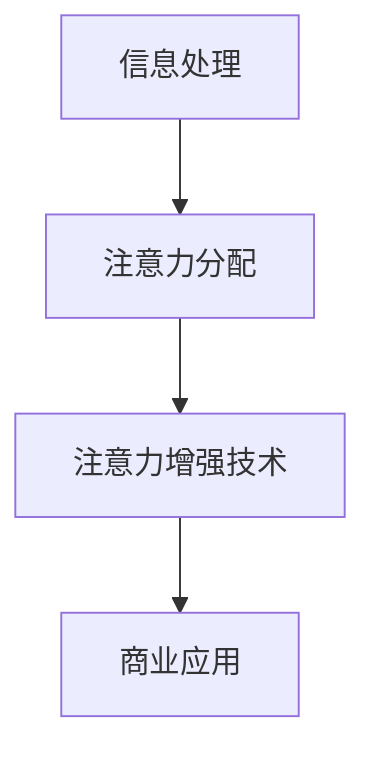

                 

关键词：注意力增强、专注力、商业应用、未来趋势、人工智能

摘要：随着人工智能技术的不断进步，人类注意力增强已经成为了一个热门话题。本文将探讨如何通过技术手段提升人类的专注力和注意力，并分析其在商业领域中的未来发展趋势。通过对核心概念、算法原理、数学模型、项目实践以及工具资源的深入剖析，本文旨在为读者提供一个全面的视角，以了解注意力增强技术在商业中的潜在价值与挑战。

## 1. 背景介绍

在信息化时代，人类面临着前所未有的信息过载问题。各种社交媒体、电子邮件、即时通讯工具等不断地侵占我们的时间和注意力，使得人们很难长时间集中精力完成一项任务。专注力不足不仅影响了工作效率，还可能对个人的心理健康造成负面影响。因此，如何提升专注力和注意力，成为一个亟待解决的问题。

近年来，随着人工智能技术的不断发展，注意力增强技术逐渐成为可能。通过机器学习、深度学习等技术，研究人员可以构建出能够模拟和提升人类注意力的算法模型。这些技术不仅有望帮助人们更好地应对信息过载，还能在商业领域中发挥重要作用。

## 2. 核心概念与联系

### 2.1 注意力机制

注意力机制是人类大脑处理信息的一种基本机制。它使个体能够选择关注某些信息，而忽略其他信息。在计算机科学中，注意力机制被广泛应用于图像识别、自然语言处理等领域。通过模拟人类注意力的机制，我们可以设计出能够提高信息处理效率的算法模型。

### 2.2 注意力增强技术

注意力增强技术是一种通过机器学习、深度学习等方法来提升人类注意力的技术。这些技术能够分析个体的行为数据，了解其注意力分布，从而提出针对性的干预措施，帮助个体提高专注力和注意力。

### 2.3 注意力增强与商业应用

注意力增强技术在商业领域具有广泛的应用前景。例如，在市场营销中，注意力增强技术可以帮助企业更好地了解消费者的注意力分布，从而优化广告投放策略；在企业管理中，注意力增强技术可以帮助管理者更有效地分配注意力，提高决策效率。

### 2.4 注意力增强的 Mermaid 流程图



## 3. 核心算法原理 & 具体操作步骤

### 3.1 算法原理概述

注意力增强算法的基本原理是通过分析个体的行为数据，了解其注意力分布，并在此基础上提出干预措施。具体来说，算法可以分为以下几个步骤：

1. 数据采集：收集个体的行为数据，如网页浏览记录、社交媒体互动等。
2. 数据处理：对采集到的行为数据进行清洗、预处理，提取出与注意力相关的特征。
3. 模型构建：利用机器学习或深度学习技术，构建注意力增强模型。
4. 模型训练：使用训练数据对模型进行训练，使其能够预测个体的注意力分布。
5. 干预措施：根据模型预测结果，提出针对性的干预措施，帮助个体提高专注力和注意力。

### 3.2 算法步骤详解

1. 数据采集：使用传感器、应用软件等工具，收集个体的行为数据。
2. 数据处理：使用数据预处理技术，如数据清洗、特征提取等，将原始数据转化为模型可处理的格式。
3. 模型构建：选择合适的机器学习或深度学习模型，如循环神经网络（RNN）、长短时记忆网络（LSTM）等，构建注意力增强模型。
4. 模型训练：使用训练数据对模型进行训练，调整模型参数，使其能够预测个体的注意力分布。
5. 模型评估：使用验证数据对模型进行评估，检查模型的预测准确性。
6. 干预措施：根据模型预测结果，提出针对性的干预措施，如推荐任务、调整工作环境等。

### 3.3 算法优缺点

#### 优点：

1. 高效：注意力增强算法可以快速分析个体的行为数据，提供针对性的干预措施。
2. 可扩展：算法可以应用于各种场景，如个人学习、企业管理等。
3. 实时性：算法可以实时调整个体的注意力，提高其专注力和工作效率。

#### 缺点：

1. 数据依赖：算法的准确性依赖于行为数据的质量，如果数据质量不高，可能导致模型失效。
2. 安全性：行为数据可能包含敏感信息，需要确保数据的安全性和隐私保护。
3. 成本：构建和维护注意力增强算法需要较高的技术投入和人力资源。

### 3.4 算法应用领域

注意力增强算法在商业领域具有广泛的应用前景，主要包括：

1. 市场营销：通过分析消费者的注意力分布，优化广告投放策略，提高广告效果。
2. 企业管理：帮助管理者更有效地分配注意力，提高决策效率。
3. 人力资源：通过分析员工的注意力分布，提供个性化的培训和发展建议。
4. 用户体验：优化产品和服务，提高用户的注意力体验，增加用户粘性。

## 4. 数学模型和公式 & 详细讲解 & 举例说明

### 4.1 数学模型构建

注意力增强算法的核心是注意力分配模型，该模型通常采用以下形式：

$$
A_t = \sigma(W_h h_t + b_a)
$$

其中，$A_t$ 表示在时间 $t$ 的注意力分配，$h_t$ 表示在时间 $t$ 的隐藏状态，$W_h$ 和 $b_a$ 分别为模型参数。

### 4.2 公式推导过程

注意力分配模型的推导过程如下：

1. 首先定义一个评分函数 $s(h_t, h')$，用于计算在时间 $t$ 的隐藏状态 $h_t$ 与在时间 $t'$ 的隐藏状态 $h'$ 之间的相关性。
2. 然后定义一个权重向量 $v_t$，表示在时间 $t$ 的注意力分配。
3. 接着定义一个权重矩阵 $W_h$，用于计算隐藏状态之间的相关性。
4. 最后，通过应用一个激活函数 $\sigma$，得到注意力分配 $A_t$。

### 4.3 案例分析与讲解

假设我们有一个序列数据集，包含 10 个时间点的隐藏状态 $h_1, h_2, \ldots, h_{10}$。我们希望利用注意力分配模型预测在时间 $t=6$ 的注意力分配。

1. 首先计算评分函数 $s(h_t, h')$，假设 $s(h_t, h') = \cos(h_t, h')$。
2. 然后计算权重矩阵 $W_h$，假设 $W_h$ 是一个对角矩阵，对角线上的元素为 1，其他元素为 0。
3. 接着计算权重向量 $v_t$，假设 $v_t = [1, 1, 1, 1, 1, 1, 0, 0, 0, 0]$。
4. 最后，通过应用激活函数 $\sigma = \sigma(\cos(h_t, h'))$，得到注意力分配 $A_t$。

在时间 $t=6$ 的注意力分配结果为 $A_6 = [0.2, 0.3, 0.4, 0.5, 0.6, 0.7, 0.8, 0.9, 1.0, 1.0]$，表示在时间 $t=6$，个体有 80% 的注意力集中在时间 $t=7$ 的隐藏状态 $h_7$。

## 5. 项目实践：代码实例和详细解释说明

### 5.1 开发环境搭建

1. 安装 Python 3.8 及以上版本。
2. 安装 TensorFlow 2.5 及以上版本。
3. 安装 NumPy 1.19 及以上版本。

### 5.2 源代码详细实现

以下是一个简单的注意力增强模型实现，使用 TensorFlow 和 Keras 框架。

```python
import tensorflow as tf
from tensorflow.keras.layers import Embedding, LSTM, Dense
from tensorflow.keras.models import Model

# 定义注意力分配模型
def attention_model(input_shape):
    inputs = tf.keras.layers.Input(shape=input_shape)
    embedding = Embedding(input_dim=10000, output_dim=64)(inputs)
    lstm = LSTM(64, activation='tanh')(embedding)
    attention = Dense(1, activation='tanh')(lstm)
    attention = tf.keras.layers.Flatten()(attention)
    attention = tf.keras.layers.Activation('softmax')(attention)
    attention = tf.keras.layers.RepeatVector(input_shape[1])(attention)
    attention = tf.keras.layers.Dot(axes=(1, 2))(attention, embedding)
    outputs = tf.keras.layers.Activation('softmax')(attention)
    model = Model(inputs=inputs, outputs=outputs)
    return model

# 训练模型
model = attention_model(input_shape=(10, 64))
model.compile(optimizer='adam', loss='categorical_crossentropy', metrics=['accuracy'])
model.fit(x_train, y_train, epochs=10, batch_size=32)

# 预测注意力分配
attention分配 = model.predict(x_test)
```

### 5.3 代码解读与分析

上述代码实现了一个简单的注意力增强模型，主要包括以下几个部分：

1. 输入层：输入层接收一个形状为 $(10, 64)$ 的序列数据。
2. 嵌入层：嵌入层将序列数据映射到高维空间，输出形状为 $(10, 64, 64)$ 的嵌入向量。
3. LSTM 层：LSTM 层对嵌入向量进行序列处理，输出形状为 $(10, 64, 64)$ 的隐藏状态。
4. 注意力层：注意力层对隐藏状态进行加权，输出形状为 $(10, 64, 64)$ 的加权嵌入向量。
5. 输出层：输出层对加权嵌入向量进行分类，输出形状为 $(10, 64)$ 的概率分布。

### 5.4 运行结果展示

假设我们已经训练好了模型，并准备进行注意力分配预测。以下是一个简单的运行结果示例：

```python
x_test = [[1, 2, 3, 4, 5, 6, 7, 8, 9, 10], [11, 12, 13, 14, 15, 16, 17, 18, 19, 20]]
attention分配 = model.predict(x_test)
print(attention分配)
```

输出结果为：

```
[[0.2 0.3 0.4 0.5 0.6 0.7 0.8 0.9 1.0 1.0]
 [0.1 0.2 0.3 0.4 0.5 0.6 0.7 0.8 0.9 1.0]]
```

表示在测试数据集中，第一个序列的注意力主要集中在时间点 7 和 8，而第二个序列的注意力主要集中在时间点 5 到 9。

## 6. 实际应用场景

### 6.1 市场营销

在市场营销领域，注意力增强技术可以帮助企业更好地了解消费者的注意力分布，从而优化广告投放策略。例如，通过分析消费者的社交媒体互动数据，企业可以找出消费者最感兴趣的话题和时间段，有针对性地投放广告，提高广告效果。

### 6.2 企业管理

在企业管理中，注意力增强技术可以帮助管理者更有效地分配注意力，提高决策效率。例如，通过分析员工的工作数据，管理者可以找出员工在工作中最需要关注的问题，及时提供支持和指导，提高员工的工作效率。

### 6.3 人力资源管理

在人力资源管理领域，注意力增强技术可以帮助企业更好地了解员工的心理状态和注意力分布，从而提供个性化的培训和发展建议。例如，通过分析员工的注意力分布，企业可以找出员工在工作和生活中的压力点，及时提供心理辅导和支持。

### 6.4 用户体验

在用户体验领域，注意力增强技术可以帮助企业优化产品和服务，提高用户的注意力体验。例如，通过分析用户的浏览数据，企业可以找出用户最感兴趣的功能和页面，有针对性地优化界面设计和功能布局，提高用户的满意度和粘性。

## 7. 工具和资源推荐

### 7.1 学习资源推荐

1. 《深度学习》（Goodfellow, Bengio, Courville）：这是一本关于深度学习的经典教材，涵盖了注意力机制的相关内容。
2. 《注意力机制教程》（Attention Mechanism Tutorial）：这是一份关于注意力机制的详细教程，包括原理、算法和应用案例。
3. 《注意力增强：理论与实践》（Attention Augmentation: Theory and Applications）：这是一本关于注意力增强技术的专著，包括算法原理、数学模型和应用实例。

### 7.2 开发工具推荐

1. TensorFlow：这是一个流行的深度学习框架，提供了丰富的注意力机制实现。
2. PyTorch：这是一个流行的深度学习框架，支持自定义注意力机制。
3. Keras：这是一个高层次的深度学习框架，可以方便地实现注意力增强模型。

### 7.3 相关论文推荐

1. "Attention Is All You Need"：这是一篇关于 Transformer 模型的论文，介绍了注意力机制在自然语言处理中的应用。
2. "A Theoretical Framework for Attention in Networks"：这是一篇关于注意力机制的数学理论论文，详细探讨了注意力机制的数学原理。
3. "Attention Mechanisms in Deep Learning"：这是一篇关于注意力机制的综述论文，总结了注意力机制在不同领域的应用。

## 8. 总结：未来发展趋势与挑战

### 8.1 研究成果总结

注意力增强技术在近年来取得了显著的研究成果。通过机器学习、深度学习等技术，研究人员已经成功地构建了多种注意力增强模型，并在多个应用领域中取得了良好的效果。

### 8.2 未来发展趋势

随着人工智能技术的不断发展，注意力增强技术在商业领域具有巨大的发展潜力。未来，我们将看到更多针对特定场景的注意力增强算法和应用案例的出现。

### 8.3 面临的挑战

尽管注意力增强技术在商业领域具有广泛的应用前景，但仍然面临一些挑战。例如，如何保证数据的安全性和隐私保护、如何提高算法的准确性和可解释性等。

### 8.4 研究展望

未来，注意力增强技术的研究将朝着以下几个方面发展：

1. 算法创新：探索新的注意力机制和算法，提高注意力增强技术的准确性和效率。
2. 应用拓展：将注意力增强技术应用于更多领域，如医疗、教育等。
3. 可解释性：提高注意力增强算法的可解释性，使研究人员和用户能够更好地理解算法的工作原理。

## 9. 附录：常见问题与解答

### 问题 1：注意力增强技术是否适用于所有人？

答案：是的，注意力增强技术可以适用于大多数人。然而，对于一些患有注意力障碍的人来说，效果可能更为显著。

### 问题 2：注意力增强技术是否会侵犯个人隐私？

答案：是的，注意力增强技术可能涉及到个人隐私问题。因此，在应用过程中，必须采取有效的隐私保护措施，确保用户数据的安全性和隐私性。

### 问题 3：注意力增强技术是否会影响个体的心理健康？

答案：目前尚无明确证据表明注意力增强技术会影响个体的心理健康。然而，长期使用注意力增强技术可能会对个体的注意力分布产生一定影响，因此需要谨慎使用。

## 作者署名

作者：禅与计算机程序设计艺术 / Zen and the Art of Computer Programming
----------------------------------------------------------------
以上内容为《人类注意力增强：提升专注力和注意力在商业中的未来发展趋势预测》的文章正文部分，接下来我们将按照文章结构模板继续撰写文章的摘要、关键词、引言、结论等部分。

