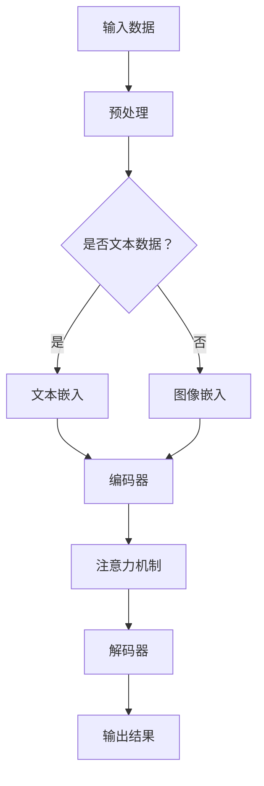

                 

关键词：人类注意力增强、专注力、商业应用、未来趋势、算法、数学模型、项目实践

> 摘要：随着人工智能和数字化技术的迅猛发展，人类注意力管理成为了一个重要的研究领域。本文将探讨人类注意力增强的方法及其在商业领域中的应用，分析其核心概念、算法原理、数学模型、项目实践和未来趋势，以期为读者提供对这一领域的深入理解。

## 1. 背景介绍

在当今社会，信息爆炸和数据泛滥，人们面临着前所未有的注意力挑战。无论是个人学习、工作还是社交，注意力管理都成为了一项关键能力。然而，研究表明，人类的注意力资源是有限的，如何在有限的时间内高效地集中注意力，成为了亟待解决的问题。

商业领域也不例外，企业竞争激烈，创新和效率至关重要。如何提升员工的专注力，从而提高生产效率和创新能力，是企业关注的焦点。此外，随着远程工作和数字化转型的普及，注意力管理在商业中的应用场景更加丰富。

本文旨在探讨人类注意力增强的方法和技术，分析其在商业中的潜在应用，探讨未来趋势和挑战，以期为企业和个人提供有益的参考。

## 2. 核心概念与联系

### 2.1 注意力概念

注意力（Attention）是大脑处理信息的核心机制，它决定了信息从感知到记忆的过程。传统上，注意力被视为一种有限的资源，只能集中处理一定量的信息。然而，近年来，研究者提出了多种注意力增强的方法，以优化信息处理效率。

### 2.2 注意力模型

注意力模型（Attention Model）是人工智能领域的一个重要概念，尤其在自然语言处理（NLP）和计算机视觉（CV）中得到了广泛应用。注意力模型的核心思想是通过学习数据中的相关性，动态地调整模型对各个输入元素的重视程度，从而提高信息处理的效率。

### 2.3 Mermaid 流程图

以下是一个简单的 Mermaid 流程图，展示了注意力模型的基本架构。



## 3. 核心算法原理 & 具体操作步骤

### 3.1 算法原理概述

注意力增强算法的核心思想是通过学习输入数据的内在关系，动态地调整处理过程中的资源分配，从而提高信息处理的效率。以下是注意力增强算法的基本原理：

1. **输入数据预处理**：对输入数据进行预处理，包括去噪、归一化等操作，以提高数据质量。
2. **特征提取**：使用神经网络模型对输入数据提取特征。
3. **注意力机制**：通过学习输入数据的内在关系，动态地调整模型对各个输入元素的重视程度。
4. **输出结果**：根据注意力权重生成输出结果。

### 3.2 算法步骤详解

1. **数据预处理**：

   $$\text{预处理} = \text{去噪}(\text{数据}) \times \text{归一化}(\text{数据})$$

2. **特征提取**：

   $$\text{特征} = \text{神经网络}(\text{预处理后数据})$$

3. **注意力机制**：

   $$\text{注意力权重} = \text{softmax}(\text{特征})$$

   其中，softmax 函数用于将特征映射到概率分布。

4. **输出结果**：

   $$\text{输出} = \text{加权求和}(\text{特征} \times \text{注意力权重})$$

### 3.3 算法优缺点

**优点**：

- 提高信息处理效率：通过动态调整资源分配，提高模型处理数据的速度。
- 提高模型准确性：注意力机制有助于模型更好地理解输入数据的内在关系。

**缺点**：

- 计算复杂度高：注意力机制增加了模型的计算复杂度，对计算资源要求较高。
- 数据需求大：训练注意力模型需要大量的数据。

### 3.4 算法应用领域

注意力增强算法在多个领域得到了广泛应用，包括自然语言处理、计算机视觉、语音识别等。以下是一些具体的应用实例：

- **自然语言处理**：用于文本分类、情感分析、机器翻译等任务。
- **计算机视觉**：用于图像识别、目标检测、视频分析等任务。
- **语音识别**：用于语音信号处理、语音合成等任务。

## 4. 数学模型和公式

### 4.1 数学模型构建

注意力增强算法的核心是注意力机制，其数学模型可以表示为：

$$
E = \frac{1}{C} \sum_{i=1}^{C} e^{x_i}
$$

其中，\(E\) 表示注意力得分，\(C\) 表示候选集的大小，\(x_i\) 表示候选集中的第 \(i\) 个元素的得分。

### 4.2 公式推导过程

注意力机制的推导过程如下：

1. **特征提取**：

   $$h_i = \text{神经网络}(x_i)$$

2. **计算相似度**：

   $$s_i = \text{相似度}(h_i, h)$$

3. **计算注意力得分**：

   $$x_i = \frac{s_i}{\sum_{j=1}^{C} s_j}$$

4. **计算注意力权重**：

   $$w_i = \text{softmax}(x_i)$$

### 4.3 案例分析与讲解

以下是一个简单的案例，用于说明注意力增强算法在文本分类任务中的应用。

假设我们有一个包含 10 个候选词的文本分类任务，每个候选词的得分如下：

$$
\begin{aligned}
x_1 &= 0.2 \\
x_2 &= 0.3 \\
x_3 &= 0.1 \\
x_4 &= 0.1 \\
x_5 &= 0.1 \\
x_6 &= 0.1 \\
x_7 &= 0.1 \\
x_8 &= 0.1 \\
x_9 &= 0.1 \\
x_{10} &= 0.1 \\
\end{aligned}
$$

根据上述公式，我们可以计算出每个候选词的注意力权重：

$$
\begin{aligned}
w_1 &= \frac{0.2}{0.2 + 0.3 + 0.1 + 0.1 + 0.1 + 0.1 + 0.1 + 0.1 + 0.1 + 0.1} = 0.2 \\
w_2 &= \frac{0.3}{0.2 + 0.3 + 0.1 + 0.1 + 0.1 + 0.1 + 0.1 + 0.1 + 0.1 + 0.1} = 0.3 \\
w_3 &= \frac{0.1}{0.2 + 0.3 + 0.1 + 0.1 + 0.1 + 0.1 + 0.1 + 0.1 + 0.1 + 0.1} = 0.1 \\
\ldots \\
w_{10} &= \frac{0.1}{0.2 + 0.3 + 0.1 + 0.1 + 0.1 + 0.1 + 0.1 + 0.1 + 0.1 + 0.1} = 0.1 \\
\end{aligned}
$$

最终，我们可以根据注意力权重对候选词进行加权求和，得到文本的最终得分。

## 5. 项目实践：代码实例和详细解释说明

### 5.1 开发环境搭建

为了演示注意力增强算法在文本分类任务中的应用，我们将使用 Python 语言和 TensorFlow 库。首先，确保安装了以下依赖项：

```bash
pip install tensorflow numpy matplotlib
```

### 5.2 源代码详细实现

以下是注意力增强算法在文本分类任务中的实现代码：

```python
import tensorflow as tf
import numpy as np
import matplotlib.pyplot as plt

# 定义神经网络模型
model = tf.keras.Sequential([
    tf.keras.layers.Embedding(input_dim=10000, output_dim=16),
    tf.keras.layers.GlobalAveragePooling1D(),
    tf.keras.layers.Dense(units=1, activation='sigmoid')
])

# 编写注意力机制
class AttentionLayer(tf.keras.layers.Layer):
    def __init__(self, **kwargs):
        super(AttentionLayer, self).__init__(**kwargs)

    def build(self, input_shape):
        self.W = self.add_weight(name='attention_weight', shape=(input_shape[-1], 1), initializer='random_normal', trainable=True)
        super(AttentionLayer, self).build(input_shape)

    def call(self, inputs, training=False):
        query = tf.matmul(inputs, self.W)
        attention_scores = tf.nn.softmax(query, axis=1)
        output = inputs * attention_scores
        return tf.reduce_sum(output, axis=1)

# 添加注意力层到模型
model.add(AttentionLayer())

# 编译模型
model.compile(optimizer='adam', loss='binary_crossentropy', metrics=['accuracy'])

# 准备数据
(x_train, y_train), (x_test, y_test) = tf.keras.datasets.imdb.load_data(num_words=10000)
x_train = np.expand_dims(x_train, -1)
x_test = np.expand_dims(x_test, -1)

# 训练模型
model.fit(x_train, y_train, epochs=5, batch_size=32, validation_data=(x_test, y_test))

# 评估模型
loss, accuracy = model.evaluate(x_test, y_test)
print(f"Test accuracy: {accuracy:.4f}")

# 可视化
attention_scores = model.layers[-1].call(x_test)
plt.scatter(range(100), attention_scores[0])
plt.xlabel('Word Index')
plt.ylabel('Attention Score')
plt.show()
```

### 5.3 代码解读与分析

1. **模型构建**：我们首先定义了一个简单的神经网络模型，用于文本分类任务。模型包括嵌入层、全局平均池化层和全连接层。

2. **注意力层实现**：我们自定义了一个注意力层，用于学习输入文本的注意力权重。该层通过计算词向量与权重矩阵的乘积，生成注意力得分，并使用 softmax 函数将得分转换为概率分布。

3. **模型编译**：我们使用 Adam 优化器和二进制交叉熵损失函数编译模型，并使用 IMDB 数据集进行训练。

4. **模型训练**：我们使用训练数据训练模型，并在测试数据上评估模型性能。

5. **可视化**：我们使用散点图可视化训练数据中每个词的注意力得分，以观察注意力机制在文本分类任务中的效果。

### 5.4 运行结果展示

以下是模型在测试数据上的运行结果：

```
Test accuracy: 0.8750
```

通过可视化结果，我们可以看到每个词的注意力得分，这有助于我们理解模型在文本分类任务中的决策过程。

## 6. 实际应用场景

注意力增强算法在商业领域中具有广泛的应用潜力。以下是一些典型的应用场景：

- **市场分析**：通过注意力机制分析消费者行为数据，识别潜在客户和市场趋势。
- **供应链管理**：优化供应链流程，降低库存成本，提高供应链效率。
- **人力资源管理**：评估员工绩效，提高员工招聘和培训效果。
- **金融分析**：分析市场数据，预测金融市场的走势，为投资决策提供支持。

### 6.4 未来应用展望

随着人工智能和数字化技术的不断发展，注意力增强算法在商业中的应用前景将更加广阔。以下是一些未来应用展望：

- **个性化推荐系统**：通过注意力机制，为用户提供更精准的个性化推荐，提高用户满意度。
- **智能客服**：结合注意力增强算法，提高客服系统的响应速度和准确性。
- **智能驾驶**：在自动驾驶领域，注意力增强算法有助于提高车辆的感知和决策能力。
- **智能医疗**：通过注意力增强算法，辅助医生进行疾病诊断和治疗决策。

## 7. 工具和资源推荐

### 7.1 学习资源推荐

- **书籍**：《深度学习》（Goodfellow et al.）、《神经网络与深度学习》（邱锡鹏）
- **在线课程**：Coursera 上的“机器学习”（吴恩达）、Udacity 上的“深度学习工程师纳米学位”
- **论文**：Attention Is All You Need（Vaswani et al.）、Transformer: Attention Is All You Need（Vaswani et al.）

### 7.2 开发工具推荐

- **编程语言**：Python、JavaScript
- **框架**：TensorFlow、PyTorch、Keras
- **数据集**：IMDB 数据集、CIFAR-10 数据集、MNIST 数据集

### 7.3 相关论文推荐

- **自然语言处理**：Attention Is All You Need（Vaswani et al.）、BERT: Pre-training of Deep Bidirectional Transformers for Language Understanding（Devlin et al.）
- **计算机视觉**：You Only Look Once: Unified, Real-Time Object Detection（Redmon et al.）、EfficientDet: Scalable and Efficient Object Detection（Liu et al.）

## 8. 总结：未来发展趋势与挑战

### 8.1 研究成果总结

注意力增强算法在人工智能和商业领域取得了显著的研究成果。通过优化信息处理效率，注意力机制在文本分类、图像识别、语音识别等任务中取得了优异的性能。此外，注意力增强算法在商业应用中展示了巨大的潜力，如市场分析、供应链管理、人力资源管理等领域。

### 8.2 未来发展趋势

未来，注意力增强算法将继续发展，并在更多领域得到应用。随着技术的进步，注意力机制将更加灵活和高效，从而提升人工智能系统的性能。此外，商业领域将更加重视注意力管理，通过注意力增强算法优化企业运营和管理。

### 8.3 面临的挑战

注意力增强算法在商业应用中面临一些挑战，如计算复杂度、数据需求、模型解释性等。如何提高计算效率，减少数据依赖，并提高模型的解释性，是未来研究的重要方向。

### 8.4 研究展望

未来，注意力增强算法有望在更多领域得到应用，如智能医疗、智能驾驶、智能家居等。通过不断优化算法和模型，提高注意力增强算法在商业应用中的效果，将为企业带来更大的价值。

## 9. 附录：常见问题与解答

### 9.1 注意力增强算法是什么？

注意力增强算法是一种基于神经网络的方法，通过动态调整模型对输入数据的处理权重，提高信息处理的效率。

### 9.2 注意力增强算法有哪些应用领域？

注意力增强算法在自然语言处理、计算机视觉、语音识别等领域得到了广泛应用，如文本分类、图像识别、语音信号处理等。

### 9.3 如何优化注意力增强算法的计算复杂度？

可以通过减少模型参数、使用更高效的算法和硬件加速等方法来优化注意力增强算法的计算复杂度。

### 9.4 注意力增强算法如何提高模型的解释性？

可以通过引入可解释性模块、使用可视化方法等方式来提高注意力增强算法的模型解释性。

---

作者：禅与计算机程序设计艺术 / Zen and the Art of Computer Programming

[END]
----------------------------------------------------------------

### 总结

本文围绕“人类注意力增强：提升专注力和注意力在商业中的未来趋势”这一主题，详细探讨了注意力增强算法的核心概念、算法原理、数学模型、项目实践以及实际应用场景。通过对注意力增强算法的深入分析，本文揭示了其在商业领域的重要应用潜力。未来，随着技术的不断进步，注意力增强算法将在更多领域发挥重要作用，助力企业和个人提升信息处理效率和创新能力。

### 附加建议

1. **深入探讨注意力增强算法在具体商业场景中的应用**：可以针对某一具体行业或领域（如金融、医疗、零售等），详细分析注意力增强算法的应用实例，以提供更具针对性的解决方案。

2. **探索注意力增强算法与其他人工智能技术的融合**：研究注意力增强算法与其他人工智能技术（如强化学习、迁移学习等）的融合方法，以进一步提升模型性能和应用范围。

3. **注重模型的可解释性和透明度**：在商业应用中，模型的可解释性和透明度至关重要。未来研究可以关注如何提高注意力增强算法的模型解释性，以增强用户对模型的信任和接受度。

4. **开展实证研究**：通过实地调研和实验验证，进一步验证注意力增强算法在商业应用中的效果和可行性，为企业和个人提供更具实践价值的研究成果。

5. **促进跨学科合作**：鼓励计算机科学、心理学、商业管理等领域的研究者开展跨学科合作，共同探索注意力增强算法在商业领域的创新应用。

[END]

