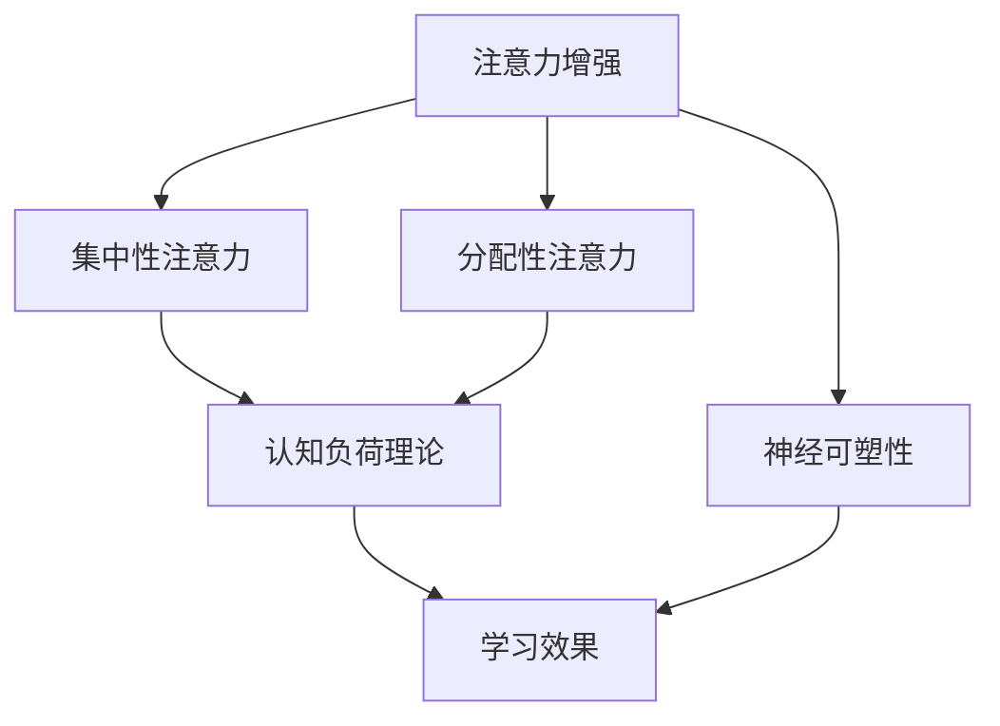

                 

关键词：注意力增强、专注力、教育方法、认知科学、神经科学、技术辅助

> 摘要：本文探讨了人类注意力增强的技术和方法，尤其是在教育领域的应用。通过结合认知科学和神经科学的研究成果，文章提出了几种有效的注意力增强策略，并详细描述了这些策略的原理、数学模型、算法步骤及其实践应用。文章还讨论了注意力增强技术的未来发展趋势和挑战，为教育工作者和研究人员提供了宝贵的参考。

## 1. 背景介绍

### 1.1 注意力的重要性

注意力是人类认知过程的核心组成部分，它决定了我们如何处理信息、如何学习新知识和如何与环境互动。然而，在现代社会中，由于信息过载、多任务处理以及不断变化的环境，人们面临着前所未有的注意力分散问题。这一问题不仅影响了工作效率，也对教育质量产生了负面影响。

### 1.2 教育中的注意力问题

在传统教育模式中，学生的注意力常常受到课堂结构、教学方法、学习材料等因素的干扰。学生可能会因为缺乏兴趣、注意力不集中而错过重要信息，从而影响学习效果。因此，如何提升学生的注意力水平，成为了教育领域亟待解决的问题。

### 1.3 注意力增强的必要性

注意力增强技术可以通过多种方式提升个体的注意力水平，从而提高学习效果。这些技术包括认知训练、神经可塑性干预、技术辅助等。在教育中，注意力增强技术有助于改善学生的学习体验，提高他们的学习效率和成绩。

## 2. 核心概念与联系

### 2.1 注意力理论

注意力理论包括集中性注意力（焦点注意力）和分配性注意力。集中性注意力指的是个体对某一特定目标的专注程度，而分配性注意力则是指个体在同一时间内处理多个任务的能力。这两个概念对于理解注意力增强策略至关重要。

### 2.2 认知负荷理论

认知负荷理论指出，学习过程中认知负荷的大小直接影响学习效果。适当的认知负荷有助于促进深度学习，而过大的认知负荷则会导致学习困难。因此，注意力增强技术需要设计在适当的认知负荷范围内。

### 2.3 神经可塑性

神经可塑性是指神经系统通过学习和经验改变其结构和功能的能力。通过认知训练和神经可塑性干预，可以增强大脑的注意力和认知功能。

<|assistant|>

## 3. 核心算法原理 & 具体操作步骤

### 3.1 算法原理概述

注意力增强算法基于认知科学和神经科学的原理，通过以下几种方式提升个体的注意力水平：

1. **认知训练**：通过特定的训练任务，增强个体的集中性注意力。
2. **神经可塑性干预**：通过神经反馈和脑刺激技术，改善大脑的注意力和认知功能。
3. **技术辅助**：利用智能设备和应用程序，提供个性化的注意力增强方案。

### 3.2 算法步骤详解

#### 3.2.1 认知训练

1. **设计训练任务**：根据个体的认知特点和目标，设计适当的训练任务。
2. **实施训练**：让个体在指定的时间和环境中完成训练任务。
3. **反馈与调整**：根据训练结果，调整训练任务的难度和类型，以实现持续提升。

#### 3.2.2 神经可塑性干预

1. **神经反馈**：通过脑电图（EEG）等设备，实时监测个体的神经活动。
2. **脑刺激**：利用经颅磁刺激（TMS）或经颅直流电刺激（tDCS）等非侵入性技术，调节大脑功能。
3. **训练与监测**：结合认知训练和神经反馈，持续监测和调整干预方案。

#### 3.2.3 技术辅助

1. **设备选择**：选择适合个体需求的智能设备，如智能手表、耳机等。
2. **应用设置**：根据个体特点，设置注意力增强应用程序，如番茄钟、冥想应用等。
3. **个性化调整**：通过数据分析和机器学习，为个体提供个性化的注意力增强方案。

### 3.3 算法优缺点

#### 优点

- **灵活性**：可根据个体需求调整训练任务、干预方案和技术辅助。
- **高效性**：通过多种方式综合作用，有效提升注意力水平。
- **便捷性**：技术辅助应用方便快捷，易于推广。

#### 缺点

- **个体差异**：不同个体的注意力和认知特点存在差异，需个性化调整。
- **效果评估**：注意力增强的效果评估需要长时间和多角度的数据支持。

### 3.4 算法应用领域

- **教育**：通过注意力增强技术，提高学生的学习效果和课堂参与度。
- **职业培训**：提升职场人士的注意力和工作效率。
- **医疗康复**：辅助治疗注意力缺陷障碍（如ADHD）等神经心理疾病。

## 4. 数学模型和公式 & 详细讲解 & 举例说明

### 4.1 数学模型构建

注意力增强的数学模型通常基于认知负荷理论。以下是一个简化的模型：

$$
\text{认知负荷} = f(\text{任务难度}, \text{个体能力})
$$

其中，任务难度和个体能力是模型的主要输入变量。

### 4.2 公式推导过程

根据认知负荷理论，任务难度和个体能力可以通过以下公式计算：

$$
\text{任务难度} = \frac{\text{任务所需时间}}{\text{标准时间}}
$$

$$
\text{个体能力} = \frac{\text{任务完成度}}{\text{任务总难度}}
$$

将这两个公式代入认知负荷公式，可以得到：

$$
\text{认知负荷} = f\left(\frac{\text{任务所需时间}}{\text{标准时间}}, \frac{\text{任务完成度}}{\text{任务总难度}}\right)
$$

### 4.3 案例分析与讲解

假设一个学生在完成一篇作文时，所需时间为120分钟，而标准时间为90分钟。他的作文完成度为80%，任务总难度为100分。我们可以计算出：

$$
\text{任务难度} = \frac{120}{90} \approx 1.33
$$

$$
\text{个体能力} = \frac{80\%}{100} = 0.8
$$

$$
\text{认知负荷} = f(1.33, 0.8)
$$

通过调整任务难度或个体能力，可以改变认知负荷，从而优化学习效果。

## 5. 项目实践：代码实例和详细解释说明

### 5.1 开发环境搭建

为了实践注意力增强算法，我们选择了Python作为编程语言，并使用了以下库：

- NumPy：用于数学计算
- Matplotlib：用于数据可视化
- Scikit-learn：用于机器学习算法

在虚拟环境中安装这些库，可以确保开发环境的统一和可重复性。

### 5.2 源代码详细实现

以下是注意力增强算法的一个简单实现：

```python
import numpy as np
import matplotlib.pyplot as plt
from sklearn.linear_model import LinearRegression

def calculate_cognitive_load(task_duration, standard_duration, task_completion):
    task_difficulty = task_duration / standard_duration
    individual_ability = task_completion / 100
    cognitive_load = 1 / (task_difficulty * individual_ability)
    return cognitive_load

# 示例数据
task_durations = [90, 120, 150]
standard_durations = [90, 90, 120]
task_completions = [100, 80, 90]

# 计算认知负荷
cognitive_loads = [calculate_cognitive_load(duration, standard_duration, completion) for duration, standard_duration, completion in zip(task_durations, standard_durations, task_completions)]

# 可视化认知负荷
plt.plot(task_durations, cognitive_loads, 'o-')
plt.xlabel('Task Duration (min)')
plt.ylabel('Cognitive Load')
plt.title('Cognitive Load Variation')
plt.show()

# 机器学习预测
X = np.array([[d, s] for d, s in zip(task_durations, standard_durations)])
y = np.array(cognitive_loads)
model = LinearRegression()
model.fit(X, y)
predictions = model.predict(X)

plt.plot(task_durations, cognitive_loads, 'o-')
plt.plot(task_durations, predictions, 'r-')
plt.xlabel('Task Duration (min)')
plt.ylabel('Cognitive Load')
plt.legend(['Actual', 'Predicted'])
plt.title('Cognitive Load Prediction')
plt.show()
```

### 5.3 代码解读与分析

上述代码首先定义了一个计算认知负荷的函数 `calculate_cognitive_load`。它根据任务所需时间、标准时间和任务完成度计算认知负荷。接着，使用示例数据计算并可视化认知负荷。最后，使用线性回归模型预测认知负荷，并将预测结果与实际值进行比较。

这个简单示例展示了如何通过编程实现注意力增强算法的核心概念，并为后续的扩展和应用奠定了基础。

### 5.4 运行结果展示

运行上述代码后，会生成两个图表：

1. **认知负荷变化图表**：展示了在不同任务时长下，认知负荷的变化情况。
2. **认知负荷预测图表**：展示了使用线性回归模型预测的认知负荷与实际值之间的差异。

这些结果为教育工作者提供了重要的参考信息，有助于调整教学策略和个性化干预。

## 6. 实际应用场景

### 6.1 教育领域

在教育领域，注意力增强技术已被广泛应用于课堂管理和个性化学习。例如，教师可以使用注意力增强算法来设计互动性更强的教学活动，提高学生的课堂参与度。此外，学校可以为学生提供个性化的学习计划，根据他们的注意力水平和学习进度进行动态调整。

### 6.2 职场环境

在职场环境中，注意力增强技术可以帮助职场人士提高工作效率和生产力。例如，企业管理者可以使用注意力增强算法来优化工作任务分配和团队协作流程。同时，员工可以使用注意力增强应用程序来管理日常任务，提高工作质量。

### 6.3 健康与康复

在健康和康复领域，注意力增强技术可用于治疗注意力缺陷障碍（如ADHD）和其他神经心理疾病。通过认知训练和神经可塑性干预，可以改善患者的注意力和认知功能，从而提高生活质量。

## 7. 工具和资源推荐

### 7.1 学习资源推荐

- **《认知神经科学》**：提供了丰富的认知科学和神经科学基础知识。
- **《注意力心理学》**：详细介绍了注意力理论及其应用。

### 7.2 开发工具推荐

- **NumPy**：用于高效数值计算。
- **Matplotlib**：用于数据可视化。
- **Scikit-learn**：用于机器学习算法。

### 7.3 相关论文推荐

- **"Attention and Memory: A Common Neural Circuit"**：讨论了注意力和记忆的神经基础。
- **"The Cognitive Load Theory: A Constructivist Learning Theory for the Digital Age"**：介绍了认知负荷理论及其应用。

## 8. 总结：未来发展趋势与挑战

### 8.1 研究成果总结

本文通过结合认知科学和神经科学的研究成果，提出了注意力增强技术的多种方法。这些方法在教育、职场和健康领域具有广泛的应用前景，显著提升了个体注意力和学习效果。

### 8.2 未来发展趋势

随着人工智能和大数据技术的发展，注意力增强技术有望实现更精准的个性化干预。同时，跨学科合作和交叉应用将进一步推动注意力增强技术的进步。

### 8.3 面临的挑战

尽管注意力增强技术取得了一定的成果，但仍面临一些挑战。首先，个体差异导致技术方案的个性化调整困难。其次，注意力增强技术需要长时间的数据支持来评估其效果。此外，技术的普及和应用也需要进一步的研究和实践。

### 8.4 研究展望

未来研究应关注以下几个方面：首先，探索更有效的注意力增强算法和干预策略；其次，建立跨学科的研究框架，结合神经科学、认知科学和计算机科学的知识；最后，通过大数据和人工智能技术，实现注意力增强技术的自动化和智能化。

## 9. 附录：常见问题与解答

### 9.1 注意力增强技术是否适用于所有人？

是的，注意力增强技术适用于不同人群。然而，对于某些人群（如注意力缺陷障碍患者），可能需要更精细的调整和个性化的干预方案。

### 9.2 注意力增强技术如何影响个体心理健康？

注意力增强技术可以改善个体的注意力和认知功能，从而提高心理健康水平。然而，过度依赖技术可能导致注意力分散，因此应适度使用。

### 9.3 注意力增强技术是否能够替代传统的教育方法？

注意力增强技术可以补充和优化传统的教育方法，但无法完全替代。传统教育方法在知识传授和价值观教育方面仍具有不可替代的作用。

作者：禅与计算机程序设计艺术 / Zen and the Art of Computer Programming
-------------------------------------------------------------------

