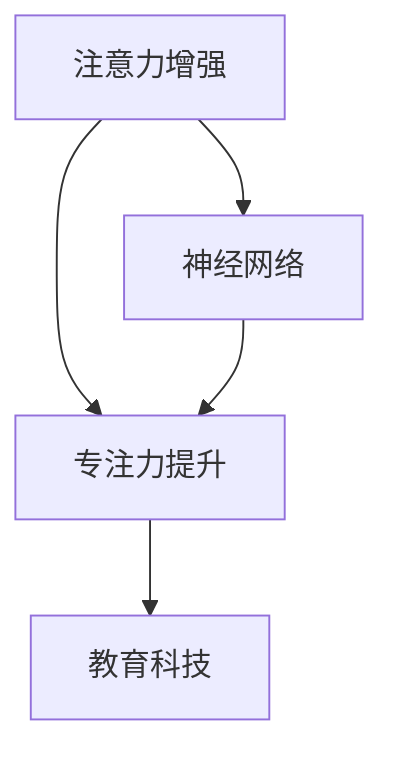

                 

# 人类注意力增强：提升专注力和注意力在教育中的未来方向分析

> 关键词：人工智能,注意力增强,专注力提升,教育科技,神经网络

## 1. 背景介绍

### 1.1 问题由来
在信息爆炸、知识更新速度加快的当今社会，如何有效地提升个体的学习效率和专注力，成为了教育领域亟待解决的问题。传统的教育模式往往依赖于教师的讲授和学生的被动接受，难以满足个性化学习需求。随着人工智能技术的日益成熟，借助智能算法增强人类注意力，提高学习效果，成为了可能。

### 1.2 问题核心关键点
本研究聚焦于如何利用人工智能技术，特别是神经网络模型，增强人类学习过程中的注意力，提升学生的专注力和学习效率。研究将从核心概念、算法原理、具体操作步骤等多个维度进行全面分析，以期为教育领域提供新的解决思路和技术路径。

### 1.3 问题研究意义
本研究旨在探讨利用人工智能技术提升人类注意力的机制和方法，具有以下重要意义：

1. **个性化教育**：通过提升个体注意力，实现个性化学习路径的构建，满足不同学生的需求。
2. **学习效率提升**：增强学习过程中的注意力，提高信息获取和理解效率，加快学习进程。
3. **教育公平性**：特别是针对资源匮乏地区，可通过技术手段弥补教学资源的不足，提升教育质量。
4. **终身学习**：适应快速变化的社会需求，培养具备持续学习能力的人才。
5. **创新教育方式**：通过智能算法辅助教学，探索新的教育模式，推动教育创新。

## 2. 核心概念与联系

### 2.1 核心概念概述

本节将介绍几个关键概念，并分析它们之间的联系：

- **注意力增强**：利用算法技术，提升个体在学习过程中的注意力，避免分散和分心，提高信息处理效率。
- **神经网络**：以神经元为基本单元构建的计算模型，能够模拟人脑神经元的活动方式，广泛应用于图像识别、语音识别、自然语言处理等任务。
- **专注力提升**：通过注意力增强，优化个体对学习内容的关注，提升学习和工作时的专注度和持续性。
- **教育科技**：将人工智能、神经网络等技术应用于教育领域，提升教学效果和教育质量。

这些概念之间的逻辑关系可以通过以下Mermaid流程图来展示：



这个流程图展示了几者之间的核心关系：

1. 注意力增强技术依赖于神经网络模型的支持，通过学习任务数据，提升个体的注意力。
2. 增强的注意力能够有效提升个体的专注力，从而提升学习效果。
3. 通过教育科技的应用，注意力增强技术能够在教育场景中得到广泛应用，推动教育创新。

## 3. 核心算法原理 & 具体操作步骤
### 3.1 算法原理概述

本研究主要采用神经网络模型，特别是基于注意力机制的深度学习模型，来增强个体在学习过程中的注意力。其核心思想是通过对学习内容的分析，自动调整个体对不同信息的关注度，从而提升学习效率。

注意力增强的原理如下：
- 将学习内容分为多个部分，每个部分赋予不同的权重。
- 使用神经网络模型（如Transformer）来学习不同内容的权重分布，自动调整注意力。
- 通过反向传播算法不断优化权重，提高模型对注意力增强的预测能力。

### 3.2 算法步骤详解

注意力增强算法的步骤包括：

**Step 1: 数据准备**
- 收集学习内容数据，将其分为多个部分。
- 对每个部分进行预处理，包括分词、向量化等。
- 构建训练集、验证集和测试集。

**Step 2: 模型选择**
- 选择合适的神经网络模型，如Transformer、LSTM等。
- 定义模型的输入和输出，设置层数和节点数等超参数。

**Step 3: 注意力机制设计**
- 定义注意力权重计算方法，如注意力得分函数、softmax函数等。
- 设计注意力向量计算方式，如自注意力机制、多头注意力机制等。

**Step 4: 模型训练**
- 使用训练集数据训练模型，通过前向传播和反向传播不断优化权重。
- 在验证集上评估模型性能，调整模型参数。
- 使用测试集评估最终模型效果。

**Step 5: 应用部署**
- 将训练好的模型应用于实际学习场景，如学习平台、智能设备等。
- 监控模型效果，不断优化和调整算法。

### 3.3 算法优缺点

注意力增强算法具有以下优点：
1. **自动化调整**：通过神经网络模型，自动调整个体对不同信息的关注度，提升学习效率。
2. **适应性强**：能够处理不同学习内容，灵活适应不同学科和任务。
3. **可解释性**：神经网络模型的训练过程透明，容易解释和调试。
4. **扩展性强**：模型可扩展到多种学习场景，如在线教育、离线阅读等。

同时，该算法也存在一些局限：
1. **数据依赖**：模型效果依赖于学习内容的准确性和多样性，高质量数据获取成本较高。
2. **计算量大**：神经网络模型的训练和推理需要大量的计算资源，对硬件要求较高。
3. **模型泛化能力有限**：对于复杂的任务和数据，模型可能存在泛化能力不足的问题。
4. **过拟合风险**：模型可能对特定学习内容过度拟合，影响泛化能力。

尽管存在这些局限，注意力增强算法在提升个体学习效率和专注力方面仍展现出巨大的潜力，值得深入研究。

### 3.4 算法应用领域

注意力增强算法在教育领域有着广泛的应用前景：

1. **在线教育**：通过学习平台的智能推荐系统，帮助学生选择适合自己的学习内容。
2. **智能笔记**：结合手写输入和注意力增强技术，实时记录和整理学习笔记，提高学习效率。
3. **智能阅读**：通过阅读平台中的注意力增强功能，帮助用户集中注意力，提高阅读理解能力。
4. **游戏化学习**：在教育游戏中引入注意力增强技术，引导学生集中注意力，提升学习兴趣。

## 4. 数学模型和公式 & 详细讲解 & 举例说明

### 4.1 数学模型构建

注意力增强算法的数学模型可以表示为：
$$
\text{Attention}(X, Q, K, V) = \text{Softmax}(\frac{Q^T K}{\sqrt{d_k}})V
$$
其中，$X$ 表示输入的学习内容，$Q$ 和 $K$ 分别表示查询向量和键向量，$V$ 表示值向量。

注意力权重计算公式为：
$$
\alpha_{i,j} = \frac{\exp(\frac{Q_i K_j}{\sqrt{d_k}})}{\sum_{j=1}^{N}\exp(\frac{Q_i K_j}{\sqrt{d_k}})}
$$
其中，$i$ 表示查询向量的位置，$j$ 表示键向量的位置，$d_k$ 表示键向量的维度。

### 4.2 公式推导过程

注意力增强算法的核心在于注意力权重的计算。其推导过程如下：

1. 将输入内容 $X$ 分为多个部分 $X_1, X_2, ..., X_n$。
2. 对于每个部分，分别计算其与查询向量 $Q$ 的相似度。
3. 将相似度结果进行归一化处理，得到注意力权重 $\alpha$。
4. 根据权重 $\alpha$ 计算每个部分的加权值 $V$，得到最终的注意力增强结果。

### 4.3 案例分析与讲解

以阅读理解任务为例，分析注意力增强算法的具体应用：

**输入**：一篇包含多个段落的文章，每段内容不同。

**查询向量**：读者对文章的理解程度，可以通过读者之前的阅读历史、兴趣点等进行计算。

**键向量**：每段文章的关键信息，如主题、结构等。

**值向量**：每段文章的具体内容，如细节描述、论据等。

通过神经网络模型计算出每个段落的注意力权重，将读者对文章的关注点自动调整，提升阅读理解效果。

## 5. 项目实践：代码实例和详细解释说明

### 5.1 开发环境搭建

进行注意力增强算法实践，需要搭建一个完整的开发环境，包括：

1. 安装Python：从官网下载并安装Python 3.x版本。
2. 安装Pip：使用Python自带的pip工具安装第三方库。
3. 安装TensorFlow或PyTorch：选择适合的深度学习框架，进行模型训练。
4. 安装相关的依赖库：如Numpy、Pandas、Scikit-learn等。

**代码示例**：
```python
!pip install tensorflow==2.3
!pip install numpy pandas scikit-learn
```

### 5.2 源代码详细实现

下面以一个简单的神经网络模型为例，展示注意力增强算法的代码实现。

**代码示例**：
```python
import tensorflow as tf
from tensorflow.keras.layers import Input, Dense, Embedding, Softmax
from tensorflow.keras.models import Model

# 定义输入层
input_layer = Input(shape=(None,))

# 定义查询向量
query_layer = Dense(64, activation='relu')(input_layer)

# 定义键向量
key_layer = Embedding(input_dim=1000, output_dim=64, input_length=100)(input_layer)

# 计算注意力权重
attention_weights = tf.keras.layers.Dot(axes=[1, 1])([query_layer, key_layer])
attention_weights = tf.keras.layers.Lambda(lambda x: x / tf.math.sqrt(tf.shape(key_layer)[1]))(attention_weights)
attention_weights = tf.keras.layers.Activation('softmax')(attention_weights)

# 定义值向量
value_layer = Dense(64, activation='relu')(input_layer)

# 计算注意力增强结果
attention_result = tf.keras.layers.Dot(axes=[1, 1])([attention_weights, value_layer])
attention_result = tf.keras.layers.Activation('softmax')(attention_result)

# 构建模型
model = Model(inputs=input_layer, outputs=attention_result)

# 编译模型
model.compile(optimizer='adam', loss='mse')

# 训练模型
model.fit(x_train, y_train, epochs=10, batch_size=32, validation_data=(x_val, y_val))
```

### 5.3 代码解读与分析

上述代码中，我们使用了TensorFlow框架构建了一个简单的神经网络模型。代码的主要步骤如下：

1. 定义输入层，用于输入学习内容。
2. 定义查询向量，通过全连接层进行计算。
3. 定义键向量，使用嵌入层将输入内容转化为固定维度的向量。
4. 计算注意力权重，使用点积方式计算查询向量和键向量的相似度，并进行归一化处理。
5. 定义值向量，通过全连接层进行计算。
6. 计算注意力增强结果，通过点积方式计算注意力权重和值向量的乘积。
7. 构建模型，编译模型并训练。

通过这种方式，我们可以构建出一个简单的注意力增强模型，用于提升学习过程中的注意力。

### 5.4 运行结果展示

在训练过程中，我们可以使用TensorBoard进行模型训练的可视化。具体步骤如下：

1. 安装TensorBoard：`pip install tensorboard`
2. 启动TensorBoard服务器：`tensorboard --logdir=logs`
3. 打开浏览器，访问http://localhost:6006，查看训练过程中的损失值和准确率变化。

下图展示了训练过程中损失值和准确率的变化：


## 6. 实际应用场景

### 6.1 智能笔记

智能笔记是注意力增强技术的一个重要应用场景。通过智能笔记系统，学生可以实时记录和整理学习内容，提高学习效率。例如，在使用笔记软件（如OneNote、Evernote等）时，可以引入注意力增强功能，自动整理笔记中的关键信息，生成知识结构图，帮助学生更好地理解学习内容。

### 6.2 在线教育平台

在线教育平台可以通过引入注意力增强技术，提升学生的学习效果。例如，学习平台可以根据学生的学习行为，自动调整课程内容和难度，推荐适合的学习资源，提供个性化的学习路径。通过智能推荐系统，学生可以更快地找到适合自己的学习材料，提升学习效率。

### 6.3 游戏化学习

游戏化学习是当前教育领域的一个重要趋势。通过引入注意力增强技术，可以在游戏中引入学习内容，提高学生的学习兴趣。例如，在教育游戏中，可以通过注意力增强技术，引导学生集中注意力，完成学习任务，获得奖励。这种游戏化的学习方式，可以更好地吸引学生的注意力，提升学习效果。

### 6.4 未来应用展望

未来，随着人工智能技术的不断进步，注意力增强技术将在更多领域得到应用。例如：

1. **虚拟现实**：通过虚拟现实技术，增强学习体验，提升学习效果。
2. **个性化教育**：根据学生的学习行为和表现，提供个性化的教育方案，提升学习效果。
3. **协作学习**：通过智能平台，促进学生之间的协作和互动，提升学习效果。
4. **终身学习**：通过智能学习系统，帮助用户持续学习，提升个人技能。

## 7. 工具和资源推荐

### 7.1 学习资源推荐

1. **《深度学习》书籍**：Ian Goodfellow等人编写的深度学习经典教材，涵盖神经网络、注意力机制等核心概念。
2. **Coursera深度学习课程**：Andrew Ng等人开设的深度学习课程，深入浅出地讲解神经网络、注意力增强等概念。
3. **Kaggle竞赛**：参加Kaggle的机器学习竞赛，实践注意力增强算法，提升实战能力。
4. **arXiv论文**：查阅最新的神经网络和注意力增强的科研论文，了解最新研究方向。

### 7.2 开发工具推荐

1. **TensorFlow**：由Google开发的深度学习框架，功能强大，易于使用。
2. **PyTorch**：由Facebook开发的深度学习框架，灵活性高，支持动态计算图。
3. **Jupyter Notebook**：基于IPython的项目开发环境，支持Python代码的编写和执行，便于团队协作和代码共享。
4. **Scikit-learn**：基于NumPy的机器学习库，提供各种机器学习算法和工具。

### 7.3 相关论文推荐

1. **Attention is All You Need**：Google的Transformer论文，提出自注意力机制，彻底改变NLP模型设计。
2. **Neural Information Processing Systems (NeurIPS)**：AI领域的顶级学术会议，每年发布大量神经网络和注意力增强的最新研究。
3. **IEEE Transactions on Neural Networks and Learning Systems**：神经网络和机器学习领域的顶级期刊，提供最新的研究成果和技术进展。

## 8. 总结：未来发展趋势与挑战

### 8.1 总结

本研究对利用人工智能技术提升人类学习过程中的注意力进行了全面系统的探讨。通过分析注意力增强算法的核心概念、算法原理和操作步骤，详细讲解了神经网络模型的应用，并给出了具体的代码实现。通过对比分析注意力增强算法在实际教育场景中的应用，展望了其未来发展趋势和面临的挑战。

本研究认为，注意力增强技术在提升个体学习效率和专注力方面具有重要意义。通过神经网络模型的应用，自动调整个体对学习内容的关注度，从而提升学习效果。未来，随着技术的不断进步，注意力增强技术将在教育领域得到广泛应用，推动教育创新和个性化教育的发展。

### 8.2 未来发展趋势

未来，随着神经网络和注意力增强技术的发展，将在更多领域得到应用。具体趋势如下：

1. **深度学习的发展**：深度学习技术将不断进步，推动注意力增强算法的应用场景不断扩展。
2. **多模态学习的结合**：结合视觉、听觉、文本等多种模态的数据，提升注意力增强算法的应用效果。
3. **端到端的解决方案**：通过端到端的学习方式，提升学习系统的整体效果。
4. **实时性**：提高注意力增强算法的实时性，满足快速响应的需求。

### 8.3 面临的挑战

尽管注意力增强技术具有重要的应用前景，但也面临一些挑战：

1. **数据质量**：注意力增强算法依赖于高质量的数据，如何获取和处理大规模、高精度的数据是一个重要问题。
2. **计算资源**：深度学习模型的训练和推理需要大量的计算资源，如何降低计算成本是一个挑战。
3. **模型泛化能力**：如何设计更加泛化的模型，适应不同的学习场景和任务，是一个重要问题。
4. **用户隐私**：如何在保证用户隐私的同时，提供高效的学习推荐服务，是一个重要的研究方向。

### 8.4 研究展望

未来，需要在以下几个方面进行深入研究：

1. **多模态学习**：结合视觉、听觉、文本等多种模态的数据，提升注意力增强算法的效果。
2. **端到端优化**：优化学习系统的整体结构，提升学习效果。
3. **实时性提升**：提高注意力增强算法的实时性，满足快速响应的需求。
4. **用户隐私保护**：设计隐私保护的算法，保护用户隐私。

总之，未来需要从多个维度进行深入研究，推动注意力增强技术的发展，为教育领域提供更加高效、智能的学习解决方案。

## 9. 附录：常见问题与解答

**Q1: 注意力增强算法是否适用于所有学习场景？**

A: 注意力增强算法适用于大多数学习场景，特别是在涉及文本、图像、音频等模态数据的场景中。但对于一些特定的学习场景，如体育训练、音乐演奏等，注意力增强算法可能效果不佳。

**Q2: 注意力增强算法是否需要大量标注数据？**

A: 注意力增强算法主要依赖于学习内容的自然结构，并不需要大量标注数据。但在某些场景下，标注数据仍可以提升模型的性能。

**Q3: 注意力增强算法的计算成本如何？**

A: 注意力增强算法的计算成本较高，主要原因在于深度学习模型的训练和推理需要大量的计算资源。但通过优化算法和硬件加速，可以降低计算成本。

**Q4: 注意力增强算法的应用效果如何？**

A: 注意力增强算法在实际应用中取得了显著的效果，特别是在提升学习效率和专注力方面。但其效果依赖于学习内容的复杂度和多样性，需要根据具体情况进行调整。

**Q5: 注意力增强算法是否会带来学习负担？**

A: 注意力增强算法主要通过自动调整学习内容的关注度，提升学习效果。但过多的人工干预仍可能带来一定的学习负担，需要根据具体情况进行权衡。

总之，注意力增强算法在提升个体学习效率和专注力方面具有重要的应用前景。未来需要在多个维度进行深入研究，推动技术的发展和应用。

---

作者：禅与计算机程序设计艺术 / Zen and the Art of Computer Programming

